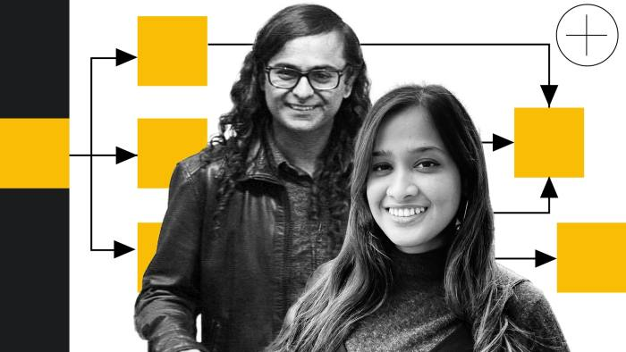
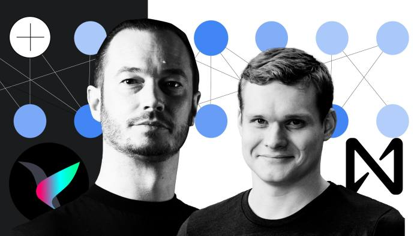
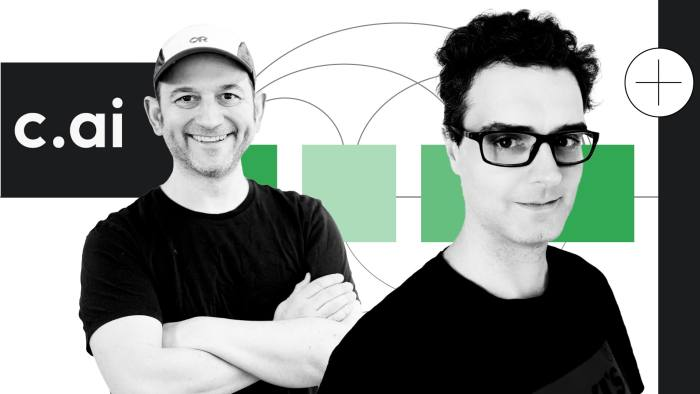
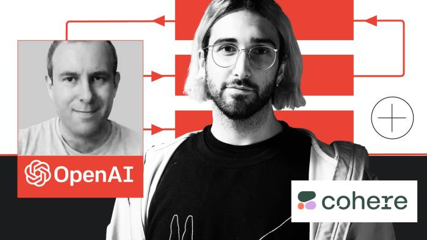

Like many breakthroughs in scientific discovery, the one that spurred an artificial intelligence revolution came from a moment of serendipity.  

就像科学发现中的许多突破一样，引发人工智能革命的突破来自一个偶然的时刻。

In early 2017, two Google research scientists, Ashish Vaswani and Jakob Uszkoreit, were in a hallway of the search giant’s Mountain View campus, discussing a new idea for how to improve machine translation, the AI technology behind Google Translate.  

2017年初，两位谷歌研究科学家Ashish Vaswani和Jakob Uszkoreit在搜索巨头山景城校园的走廊里，讨论如何改进机器翻译的新想法，这是谷歌翻译背后的人工智能技术。

The AI researchers had been working with another colleague, Illia Polosukhin, on a concept they called “self-attention” that could radically speed up and augment how computers understand language.  

人工智能研究人员一直在与另一位同事伊利亚·波洛苏欣（Illia Polosukhin）合作，研究一种他们称之为“自我注意”的概念，可以从根本上加快和增强计算机理解语言的方式。

Polosukhin, a science fiction fan from Kharkiv in Ukraine, believed self-attention was a bit like the alien language in the film _Arrival_, which had just recently been released. The extraterrestrials’ fictional language did not contain linear sequences of words. Instead, they generated entire sentences using a single symbol that represented an idea or a concept, which human linguists had to decode as a whole.  

来自乌克兰哈尔科夫的科幻迷波洛苏欣认为，自我关注有点像最近上映的电影《降临》中的外星语言。外星人的虚构语言不包含线性单词序列。相反，他们使用代表一个想法或概念的单个符号生成整个句子，人类语言学家必须将其作为一个整体进行解码。

The cutting-edge AI translation methods at the time involved scanning each word in a sentence and translating it in turn, in a sequential process. The idea of self-attention was to read an entire sentence at once, analysing all its parts and not just individual words. You could then garner better context, and generate a translation in parallel.  

当时最前沿的人工智能翻译方法包括扫描句子中的每个单词，然后依次翻译。自我注意的想法是一次阅读整个句子，分析其所有部分，而不仅仅是单个单词。然后，您可以获得更好的上下文，并并行生成翻译。

The three Google scientists surmised this would be much faster and more accurate than existing methods. They started playing around with some early prototypes on English-German translations, and found it worked.  

三位谷歌科学家推测，这将比现有方法更快、更准确。他们开始尝试一些关于英德翻译的早期原型，并发现它有效。

During their chat in the hallway, Uszkoreit and Vaswani were overheard by Noam Shazeer, a Google veteran who had joined the company back in 2000 when Google had roughly 200 employees.  

在走廊聊天时，Uszkoreit和Vaswani被Noam Shazeer无意中听到，Noam Shazeer是一位谷歌资深人士，他于2000年加入该公司，当时谷歌大约有200名员工。

Shazeer, who had helped build the “Did You Mean?” spellcheck function for Google Search, among several other AI innovations, was frustrated by existing language-generating methods, and looking for fresh ideas.  

Shazeer曾帮助为谷歌搜索构建“你的意思是？”拼写检查功能，以及其他几项人工智能创新，他对现有的语言生成方法感到沮丧，并寻找新的想法。

So when he heard his colleagues talking about this idea of “self-attention”, he decided to jump in and help. “I said, I’m with you . . . let’s do it, this is going to make life much, much better for all AI researchers,” Shazeer says.  

所以当他听到同事们谈论这种“自我关注”的想法时，他决定跳进去帮忙。“我说过，我和你在一起。让我们去做吧，这将使所有人工智能研究人员的生活变得更好，“Shazeer说。

The chance conversation formalised a months-long collaboration in 2017 that eventually produced an architecture for processing language, known simply as the “transformer”. The eight research scientists who eventually played a part in its creation described it in a short paper with a snappy title: “Attention Is All You Need.”  

这次偶然的对话在2017年正式开始了长达数月的合作，最终产生了一种用于处理语言的架构，简称为“转换器”。最终参与其创造的八位研究科学家在一篇简短的论文中描述了它，标题是活泼的：“注意力是你所需要的一切”。

One of the authors, Llion Jones, who grew up in a tiny Welsh village, says the title was a nod to the Beatles song “All You Need Is Love”. The paper was first published in June 2017, and it kick-started an entirely new era of artificial intelligence: the rise of generative AI.  

作者之一Llion Jones在威尔士一个小村庄长大，他说这个标题是对披头士乐队歌曲“All You Need Is Love”的致敬。该论文于 2017 年 6 月首次发表，开启了人工智能的全新时代：生成式人工智能的兴起。

Today, the transformer underpins most cutting-edge applications of AI in development. Not only is it embedded in Google Search and Translate, for which it was originally invented, but it also powers all large language models, including those behind ChatGPT and Bard. It drives autocomplete on our mobile keyboards, and speech recognition by smart speakers.  

如今，该变压器支撑着人工智能在开发中的最前沿应用。它不仅嵌入在最初发明的谷歌搜索和翻译中，而且还为所有大型语言模型提供支持，包括 ChatGPT 和 Bard 背后的语言模型。它驱动我们移动键盘上的自动完成功能，以及智能扬声器的语音识别。

Its real power, however, comes from the fact that it works in areas far beyond language. It can generate anything with repeating motifs or patterns, from images with tools such as Dall-E, Midjourney and Stable Diffusion, to computer code with generators like GitHub CoPilot, or even DNA.  

然而，它的真正力量来自于这样一个事实，即它在语言之外的领域发挥作用。它可以生成任何具有重复主题或图案的东西，从使用Dall-E，Midjourney和Stable Diffusion等工具的图像，到使用GitHub CoPilot等生成器甚至DNA的计算机代码。

Vaswani, who grew up in Oman in an Indian family, has a particular interest in music and wondered if the transformer could be used to generate it. He was amazed to discover it could generate classical piano music as well as the state-of-the-art AI models of the time.  

瓦斯瓦尼在阿曼的一个印度家庭长大，他对音乐特别感兴趣，他想知道变压器是否可以用来产生音乐。他惊讶地发现它可以生成古典钢琴音乐以及当时最先进的人工智能模型。

“The transformer is a way to capture interaction very quickly all at once between different parts of any input, and once it does that, it can . . . learn features from it,” he says. “It’s a general method that captures interactions between pieces in a sentence, or the notes in music, or pixels in an image, or parts of a protein. It can be purposed for any task.”  

“变压器是一种非常快速地捕获任何输入的不同部分之间的交互的方法，一旦它这样做了，它就可以......从中学习功能，“他说。“这是一种通用方法，可以捕获句子中片段之间的相互作用，或者音乐中的音符，或者图像中的像素，或者蛋白质的一部分。它可以用于任何任务。

The genesis of the transformer and the story of its creators helps to account for how we got to this moment in artificial intelligence: an inflection point, comparable to our transition on to the web or to smartphones, that has seeded a new generation of entrepreneurs building AI-powered consumer products for the masses.  

变压器的起源及其创造者的故事有助于解释我们如何在人工智能方面走到这一步：一个拐点，可与我们向网络或智能手机的过渡相媲美，它为新一代企业家构建人工智能驱动的消费产品。

But it also highlights how Google’s evolution into a large bureaucratic incumbent has stifled its ability to let entrepreneurialism flourish, and to launch new consumer products quickly. All eight authors, seven of whom spoke to the Financial Times, have now left the company.  

但它也突显了谷歌如何演变成一个庞大的官僚现任者，扼杀了它让企业家精神蓬勃发展和快速推出新消费产品的能力。所有八位作者，其中七位接受英国《金融时报》采访，现已离开公司。

## What they did next  

他们接下来做了什么

**Ashish Vaswani** (left) completed his doctorate at the University of Southern California in 2014 and joined the Google Brain team as a research scientist in 2016. In early 2022 he was a co-founder of Adept AI with Parmar, but they both left in December to co-found another AI start-up, Essential AI.  

Ashish Vaswani（左）于2014年在南加州大学获得博士学位，并于2016年加入Google Brain团队担任研究科学家。2022 年初，他与 Parmar 一起担任 Adept AI 的联合创始人，但他们都在 12 月离开，共同创立了另一家 AI 初创公司 Essential AI。

**Niki Parmar,** from Pune in western India, also studied at USC before joining Google as a software engineer. She spent four years at Google Brain, before co-founding first Adept AI, then Essential AI Labs.  

来自印度西部浦那的尼基·帕尔马（Niki Parmar）在加入谷歌担任软件工程师之前也曾在南加州大学学习。她在Google Brain工作了四年，之后共同创立了第一个Adept AI，然后是Essential AI Labs。

It is a stark illustration of the “innovator’s dilemma”, a term coined by Harvard Business School professor Clayton Christensen that explores why industry leaders get overtaken by small, emerging players. Despite gathering the world’s leading talent in deep learning and AI and creating a fertile research environment for them, Google was unable to retain the scientists it helped to train.  

这是“创新者困境”的一个鲜明例证，这是哈佛商学院教授克莱顿·克里斯滕森（Clayton Christensen）创造的一个术语，探讨了为什么行业领导者会被小型新兴企业超越。尽管谷歌聚集了深度学习和人工智能领域的世界领先人才，并为他们创造了肥沃的研究环境，但谷歌无法留住它帮助培训的科学家。

In a statement, Google said it was “proud of our industry-defining, breakthrough work on transformers and \[was\] energised by the AI ecosystem it’s created.” It acknowledged the “bittersweet” reality that, in such a dynamic environment, talented staff might choose to move on.  

谷歌在一份声明中表示，它“为我们在变压器方面的行业定义、突破性工作感到自豪，并被它创造的人工智能生态系统所激励。它承认“苦乐参半”的现实，即在这样一个充满活力的环境中，有才华的工作人员可能会选择继续前进。

The intellectual capital created has resulted in an explosion of innovation, experts say. “What came out of ‘Attention is All You Need’ is the basis for effectively every generative AI company using a large language model. I mean it’s in everything. That’s the most insane thing about it,” says Jill Chase, a partner at CapitalG, Alphabet’s growth fund, where she focuses on AI investments. “All these products exist because of the transformer.”  

专家说，创造的智力资本导致了创新的爆炸式增长。“'注意力就是你所需要的一切'的结果是每个使用大型语言模型的生成AI公司的基础。我的意思是它存在于一切中。这是最疯狂的事情，“Alphabet增长基金CapitalG的合伙人Jill Chase说，她专注于人工智能投资。“所有这些产品都是因为变压器而存在的。

## Birth of an innovation  

创新的诞生

Like all scientific advances, the transformer was built on decades of work that came before it, from the labs of Google itself, as well as its subsidiary DeepMind, the Facebook owner Meta and university researchers in Canada and the US, among others.  

像所有科学进步一样，变压器建立在谷歌本身的实验室以及其子公司DeepMind，Facebook所有者Meta以及加拿大和美国的大学研究人员等数十年的工作之上。

But over the course of 2017, the pieces clicked together through the serendipitous assembly of a group of scientists spread across Google’s research divisions.  

但在2017年期间，这些碎片通过分布在谷歌研究部门的一群科学家的偶然组装而拼凑在一起。

The final team included Vaswani, Shazeer, Uszkoreit, Polosukhin and Jones, as well as Aidan Gomez, an intern then studying at the University of Toronto, and Niki Parmar, a recent masters graduate on Uszkoreit’s team, from Pune in western India. The eighth author was Lukasz Kaiser, who was also a part-time academic at France’s National Centre for Scientific Research.  

最后的团队包括Vaswani，Shazeer，Uszkoreit，Polosukkin和Jones，以及当时在多伦多大学学习的实习生Aidan Gomez和Niki Parmar，Uszkoreit团队的最近硕士毕业生，来自印度西部的浦那。第八位作者是Lukasz Kaiser，他也是法国国家科学研究中心的兼职学者。

Each was drawn towards what was widely seen as an emerging field of AI research: natural language processing. The group’s educational, professional and geographic diversity — coming from backgrounds as varied as Ukraine, India, Germany, Poland, Britain, Canada and the US — made them unique. “To have that diverse set of people was absolutely essential for this work to happen,” says Uszkoreit, who grew up between the US and Germany.  

每个人都被吸引到被广泛视为人工智能研究的新兴领域：自然语言处理。该组织的教育、专业和地理多样性——来自乌克兰、印度、德国、波兰、英国、加拿大和美国等不同背景——使他们独一无二。“拥有这么多不同的人对于这项工作的发生是绝对必要的，”在美国和德国之间长大的Uszkoreit说。

## What they did next  

他们接下来做了什么

**Jakob Uszkoreit** (left) studied in Berlin before joining Google in 2008. He left in 2021 to co-found Inceptive, which is researching biological software to find new medicines and biotechnologies.  

Jakob Uszkoreit（左）在2008年加入谷歌之前曾在柏林学习。他于 2021 年离开，共同创立了 Inceptive，该公司正在研究生物软件以寻找新药和生物技术。

**Illia Polosukhin** studied in Kharkiv, Ukraine, before moving to California. He joined Google in 2014 but was one of the first to leave, co-founding Near, a blockchain start-up, in 2017.  

Illia Polosukhin在乌克兰哈尔科夫学习，然后搬到加利福尼亚。他于2014年加入谷歌，但他是最早离开的人之一，于2017年共同创立了区块链初创公司Near。

Uszkoreit was initially adamant he would never work in language understanding, because his father was a professor of computational linguistics. But when he came to Google as an intern, he found, much to his annoyance, that the most interesting problems in AI at the time were in language translation. Grudgingly, he followed in his father’s footsteps and ended up focusing on machine translation too.  

Uszkoreit最初坚持认为他永远不会从事语言理解工作，因为他的父亲是计算语言学教授。但当他以实习生的身份来到谷歌时，他发现，令他恼火的是，当时人工智能最有趣的问题是语言翻译。他不情愿地追随父亲的脚步，最终也专注于机器翻译。

As they all remember it, they were originally working as three separate groups on various aspects of self-attention, but then decided to combine forces. While some of the group worked on writing the initial code, cleaning data and testing it, others were responsible for creating an architecture around the models, integrating it into Google’s infrastructure to make it work efficiently, and ultimately make it easy to deploy.  

他们都记得，他们最初是作为三个独立的小组在自我关注的各个方面工作，但后来决定联合力量。虽然该小组的一些人致力于编写初始代码，清理数据并对其进行测试，但其他人负责围绕模型创建架构，将其集成到Google的基础架构中以使其高效工作，并最终使其易于部署。

“The idea for the transformer formed organically as we worked and collaborated in the office,” says Jones. Google’s colourful open-plan working environment, complete with campus bicycles, proved fruitful. “I recall Jakob \[Uszkoreit\] cycling up to my desk and scribbling a picture of a model on a whiteboard behind me and gathering the thoughts of whoever was in earshot.”  

“变压器的想法是在我们在办公室工作和协作时有机形成的，”琼斯说。事实证明，谷歌丰富多彩的开放式工作环境，以及校园自行车，硕果累累。“我记得雅各布·乌什科雷特（Jakob Uszkoreit）骑车走到我的办公桌前，在我身后的白板上写了一张模特的照片，收集了听到的人的想法。

The binding forces between the group were their fascination with language, and their motivation for using AI to better understand it. As Shazeer, the veteran engineer, says: “Text is really our most concentrated form of abstract thought. I always felt that if you wanted to build something really intelligent, you should do it on text.”  

这个群体之间的约束力是他们对语言的迷恋，以及他们使用人工智能更好地理解语言的动机。正如资深工程师Shazeer所说：“文本实际上是我们最集中的抽象思维形式。我一直觉得，如果你想构建一些真正智能的东西，你应该在文本上做。

## What they did next  

他们接下来做了什么

**Noam Shazeer** (left) was a longtime Google employee, working for them between 2000 and 2009, then again from 2012 to 2021. He left to co-found Character.ai, which creates personalised chatbots  

Noam Shazeer（左）是谷歌的长期员工，在 2000 年至 2009 年期间为他们工作，然后从 2012 年到 2021 年再次为他们工作。他离开了共同创立 Character.ai，该公司创建了个性化的聊天机器人。

**Llion Jones,** a Welsh computer science graduate, went to work for Google in 2012 as a software engineer, at first for YouTube. He was working for Google Japan until this month, when he said he was leaving to found a start-up.  

威尔士计算机科学毕业生Llion Jones于2012年前往谷歌工作，担任软件工程师，最初在YouTube工作。他一直在谷歌日本工作，直到本月，他说他要离开去创办一家初创公司。

The model published in the paper was a simple, pared-back version of the original idea of self-attention. Shazeer found it worked even better this way, when stripped of any bells and whistles they had tried to add on. The model code provided the starting point, but extensive fine-tuning was required to make it run on graphics processing units, the hardware best suited to deep learning technology like the transformer.  

论文中发表的模型是自我注意原始想法的简单，精简版本。Shazeer发现这种方式效果更好，当剥离他们试图添加的任何花里胡哨的东西时。模型代码提供了起点，但需要大量的微调才能使其在图形处理单元上运行，图形处理单元是最适合深度学习技术（如变压器）的硬件。

“In deep learning, nothing is ever just about the equations. It is how you . . . put them on the hardware, it’s a giant bag of black magic tricks that only very few people have truly mastered,” Uszkoreit says.  

“在深度学习中，没有什么只是关于方程的。这就是你的方式。把它们放在硬件上，这是一个巨大的黑魔法技巧袋，只有极少数人真正掌握，“Uszkoreit说。

Once these were applied, primarily by Shazeer whom one of his co-authors calls “a wizard”, the transformer began to improve every task it was thrown at, in leaps and bounds.  

一旦这些被应用，主要是由Shazeer，他的一位合著者称之为“巫师”，变形金刚开始突飞猛进地改进它所投入的每一项任务。

Its benefit was that it allowed computations to be made in parallel, and packed them into far fewer mathematical operations than other methods, making them faster and more efficient. “It is just very simple and overall, the model is very compact,” says Polosukhin.  

它的好处是它允许并行进行计算，并将它们打包到比其他方法少得多的数学运算中，使它们更快、更高效。“它非常简单，总的来说，模型非常紧凑，”Polosukhin说。

A peer-reviewed version of the paper was published in December 2017, just in time for NeurIPS, one of the most prestigious machine learning conferences held in southern California that year. Many of the transformers authors remember being mobbed by researchers at the event when displaying a poster of their work. Soon, scientists from organisations outside Google began to use transformers in applications from translation to AI-generated answers, image labelling and recognition. At present, it has been cited more than 82,000 times in research papers.  

该论文的同行评审版本于 2017 年 12 月发表，正好赶上 NeurIPS，这是当年在南加州举行的最负盛名的机器学习会议之一。许多变形金刚的作者都记得在活动中被研究人员围攻时展示他们的作品海报。很快，来自谷歌以外组织的科学家开始在从翻译到人工智能生成的答案、图像标签和识别的应用中使用变压器。目前，它在研究论文中被引用超过82，000次。

   

Lukasz Kaiser and Illia Polosukhin at the NeurIPS conference poster session just after the publication of the paper. The transformer poster can be seen in the background © Jakob Uzkoreit  

Lukasz Kaiser和Illia Polosukhim在论文发表后的NeurIPS会议海报会议上。背景中可以看到变形金刚海报雅©各布·乌兹科雷特

“There was a Cambrian explosion in both research and practical applications of the transformer,” Vaswani says, referring to the moment 530mn years ago when animal life rapidly flourished. “We saw it advancing neural machine translation, \[language model\] BERT appeared, which made its way to Search — that was a very important moment for practical AI, when the transformer entered Google Search.”  

“在变压器的研究和实际应用中都发生了寒武纪大爆发，”瓦斯瓦尼说，指的是53000万年前动物生命迅速繁荣的那一刻。“我们看到它推进了神经机器翻译，\[语言模型\] BERT出现了，它进入了搜索 - 这是实用AI的一个非常重要的时刻，当变压器进入谷歌搜索时。

After the paper was published, Parmar found the transformer could generate long Wikipedia-like pages of text, which previous models had struggled with. “And we already knew \[then\] that you could never have done anything like that before,” she says.  

论文发表后，Parmar发现变压器可以生成类似维基百科的长文本页面，这是以前的模型一直在努力解决的。“我们已经知道（那时）你以前不可能做这样的事情，”她说。

Parmar also recognised one of the key properties of transformers: that when you scaled them up, by giving them more and more data, “they were able to learn much better”. They pointed the way to the advent of large models such as GPT-4, which have far better reasoning and language capabilities than their predecessors.  

Parmar还认识到变压器的关键特性之一：当你扩大变压器的规模时，通过给它们越来越多的数据，“它们能够更好地学习”。他们为GPT-4等大型模型的出现指明了道路，这些模型的推理和语言能力比它们的前辈要好得多。

“The general theme was that transformers just seemed to work much better than \[previous models\] right out of the box on whatever people threw them at,” says Jones. “This is what I think caused the snowball effect.”  

“总的主题是，变压器似乎比\[以前的型号\]开箱即用，无论人们扔什么，都能工作得更好，”琼斯说。“这就是我认为导致滚雪球效应的原因。

## Life beyond Google 谷歌之外的生活

In the aftermath of the transformer model being published widely, the researchers had begun to feel impatient about pushing their ideas out into the market.  

在变压器模型被广泛发表之后，研究人员开始对将他们的想法推向市场感到不耐烦。

The pace of AI research was picking up, particularly in areas such as generating text and images using transformers, but many of the contributions were coming from outside Google, from start-ups like OpenAI.  

人工智能研究的步伐正在加快，特别是在使用变压器生成文本和图像等领域，但许多贡献来自谷歌之外，来自OpenAI等初创企业。

Each of the co-authors who spoke to the FT said they wanted to discover what the toolbox they had created was capable of. “The years after the transformer were some of the most fertile years in research. It became apparent . . . the models would get smarter with more feedback,” Vaswani says. “It was too compelling not to pursue this.”  

与英国《金融时报》交谈的每一位合著者都表示，他们想发现他们创建的工具箱能够做什么。“变压器之后的几年是研究领域最肥沃的几年。很明显。。。随着更多的反馈，模型会变得更聪明，“Vaswani说。“不追究这个太迫在眉睫了。”

But they also found that Google was not structured in a way that allowed for risk-taking entrepreneurialism, or launching new products quickly. It would require building a “new kind of software . . . computers you can talk to,” Vaswani adds. “It seemed easier to bring that vision to light outside of Google.” He would eventually leave in 2021.  

但他们也发现，谷歌的结构不允许冒险创业，或者快速推出新产品。这将需要构建一种“新型软件......你可以与之交谈的计算机，“瓦斯瓦尼补充道。“在谷歌之外实现这一愿景似乎更容易。他最终将在2021年离开。

Polosukhin left early on, in 2017, to found a start-up called Near whose original idea was to use AI to teach computers to code but has since pivoted to blockchain payments.  

Polosukhin在2017年离开了，成立了一家名为Near的初创公司，其最初的想法是使用人工智能来教计算机编码，但后来转向区块链支付。

Gomez, the youngest and most inexperienced, was the next to get restless. The Canadian undergraduate, who has a passion for fashion and design, interned for Kaiser (who has since left to join OpenAI), and found himself at the forefront of exciting new research on language understanding.  

戈麦斯是最年轻、最缺乏经验的，是下一个变得焦躁不安的人。这位对时尚和设计充满热情的加拿大本科生为Kaiser实习（他后来离开加入OpenAI），并发现自己处于令人兴奋的语言理解新研究的最前沿。

“The reason why I left Google was that I actually didn’t see enough adoption in the products that I was using. They weren’t changing. They weren’t modernising. They weren’t adopting this tech. I just wasn’t seeing this large language model tech actually reach the places that it needed to reach,” he says.  

“我离开谷歌的原因是，我实际上并没有看到我正在使用的产品得到足够的采用。他们没有改变。他们没有现代化。他们没有采用这项技术。我只是没有看到这种大型语言模型技术实际上到达了它需要到达的地方，“他说。

In 2019, he quit Google to found Cohere, a generative AI start-up that is valued at more than $2bn, with investment from Nvidia, Oracle and Salesforce, among others. Gomez is interested in applying large language models to business problems from banking and retail to customer service. “For us, it’s about lowering the barrier to access,” he says. “Every developer should be able to build with this stuff.”  

2019年，他离开谷歌，创立了Cohere，这是一家价值超过20亿美元的生成式人工智能初创公司，投资来自英伟达、甲骨文和Salesforce等。Gomez 对将大型语言模型应用于从银行和零售到客户服务的业务问题感兴趣。“对我们来说，这是为了降低访问门槛，”他说。“每个开发人员都应该能够用这些东西进行构建。

## What they did next  

他们接下来做了什么

**Lukasz Kaiser** (left) studied in Poland and Germany and worked as a researcher for the French National Centre for Scientific Research. He joined Google in 2013. In 2021 he left to become a researcher at OpenAI.  

Lukasz Kaiser（左）曾在波兰和德国学习，并在法国国家科学研究中心担任研究员。他于2013年加入谷歌。2021 年，他离开，成为 OpenAI 的研究员。

**Aidan Gomez,** then a student at the University of Toronto, was an intern at Google Brain, working closely with Lukasz Kaiser. In 2019, he co-founded Cohere, a Toronto-based start-up that applies AI to business problems.  

当时多伦多大学的学生艾丹·戈麦斯（Aidan Gomez）是Google Brain的实习生，与Lukasz Kaiser密切合作。2019年，他共同创立了Cohere，这是一家总部位于多伦多的初创公司，将人工智能应用于业务问题。

Uszkoreit, meanwhile, decided to use the transformer in an entirely different field. His start-up Inceptive is a biotech company that is designing “biological software” using deep learning techniques. “If you think of computer software, it’s programming something executable . . . there’s a program that’s then converted into software that runs on your computer,” he says. “We want to do that but with cells in your body.”  

与此同时，Uszkoreit决定在完全不同的领域使用变压器。他的初创公司Inceptive是一家生物技术公司，使用深度学习技术设计“生物软件”。“如果你想到计算机软件，它就是编程一些可执行的东西......有一个程序然后转换为在计算机上运行的软件，“他说。“我们想这样做，但要用你体内的细胞。

The company has already delivered AI-designed molecules for infectious disease vaccines to a large pharmaceutical company. “I am convinced it is by far the best way to build on what I had been working on over the last decade to improve and maybe even save people’s lives,” Uszkoreit says.  

该公司已经向一家大型制药公司交付了人工智能设计的传染病疫苗分子。“我相信这是迄今为止在过去十年中一直在努力改善甚至挽救人们生命的最佳方式，”Uszkoreit说。

Shazeer moved on from Google in 2021 after two decades to co-found Character.ai, a company that allows users to build chatbots of their own characters, from the Buddha to Julius Caesar or Japanese anime. “It seems that it’s kind of difficult to launch products at a large company . . . start-ups can move faster,” he says. The company, where he is chief executive, was recently valued at $1bn.  

二十年后，Shazeer 于 2021 年离开谷歌，共同创立了 Character.ai，这是一家允许用户构建自己角色的聊天机器人的公司，从佛陀到凯撒大帝或日本动漫。“似乎在一家大公司推出产品有点困难......初创企业可以发展得更快，“他说。他担任首席执行官的这家公司最近估值为10亿美元。

Vaswani and Parmar left at the same time in 2021, and have since partnered to found a new company called Essential.ai, which works on AI applications in business. The start-up is still in stealth, although it has raised $8mn from Thrive Capital, an early investor in Instagram, Slack and Stripe.  

瓦斯瓦尼和帕尔马于 2021 年同时离开，此后合作成立了一家名为 Essential.ai 的新公司，该公司致力于商业中的人工智能应用。这家初创公司仍处于隐形状态，尽管它已经从Instagram，Slack和Stripe的早期投资者Thrive Capital筹集了800万美元。

“Google was an amazing place, but they wanted to optimise for the existing products . . . so things were moving very slowly,” says Parmar. “I wanted to take this very capable technology, and build new novel products out of it. And that was a big motivation to leave.”  

“谷歌是一个了不起的地方，但他们想针对现有产品进行优化......所以事情进展得非常缓慢，“帕尔马说。“我想利用这项非常强大的技术，并用它制造新的新产品。这是离开的一大动力。

Many of the co-authors still communicate frequently, celebrating each other’s successes and supporting one another through the unique challenges of being start-up entrepreneurs.  

许多合著者仍然经常交流，庆祝彼此的成功，并在作为初创企业家的独特挑战中相互支持。

If the transformer was a big bang moment, now a universe is expanding around it, from DeepMind’s AlphaFold, which predicted the protein structure of almost every known protein, to ChatGPT, which Vaswani calls a “black swan event”.  

如果说变压器是一个大爆炸时刻，那么现在一个宇宙正在围绕它膨胀，从DeepMind的AlphaFold，它预测了几乎所有已知蛋白质的蛋白质结构，到ChatGPT，Vaswani称之为“黑天鹅事件”。

This has led to a period that Silicon Valley insiders call a technology overhang — time that industries will spend integrating the latest AI developments into products, even if research does not progress at all.  

这导致了一个被硅谷内部人士称为技术悬而未决的时期——即使研究根本没有进展，行业也将花费这些时间将最新的人工智能发展整合到产品中。

“You are seeing the aftermath — AI is drawing in researchers, technologists, builders and product folks. Now we believe there is a tech overhang . . . and there is a lot of value to be realised in various products,” Vaswani says. “In some sense that is why we all dispersed and tried to put this technology directly in people’s hands.”  

“你正在看到后果——人工智能正在吸引研究人员、技术人员、建设者和产品人员。现在我们认为存在技术悬而未决的问题。 。 。在各种产品中有很多价值可以实现，“Vaswani说。“从某种意义上说，这就是为什么我们都分散并试图将这项技术直接交到人们手中的原因。
