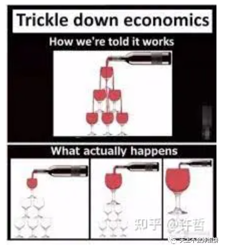

作者：许哲

链接：zhihu.com/question/613540384/answer/31315535

来源：知乎  

著作权归作者所有。商业转载请联系作者获得授权，非商业转载请注明出处。

出现「富人通胀，穷人通缩」的根本原因是：现代金融体系创造货币的方式是创造信贷，而富人获得信贷的能力要远胜于穷人；经济周期下行的时候，富人拥有信贷额度大幅提升而不是利润，并不会以工资奖金的形式转移到穷人，所以形成了这个局面。  

上面的是简单的概括，如果有耐心，下面我试着阐释一下。

现代金融体系的财务原理决定了不存在纯粹意义上的「印钞」。中央银行要扩大自己的资产负债表（[许哲：缩表是什么鬼？](http://mp.weixin.qq.com/s?__biz=MzA4MTQwMzQ2Ng==&mid=2648455321&idx=1&sn=2f65ea4193c2d7211e2617853660fd54&chksm=87bd13bcb0ca9aaaeaf8576756bad1915829a959aa6a315131637ab7da19cf4269d309beccdb&scene=21#wechat_redirect)）必须有发行新的货币对应的资产。每发行一笔基础货币，就会有对应的信贷行为，可以理解为央行放了一笔贷款，有对应的抵押资产的，是一个创造信贷的过程。

说得再直白一点：**所谓的央行印钞不是某个人的账户上忽然凭空多了一笔钱****，而是中央银行借给了一家银行一笔钱**，而这家银行再借出去，这笔借贷以后是要还的。打个比方，印钞是你的花呗额度突然提升了，而不是你的余额宝突然变更有钱了。

这个投放货币的过程是有一个顺序的，通常是：中央银行->大银行（政策银行或者大商行）-> 一般商业银行->企业 or 个人。

比如央行发行一笔MLF什么的给大银行，然后小银行和大银行做一笔同业存款这类的，然后小银行再给自己的客户放贷。本质上是借贷者欠小银行，小银行欠大行，大行欠央行这么一个关系。这些钱，最后都是要还的，每个环节上出问题，都是要有人负责的。那么作为信贷头发的末端，商业银行要考虑的事情是客户是否有还贷的保障。这个保障最主要的是看抵押资产的质量，而非其他。这恰恰是富人拥有而穷人不具备的。

更加具象化一点的是，如果某老板实控了一家上市公司，有一个公开的估值，那么他会比其他所有人更容易获得信贷。如果你家里有十八套房子，其中八套在北上广深，那么你会比还在还唯一自住房房贷的人更容易获得信贷。或者你有一个工厂有很多订单，海关纳税什么的流水数据有，那么你也很有可能获得信贷。而穷人，除了砍头息高利贷，金融机构对你是没兴趣的。

货币本身就是中央银行的信用，**货币的本质就是债，获得负债的能力等于被投放货币的能力。**有资产的人有创造信贷的资本，所以他们就会有更多的「通货」。

当经济有下行压力的时候，央行会大力投放信贷，也就是扩表，那么这个时候大量的信贷也就是创造出来的通货（钱）就会在有资产的人里通胀起来。故而，只要创造信贷的方式创造货币，或者说信用货币体系的制度设计是当下这样的，那么一定会造成富人在货币扩张时期通货膨胀。

_这就是问题的前半段，为什么会出现「富人通胀」的原因。_

富人获得了信贷，得到了「通货的膨胀」，那么他们作为企业主，是不是会通过自己的消费和给员工发放工资奖金的形式让没有掌握资本的人也享受「涓滴效应」呢？

制度设计的原意就是希望发生这样的「涓滴效应」，实际上并不会真的发生。反而会形成「富人通胀，穷人通缩」的现象。这是为什么呢？

因为央行「大撒币」的原因是企业的利润率普遍下降的经济下行周期的一种对冲行为，**撒得越离谱的时候恰恰是企业普遍不赚钱的时候。**富人通胀的原因是信贷额度的突然提升，**是借钱变得特别容易了，而不是自己的利润突然提高了。**那么作为富人，理智的选择是给自己的员工提高薪酬吗？仅当本业欣欣向荣的时候这样做提升员工的士气和忠诚度才是理智的，也可以理解为一种投资行为。而经济下行周期非常不景气的时候，肉眼可见本业凋零的情况下获得大量廉价信贷的反应只能是炒作资产，且只炒作富人才有可能成为最终消费者的资产。

当富人的心思全在于用央行的信贷大宽松用于投机炒作而非江河日下的本业时，没有被信贷投放的穷人只有越发穷困，也就是「穷人通缩」。而穷人通缩又会造成消费的下降，消费的下降恰又是企业的利润更差的起因，这又进一步加强了富人无心主业，只想把便宜信贷用于非经营性投机上。

归根结底，央行只能做到信贷额度的提升，借贷更宽松，而做不到凭空提升企业的利润率。

把「富人通胀，穷人通缩」的现象可以更形象的近似成银行追着老板借钱给他，希望他努力发展本业，但老板看着每况愈下的生意又舍不得便宜到近乎免费的钱，决定先捏着炒作一把。

央行对冲经济周期的下行的努力是可以理解的，但指望设计出一个央行的制度就能把经济周期神奇抹除，是异想天开的。

经济周期就在那里，无论你喜欢不喜欢。

货币或许能凭空创造，但财富不能。信贷周期能调控，但经济周期不能。
