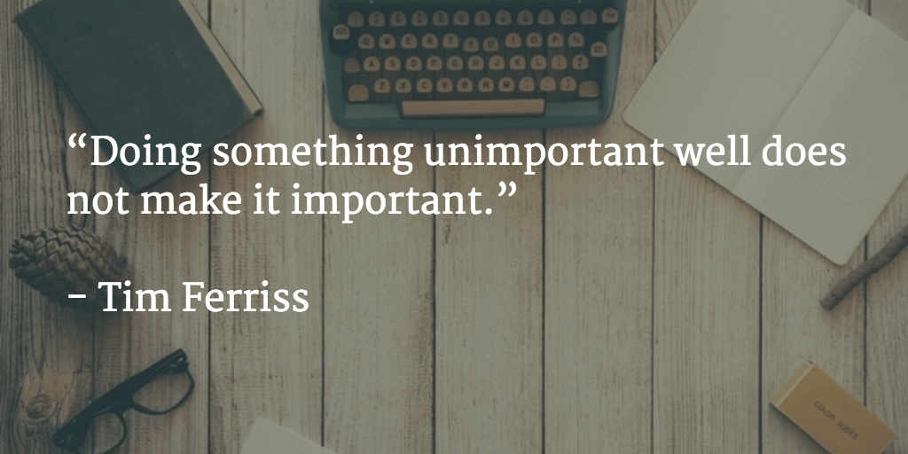
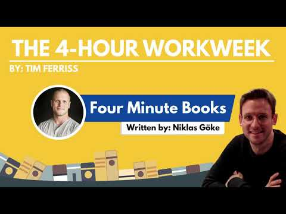

**1-Sentence-Summary:** _[The 4-Hour Workweek](https://www.goodreads.com/book/show/368593.The_4_Hour_Workweek) is the step-by-step blueprint to free yourself from the shackles of a corporate job, create a business to fund the lifestyle of your dreams, and live life like a millionaire, without actually having to be one._  

1-句子-总结：每周工作4小时是一个循序渐进的蓝图，可以让你摆脱公司工作的束缚，创建一个企业来资助你梦想的生活方式，像百万富翁一样生活，而不必真正成为一个百万富翁。

**Read in:** 4 minutes  

阅读时间：4分钟

**Favorite quote from the author:  

作者最喜欢的名言：**

___

## Video Summary 视频摘要

Was I late to the party because I read this book in 2013? Sure. About 6 years late, to be exact. But that didn’t make it any less of an eye-opener to me.  

我迟到是因为我在2013年读了这本书吗？当然可以。准确地说，晚了六年。但这并没有让我大开眼界。

[Tim Ferriss](https://tim.blog/about/) needs no introduction. He’s like a digital Indiana Jones, and this was the book that brought him on to our screens.  

蒂姆·费里斯无需介绍。他就像一个数字版的印第安纳州琼斯，正是这本书把他带到了我们的屏幕上。

Written more out of frustration, much less than for the love of writing, this book is Tim’s documentation of how he removed himself from his own company, in order to do what he loves: learn and travel.  

写这本书更多的是出于挫折，而不是出于对写作的热爱，这本书是蒂姆如何离开自己的公司的文件，为了做他喜欢的事情：学习和旅行。

It’s almost impossible to pull out just 3 things from this book, but I’ll do it anyway:  

从这本书中抽出三件事几乎是不可能的，但无论如何我都会这样做：

1.  Be effective, not efficient.  
    
    要有效率，不要有效率。
2.  Validate all of your business ideas.  
    
    验证你所有的商业想法。
3.  Charge a premium to make your life easier.  
    
    收取额外费用，让您的生活更轻松。

Let’s dig a bit deeper.  

让我们再深入一点。

## The 4-Hour Workweek Summary  

4小时工作周总结

**If you want to save this summary for later, download the free PDF and read it whenever you want.  

如果您想保存此摘要供以后使用，请下载免费的PDF并随时阅读。**

[Download PDF   下载PDF](https://pages.convertkit.com/dba85d4fc7/a8c60b00b5)

### Lesson 1: Be effective, not efficient.  

第一课：要有效率，不要有效率。

If Tim’s life was designed around one rule, it would be the 80/20 rule or [Pareto principle](https://en.wikipedia.org/wiki/Pareto_principle). **Most people measure productivity by the time spent working**, but that’s a bad indicator, because we waste so much time at work.  

如果蒂姆的生活是围绕一个规则设计的，那就是80/20规则或帕累托原则。大多数人通过工作时间来衡量生产力，但这是一个糟糕的指标，因为我们在工作中浪费了太多时间。

Tim suggests to spend your time effectively: on the 20% of things that get you 80% of the results, and not vice versa.  

蒂姆建议有效地利用你的时间：20%的事情会给你带来80%的结果，反之亦然。

A famous quote of his is this: [“Doing something unimportant well does not make it important”](http://www.azquotes.com/quote/1384716). So instead of focusing on doing as much as you can as best as you can, just **focus on doing the few things that will lead to the biggest progress**.  

他的一句名言是这样的：“把不重要的事情做好并不意味着它重要。所以，不要把注意力集中在尽你所能做的最好的事情上，而要把注意力集中在能带来最大进步的几件事情上。

This is one of Tim’s major mantras in life and something you can adopt today that will make every single day of your life from here on out slightly better and easier.  

这是蒂姆在生活中的主要咒语之一，你今天就可以采纳它，它会让你生活中的每一天都变得更好、更轻松。

### Lesson 2: Always validate your business ideas.  

第2课：永远验证你的商业想法。

[Funny I mentioned him yesterday](http://fourminutebooks.com/hooked-summary/), but this lesson really sank in when I read [Noah Kagan’s guest post on Tim’s blog](http://fourhourworkweek.com/2011/09/24/how-to-create-a-million-dollar-business-this-weekend-examples-appsumo-mint-chihuahuas/). Before you go out and build any product or service, **make sure people give you money for it.**  

有趣的是，我昨天提到了他，但是当我在蒂姆的博客上读到诺亚·卡根的客座文章时，我真的明白了这一点。在你出去开发任何产品或服务之前，确保人们为你提供资金。

Will your idea for knitted coffee cosies be a hit? I don’t know, so go ask people to buy from you! This is more of a [comfort zone challenge](http://niklasgoeke.com/comfort-zone-challenge/) than anything else, and it’s scary – **which is a good indicator that it’s important**.  

你的针织咖啡套的想法会受到欢迎吗？我不知道，所以去问别人买你的！这比其他任何事情都更像是一个舒适区的挑战，而且很可怕--这是一个很好的指标，表明它很重要。

2 personal examples from 2015: First, a friend approached me with an idea for a shoe business. We would solve the following problem: **People have different sized feet. They need one shoe in one size, and the other in another size.**  

2015年的两个例子：首先，一位朋友向我提出了一个做鞋子生意的想法。我们将解决以下问题：人们有不同大小的脚。他们需要一只鞋在一个尺寸，另一个在另一个尺寸。

Our idea was to go to shoe manufacturers, collect all the leftovers in different sizes, pair them up and sell them for cheap. To validate, we asked all of our friends and family, who had this problem, whether they’d pay for odd-sized shoes.  

我们的想法是去鞋厂，收集所有不同尺寸的剩菜，把它们配对，然后便宜地卖掉。为了验证这一点，我们询问了所有有这种问题的朋友和家人，他们是否愿意为奇数码的鞋子付钱。

What’s more, we went into 10+ shoe stores and asked them if people approach them with this problem.  

更重要的是，我们走进了10多家鞋店，询问他们是否有人向他们提出这个问题。

The answer: **no.** No one cares, people just take the bigger pair and live with it, [it’s not big enough of an issue](http://okdork.com/resources/validate-business/).  

答案是：没有。没人在乎，人们只是拿了大一点的，然后和它一起生活，这还不够大。

Late in 2015 I wanted to create my first proper digital product. A course. So to test the idea, I [created a landing page](http://niklasgoeke.usefedora.com/courses/do-more-stress-less/), held a webinar, and tried to pre-sell it. **I sold 0 copies of the course, but that was no problem, because I hadn’t even built it yet**.  

2015年底，我想创造我的第一个真正的数字产品。一门课程。所以为了测试这个想法，我创建了一个登陆页面，举办了一个网络研讨会，并试图预售它。我卖了0份课程，但这不是问题，因为我甚至还没有建立它。

Remember: ABV – always be validating!  

记住：ABV -始终验证！

### Lesson 3: Charge a premium to need less clients and make your life easier.  

第三课：收取额外费用，减少客户需求，让你的生活更轻松。

Once you have validated your product and are set to start production, the next big question often is: Do I want to be high quality or the cheapest guy around?  

一旦你验证了你的产品并准备开始生产，下一个大问题通常是：我想成为高品质还是最便宜的人？

Answer: **You want to be high quality. Always.**  

答：你想成为高质量的人。一直都是

Imagine you want to make $4,000/month, and are selling a nutritional supplement, [like this one](http://www.greenpasture.org/public/Products/CodLiverOil/). If you charge $10 per bottle, you need to generate 400 sales per month.  

想象一下，你想每月赚4,000美元，并且正在销售营养补充剂，就像这样。如果你每瓶收费10美元，你需要每月产生400个销售额。

If you charge $40 per bottle, you only have to make 100 sales. **The hardest part of making a sale is moving people from not giving you money to giving you money**.  

如果你每瓶卖40美元，你只需要卖出100瓶。做销售最难的部分是让人们从不给你钱变成给你钱。

The amount of money is very negotiable once they’ve made the decision to purchase from you. I bet you can find 100 people who are willing to give you 4x the money much faster than you can get an extra 300 people to buy from you in the first place.  

一旦他们决定从你这里购买，金额是可以商量的。我敢打赌，你可以找到100个愿意给予你4倍钱的人，这比你一开始就能找到额外的300个人从你这里买东西要快得多。

**Note:** You can easily do this pricing math for any potential product with [Neville Medhora’s cool pricing calculator.](http://kopywritingkourse.com/product-pricing-calculator/)  

注意：你可以很容易地做这个定价数学任何潜在的产品与内维尔Medhora的冷静定价计算器。

That’s the first reason you should shoot for high quality and charge a premium. The second reason is that the people that are willing to pay a premium are **low-hassle clients**.  

这是你应该拍摄高质量并收取溢价的第一个原因。第二个原因是，愿意支付溢价的人是低麻烦的客户。

You will get a lot less complaints, returns and angry phone calls. Even if they don’t like it, chances are they won’t bother returning it, because they don’t have to turn every cent twice before spending it.  

你会得到更少的投诉，退货和愤怒的电话。即使他们不喜欢它，他们也不会费心去归还它，因为他们不必在花之前把每一分钱都翻两遍。

So promise high quality and deliver!  

所以承诺高品质和交付！

## Want More? Try Blinkist Risk-Free for 7 Days!  

想要更多？试用Blinkist无风险7天！

## Get access to 6,500+ book summaries, audios, shortcasts, and much more! You'll even get 35% off if you decide to stick around.  

获取6，500+图书摘要、音频、短片等！如果你决定留下来，你甚至会得到35%的折扣。  

****[**Start My Risk-Free Trial »**](https://fourminutebooks.com/go/eop/)****  

开始我的无风险试用»

## **The 4-Hour Workweek Review  

4小时工作周回顾**

I read the entire book in a few sittings. I can’t believe someone compiled all the information in it in such an encompassing way back in 2007. That’s what has most shocked me about it.  

我坐了几次就把整本书读完了。我不敢相信有人在2007年以这样一种包罗万象的方式汇编了所有的信息。这就是最让我震惊的地方。

[Blinkist’s](https://fourminutebooks.com/what-is-blinkist/) summary is crammed with insights, but is still only an excerpt of the plethora of great info in the book. Tim created a great step-by-step structure with lots of resources, links and tools, like the dreamline worksheet or the comfort challenges at the end of each chapter.  

Blinkist的总结充满了见解，但仍然只是书中大量伟大信息的摘录。蒂姆创建了一个很好的循序渐进的结构，有很多资源、链接和工具，比如dreamline工作表或每章末尾的舒适挑战。

If you’ve entertained the idea of what your life could look like if you didn’t _have_ to work, or could be a lot more picky about the projects you do take on, because you rest comfortably on a big, financial cushion, this is a must read.  

如果你曾经想过如果你不用工作，你的生活会是什么样子，或者你对你所做的项目会更加挑剔，因为你舒适地躺在一个大的财政缓冲上，这是一本必读的书。

## **Who would I recommend the 4-Hour Workweek summary to?  

我会向谁推荐4小时工作周摘要？**

The 17 year old who has a tough time to make up her mind about taking a year off before college to travel and explore, the 31 year old graduate who’s a few years into his corporate career and starts to question whether this is what he wanted, and anyone who’s ever tried to sell something that was a flop.  

17岁的她很坚韧下定决心在大学前休一年假去旅行和探索，31岁的毕业生在他的企业生涯中已经有几年了，并开始质疑这是否是他想要的，以及任何试图出售失败的东西的人。

Last Updated on July 27, 2022  

最后更新于2022年7月27日

Rate this book! 评价这本书！

This book has an average rating of 4.3 based on 31 votes.  

这本书的平均评分为4.3，基于31票。
