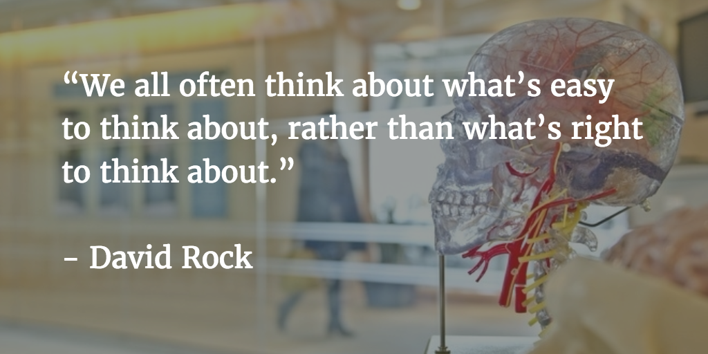

**1-Sentence-Summary:** _[Your Brain At Work](https://www.goodreads.com/book/show/6899290-your-brain-at-work) helps you overcome the daily challenges that take away your brain power, like constant email and interruption madness, high levels of stress, lack of control and high expectations, by showing you what goes on inside your head and giving you new approaches to control it better._  

1-句子-总结：你的大脑在工作，帮助你克服日常挑战，剥夺你的脑力，如不断的电子邮件和中断疯狂，高水平的压力，缺乏控制和高期望，通过告诉你你的大脑内部发生了什么，并给你新的方法来更好地控制它。

**Read in:** 4 minutes  

阅读时间：4分钟

**Favorite quote from the author:  

作者最喜欢的名言：**

[Dr. David Rock](http://www.davidrock.net/about/) is an expert when it comes to the state of high performance. He’s trained over 10,000 people thanks to his background in neuroscience and leadership and showed them how to get the most out of their brain.  

大卫Rock博士是高性能状态的专家。由于他在神经科学和领导力方面的背景，他培训了超过10，000人，并向他们展示了如何最大限度地利用大脑。

_[Your Brain At Work](https://www.goodreads.com/book/show/6899290-your-brain-at-work)_ is his most popular book, which dives into the brains of Emily and Paul, two fictional characters. As they go through their day they face a lot of challenges, like information overload, lack of focus, emotions boiling over and trying to give feedback to others without criticizing them.  

《你的大脑在工作》是他最受欢迎的一本书，该书深入探讨了艾米丽和保罗这两个虚构人物的大脑。当他们度过他们的一天时，他们面临着很多挑战，比如信息过载，缺乏注意力，情绪沸腾，试图在不批评他人的情况下向他人给予反馈。

The book breaks apart what happens in the human brain in situations like these and helps you deal with those very same challenges in a better way in your own life.  

这本书打破了人类大脑在这样的情况下发生的事情，并帮助你在自己的生活中以更好的方式处理那些非常相同的挑战。

Neither Emily nor Paul have made it into Blinkist’s summary of the book, but there’s still a lot to learn from it. Here are the 3 lessons I liked best:  

艾米丽和保罗都没有进入布林克斯特对这本书的总结，但仍然有很多东西可以从中学习。以下是我最喜欢的三个教训：

1.  Your ability to think is limited, so don’t multitask.  
    
    你的思考能力有限，所以不要一心多用。
2.  When you compete against your own self from the day before, you boost your brain power.  
    
    当你和前一天的自己竞争时，你提高了你的脑力。
3.  Don’t give feedback, help others find the answer on their own.  
    
    给予，帮助别人自己找到答案。

Ready to kick your [brain](http://fourminutebooks.com/my-stroke-of-insight-summary/) into the next gear? Time to learn!  

准备好让你的大脑进入下一轮了吗？是时候学习了！

**If you want to save this summary for later, download the free PDF and read it whenever you want.  

如果您想保存此摘要供以后使用，请下载免费的PDF并随时阅读。**

[Download PDF   下载PDF](https://pages.convertkit.com/059c55ce78/df4a4fd309)

## Lesson 1: Your ability to think is limited, just like your willpower, so remove distractions and don’t multitask.  

第一课：你的思考能力是有限的，就像你的意志力一样，所以要消除分心的东西，不要一心多用。

You might know that [your willpower is limited](http://fourminutebooks.com/willpower-summary/), and that all you can do to get it back after a long tiring day is rest, get plenty of sleep and recover.  

你可能知道你的意志力是有限的，在漫长的疲惫的一天之后，你所能做的就是休息，充足的睡眠和恢复。

Well, your ability to think and solve problems is the same.  

你思考和解决问题的能力是一样的。

[A study way back from 1898](http://psychclassics.yorku.ca/Triplett/) had its participants exert physical force on something called a [dynamometer](https://en.wikipedia.org/wiki/Dynamometer), while solving a tough mental task in their head.  

早在1898年，一项研究让参与者在一个叫做测力计的东西上施加体力，同时在他们的头脑中解决一项坚韧的脑力任务。

When people thought hard about the problem they had to solve, they lost up to 50% of their physical force.  

当人们努力思考他们必须解决的问题时，他们失去了多达50%的体力。

Yes, thinking is exhausting, and eventually, **your brain needs to take a break**.  

是的，思考是令人疲惫的，最终，你的大脑需要休息一下。

Things get even worse if you multitask (lucky for you [I wrote the number 1 guide on the web to stop doing it](http://niklasgoeke.com/focus-on-what-matters/)), [it lowers your IQ by up to 10 points](http://www.forbes.com/sites/travisbradberry/2014/10/08/multitasking-damages-your-brain-and-career-new-studies-suggest/).  

如果你一心多用，事情会变得更糟（幸运的是，我在网上写了一个第一指南，让你停止这样做），它会降低你的智商高达10分。

The effect is similar to missing a night’s sleep and is caused by your brain being in “alert mode” for too long, until it loses its grip on things.  

这种效果类似于一夜不眠，是由于你的大脑长时间处于“警觉模式”，直到它失去对事物的控制。

Rock suggests 2 solutions to this:  

Rock对此提出了两个解决方案：

1.  Ruthlessly [prioritize your tasks](http://productivityist.com/essentialism-get-work-done/) (which is a thinking act in itself and will take a mental toll, so do it in the morning when you’re still fresh).  
    
    无情地把你的任务排在优先级（这本身就是一种思考行为，会给你带来精神上的损失，所以在早上你精神充沛的时候再做）。
2.  Turn your [most important tasks](http://niklasgoeke.com/mit/) into habits and let them run on autopilot, thus conserving energy.  
    
    把你最重要的任务变成习惯，让它们在自动驾驶仪上运行，从而节省能量。

## Lesson 2: When you compete against your own self from the day before, you boost your brain power.  

第二课：当你和前一天的自己竞争时，你提高了你的脑力。

“Ha, I told you I was right!”  

“哈，我就说我是对的！“

Feels good to say that sometimes, right?  

有时候这么说感觉不错，对吧？

Of course! You can admit it. It’s ok.  

当然了！你可以承认没关系。

We all crave a little status sometimes. That’s why we buy fancy designer clothes, spend hours arguing with our friends about who’s right, and feel better when we see someone who’s a few steps behind us in their journey.  

有时候我们都渴望有点地位。这就是为什么我们会买名牌服装，花几个小时和朋友争论谁是对的，当我们看到有人在他们的旅程中落后我们几步时，感觉更好。

That’s because feeling a sense of elevated status leads to higher dopamine and serotonin levels (2 of your happiness hormones) and lower cortisol levels (a stress hormone).  

这是因为感觉到一种提升的地位会导致更高的多巴胺和血清素水平（你的快乐荷尔蒙的2种）和更低的皮质醇水平（一种压力荷尔蒙）。

**This even helps you think better**, because thanks to those hormones, [your neurons can connect faster](https://medium.com/better-humans/why-trampelpfad-is-the-one-german-word-you-should-remember-for-boosting-your-willpower-c8afcd030b6f), meaning you take less time to process information.  

这甚至可以帮助你更好地思考，因为多亏了这些激素，你的神经元可以更快地连接，这意味着你需要更少的时间来处理信息。

Some computers have an overboost function, where the processor can go beyond its usual speed for a little while. This is similar, but it’s your brain on steroids we’re talking about here!  

有些计算机有超加速功能，处理器可以在一段时间内超出正常速度。这是相似的，但我们说的是你的大脑类固醇！

Here’s where it gets interesting: Because your brain uses the same neurons to perceive yourself as it does when it assesses other people, you can just increase your status over your own, past self, and trigger the same effect!  

有趣的是：因为你的大脑使用相同的神经元来感知自己，就像它评估别人一样，你可以把自己的地位提升到过去的自己之上，并触发同样的效果！

Honing your skills, for example by improving your game on the basketball court a tiny bit every day, will release more happiness hormones, due to feeling better than yesterday’s self, and help you learn faster.  

磨练你的技能，例如每天在篮球场上提高一点点，会释放更多的快乐荷尔蒙，因为感觉比昨天更好，并帮助你学得更快。

Talk about a lifehack, eh?  

说的是一个生命黑客，嗯？

## Lesson 3: Instead of giving direct feedback, help others see the solution on their own.  

第三课：不要直接给出反馈，而是帮助他人自己看到解决方案。

Yes, we all need some tough love sometimes.  

是的，有时候我们都需要一些坚韧的爱。

But have you realized how hard it is to convince someone to do what you suggest, even when they’re openly admitting their problem to you?  

但你是否意识到说服别人去做你的建议是多么困难，即使他们公开地向你承认他们的问题？

You might tell them straight up: do X, Y, and Z, and your problem will be solved, yet they will take forever to implement it.  

你可以直接告诉他们：做X、Y和Z，你的问题就会得到解决，但他们会花很长时间来实现它。

That’s because they didn’t come up with the solution on their own. **Only when we discover a solution or insight ourselves** do we truly understand it and can implement it without hesitation.  

那是因为他们没有自己想出解决方案。只有当我们自己发现一个解决方案或见解时，我们才真正理解它，并能够毫不犹豫地实施它。

Giving advice only helps 8% of the time.  

提供建议只能帮助8%的时间。

Instead, be people’s coach. Guide them towards their own insights. Ask the right questions and elevate their status, for example by saying “I’m sure you did your best, let’s sit down together and work this out!” and acknowledging their skills.  

做人民的教练。引导他们，引导他们自己的见解。问正确的问题并提升他们的地位，例如说：“我相信你已经尽力了，让我们坐下来一起解决这个问题！“并承认他们的技能。

Reduce their anxiety and stress and foster a positive attitude and make them feel in control and soon, they’ll see the solution just as clearly as you do.  

减少他们的焦虑和压力，培养积极的态度，让他们感觉在掌控之中，很快，他们就会像你一样清楚地看到解决方案。

## Want More? Try Blinkist Risk-Free for 7 Days!  

想要更多？试用Blinkist无风险7天！

## Get access to 6,500+ book summaries, audios, shortcasts, and much more! You'll even get 35% off if you decide to stick around.  

获取6，500+图书摘要、音频、短片等！如果你决定留下来，你甚至会得到35%的折扣。  

****[**Start My Risk-Free Trial »**](https://fourminutebooks.com/go/eop/)****  

开始我的无风险试用»

## **Your Brain At Work Review  

首页>外文书>文学>西洋文学> Your Brain At Work**

_[Your Brain At Work](https://www.goodreads.com/book/show/6899290-your-brain-at-work)_ is too damn packed with good information. I’m serious. Even the summary on Blinkist had about 6 or 7 great lessons I wanted to share here. Bu the rules are clear. 3 lessons in 4 minutes.  

你的大脑在工作是太该死的挤满了好的信息。我是认真的即使是Blinkist的总结也有大约6到7个伟大的教训，我想在这里分享。但规则很明确。4分钟内三节课

Sorry (not really :P).  

不好意思（不是真的：P）

The summary is very informative, has some great statistics and facts (as you’ve seen), and I’m very curious about the book now, wanting to follow Emily and Paul’s journey.  

这本书的内容非常丰富，有一些很棒的统计数据和事实（正如你所看到的），我现在对这本书很好奇，想跟随艾米丽和保罗的旅程。

Read the summary and then make up your mind, I’m sure you’ll agree with me that both are well worth a read.  

阅读总结，然后下定决心，我相信你会同意我的观点，这两个都值得一读。

## **Who would I recommend the Your Brain At Work summary to?  

我会向谁推荐你的大脑在工作摘要？**

The 19 year old college student, who thinks she just needs to study harder when she’s already pulling all nighters, the 44 year old team leader who can’t seem to help his employees overcome the obstacles they face at times, and anyone who thinks they need to be in competition with everyone else, instead of just themselves.  

19岁的大学生，她认为她只需要更努力地学习，而她已经通宵了，44岁的团队领导者似乎不能帮助他的员工克服他们有时面临的障碍，以及任何认为他们需要与其他人竞争的人，而不仅仅是他们自己。

Last Updated on July 28, 2022  

最后更新于2022年7月28日

Rate this book! 评价这本书！

This book has an average rating of 5 based on 2 votes.  

这本书的平均评分为5，基于2票。
