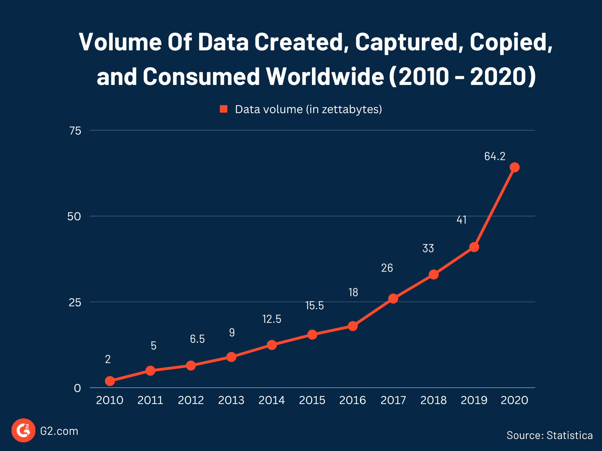
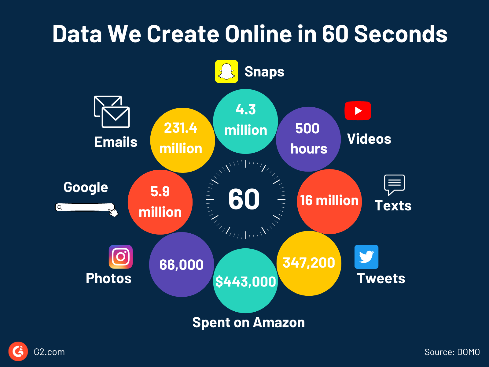
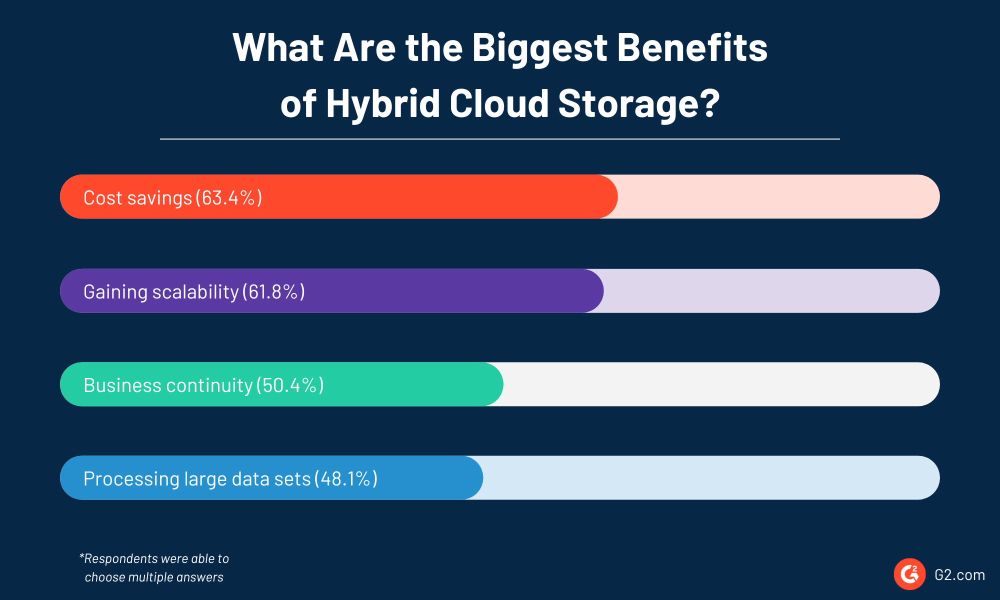
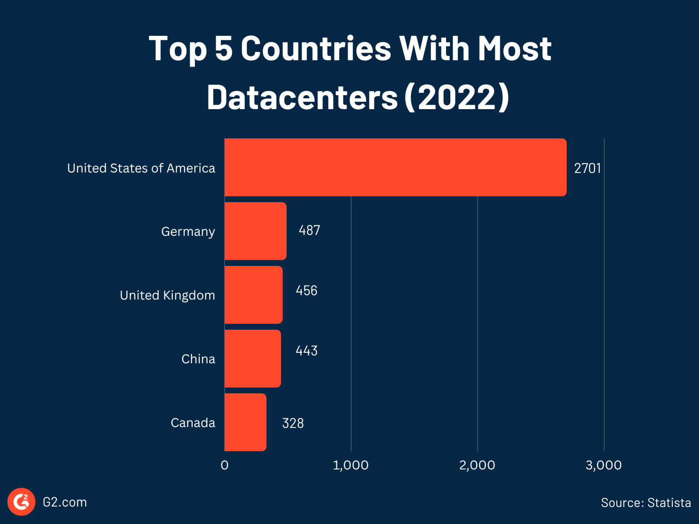

When you think about data, follow the zeros.  

当你想到数据时，跟着零走。

As in 18 zeroes, as in more than 2,500,000,000,000,000,000 bytes (or 2.5 quintillions) of data are created _each day_. As in, holy guacamole.  

就像18个零一样，每天有超过2，500，000，000，000，000，000字节（或2.5万亿）的数据被创建。就像，神圣的鳄梨酱。

This exorbitant amount of data relates to all things: our preferences, interactions, and everything else we do on the internet and connected devices. Companies take heaping servings of this data – millions of scraps at a time – and turn them into actionable insights using [big data analytics software](https://www.g2.com/categories/big-data-analytics).    

这一庞大的数据量涉及到所有的事情：我们的偏好、互动以及我们在互联网和连接设备上所做的一切。公司收集大量的数据--一次数百万的废料--并使用大数据分析软件将它们转化为可操作的见解。

Did you look for sneakers online last night? And are you now getting sneakers ads on every website you visit? That’s the work of big data.  

你昨晚在网上找运动鞋了吗？你现在在你访问的每个网站上都有运动鞋广告吗？这就是大数据的成果。

Big data is transforming how businesses operate. In fact, what we call big data is slowly moving from being a fad to something normal as businesses and governments use huge amounts of data to improve what they do and how they do it.   

大数据正在改变企业的运营方式。事实上，我们所谓的大数据正在慢慢从一种时尚转变为常态，因为企业和政府使用大量数据来改进他们的工作和工作方式。

We’ve gathered some recent big data statistics and data facts that illuminate the topic, its relevance, and its trajectory. Knowing the scope and impact of this ongoing data revolution is helpful regardless of how your business uses big data.  

我们收集了一些最近的大数据统计数据和数据事实，阐明了这个主题，它的相关性和它的轨迹。无论您的企业如何使用大数据，了解这场正在进行的数据革命的范围和影响都很有帮助。

## Big data growth statistics: How much data do we create?    

大数据增长统计：我们创造了多少数据？

We create data everywhere – in the quick Google search we do, in the hundreds of texts we send on WhatsApp, in millions of Instagram photos and TikTok videos we share, and even in the weather app we use on our smartphones.  

我们到处都在创造数据--在我们快速的谷歌搜索中，在我们在WhatsApp上发送的数百条文本中，在我们分享的数百万张Instagram照片和TikTok视频中，甚至在我们智能手机上使用的天气应用程序中。

From smartphones to connected cars, the explosion of the internet of things (IoT) has fuelled a data inferno. This vast volume and variety of data coming in at incredible velocity is called [big data](https://www.g2.com/articles/big-data). Take a look at these statistics to understand how much data we create.    

从智能手机到联网汽车，物联网（IoT）的爆炸式增长引发了数据地狱。这种以令人难以置信的速度输入的海量数据被称为大数据。看看这些统计数据，了解我们创建了多少数据。

-   An internet user generates about 1.7 megabytes (MB) of data per second.  
    
    互联网用户每秒生成约1.7兆字节（MB）的数据。
-   Two-thirds of the world population will be online by the end of 2023.   
    
    到2023年底，全球三分之二的人口将上网。

## 97 zettabytes 97泽字节

the estimated volume of data created worldwide in 2022.  

2022年全球创建的数据量估计。

_Source: [Statista](https://www.statista.com/statistics/966892/market-research-industry-big-data-analytics/) 来源：Statista_

-   In 2023, we will generate nearly 3 times the volume of data generated in 2019.  
    
    2023年，我们产生的数据量将是2019年的近3倍。
-   By 2025, people will create more than 181 ZB of data. That’s 181, followed by 21 zeros.  
    
    到2025年，人们将创造超过181 ZB的数据。就是181，后面跟着21个零。
-   By 2025, there will be 55.7 billion connected IoT devices. These IoT devices alone will generate almost 80 ZB by 2025.  
    
    到2025年，将有557亿个连接的物联网设备。到2025年，仅这些物联网设备就将产生近80 ZB的收入。
-   An internet user would need more than 180 million years to download all the data from the web.  
    
    一个互联网用户需要超过1.8亿年才能从网上下载所有数据。
-   Nearly 80% of companies estimate that 50%-90% of their data is unstructured. Think text, video, audio, web server logs, or social media activities.   
    
    近80%的公司估计他们50%-90%的数据是非结构化的。想想文字、视频、音频、Web服务器日志或社交媒体活动。

## How big is big data?  

大数据到底有多大？

When we say big data, we aren’t talking about megabytes and gigabytes but petabytes (more than a million gigabytes) and exabytes (more than a billion gigabytes).  

当我们说大数据时，我们不是在谈论兆字节和千兆字节，而是PB（超过100万千兆字节）和EB（超过10亿千兆字节）。

Take a look at what happens on the web in just 60 seconds to see the volume and speed at which we create data online.  

看看在短短60秒内在网络上发生了什么，看看我们在线创建数据的数量和速度。

-   5.9 million Google searches happen.  
    
    5.9 Google搜索的次数
-   Instagram users share 66,000 photos.  
    
    Instagram用户分享了6.6万张照片。
-   Facebook users post 1.7 million pieces of content.  
    
    Facebook用户发布了170万条内容。
-   People send 231.4 million emails.  
    
    人们发送了2.314亿封电子邮件。

## 5.07 billion 5.07十亿

the number of people using the Internet.  

使用互联网的人数。

_Source: [CNBC TV18](https://www.cnbctv18.com/technology/top-10-countries-with-highest-internet-users-in-2022-15024571.htm) 来源：CNBC TV18_

-   YouTubers upload 500 hours of videos.  
    
    YouTube用户上传500小时的视频。
-   Snapchat users send 4.3 million snaps.  
    
    Snapchat用户发送了430万张快照。
-   Twitter users write 347,200 tweets.  
    
    Twitter用户写了347，200条推文。
-   People send 16 million texts.  
    
    人们发送了1600万条短信。
-   Venmo users transfer $437,600.  
    
    Venmo用户转账437，600美元。
-   Amazon shoppers spend $443,000.  
    
    亚马逊购物者花费44.3万美元。

## Big data and business statistics  

大数据和业务统计

Big data is the oil that businesses run on. Organizations use [big data tools](https://www.g2.com/categories/big-data) to find trends and patterns from the vast volume of structured and unstructured customer-generated data.  

大数据是企业赖以生存的石油。组织使用大数据工具从大量的结构化和非结构化客户生成的数据中发现趋势和模式。

Data-driven companies take advantage of big data and business analytics for informed decision-making. It improves their sales, customer service, and product offerings and ultimately boosts their profits. Here are some statistics that show the business vote of confidence in big data.   

数据驱动型公司利用大数据和业务分析进行明智的决策。它改善了他们的销售，客户服务和产品供应，并最终提高了他们的利润。以下是一些统计数据，显示了企业对大数据的信心投票。

-   4 out of 10 companies use big data analytics.  
    
    10家公司中有4家使用大数据分析。
-   87.8% of companies increased their data investments in 2022.  
    
    87.8%的公司在2022年增加了数据投资。
-   9 out of 10 companies will increase their data and analytics investments in 2023 despite economic uncertainty.  
    
    尽管经济不确定性，但10家公司中有9家将在2023年增加数据和分析投资。

## 98%

of executives agree it is somewhat or very important to increase data analysis by their organizations in the next 1 to 3 years.  

的高管同意，在未来1 - 3年内，增加组织的数据分析在某种程度上或非常重要。

_Source: [Ocient](https://ocient.com/tech-papers/beyond-big-data-the-rise-of-hyperscale/) 来源：Ocient_

-   Data modernization, or transferring of data from legacy environments to cloud-based environments, was the top focus of data and analytics investment in 2022.  
    
    数据现代化，或将数据从传统环境转移到基于云的环境，是2022年数据和分析投资的首要重点。
-   82% of organizations plan to increase their investments in data modernization in 2023, up from  41% in 2022.  
    
    82%的企业计划在2023年增加对数据现代化的投资，高于2022年的41%。
-   The majority of large and small businesses are focusing on implementing big data tech.  
    
    大多数大型和小型企业都专注于实施大数据技术。
-   19% of executives say they have established a data culture in their company.  
    
    19%的高管表示，他们已经在公司建立了数据文化。

## Benefits of big data statistics  

大数据统计的好处

Let’s touch on the benefits of big data and analytics that have made it an essential tool for companies in many sectors.  

让我们来谈谈大数据和分析的好处，这些好处使其成为许多行业公司的重要工具。

-   Almost two-thirds of digital leaders think big data and analytics will be the top 2 technologies to deliver competitive advantage in 2023.  
    
    近三分之二的数字领导者认为，大数据和分析将是2023年提供竞争优势的两大技术。
-   82% of organizations with advanced maturity in data and analytics saw positive year-over-year (YOY) revenue growth over the past three years.  
    
    在数据和分析方面，有82%的企业在过去三年中实现了收入同比增长。

## 400

is the average number of data sources per organization.  

是每个组织的平均数据源数。

_Source: [Matillion](https://www.matillion.com/resources/blog/matillion-and-idg-survey-data-growth-is-real-and-3-other-key-findings) 来源：Matillion_

-   Over 50% of executives say they are driving business innovation with data.  
    
    超过50%的高管表示，他们正在利用数据推动业务创新。
-   92% of data leaders say their company got measurable business value from data and analytics investments.  
    
    92%的数据领导者表示，他们的公司从数据和分析投资中获得了可衡量的商业价值。
-   98% of data leaders think they’ll see a return on their data investments in 2023.  
    
    98%的数据领导者认为他们将在2023年看到数据投资的回报。
-   4 out of 10 companies have seen measurable benefits and cost savings from data and analytics initiatives.  
    
    10家公司中有4家从数据和分析计划中看到了可衡量的收益和成本节约。
-   22% of chief executive officers believe using data effectively to develop new products and services is an important source of their growth in the next five years.  
    
    22%的首席执行官认为，有效利用数据开发新产品和服务是他们未来五年增长的重要来源。
-   A fifth of digital leaders feel they are effectively using data insights to generate more revenue.  
    
    五分之一的数字化领导者认为他们正在有效地利用数据洞察来创造更多收入。

## Big data market statistics  

大数据市场统计

The advantages of big data have boosted the market for big data tools and services, starting from capturing and storing data to processing and analyzing.    

大数据的优势推动了大数据工具和服务的市场，从捕获和存储数据到处理和分析。

-   Investors have poured in $43.8 billion in 1,300 big data analytics companies as of February 2023.  
    
    截至2023年2月，投资者已向1,300家大数据分析公司投入了438亿美元。
-   Over half of the funding into big data companies came in between 2019 and 2021.  
    
    超过一半的大数据公司资金来自2019年至2021年。
-   The big data analytics (BDA) market was worth $271.83 billion in 2022.  
    
    2022年，大数据分析（BDA）市场价值2718.3亿美元。
-   Global spending on BDA solutions is expected to grow at the compound annual growth rate (CAGR) of 12.8% over 2021-2025.   
    
    预计2021-2025年，BDA解决方案的全球支出将以12.8%的复合年增长率（CAGR）增长。

## 71

products are listed under the BDA category on G2, the world’s largest software marketplace.  

产品在全球最大的软件市场G2的BDA类别下列出。

_Source: [G2](https://www.g2.com/categories/big-data-analytics) 来源：G2_

-   By 2029, the BDA market is set to more than double to a staggering $655.53 billion.  
    
    到2029年，BDA市场将增长一倍以上，达到惊人的655.3亿美元。
-   G2 has three software categories under big data: big data analytics, [big data processing and distribution systems](https://www.g2.com/categories/big-data-processing-and-distribution), and event stream processing software.  
    
    G2在大数据下有三个软件类别：大数据分析、大数据处理和分发系统以及事件流处理软件。

### Big data market size by region  

各地区大数据市场规模

Here’s the regional breakdown of the BDA market.  

以下是BDA市场的区域细分。

-   The North American BDA market will hit $169.91 billion by 2028.  
    
    到2028年，北美BDA市场将达到1699.1亿美元。
-   Europe's BDA market will reach $105.82 billion by 2027.  
    
    到2027年，欧洲的BDA市场将达到1058.2亿美元。

## 51%

was the share of the BDA market held by the United States in 2021.  

是美国2021年在BDA市场所占的份额。

_Source: [Statista](https://www.statista.com/statistics/1258046/worldwide-big-data-business-analytics-market-share-by-country/) 来源：Statista_

-   By 2025, the Asian/Pacific region will spend around $53.3 million on BDA solutions.  
    
    到2025年，亚太地区将在BDA解决方案上花费约5330万美元。
-   Japan, China, and the United Kingdom held more than 5% of the BDA market share in 2021.  
    
    2021年，日本、中国及英国占BDA市场份额超过5%。

## Big data storage statistics  

大数据存储统计

With big data adoption, companies are shifting from traditional data storage systems like [relational databases](https://www.g2.com/articles/relational-databases). More efficient, scalable, and effective systems like cloud storage are becoming the most preferred storage for big data analytics.  

随着大数据的采用，公司正在从传统的数据存储系统（如关系数据库）转向。更高效、可扩展和高效的系统，如云存储，正成为大数据分析的首选存储。

-   Over 60% of all corporate data is in [cloud storage](https://www.g2.com/categories/cloud-file-storage).  
    
    超过60%的企业数据存储在云存储中。
-   100 zettabytes of data will be stored in the cloud by 2025.  
    
    到2025年，将有100 ZB的数据存储在云中。
-   29% of firms with intermediate data and analytics maturity and 45% of companies with advanced maturity are going for a cloud-first approach.  
    
    29%具有中等数据和分析成熟度的公司和45%具有高级成熟度的公司正在采用云优先方法。
-   48% of hybrid cloud storage users consider its ability to process large datasets as one of its biggest benefits, according to a [G2 survey](https://learn.g2.com/hubfs/Survey_The%20State%20of%20Hybrid%20Cloud%20Storage%20Software_G2.pdf?_gl=1*1npbf65*_ga*MTUyODYwMzE0NC4xNjY4MjY5NDkz*_ga_MFZ5NDXZ5F*MTY3NTkyNjYxMi41MjguMS4xNjc1OTI4NTY5LjQ3LjAuMA).  
    
    根据G2的一项调查，48%的混合云存储用户认为其处理大型数据集的能力是其最大的优势之一。

-   There are 8,000 data centers in the world.  
    
    全球有8,000个数据中心。
-   IT spending on [data center systems](https://www.g2.com/categories/data-center-infrastructure) will reach $222 billion in 2023.  
    
    到2023年，数据中心系统的IT支出将达到2220亿美元。
-   The United States of America has more data centers than Germany, the United Kingdom, China, and Canada put together.  
    
    美国拥有的数据中心比德国、英国、中国和加拿大加起来还要多。

## Other big data technology statistics  

其他大数据技术统计

Apart from cloud storage, big data has also powered other technologies like Hadoop, NoSQL databases, and [data lakes](https://www.g2.com/glossary/data-lake-definition), all of which are useful for processing large amounts of data.  

除了云存储，大数据还为Hadoop、NoSQL数据库和数据湖等其他技术提供了动力，所有这些都有助于处理大量数据。

Big data companies are leveraging these new technologies to provide advanced BDA tools. Here are the statistics to prove it.  

大数据公司正在利用这些新技术来提供先进的BDA工具。以下是统计数据来证明这一点。

-   The global market value of Hadoop, the open-source framework used to store and process large datasets, will reach $842.25 billion by 2030 from just $33 billion in 2021.  
    
    Hadoop是一种用于存储和处理大型数据集的开源框架，到2030年，其全球市场价值将从2021年的330亿美元达到8422.5亿美元。
-   G2’s [NoSQL database](https://www.g2.com/categories/nosql-databases) category saw an 81.33% growth in traffic from February 2022 to March 2022.  
    
    G2的NoSQL数据库类别从2022年2月到2022年3月的流量增长了81.33%。
-   The [database-as-a-service (DBaaS)](https://www.g2.com/categories/database-as-a-service-dbaas) category on G2 saw a growth of 92.73% between September 2020 and September 2021.  
    
    G2的数据库即服务（DBaaS）类别在2020年9月至2021年9月期间增长了92.73%。

## Big data job statistics  

大数据岗位统计

As companies invest in big data and data science tools, there’s an increasing demand for people skilled in data science. In fact, businesses fear that skill shortages will hurt their ability to realize the full potential of the data they have.  

随着公司投资于大数据和数据科学工具，对数据科学人才的需求越来越大。事实上，企业担心技能短缺会损害他们充分发挥所拥有数据潜力的能力。

-   49% of executives say there is a lack of talent to analyze the data.  
    
    49%的高管表示缺乏分析数据的人才。
-   The U.S. Bureau of Labor Statistics (BLS) expects a 36% growth in data-related occupations between 2021-2031, higher than any other sector.  
    
    美国劳工统计局（BLS）预计，2021-2031年间，与数据相关的职业将增长36%，高于其他任何行业。

## 83%

of companies have appointed a chief data officer (CDO) or chief data and analytics officer (CDAO).  

公司任命了首席数据官（CDO）或首席数据和分析官（CDAO）。

_Source: [MIT Sloan](https://sloanreview.mit.edu/article/action-and-inaction-on-data-analytics-and-ai/) 资料来源：麻省理工学院斯隆_

-   On average, 13,500 new data scientists jobs will open in the U.S. each year from 2021 to 2031.  
    
    平均而言，美国将新增13，500个数据科学家职位。每年从2021年到2031年。
-   The average salary of data scientists is more than $100,000 per year.  
    
    数据科学家的平均年薪超过10万美元。

## Big data challenges statistics  

大数据挑战统计

The big data industry is not without significant challenges and worries. These statistics show the problems businesses face with big data technologies.  

大数据行业并非没有重大挑战和担忧。这些统计数据显示了企业在大数据技术方面面临的问题。

-   Nearly 7 out of 10 C-suite executives consider security and risk as the biggest pain points related to big data analysis.  
    
    近7/10的高管认为安全和风险是大数据分析相关的最大痛点。
-   Other concerns around big data analytics among C-suite executives are metadata and governance (41%) and slow data ingestion (31%).  
    
    高管对大数据分析的其他担忧是元数据和治理（41%）以及数据摄取缓慢（31%）。
-   61% of companies think that the fast-growing volume of data is limiting their ability to harness their data fully.  
    
    61%的公司认为，快速增长的数据量限制了他们充分利用数据的能力。
-   Data professionals see data volume grow by an average of 63% every month in their companies.  
    
    数据专业人士发现，他们公司的数据量平均每月增长63%。
-   More than 80% of IT decision-makers agree their analytics projects are delayed within their company due to data not being available in the required format.  
    
    超过80%的IT决策者认为，他们的分析项目在公司内被推迟，原因是数据无法以所需格式提供。
-   8 out of 10 companies had to rework data analytics projects due to poor data quality.  
    
    10家公司中有8家因数据质量差而不得不返工数据分析项目。
-   49% of executives say the current data solutions aren’t flexible enough.  
    
    49%的高管表示，当前的数据解决方案不够灵活。
-   Only a quarter of companies say they’re doing enough to ensure responsible and ethical use of data within their business and industry.  
    
    只有四分之一的公司表示，他们已经做了足够的努力，以确保在其业务和行业内负责任和道德地使用数据。

## Future of big data  

大数据的未来

Despite the challenges, big data is the biggest game-changer for businesses. Companies are now looking to use much-evolved big data tools like [business intelligence](https://www.g2.com/glossary/business-intelligence-definition) (BI) and predictive analytics that employ artificial intelligence (AI) and machine learning (ML) algorithms. ML models train on larger datasets than ever before with big data. Companies are also moving to real-time analytics with platforms like [stream analytics](https://www.g2.com/categories/stream-analytics).  

尽管面临挑战，但大数据是企业最大的游戏规则改变者。公司现在正在寻求使用经过极大发展的大数据工具，如商业智能（BI）和预测分析，这些工具采用人工智能（AI）和机器学习（ML）算法。ML模型在比以往任何时候都更大的数据集上训练。公司也在转向实时分析，比如流分析。

-   96% of executives planned to use AI simulation for real-time analysis of their business performance in 2022.  
    
    96%的高管计划在2022年使用人工智能模拟对其业务表现进行实时分析。
-   Majority of executives note changes in data culture contributed to an increase in adoption and usage of BI and analytics tools.  
    
    大多数高管指出，数据文化的变化有助于BI和分析工具的采用和使用的增加。

## 25%

of employees are actively using BI/analytics tools now.  

目前，员工正在积极使用BI/分析工具。

_Source: [BARC](https://barc-research.com/infographic-bi-analytics-adoption/) 资料来源：BARC_

-   72% of businesses are looking to build AI enhancements in their business intelligence platforms in the future.  
    
    72%的企业希望在未来在其商业智能平台中构建人工智能增强功能。
-   The other top choices for future data and analytics technologies include [text analytics](https://www.g2.com/categories/text-analysis) (67%) and speech analytics (65%).  
    
    未来数据和分析技术的其他首选包括文本分析（67%）和语音分析（65%）。
-   The streaming analytics market, driven by big data and AI, is expected to grow at a CAGR rate of 26.5% to $50.1 billion.  
    
    在大数据和人工智能的推动下，流媒体分析市场预计将以26.5%的复合年增长率增长至501亿美元。

**Sources:  来源：**

-   [Statista  斯塔蒂斯塔](https://www.statista.com/statistics/966892/market-research-industry-big-data-analytics/)
-   [Acumen Research and Consulting  
    
    Acumen研究与咨询](https://www.globenewswire.com/en/news-release/2022/12/15/2575145/0/en/Big-Data-Market-Size-Set-to-Achieve-USD-473-6-Billion-by-2030-growing-at-12-7-CAGR-Exclusive-Report-by-Acumen-Research-and-Consulting.html)
-   [Ernst & Young  Ernst & Young的](https://www.ey.com/en_us/ceo/will-bold-strategies-fuel-market-leading-growth)
-   [Wavestone  波浪石](https://www.wavestone.us/wp-content/uploads/2022/12/Design-2023-Data-Analytics-Survey-Report.pdf)
-   [DOMO  DOMO](https://www.domo.com/data-never-sleeps?utm_source=wire&utm_medium=pr&utm_campaign=PR_DNS10_22&campid=7015w000000vccjAAA#)
-   [IDC](https://blogs.idc.com/2021/01/06/future-of-industry-ecosystems-shared-data-and-insights//)
-   [Fortune Business Insights  
    
    财富商业洞察](https://www.fortunebusinessinsights.com/big-data-analytics-market-106179)
-   [CNBC TV18  CNBC TV18](https://www.cnbctv18.com/technology/top-10-countries-with-highest-internet-users-in-2022-15024571.htm)
-   [Alation  Alation](https://www.alation.com/resource-center/reports/state-data-culture-report-2022-q1#main-content)
-   [Accenture  埃森哲](https://www.accenture.com/_acnmedia/pdf-70/accenture-intelligent-operations-research-web.pdf)
-   [BARC  barc](https://barc-research.com/infographic-bi-analytics-adoption/)
-   [USITC  USITC](https://www.usitc.gov/publications/332/executive_briefings/ebot_data_centers_around_the_world.pdf)
-   [Matillion  马蒂利翁](https://www.matillion.com/resources/blog/matillion-and-idg-survey-data-growth-is-real-and-3-other-key-findings)
-   [G2](https://www.g2.com/articles/g2-announces-a-new-category-for-wide-column-databases)
-   [Allied Market Research  联合市场研究](https://www.alliedmarketresearch.com/world-hadoop-market)
-   [New Vantage Partners  新Vantage合作伙伴](https://www.newvantage.com/_files/ugd/e5361a_247885043758499ba090f7a5f510cf7c.pdf)
-   [WNS Triange, Forrester  WNS Triange，Forrester](https://wnscom-bucket.s3.amazonaws.com/S3_5/Documents/Forrester/Forrester_WNSTriange_Global_Analytics_Survey.pdf)
-   [SnapLogic  SnapLogic](https://www.snaplogic.com/wp-content/uploads/2020/12/State-of-Data-Management-Data-Distrust-SnapLogic.pdf)
-   [Markets and Markets  市场与市场](https://www.marketsandmarkets.com/Market-Reports/streaming-analytics-market-64196229.html#:~:text=%5B342%20Pages%20Report%5D%20The%20Streaming,to%20drive%20the%20market%20growth.)
-   [Bureau of Labor Statistics  
    
    劳工统计局](https://www.bls.gov/emp/tables/fastest-growing-occupations.htm)
-   [Statista  斯塔蒂斯塔](https://www.statista.com/topics/6165/data-centers/#:~:text=Cloud%20and%20hyperscale%20data%20centers,over%20130%20billion%20in%202026.)
-   [Tech Republic  科技共和国](https://www.techrepublic.com/article/go-to-resources-for-safe-secure-cloud-storage/)
-   [Tracxn  Tracxn](https://tracxn.com/d/emerging-startups/top-big-data-analytics-startups-2022)
-   [MIT Sloan  麻省理工斯隆](https://mitsloan.mit.edu/ideas-made-to-matter/tapping-power-unstructured-data)

### Big data, bigger benefits  

大数据，更大效益

The unprecedented data revolution shows no signs of letting up, so pay attention –  it may impact your business in unexpected ways. It’s sure to affect the world around you. Keep your ear to the ground and stay up on big data developments as the march of quantification continues.  

前所未有的数据革命没有停止的迹象，所以请注意-它可能会以意想不到的方式影响您的业务。它肯定会影响你周围的世界。随着量化的推进，保持您的耳朵到地面，并保持大数据的发展。

Learn more about [big data analytics software](https://www.g2.com/categories/big-data-analytics) and how it can help your business.  

详细了解大数据分析软件以及它如何帮助您的企业。
