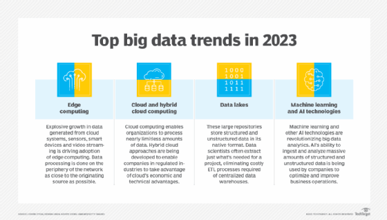

## Big data is driving changes in how organizations process, store and analyze data. The benefits are spurring even more innovation. Here are four big trends.  

大数据正在推动组织处理、存储和分析数据的方式发生变化。这些好处刺激了更多的创新。以下是四大趋势。

By

-   [Ronald Schmelzer,](https://www.techtarget.com/contributor/Ronald-Schmelzer)  
    
    罗纳德Schmelzer，Cognilytica

Published: 05 Jan 2023  

发布时间：2023年1月5日

Big data is proving its value to organizations of all types and sizes in a wide range of industries. Enterprises that make advanced use of it are [realizing tangible business benefits](https://www.techtarget.com/searchbusinessanalytics/feature/6-big-data-benefits-for-businesses), from improved efficiency in operations and increased visibility into rapidly changing business environments to the optimization of products and services for customers.  

大数据正在向各行各业的各种类型和规模的组织证明其价值。先进使用它的企业正在实现有形的业务效益，从提高运营效率和提高对快速变化的业务环境的可见性，到为客户优化产品和服务。

The result is that as organizations find uses for these typically large stores of data, [big data](https://www.techtarget.com/searchdatamanagement/definition/big-data) technologies, practices and approaches are evolving. New [types of big data architectures](https://www.techtarget.com/searchdatamanagement/feature/Building-a-big-data-architecture-Core-components-best-practices) and techniques  for collecting, processing, managing and analyzing the gamut of data across an organization continue to emerge.  

结果是，随着组织发现这些典型的大型数据存储的用途，大数据技术、实践和方法正在不断发展。用于收集、处理、管理和分析整个组织的数据的新型大数据架构和技术不断出现。

Dealing with big data is more than just dealing with large volumes of stored information. Volume is just one of the many [V's of big data](https://www.techtarget.com/searchdatamanagement/definition/5-Vs-of-big-data) that organizations need to address. There usually is also a significant variety of data -- from structured information sitting in databases distributed throughout the organization to vast quantities of unstructured and semistructured data residing in files, images, videos, sensors, system logs, text and documents, including paper ones that are waiting to be digitized. In addition, this information often is created and changed at a rapid rate (velocity) and has [varying levels of data quality](https://www.techtarget.com/searchdatamanagement/feature/Data-quality-for-big-data-Why-its-a-must-and-how-to-improve-it) (veracity), creating further challenges on data management, processing and analysis.  

处理大数据不仅仅是处理大量存储的信息。量只是组织需要解决的大数据众多V之一。通常还有大量的数据-从分布在整个组织的数据库中的结构化信息到大量的非结构化和半结构化数据，这些数据包括文件、图像、视频、传感器、系统日志、文本和文档，包括等待数字化的纸质数据。此外，这些信息往往以快速的速度（速度）创建和改变，并且数据质量（准确性）水平各不相同，对数据管理、处理和分析造成了进一步的挑战。

Four major trends in big data are helping organizations meet those challenges and get the benefits they're seeking. Here's a look at the trends and what they mean for organizations that are investing in big data deployments.  

大数据的四大趋势正在帮助企业应对这些挑战并获得他们正在寻求的好处。以下是趋势以及它们对投资于大数据部署的组织意味着什么。

### 1\. More data, increased data diversity drive advances in processing and the rise of edge computing  

1.更多的数据、增加的数据多样性推动了处理技术的进步和边缘计算的兴起

The pace of data generation continues to accelerate. Much of this data isn't generated from the business transactions that happen in databases -- instead, it comes from other sources, including cloud systems, web applications, video streaming and smart devices such as smartphones and voice assistants. This data is largely unstructured and in the past was left mostly unprocessed and unused by organizations, turning it into so-called dark data.  

数据生成的步伐继续加快。其中大部分数据并不是从数据库中发生的商业交易中产生的，而是来自其他来源，包括云系统、网络应用、视频流以及智能手机和语音助手等智能设备。这些数据在很大程度上是非结构化的，在过去，大部分是未处理和未被组织使用的，将其转变为所谓的暗数据。

That brings us to the biggest trend in big data: Non-database sources will continue to be the dominant generators of data, in turn forcing organizations to reexamine their needs for data processing. Voice assistants and IoT devices, in particular, are driving a rapid ramp-up in [big data management](https://www.techtarget.com/searchdatamanagement/definition/big-data-management) needs across industries as diverse as retail, healthcare, finance, insurance, manufacturing and energy and in a wide range of public-sector markets. This explosion in data diversity is compelling organizations to think [beyond the traditional data warehouse](https://www.techtarget.com/searchdatamanagement/feature/Beyond-the-RDBMS-Data-warehouse-vs-data-lake-vs-data-mart) as a means for processing all this information.  

这就引出了大数据的最大趋势：非数据库来源将继续是主要的数据生成者，反过来迫使各组织重新审查其数据处理的需要。特别是语音助理和物联网设备，正在推动零售、医疗保健、金融、保险、制造和能源等行业以及广泛的公共部门市场对大数据管理需求的快速增长。这种数据多样性的爆炸式增长迫使组织考虑超越传统的数据仓库作为处理所有这些信息的手段。

In addition, the need to handle the data being generated is moving to the devices themselves, as industry breakthroughs in processing power have led to the development of increasingly advanced devices capable of [collecting and storing data](https://www.techtarget.com/searchdatamanagement/feature/Big-data-collection-processes-challenges-and-best-practices) on their own without taxing network, storage and computing infrastructure. For example, mobile banking apps can handle many tasks for remote check deposit and processing without having to send images back and forth to central banking systems for processing.  

此外，处理所生成数据的需求正在转移到设备本身，因为处理能力的行业突破已经导致了越来越先进的设备的发展，这些设备能够自行收集和存储数据，而不会增加网络、存储和计算基础设施的负担。例如，移动的银行应用程序可以处理远程支票存款和处理的许多任务，而不必来回发送图像到中央银行系统进行处理。

In a sign of how this is all coming to the fore, a [survey on 2023 IT spending plans](https://www.prweb.com/releases/enterprise_strategy_group_research_finds_ongoing_digital_transformation_investments_will_mitigate_the_impact_of_technology_spending_caution_in_2023/prweb19061381.htm) conducted by TechTarget's Enterprise Strategy Group division found that the top priorities for organizations to support their data initiatives include advancing the use of next-generation technology and moving data from legacy systems to modern ones.  

TechTarget的企业战略集团部门对2023年IT支出计划进行的一项调查显示，组织支持其数据计划的首要任务包括推进下一代技术的使用，并将数据从遗留系统转移到现代系统。

The use of devices for distributed processing is embodied in the concept of [edge computing](https://www.techtarget.com/searchdatacenter/definition/edge-computing), which shifts the processing load to the devices themselves before the data is sent to the servers. Edge computing optimizes performance and storage by reducing the need for data to flow through networks. That lowers computing and processing costs, especially cloud storage, bandwidth and processing expenses. Edge computing also helps to speed up data analysis and provides faster responses to the user.  

使用设备进行分布式处理体现在边缘计算的概念中，边缘计算在数据发送到服务器之前将处理负载转移到设备本身。边缘计算通过减少数据在网络中流动的需求来优化性能和存储。这降低了计算和处理成本，特别是云存储、带宽和处理成本。边缘计算还有助于加速数据分析，并为用户提供更快的响应。

In the healthcare sector, for example, the rapidly expanding market of wearables -- such as Fitbit, Apple Watch and Google Android devices -- is driving growth in telemedicine and allowing healthcare providers to gather critical patient data in real time. The results are used for a wide range of [big data processing and analytics applications](https://www.techtarget.com/searchbusinessanalytics/feature/8-big-data-use-cases-for-businesses-and-industry-examples) designed to improve patient outcomes.  

例如，在医疗保健领域，Fitbit、Apple Watch和Google Android设备等可穿戴设备市场的快速扩张正在推动远程医疗的增长，并允许医疗保健提供商真实的收集关键患者数据。这些结果被用于各种旨在改善患者结局的大数据处理和分析应用。

Big data continues to drive major changes in how organizations process, store and analyze data.  

大数据继续推动组织处理、存储和分析数据的方式发生重大变化。

### 2\. Big data storage needs spur innovations in cloud and hybrid cloud platforms, growth of data lakes  

2.大数据存储需求刺激云和混合云平台的创新，数据湖的增长

To deal with the inexorable increase in data generation, organizations are spending more of their resources storing this data in a range of cloud-based and [hybrid cloud](https://www.techtarget.com/searchcloudcomputing/definition/hybrid-cloud) systems optimized for all the V's of big data. In previous decades, organizations handled their own storage infrastructure, resulting in massive data centers that enterprises had to manage, secure and operate. The move to cloud computing changed that dynamic. By shifting the responsibility to cloud infrastructure providers -- such as AWS, Google, Microsoft, Oracle and IBM -- organizations can deal with almost limitless amounts of new data and pay for storage and compute capability on demand without having to maintain their own large and complex data centers.  

为了应对数据生成的不可阻挡的增长，组织正在花费更多的资源将这些数据存储在一系列针对所有V大数据进行优化的基于云的和混合云系统中。在过去的几十年中，企业管理自己的存储基础设施，导致企业必须管理、保护和运营的庞大数据中心。向云计算的迁移改变了这种动态。通过将责任转移给云基础设施提供商（如AWS、Google、Microsoft、Oracle和IBM），企业可以处理几乎无限数量的新数据，并按需支付存储和计算能力，而无需维护自己的大型复杂数据中心。

Some industries are challenged in their use of cloud infrastructure due to regulatory or technical limitations. For example, heavily regulated industries -- such as healthcare, financial services and government -- have restrictions that prevent the use of [public cloud infrastructure](https://www.techtarget.com/searchcloudcomputing/definition/public-cloud). As a result, over the past decade, cloud providers have developed ways to provide more regulatory-friendly infrastructure, as well as hybrid approaches that combine aspects of third-party cloud systems with on-premises computing and storage to meet critical infrastructure needs. The evolution of both public cloud and hybrid cloud infrastructures will no doubt progress as organizations seek the economic and technical advantages of cloud computing.  

由于监管或技术限制，一些行业在使用云基础设施方面面临挑战。例如，受到严格监管的行业--如医疗保健、金融服务和政府--都有限制，阻止使用公共云基础设施。因此，在过去的十年中，云计算提供商已经开发出了提供更符合监管要求的基础设施的方法，以及将第三方云系统与本地计算和存储相结合的混合方法，以满足关键的基础设施需求。随着组织寻求云计算的经济和技术优势，公有云和混合云基础设施的发展无疑将取得进展。

In addition to innovations in cloud storage and processing, enterprises are shifting toward new data architecture approaches that allow them to handle the variety, veracity and volume challenges of big data. Rather than trying to centralize data storage in a data warehouse that requires complex and time-intensive extract, transform and load processes, enterprises are evolving the concept of the [data lake](https://www.techtarget.com/searchaws/definition/data-lake). Data lakes store structured, semistructured and unstructured data sets in their native format. This approach shifts the responsibility for data transformation and preparation to end users who have different data needs. The data lake can also provide shared services for data analysis and processing.  

除了云存储和处理方面的创新，企业正在转向新的数据架构方法，使他们能够处理大数据的多样性，准确性和数量挑战。企业不再试图将数据存储集中在需要复杂和时间密集的提取、转换和加载过程的数据仓库中，而是不断发展数据湖的概念。数据湖以原生格式存储结构化、半结构化和非结构化数据集。这种方法将数据转换和准备的责任转移到具有不同数据需求的最终用户身上。数据湖还可以为数据分析和处理提供共享服务。

### 3\. Adoption of advanced analytics, machine learning and other AI technologies increases dramatically  

3.先进分析、机器学习和其他人工智能技术的采用率大幅提高

With the vast amount of data being generated, traditional analytics approaches are challenged because they're not easily automated for data analysis at scale. Distributed processing technologies, especially those promoted by open source platforms such as [Hadoop and Spark](https://www.techtarget.com/searchdatamanagement/feature/Hadoop-vs-Spark-Comparing-the-two-big-data-frameworks), enable organizations to process petabytes of information at rapid speed. Enterprises are then using [big data analytics](https://www.techtarget.com/searchbusinessanalytics/definition/big-data-analytics) technologies to optimize their business intelligence and analytics initiatives, moving past slow reporting tools dependent on data warehouse technology to more intelligent, responsive applications that enable greater visibility into customer behavior, business processes and overall operations.  

随着大量数据的生成，传统的分析方法受到挑战，因为它们不容易自动化进行大规模的数据分析。分布式处理技术，尤其是Hadoop和Spark等开源平台推广的技术，使组织能够快速处理PB级的信息。然后，企业正在使用大数据分析技术来优化其商业智能和分析计划，从依赖于数据仓库技术的缓慢报告工具转向更智能、响应更快的应用程序，从而能够更好地了解客户行为、业务流程和整体运营。

No technology has been as revolutionary to big data analytics as machine learning and AI systems. Increasingly, [AI is used by organizations](https://www.techtarget.com/searchenterpriseai/Ultimate-guide-to-artificial-intelligence-in-the-enterprise) of all sizes to optimize and improve their business processes. In the Enterprise Strategy Group spending intentions survey, 63% of the 193 respondents familiar with AI and machine learning initiatives in their organization said they expected it to spend more on those tools in 2023.  

对于大数据分析来说，没有任何技术像机器学习和人工智能系统那样具有革命性。人工智能越来越多地被各种规模的组织用于优化和改进其业务流程。在Enterprise Strategy Group的支出意向调查中，193名熟悉其组织中人工智能和机器学习计划的受访者中，有63%表示，他们预计2023年将在这些工具上投入更多资金。

Machine learning enables organizations to more easily identify patterns and detect anomalies in large data sets and to support predictive analytics and other advanced data analysis capabilities. Some examples of that include the following:  

机器学习使组织能够更轻松地识别模式和检测大型数据集中的异常，并支持预测分析和其他高级数据分析功能。这方面的一些例子包括：

-   recognition systems for image, video and text data;  
    
    用于图像、视频和文本数据的识别系统;
-   automated classification of data;  
    
    数据自动分类;
-   [natural language processing](https://www.techtarget.com/searchenterpriseai/definition/natural-language-processing-NLP) capabilities for chatbots and voice and text analysis;  
    
    用于聊天机器人以及语音和文本分析的自然语言处理能力;
-   autonomous business process automation;  
    
    自主业务流程自动化;
-   [personalization and recommendation features](https://www.techtarget.com/searchenterpriseai/feature/8-examples-of-AI-personalization-across-industries) in websites and services; and  
    
    网站和服务中的个性化和推荐功能;和/或
-   analytics systems that can find optimal solutions to business problems among a sea of data.  
    
    分析系统可以在海量数据中找到业务问题的最佳解决方案。

Indeed, with the help of AI and machine learning, companies are using their big data environments to provide deeper customer support through intelligent chatbots and more personalized interactions without requiring significant increases in customer support staff. These AI-enabled systems are able to collect and analyze vast amounts of information about customers and users, especially when paired with a data lake strategy that can aggregate a wide range of information across many sources.  

事实上，在人工智能和机器学习的帮助下，公司正在利用其大数据环境，通过智能聊天机器人和更个性化的交互提供更深入的客户支持，而不需要大幅增加客户支持人员。这些支持人工智能的系统能够收集和分析有关客户和用户的大量信息，特别是当与数据湖策略相结合时，该策略可以在许多来源中聚合广泛的信息。

Enterprises are also seeing innovations in the area of data visualization. People understand the meaning of data better when it's [represented in a visualized form](https://www.techtarget.com/searchbusinessanalytics/tip/12-data-visualization-techniques-for-effective-BI-applications), such as charts, graphs and plots. Emerging forms of data visualization are putting the power of AI-enabled analytics into the hands of even casual business users. This helps organizations spot key insights that can improve decision-making. Advanced forms of visualization and analytics tools even let users ask questions in natural language, with the system automatically determining the right query and showing the results in a context-relevant manner.  

企业也看到了数据可视化领域的创新。当数据以可视化的形式表示时，人们会更好地理解数据的含义，例如图表、图形和绘图。新兴的数据可视化形式正在将支持AI的分析能力交到普通业务用户手中。这有助于组织发现可以改善决策的关键见解。先进形式的可视化和分析工具甚至允许用户用自然语言提问，系统自动确定正确的查询并以上下文相关的方式显示结果。

### 4\. DataOps and data stewardship move to the fore  

4\. DataOps和数据管理走向前台

Many aspects of big data processing, storage and management will see continued evolution for years to come. Much of this innovation is driven by technology needs, but also partly by changes in the way we think about and relate to data.  

大数据处理、存储和管理的许多方面将在未来几年持续发展。这些创新在很大程度上是由技术需求驱动的，但也部分是由我们思考和处理数据的方式的变化所驱动的。

One area of innovation is the emergence of [DataOps](https://www.techtarget.com/searchdatamanagement/definition/DataOps), a methodology and practice that focuses on agile, iterative approaches for dealing with the full lifecycle of data as it flows through the organization. Rather than thinking about data in piecemeal fashion with separate people dealing with data generation, storage, transportation, processing and management, [DataOps processes and frameworks](https://www.techtarget.com/searchbusinessanalytics/tip/Key-elements-of-a-DataOps-framework-for-BI-and-analytics) address organizational needs across the data lifecycle from generation to archiving.  

一个创新领域是DataOps的出现，这是一种专注于敏捷、迭代方法的方法和实践，用于处理数据在组织中流动的整个生命周期。DataOps流程和框架解决了从生成到归档的整个数据生命周期中的组织需求，而不是由单独的人员处理数据生成、存储、传输、处理和管理。

Likewise, organizations are increasingly dealing with [data governance, privacy and security](https://www.techtarget.com/searchdatamanagement/definition/data-governance) issues, a situation that is exacerbated by big data environments. In the past, enterprises often were somewhat lax about concerns around data privacy and governance, but new regulations make them much more liable for what happens to personal information in their systems.  

同样，组织越来越多地处理数据治理，隐私和安全问题，大数据环境加剧了这种情况。过去，企业往往对数据隐私和治理的担忧有些松懈，但新法规使他们对系统中的个人信息发生的事情承担更大的责任。

Due to widespread security breaches, eroding customer trust in enterprise data-sharing practices, and challenges in managing data over its lifecycle, organizations are becoming more focused on [data stewardship](https://www.techtarget.com/searchdatamanagement/definition/data-stewardship) and working harder to properly secure and manage data, especially as it crosses international boundaries. New tools are emerging to make sure that data stays where it needs to stay, is secured at rest and in motion, and is appropriately tracked over its lifecycle.  

由于广泛的安全漏洞，侵蚀了客户对企业数据共享实践的信任，以及在数据生命周期中管理数据的挑战，组织越来越关注数据管理，并更加努力地保护和管理数据，特别是当数据跨越国际边界时。新的工具正在出现，以确保数据停留在它需要停留的地方，在静止和运动时都是安全的，并在其生命周期中得到适当的跟踪。

Collectively, these big data trends make working in the big data space an exciting place to be in 2023 and no doubt through the foreseeable future.  

总的来说，这些大数据趋势使大数据领域的工作在2023年成为一个令人兴奋的地方，毫无疑问在可预见的未来。

#### Next Steps 后续步骤

[6 essential big data best practices for businesses  

6大数据最佳实践为企业](https://www.techtarget.com/searchbusinessanalytics/tip/6-essential-big-data-best-practices-for-businesses)

[What a big data strategy includes and how to build one  

大数据战略包括什么以及如何构建](https://www.techtarget.com/searchdatamanagement/feature/How-to-build-an-enterprise-big-data-strategy-in-4-steps)

[17 top big data tools and technologies to know about  

17大数据工具和技术需要了解](https://www.techtarget.com/searchdatamanagement/feature/15-big-data-tools-and-technologies-to-know-about)

#### Dig Deeper on Data management strategies  

深入挖掘数据管理策略

-   [
    
    ##### Hadoop
    
    
    
    By: Craig Stedman](https://www.techtarget.com/searchdatamanagement/definition/Hadoop)
-   [
    
    ##### data migration
    
    
    
    By: Alexander Gillis](https://www.techtarget.com/searchstorage/definition/data-migration)
-   [
    
    ##### CyArk migrates digital archive to Seagate's Lyve Cloud
    
    
    
    By: Adam Armstrong](https://www.techtarget.com/searchstorage/feature/CyArk-migrates-digital-archive-to-Seagates-Lyve-Cloud)
-   [
    
    ##### big data
    
    
    
    By: Bridget Botelho](https://www.techtarget.com/searchdatamanagement/definition/big-data)
