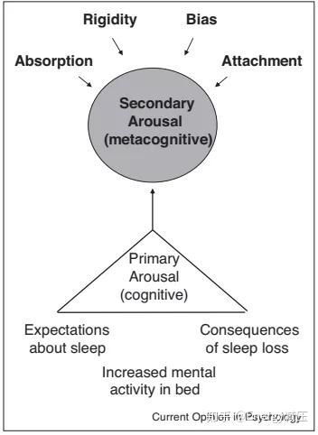
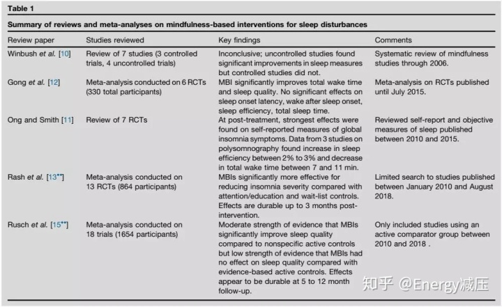

在过去的十年里，**正念冥想作为一种自我调节练习，已经有充分的证据表明正念对于治疗失眠和睡眠障碍的作用。**随着近期一些随机对照试验及统计分析结果发表，这些证明文献更加成熟。总体来说，虽然研究的质量有所差异，客观的测量工具不太明朗，但是所有的研究结果普遍支持**正念冥想对于失眠或睡眠障碍病人自我报告结果的有效性。**在这些文献的基础上，需要进一步研究验证与正念练习相关的生物学关联，冥想练习的时机是否与睡眠结果相关，谁更有可能通过正念冥想治愈，以及在正念冥想传播中技术手段的应用。

正念是不做任何评判去感知当下的一种状态，正念状态是一个很简单的概念——然而，对许多人来说，将正念带入日常生活是一个挑战。因此，**正念冥想的实践已经成为一种流行的自我调节手段，能够用于管理压力、应对慢性病和提升自我表现。**睡眠障碍很可能出现在以上这些情况中，这也是许多人使用正念冥想来改善睡眠健康的原因。但是我们对正念和睡眠真正了解多少？

在这篇文章中，我们将考虑与正念和睡眠健康相关的科学现状。我们将回答这个领域的三个关键问题:

①**为什么要用正念来改善睡眠健康？**

②**使用正念改善睡眠的措施有什么效果？**

③**关于正念对睡眠的影响，我们还需要了解什么？**

**为什么要用正念来改善睡眠健康？**

睡眠是一种行为平静、生物系统调节稳态压力和生理节奏，且有规律的状态。睡眠障碍最常见的情况是，这些系统中存在失调，伴随着症状性神经系统的激活，从而产生兴奋过度的状态。事实上，亢奋假说是慢性失眠最广为人知的模型。该模型认为慢性睡眠障碍是心理和生理过度兴奋的结果，这种过度兴奋源于”使睡眠发生”的反作用行为，导致难以入睡和/或保持睡眠的恶性循环。患有慢性失眠的人倾向于表达与睡眠相关的焦虑、与睡眠相关的不适应症状，并且经常专注于解决他们的睡眠问题。

考虑到正念也是一种行为平静的状态，包括积极的调节，**使用正念来改善睡眠健康有着概念上的协同作用和直觉上的吸引力。**我们已经提出了失眠的元认知模型，去深入洞察正念如何去处理过度兴奋和失眠相关问题。简而言之，这个模型假设睡眠相关的认知亢奋可以分为两个层次:1)**初级唤醒**，**它包括与睡眠不足直接相关的精神活动，例如睡眠不足或因为睡眠不足对日间行为结果的影响；**2)**二次觉醒**，**包括与睡眠相关的思想的关系，例如放大消极情绪的代价或在对睡眠相关思想的注意和感知上制造偏见的倾向。初级和次级觉醒都是导致和维持失眠障碍的因素。**

**正念冥想就是培养对当下时刻的觉醒、自我同情和不追求结果，这些有助于减轻精神和身体上的痛苦**。正念冥想不是改变压力的环境或来源，而是改变与压力的关系。以这种方式，就从面向结果的方法(即减少睡眠障碍的行动)转变为面向过程的方法(即观察此时睡眠受到干扰)。这些原则和实践很好地符合失眠的元认知模型，在该模型中，正念实践可以被视为针对次级觉醒和初级觉醒的下行效应。具体来说，**正念可以用来提高对失眠症状时出现的精神和身体状态的意识。**这允许一个人为了应对这些症状而改变心理过程，促进了一种适应性的、有意识的姿态，其特征是平衡的评价、认知的灵活性、平静和对价值观的重新承诺。保持这种警觉的姿态可以让睡眠相关的觉醒消退，让正常的睡眠模式重新出现。

**利用正念改善睡眠的干预措施有什么效果？**

过去十年来，使用正念冥想改善睡眠的实证研究逐渐增多。从2008年到2019年初，超过12项关于使用正念冥想干预失眠或睡眠障碍的随机对照试验结果数据已经发表。在过去的两年里，针对绝经后失眠妇女和老年失眠患者新的随机对照试验相关数据也已经发表，还有一些其他文献和分析，均证明了正念冥想对于改善睡眠障碍的有效性。研究表明，在总失眠时间不变的情况下，**正念冥想对改善自我报告的睡眠质量和减少从睡眠中醒来的总时间治疗效果最为显著。**

当将正念冥想治疗的大量实证研究与其他治疗失眠的方法进行比较时，正念冥想作为一种替代疗法非常值得考虑总的来说，大量的证据表明，正念冥想可以改善睡眠质量，减少不同人群的失眠症状。对比各种对失眠或睡眠治疗方法的研究，正念冥想同样具有治疗效果。与失眠的认知行为治疗（CBT-1）类似，正念冥想在睡眠质量和失眠严重程度的测量方面是有效的，并且减少了总的醒着时间。**正念冥想与药物治疗相比，正念冥想在减少睡眠潜伏期和改善睡眠质量方面与药物治疗效果相当或略胜于药物。**而使用药物会有较高的不良事件风险，如急性认知缺陷等，虽然目前还没有正面冥想与药物治疗的不良事件相关数据。

**关于正念对睡眠的影响，我们还需要了解什么？**

目前的研究表明，**正念冥想是失眠和睡眠障碍的一个可行的治疗选择。**然而有几个领域仍未解决。首先，如前所述，对有效性的支持主要是由自我报告的结果驱动的，还不清楚正念冥想实际上是在改变睡眠模式，还是仅仅改变对睡眠模式的感知(即与睡眠相关的元认知)。还不清楚哪个目标睡眠方面与自我报告的睡眠质量最密切相关。未来研究的一个重要议程是使用客观的测量方法，并调查可能的生物标记或正念和睡眠质量的生物学关联。这种研究可以解决元认知变化(即心理过程的转变)是否会影响与睡眠/觉醒调节相关的生物系统的问题。

第二个关键问题涉及睡眠健康冥想的时机。人们通常认为冥想是在晚上进行的，因此可以更容易地放松和入睡。然而，据我们所知，没有研究报道冥想的时间与睡眠模式的变化有关。在我们自己的正念冥想研究中，**我们通常要求参与者在白天不睡觉时先练习冥想。一旦他们获得冥想练习的经验，那么如果他们睡不着，我们允许他们在晚上冥想。**然而，我们强烈警告他们不要用冥想来试图入睡——这与不依赖结果的原则是对立的。需要进一步研究以确定是否有最佳冥想时间。

第三个问题涉及谁是正念冥想的最佳候选人。在一些研究评论中所指出的，有更多比例的女性因为睡眠障碍而加入了正念随机对照试验，可能女性对正念更感兴趣，或者女性在正念方面比失眠的认知行为治疗（CBT-1）或药物治疗做得更好。我们实验室的一项早期研究发现，在女性中，睡眠前觉醒的兴奋与消极情绪有关，而在男性中，与内部睡眠控制点有关。这些发现暗示了与失眠相关的认知-情绪模式中潜在的性别差异。最近，我们报道了**正念冥想可以有效降低与失眠相关的认知情绪唤醒**，这些发现表明正念冥想与失眠女性认知-情绪特征非常匹配。

最后一个问题涉及教导正念的最佳方式。传统的教学方法是通过一个正念冥想项目，通常大约八周，由一个有经验的正念冥想者来引导冥想和探究。然而，这个模型很难扩展。数字健康正迅速成为常态。数字健康的优势，如按需访问、监控和跟踪依从性，以及可穿戴设备/生物识别技术的使用，技术与正念实践教学的整合可以成为正念冥想的进一步创新道路。

**正念在改善睡眠和失眠症状方面有大量的经验证据，值得考虑作为改善睡眠健康的可行的非药物干预。然而，关于正念冥想如何用于失眠，谁应该使用正念练习来改善睡眠健康，以及什么是将正念带入人们生活的最佳方式？在目前的科学基础上，可以对睡眠正念机制和实施科学进行深入研究。**
