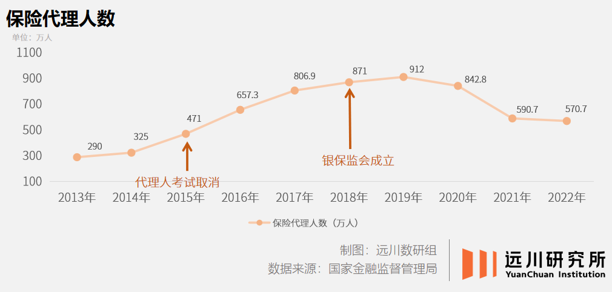

Jerome：从45岁开始，每年20万，10年，200万，到75岁入驻。活不到75怎么办？

1982年，一位美国商人以每年数百万美元的费用，聘请基辛格担任他的国际参谋。

这位前国务卿最广为人知的事件，便是秘密访华，促成了时任美国总统尼克松打破中美外交坚冰，而这位美国商人所谓的国际参谋，正是需要基辛格为其在中国的生意牵线搭桥。

这位商人名叫格林伯格，AIG的掌门人，1980年便联手当时中国唯一的保险公司，人保，成立了中国第一家合资保险公司——“中美保险公司”。而成立后格林伯格第一次来中国参加董事会，行程中访谈的对象就包括时任国务院副总理及中国人民银行行长。

规格之高，在那个“怕跟资产阶级打交道”的年代令人称奇。

可这家合资公司的背后，是双方完全相悖的初衷——**人保期望借力走向美国，但AIG想靠着人保开拓中国市场。**酒席上的谈笑迅速化为牌桌下的唇枪舌剑，双方各自引经据典，互相指责出工不出力，从北京一路吵到纽约。

政策的力量不容置疑，合作从成立之初就已埋下失败的伏笔。中美保险合资模式最终在人保“我方不宜主动提出拆伙的前提下”，一直拖到1994年才散伙。

而这时，格林伯格早已志不在此，毕竟AIG的全资子公司，友邦，已经在1992年正式拿到牌照，在上海南京西路1376号的上海商城五楼开业。

至今，友邦这块外商独资寿险牌照仍是目前唯一一张，更重要的是，友邦带来了一项彻底改变中国寿险行业的模式——代理人机制，并培养出上海滩第一批以“扫楼”为生的寿险营销员。

在今天听起来，这种模式似乎早已司空见惯，各大互联网公司的“地推铁军”其实也是代理人模式的一种，但在当时，这种舶来品彻底引爆了整个寿险市场，极低的保险覆盖率带来的巨大红利，为代理人们创造了丰厚的收入，一时间大批人才涌入保险市场，**到2004年，全国寿险代理人大军达到150万人。**

可这一模式如今已走向尽头。

事实上，保险经纪人在过去几年的数量其实是下降的。数据显示，整个保险行业的转折点从2018年就开始出现。行业从业者从巅峰时期的912万人，迅速减少至2022年的571万人。

从业者的高速流失的主因，是收入的降低。

以平安年报公布的代理人收入为例，2020年代理人寿险月均收入4729元，低于全国社会平均工资（同年城镇私营单位社平4811元/月）。

收入的降低代表着一个不争的事实：寿险不好卖了。

## **笨拙的寿险保单**

1975年，一位名叫詹姆斯·安德森的精算师发表了一段主题为“食人族人寿”的讲话，他认为，当时市场上的绝大多数寿险产品完全脱离了人们的真实需求，尤其是人们意识到保险公司靠着他们的保费赚的盆满钵满，但他们却拿着一份完全跑不赢通胀的收益的时候\[5\]。

通胀都高达10%了，这寿险年化利率才三五个点？用户亏钱，凭什么保险公司还有的赚？看来通胀焦虑，是个全球性问题。

20世纪70年代，美国正处于经济过热带来的恶性通胀中，1974年福特总统上台时，甚至在白宫请了一位牧师带领全国祷告，以祈求通胀早日结束——当年，美国的通货膨胀率达到了创纪录的12%。

恶性通胀的背景是受益于二战结束带来的经济高速增长，由于本土未遭受战火，加上战后婴儿潮的爆发，为美国创造了一个巨大的保险市场，1945到1965年间，美国人的保险支出增长了50%，寿险合同数量翻了三倍。

激增的保费和繁荣的资本市场为保险公司带来巨大利润，以至于巴菲特都在1967年，带着当时还是一家棉花厂的伯克希尔-哈撒韦去收购了两家保险公司，从而为股神的投资之路写下第一个传奇：**保费投资两年赚1000万美元\[6\]。**

当经济快速增长时，人们尚不会在意保单利率与保险公司利润之间的巨大差异，但当恶性通胀来临时，在购买时便定死的保单利率就显得不合时宜。

在这种矛盾之下，人们开始放弃保险转而购买基金等理财产品，而当保险行业意识到保费正在净流出的时候，也就有了安德森的这段演讲，而他演讲的下半段则推出了一种全新的，彻底颠覆了寿险行业的产品：**万能寿险。**

在演讲中，安德森设想了这样一个场景\[5\]：如果有一种保险，它同时拥有一份弹性年金保险账户和一个投资账户，并且每个月投保人都可以更改两个账户的投保额，那么这种保险不就可以应对不断变化的通胀率和不同的经济环境了吗？

这一设想很快便成为了现实，演讲后的第四年，加州人寿推出了第一份真正意义上的万能寿险，而到了1983年，几乎所有美国保险公司都推出了至少一种万能寿险保单，1985年，以当年保费计算，万能寿险达到整个市场年保费收入的38%，并成为国际三大寿险新险种之一。

而另外两大寿险新险种诞生环境与万能寿险及其类似，分别是同一时期在美国发扬光大的“分红保险”和20世纪50年代由英国发明的“投资连结保险”。

**这三种新险种的诞生，本质上都是在全球经济高速增长时，投保人与保险公司共享经济增长红利，且互相分担风险而诞生的妥协产物。**

但这并没有改变寿险的本质：**降低****人身****风险所带来的损失。**

最大的人身风险是死亡，一切寿险的基础，都是保险公司依据不同人群的死亡概率和一套复杂的数学模型，所计算出投保人所需要支付的金额和最终的赔付额。

这套数学模型的基础，被称为“生命表”。

17世纪中旬，随着欧洲冒险家们不断完成对整个地球的探索，全球式的海上贸易逐渐盛行。由贸易带来的庞大财富和与之相伴的风险推动了保险业的发展，但此时的保险更像是一个“口头约定”，几乎都是“如果我在xx日之前没有回来，那就给我的家人赔一笔钱”的形式\[3\]。

欧洲鼠疫的爆发提供了一个契机，英国要求各个教区每周公布死亡人数。一位名叫爱德华·哈雷的英国数学家、天文学家（哈雷彗星就是他发现的）拿着这些数据，编制完成了世界上第一份生命表，并由此诞生了年金的数学基础。

而在死亡之外，在完成世界上首例对人心脏移植手术后，南非医生Marius Barnard提出了一种观点：“很多人即使最终能够度过重病的考验活下来，但从财务上看他已经死了，医学只能挽救生理生命，无法挽救经济生命。”\[12\]

在这个医疗手段已经足够先进的年代，过去很多无能为力的重病都有治愈的可能，只不过对于绝大多数患者来说，其治疗成本难以负担，**而这也成为了20世纪80年代，****重疾险****在南非诞生的基础。**

这三次发生于海外的创新最终奠定了我国现代寿险行业的两类基础产品，即风险保障型和投资理财型，而这三次寿险创新，无论是经济环境改变，亦或是科技进步所推动，其本质上，都是当下保险的消费者产生了新的需求。

在此之后，世界在发生变化，可寿险业几乎没有任何改变。

## **和社会无缘的老人**

在YouTube上，仍有很多90年代可口可乐在日本拍摄的广告片，里面朝气蓬勃的模特会给人一种强烈的错觉——这是在日本拍的？

2014年，随着65岁以上人口比例正式突破25%，日本正式进入老龄化时代，人口结构几乎不可逆的改变，为整个国家的经济体系和政策导向带来了一系列的问题。

在2014年出版的《无缘社会》的开篇，就公布了一组数据\[7\]：“一年出现了三万两千例，原本过着极为正常的生活，却一点一点与社会失去关联，开始独自生活，最终孤独逝去的人。”

由于商业设施不断大型化和综合化，且私家车愈发普及，在21世纪初，日本购物消费设施不断向郊区转移，购物消费不断远距离化。以至于日本国土交通省专门创造了一个名词：**购物难民**——指的是想在直径500米范围内购物，但由于条件限制而无法实现的老年群体。

老年人消费被作为一个新兴市场提出，老年人专属的商品和服务被单独分离出来形成一个细分市场，老人专属食品、老年机、50岁以上女性专用护肤品等等不胜枚举。

其结果可想而知：除了保健品诈骗，老年人根本不会因为商品上贴了“老年人专属”的标签而多花一分钱，储蓄率高企不下。

老年人一步步脱离社会的成因有诸多因素，在这里没必要一一赘述。但无论何种原因，导致的结果都大同小异，**脱离社会的老年人并不缺钱，但生活却极其局促。**

这种情况自然引起了日本官方的重视，相对于经济上“失去的30年”，日本在健康服务上的成就，堪称全球教科书。

早在1978年，日本就推出了国民健康管理计划，至今仍在不断更新，并由此诞生了政府主导下，**医疗-介护-养老金**三位一体的社会保障体系，所有国家应对老龄化时，都要摸一摸日本的这块石头。

但这套体系也有负面影响——高龄老人的不断增加使得医疗体系和养老保障支出飞速增长，单从医保来看，政府需要负担超过80%的部分，预计到2040年，政府在医保上的开支将占整个日本GDP的24%。

在《长寿时代》一书中，曾高度概括式的总结了其成因\[1\]：

几乎少有机构将长寿时代的养老健康需求和金融产品创新结合起来，长此以往，资金得不到高效利用。

对于如何让老年人心甘情愿把钱从银行里拿出来反哺经济，又有一块美国人的石头：**养老社区。**

1962年《时代》杂志的封面故事采访了一位名叫沃尔特的65岁老人：“我太老了无法工作了，但又太年轻了，离死亡太遥远...我并不怕死，我只怕得一种病，一种需要我一直花钱住在医院里治疗的病。”

亚利桑那州的太阳城社区由此而生，说是养老社区，不如说这是一个完全由老年居民组成的城市。

太阳城社区占地面积高达36平方公里，比澳门还要多出五六个足球场的大小，并拥有40万常住人口，且其住户被限制在55岁以上。

时至今日，太阳城已是养老产业从业者学习“海外先进经验”的圣地。在年龄隔离的基础下，针对性地提供老年人需要的服务、并减少老年人不需要的场景，尽可能的建设老年人所熟悉、且能够产生共鸣的生活场所。

插一个知识点，年龄隔离顾名思义，就是在一个环境中只存在同一年龄群体的个体，19世纪中期由美国开始的学校分级教育正是源自于这一概念，如今我们的“小初高”各级学校也是这一理念的衍生，所谓的“18禁”“Z世代”也是年龄隔离的一种。

老年人容易与社会脱节，是由于他们逐渐退化的适应能力难以匹配日新月异的社会，而在老年人社区中，他们无需顺应社会的变化，与同样沉寂在上个世纪生活中的同龄人们一同缅怀过去。

这种社区事实上解决了一个问题：**将老年人重新带入社会经济发展的一环中，从购买房地产开始、到消费、服务等一系列经济活动中。**

可这依旧是房地产行业的一个分支，只解决了如何刺激老年人储蓄进入市场的问题，可在赠予下一代、健康、长寿、应对风险等因素的驱动下，老年人长期保持高储蓄率的问题依然没有解决。

数据显示，2022年我国65岁以上的老年人口达到2.09亿人，占全国人口的14.9%。按照65岁以上人口超过14%的标准，我国已经进入中度老龄化阶段，且随着出生率的下滑，我国老年化程度会逐年提升。

同时在一份名为《储蓄动机与老年人储蓄之谜》的论文中，作者通过统计学的方式，证明了我国老年人有明显的随着年龄增长，而提高储蓄率的倾向\[13\]。

我国同样也要面临和日本类似的问题，一方面需要市场刺激老年人经济，另一方面需要金融体系的创新来服务老年人的养老需求。

泰康保险提出了一种新的思路：**将养老服务和****人寿****保险一体化。**

**这一次，是来自中国的寿险创新。**

## **属于中国的寿险创新**

2008年底，在国务院明确指出“支持相关保险机构投资医疗机构和养老实体”后，泰康成为中国保险业第一家获得养老社区投资试点的企业。

时值十二五提出“到2014年基本形成‘9073’养老格局”，即90%的老年人在社会化服务协助下通过家庭照料养老， 7%的老年人通过购买社区照顾服务养老， 3%的老年人入住养老服务机构集中养老，但当时入驻养老机构比例1%都不到。

有了政策方向的明确，各方势力迅速开展养老产业，并在2013年彻底引爆整个市场，并被媒体称为“中国养老地产元年”。

但与之一同爆发的，还有来自舆论的不理解：以养老为名，实则圈地\[11\]。

此时的养老产业有三方主要力量：**一只是以万科、绿城、保利等为代表的房企系、一只是以中石化为代表的央企系、最后则是以泰康为首的险企系。**

对于房企而言，尽可能的缩短“买地—卖楼”这之间的资金周转周期是核心指标，可对养老地产来说，这一周期却出现了“买地—卖楼—服务”这三个环节，医疗保健中心、老年活动中心等大量医护及配套设施的建设及运营，与房企迅速回笼资金的目标不符，这才诞生了以养老地产为名，实则依旧是传统地产的模式。

因而，是否有长期稳定的优质养老服务，成为了评价养老产业的关键。

对于险资同样有类似的评价，对消费者而言，保险公司投资股票、债券、或是不动产并没有本质上的区别，只不过打着养老的旗号，依旧在圈地的行为容易被打上“意图不轨”的标签。

最终，时间给出了答案：**对于险资的质疑之声渐渐消退，反倒是以泰康为首的险企不断加码入局。**

转折发生在2018年，我国寿险保费收入正式进入低速增长期。

一方面是“第一张保单”红利吃尽，以重疾险为例，其有效被保险人近2亿人，家庭年收入10万以上的主力客群重疾险覆盖率已超六成，同时新客户本身来源于新加入的从业者，从业者失去增量意味着保险公司失去了最大的新客来源。

另一方面的收入，则是来源于老客户增加保险额度。但受限于寿险产品多年来几乎没有创新，各个产品都是在给付次数、赔付比例等概念上做文章，搞的金融行业快变成了数学科研，对客户的吸引力逐年下降。

但归根结底，保险产品的吸引力下滑，与上世纪发生在海外的场景极其类似：**当下的产品无法满足客户的真实需求。**

**这也是“泰康模式”诞生的重要背景——通过保险和养老的结合，真正从需求上提高保险产品的竞争力。**

模式诞生的背后，实则是一套完整的险企创新思路。

## **泰康模式**

2006年10月，如家在美国上市，一套将闲置厂房和办公楼简易装修整合便开业的模式斩获8亿美元市值，一度成为了当时的“先进方案”。而这也成为了泰康进军养老产业的最初设想：是否能将经营不善的养老院进行托管，以实现养老服务？

虽然这一尝试最终由于养老市场的不健全而没能成功，但它奠定了泰康进军养老产业的基础，即亲身进军实体经济，从过往的养老资金供给方，变为养老的实体服务方。

经过数年的探索和尝试，如今泰康模式的创新路径，可以从三个维度来理解。

首先在产品形态上，**泰康将传统虚拟的保险与实体的医养相结合**，在传统年金保险的基础上，附加一个未来入驻泰康之家高品质养老社区的确认函，形成了一种全新的产品“幸福有约”。

与美国的养老社区类似，泰康旗下的泰康之家，提供专为老年人服务的养老社区，并根据中国老人对健康就医方面的需求，开创了**“一个社区、一家康复医院”**的模式。目前，有超过8800位泰康居民生活在泰康已经运营的15个长寿社区中。

泰康之家·湘园

**其次，是改变了触达客户圈层。**在过往的保单销售中，险企几乎没有能力精准触达高净值人群。由于“幸福有约”是为未来高品质养老做储备，它的定价基础就是未来入住泰康之家的费用。

例如标准版的“幸福有约”产品，45岁左右的客户缴费10年，每年缴费20万元，到75岁入住泰康之家，基本能够覆盖养老的日常花费。所以“幸福有约”通过定价对客户进行天然定位，同时也给销售人员面向客户销售时有一个确定的标准，大大提升了销售的效率和“大单”的可能性。

**最后，是销售模式的改变。**过往保险销售方式，基本是“一个新销售员带来几个身边亲友”，也就是所谓的洗客户，这意味着增量完全和新加入的销售员数量挂钩，一旦失去新人入场，险企便失去增量。

泰康模式下，保险销售模式转型为“体验式营销”，相对于拿着一份精心修订的保险介绍单坐在办公室里和客户磨上一整天的嘴皮，泰康销售们能带着客户亲身体验其未来的养老生活方式，彻底改变死板的保险销售场景。

同时保险销售员们，也从单纯的销售转型为“健康财富规划师”，它们不仅仅为顾客提供保险和理财咨询，同时也肩负着为顾客提供医疗健康服务建议的责任。

在这三重改变下，泰康模式颠覆了寿险行业的资产负债结构。传统模式下，寿**险公司与客户的联系仅存在于“负债端”，自保险行业创立以来，公司和客户的关系皆是如此。**

而在泰康模式中，泰康利用险资自建养老产业更接近于服务业，也就是寿险公司首次在“资产端”也与客户产生联系。这种联系意味着保险公司不再仅仅是一名“投资者”，更是一份养老服务的“运营者”。

同时，这一模式与美国不同之处在于，**美国以房地产行业为基础的养老社区仅解决了“刺激老年人消费”的问题，并没能解决在日本发生的，长寿时代资本市场失去活水的困境。**

对于资本市场而言，泰康模式一方面激活高龄人群资金流向投资市场，另一方面，相对于过往险资被投资于股票、债券等领域，长期投资的资产品类和标的有限，而泰康则通过将险资投入养老社区等实体，让这些资金成为了资本市场中的“长线投资”。

毕竟在过去传统模式下，以年金为基础的保单绝大多数到期便会取走，这笔钱投资市场可能是20-30年，但在泰康模式下，其保单收益可以直接转换为入驻养老社区的费用，极大程度的延长了其资金流通于资本市场时间。

对于投保人而言，泰康模式一方面继续提供金融服务行业的理财功能，同时又解决了老龄化时代切实的养老需求，真正实现一张保单保全家——毕竟子女购买保单，为自己提供一种理财手段的同时，锁定了未来入住泰康之家享受养老服务的权益，同时这份权益还可以提供给自己年老的父母提前享受。

归根结底，泰康保险的创新，很大程度上脱离了保险行业一直以来在数学概念和产品形态上做文章的思路，而是基于对国内宏观环境的变化和客户具体需求的洞察，以养老社区的形式提供了一套完整的解决方案。老龄化焦虑笼罩的当下，在中国乃至全球保险业，泰康都是第一批交卷的公司。

包含保险在内的金融行业是一个受到高度监管的行业，对于“改革”“创新”等名词天然存在极大的抵触感，稳定才是这个行业亘古不变的主题，从“改开”到“入世”，从阿里回港上市到全面注册制，每一次重大决策背后的主导人必定承受着来自方方面面的巨大压力。

对于泰康来说同样如此，面对全球人口老龄化带来的社会、经济、国家财政等等方面带来的挑战，董事长陈东升意识到寿险行业必须作出改变，进军养老产业势在必行。

这条并不好走的路，泰康从2007年开始，走了16年，并且还在继续着创新的探索。

## **尾声**

今年7月初，泰康保险集团创始人、董事长兼CEO陈东升在一次公开活动上，做了名为《长寿时代 商业向善》的发言，他在演讲中说\[14\]：2008年在美国养老社区看到95岁老爷爷在跑步机上跑步时我很惊讶，今天我们知道这是一种生活方式。现在，再也没有人说我们拿养老搞地产，这是我们坚持用行动改变大家观念，长寿时代是健康时代，是财富时代。

预计到2026年，泰康在医院、养老社区、纪念园的投资将达到1000亿，通过在全国重资产布局，构造长寿闭环护城河。

作为“保险+资产+服务”商业闭环的模式的创造者，泰康模式的塑造既有保险业历史进程的推动，也有各种各样的独特因素，比如陈东升前瞻性的预判与坚决的布局，重资产模式和服务思路上的设计，以及泰康本身长期的经验与执行力。

更重要是的，在保险业的创新长期以西方市场主体推动的背景下，泰康基于中国市场的复杂特点，交出了一份中国保险业的创新答卷。在老龄化席卷全球的时期，保险业的创新之路该怎么走，泰康给出了一份值得参考的答案。

**参考资料**

\[1\] 《长寿时代》陈东升

\[2\] 《迷失的盛宴》陈恳

\[3\] 《保险的起源与繁盛》易行健

\[4\] 阳光人寿王润东：客户分层决定了哪些代理人更适合卖保险

\[5\] A Brief History of Universal Life

\[6\] A Five-Sigma Event THE WORLD ’S GREATEST INVESTOR

\[7\] 《无缘社会》HNK

\[8\] A multi-million insurance fraud that preyed on disease, poverty, desperation

\[9\] Meet the residents of Sun City—where aging is actually fun

\[10\] EVOLUTION OF LIFE INSURANCE INDUSTRY THROUGHOUT THE WORLD

\[11\] 朱凤泊：我们还没准备好"老去"

\[12\] MEMO2018 三联生活周刊的观察与态度

\[13\] 储蓄动机与老年人储蓄之谜

\[14\] 泰康保险集团创始人陈东升：寿险业新时代来临 养老革命引领商业向善，财联社

**作者：张泽一**

**编辑：戴老板**

**视觉设计：疏睿**

**责任编辑：张泽一**

