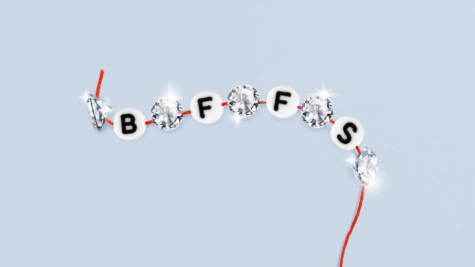

Jerome:我觉得吧，黄金他不香吗？

## Diamonds Are for Girls’ Best Friends  

钻石是女孩最好的朋友

As marriage rates decline, the diamond industry is turning its eye to platonic relationships.  

随着结婚率的下降，钻石行业正将目光转向柏拉图式的关系。

Photo-Illustration by The Atlantic. Sources: Getty  

图片来源：The Atlantic来源：Getty

August 23, 2023, 7:30 AM ET  

美国东部时间2023年8月23日上午7：30

“It is one of my love languages to gift,” she says, looking lovingly at the woman to her right, after wiping a tear from her eye. [The two are filmed in black and white](https://www.ispot.tv/ad/16Xr/jared-mothers-day-love-language), and one is wearing a diamond-pendant necklace that shines particularly brightly in the muted setting. Usually the giving of diamonds is associated with lovers making the leap into marriage. But here, in an ad for Jared jewelers, two long-lost sisters describe how, after meeting for the first time, they chose to honor the occasion with diamonds.  

“这是我送礼物的爱的语言之一，”她说，深情地看着她右边的女人，擦去了她眼中的泪水。这两个人都是白色拍摄的，其中一个戴着钻石吊坠项链，在柔和的背景下格外明亮。通常，赠送钻石与恋人步入婚姻有关。但在这里，在贾里德珠宝商的一则广告中，两个失散多年的姐妹篇描述了她们第一次见面后，如何选择用钻石来荣誉这一时刻。

Jared and other diamond merchants have similar ads. [In another](https://www.ispot.tv/ad/brnS/jared-sisterhood-save-15) from Jared, a different pair of sisters speak of how they share an inherited ring, before a voice-over asks you, the viewer, to “express your extraordinary love” with diamond jewelry. A recent [Brilliant Earth ad](https://www.ispot.tv/ad/1gEe/brilliant-earth-never-too-old-to-play-dress-up) features a mother and a daughter showing off their jewelry, with one saying, “You are never too old to play dress-up.” Hallmark has a landing page that suggests that you [buy diamond jewelry for your friends](https://hallmarkfinejewelry.com/collections/diamond-jewelry-friends), to “show appreciation for a relationship that brings so much joy.”  

贾里德和其他钻石商人也有类似的广告。在Jared的另一个视频中，一对不同的姐妹篇讲述了她们如何分享一个继承的戒指，然后画外音要求你，观众，用钻石珠宝“表达你非凡的爱”。最近的一则“灿烂地球”广告中，一位母亲和一位女儿展示了她们的珠宝，其中一位说：“你永远不会太老，不能玩装扮游戏。”霍尔马克公司有一个登陆页面，建议你为你的朋友购买钻石珠宝，以“表达对一段带来如此多欢乐的关系的感激之情”

Enjoy a year of unlimited access to The Atlantic—including every story on our site and app, subscriber newsletters, and more.  

享受一年的无限制访问亚特兰大-包括我们网站和应用程序上的每一个故事，订阅者通讯等等。

[Become a Subscriber  成为订阅者](https://accounts.theatlantic.com/products/?source=lost-inventory&referral=lost-inventory)

Ever since the diamond industry [invented the concept of the diamond engagement ring](https://www.theatlantic.com/international/archive/2015/02/how-an-ad-campaign-invented-the-diamond-engagement-ring/385376/) in the 1940s as a necessary precursor to marriage, diamonds have been associated with romantic (and, until recently, exclusively heterosexual) love. The idea was that diamonds were rare and thus valuable, just like your love—never mind that it was a [false scarcity instituted by diamond-mine owners](https://www.theatlantic.com/magazine/archive/1982/02/have-you-ever-tried-to-sell-a-diamond/304575/) to drive up prices. But diamond sellers have also tried different tactics over the years to expand their reach. There was the “Raise Your Right Hand” campaign from De Beers in 2003, which encouraged women to buy diamonds for themselves. Another campaign in the 1980s tried to persuade [women to buy diamonds for men](https://www.nytimes.com/2013/05/05/fashion/weddings/how-americans-learned-to-love-diamonds.html?pagewanted=1&_r=1). And the rebranding of brown diamonds—typically used for cutting or as an abrasive in industrial settings—into “chocolate” diamonds a decade ago was an attempt to [move an oversupply](https://jezebel.com/the-truth-about-chocolate-diamonds-5887100).  

自从钻石行业在20世纪40年代发明了钻石订婚戒指的概念，作为婚姻的必要前提，钻石一直与浪漫（直到最近，完全是异性恋）的爱情联系在一起。他们的想法是钻石是稀有的，因此是有价值的，就像你的爱情一样-但钻石卖家多年来也尝试了不同的策略来扩大他们的影响力。2003年，戴比尔斯发起了“举起你的右手”运动，鼓励女性为自己购买钻石。20世纪80年代的另一场运动试图说服女性为男性购买钻石。而10年前将褐色钻石（通常用于切割或在工业环境中用作研磨剂）更名为“巧克力”钻石，也是为了解决供应过剩的问题。

[Read: Diamonds aren’t special and neither is your love  

钻石并不特别，你的爱也不特别。](https://www.theatlantic.com/family/archive/2021/01/diamonds-arent-special-and-neither-is-your-love/617859/)

So perhaps it shouldn’t be a surprise that a new marketing strategy is upon us, one in which women are being encouraged to buy diamonds as a show of friendship and sisterhood. The style magazine [_The Kit_](https://thekit.ca/shopping/cool-diamond-rings-mejuri/) recently ran a story on “why buying your best friends diamonds is a feminist act.” In that article, Eva Hartling, a marketing strategist, says, “Women used to say, ‘I can’t buy my friend a diamond ring because it should be her husband buying her that.’ The change of mindset came from consumers and now the industry has caught up.” But maybe it’s the other way around.  

因此，一种新的营销策略出现在我们面前，也许并不令人惊讶，在这种策略中，女性被鼓励购买钻石，以显示友谊和姐妹情谊。时尚杂志The Kit最近发表了一篇关于“为什么给你最好的朋友买钻石是一种女权主义行为”的文章。在那篇文章中，营销策略师伊娃·哈特林（Eva Hartling）说：“女人们过去常说，'我不能给朋友买钻戒，因为应该是她丈夫给她买。'消费者改变了观念，现在整个行业已经迎头赶上。”但也许恰恰相反。

The diamond industry has succeeded in associating diamonds with marriage. But marriage rates have [steadily declined in the U.S. since the ’80s](https://www.cdc.gov/nchs/data/hestat/marriage_rate_2018/marriage_rate_2018.pdf), even accounting for a [post-lockdown blip in 2021](https://blogs.cdc.gov/nchs/2023/02/14/7278/). And according to the diamond-industry analyst [Paul Zimnisky](https://www.paulzimnisky.com/about), though the total number of diamonds purchased in the bridal space has remained steady over the past decade because of population growth, that per capita decline is something the diamond industry has noticed. As a result, he has observed the industry attempting to diversify its marketing strategies to associate diamonds with more than just engagement rings.  

钻石业成功地将钻石与婚姻联系在一起。但美国的结婚率却在稳步下降。从80年代开始甚至算上2021年封锁后的短暂时间钻石行业分析师保罗·齐姆尼斯基（Paul Zimnisky）表示，尽管由于人口增长，过去10年新娘购买的钻石总量保持稳定，但钻石行业已经注意到了人均钻石数量的下降。因此，他观察到钻石行业试图使其营销策略多样化，将钻石与订婚戒指以外的东西联系起来。

Don’t miss what matters. Sign up for The Atlantic Daily newsletter.  

不要错过重要的事情。注册大西洋日报。

Zimnisky also told me there has been a steady rise in women buying expensive jewelry (diamond and otherwise) for themselves. “Twenty-five to 30 years ago, bridal represented upwards of half of global diamond demand. It’s probably a third now, and that self-purchase category was probably less than 10 percent \[back then\], and now that’s another third,” he said So, as with the “Raise Your Right Hand” campaign, diamond sellers today are trying to reach women who want to buy diamonds on their own.  

Zimnisky还告诉我，为自己购买昂贵珠宝（钻石和其他）的女性人数稳步上升。“25到30年前，新娘占全球钻石需求的一半以上。现在可能是三分之一，而自助购买类别可能不到10%\[当时\]，现在又是三分之一，”他说，所以，就像“举起你的右手”运动一样，今天的钻石卖家正试图接触那些想自己购买钻石的女性。

## Recommended Reading 推荐阅读

[From 1982: Have you ever tried to sell a diamond?  

1982年：你有没有试过卖钻石？](https://www.theatlantic.com/magazine/archive/1982/02/have-you-ever-tried-to-sell-a-diamond/304575/)

The rise of lab-created diamonds has also broadened the perceived consumer base for diamonds. Though the [Natural Diamond Council](https://www.naturaldiamonds.com/council/) (basically a group of diamond producers invested in keeping natural-diamond sales strong) stresses that “only natural diamonds” will do, lab-created diamonds have [become more and more popular](https://fashionista.com/2023/04/lab-grown-mined-diamonds-debate-social-media)—they’re a perhaps more sustainable product that is molecularly identical. And because they can be created in a lab, they are much cheaper. “If you just go back to 2015, a lab diamond \[cost\] maybe 10 percent less than a natural diamond; now it’s 90 percent less,” Zimnisky said.  

实验室制造的钻石的兴起也扩大了钻石的消费者基础。虽然天然钻石理事会（基本上是一群钻石生产商投资保持天然钻石销售强劲）强调“只有天然钻石”才能做到，但实验室制造的钻石已经变得越来越受欢迎-它们可能是一种分子相同的更可持续的产品。而且因为它们可以在实验室里制造，所以它们便宜得多。“如果你回到2015年，实验室钻石的成本可能比天然钻石低10%;现在减少了90%。”

Loretta Volpe, the chair of direct and interactive marketing at the Fashion Institute of Technology who has worked in diamond-industry marketing, says the relatively lower price of lab diamonds make them seem like a more reasonable and casual gift for a friend. For all but the wealthiest, a diamond has long been a grand, once-in-a-lifetime gesture—something it’s been said you shouldn’t even think about unless you’ve saved up two months’ salary. But again, given that the formula (your monthly salary, multiplied by two, equals what an engagement ring should cost) was [made up by De Beers](https://www.goodhousekeeping.com/life/money/a32609/two-months-salary-engagement-ring-rule-origin/), now it just doesn’t have to be as big of a deal.  

时装技术学院（Fashion Institute of Technology）直接和互动营销主席洛蕾塔·沃尔佩（Loretta Volpe）曾从事钻石行业营销工作，她说，实验室钻石相对较低的价格使它们看起来更像是送给朋友的一份合理和随意的礼物。对于除了最富有的人以外的所有人来说，钻石一直都是一个盛大的，一生一次的手势--有人说，除非你存了两个月的工资，否则你甚至不应该考虑它。但是，考虑到这个公式（你的月薪乘以2，等于订婚戒指的价格）是由戴比尔斯公司制定的，现在它就不必那么大了。

Marketers have probably picked up on the shifting conversation around friendship too. In recent years, experts have been stressing the [importance of](https://www.washingtonpost.com/wellness/2023/01/09/how-to-adult-friends-relationships/) social [connection](https://www.hhs.gov/sites/default/files/surgeon-general-social-connection-advisory.pdf), and there’s a growing recognition by the media that [friends](https://www.theatlantic.com/projects/friendship-files/) and chosen family should be acknowledged and [celebrated](https://www.nytimes.com/2023/02/14/well/family/friendship-platonic-love.html) as much as romantic relationships.  

营销人员可能也注意到了围绕友谊的谈话的变化。近年来，专家们一直在强调社会联系的重要性，媒体也越来越认识到，朋友和选定的家人应该像浪漫关系一样得到认可和庆祝。

Make your inbox more interesting with newsletters from your favorite Atlantic writers.  

让您的收件箱更有趣的新闻通讯从您最喜爱的大西洋作家。

[Browse Newsletters  浏览新闻简报](https://www.theatlantic.com/newsletters/?source=lost-inventory&referral=lost-inventory)

That conversation may have inspired more people to think about showing their appreciation for nonromantic relationships with gifts. And a friendly gift of jewelry is far more likely to be given and received by women: Jewelry is still mostly seen as a feminine object. “I think it’s more permissible now” to express multiple kinds of affection with diamonds, Volpe told me, though more so with something like a diamond pendant. Zimnisky agrees: “I think there probably was a stigma at one point around doing something like that, and I think that’s probably been eroded at this point.”  

这次谈话可能激发了更多的人考虑用礼物来表达他们对非浪漫关系的赞赏。女性更有可能赠送和接受珠宝这样的友好礼物：珠宝仍然主要被视为女性的物品。沃尔普告诉我，“我认为现在更允许”用钻石来表达多种感情，尽管用钻石吊坠之类的东西更是如此。Zimnisky同意：“我认为，在做这样的事情的时候，可能有一种耻辱感，我认为这一点可能已经被侵蚀了。”

[Read: The 6 forces that fuel friendship  

阅读：6种力量，燃料友谊](https://www.theatlantic.com/family/archive/2022/06/six-ways-make-maintain-friends/661232/)

Perhaps buying a diamond necklace for your best friend is a genuine gesture of love and appreciation. But also, the idea that a diamond is the best way to symbolize your love for your sister or your friend or any other important relationship in your life is probably coming from the people who want to sell you diamonds. “I mean, it’s a business,” Zimnisky said. “It’s not about a tradition; it’s not about anything other than doing what they need to do to make the most money.”  

也许为您最好的朋友购买钻石项链是一种真正的爱和感激之情。但是，钻石是象征你对你的姐妹或朋友或你生活中任何其他重要关系的爱的最佳方式的想法可能来自那些想卖给你钻石的人。“我的意思是，这是一门生意，”Zimnisky说。“这不是关于传统;这不是关于做他们需要做的事情来赚最多的钱。“

Consumers _have_ changed their mindset. Friendships have become something to celebrate, and diamond purchasers don’t always need to be men buying for their future wife. But then again, no one ever needs to buy a diamond at all. Whatever society’s priorities are, whether it’s friendship or romantic love or pride in self-accomplishment, marketers will try to attach products to those feelings. The push to remind women that they can buy diamonds on their own, for themselves or for other women in their life, is just the latest strategy from an industry that has long tried to convince the public that its product is more valuable than it really is. So buy your friend a diamond if you want. But the friendship is the rare and beautiful thing, not the diamond.  

消费者改变了他们的心态。友谊已经成为值得庆祝的事情，钻石购买者并不总是需要为他们未来的妻子购买的男人。但话又说回来，根本没有人需要买钻石。无论社会的优先级是什么，无论是友谊、浪漫的爱情还是对自我成就的自豪感，营销人员都会试图将产品与这些情感联系起来。提醒女性，她们可以自己购买钻石，为自己或为生活中的其他女性购买钻石，这只是一个行业的最新策略，该行业长期以来一直试图说服公众，其产品比实际价值更有价值。所以如果你想的话就给你朋友买颗钻石吧。但友谊是珍贵而美丽的东西，而不是钻石。

[Jaya Saxena](https://www.theatlantic.com/author/jaya-saxena/) is a writer and editor from New York City. She is a correspondent for _Eater_ and the series editor for _Best American Food Writing._  

Jaya Saxena是来自纽约市的作家和编辑。她是《食客》的记者，也是《最佳美国美食写作》的系列编辑。
