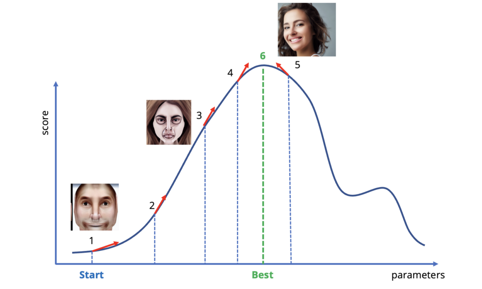
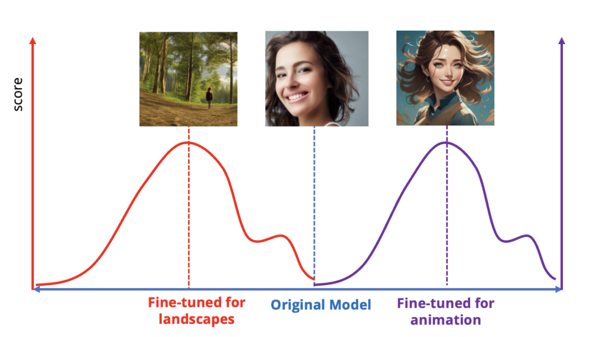
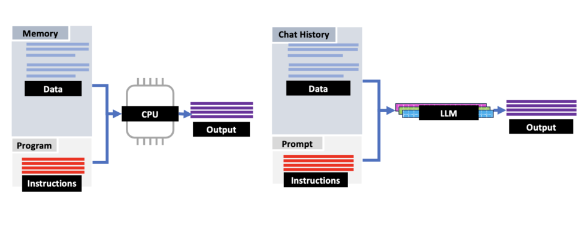
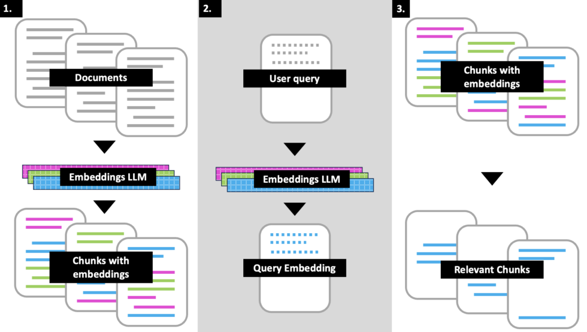

#### do anything —  做任何事情——

## Until recently, AI models were specialized tools. Modern LLMs are different.  

直到最近，人工智能模型还是专门的工具。现代LLMs是不同的。

Aurich Lawson | Getty Images  

奥里希·劳森 |盖蒂图片社

The chief technology officer of a robotics startup told me earlier this year, “We thought we’d have to do a lot of work to build ‘ChatGPT for robotics.’ Instead, it turns out that, in a lot of cases, ChatGPT _is_ ChatGPT for robotics.”  

今年早些时候，一家机器人初创公司的首席技术官告诉我，“我们认为我们必须做很多工作来构建'机器人ChatGPT'。相反，事实证明，在很多情况下，ChatGPT是机器人的ChatGPT。

Until recently, AI models were specialized tools. Using AI in a particular area, like robotics, meant spending time and money creating AI models specifically and only for that area. For example, Google’s AlphaFold, an AI model for predicting protein folding, was trained using protein structure data and is only useful for working with protein structures.  

直到最近，人工智能模型还是专门的工具。在特定领域（如机器人技术）中使用人工智能意味着花费时间和金钱专门针对该领域创建人工智能模型。例如，谷歌的AlphaFold是一种用于预测蛋白质折叠的AI模型，它是使用蛋白质结构数据训练的，只对处理蛋白质结构有用。

So this founder thought that to benefit from generative AI, the robotics company would need to create its own specialized generative AI models for robotics. Instead, the team discovered that for many cases, they could use off-the-shelf ChatGPT for controlling their robots without the AI having ever been specifically trained for it.  

因此，这位创始人认为，要从生成式AI中受益，机器人公司需要为机器人技术创建自己的专用生成AI模型。相反，该团队发现，在许多情况下，他们可以使用现成的ChatGPT来控制他们的机器人，而无需AI专门训练过。

I’ve heard similar things from technologists working on everything from health insurance to semiconductor design. To create ChatGPT, a chatbot that lets humans use generative AI by simply having a conversation, OpenAI needed to change large language models (LLMs) like GPT3 to become more responsive to human interaction.  

我从从事从健康保险到半导体设计等各个领域的技术人员那里听到了类似的事情。为了创建ChatGPT，一个让人类通过简单地进行对话来使用生成AI的聊天机器人，OpenAI需要改变像GPT3这样的大型语言模型（LLM），以更好地响应人类互动。

But perhaps inadvertently, these same changes let the successors to GPT3, like GPT3.5 and GPT4, be used as powerful, general-purpose information-processing tools—tools that aren’t dependent on the knowledge the AI model was originally trained on or the applications the model was trained for. This requires using the AI models in a completely different way—programming instead of chatting, new data instead of training. But it's opening the way for AI to become general purpose rather than specialized, more of an “anything tool.”  

但也许无意中，这些相同的变化让 GPT3 的继任者（如 GPT3.5 和 GPT4）被用作强大的通用信息处理工具——这些工具不依赖于 AI 模型最初训练的知识或模型训练的应用程序。这需要以完全不同的方式使用AI模型 - 编程而不是聊天，新数据而不是训练。但它为人工智能开辟了道路，使其成为通用而非专用，更像是一种“任何工具”。

Now, an important caveat in a time of AI hype: When I say “general purpose” and “anything tool,” I mean in the way CPUs are general purpose vs, say, specialized signal-processing chips. They are tools that can be used for a wide variety of tasks, _not_ all-powerful and all-knowing. And just like good programmers don’t deploy code to production without code review and unit tests, AI output will need its own processes and procedures. The applications I talk about below are tools for multiplying human productivity, not autonomous agents running amok. But the important thing is to recognize what AI _can_ usefully do.  

现在，在人工智能炒作的时代，一个重要的警告是：当我说“通用”和“任何工具”时，我的意思是CPU是通用的，而不是专用的信号处理芯片。它们是可用于各种任务的工具，而不是全能和无所不知的。就像优秀的程序员不会在没有代码审查和单元测试的情况下将代码部署到生产环境中一样，人工智能输出也需要自己的流程和程序。我在下面讨论的应用程序是用于提高人类生产力的工具，而不是横行运行的自主代理。但重要的是认识到人工智能可以做什么。

So to that end, how did we get here?  

那么，我们是如何走到这一步的呢？

## Fundamentals: Probability, gradient descent, and fine-tuning  

基础知识：概率、梯度下降和微调

Let’s take a moment to touch on how the LLMs that power generative AI work and how they’re trained.  

让我们花点时间谈谈为生成式人工智能提供动力的LLM是如何工作的，以及它们是如何训练的。

LLMs like GPT4 are probabilistic; they take an input and predict the probability of words and phrases relating to that input. They then generate an output that is most likely to be appropriate given the input. It’s like a very sophisticated auto-complete: Take some text, and give me what comes next. Fundamentally, it means that generative AI doesn’t live in a context of “right and wrong” but rather “more and less likely.”  

像 GPT4 这样的 LLM 是概率性的;他们接受输入并预测与该输入相关的单词和短语的概率。然后，它们生成一个最适合给定输入的输出。这就像一个非常复杂的自动完成：拿一些文本，然后告诉我接下来会发生什么。从根本上说，这意味着生成式人工智能不是生活在“对与错”的环境中，而是“越来越不可能”。

Being probabilistic has strengths and weaknesses. The weaknesses are well-known: Generative AI can be unpredictable and inexact, prone to not just producing bad output but producing it in ways you’d never expect. But it also means the AI can be unpredictably powerful and flexible in ways that traditional, rule-based systems can’t be. We just need to shape that randomness in a useful way.  

概率有优点和缺点。弱点是众所周知的：生成式人工智能可能是不可预测和不准确的，不仅容易产生糟糕的输出，而且会以你意想不到的方式产生它。但这也意味着人工智能可以以传统的、基于规则的系统无法做到的方式变得不可预测的强大和灵活。我们只需要以一种有用的方式塑造这种随机性。

Here’s an analogy. Before quantum mechanics, physicists thought the universe worked in predictable, deterministic ways. The randomness of the quantum world came as a shock at first, but we learned to embrace quantum weirdness and then use it practically. Quantum tunneling is fundamentally stochastic, but it can be guided so that particles jump in predictable patterns. This is what led to semiconductors and the chips powering the device you’re reading this article on. Don’t just accept that God plays dice with the universe—learn how to load the dice.  

打个比方。在量子力学出现之前，物理学家认为宇宙以可预测的、确定性的方式运作。量子世界的随机性起初令人震惊，但我们学会了接受量子怪异，然后实际使用它。量子隧穿基本上是随机的，但它可以被引导，使粒子以可预测的模式跳跃。这就是导致半导体和芯片为您正在阅读本文的设备供电的原因。不要只接受上帝与宇宙玩骰子——学习如何装骰子。

The same thing applies to AI. We train the neural networks that LLMs are made of using a technique called “gradient descent.” Gradient descent looks at the outputs a model is producing, compares that with training data, and then calculates a “direction” to adjust the neural network’s parameters so that the outputs become “more” correct—that is, to look more like the training data the AI is given. In the case of our magic auto-complete, a more correct answer means output text that is more likely to follow the input.  

同样的事情也适用于人工智能。我们使用一种称为“梯度下降”的技术训练LLM的神经网络。梯度下降查看模型正在生成的输出，将其与训练数据进行比较，然后计算一个“方向”来调整神经网络的参数，使输出变得“更”正确，也就是说，看起来更像AI给出的训练数据。在我们的魔术自动完成的情况下，更正确的答案意味着输出文本更有可能跟随输入。

Probabilistic math is a great way for computers to deal with words; computing how likely some words are to follow other words is just counting, and “how many” is a lot easier for a computer to work with than “more right or more wrong.” Produce output, compare with the training data, and adjust. Rinse and repeat, making many small, incremental improvements, and eventually you'll turn a neural network that spits out gibberish into something that produces coherent sentences. And this technique can also be adapted to pictures, DNA sequences, and more.  

概率数学是计算机处理单词的好方法;计算一些单词跟随其他单词的可能性只是在计算，对于计算机来说，“多少”比“更正确或更错误”更容易使用。生成输出，与训练数据进行比较，然后进行调整。冲洗并重复，进行许多小的渐进式改进，最终你会把一个吐出胡言乱语的神经网络变成产生连贯句子的东西。这种技术也可以适用于图片、DNA序列等。

[Enlarge](https://cdn.arstechnica.net/wp-content/uploads/2023/08/genai4.png) / Illustrative example of gradient descent (or in this case, ascent) using an image AI model instead of text, showing how incremental adjustment improves the model’s performance.  

放大/说明性示例 使用图像 AI 模型而不是文本进行梯度下降（或在本例中为上升），显示增量调整如何提高模型的性能。

Gradient descent is a big deal. It means that creating AI models is iterative. You start with a model that produces mostly wrong (less likely) output and train it until it produces mostly right (more likely) output. But gradient descent also lets you take an existing model that’s already been trained and tweak it to your liking.  

梯度下降是一件大事。这意味着创建 AI 模型是迭代的。你从一个产生大部分错误（不太可能）输出的模型开始，然后训练它，直到它产生大部分正确（更有可能）的输出。但是梯度下降也可以让你采用已经训练过的现有模型，并根据自己的喜好进行调整。

This is what enables one of the most powerful techniques in modern AI: fine-tuning. Fine-tuning is a way of using gradient descent to take an AI model that’s already been trained and specializing it in a particular way by training it on a curated set of data. The training uses gradient descent from an already working model to make the AI better at managing or producing that specific kind of data.  

这就是现代人工智能中最强大的技术之一：微调。微调是一种使用梯度下降来获取已经过训练的 AI 模型的方法，并通过在一组精选的数据集上对其进行训练，以特定方式对其进行专业化。训练使用来自已经工作的模型的梯度下降，使AI更好地管理或生成特定类型的数据。

For example, people have taken the Stable Diffusion model, which creates images from text, and fine-tuned it to be especially good at making anime images or landscapes. And of course there are people fine-tuning language models designed for text to work better with advertising copy, legal documents, and so forth.  

例如，人们采用了稳定扩散模型，该模型从文本中创建图像，并将其微调为特别擅长制作动漫图像或风景。当然，有些人会微调为文本设计的语言模型，以便更好地与广告文案、法律文件等配合使用。

[Enlarge](https://cdn.arstechnica.net/wp-content/uploads/2023/08/genai6.png) / A cartoon image showing how fine-tuning can be used to adjust an existing AI model to produce a different kind of output.  

放大 / 卡通图像，显示如何使用微调来调整现有的AI模型以产生不同类型的输出。

But fine-tuning goes well beyond getting AI models to specialize in particular subject areas. It can also be used to train AI models _how_ to respond and produce output. It’s a powerful tool that has played a big role in moving generative AI forward, including the two key innovations that led to the creation of ChatGPT.  

但微调远远超出了让人工智能模型专注于特定主题领域。它还可用于训练AI模型如何响应和产生输出。这是一个强大的工具，在推动生成式人工智能向前发展方面发挥了重要作用，包括导致创建 ChatGPT 的两项关键创新。

## Innovation 1: Following commands  

创新1：以下命令

When OpenAI released GPT2 back in 2019, it was an exciting curiosity that could write realistic stories based on short prompts. For example, it wrote some cool ones about [unicorns in the Andes](https://arstechnica.com/information-technology/2019/02/researchers-scared-by-their-own-work-hold-back-deepfakes-for-text-ai).  

当 OpenAI 在 2019 年发布 GPT2 时，这是一种令人兴奋的好奇心，可以根据简短的提示编写现实的故事。例如，它写了一些关于安第斯山脉独角兽的很酷的文章。

But using GPT2 was like playing a word-association game, in that output followed input randomly but not usefully. For example, say you wanted that article about unicorns in the Andes. But what if you wanted a long-form article? Or what if you wanted a light, breezy, bulleted list instead?  

但是使用 GPT2 就像玩单词联想游戏，因为输出随机跟随输入，但没有用。例如，假设你想要那篇关于安第斯山脉独角兽的文章。但是，如果您想要一篇长篇文章怎么办？或者，如果您想要一个轻巧、轻松的项目符号列表怎么办？

Working with GPT2 was like trying to make a spray paint painting with a spray can but no stencils and with a paint nozzle that doesn't let you control the width of the spray line. It’s possible to create art, but it's very difficult to make the specific painting you have in mind.  

使用 GPT2 就像尝试使用喷雾罐但没有模板和不允许您控制喷涂线宽度的油漆喷嘴进行喷漆。创作艺术是可能的，但要制作出你心目中的特定绘画是非常困难的。

The problem of getting AI to do what a human user wants is called “AI alignment.” You might have heard people talking about the “Big-A” alignment problems of building AI into society in such a way that it aligns with our ethics and doesn’t kill us all. But there’s also a “small-A” alignment problem: How do you make the output of a generative AI system more controllable by the human user? This is also sometimes called “steerability.”  

让AI做人类用户想要的事情的问题被称为“AI对齐”。你可能听说过人们谈论将人工智能建设到社会中的“大A”对齐问题，使其符合我们的道德规范，不会杀死我们所有人。但还有一个“小A”对齐问题：如何使生成AI系统的输出更容易被人类用户控制？这有时也称为“可操纵性”。

GPT3 was a step forward from GPT2 in the length and complexity of the text that it could generate. But just as importantly, it featured a breakthrough in alignment: GPT3 could explicitly follow commands. OpenAI’s researchers realized that by fine-tuning GPT3 with examples of commands paired with responses to those commands, they could make GPT3 understand how to explicitly follow commands and answer questions.  

GPT3 在可以生成的文本的长度和复杂性方面比 GPT2 向前迈出了一步。但同样重要的是，它在对齐方面取得了突破：GPT3 可以明确地遵循命令。OpenAI的研究人员意识到，通过使用与对这些命令的响应配对的命令示例微调GPT3，他们可以使GPT3了解如何明确遵循命令并回答问题。

This is a natural extension of the “auto-complete” capability—training the AI that the next words to come after a question should be an answer rather than an extension of the question. And the next words after a command like “write me a poem” should be the poem being asked for and not a longer version of the command.  

这是“自动完成”功能的自然延伸 - 训练AI问题之后的下一个单词应该是答案而不是问题的扩展。命令后面的下一个单词，如“给我写一首诗”应该是被要求的诗，而不是命令的更长版本。

Say you want an article about scientists discovering unicorns in the Andes. Instead of simply writing a summary prompt and letting the AI fill out a few paragraphs, you could tell GPT3 explicitly, "Write a short article about scientists discovering unicorns in the Andes, in the style of a Buzzfeed list." And it would do so.  

假设你想要一篇关于科学家在安第斯山脉发现独角兽的文章。与其简单地写一个摘要提示并让AI填写几段，不如明确地告诉GPT3，“写一篇关于科学家在安第斯山脉发现独角兽的短文，以Buzzfeed列表的风格。它会这样做。

Or you could tell it, "Write an article about scientists discovering unicorns in the Andes in the style and voice of a long-form New Yorker article." And it would write something more appropriate to that prompt.  

或者你可以说，“写一篇关于科学家在安第斯山脉发现独角兽的文章，以一篇长篇《纽约客》文章的风格和声音。它会写一些更适合该提示的内容。

This was a huge step forward because it meant that controlling the AI could be done simply and directly in human language instead of writing a computer program. And OpenAI didn’t have to explicitly build in the ability to follow commands in the structure of GPT3; instead, it just built a flexible, powerful language model and fine-tuned it with examples of commands and responses.  

这是向前迈出的一大步，因为这意味着控制人工智能可以简单直接地用人类语言完成，而不是编写计算机程序。OpenAI 不必在 GPT3 的结构中明确构建遵循命令的能力;相反，它只是构建了一个灵活、强大的语言模型，并使用命令和响应的示例对其进行了微调。

## Innovation 2: Taking feedback  

创新2：接受反馈

Following commands made GPT3 a lot easier to work with than GPT2. But it was still limited. Working with an AI like this is a bit like playing a slot machine. Pull the lever (give an input), get an output. Maybe it’s good, maybe it’s not. If not, try again. But as every artist, programmer, or writer knows, that’s not how creation works. Creation, like gradient descent for AI training, is best when it’s iterative.  

以下命令使 GPT3 比 GPT2 更容易使用。但它仍然有限。与这样的AI一起工作有点像玩老虎机。拉动杠杆（给出输入），获得输出。也许是好的，也许不是。如果没有，请重试。但正如每个艺术家、程序员或作家都知道的那样，这不是创造的运作方式。创建，如 AI 训练的梯度下降，在迭代时是最好的。

The same is true of working with generative AI. If the AI produces something that’s almost right, you don’t want to start over. You want it to start from the output the AI already gave you so you can guide it from bad to good to great. You need to train the AI how to understand feedback.  

使用生成式 AI 也是如此。如果人工智能产生的东西几乎是正确的，你不想重新开始。你希望它从AI已经给你的输出开始，这样你就可以引导它从坏到好再到好。你需要训练人工智能如何理解反馈。

There is a way to do this. The input to an AI model is called the context window. You can think of the context window as the text that our magic auto-complete takes in and then continues from. One way to work with an AI is to feed its own output back into the context window so that each input isn’t just a command but a command plus a “history” to apply that command to. This way, you can get the AI to modify its past output into something better. But you need the AI to understand how to take commands to make edits and not just new output.  

有一种方法可以做到这一点。AI 模型的输入称为上下文窗口。您可以将上下文窗口视为我们的魔术自动完成功能接收然后继续的文本。使用 AI 的一种方法是将其自己的输出反馈回上下文窗口，以便每个输入不仅仅是一个命令，而是一个命令加上一个“历史记录”来应用该命令。这样，你可以让AI将其过去的输出修改为更好的输出。但是你需要人工智能了解如何获取命令进行编辑，而不仅仅是新的输出。

This is what OpenAI accomplished with a version of GPT3 called InstructGPT. To address the problem of iteration, OpenAI made GPT3 better at following commands to make changes to an existing body of text it was given. This meant training the AI to respond more like a human when receiving feedback. To do this, OpenAI applied a technique called reinforcement learning with human feedback (RLHF).  RLHF is a way of training AIs to mimic human preferences based on training examples from a human.  

这就是OpenAI通过一个名为InstructGPT的GPT3版本完成的。为了解决迭代问题，OpenAI 使 GPT3 更好地遵循命令来更改给定的现有文本正文。这意味着训练人工智能在收到反馈时更像人类一样做出反应。为此，OpenAI应用了一种称为人类反馈强化学习（RLHF）的技术。 RLHF是一种训练AI的方法，以根据人类的训练示例模仿人类的偏好。

InstructGPT introduced another new pattern to working with GPT. Instead of “here’s a command, give me an output,” it tells the AI, “Here's the previous output you gave me, here’s my feedback on what to give me next based on what you gave me before, now give me a new output.”  

InstructGPT 引入了另一种使用 GPT 的新模式。它不是“这是一个命令，给我一个输出”，而是告诉人工智能，“这是你给我的先前输出，这是我根据你之前给我的内容给我下一步给我什么的反馈，现在给我一个新的输出。

This turned working with an AI into a conversational experience; instead of command and response, it’s a conversation with history. Every time the AI produced an output, it used the history of the entire conversation so far as a basis, not just the latest command it received. It could remember what you told it before and use it as a basis for its output.  

这把与人工智能一起工作变成了一种对话体验;这不是命令和响应，而是与历史的对话。每次人工智能产生输出时，它都会使用整个对话的历史作为基础，而不仅仅是它收到的最新命令。它可以记住你之前告诉它的内容，并将其用作其输出的基础。

[Enlarge](https://cdn.arstechnica.net/wp-content/uploads/2023/08/genai2.png) / In ChatGPT, the app (ChatGPT) stores the history of the conversation. Then it takes this history, along with the new input, and feeds it to the LLM (GPT3.5 or GPT4) to generate new output. The new output takes into account both the chat history and the feedback provided by the user in the prompt.  

放大/在ChatGPT中，应用程序（ChatGPT）存储对话的历史记录。然后，它将此历史记录与新输入一起提供给LLM（GPT3.5或GPT4）以生成新的输出。新输出会同时考虑聊天历史记录和用户在提示中提供的反馈。

Just as with obeying commands, RLHF is an example of fine-tuning. OpenAI created InstructGPT from GPT3 by fine-tuning GPT3 with example data from human testers rating the output of AIs responding to feedback. This was another big step forward in AI alignment. By making the AI good at responding to feedback, it made the workflow of using GenAI iterative.  

就像服从命令一样，RLHF是微调的一个例子。OpenAI 通过对 GPT3 进行微调，从而从 GPT3 创建了 InstructGPT，这些测试人员对响应反馈的 AI 输出进行评级。这是人工智能对齐的又一大进步。通过让AI善于响应反馈，它使使用GenAI的工作流程具有迭代性。

Analogy time again: Working with earlier AI models was like playing darts. You could adjust your form and positioning, trying to hit the bullseye, but each throw was a separate shot. You might hit the bullseye on the first throw, or you might never hit the bullseye. But with InstructGPT, it’s more like playing golf. You start each stroke from where you left off. It might take a few tries, but you’ll get in the hole eventually, or at least reach the green.  

再打个比方：使用早期的人工智能模型就像玩飞镖一样。你可以调整你的形式和位置，试图击中靶心，但每次投掷都是单独的射击。你可能会在第一次投掷时击中靶心，或者你可能永远不会击中靶心。但是使用InstructGPT，它更像是打高尔夫球。从上次中断的位置开始每个笔划。这可能需要几次尝试，但你最终会进入洞中，或者至少到达果岭。

OpenAI combined InstructGPT with GPT3 to create GPT3.5. It then put GPT3.5 behind a web interface that lets anyone communicate with it from a browser, creating ChatGPT. (A pedantic but useful distinction: GPT3, GPT3.5, and GPT4 are models, neural networks that take input from a context window and produce output. ChatGPT is an application, in this case a webpage, that lets a human interact with an AI model under the hood—either GPT3.5 or GPT4—with a chat interface.)  

OpenAI 将 InstructGPT 与 GPT3 相结合，创建了 GPT3.5。然后，它将 GPT3.5 放在一个 Web 界面后面，允许任何人从浏览器与其通信，从而创建 ChatGPT。（一个迂腐但有用的区别：GPT3、GPT3.5 和 GPT4 是模型，从上下文窗口获取输入并产生输出的神经网络。ChatGPT 是一个应用程序，在本例中是一个网页，它允许人类通过聊天界面与引擎盖下的 AI 模型（GPT3.5 或 GPT4）进行交互。

On that day, a phenomenon was born: ChatGPT was supposed to be a research preview to test the chat interface; instead, it reached 100M users faster than any app in history. The chat interface obviously helped, but so did something else. In creating the interactive chat interface for ChatGPT, OpenAI also made GPT3.5 and its successors like GPT4 into powerful general-purpose processing tools.  

那一天，一个现象诞生了：ChatGPT 应该是测试聊天界面的研究预览;相反，它比历史上任何应用程序都更快地达到 1 亿用户。聊天界面显然有所帮助，但其他事情也有帮助。在为 ChatGPT 创建交互式聊天界面时，OpenAI 还将 GPT3.5 及其后续产品（如 GPT4）变成了强大的通用处理工具。

## The new framework: “processing” instead of “chat”  

新框架：“处理”而不是“聊天”

We’ve seen how gradient descent led to fine-tuning, which led to following commands, which then led to feedback and interaction. That ultimately led to an incredibly responsive AI chatbot in the form of ChatGPT. But the breakthrough happening now is the creation of an entirely new and different framework for working with LLMs: using them not as a chatbot that a human is talking to that uses its own knowledge to produce words and answers, but rather as processing tools that can be accessed by other software to work with data the model has never seen.  

我们已经看到了梯度下降如何导致微调，这导致了遵循命令，然后导致反馈和交互。这最终导致了一个令人难以置信的响应式人工智能聊天机器人，以ChatGPT的形式出现。但是现在发生的突破是创建了一个全新的和不同的框架来处理LLM：使用它们不是作为人类正在与之交谈的聊天机器人，使用自己的知识来产生单词和答案，而是作为处理工具，可以被其他软件访问，以处理模型从未见过的数据。

Here’s how this works.  

这是它的工作原理。

Consider the simplest, platonic ideal of a computer: a CPU, some working memory, and a program. The CPU takes the data in the working memory, follows the instructions given to it via the program, and processes that data to produce something useful (or not, depending on the skill of the programmer). The key is that the CPU is generic and general-purpose, it doesn’t have to “know” anything in particular about the data it’s working with, so the same CPU can be used with all kinds of data.  

考虑一下最简单的柏拉图式计算机理想：CPU，一些工作内存和程序。CPU在工作存储器中获取数据，按照程序提供给它的指令进行操作，并处理该数据以产生有用的东西（或不产生有用的东西，取决于程序员的技能）。关键是CPU是通用和通用的，它不必“知道”任何关于它正在使用的数据，所以同一个CPU可以用于各种数据。

Now look at how ChatGPT works. We have an AI model (GPT4) that has the ability to take input via a context window. We also have the ability to treat part of the input as commands and part of the input as history, or memory, that the commands apply to. If we use GPT4 to power ChatGPT, we’ve created a chatbot that uses that memory for a record of the conversation it has been having.  

现在看看 ChatGPT 是如何工作的。我们有一个 AI 模型 （GPT4），它能够通过上下文窗口获取输入。我们还能够将部分输入视为命令，将部分输入视为命令适用的历史记录或内存。如果我们使用 GPT4 为 ChatGPT 提供支持，我们就创建了一个聊天机器人，该聊天机器人使用该内存来记录它一直在进行的对话。

But there’s no reason you couldn’t fill the context window—that short-term, working memory—with other information. What if, Instead of a conversation history, you gave the AI some other data to act on? Now, instead of having a conversation, you’ve turned working with the AI model into a data processing operation.  

但是，您没有理由不能用其他信息填充上下文窗口（短期工作记忆）。如果您没有提供对话历史记录，而是向 AI 提供一些其他数据来采取行动，该怎么办？现在，您已经将使用 AI 模型转变为数据处理操作，而不是进行对话。

[Enlarge](https://cdn.arstechnica.net/wp-content/uploads/2023/08/genai3.png) / Using an LLM with feedback and command following now can look a lot like using a CPU to run a program.  

放大/使用带有反馈和命令的LLM现在看起来很像使用CPU运行程序。

This is incredibly powerful because, unlike a CPU, the AI model can take commands in natural, human language instead of binary code. And it has enough understanding and flexibility to work with all kinds of information without the need for you to specify and explain things in detail.  

这是非常强大的，因为与CPU不同，AI模型可以用自然的人类语言而不是二进制代码来获取命令。它有足够的理解和灵活性来处理各种信息，而无需您详细指定和解释事情。

Let’s translate this into some concrete, real-world examples. How would you use an LLM with working memory and a knack for following commands to do something productive?  

让我们把它翻译成一些具体的、现实世界的例子。您将如何使用具有工作记忆和遵循命令的诀窍的LLM来做一些富有成效的事情？

## Example 1: Text and documents  

示例 1：文本和文档

We’ll start with the most straightforward application for a language model: handling text.  

我们将从语言模型最直接的应用程序开始：处理文本。

Imagine you're a health insurance company grappling with a massive amount of policy documents and customer information. You want to build an AI tool that lets users ask questions about that data and get useful answers: Does my insurance cover elective procedures? What’s my deductible? Is tattoo removal covered?  

想象一下，您是一家健康保险公司，正在努力处理大量的保单文件和客户信息。您想构建一个人工智能工具，让用户询问有关该数据的问题并获得有用的答案：我的保险是否涵盖选择性程序？我的免赔额是多少？去除纹身是否包括在内？

How would you go about building this?  

你会如何构建它？

The old approach would be to take an AI model and fine-tune that model over all of your documents and user data so it learns that information. Then a user could just ask questions of the AI directly. But this creates all sorts of difficulties, the most obvious of which is that every time there’s any sort of change, you’d have to retrain and redeploy a whole new language model! Plus, your model would know the policy information for all users. How do you keep it from telling User A about User B’s private information if User A asks?  

旧的方法是采用AI模型，并在所有文档和用户数据上微调该模型，以便它学习该信息。然后用户可以直接向AI提问。但这会产生各种各样的困难，其中最明显的是，每次发生任何更改时，您都必须重新训练和重新部署一个全新的语言模型！此外，您的模型将知道所有用户的策略信息。如果用户 A 询问，如何防止它告诉用户 A 用户 B 的私人信息？

Fortunately, there’s another way. We don’t have to rely on the model to “memorize” the information. Instead, we could give the LLM the documents and a specific user’s policy information, then command it to answer the user’s question using that specific data. But the context window is limited; we can’t feed the LLM all of the documents we have. How do we give it just the relevant information it needs to produce an answer?  

幸运的是，还有另一种方法。我们不必依靠模型来“记忆”信息。相反，我们可以向LLM提供文档和特定用户的策略信息，然后命令它使用该特定数据回答用户的问题。但是上下文窗口是有限的;我们无法向LLM提供我们拥有的所有文件。我们如何只为它提供产生答案所需的相关信息？

The answer is to use something called "embeddings."  

答案是使用一种叫做“嵌入”的东西。

Remember, LLMs work with text by transforming words into math and probabilities. As a byproduct of training, these models also learn a numerical representation of how words relate to concepts and other words.  

请记住，LLM通过将单词转换为数学和概率来处理文本。作为训练的副产品，这些模型还学习单词与概念和其他单词的关系的数字表示。

These internal numerical representations of words and concepts are called embeddings. It’s like a library filing system for words and concepts: You can look up a concept if you know its embedding, and vice versa. You can modify an LLM so that, instead of producing words, it can report to you its embedding for words and phrases. OpenAI and other AI companies often have special versions of their models to do precisely this.  

这些单词和概念的内部数字表示称为嵌入。这就像一个单词和概念的图书馆归档系统：如果你知道一个概念的嵌入，你可以查找它，反之亦然。您可以修改LLM，以便它可以向您报告其单词和短语的嵌入，而不是生成单词。OpenAI和其他AI公司通常有其模型的特殊版本来做到这一点。

So back to our insurance example. First, we pre-process our documents and user data, breaking them into small chunks of a few sentences or paragraphs and then assigning each chunk an embedding. The embedding acts as a numerical tag that says what each chunk is about. And because embeddings are created by LLMs, these “tags'' can be flexible and comprehensive, crossing between different concepts and taking subtleties of language into account, like knowing that a chunk of text that talks about a user’s payments might be relevant to both reimbursements and deductibles and out-of-network coverage.  

所以回到我们的保险例子。首先，我们预处理我们的文档和用户数据，将它们分解成几个句子或段落的小块，然后为每个块分配一个嵌入。嵌入充当一个数字标签，说明每个块的内容。而且由于嵌入是由LLM创建的，因此这些“标签”可以灵活而全面，在不同的概念之间交叉并考虑语言的微妙之处，例如知道谈论用户付款的一大块文本可能与报销和免赔额以及网络外覆盖范围有关。

With embeddings, we can use an LLM to build a search engine! Now we can take a user’s question, compute an embedding for that question, and use the question embedding to look up which parts of which documents are relevant to that question and may contain the answer. This way of using LLMs is called a “retriever model” for obvious reasons—we retrieve the data for the AI to use.  

通过嵌入，我们可以使用LLM来构建搜索引擎！现在，我们可以回答用户的问题，计算该问题的嵌入，并使用问题嵌入来查找哪些文档的哪些部分与该问题相关，并且可能包含答案。这种使用 LLM 的方式被称为“检索器模型”，原因很明显——我们检索数据供 AI 使用。

[Enlarge](https://cdn.arstechnica.net/wp-content/uploads/2023/08/genai1.png) / Embeddings are a way to use LLMs to build a simple search engine. This way of using an LLM is called a “retriever model.”  

放大/嵌入是使用LLM构建简单搜索引擎的一种方法。这种使用LLM的方式称为“检索器模型”。

So here’s how our Q&A system works. A user asks a question like, “What is my coverage for out-of-network procedures?” The Q&A system first assigns the question an embedding. We then use our database of embeddings to look up which chunks of which policy documents are relevant to this question, as well as any relevant data from the user’s own policy. We compose all of these chunks, along with the user’s original question, into a prompt for our LLM: Answer this question based on this information.  

这就是我们的问答系统的工作原理。用户问一个问题，例如“我对网络外程序的覆盖范围是多少？问答系统首先为问题分配一个嵌入。然后，我们使用我们的嵌入数据库来查找哪些策略文档的哪些块与此问题相关，以及用户自己的策略中的任何相关数据。我们将所有这些块以及用户的原始问题组合成LLM的提示：根据此信息回答此问题。

And then the LLM can give us an answer.  

然后LLM可以给我们一个答案。

[Enlarge](https://cdn.arstechnica.net/wp-content/uploads/2023/08/genai5.png) / Now we can use the retriever model to build a Q&A engine. We give the relevant text chunks along with the user’s question to the LLM and ask it to answer the question using the data we just gave it.  

放大 / 现在我们可以使用检索器模型来构建一个问答引擎。我们将相关的文本块以及用户的问题提供给LLM，并要求它使用我们刚刚提供的数据回答问题。

This is a very flexible and powerful way of working with LLMs that solves many of the practical problems. You can use the same generic LLM to process questions for insurance paperwork, legal documents, or historical records. New information is easy to handle because you don’t have to update the underlying model, just the inputs. And you can handle a lot of input. Models are being pushed to have ever-larger context windows; AI companies like Anthropic have pushed their models to have context windows that can handle entire books!  

这是一种非常灵活和强大的LLM工作方式，可以解决许多实际问题。您可以使用相同的通用LLM来处理保险文书工作，法律文件或历史记录的问题。新信息易于处理，因为您不必更新基础模型，只需更新输入即可。你可以处理很多输入。模型被推到具有越来越大的上下文窗口;像Anthropic这样的人工智能公司已经推动他们的模型具有可以处理整本书的上下文窗口！

It’s also much simpler to handle privacy and security; instead of trusting the AI to decide what questions it can answer, you can manage privacy by only giving the AI information for the authorized user in its context window.  

处理隐私和安全也简单得多;您可以通过仅在上下文窗口中为授权用户提供 AI 信息来管理隐私，而不是信任 AI 来决定它可以回答哪些问题。

Having an LLM base its answers on information fed to it is called "grounding." This biases the LLM toward trusting the information in the context window more and is a powerful way to reduce the problem of letting the model make up answers.  

让LLM根据提供给它的信息来回答它被称为“接地”。这使LLM偏向于更信任上下文窗口中的信息，并且是减少让模型组成答案的问题的有效方法。

This framework is able to do a lot more than just answer questions.  

这个框架能够做的不仅仅是回答问题。

## Example 2: Robotics 示例 2：机器人

Take an application that’s completely different from text: robotics. We’ve made remarkable strides in low-level control of robots, the mechanical tasks of sensing, moving, and manipulating objects. Look, for example, at the videos Boston Dynamics has produced of robots acrobatics. But these are basic actions. To do something useful, the robot needs context and direction.  

以一个与文本完全不同的应用程序为例：机器人技术。我们在机器人的低级控制方面取得了长足的进步，即感知、移动和操纵物体的机械任务。例如，看看波士顿动力公司制作的机器人杂技视频。但这些都是基本行动。为了做一些有用的事情，机器人需要上下文和方向。

Imagine a robot in an office, tasked with picking up and delivering tools, packages, and even making coffee. Say you wanted the robot to pick up a package from Alice and deliver it to Bob’s office on the third floor and drop it off on his desk. Traditionally, a human would need to program the robot with specific instructions: which package to retrieve, which office is Bob’s, which floor Bob’s office is on, and so on. But you want the robot to do many different tasks and be able to take commands simply in human language. “Take a package to Bob” turns into a different set of waypoints and actions than “pick up coffee for me.” Getting a robot to handle all these human commands without having to program it specifically each time has always been a challenge.  

想象一下，办公室里有一个机器人，负责拿起和运送工具、包裹，甚至煮咖啡。假设你想让机器人从爱丽丝那里拿起一个包裹，把它送到鲍勃在三楼的办公室，然后把它放在他的办公桌上。传统上，人类需要用特定的指令对机器人进行编程：检索哪个包裹，哪个办公室是鲍勃的，鲍勃的办公室在哪一层，等等。但是你希望机器人能完成许多不同的任务，并且能够简单地用人类语言接受命令。“把包裹交给鲍勃”变成了一套不同的航点和动作，而不是“为我拿咖啡”。让机器人处理所有这些人类命令，而不必每次都专门编程，这一直是一个挑战。

LLMs are not so good at the low-level robot tasks of sensing and motion planning, as these are an entirely different paradigm. But LLMs are great at putting together words into meaningful sentences according to the rules of grammar. And what is programming but putting words into sentences for a computer, or in this case, a robot, to understand? We just need to give the LLM a grammar to work with.  

LLM不太擅长传感和运动规划的低级机器人任务，因为这些是完全不同的范式。但是LLM擅长根据语法规则将单词组合成有意义的句子。什么是编程，而不是将单词放入句子中以便计算机，或者在这种情况下，机器人来理解？我们只需要给LLM一个语法来工作。

So we can specify the set of actions that the robot can undertake, such as moving to a destination, picking up an object, or placing an object. Think of it as a throwback to classic text-based adventure games like _Zork_, where you could command your character to move north, south, east, and so on.  

因此，我们可以指定机器人可以执行的一组动作，例如移动到目的地、拾取物体或放置物体。把它想象成对Zork等经典文本冒险游戏的回归，在那里你可以命令你的角色向北、向南、向东移动，等等。

We can then use this basic robotic grammar to create a set of example programs to accomplish different tasks, like dropping off a package, making coffee, etc. And now we can do the same thing as before. When a human user wants the robot to do something, we can use our retriever model to look up similar example programs and then ask the LLM to write a new program to do what the user wants. It can take example programs of dropping off a package on Bob’s desk and modify them to write new instructions for taking a package to Alice, and so on. LLMs aren’t great at creating from scratch, but given examples, they are adept at modifying, adapting, and interpolating.  

然后，我们可以使用此基本的机器人语法来创建一组示例程序来完成不同的任务，例如投递包裹，煮咖啡等。现在我们可以做和以前一样的事情。当人类用户希望机器人做某事时，我们可以使用我们的检索器模型来查找类似的示例程序，然后要求LLM编写一个新程序来做用户想要的事情。它可以采用将包裹放在 Bob 办公桌上的示例程序，并对其进行修改以编写将包裹交给 Alice 的新指令，等等。LLM 并不擅长从头开始创建，但给定示例，它们擅长修改、适应和插值。

The key here isn’t that the programs are complicated. It’s that we now have an easy, automated way to generate new programs without tedious human work. The example above is a toy problem, of course; there are many details to manage before letting a robot loose in an office. But this type of technique is already finding use in more structured robotics applications with less unpredictability—for example, in industrial robotics, where a stationary robot may be tasked with picking and placing parts in a manufacturing process. Or controlling drones by setting and modifying sequences of waypoints.  

这里的关键不是程序很复杂。而是我们现在有一种简单、自动化的方式来生成新程序，而无需繁琐的人工工作。当然，上面的例子是一个玩具问题;在让机器人在办公室放松之前，有许多细节需要管理。但这种类型的技术已经在更结构化的机器人应用中得到应用，其不可预测性较小 - 例如，在工业机器人中，固定机器人可能负责在制造过程中拾取和放置零件。或者通过设置和修改航点序列来控制无人机。

## Example 3: Semiconductors  

示例 3：半导体

One last example: semiconductor design. You’d think that silicon is far from anything these language models can handle off the shelf, right? But they're also powerful here because LLMs can be great at programming.  

最后一个例子：半导体设计。你会认为硅远非这些语言模型可以现成的任何东西，对吧？但它们在这里也很强大，因为LLM可以擅长编程。

Most modern chips, like the CPUs and GPUs you may be familiar with, work with digital logic in 1’s and 0’s. This is different from chips that handle analog waveforms, like the chips that manage radio signals or power electronics. These digital chips are designed using a process called [logic synthesis](https://en.wikipedia.org/wiki/Logic_synthesis). This is a technique where a human designer writes code to specify logical operations like addition, multiplication, moving data in memory, and so on. Then sophisticated software automatically translates the desired logical operations into patterns of components like transistors and capacitors, and then other sophisticated software transforms those components into the patterns of silicon and copper that are etched into a chip.  

大多数现代芯片，如您可能熟悉的 CPU 和 GPU，都可以使用 1 和 0 的数字逻辑。这与处理模拟波形的芯片不同，例如管理无线电信号或电力电子设备的芯片。这些数字芯片是使用称为逻辑合成的过程设计的。这是一种技术，其中人类设计人员编写代码来指定逻辑运算，如加法、乘法、在内存中移动数据等。然后，复杂的软件会自动将所需的逻辑运算转换为晶体管和电容器等组件的模式，然后其他复杂的软件将这些组件转换为蚀刻到芯片中的硅和铜图案。

Logic synthesis was a revolution in chip design. It meant that chip designers could think about “what should this chip do” rather than “how do I build this circuit.” It’s the same breakthrough that happened when computer programmers could write in high-level programming languages instead of low-level binary code. And it turned chip design into writing code.  

逻辑合成是芯片设计的一场革命。这意味着芯片设计人员可以考虑“这个芯片应该做什么”，而不是“我如何构建这个电路”。这与计算机程序员可以用高级编程语言而不是低级二进制代码编写时发生的相同突破。它将芯片设计变成了编写代码。

Generative AI can take digital synthesis and turbocharge it. We can apply the same principle of creating embeddings on this kind of code, allowing us to turn vast libraries of existing chip designs into examples for the AI to remix and modify. This can drastically speed up chip design work. In chip design, as in much of programming, the bulk of new design work is often in taking old work and modifying it. Now, a few designers using generative AI can quickly create many variants of the same core chip design to cover all these cases.  

生成式人工智能可以进行数字合成并对其进行涡轮增压。我们可以应用在这种代码上创建嵌入的相同原理，使我们能够将大量现有芯片设计库转换为AI重新混合和修改的示例。这可以大大加快芯片设计工作。在芯片设计中，与许多编程一样，大部分新设计工作通常是采用旧工作并对其进行修改。现在，一些使用生成式AI的设计人员可以快速创建相同核心芯片设计的许多变体，以涵盖所有这些情况。

Behind the scenes, there are already many chip companies experimenting with or adopting LLMs into their design workflows. We're far from an AI being able to design an entire chip, but we're quickly getting to a point where small teams can equal the output of much larger ones—not by taking away the interesting, innovative chip design work but by speeding up the repetitive yet critical “grunt work” that takes innovation into implementation.  

在幕后，已经有许多芯片公司在其设计工作流程中试验或采用LLM。我们离能够设计整个芯片的人工智能还很远，但我们很快就达到了一个小团队可以与大团队的产出相提并论的地步——不是通过取消有趣的、创新的芯片设计工作，而是通过加快重复但关键的“繁重工作”，将创新带入实施。

## Conclusions 结论

You can see how flexible the approach of turning LLMs designed for chat interaction into general-purpose processing tools can be. This forms a framework that can be applied across many different domains:  

您可以看到将专为聊天交互设计的LLM转换为通用处理工具的方法是多么灵活。这形成了一个可以应用于许多不同领域的框架：

1.  Take a generic LLM and a data set of examples in text form.  
    
    以文本形式获取通用LLM和示例数据集。
2.  Use embeddings to build a retriever model that can take a user’s input and pull relevant chunks out of that example set.  
    
    使用嵌入构建检索器模型，该模型可以获取用户的输入并从该示例集中提取相关块。
3.  Feed the chunks along with a user’s input into the LLM to have the LLM give a useful output based on modifying or drawing information from those examples.  
    
    将块与用户的输入一起输入到 LLM 中，让 LLM 根据修改或绘制这些示例中的信息提供有用的输出。

The fact that LLMs can work with programming languages makes this extraordinarily powerful: We’ve spent the last few decades turning everything into writing code.  

LLM可以使用编程语言的事实使其非常强大：在过去的几十年里，我们把一切都变成了编写代码。

The applications I mentioned in this article are only the beginning. For example, we have HTML, a text-based language, that describes how images and text are arranged on a website. Now imagine creating a scripting language for buildings that describes the layout of doors, windows, walls, and other architectural elements. What could we do with generative AI then? We could create tools that help architects speed up building design by enabling faster iterations and modifications—or, at the very least, speed up permitting reviews, design mark-ups, and modifications.  

我在本文中提到的应用程序只是一个开始。例如，我们有HTML，一种基于文本的语言，它描述了图像和文本在网站上的排列方式。现在想象一下，为建筑物创建一种脚本语言，用于描述门、窗、墙和其他建筑元素的布局。那么我们能用生成人工智能做什么呢？我们可以创建工具，通过实现更快的迭代和修改来帮助建筑师加快建筑设计，或者至少加快允许审查、设计标记和修改的速度。

The magic is that so much can be done without having to customize the AI models. In some ways, generative AI is like the humble spreadsheet. Just as many businesses develop complex customized databases, many businesses with specialized needs will still choose to train or fine-tune their own AI models. But you can get quite far simply using a spreadsheet, and generic AI models can be similar. And if you’re a small business, or if you’re in a niche domain where tech titans aren’t spending billions building models specifically for your use case, you can use generative AI right away (if you have some programming chops, that is).  

神奇的是，无需自定义AI模型即可完成很多工作。在某些方面，生成式人工智能就像一个不起眼的电子表格。正如许多企业开发复杂的定制数据库一样，许多有特殊需求的企业仍然会选择训练或微调自己的人工智能模型。但是，您只需使用电子表格就可以走得很远，通用AI模型可以类似。如果你是一家小型企业，或者你处于一个利基领域，科技巨头不会花费数十亿美元专门为你的用例构建模型，你可以立即使用生成AI（如果你有一些编程能力，就是这样）。

AI is undergoing a transformation similar to the one semiconductors made many decades ago, moving from specialized components designed for specific tasks to generalized tools that anyone can use. In the early days, chips were specialized products custom designed for specific purposes, like calculating the trajectory of a rocket or amplifying an audio signal. Now, CPUs and GPUs are generalized processing units that can be applied to everything from streaming video to writing a recipe to running artificial intelligence.  

人工智能正在经历类似于几十年前制造的半导体的转变，从为特定任务设计的专用组件转变为任何人都可以使用的通用工具。在早期，芯片是为特定目的定制设计的专用产品，例如计算火箭的轨迹或放大音频信号。现在，CPU 和 GPU 是通用的处理单元，可以应用于从流媒体视频到编写配方再到运行人工智能的所有内容。

AI is going down a similar path.  

人工智能正在走上类似的道路。
