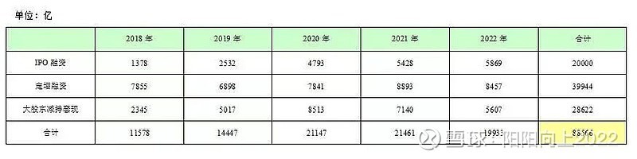
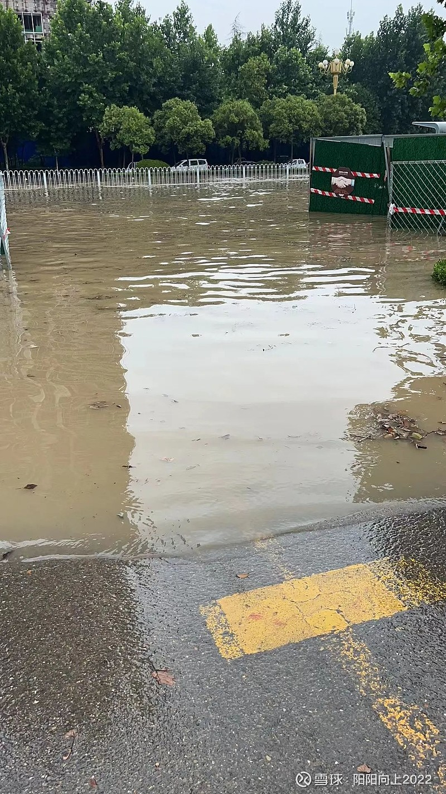

周五市场量能继续萎缩，仅有7110亿元成交额，指数弱势窄幅震荡，市场没有明显的大热点。

看着老美、日本指数节节攀升，甚至印度、越南都是不断刷新高度，A股投资者的心境一言难尽。

面对毫无生机的市场，有网友晒出来了这幅图

五年间，IPO融资2万亿，定增融资接近4万亿，大股东减持套现2.86万亿，累计抽血88566亿元。（数据都是公开的，基本准确）

市场抽血严重，触目惊心，当然也是市场这几年不涨的一大主因。

抽血可不仅仅是这些，根据公开数据，五年间还有9037亿的股票交易印花税！同时可转债还发行了大约1.12万亿的规模。

**这几项主要的抽血累计达到了10.88万亿元！**虽然说融资是市场的正常功能，但这抽血程度令人发指！

接下来，我们看看回报，2018-2022年累计现金大约分红75232亿元，场内回购累计约5656亿元，这两项合计约80888亿元。

理性地分析一下，**刨除大股东的减持和印花税因素的话，5年融资71144亿元，分红回报75232亿元，分红和融资相当**，回购一般也被认为回报股东的一种手段，加上回购5656亿元，**累计回报80888亿元，对于融资71144亿元的规模，回报虽然是正的，但差强人意！**

减持和印花税正是市场的抽血没有回报的主要力量，合计高达37659亿元！

**同时算来，5年累计抽血A股约2万亿元！**这还不含各种其他的费用例如基金的各项费用、交易的过户费等等！

加入A股是一个池子，注入的水没有抽出来的水多，怎么涨？

也难怪A股多年不涨了，市场不涨就没有赚钱效应，也就吸引不了场外资金的进入，将一直是场内资金博弈！

A股想上涨，恐怕得“下一场大暴雨”吧！

对于普通投资者该怎么做呢？回到资本逐利的本质上去，以合理或着较低的价格购买有优秀前景的股票是一种方式，有优秀前景公司的盈利攀升会不断推动股价上涨的！

远离无厘头的炒作，远离黑五类，远离价格虚高的股票。

[$贵州茅台(SH600519)$](http://xueqiu.com/S/SH600519)[$XD长江电(SH600900)$](http://xueqiu.com/S/SH600900)  

当然，短线炒家艺高人胆大，同时能够做到杀伐果断，可以从市场的波动和情绪博弈中赚钱，但是能做到杀伐果断的能有几人？[$中央商场(SH600280)$](http://xueqiu.com/S/SH600280)
