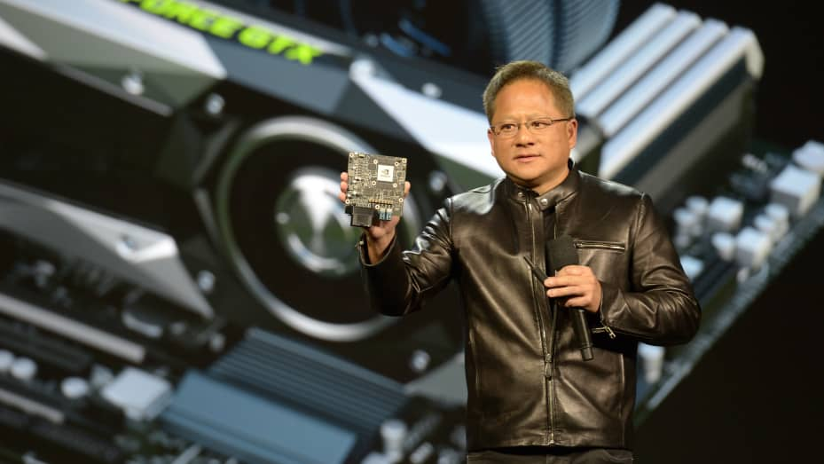

Nvidia CEO Jen-Hsun Huang at the Consumer Elctronics Show (CES) in Las Vegas, USA, 04 January 2017. Huang announced that his company would collaborate with the German car company Audi in future.  

英伟达首席执行官黄仁勋于2017年1月4日在美国拉斯维加斯举行的消费电子展（CES）上。黄磊宣布，他的公司未来将与德国汽车公司奥迪合作。

Andrej Sokolow | Picture Alliance | Getty Images  

安德烈·索科洛 |图片联盟 |盖蒂图片社

[Nvidia](https://www.cnbc.com/quotes/NVDA/) is on a tear, and it doesn’t seem to have an expiration date.  

英伟达正在撕裂，它似乎没有到期日期。

Nvidia makes the graphics processors, or GPUs, that are needed to build AI applications like ChatGPT. In particular, there’s extreme demand for its highest-end AI chip, the H100, among tech companies right now.  

英伟达制造了构建ChatGPT等AI应用程序所需的图形处理器或GPU。特别是，目前科技公司对其最高端的AI芯片H100的需求非常大。

Nvidia’s overall sales grew 101% on an annual basis to $13.51 billion in its second fiscal quarter, which ended July 30, the [company announced Wednesday](https://www.cnbc.com/2023/08/23/nvidia-nvda-earnings-report-q2-2024.html). Not only is it selling a bunch of AI chips, but they’re more profitable, too: The company’s gross margin expanded over 25 percentage points versus the same quarter last year to 71.2% — incredible for a physical product.  

英伟达周三宣布，在截至7月30日的第二财季，英伟达的整体销售额同比增长101%，达到135.1亿美元。它不仅销售了一堆人工智能芯片，而且它们的利润也更高：该公司的毛利率比去年同期增长了25个百分点以上，达到71.2%，这对于实物产品来说是不可思议的。

Plus, Nvidia said that it sees demand remaining high through next year and said it has secured increase supply, enabling it to increase the number of chips it has on hand to sell in the coming months.  

此外，英伟达表示，预计明年需求将保持高位，并表示已确保增加供应，使其能够在未来几个月内增加手头销售的芯片数量。

The company’s stock rose more than 6% after hours on the news, adding to its remarkable gain of more than 200% this year so far.  

该公司的股价在消息传出后盘后上涨了6%以上，今年迄今为止的涨幅超过200%。

It’s clear from Wednesday’s report that Nvidia is profiting more from the AI boom than any other company.  

从周三的报告中可以清楚地看出，英伟达从人工智能热潮中获利比其他任何公司都多。

Nvidia reported an incredible $6.7 billion in net income in the quarter, a 422% increase over the same time last year.  

英伟达报告本季度净收入达到令人难以置信的 67 亿美元，比去年同期增长 422%。

“I think I was high on the Street for next year coming into this report but my numbers have to go way up,” wrote Chaim Siegel, an analyst at Elazar Advisors, in a note after the report. He lifted his price target to $1,600, a “3x move from here,” and said, “I still think my numbers are too conservative.”  

“我认为明年我在这份报告中处于领先地位，但我的数字必须上升，”Elazar Advisors分析师Chaim Siegel在报告后的一份报告中写道。他将目标价上调至1，600美元，“从这里开始上涨3倍”，并表示，“我仍然认为我的数字过于保守。

He said that price suggests a multiple of 13 times 2024 earnings per share.  

他说，价格表明是2024年每股收益的13倍。

Nvidia’s prodigious cashflow contrasts with its top customers, which are spending heavily on AI hardware and building multi-million dollar AI models, but haven’t yet started to see income from the technology.  

英伟达惊人的现金流与其顶级客户形成鲜明对比，后者在人工智能硬件上投入巨资，并构建数百万美元的人工智能模型，但尚未开始看到该技术的收入。

About half of Nvidia’s data center revenue comes from cloud providers, followed by big internet companies. The growth in Nvidia’s data center business was in “compute,” or AI chips, which grew 195% during the quarter, more than the overall business’s growth of 171%.  

英伟达数据中心收入的大约一半来自云提供商，其次是大型互联网公司。英伟达数据中心业务的增长是“计算”或人工智能芯片，本季度增长了195%，超过了整体业务171%的增长。

[Microsoft](https://www.cnbc.com/quotes/MSFT/), which has been a huge customer of Nvidia’s H100 GPUs, both for its Azure cloud and its partnership with OpenAI, has been [increasing its capital expenditures](https://www.cnbc.com/2023/07/26/microsoft-stock-falls-as-analysts-digest-a-delayed-ai-ramp.html) to build out its AI servers, and doesn’t expect a positive “revenue signal” until next year.  

Microsoft一直是英伟达H100 GPU的庞大客户，无论是Azure云还是与OpenAI的合作，它一直在增加其资本支出来构建其AI服务器，并且预计直到明年才会有积极的“收入信号”。

On the consumer internet front, [Meta](https://www.cnbc.com/quotes/META/) said it [expects to spend as much as $30 billion](https://www.cnbc.com/2023/07/26/meta-to-report-second-quarter-earnings-after-the-bell.html) this year on data centers, and possibly more next year as it works on AI. Nvidia said on Wednesday that Meta was seeing returns in the form of increased engagement.  

在消费者互联网方面，Meta表示，预计今年将在数据中心上花费高达300亿美元，明年可能会在人工智能上花费更多。英伟达周三表示，Meta以增加参与度的形式看到了回报。

Some startups have even [gone into debt](https://www.cnbc.com/2023/06/01/microsoft-inks-deal-with-coreweave-to-meet-openai-cloud-demand.html) to buy Nvidia GPUs in hopes of renting them out for a profit in the coming months.  

一些初创公司甚至负债购买Nvidia GPU，希望在未来几个月内将其出租以获取利润。

On an earnings call with analysts, Nvidia officials gave some perspective about why its data center chips are so profitable.  

在与分析师的财报电话会议上，英伟达官员就其数据中心芯片为何如此有利可图给出了一些看法。

Nvidia said its software contributes to its margin and that it is selling more complicated products than mere silicon. Nvidia’s AI software, called Cuda, is cited by analysts as the primary reason why customers can’t easily switch to competitors like [AMD](https://www.cnbc.com/quotes/AMD/).  

英伟达表示，其软件有助于提高利润率，并且销售的产品不仅仅是硅。英伟达的人工智能软件Cuda被分析师认为是客户无法轻易转向AMD等竞争对手的主要原因。

“Our Data Center products include a significant amount of software and complexity which is also helping for gross margins,” Nvidia finance chief Colette Kress said on a call with analysts.  

“我们的数据中心产品包括大量的软件和复杂性，这也有助于提高毛利率，”英伟达财务主管Colette Kress在与分析师的电话会议上表示。

Nvidia is also compiling its technology into expensive and complicated systems like its HGX box, which combines eight H100 GPUs into a single computer. Nvidia boasted on Wednesday that building one of these boxes uses a supply chain of 35,000 parts. HGX boxes can cost around $299,999, [according to reports](https://www.servethehome.com/graphcore-celebrates-a-stunning-loss-at-mlperf-training-v1-0/2/), versus a volume price of between $25,000 and $30,000 for a single H100, according to a recent Raymond James estimate.  

英伟达还将其技术编译成昂贵而复杂的系统，例如其HGX盒子，它将八个H100 GPU组合到一台计算机中。英伟达周三吹嘘说，制造其中一个盒子需要35，000个零件的供应链。据报道，HGX盒子的价格约为299，999美元，而根据Raymond James最近的估计，单个H100的批量价格在25，000美元至30，000美元之间。

Nvidia said that as it ships its coveted H100 GPU out to cloud service providers, they are often opting for the more complete system.  

英伟达表示，当它将其梦寐以求的H100 GPU交付给云服务提供商时，他们通常会选择更完整的系统。

“We call it H100, as if it’s a chip that comes off of a fab, but H100s go out, really, as HGX to the world’s hyperscalers and they’re really quite large system components,” Nvidia CEO Jensen Huang said on a call with analysts.  

“我们称之为H100，就好像它是从晶圆厂出来的芯片，但H100真的是作为HGX到世界上的超大规模企业，它们真的是相当大的系统组件，”英伟达首席执行官黄仁勋在与分析师的电话会议上说。

_Correction: Nvidia’s sales grew 101% on an annual basis. An earlier version misstated the figure.  

更正：英伟达的销售额每年增长101%。早期版本错误地陈述了这个数字。_
