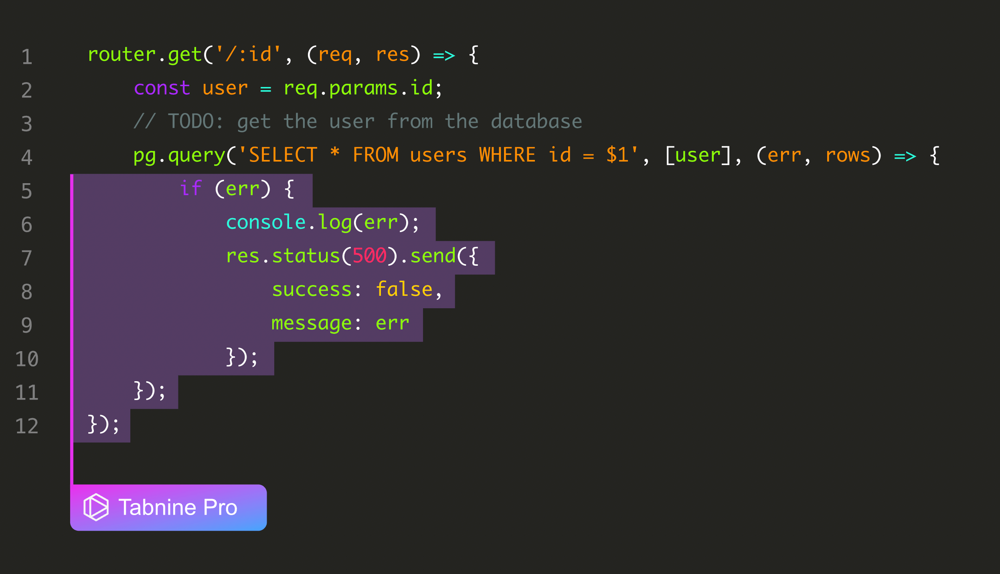
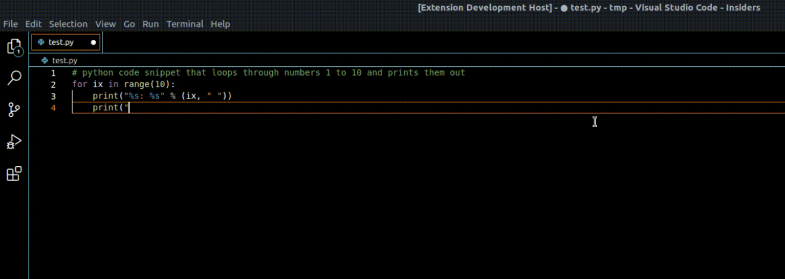
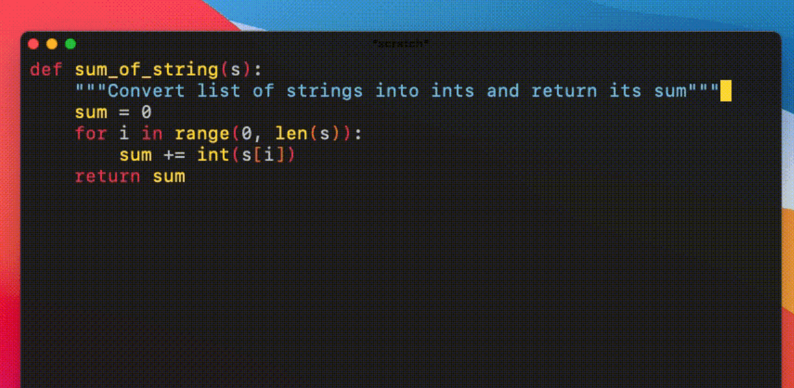
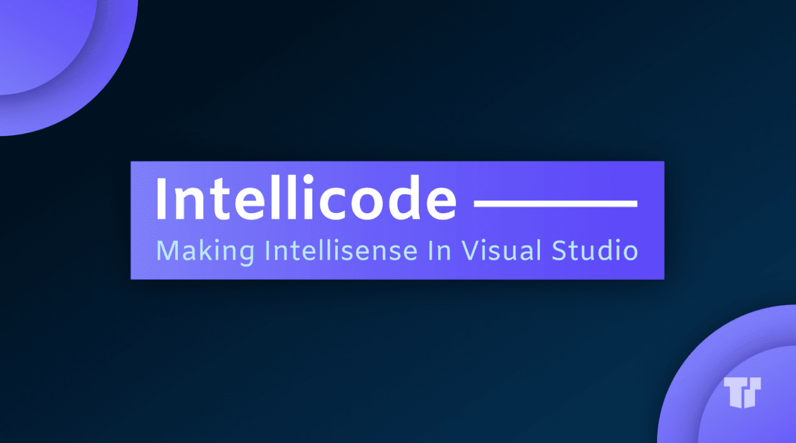
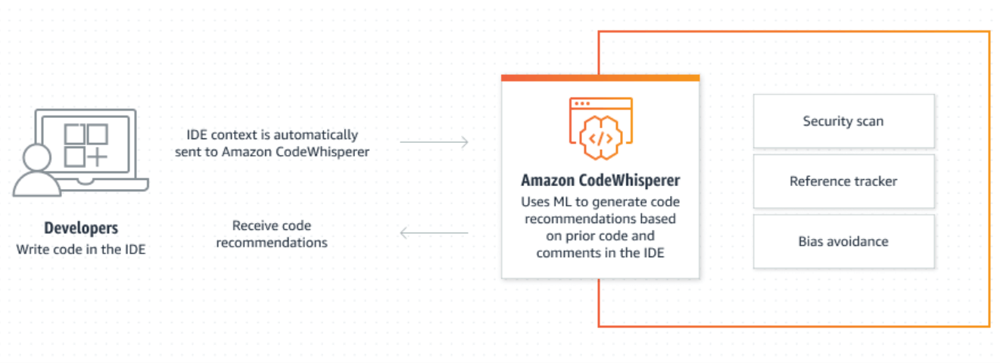
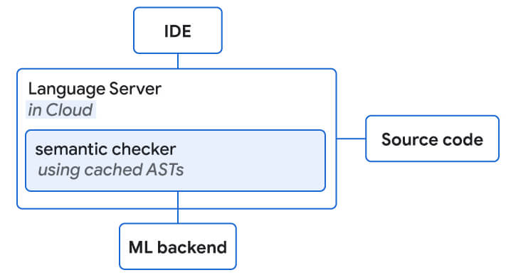
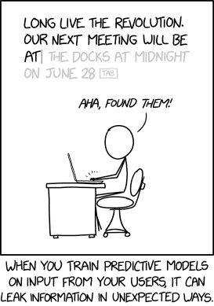

Suppose you’re a software developer that hasn’t heard of Microsoft’s GitHub Copilot. In that case, I am curious about the amenities in the distant cave you must have been vacationing in for over a year. You have probably used or at least heard of Microsoft’s GitHub Copilot as a software developer. The crowdsourced code completion plugin has made waves throughout the global dev community since its launch in July 2021.   

假设您是一名软件开发人员，没有听说过Microsoft的GitHub Copilot。在这种情况下，我很好奇远处洞穴里的设施，你一定已经度假了一年多。您可能已经使用或至少听说过Microsoft的GitHub Copilot作为软件开发人员。自 2021 年 7 月推出以来，众包代码完成插件已在全球开发社区掀起波澜。

Then, the free beta period ended, and developers had to [pay a subscription fee](https://github.blog/2022-06-21-github-copilot-is-generally-available-to-all-developers/). Unsurprisingly, many of these users turned to Copilot alternatives.   

然后，免费测试期结束，开发人员必须支付订阅费。不出所料，这些用户中的许多人转向了Copilot的替代品。

Our list of the best alternatives to GitHub Copilot includes free and language-specific tools and paid services that charge a subscription fee. Before we compare and contrast them with GitHub Copilot, it’s worth going over the main features of the product Microsoft dubs “a first-of-its-kind AI pair programmer.”  

我们的 GitHub Copilot 最佳替代品列表包括免费和特定于语言的工具以及收取订阅费的付费服务。在我们将它们与GitHub Copilot进行比较和对比之前，值得回顾一下该产品的主要功能，Microsoft被称为“首创的AI配对程序员”。

## **What is GitHub Copilot? 什么是 GitHub Copilot？**

GitHub Copilot is a code completion tool from GitHub and OpenAI. It employs OpenAI’s Codex, a transformer trained on billions of code lines on GitHub, to auto-generate code based on the current file’s contents and your cursor location. Copilot is compatible with popular code editors like Visual Studio Code, Visual Studio, Neovim, and JetBrains IDEs and offers support for languages like Python, JavaScript, TypeScript, Ruby, and Go.  

GitHub Copilot是GitHub和OpenAI的代码完成工具。它采用OpenAI的Codex，一个在GitHub上训练数十亿代码行的转换器，根据当前文件的内容和光标位置自动生成代码。Copilot与Visual Studio Code，Visual Studio，Neovim和JetBrains IDE等流行的代码编辑器兼容，并支持Python，JavaScript，TypeScript，Ruby和Go等语言。

According to GitHub and user reviews, Copilot can generate whole code lines, functions, tests, and documentation. All it needs is context and the behind-the-scenes work of developers who committed their code to GitHub, regardless of their software license.  

根据GitHub和用户评论，Copilot可以生成完整的代码行，函数，测试和文档。它所需要的只是上下文和开发人员的幕后工作，他们将代码提交到 GitHub，无论他们的软件许可证如何。

When the Copilot beta ended, GitHub released the pricing for individual users. The subscription included a 60-day free trial, which would turn to $10/month or $100/year per user.   

当Copilot测试版结束时，GitHub发布了个人用户的定价。订阅包括60天的免费试用期，每位用户每月10美元或每年100美元。

## **Why search for a GitHub Copilot alternative?  

为什么要搜索 GitHub Copilot 替代方案？**

**No free subscription 没有免费订阅**

Free licenses are still available, but these are now limited to [OSS maintainers and students](https://github.blog/2022-06-21-github-copilot-is-generally-available-to-all-developers/#free-for-verified-students-and-maintainers-of-popular-open-source-projects) only.   

免费许可证仍然可用，但现在仅限于 OSS 维护者和学生。

**No midline code completion  

没有中线代码完成**

As noted previously, Copilot requires a great deal of context to produce any code. The more context you provide, the more accurate the results will be. However, Copilot will only offer you the following line, function, or whole block of code based on context and cursor location. You still have to type entire lines and correct the code generated instead of saving the keystrokes by letting the tool autocomplete as you type.  

如前所述，Copilot需要大量的上下文来生成任何代码。您提供的上下文越多，结果就越准确。但是，Copilot 只会根据上下文和光标位置为您提供以下行、函数或整个代码块。您仍然必须键入整行并更正生成的代码，而不是通过让工具在您键入时自动完成来保存击键。

**AI models can’t run locally  

AI 模型无法在本地运行**

Do you like to code offline or need to keep your code local for compliance reasons? Then Copilot is not for you. The AI models cannot run locally.  

您喜欢离线编码还是出于合规性原因需要将代码保留在本地？那么副驾驶不适合你。AI 模型无法在本地运行。

## **Top 9 GitHub Copilot Alternatives in 2022  

9 年 2022 大 GitHub 副驾驶替代品**

### **Tabnine 塔宁**

[Get Started 开始](https://www.tabnine.com/pricing/landing)

One of the first code completion tools on the market is Tabnine (once known as Codota). Tabnine code completion plugin supports all the most popular languages, libraries, and frameworks in your favorite IDEs. Tabnine AI models are only trained on permissive open source licensed code, so your code will always remain yours.   

市场上最早的代码完成工具之一是Tabnine（曾经被称为Codota）。Tabnine 代码完成插件支持您喜欢的 IDE 中所有最流行的语言、库和框架。Tabnine AI 模型仅在宽松的开源许可代码上进行训练，因此您的代码将始终属于您。

A unique feature of the Tabnine Pro subscription is training your own private AI model based on your code and getting personalized code completions that match your style and patterns. This way, you don’t need to rely on code written by anyone else but yourself in your repositories.   

Tabnine Pro 订阅的一个独特功能是根据您的代码训练您自己的私有 AI 模型，并获得与您的风格和模式相匹配的个性化代码完成。这样，您就不需要依赖存储库中除您自己之外的其他人编写的代码。

For teams and organizations, the ability to host and train your own AI models enables collaborative autocompletion across IDEs. It also adds to code security as you get to keep the codebase and AI model on your secure corporate servers.  

对于团队和组织，托管和训练自己的 AI 模型的功能可实现跨 IDE 的协作自动完成。它还增加了代码安全性，因为您可以将代码库和 AI 模型保留在安全的公司服务器上。

In addition, it’s worth noting that Tabnine requires a lot less context than Copilot to generate code for you. In fact, with Tabnine you get midline suggestions as you type rather than suggestions for the next line of code upon completing the previous one.  

此外，值得注意的是，Tabnine需要比Copilot更少的上下文来为你生成代码。事实上，使用 Tabnine，您在键入时会获得中行建议，而不是在完成上一行代码后获得下一行代码的建议。

Pricing: Free account enabling short code completion, and [Pro](https://www.tabnine.com/pro) account starting at $12/month per user (free trial available). Enterprise account pricing is available on quote. [Tabnine Enterprise](https://www.tabnine.com/enterprise) offers a secure coding environment for your development team. You can benefit from powerful AI code assistance for more productive and bug-free coding while keeping your company’s data safe and secure.  

定价：支持短代码完成的免费帐户，以及每位用户每月 12 美元起的专业帐户（提供免费试用版）。企业帐户定价可在报价中提供。Tabnine Enterprise 为您的开发团队提供安全的编码环境。您可以从强大的 AI 代码帮助中受益，以实现更高效和无错误的编码，同时确保公司数据的安全。

### **Captain Stack 斯塔克船长**

Developers and Stackoverflow are like human resources managers and LinkedIn. We need our platforms and tools. [Captain Stack](https://github.com/hieunc229/copilot-clone) is an open-source VSCode plugin that is a bit of both. Inspired by Copilot, Captain Stack is a code suggestion tool that uses Google instead of AI. It sends your search query to Google, retrieves StackOverflow and Github Gist answers, and auto-completes them.  

开发人员和Stackoverflow就像人力资源经理和LinkedIn。我们需要我们的平台和工具。Captain Stack是一个开源的VSCode插件，两者兼而有之。受Copilot的启发，Captain Stack是一个使用Google而不是AI的代码建议工具。它会将您的搜索查询发送到Google，检索StackOverflow和Github Gist答案，并自动完成它们。

Pricing: Free 定价：免费

### **GPT-Code-Clippy (GPT-CC) GPT-Code-Clippy （GPT-CC）**

Another open source alternative to Copilot is GPT-Code-Clippy. According to the description, [GPT-Code-Clippy](https://github.com/CodedotAl/gpt-code-clippy) (GPT-CC) is an open source version of GitHub Copilot, a language model (based on GPT-3, called GPT-Codex) that is fine-tuned on publicly available code from GitHub.  

Copilot的另一个开源替代品是GPT-Code-Clippy。根据描述，GPT-Code-Clippy（GPT-CC）是GitHub Copilot的开源版本，这是一种语言模型（基于GPT-3，称为GPT-Codex），根据GitHub公开可用的代码进行微调。

Similar to Captain Stack, GPT-CC is only available as a plugin for VSCode.  

与Captain Stack类似，GPT-CC仅作为VSCode的插件提供。

Pricing: Free 定价：免费

### **Second Mate 二副**

[Second Mate](https://github.com/samrawal/emacs-secondmate) is another open-source imitation of GitHub Copilot. It uses EleutherAI GPT-Neo-2.7B (via Huggingface Model Hub) for Emacs. It is a much smaller model, so it will likely not be as effective as Copilot or other alternatives. On the other hand, you can run it on Emacs, and it’s free.  

Second Mate是GitHub Copilot的另一个开源模仿。它使用 EleutherAI GPT-Neo-2.7B（通过 Huggingface Model Hub）用于 Emacs。这是一个小得多的模型，因此它可能不会像Copilot或其他替代品那样有效。另一方面，你可以在Emacs上运行它，它是免费的。

Pricing: Free 定价：免费

### **IntelliCode 智能代码**

[IntelliCode](https://visualstudio.microsoft.com/services/intellicode/) is an experimental AI coding assistant trained on a subset of GitHub projects, a Microsoft product available for Visual Studio only. One of the more attractive features of IntelliCode is team completion. Team completion may prove beneficial for organizations with a Microsoft-based architecture and developers accustomed to Visual Studio in an age of remote working. However, if you’re looking for a cross-IDE solution that enables team autocompletion training, Tabnine supports this feature for all popular IDEs out there.  

IntelliCode是一个实验性的AI编码助手，在GitHub项目的子集上训练，这是一个仅适用于Visual Studio的Microsoft产品。IntelliCode 更具吸引力的功能之一是团队完成。团队完成可能对具有基于Microsoft的体系结构的组织以及在远程工作时代习惯于Visual Studio的开发人员有益。但是，如果您正在寻找支持团队自动完成培训的跨 IDE 解决方案，Tabnine 支持所有流行的 IDE 使用此功能。

### **Code Whisperer 代码低语者**

With Microsoft tempting developers through GitHub and Copilot, it was clear other tech giants would step in. In June 2022, Amazon launched its own AI pair programming tool named [CodeWhisperer](https://aws.amazon.com/codewhisperer/). CodeWhisperer was trained, according to Amazon, “on billions of lines of code drawn from open source repositories, internal Amazon repositories, API documentation, and forums.”  

随着Microsoft通过GitHub和Copilot吸引开发人员，很明显其他科技巨头也会介入。2022 年 6 月，亚马逊推出了自己的 AI 配对编程工具，名为 CodeWhisperer。根据亚马逊的说法，CodeWhisperer接受了“从开源存储库，内部Amazon存储库，API文档和论坛中提取的数十亿行代码”的培训。

At the time of writing, CodeWhisperer is available in its preview version only upon signup and can be installed on any IDE that supports AWS IDE tools  

在撰写本文时，CodeWhisperer 仅在注册后提供其预览版本，并且可以安装在支持 AWS IDE 工具的任何 IDE 上.

Pricing: Free (in preview)  

定价：免费（预览版）

### **Google ML-enhanced code completion  

谷歌机器学习增强的代码完成**

[Google Transformer-based](http://ai.googleblog.com/2022/07/ml-enhanced-code-completion-improves.html) hybrid semantic ML code completion – you can’t expect Google to stay silent with Amazon and Microsoft on the scene. So, as expected, [Google released](https://ai.googleblog.com/2022/07/ml-enhanced-code-completion-improves.html) its code completion engine in July 2022. However, at the time of writing, it is available only to developers working at Google itself.  

基于Google Transformer的混合语义ML代码补全 - 你不能指望谷歌对亚马逊保持沉默，并在现场Microsoft。因此，正如预期的那样，谷歌于 2022 年 7 月发布了其代码完成引擎。但是，在撰写本文时，它仅适用于在Google本身工作的开发人员。

### **YouCompleteMe 你完成我**

If you’re a Vim user, you might want to look at YCM, a free autocompletion library for your favorite code editor. [YouCompleteMe](https://github.com/ycm-core/YouCompleteMe) has several completion engines built in and supports any protocol-compliant Language Server to work with practically any language.  

如果您是 Vim 用户，您可能需要查看 YCM，这是一个免费的自动完成库，适用于您最喜欢的代码编辑器。YouCompleteMe内置了多个完成引擎，并支持任何符合协议的语言服务器，几乎可以与任何语言一起使用。

Though free and flexible, expect setup to be lengthy and complicated if you plan to code in more than one language.  

虽然自由且灵活，但如果您计划使用多种语言编写代码，则预计设置会冗长而复杂。

Pricing: Free 定价：免费

### **Kite (not maintained) 风筝（未维护）**

The last solution in our list is worthy of mention because it is one of the more flexible and user-friendly solutions offered for free. Unfortunately, at the time of writing, Kite is unavailable for download and is not maintained.  

我们列表中的最后一个解决方案值得一提，因为它是免费提供的更灵活和用户友好的解决方案之一。不幸的是，在撰写本文时，Kite无法下载，并且没有维护。

Source: [https://xkcd.com/2169/](https://xkcd.com/2169/) 

Machines aren’t coming for your job. They’re coming for the boring parts that make your wrists ache. AI code prediction and completion tools and services are here to stay. It’s only a matter of choosing the most suitable platform for your needs, that will enable you to code faster and better.   

机器不是为你的工作而来的。他们是为了无聊的部分而来的，让你的手腕疼痛。AI代码预测和完成工具和服务将继续存在。只需选择最适合您需求的平台，即可更快更好地编写代码。
