There was an extended period of time in my twenties when I didn’t have a job. For most of us, that’s not a big deal. We have our whole lives ahead of us to work, so taking a few months off to “find yourself” can be completely justifiable.  

在我二十多岁的时候，有很长一段时间我没有工作。对于我们大多数人来说，这没什么大不了的。我们有一辈子的工作，所以花几个月的假来“找到自己”是完全合理的。

Well, let’s just say that wasn’t the case for me.  

好吧，让我们说我的情况并非如此。

I spent sleepless nights scouring job postings for any company that might be interested in what little I had to offer. I smacked that “Upload Resume” button around like it was my arch nemesis, but made sure to carefully upload the proper file format before doing so.  

我花了不眠之夜寻找任何可能对我所提供的很少的东西感兴趣的公司。我打了那个“上传简历”按钮，就像它是我的宿敌一样，但请确保在这样做之前仔细上传正确的文件格式。

[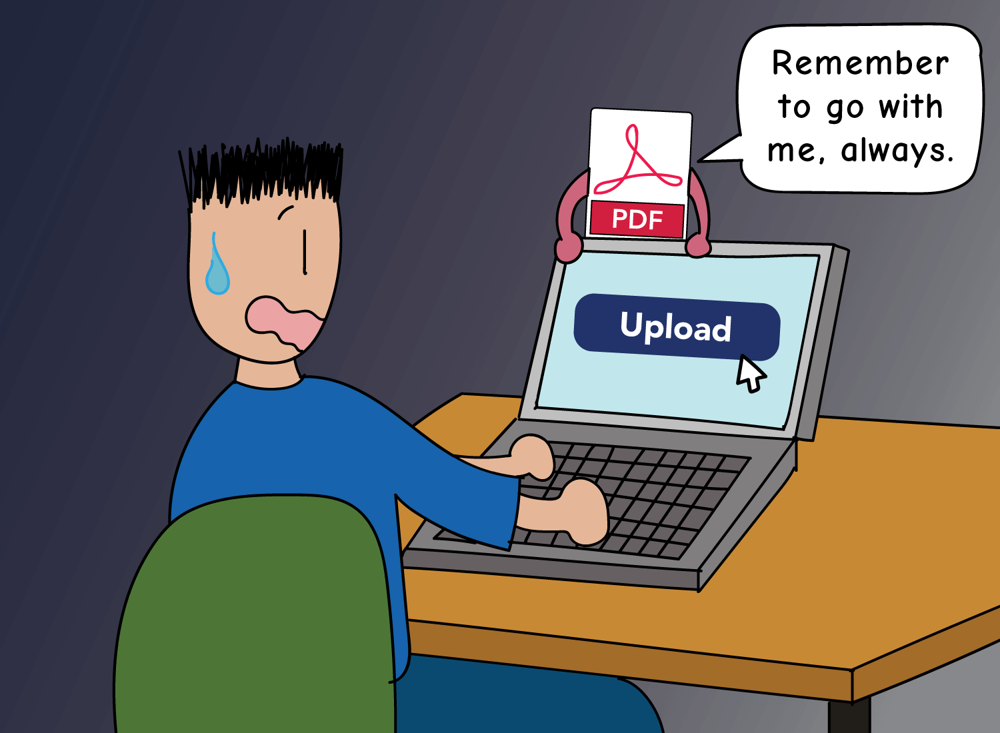](https://moretothat.com/wp-content/uploads/2020/01/A01-Uploading-Resume.png)

My days consisted of nothing but napping, eating, uploading, and submitting. To put it mildly, I was in a state of panic to find some sort of work.  

我的日子除了午睡、吃饭、上传和提交之外什么都没有。委婉地说，我处于恐慌状态，无法找到某种工作。

Some might have viewed this obsessive job search as an impressive character trait. It may have masqueraded as a signal of ambition, an indicator that I was a guy that had his priorities straight.  

有些人可能认为这种痴迷的求职是一种令人印象深刻的性格特征。它可能伪装成野心的信号，表明我是一个有重点的人。

The truth, however, was far from that. I wasn’t driven by some magnificent search for purpose, or the nagging desire to provide value to society. I was driven by something far less chivalrous:  

然而，事实远非如此。我不是被某种对目标的宏伟追求所驱使，也不是被为社会提供价值的唠叨欲望所驱使。我被一些远没有那么侠义的东西所驱使：

My intense, terrifying fear of being homeless.  

我对无家可归的强烈而可怕的恐惧。

[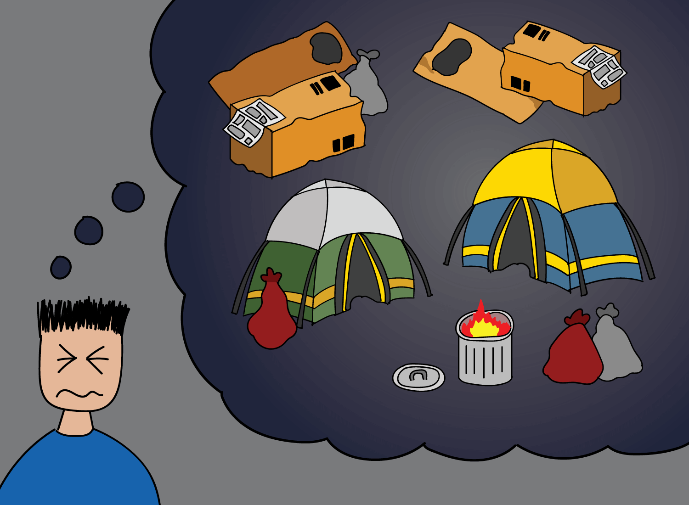](https://moretothat.com/wp-content/uploads/2020/01/A02-Thinking-of-Homelessness.png)

For the longest time, this fear is what drove my panicked desire to find stable, well-paying work (regardless of how [pointless it was](https://moretothat.com/pointless-job/)). I thought that as long as I could save some money with each paycheck, I wouldn’t have to sleep in the streets if something went awry.  

在很长一段时间里，这种恐惧驱使我恐慌地渴望找到稳定、高薪的工作（无论它多么毫无意义）。我想，只要我能用每份薪水存点钱，如果出了什么问题，我就不必睡在街上。

Some of you may understand this fear, while others may view it as deeply irrational. I know people from wealthy backgrounds who have this fear, and people raised on welfare that don’t. My family didn’t have much money growing up, but that doesn’t quite justify the existence of this strain of fright.  

你们中的一些人可能理解这种恐惧，而另一些人可能认为这是非常不合理的。我认识来自富裕背景的人有这种恐惧，而那些靠福利长大的人则没有这种恐惧。我的家庭在成长过程中没有多少钱，但这并不能完全证明这种恐惧的存在是合理的。

Regardless of its origin, this fear was very much alive in me throughout my twenties, and it framed my perspective of money. Instead of viewing money as a generator of wealth, I saw it as an immediate safety net that (barely) kept me away from living on freeway on-ramps. The more of it I had, the more relief and distance it gave me from the streets.  

不管它的起源如何，这种恐惧在我二十多岁的时候一直活跃在我心中，它构成了我对金钱的看法。我没有将金钱视为财富的产生者，而是将其视为一个直接的安全网，（勉强）使我远离高速公路匝道上的生活。我拥有的越多，它给我的解脱和远离街道就越多。

[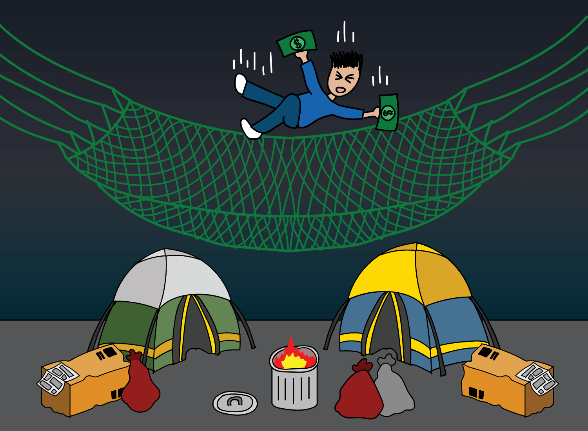](https://moretothat.com/wp-content/uploads/2020/01/A03-Safety-Net.png)

Well, many years have passed since then, and fortunately, I no longer have this fear.1 However, that doesn’t mean that I no longer think about money. It’s the [greatest story humanity has ever subscribed to](https://moretothat.com/how-money-forever-changed-us/), so it will always be a central character in the theater of everyday life. What has changed isn’t money itself, but the way in which it colors the way I view the world.  

好吧，从那以后很多年过去了，幸运的是，我不再有这种恐惧.1 然而，这并不意味着我不再考虑金钱。这是人类有史以来最伟大的故事，因此它将永远是日常生活剧场的中心人物。改变的不是金钱本身，而是它为我看待世界的方式着色。

Life is almost always a framing problem, and wealth is no exception to this. To say that money is complicated is a cliche worthy of a thousand eye rolls, but when it comes to our ongoing relationship with it, I find that it’s quite simple to explain and distill. At any given moment, our journey falls along a vertical spectrum with three main phases:  

生活几乎总是一个框架问题，财富也不例外。说金钱很复杂是值得一千个眼球的陈词滥调，但当谈到我们与它的持续关系时，我发现解释和提炼非常简单。在任何给定的时刻，我们的旅程都沿着垂直光谱下降，有三个主要阶段：

[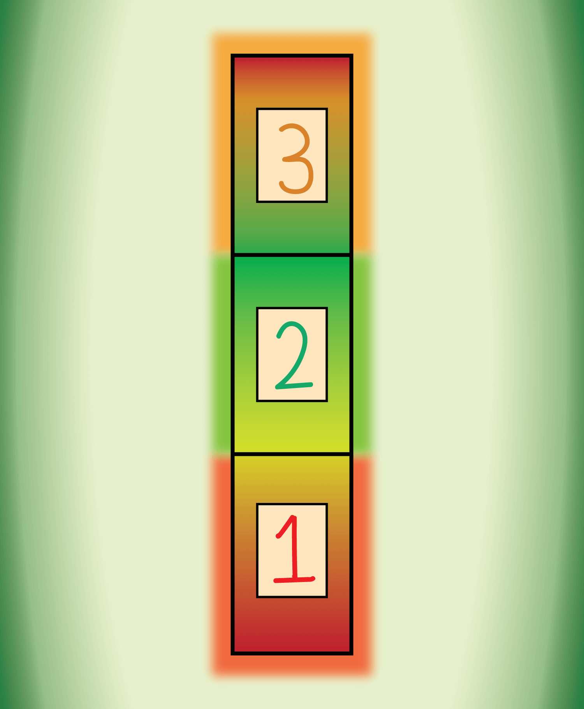](https://moretothat.com/wp-content/uploads/2020/01/B01-The-Money-Spectrum-smaller.png)

This is what I call The Money Spectrum, and it represents the wide variety of views we have about the almighty dollar/euro/whatever throughout our lives. Money can be a difficult thing to talk about because it invokes a blend of weird emotions, and this amorphous slushie of feelings can be hard to express through the crude tool of language.  

这就是我所说的金钱光谱，它代表了我们一生中对全能美元/欧元/任何东西的各种看法。金钱可能是一件很难谈论的事情，因为它唤起了奇怪的情绪的混合，而这种无定形的情感很难通过语言的粗糙工具来表达。

The purpose of the Money Spectrum is to take this formless slushie and build it into a concrete model that we can all understand. The first step to solving a problem is to articulate it clearly, and that’s what this spectrum is here to do.  

金钱光谱的目的是将这种无形的雪泥构建成我们都能理解的具体模型。解决问题的第一步是清楚地表达它，这就是这个频谱要做的事情。

Each of the three phases represent a specific purpose money has for us, with Phase 1 being the ground level of this journey up the tower. We will go into what each of these three phases are soon, but before we do, keep in mind that this is a spectrum, meaning that we will find ourselves sliding along the scale at any time.  

这三个阶段中的每一个都代表了金钱对我们的特定目的，第一阶段是这个塔楼之旅的底层。我们很快就会进入这三个阶段中的每一个，但在我们这样做之前，请记住这是一个频谱，这意味着我们随时都会发现自己沿着规模滑动。

It’s entirely possible that someone will be 100% immersed in Phase 1, but it’s more likely that they will be closer to Phase 1 than Phase 2, and will share characteristics of both areas. This is an important distinction that we will make later on in this post, but for now, remember that our relationship with things are rarely absolutes, and money is no exception to this rule.  

完全有可能有人 100% 沉浸在第 1 阶段，但他们更有可能更接近第 1 阶段而不是第 2 阶段，并且会分享这两个领域的特征。这是我们稍后将在这篇文章中做出的重要区别，但现在，请记住，我们与事物的关系很少是绝对的，金钱也不例外。

[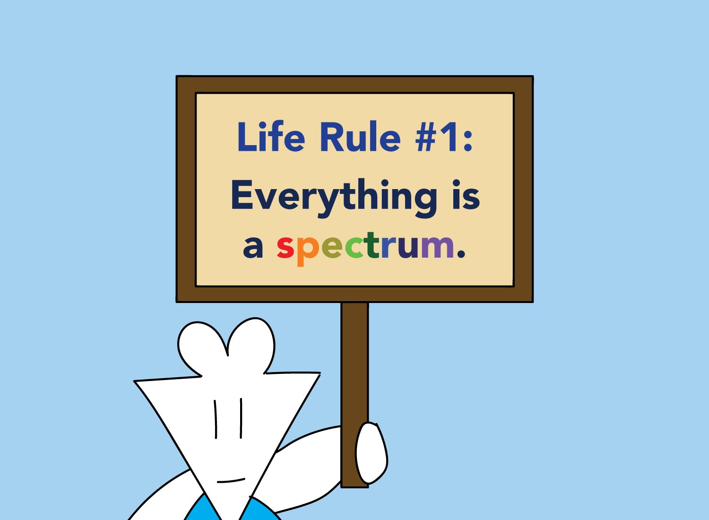](https://moretothat.com/wp-content/uploads/2020/01/A04-Everything-is-a-spectrum.png)

Let’s begin our journey up the Money Spectrum with this question: when you take a look at your bank account balance, what do you feel?  

让我们从这个问题开始我们的金钱之旅：当你看看你的银行账户余额时，你有什么感觉？

Well, if you’re a part of the 28% of Americans that have [no emergency savings whatsoever](https://www.bankrate.com/banking/savings/financial-security-june-2019/), the answer to that question will likely be a combination of fear and anxiety. When the sole purpose of money is to provide for the basic necessities of life, then your relationship with it will be a shaky one. Scarcity creates fragility, and it is this situation that opens the doors to Phase #1.  

好吧，如果你是28%没有任何紧急储蓄的美国人中的一员，那么这个问题的答案可能是恐惧和焦虑的结合。當金錢的唯一目的是提供基本的生活必需品時，那麼你與它之間的關係將是不穩定的。稀缺性造成了脆弱性，正是这种情况打开了#1阶段的大门。

### Phase #1: Survival 阶段#1：生存

[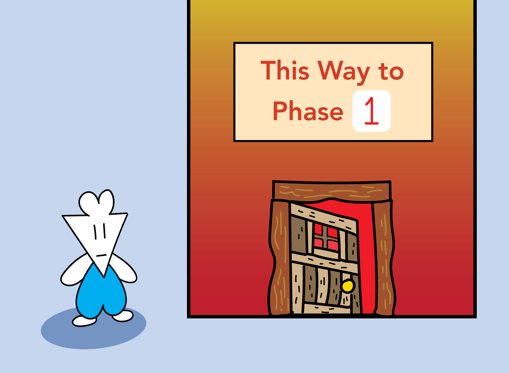](https://moretothat.com/wp-content/uploads/2020/01/B02-Entrance-to-Phase-1.png)

One might say that we all share some space in this part of the spectrum. Ultimately, all the necessities of life require payment of some kind: the food we put in our mouths, the clothes we walk around in, the roof over our heads, etc. Without money we wouldn’t have any of these things, so it’s fair to say that it is a requisite of survival for all of us, right?  

有人可能会说，我们都在频谱的这一部分共享一些空间。归根结底，所有的生活必需品都需要某种报酬：我们放进嘴里的食物，我们走动的衣服，我们头顶的屋顶等等。没有钱，我们就不会有这些东西，所以公平地说，这是我们所有人生存的必要条件，对吧？

Well, not quite. 嗯，不完全是。

While it’s true that money is required to have these basic necessities, that doesn’t mean that we all fear the loss of these necessities equally. A low-income household and an upper middle-class family may both rent property, but the former may worry incessantly about next month’s payment, while the latter may not. Both understand the importance of money, but have different ideas of how their survival could be impacted by the lack of it.  

虽然拥有这些基本必需品确实需要钱，但这并不意味着我们都同样担心失去这些必需品。低收入家庭和中上阶层家庭都可以租房，但前者可能会不停地担心下个月的付款，而后者可能不会。两人都了解金钱的重要性，但对缺乏金钱如何影响他们的生存有不同的想法。

The difficult thing about the word “survival” is how subjective it tends to be, as humans are [more reactive to loss than to gain](https://en.wikipedia.org/wiki/Loss_aversion). If a billionaire experienced a sudden reversal in fortune and couldn’t afford his ten-bedroom house anymore, it’s quite possible that he’d say his very survival was being threatened.  

“生存”这个词的困难之处在于它往往是主观的，因为人类对失去的反应比对获得的反应更大。如果一个亿万富翁经历了命运的突然逆转，再也买不起他的十居室房子了，他很可能会说他的生存受到了威胁。

To remove this fog of subjectivity, let’s zoom in on the Survival part of the spectrum and break it down. When I use the word “survival” in this post, I’m simply referring to one’s ability to exist and to have one’s health. In the illustration below, I’ve separated the section out into its smaller constituents, with the level of poverty increasing the lower you go.  

为了消除这种主观性的迷雾，让我们放大光谱的生存部分并将其分解。当我在这篇文章中使用“生存”这个词时，我只是指一个人生存和拥有健康的能力。在下图中，我将该部分划分为较小的组成部分，贫困程度越低，贫困程度就越高。

[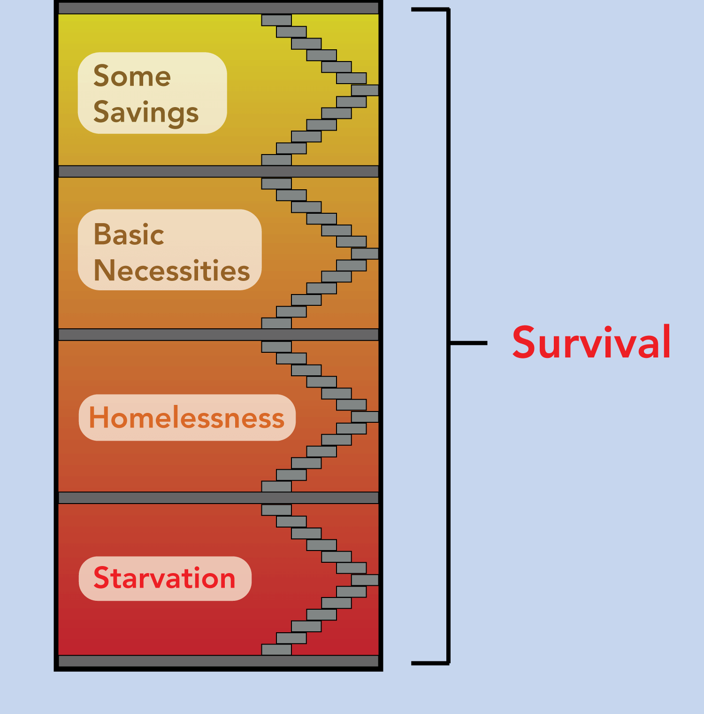](https://moretothat.com/wp-content/uploads/2020/01/B03-Subsections-of-Phase-1.png)

At the lowest level, you have no money or access to food, and you are literally starving to death. This is more likely a function of national/civic infrastructure than an individual’s lack of money, as this is quite rare in any first-world country. However, it is still largely a function of having no fiscal resources, and this is the worst place one can find themselves in as a result of that.  

在最低的层次上，你没有钱或食物，你真的饿死了。这更有可能是国家/公民基础设施的功能，而不是个人缺乏资金，因为这在任何第一世界国家都非常罕见。然而，这在很大程度上仍然是没有财政资源的功能，因此，这是人们可能发现自己的最糟糕的地方。

A step up would be the lack of shelter, or homelessness. This is where one’s fears regarding survival can start feeling real, despite the fact that they are probably nowhere near it (my own fear was a good example of this). This likely happens because most of us are vividly familiar with the problem of homelessness, and have grown up seeing real-life evidence of it everywhere.  

一个步骤将是缺乏住所或无家可归。这就是一个人对生存的恐惧可以开始感到真实的地方，尽管事实上它们可能远不及它（我自己的恐惧就是一个很好的例子）。这可能是因为我们大多数人都非常熟悉无家可归的问题，并且从小就到处都能看到现实生活中的证据。

I have clear childhood memories of my parents interacting with the homeless, and you probably do as well. Homelessness is an ever-present window into the difficulties of the human condition, and it reminds you of what can be possible when things go wrong. When we think about our survival being threatened, this familiar sight is where the mind can point to, regardless of how distant that place actually is.  

我有清晰的童年记忆，我的父母与无家可归者互动，你可能也是如此。无家可归是了解人类状况困难的永远存在的窗口，它提醒您当出现问题时可能发生的事情。当我们想到我们的生存受到威胁时，这种熟悉的景象是心灵可以指向的地方，无论那个地方实际上有多远。

The next few steps up the spectrum have to do with one’s idea of survival once they have their basic necessities (food/water, shelter, and clothing). Survival is no longer a relentless exercise in acquiring these necessities, but more so a strong commitment in maintaining them. And of course, the fuel that keeps the resource engine running is money.  

接下来的几个步骤与一个人一旦拥有基本必需品（食物/水、住所和衣服）后的生存想法有关。生存不再是获取这些必需品的无情活动，而是维护这些必需品的坚定承诺。当然，保持资源引擎运行的燃料是金钱。

[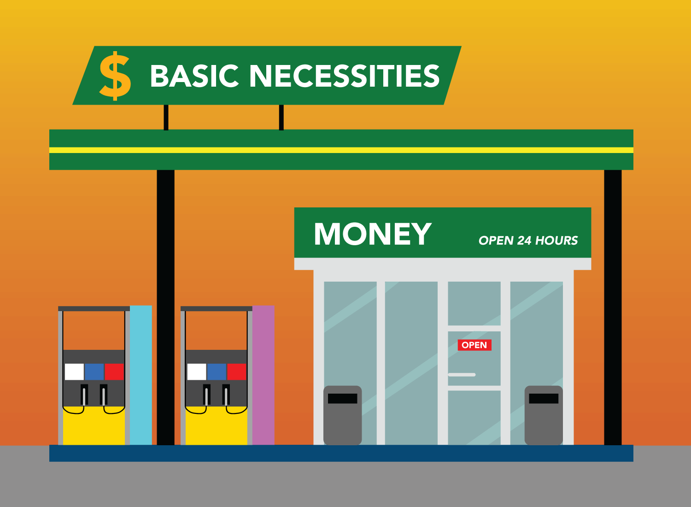](https://moretothat.com/wp-content/uploads/2020/01/B04-Money-as-fuel-for-basic-necessities.png)

In order to sustain the health of oneself and one’s family, a consistent stream of income is needed, and this generally comes in the form of paid employment. Keep in mind that toward the upper-end of the Survival phase, you are no longer fighting for existence; you are fighting for preservation. You want the flow of money to be predictable, something you can count on every few weeks to sustain the level of basic resources you need.  

为了维持自己和家人的健康，需要稳定的收入来源，这通常以有偿就业的形式出现。请记住，在生存阶段的上端，您不再为生存而战;你在为保护而战。你希望资金流动是可预测的，你可以每隔几周依靠它来维持你需要的基本资源水平。

A job provides this sense of security, and when you view money as a means for survival, holding this job is all that matters. It doesn’t matter how much you hate your job or how terrible the working conditions may be; as long as the number of hours you work result in a predictable deposit amount, you’ll succumb to it.  

一份工作提供了这种安全感，当你把金钱视为生存的手段时，保住这份工作才是最重要的。不管你有多讨厌你的工作，或者工作条件有多糟糕;只要您工作的小时数导致可预测的存款金额，您就会屈服于它。

But if this pattern continues and time runs in your favor, there’s a point in which the lines between the Survival phase and Phase #2 (which I’ll reveal shortly) start getting blurry.  

但是，如果这种模式继续下去并且时间对你有利，那么生存阶段和阶段#2（我将很快揭示）之间的界限就会开始变得模糊。

At what point does your job provide you with enough money to feel a sense of security? Is it when you’re no longer living paycheck-to-paycheck and you’re able to save some money each month? If that’s the case, what do your savings have to look like for you to feel a sense of relief? $2,000? $10,000? $30,000?  

在什么时候，你的工作为你提供了足够的钱来感到安全感？是当你不再靠薪水生活并且每个月都能存一些钱时？如果是这样的话，你的积蓄必须是什么样子才能让你感到如释重负？2，000 美元？10，000美元？30，000 美元？

[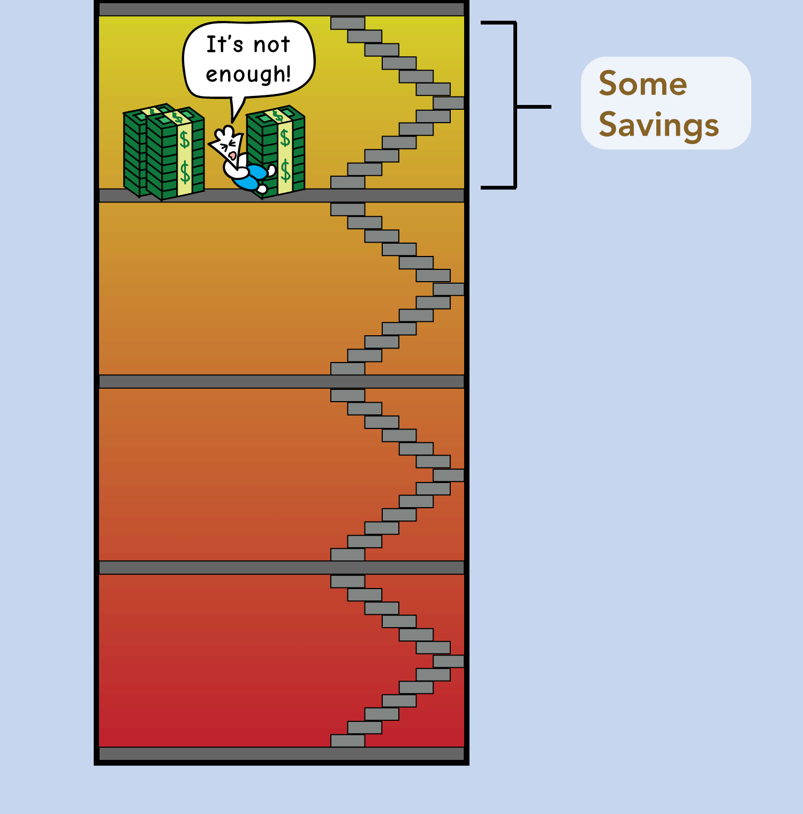](https://moretothat.com/wp-content/uploads/2020/01/B05-Savings-in-Phase-1.png)

Toward the upper end of this phase, survival becomes more about your mindset and less about your reality. You are well past the place where you risk sleeping in the streets, but you may continue to operate under the belief that it could happen at any time. This traps you into a limited way of thinking, and paralyzes your potential for growth.  

在这个阶段的上端，生存更多地取决于你的心态，而不是你的现实。你已经过了有可能睡在街上的地方，但你可以继续经营，相信它随时可能发生。这会让你陷入有限的思维方式，并瘫痪你的成长潜力。

When you’re in a survival mindset, you will always feel like you’re barely holding onto what you have. Whether that’s $1,000 or $100,000, nothing you have can adequately push away the fears you have about sliding down the spectrum. This may be the result of parental conditioning, personal experience, or any number of reasons, but the longer you view money as a means for survival, the less willing you will be to take the risks required to lead a fulfilling life.  

当你处于生存心态时，你总会觉得你几乎没有坚持你所拥有的。无论是1000美元还是10万美元，你所拥有的任何东西都不能充分消除你对滑落的恐惧。这可能是父母条件反射、个人经历或任何原因的结果，但你把金钱视为生存手段的时间越长，你就越不愿意承担过上充实生活所需的风险。

Risk is usually accompanied with the emotion of fear, and if you’re operating on survival mode, you will be scared to do anything uncertain, no matter how small that risk actually is:  

风险通常伴随着恐惧的情绪，如果你在生存模式下运作，你会害怕做任何不确定的事情，无论风险实际上有多小：

[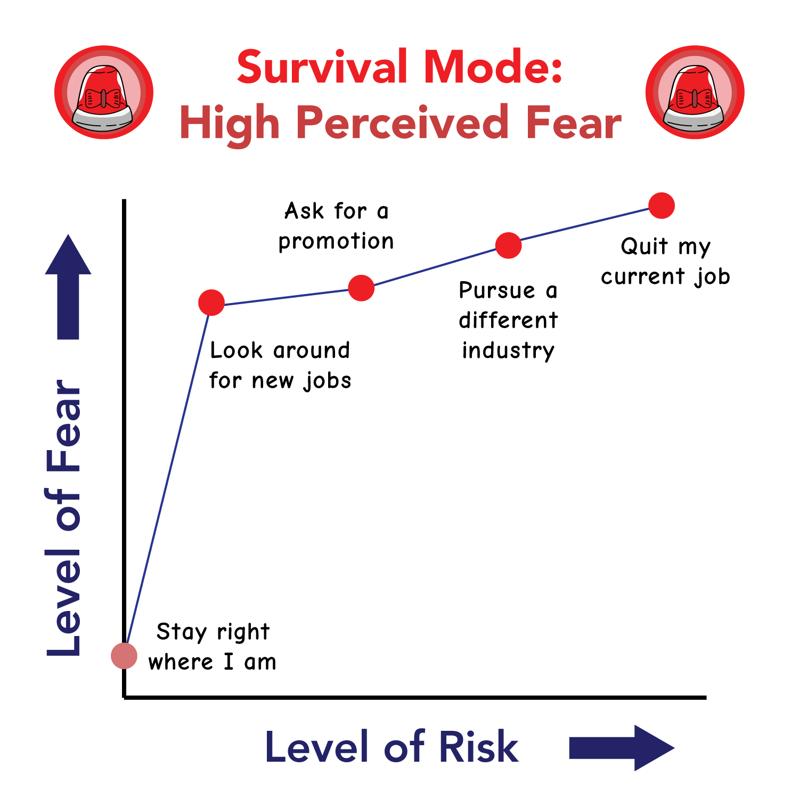](https://moretothat.com/wp-content/uploads/2020/01/E01-Fear-vs-Risk-in-Survival-Mode.png)

With this level of consistent fear, you won’t do anything outside of your comfort zone. You’ll never ask for that promotion in fear of getting fired, you’ll never invest money in the stock market in fear of losing it, and you’ll never pursue something purposeful in fear of being penniless.  

有了这种程度的持续恐惧，你就不会在舒适区之外做任何事情。你永远不会因为害怕被解雇而要求升职，你永远不会因为害怕失去它而在股市上投资，你永远不会因为害怕身无分文而追求有目的的事情。

The most meaningful things in life come with some level of risk, and if you’re in survival mode, you won’t take them. The stakes will always seem too high, even if the downside to that risk is capped.  

生活中最有意义的事情伴随着一定程度的风险，如果你处于生存模式，你就不会接受它们。风险似乎总是太高，即使这种风险的负面影响是有上限的。

The key to shifting out of survival mode is to realize that you have enough. The word “enough” may evoke different feelings from different people, but I’m simply referring to the amount you require to have your basic necessities covered.  

摆脱生存模式的关键是意识到你有足够的。“足够”这个词可能会唤起不同人的不同感受，但我只是指你支付基本必需品所需的数量。

Do you have enough money to have a roof over your head? If you quit your job, will you really end up homeless, or will you be fine? Is your anxiety about money largely unfounded, considering you have your basic needs covered?  

你有足够的钱在你的头上有一个屋顶吗？如果你辞职了，你真的会无家可归，还是会没事？考虑到你的基本需求得到了满足，你对金钱的焦虑在很大程度上是没有根据的吗？

Survival mode is turned on when reality is clouded by the fog of fear. It turns a completely manageable situation into one that is overblown, and every small decision regarding money causes immense anxiety.  

当现实被恐惧的迷雾笼罩时，生存模式就会打开。它把一个完全可控的情况变成了一个被夸大的情况，每一个关于金钱的小决定都会引起巨大的焦虑。

[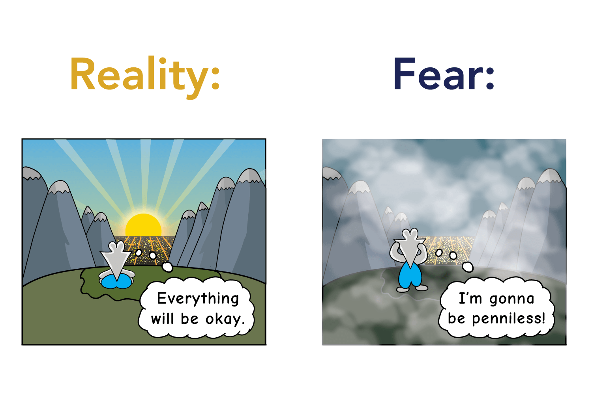](https://moretothat.com/wp-content/uploads/2020/01/C01-Reality-vs-Fear.png)

Removing this fog requires rationality, along with the understanding that everything will be okay. As long as you remain committed to your financial well-being, things have a funny way of working themselves out. If you lost your job, you will find another one. If you didn’t hit your savings goal, you’ll eventually get there. If you overspent your budget this month, you’ll make up for it in the next one.  

消除这种迷雾需要理性，以及一切都会好起来的理解。只要你仍然致力于你的财务状况，事情就会以一种有趣的方式自行解决。如果你失去了工作，你会找到另一份工作。如果您没有达到储蓄目标，您最终会到达那里。如果你本月超支了预算，你将在下个月弥补。

Once you realize that money is a resource you own – and not the other way around – you will see money for what it really is: a tool that amplifies the values you already espouse.  

一旦你意识到金钱是你拥有的资源——而不是相反——你就会看到金钱的真正面目：一种放大你已经信奉的价值观的工具。

In the next phase of the spectrum, money becomes a mechanism, rather than the end result. It is here where its value truly shines, as it enables you to live a life that coincides with purpose.  

在光谱的下一阶段，金钱成为一种机制，而不是最终结果。正是在这里，它的价值真正闪耀着光芒，因为它使您能够过上与目标相吻合的生活。

### Phase #2: Freedom 阶段#2：自由

I recall a conversation where a friend was telling me how much she hated her job. When I asked her why she was still working there, she begrudgingly replied, “Well, it provides a lifestyle that my family and I can enjoy. We can go on cool vacations together, see interesting places, and eat amazing meals. I guess that’s what makes it worth it.”  

我记得有一次谈话，一个朋友告诉我她有多讨厌她的工作。当我问她为什么还在那里工作时，她不情愿地回答说：“嗯，它提供了一种我和我的家人可以享受的生活方式。我们可以一起去凉爽的假期，看看有趣的地方，吃美味的饭菜。我想这就是它值得的原因。

This is the first taste of money as a tool for freedom. When money is used to sustain a lifestyle rather than life itself, you have moved out of Survival and into this new territory.  

这是金钱作为自由工具的第一次尝试。當金錢用於維持一種生活方式而不是生命本身時，你已經走出了生存，進入了這個新的領域。

[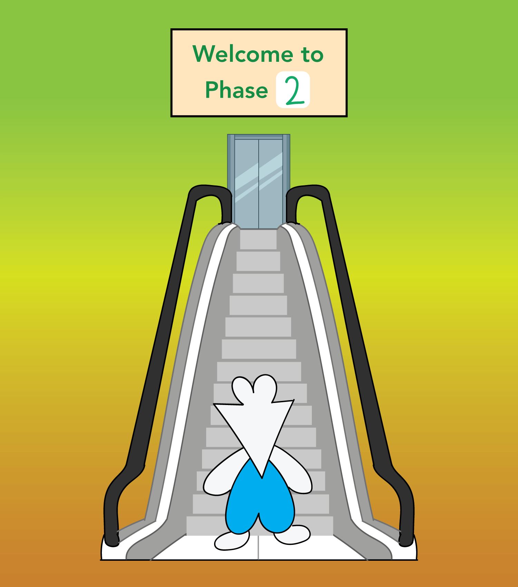](https://moretothat.com/wp-content/uploads/2020/01/D01-Moving-Up-Spectrum.png)

One of the most common forms of freedom is leisure. Once you have your basic needs covered, leisure becomes the manner in which you express your tastes and preferences to yourself and others. Purchasing memorable experiences and delicious meals is not only pleasant, it also signals the things that are important to who you are.2  

最常见的自由形式之一是休闲。一旦您的基本需求得到满足，休闲就成为您向自己和他人表达您的品味和偏好的方式。购买难忘的体验和美味的饭菜不仅令人愉快，而且还表明了对您是谁很重要的事情2。

When you and your family are sitting on beach chairs in a faraway country, overlooking the oscillating waves of the sea, it can evoke feelings of the good life. It can make you feel like you’ve reached the pinnacle of freedom, and that everything you had to do in life was worth it for this moment.  

当你和家人坐在遥远国度的沙滩椅上，俯瞰大海的波涛汹涌，可以唤起美好生活的感受。它可以让你觉得你已经达到了自由的顶峰，你一生中所做的一切都值得这一刻。

[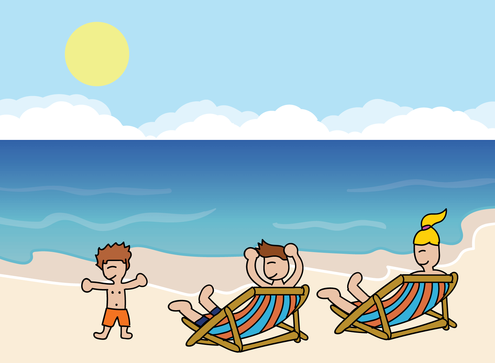](https://moretothat.com/wp-content/uploads/2020/01/D02-Along-the-Beach.png)

But this is also where the problem lies.  

但这也是问题所在。

The price of leisure can be high, and since [life familiarizes us with its contents](https://moretothat.com/what-makes-death-bad/), we tend to want more of what we already have. If leisure is the way we express our freedom, we would be willing to do all kinds of tedious work to fund that form of expression.  

休闲的代价可能很高，而且由于生活使我们熟悉其内容，我们倾向于想要更多我们已经拥有的东西。如果闲暇是我们表达自由的方式，我们愿意做各种繁琐的工作来资助这种表达形式。

This is the situation that my friend found herself in. She was putting up with mind-numbing, pointless work so it would give her the resources to fund the lifestyle choices that made life a little more pleasant.  

这就是我朋友发现自己所处的情况。她正在忍受麻木、毫无意义的工作，这样她就有资源来资助生活方式的选择，让生活更加愉快。

The problem with freedom-as-leisure is that it is fundamentally asymmetrical. You have to work significantly more hours for each hour of leisure you may gain, which means that if you hate your job, you have to accumulate a lot of misery before you can cash it in for freedom.  

自由作为休闲的问题在于它从根本上是不对称的。你必须为每一个小时的闲暇时间工作更多的时间，这意味着如果你讨厌你的工作，你必须积累很多痛苦，然后才能把它换成自由。

The sad reality is that many people don’t enjoy their jobs, nor do they learn much from them. If you combine this with the fact that we spend over a third of our lives working, you have a situation where money is the only reason you’re waking up each morning for a long, long time.  

可悲的现实是，许多人不喜欢他们的工作，也没有从中学到很多东西。如果你把这一点与我们一生中超过三分之一的时间都在工作的事实结合起来，你就会发现，金钱是你每天早上醒来的唯一原因。

This is why these are the top results when you search “retirement” in Google Images:  

这就是为什么当您在Google图片中搜索“退休”时，这些是最重要的结果：

For most people, retirement means they are finally free to do whatever they want without worrying about money. They could finally leave their jobs, [travel around the world](https://moretothat.com/travel-is-no-cure-for-the-mind/), and set their schedules so it fits their rhythm of life.  

对于大多数人来说，退休意味着他们终于可以自由地做任何他们想做的事情，而不必担心钱。他们终于可以离开工作，环游世界，并设定自己的时间表，使其符合他们的生活节奏。

However, this is a low bar for freedom. Giving away thirty-plus years of your life to an indifferent career is like spending all your youth with a partner that you’d rather not be around. When you finally break free of that job or relationship, you’ll be left wondering what else you could have done with all that misspent energy.  

然而，这是自由的低门槛。把你三十多年的生命交给一个冷漠的职业，就像你和一个你宁愿不在身边的伴侣一起度过你所有的青春。当你最终挣脱那份工作或关系时，你会想知道你还能用那些浪费的精力做些什么。

As long as money is the top priority for why you work, you will be trapped in the lowest part of the Freedom phase. To escape this trap, the way you view money needs a perspective shift:  

只要金钱是你工作的首要任务，你就会被困在自由阶段的最低部分。为了摆脱这个陷阱，你看待金钱的方式需要转变视角：

Rather than using money as the ticket out of an unfulfilling career, use it as the ticket in to a fulfilling one.  

与其用金钱作为摆脱不成就感的职业生涯的门票，不如将其用作通往充实职业生涯的门票。

The next point up the spectrum is the freedom money can buy as it relates to your work.  

接下来的一点是金钱可以买到的自由，因为它与你的工作有关。

[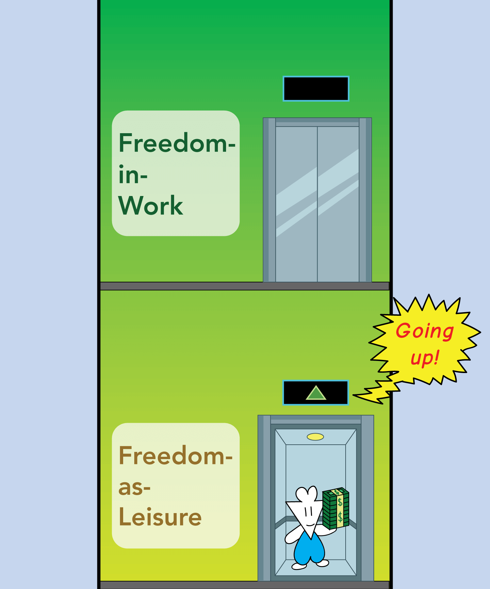](https://moretothat.com/wp-content/uploads/2020/01/D03-Going-to-Freedom-in-Work.png)

In the freedom-as-leisure (or traditional retirement) model, the rank-order of the reasons for work was this:  

在自由休闲（或传统退休）模型中，工作原因的排名顺序如下：

[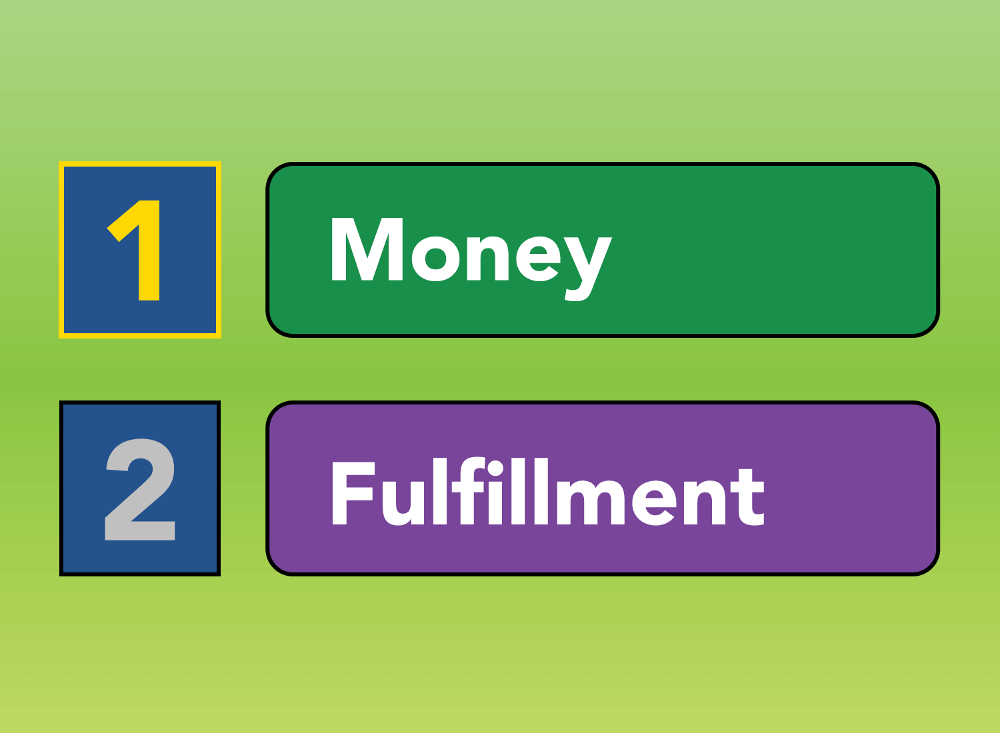](https://moretothat.com/wp-content/uploads/2020/01/D04-Money-over-fulfillment.png)

But in the freedom-in-work model, the order of priorities switches:  

但在工作自由模型中，优先级的顺序发生了变化：

[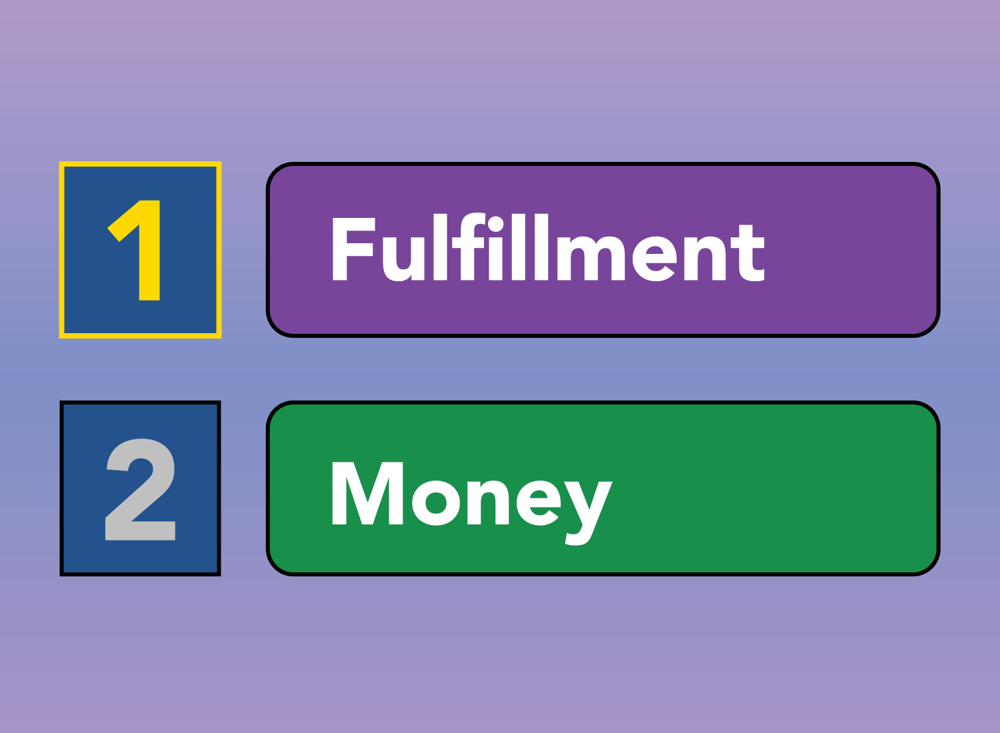](https://moretothat.com/wp-content/uploads/2020/01/D05-Fulfillment-over-money.png)

It’s still important to make money, but its purpose extends beyond its mere accumulation. Its primary purpose is to give you the freedom to work on the things you want to build.  

赚钱仍然很重要，但它的目的不仅仅是积累。它的主要目的是让你自由地处理你想要构建的东西。

This is where you realize that work isn’t about retirement; it’s about working on the things you’d do if money wasn’t even a factor. Whether you made $1,000 a month or $10,000, you’d continue working on the same projects, day in and day out. Not because they’re profitable, but because you enjoy the hard work it takes in building them.  

在这里，您意识到工作与退休无关;这是关于在金钱甚至不是一个因素的情况下你会做的事情。无论你每月赚 1，000 美元还是 10，000 美元，你都会日复一日地继续从事相同的项目。不是因为它们有利可图，而是因为你喜欢建造它们所需的辛勤工作。

Of course, the question here then becomes, “How much money do I need to buy this type of freedom?”  

当然，这里的问题就变成了，“我需要多少钱才能买到这种自由？

The answer will vary based on your circumstances (the biggest ones being where you live and if you have a family of your own), but it’s probably not as high as you would expect.  

答案会根据您的情况而有所不同（最大的情况是您居住的地方以及您是否有自己的家庭），但可能没有您预期的那么高。

The first thing that the freedom-in-work model does is that it lowers the threshold of money you need to continue your work. When work in itself is fulfilling and worthwhile, you become more content with a minimal lifestyle.  

工作自由模式做的第一件事是它降低了你继续工作所需的资金门槛。当工作本身是充实和有价值的时，你会对最小的生活方式变得更加满足。

This is because money no longer serves as a reliable signal of your worth and priorities. In the freedom-as-leisure model, the amount of money you made from your job was of utmost importance. If money was the only justification for your continued employment, that salary better be high enough to make your time worth it.  

这是因为金钱不再是你价值和优先事项的可靠信号。在自由即休闲模式中，你从工作中赚到的钱是最重要的。如果金钱是你继续工作的唯一理由，那么薪水最好足够高，让你的时间值得。

[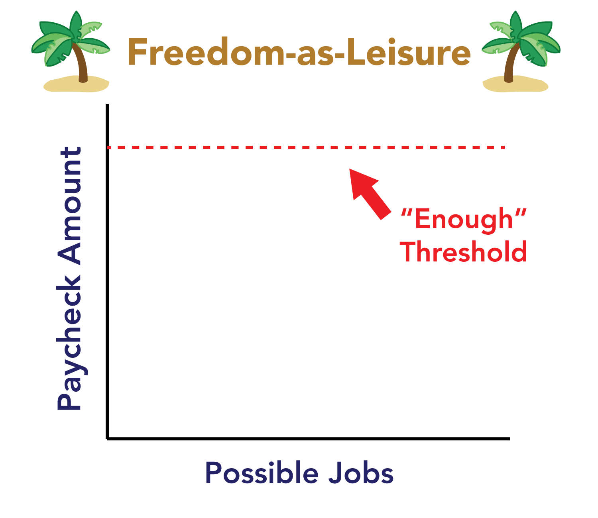](https://moretothat.com/wp-content/uploads/2020/01/E02-Freedom-as-leisure-graph.png)

But in the freedom-in-work model, money is simply the fuel you need to keep you and your endeavor running. If you combine this with the zero marginal cost nature of the internet ([especially for content creators](https://moretothat.com/economics-of-writing/)), you don’t need much to live your day-to-day life. As long as your basic necessities are covered, you can continue working on the things you care about for a surprisingly long time.3  

但在工作自由模式中，金钱只是你保持你和你的努力运转所需的燃料。如果你把这一点与互联网的零边际成本性质结合起来（特别是对于内容创作者），你不需要太多的日常生活。只要您的基本必需品得到保障，您就可以在很长一段时间内继续处理您关心的事情3。

[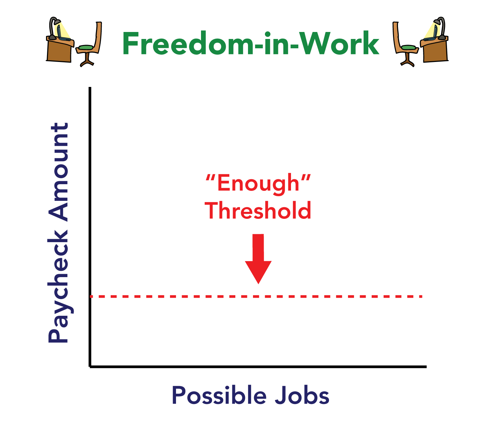](https://moretothat.com/wp-content/uploads/2020/01/E03-Freedom-in-work-graph.png)

While this sounds liberating, I get that it can seem far-fetched. Untying money from your self-worth is a rather difficult thing to do. We’ve been conditioned to view money as an indicator of success, and it is a status signal that is recognized anywhere in the world. Wealth drives perceptions, both of ourselves and others.  

虽然这听起来很自由，但我明白这似乎很牵强。将金钱从自我价值中解脱出来是一件相当困难的事情。我们已经习惯于将金钱视为成功的指标，而金钱是世界任何地方公认的地位信号。财富驱动着人们对自己和他人的看法。

But ask yourself: how long will these societal norms control the way you live your life? What’s so great about having money if you’re using it to live a life you’re expected to live, instead of one that makes sense for your unique abilities and perspectives?  

但问问自己：这些社会规范将控制你的生活方式多久？如果你用钱来过一种你期望过的生活，而不是一种对你独特的能力和观点有意义的生活，那么拥有金钱有什么好处呢？

Money is easily replicable, humans are not. There is no one out there that shares your same genetic makeup, let alone your life experiences. While a dollar is innumerable, you are – quite literally – one of one.  

金钱很容易复制，人类不是。没有人拥有相同的基因构成，更不用说你的生活经历了。虽然一美元数不胜数，但你 - 毫不夸张地说 - 是其中之一。

So don’t let something plentiful like money be the [building blocks of your identity](https://moretothat.com/small-things/). Instead, allow it to amplify the authentic voice only you can have.  

因此，不要让像金钱这样丰富的东西成为你身份的基石。相反，让它放大只有你能拥有的真实声音。

[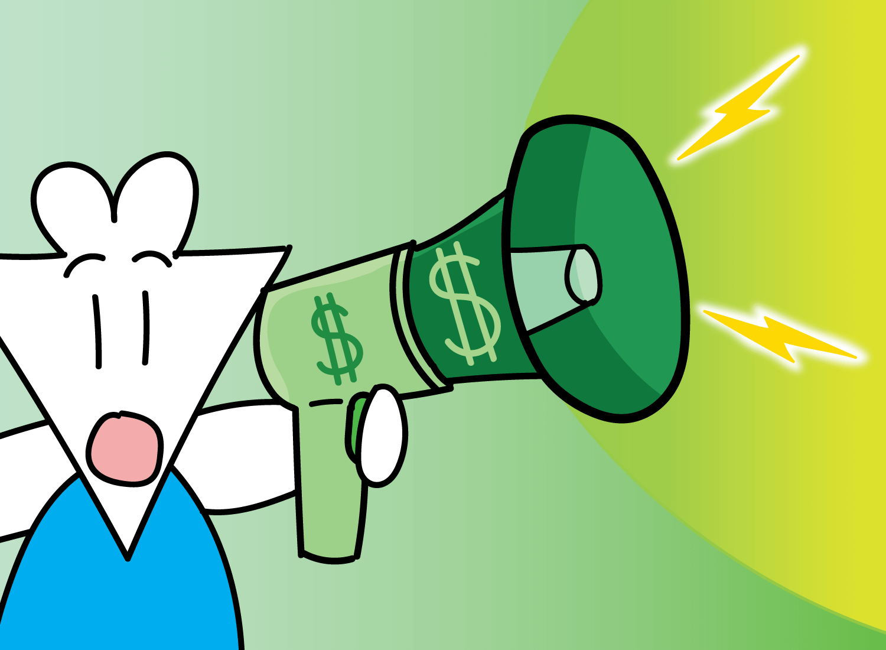](https://moretothat.com/wp-content/uploads/2020/01/E04-Money-Megaphone.png)

In the freedom phase, money is seen as a tool, an amplifier of the authenticity you embody. It is the resource that allows you to take care of yourself as you work on the problems you find worthwhile. You don’t need a lot to keep going, you just need enough.  

在自由阶段，金钱被视为一种工具，是你所体现的真实性的放大器。它是让您在解决您认为有价值的问题时照顾自己的资源。你不需要很多东西来继续前进，你只需要足够多。

Although the mindset of “enough” sounds great, I understand that it can be difficult. After all, the hardest part of this journey may be the stress that comes from monitoring the balances in your bank account. If you’re pursuing this endeavor as a side hustle, you may have some leeway here, but if it’s your full-time thing, the fact that “enough” may be slightly out-of-reach can induce anxiety.  

虽然“够了”的心态听起来很棒，但我知道这可能很困难。毕竟，这段旅程中最困难的部分可能是监控银行账户余额带来的压力。如果你把这项工作作为一种副业，你可能在这里有一些回旋余地，但如果这是你的全职工作，“足够”可能有点遥不可及的事实可能会引发焦虑。

The key here is to remain (1) diligent, (2) patient, and (3) rational.  

这里的关键是保持（1）勤奋，（2）耐心和（3）理性。

Diligence refers to your work ethic. There are no shortcuts to this. No amount of wishful thinking can substitute the necessity of hard work.  

勤奋是指你的职业道德。这没有捷径可走。再多的一厢情愿都不能取代努力工作的必要性。

Patience refers to your resilience. The benefits of compounding always come later, and patience is what allows you to drive the long, bumpy road necessary to get there.  

耐心是指你的韧性。复利的好处总是在以后出现，耐心是让你驾驶到达那里所必需的漫长而崎岖的道路的原因。

Rationality refers to your mindset. Will you helplessly slide down into Survival mode, or will you understand that you’re actually exercising freedom, spending your time solving the problems [you want to work on](https://moretothat.com/thankfully-life-is-full-of-problems/)? Can you be rational about your situation, and understand that you will be okay?  

理性是指你的心态。你会无助地滑入生存模式，还是会明白你实际上是在行使自由，花时间解决你想解决的问题？你能对自己的处境保持理性，并明白你会没事的吗？

Combine these three tenets with the mindset of “enough,” and eventually you will find yourself in an interesting situation. A while ago, nobody seemed to care about what you were working on, but now, a niche of people have grown to love your work. Some of them even pay you for your services, your products, or whatever you have to offer. Slowly but surely, you’re able to expand your money tool belt a few notches.  

将这三个原则与“够了”的心态结合起来，最终你会发现自己处于一个有趣的境地。不久前，似乎没有人关心你在做什么，但现在，一部分人已经开始喜欢你的工作。他们中的一些人甚至为您的服务、产品或您必须提供的任何东西付费。缓慢但肯定地，您可以扩展您的金钱工具带几个档次。

[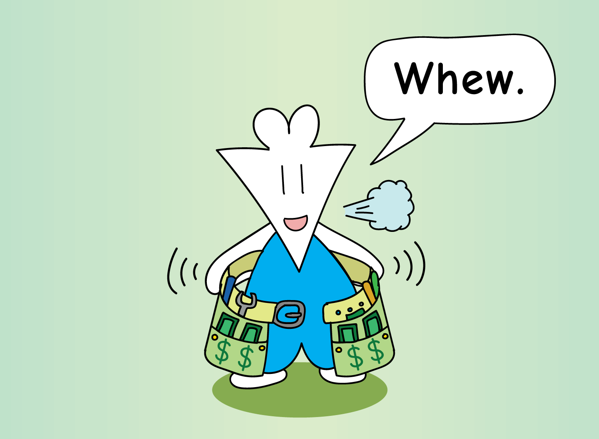](https://moretothat.com/wp-content/uploads/2020/01/E06-Loosening-the-Money-Belt.png)

When the income you generate from your endeavor begins to exceed the threshold of costs to keep things going, you get what I call the Fulfillment Surplus.  

当你从你的努力中产生的收入开始超过维持事情进行的成本门槛时，你就会得到我所说的履行盈余。

[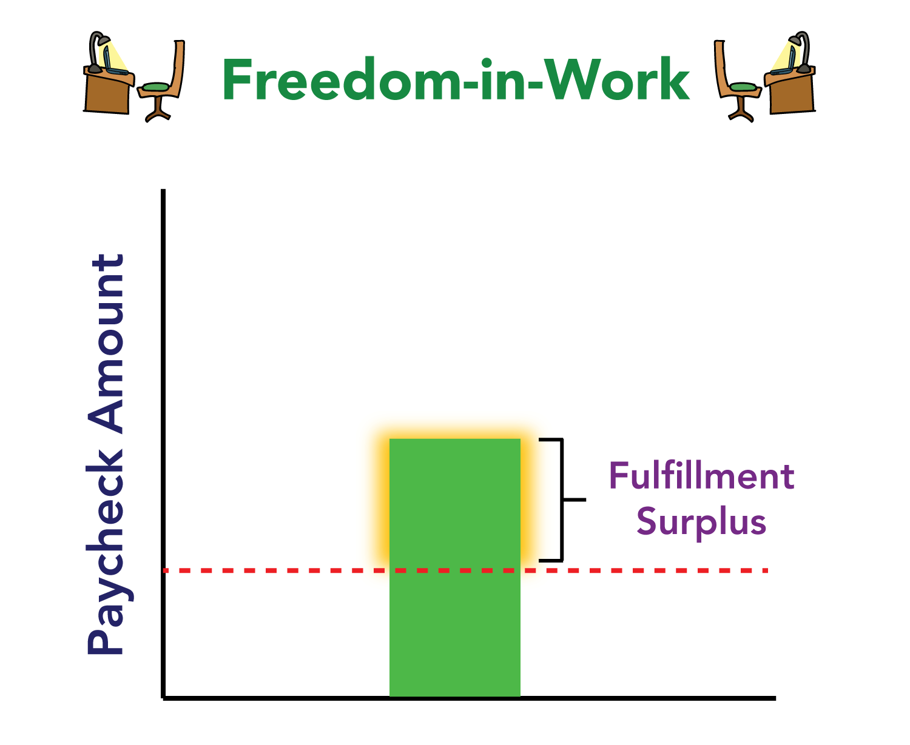](https://moretothat.com/wp-content/uploads/2020/01/E05-Fulfillment-Surplus-revised-2.png)

The Fulfillment Surplus is the best kind of money one can have. Not only do you have more than you need, you’ve earned it doing something that you would have done for free. Better yet, the reverse is also true: you would’ve worked on this endeavor even if you had all the money in the world.  

履行盈余是一个人可以拥有的最好的钱。你不仅拥有比你需要的更多的东西，而且你已经赚到了它，做一些你会免费做的事情。更好的是，反之亦然：即使你拥有世界上所有的钱，你也会为这项努力而努力。

But perhaps the best part of the Fulfillment Surplus is that it frees your attention away from money. The hardest part about doing meaningful work isn’t the work itself, but the stress that can result from frequently checking your bank account balances. The Fulfillment Surplus is the ticket that takes you away from here and into the highest end of the Freedom phase:  

但也许履行盈余最好的部分是它将您的注意力从金钱上解放出来。做有意义的工作最困难的部分不是工作本身，而是经常检查银行账户余额可能带来的压力。履行盈余是将您从这里带到自由阶段最高端的门票：

Freedom-in-attention. 注意力自由。

[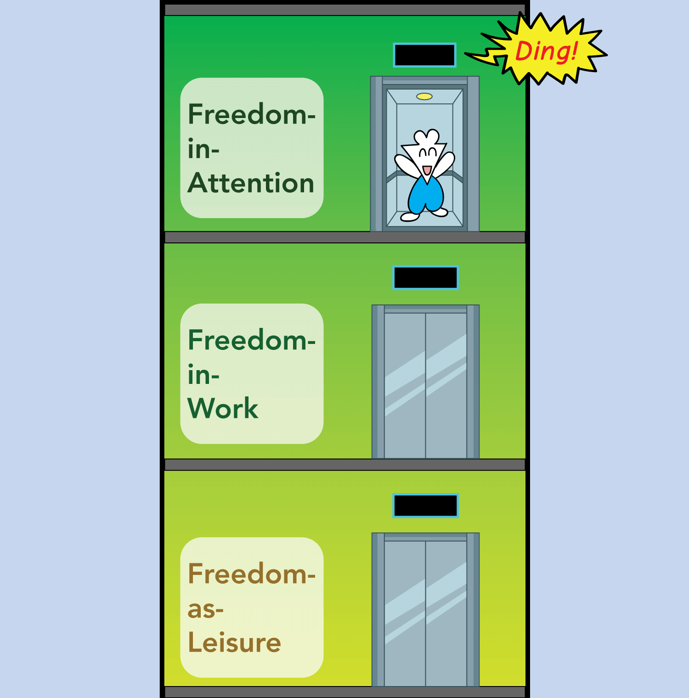](https://moretothat.com/wp-content/uploads/2020/01/F01-Reaching-Freedom-in-Attention.png)

When we think of financial freedom, we tend to picture a super rich person in this situation:  

当我们想到财务自由时，我们倾向于想象一个超级富豪在这种情况下：

[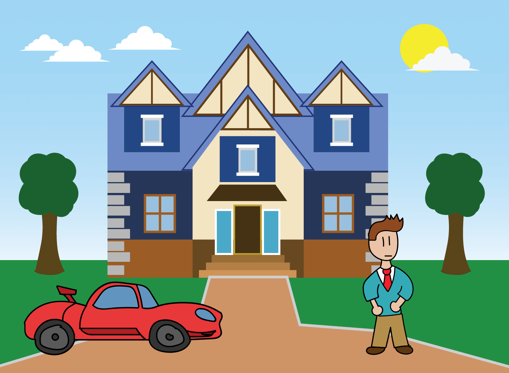](https://moretothat.com/wp-content/uploads/2020/01/G01-Rich-person-outside-mansion.png)

And when we think of someone’s who not financially free, we picture an average person in this scenario:  

当我们想到一个人在财务上不自由时，我们会想象一个普通人在这种情况下：

[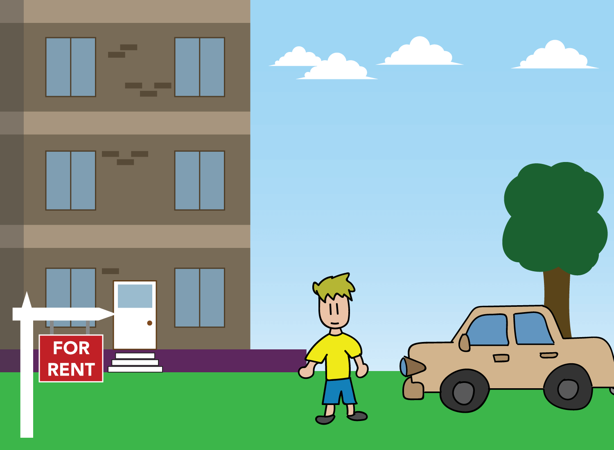](https://moretothat.com/wp-content/uploads/2020/01/G02-Average-person-at-apartment-revised.png)

However, if the super rich guy spends all his energy thinking about how much money he has and how he’s going to sustain this lifestyle, then he is not wealthy:  

然而，如果超级富豪把所有的精力都花在想他有多少钱，以及他将如何维持这种生活方式上，那么他就不富裕了：

[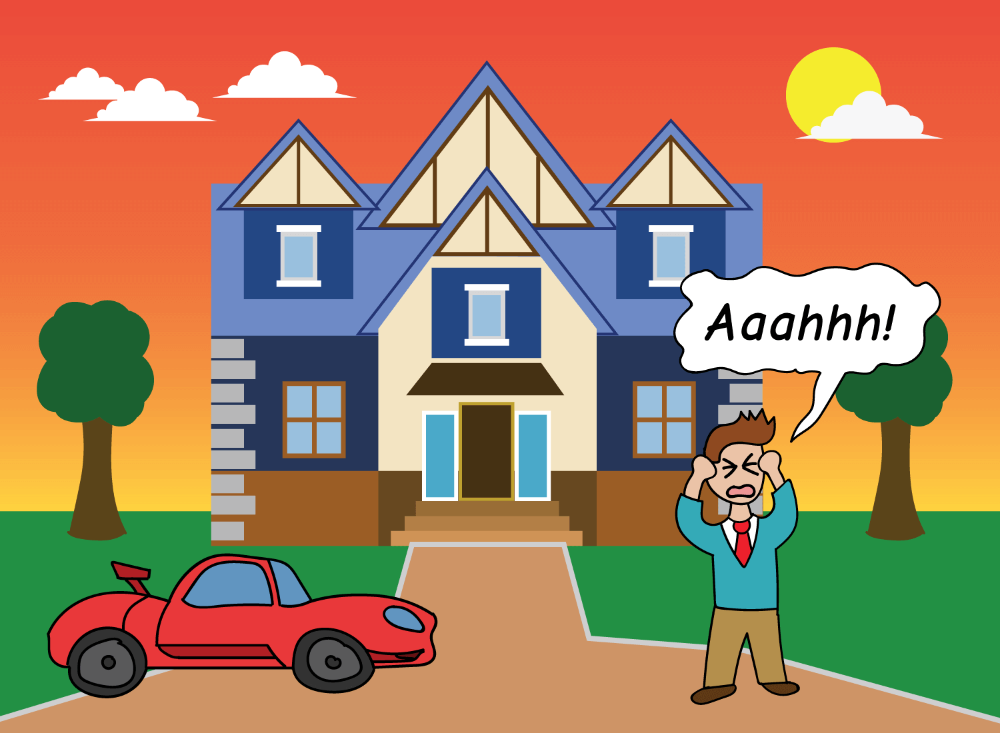](https://moretothat.com/wp-content/uploads/2020/01/G03-Rich-person-stressed-out.png)

But if the average person doesn’t ruminate about money because he knows he has everything he needs, then he is wealthy:  

但是，如果普通人不沉思金钱，因为他知道自己拥有所需的一切，那么他就是富有的：

[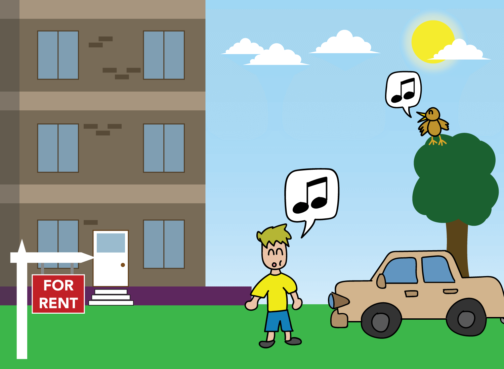](https://moretothat.com/wp-content/uploads/2020/01/G04-Average-person-enjoying-life-revised.png)

Financial freedom isn’t about money, it’s about attention. The less you have to think about money, the more free you actually are.  

财务自由与金钱无关，而与注意力有关。你越少考虑金钱，你实际上就越自由。

This is what the Fulfillment Surplus helps you realize. Once you get to the top of the Freedom phase, you are using money in a way that serves you. It is a tool that has enabled you to do the things you love, and has drifted out of focus when it has fulfilled that specific purpose. This is the sweetest spot in all of the Money Spectrum, and if we didn’t have any other aspirations or desires, then we’d be wise to stay here for a long time.  

这就是履行盈余帮助您实现的。一旦你到达自由阶段的顶端，你就是在以一种为你服务的方式使用金钱。它是一种工具，使您能够做自己喜欢的事情，并且在实现该特定目的时就偏离了焦点。这是所有金钱光谱中最甜蜜的地方，如果我们没有任何其他愿望或愿望，那么我们最好在这里呆很长时间。

However, it’s inevitable that our relationship with money will extend past the domain of the self. If we have families, we will want to use money in a way that gives our children the best possible lives. If we are part of a community, we will want to use money in a way that allows our fellow members to thrive.  

然而，我们与金钱的关系不可避免地会超越自我的领域。如果我们有家庭，我们会希望以一种给我们的孩子最好的生活的方式使用金钱。如果我们是社区的一部分，我们将希望以一种让我们的其他成员茁壮成长的方式使用金钱。

When it comes to the network of lives that are connected to ours, money can amplify these bonds dramatically… for better or for worse. It’s up to us to determine which direction it’ll go in, and this reflection takes us into the final phase of the Money Spectrum.  

当涉及到与我们相连的生活网络时，金钱可以极大地放大这些纽带......无论好坏。由我们来决定它将走向哪个方向，这种反思将我们带入金钱光谱的最后阶段。

### Phase #3: Power 阶段#3：电源

When you think of the word “power,” an image like this probably comes to mind:  

当你想到“权力”这个词时，可能会想到这样的形象：

[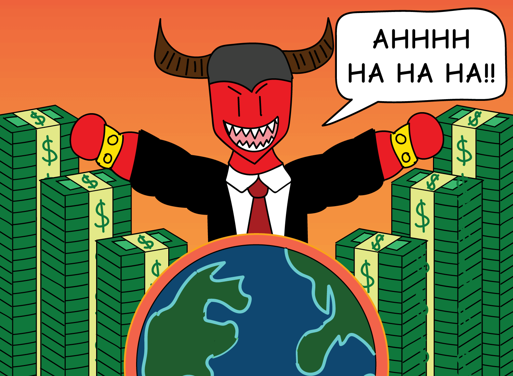](https://moretothat.com/wp-content/uploads/2020/01/H01-World-Domination-and-Power.png)

But let’s take a moment to see how our linguistic overlords at Oxford actually [define the word](https://www.lexico.com/en/definition/power).  

但是，让我们花点时间看看我们在牛津的语言霸主实际上是如何定义这个词的。

Power: 权力：

1\. the ability to do something or act in a particular way, especially as a faculty or quality.  

1\. 以特定方式做某事或行动的能力，尤其是作为教师或素质。

2\. the capacity or ability to direct or influence the behavior of others or the course of events.  

2\. 指导或影响他人行为或事件进程的能力或能力。

These two definitions provide a good framework to understand power, but notice that there’s no value judgment in either of them.  

这两个定义为理解权力提供了一个很好的框架，但请注意，它们中的任何一个都没有价值判断。

Power in itself is neither good nor evil. We often conflate the outcome of one’s power with one’s possession of it, but we must remember that these are two wholly different things. If someone used power in a horrible way, that doesn’t mean power in itself is evil. It just means that a shitty person got their grubby hands on a value-neutral ball of influence, and exercised it with malice.  

权力本身既不是善也不是恶。我们经常将一个人的权力的结果与一个人拥有它的结果混为一谈，但我们必须记住，这是两件完全不同的事情。如果有人以可怕的方式使用权力，这并不意味着权力本身就是邪恶的。这只是意味着一个糟糕的人得到了一个价值中立的影响力球，并恶意地行使它。

At its core, power is about two things:  

从本质上讲，权力是关于两件事：

\[Definition #1\] One’s ability to act freely, and  

\[定义 #1\]一个人自由行动的能力，以及

\[Definition #2\] One’s ability to influence the behavior of others.  

\[定义 #2\]一个人影响他人行为的能力。

When you first cross the border between Freedom and Power on the Money Spectrum, you are making a seamless transition into Definition #1. With an abundant Fulfillment Surplus on hand, you are pursuing the things you want to pursue, while limiting the attention you give to the continuous demands of money.  

当你第一次跨越金钱光谱上的自由和权力之间的边界时，你正在无缝过渡到定义#1。手头有丰富的履行盈余，你正在追求你想要追求的东西，同时限制你对金钱的持续需求的关注。

I call this initial territory power-over-the-self.  

我称这个初始领域为“权力凌驾于自身之上”。

[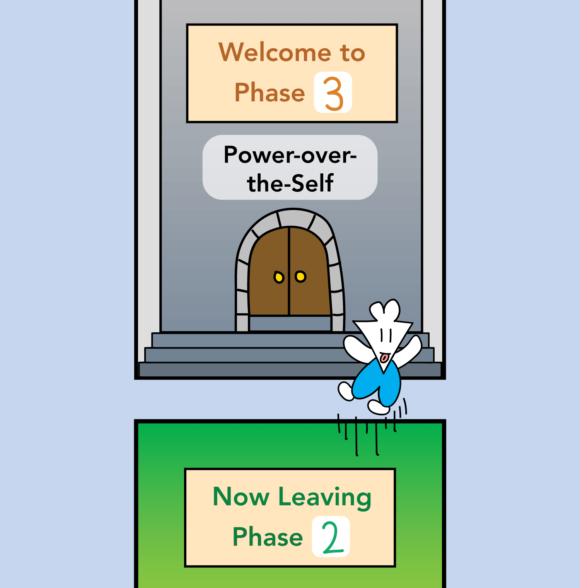](https://moretothat.com/wp-content/uploads/2020/02/I01-Heading-into-Phase-3-revised.png)

We’re not going to linger here too long because it’s similar to the upper end of the Freedom phase, but there’s one important statement I want to go over before we proceed:  

我们不会在这里逗留太久，因为它类似于自由阶段的上端，但在我们继续之前，我想回顾一个重要的声明：

The way you exercise power over yourself will set the conditions for how you exercise power over others.  

你对自己行使权力的方式将为你如何对他人行使权力设定条件。

In other words, the way you express your autonomy will construct the views you have of others. And nowhere is this more apparent than the way we use our money.  

换句话说，你表达自主权的方式将构建你对他人的看法。这一点最明显的莫过于我们使用资金的方式。

If you want to express your individual power by buying yachts, wearing gold chains, and balling out at night clubs, then that does two things. First, it signals to others that these are the things that matter to you, and they will tie your human worth to your material worth. Second, you will view others through this same lens, and you will see materiality as the answer to solving their problems in turn.  

如果你想通过购买游艇、戴金链子和在夜总会打球来表达你的个人力量，那么这有两件事。首先，它向别人发出信号，这些对你来说是重要的事情，它们会将你的人的价值与你的物质价值联系起来。其次，你将通过同样的视角看待他人，你将把物质性视为反过来解决他们问题的答案。

This leads to a vicious cycle where money is how you’re viewed, and money is how you view the world. Emotions like love and sympathy are incredibly nuanced, and believing that you can express them with a crude tool like cash will put a nasty taste in the mouths of the people that matter most (more on this soon).  

这导致了一个恶性循环，金钱是你被看待的方式，金钱是你看待世界的方式。像爱和同情这样的情感是非常微妙的，相信你可以用像现金这样的粗糙工具来表达它们，会在最重要的人的嘴里带来令人讨厌的味道（稍后会详细介绍）。

Understanding how you want to exercise your individual power is the key to navigating the next – and final – area of the spectrum: power-over-others.  

了解你想如何行使你的个人权力是导航下一个也是最后一个领域的关键：权力凌驾于他人之上。

[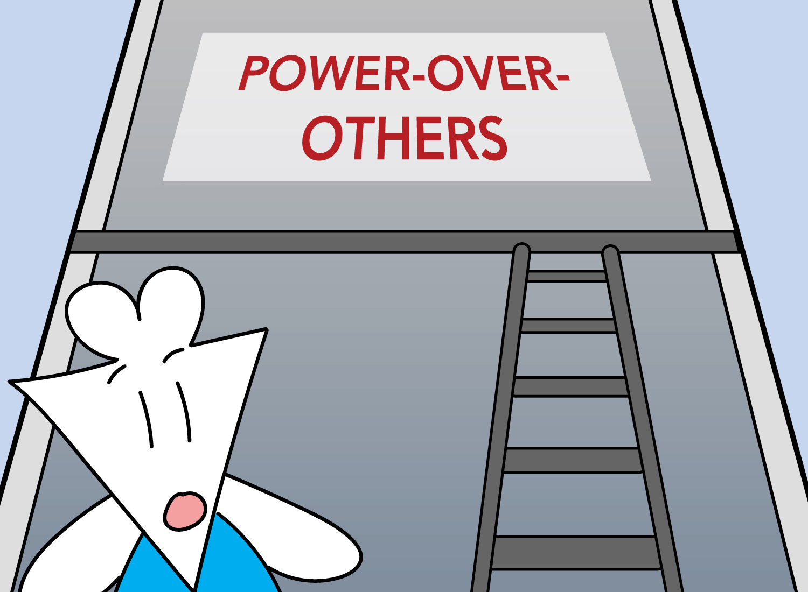](https://moretothat.com/wp-content/uploads/2020/01/I02-Looking-at-power-over-others.png)

“Power-over-others” sounds menacing, but remember, it simply refers to one’s ability to influence the behavior of others. The key question in this area is: how are you using money to direct the course of people’s lives?  

“凌驾于他人之上的权力”听起来很危险，但请记住，它只是指一个人影响他人行为的能力。这方面的关键问题是：你如何用金钱来指导人们的生活？

For most of us, the power of money resides in its ability to provide a better life for our families. With this precious resource, we are able to provide a better education for our children, larger homes for our partners, and grander vacations for our parents. These things provide a solid foundation for our family’s futures, and will direct the course that these lives will ultimately take.  

对于我们大多数人来说，金钱的力量在于它为我们的家庭提供更好的生活的能力。有了这些宝贵的资源，我们能够为我们的孩子提供更好的教育，为我们的伴侣提供更好的家庭，为我们的父母提供更盛大的假期。这些东西为我们家庭的未来提供了坚实的基础，并将指导这些生活最终走向的道路。

If influence were a tower, the immediate level up from the self would be the domain of family. The power of money in this realm is immediate, as your loved ones will see evidence of it in the form of higher-quality life experiences.  

如果影响力是一座塔，那么从自我直接上升的层次将是家庭的领域。金钱在这个领域的力量是立竿见影的，因为你的亲人会以更高质量的生活经历的形式看到它的证据。

[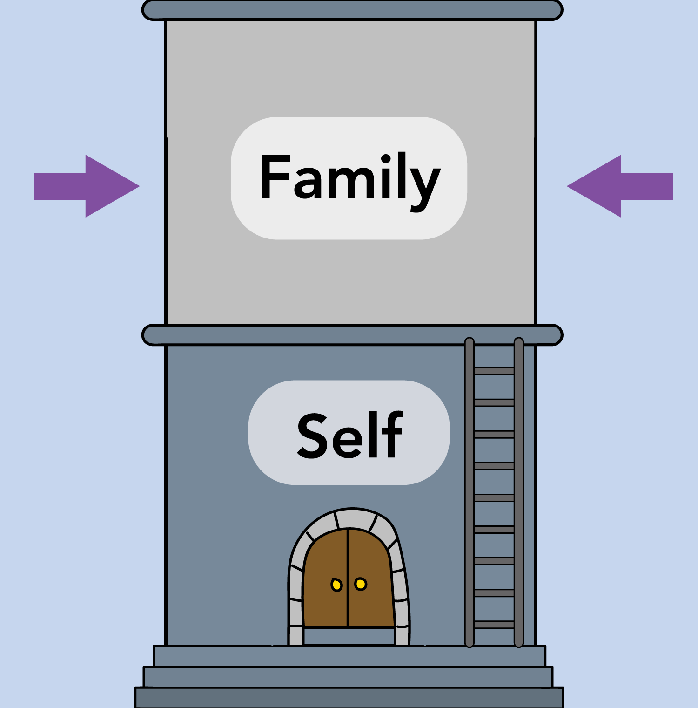](https://moretothat.com/wp-content/uploads/2020/01/I03-Moving-into-Family.png)

However, that doesn’t mean that the power of money will always yield a better family life. In fact, the reverse can be true: the more you elevate the importance of money, the more you may be (unintentionally) isolating yourself from them.  

然而，这并不意味着金钱的力量总能带来更好的家庭生活。事实上，情况正好相反：你越是强调金钱的重要性，你就越可能（无意中）将自己与金钱隔离开来。

This is where the greatest distinction between Power and Freedom resides. The upside of power is generally capped, whereas the upside of freedom is not. With power, there is usually a point where more of it starts having an adverse effect. If the influence over others becomes too great (even if it’s in the name of well-being), it can breed distrust, envy, and resentment.  

这就是权力和自由之间最大的区别所在。权力的好处通常是有上限的，而自由的好处则不是。有了权力，通常会有一个点，更多的权力开始产生不利影响。如果对他人的影响变得太大（即使是以幸福的名义），它就会滋生不信任、嫉妒和怨恨。

Baked into each layer of influence is the Power Tradeoff, where the green area represents the benefits of having the power of money, and the red signifies its more detrimental aspects.  

每一层影响都是权力权衡，绿色区域代表拥有金钱权力的好处，红色区域表示其更有害的方面。

[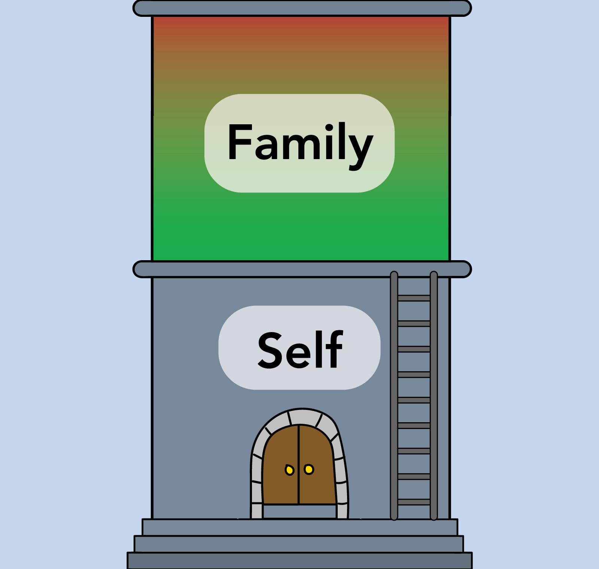](https://moretothat.com/wp-content/uploads/2020/01/I04-Family-Power-Tradeoff.png)

The above image shows the family layer’s Power Tradeoff, where both green and red areas exist. The green part should come as no surprise – the main reason why people work so much is so they could provide for their families. The more money they make, the more power they have to elevate the well-being of their loved ones.  

上图显示了族图层的功率权衡，其中绿色和红色区域都存在。绿色部分应该不足为奇——人们工作这么多的主要原因是他们可以养家糊口。他们赚的钱越多，他们就越有能力提升亲人的福祉。

The red part represents the other side of the story. There are many children who never get to see their parents because they’re out working 90-100 hours a week. They might live in a huge house with all the things they want, but the sense of abandonment can morph into resentment.  

红色部分代表故事的另一面。有许多孩子因为每周工作90-100小时而从未见过父母。他们可能住在一个巨大的房子里，拥有他们想要的所有东西，但被遗弃的感觉会演变成怨恨。

This red section is what happens when you forget that pursuing your idea of power has a deep effect on others. Many parents believe that working hard and making money is how they express their love for their children, but miss the fact that their children may not see it the same way. This leads to situations where these parents work tirelessly to become millionaires, only to see that their relationships with their kids have been defined by lost opportunities.  

这个红色部分是当你忘记追求你的权力观念对他人有深刻影响时发生的事情。许多父母认为努力工作和赚钱是他们表达对孩子的爱的方式，但却忽略了孩子可能不以同样的方式看待它的事实。这导致这些父母不知疲倦地工作成为百万富翁的情况，却发现他们与孩子的关系已被失去的机会所定义。

However, in this Power Tradeoff, the green still outweighs the red because we are eventually able to understand the nature of sacrifice. As long as we know that our parents love us, we are able to empathize with their plight, and understand the hustle they put in to provide better lives for everyone. This may take time, but if rationality prevails, these types of family difficulties can be healed in the long run.  

然而，在这种权力权衡中，绿色仍然超过红色，因为我们最终能够理解牺牲的本质。只要我们知道我们的父母爱我们，我们就能够同情他们的困境，并理解他们为每个人提供更好的生活而付出的忙碌。这可能需要时间，但如果理性占上风，从长远来看，这些类型的家庭困难是可以治愈的。

[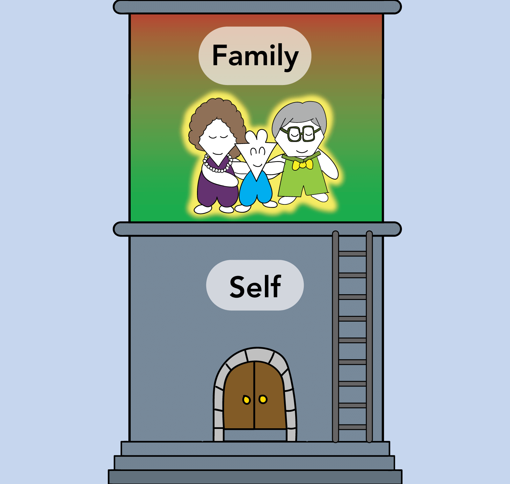](https://moretothat.com/wp-content/uploads/2020/01/I05-Hugging-family.png)

Many people will stop here in the tower of influence. They might be content in providing for themselves and their family, and won’t progress through additional power structures. But more likely, if those two layers are fulfilled, they will look to help or influence the health of the close-knit groups they’re a part of.  

很多人会停在势力之塔里。他们可能满足于养活自己和家人，并且不会通过额外的权力结构取得进展。但更有可能的是，如果这两层得到满足，他们将寻求帮助或影响他们所属的紧密团体的健康。

Next up is the domain of community.  

接下来是社区领域。

[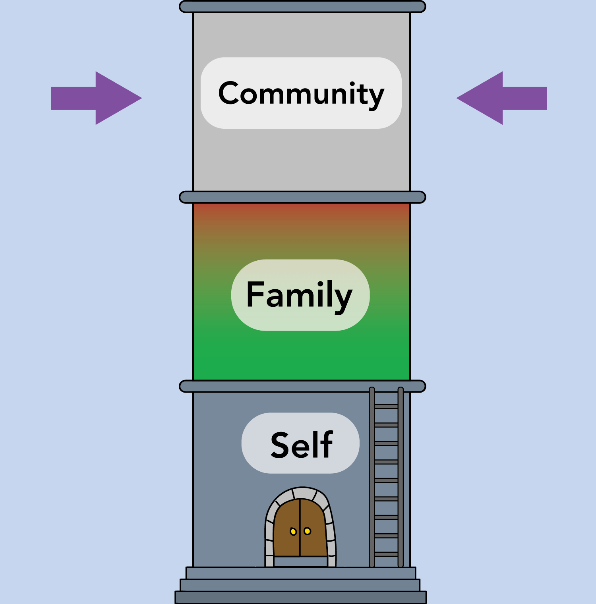](https://moretothat.com/wp-content/uploads/2020/01/I06-Moving-into-Community.png)

So what does the Power Tradeoff look like here?  

那么这里的功耗权衡是什么样的呢？

People in your close communities know you quite well, and you are generally together for some shared purpose. That glue might be religion, it may be service, or it could be something more value-free like entertainment. Regardless of what it is, this purpose is distributed across each of its members, and equalizes everyone’s role in this communal playing field.  

你亲密社区的人非常了解你，你们通常是为了某种共同的目的而在一起的。这种粘合剂可能是宗教，可能是服务，也可能是像娱乐这样更有价值的东西。不管它是什么，这个目标都分布在每个成员身上，并使每个人在这个公共竞争环境中的角色平等。

[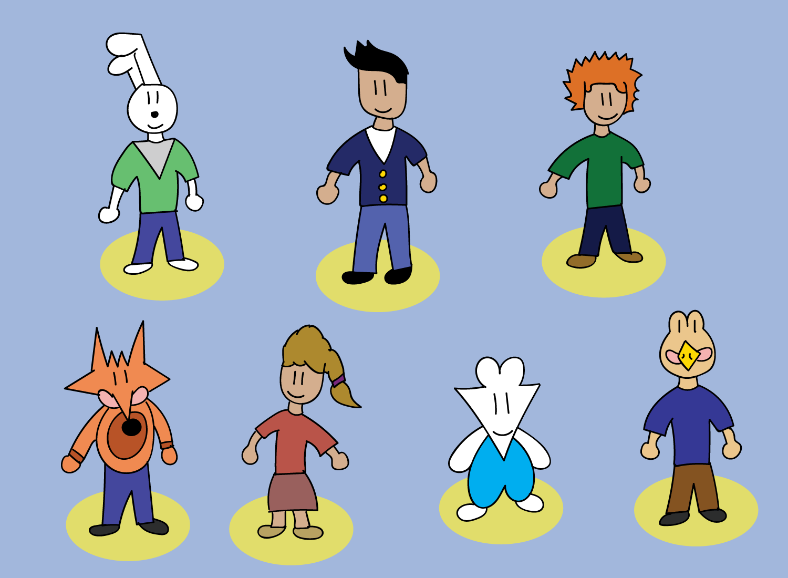](https://moretothat.com/wp-content/uploads/2020/01/J01-Community-across-members.png)

Influencing the community through money, however, can complicate the situation.  

然而，通过金钱影响社区可能会使情况复杂化。

If you decide to make an outsized donation and everyone hears about it, this is likely to happen:  

如果您决定进行超额捐赠并且每个人都听说过，则可能会发生这种情况：

[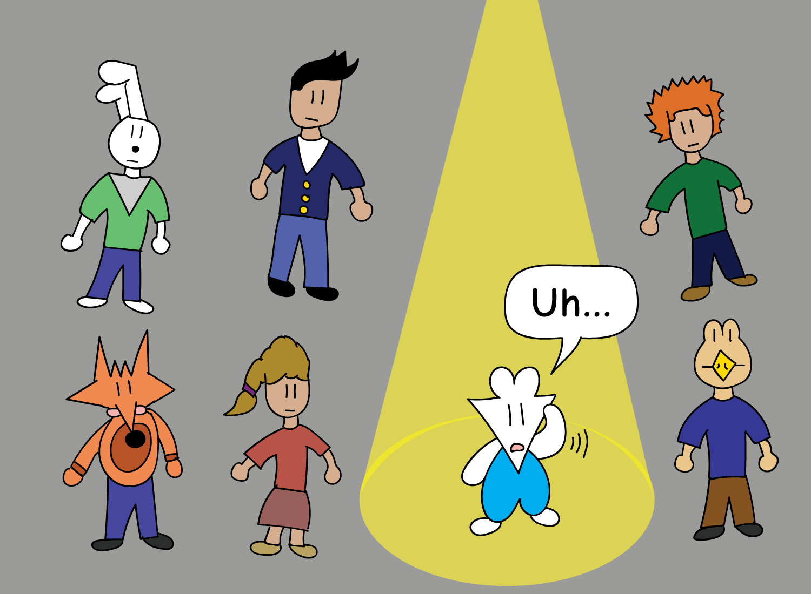](https://moretothat.com/wp-content/uploads/2020/01/J02-Spotlight-attention.png)

The tricky thing with money is that it’s often used as a measuring stick of one’s value to their community. If you give a lot of money to a cause you care about, that might be the way people gauge how much that cause means to you, as nuance tends to be removed the larger the group is.  

金钱的棘手之处在于，它经常被用作衡量一个人对社区价值的标尺。如果你为你关心的事业捐了很多钱，这可能是人们衡量这个事业对你有多大意义的方式，因为群体越大，细微差别往往会被消除。

I mentioned earlier that financial freedom is obtained by the elimination of attention, but the reverse is also true. Financial freedom is diminished by the constant receipt of attention as well.  

我之前提到过，财务自由是通过消除注意力获得的，但反过来也是如此。财务自由也因不断受到关注而减少。

The more you are viewed through the lens of money, the less you are able to break free from the identity of money. For some, that may not necessarily be a bad thing. Perhaps you’re a financial advisor, and your personal wealth has to be a reliable signal to others that you know what you’re doing.  

越是用金钱的眼光来看待你，你就越不能摆脱金钱的身份。对一些人来说，这不一定是一件坏事。也许你是一名财务顾问，你的个人财富必须向别人发出一个可靠的信号，表明你知道你在做什么。

But if you just want to elevate the financial health of your local church, being “that person that gives a shitload of money” can be a cumbersome role to play. Money is a low-resolution surrogate for your value judgments, and sadly, many people have a hard time making this distinction.4  

但是，如果你只是想提升当地教会的财务状况，那么成为“那个给一大笔钱的人”可能是一个繁琐的角色。金钱是你价值判断的低分辨率替代品，可悲的是，许多人很难做出这种区分4。

The closest members of your communities, however, may be more nuanced in their perceptions. They may not be as close to you as your immediate family, but they can understand your principles, your values, and the things that make you who you are, independent of wealth.  

但是，您社区中最亲密的成员在感知上可能更加微妙。他们可能不像你的直系亲属那样与你亲近，但他们可以理解你的原则、你的价值观，以及让你成为独立于财富的事情。

In the community layer, the Power Tradeoff is still more positive than negative, but not as much as the family layer below. The impact of money can go far, but since there are more people involved (some of whom you may not even know), the many shades of your identity can start congealing into the singular dimension of wealth.  

在社区层中，权力权衡仍然比消极的更积极，但不如下面的家庭层那么多。金钱的影响可以走得很远，但由于涉及的人更多（其中一些人你甚至可能不认识），你身份的许多阴影可以开始凝结成财富的单一维度。

The balance is finer here. Use your money mindfully, and the community will thrive with you. Use it recklessly, and you will be vilified by the very community you were trying to help. Money can breed all kinds of weird group behaviors, so your judgment must be sharp when navigating this domain.  

这里的平衡更精细。谨慎使用您的资金，社区将与您一起繁荣。鲁莽地使用它，你会被你试图帮助的社区诋毁。金钱可以滋生各种奇怪的群体行为，所以在浏览这个领域时，你的判断力必须敏锐。

[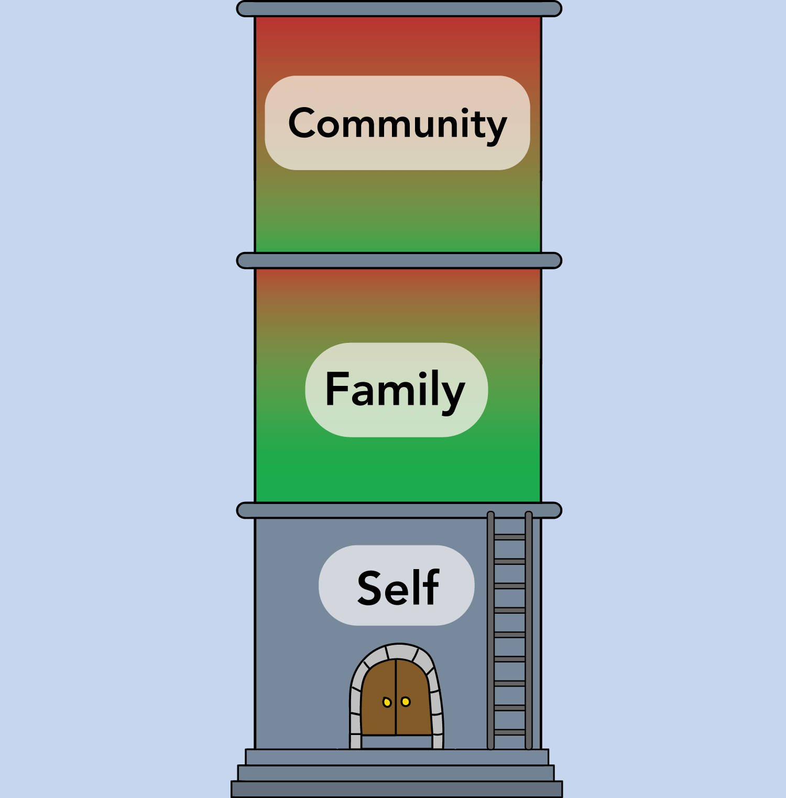](https://moretothat.com/wp-content/uploads/2020/01/I07-Community-Power-Tradeoff.png)

For the vast majority of us, this is where our desire for influence (as it relates to money) will stop. Having the power to help people we know yields a sense of fulfillment, and that is enough to keep us contented for the rest of our lives.  

对于我们绝大多数人来说，这就是我们对影响力的渴望（因为它与金钱有关）将停止的地方。有能力帮助我们认识的人会产生一种成就感，这足以让我们在余生中保持满足。

However, there are some people that want to go beyond their immediate circles, and use their money to direct the behaviors of people they don’t know at all. They want their wealth to go far, and act as the tool to spread influence over the lives of many. This type of power can range from the smaller scale of things (local non-profit groups, influencing district elections, angel investing, etc.) all the way to the largest scale we could think of (global philanthropy, influencing presidential elections, big venture capital firms, etc.).  

然而，有些人想要超越他们的直接圈子，用他们的钱来指导他们根本不认识的人的行为。他们希望自己的财富走得更远，并充当将影响力传播到许多人生活中的工具。这种类型的权力范围可以从小规模的事情（地方非营利组织，影响地区选举，天使投资等）一直到我们能想到的最大规模（全球慈善事业，影响总统选举，大型风险投资公司等）。

To simplify this massive range of possibilities, let’s all throw them into one final layer titled “People You Don’t Know.”  

为了简化这种巨大的可能性，让我们把它们都放在最后一层，标题为“你不认识的人”。

[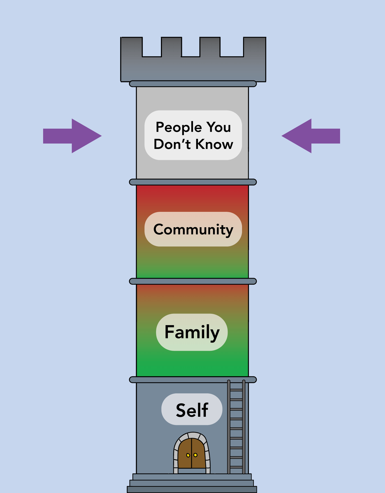](https://moretothat.com/wp-content/uploads/2020/01/I08-People-You-Do-Not-Know.png)

Of all the layers in the tower of influence, this one is by far the riskiest. This is where “power + money” gets its shitty reputation, and people tend to be skeptical of the folks that operate here.  

在影响之塔的所有层中，这一层是迄今为止风险最大的。这就是“权力+金钱”名声不佳的地方，人们往往对在这里经营的人持怀疑态度。

To illustrate why, recall this scenario from the community level:  

为了说明原因，请从社区级别回想一下此场景：

[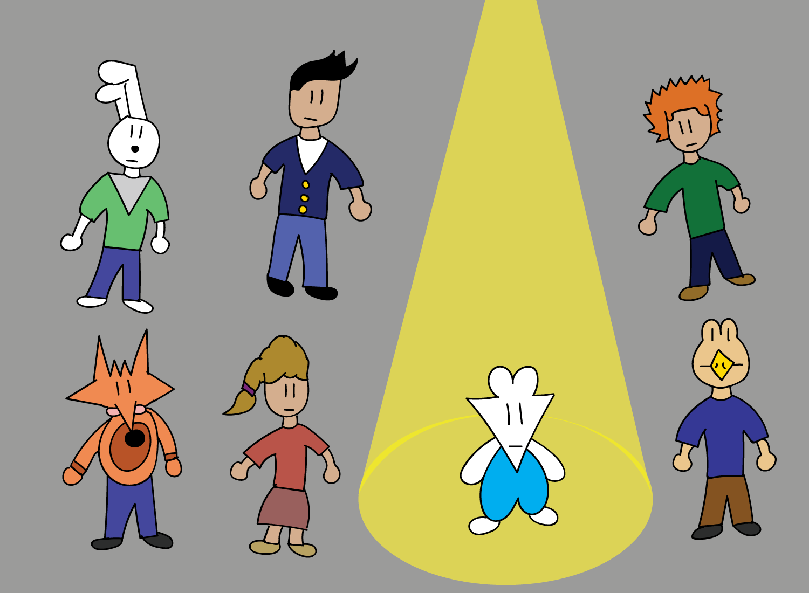](https://moretothat.com/wp-content/uploads/2020/01/J04-Community-attention-without-talking-bubble.png)

And realize that when you’re operating at the “People You Don’t Know” level, you get this daunting situation:  

并意识到，当你在“你不认识的人”级别上运作时，你会得到这个令人生畏的情况：

[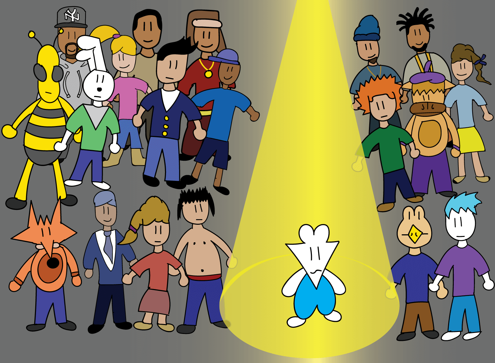](https://moretothat.com/wp-content/uploads/2020/01/J03-People-you-do-not-know-attention.png)

With that much attention to your financial decisions, it’s easy to be perceived as a caricature of your money. People that don’t know you are indifferent to the relationships you have with your neighbors, the fact that your sister may be ill, or the details of your daily meditation practice. You are defined primarily by your wealth, and what you do with your wealth shapes the perceptions of your character.  

由于如此关注您的财务决策，很容易被视为对您的金钱的讽刺。不认识你的人对你与邻居的关系、你姐姐可能生病的事实或你日常冥想练习的细节漠不关心。你主要由你的财富来定义，你用你的财富做什么塑造了你性格的看法。

You may think I’m overgeneralizing here, but when you mix wealth into someone’s list of attributes, everything else seems to go out the window. Want to see evidence of this? Put the name of any prominent businessperson or entrepreneur in Google, and guess what will always pop up as a top search suggestion:  

你可能认为我在这里过于概括，但是当你将财富混合到某人的属性列表中时，其他一切似乎都消失了。想看看这方面的证据吗？在Google中输入任何杰出商人或企业家的名字，并猜测什么总是会作为热门搜索建议弹出：

[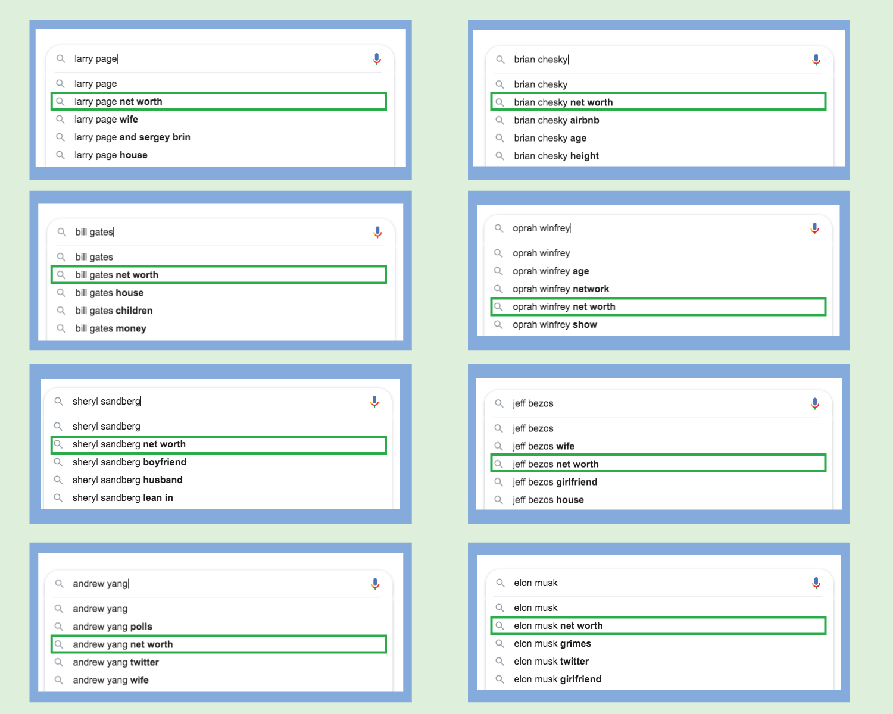](https://moretothat.com/wp-content/uploads/2020/01/M01-Net-Worth-Examples-revised.png)

This is what people care about most.  

这是人们最关心的。

This singular view of identity is the source of most problems on the “People You Don’t Know” layer. If everyone knew you as an artist, you couldn’t help but to see the world through the lens of creation. Similarly, if everyone used wealth to define you, then you will likely solve problems through the lens of money.  

这种单一的身份观是“你不认识的人”层上大多数问题的根源。如果每个人都知道你是一个艺术家，你会情不自禁地通过创作的镜头去看世界。同样，如果每个人都用财富来定义你，那么你很可能会通过金钱的视角来解决问题。

Sometimes this works out well for humanity. For example, Bill Gates is using his power to help solve some of [the world’s greatest problems](https://www.vanityfair.com/hollywood/2019/09/bill-gates-interview-netflix-inside-bills-brain). But for every Bill Gates, there may be thousands of people that want their money to influence others in less fruitful ways. Political corruption and racketeering are just a few examples here. When money is used to solve big problems in zero-sum games, it usually comes at the expense of the powerless.  

有时这对人类来说效果很好。例如，比尔·盖茨正在利用他的权力帮助解决世界上一些最大的问题。但对于每一个比尔盖茨来说，可能有成千上万的人希望他们的钱以不那么富有成效的方式影响他人。政治腐败和敲诈勒索只是这里的几个例子。在零和博弈中，当金钱被用来解决大问题时，它通常是以牺牲无权者为代价的。

But of course, being rich and powerful doesn’t imply that you’re evil. The truth is far from that. I’m reminded of this great illustration, which depicts the reality of the situation:  

但是，当然，富有和有权势并不意味着你是邪恶的。事实远非如此。我想起了这个伟大的插图，它描绘了现实情况：

[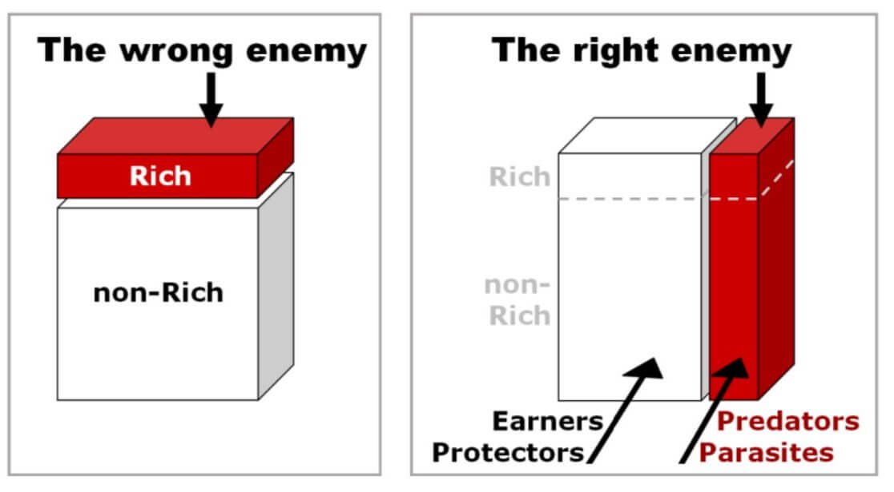](https://moretothat.com/wp-content/uploads/2020/01/Wrong-and-Right-Enemy.jpg)

This image is from Steve Conover’s book, [Neutering the National Debt](https://amzn.to/37UqMBH).  

这张图片来自史蒂夫·康诺弗（Steve Conover）的书《阉割国债》（Neutering the National Debt）。

There are plenty of wealthy, influential people that have the best intentions in mind. The point I’m making, however, is that operating in the “People You Don’t Know” layer of influence is a tricky place, primarily because it tends to cultivate the feeling of attachment.  

有很多富有、有影响力的人心中有着最好的意图。然而，我要说的是，在“你不认识的人”的影响层中运作是一个棘手的地方，主要是因为它倾向于培养依恋感。

I don’t have the personal wealth to operate in this final layer, but I imagine that much of the struggle here comes from the inability to detach one’s wealth from the rest of their persona. I’ve read cases about [executives](https://www.nytimes.com/2008/11/07/business/07suicide.html) (and even [a billionaire](https://www.reuters.com/article/us-merckle-newsmaker-sb/german-billionaire-commits-suicide-after-vw-losses-idUSTRE5055O820090106)) committing suicide because they lost money in the 2008 recession. That might sound crazy to someone like me, but then again, I don’t know what it feels like to have my personal wealth define my entire existence.  

我没有个人财富来经营这最后一层，但我想这里的大部分挣扎来自无法将一个人的财富与他们的其他角色分开。我读过关于高管（甚至亿万富翁）自杀的案例，因为他们在2008年的经济衰退中赔了钱。对于像我这样的人来说，这听起来可能很疯狂，但话又说回来，我不知道让我的个人财富定义我的整个存在是什么感觉。

Money is a tool, but if that tool defines how you impact the lives of thousands of people, it will be of utmost importance for you to continue having it.  

金钱是一种工具，但如果这个工具定义了你如何影响成千上万人的生活，那么继续拥有它对你来说至关重要。

[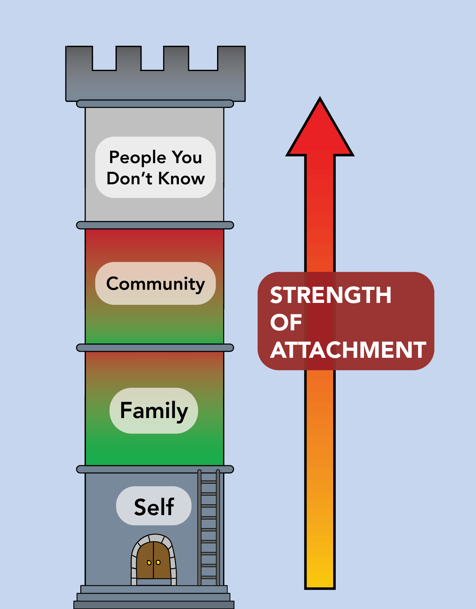](https://moretothat.com/wp-content/uploads/2020/01/I09-Attachment-arrow.png)

And when it comes to attachment, these three words sum it up well:  

说到依恋，这三个词总结得很好：

[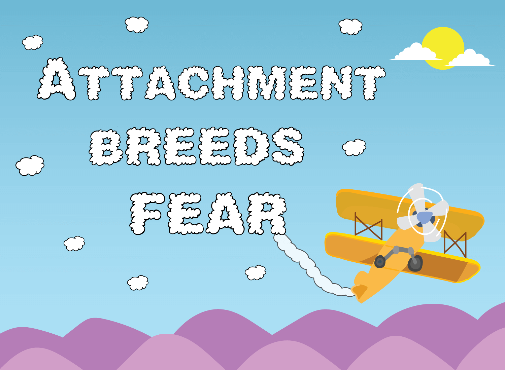](https://moretothat.com/wp-content/uploads/2020/01/L01-Attachment-breeds-fear.png)

Ironically, the end of the Money Spectrum can breed just as much fear as the Survival entrance into it. Having immense power can make someone just as fearful of losing their money as a person who needs it to survive another day.  

具有讽刺意味的是，金钱光谱的终结可以滋生与生存进入其中一样多的恐惧。拥有巨大的权力会让一个人害怕失去他们的钱，就像一个需要它来生存另一天的人一样。

This tendency toward attachment is what makes the Power Tradeoff in this final level an unfavorable bet:  

这种依恋倾向使最后一关的权力权衡成为不利的赌注：

[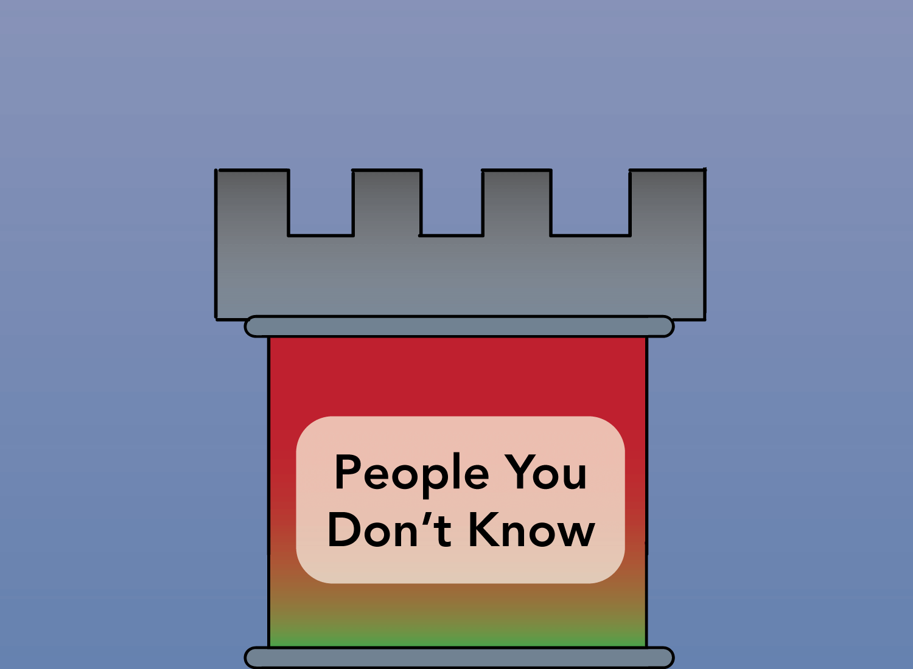](https://moretothat.com/wp-content/uploads/2020/01/I10-Close-up-of-people-you-do-not-know-layer.png)

Now that we’ve colored in each layer, let’s take a step back and look at the tower of influence in its entirety.  

现在我们已经在每一层中着色了颜色，让我们退后一步，完整地看一下影响力之塔。

[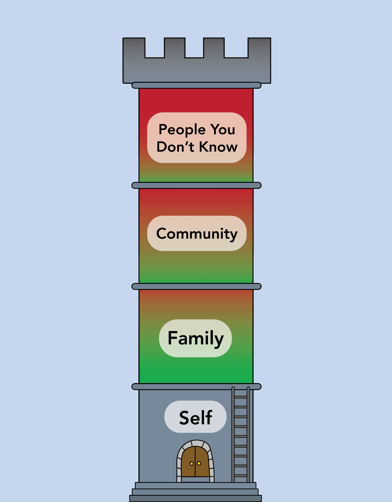](https://moretothat.com/wp-content/uploads/2020/01/I10-People-you-do-not-know-Power-Tradeoff.png)

At the moment, it looks like a collage of individual red-and-green spectrums, but if we blend them all together to create an average Power Tradeoff for the whole thing, it’ll look something like this:  

目前，它看起来像是单个红绿光谱的拼贴画，但如果我们将它们混合在一起，为整个事物创建一个平均的功率权衡，它看起来像这样：

[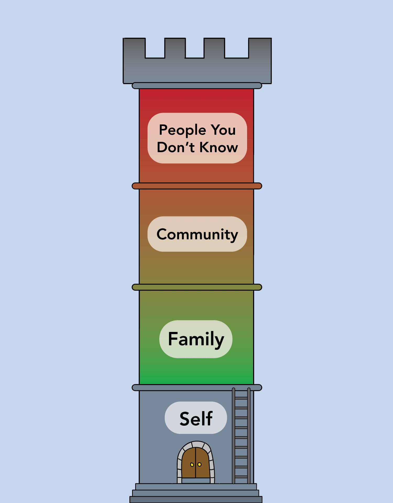](https://moretothat.com/wp-content/uploads/2020/01/I11-Whole-power-phase.png)

This is a good summarization of what the Power phase looks like on the Money Spectrum. Money can work well for you in the domain of the self and the family, but it can create attachment when it gives you power over many people. When your identity becomes defined by the influence of money, you are wading into dangerous waters, and you will have to exercise brilliant judgment to navigate through it properly.  

这是对金钱光谱中权力阶段的一个很好的总结。金钱在自我和家庭领域对你来说效果很好，但是当它给你对许多人的权力时，它可以产生依恋。当你的身份被金钱的影响所定义时，你就涉足了危险的水域，你必须运用出色的判断力才能正确地驾驭它。

At the same time, if your judgments are right, you will be able to do immense good. Just consider all the tradeoffs that exist toward the end of the Money Spectrum, and understand how your decisions ripple through each subsequent layer below it.  

同时，如果你的判断是正确的，你将能够做巨大的善事。只要考虑一下金钱光谱末端存在的所有权衡，并了解您的决策如何在其下方的每一层中产生涟漪。

### Where Are You On The Money Spectrum?  

你在金钱光谱上处于什么位置？

We’ve conducted a comprehensive review of all three phases, so now it’s time to zoom out and see the Money Spectrum as a whole.  

我们已经对所有三个阶段进行了全面审查，所以现在是时候缩小并查看整个资金范围了。

[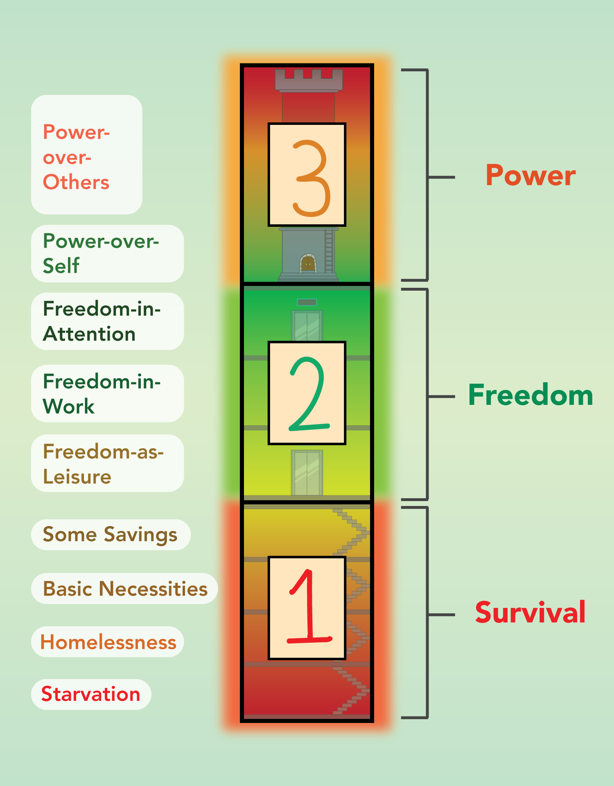](https://moretothat.com/wp-content/uploads/2020/01/K01-Entire-Money-Spectrum.png)

The first question I ask myself when I see this is, “What determines someone’s place on this spectrum?”  

当我看到这个时，我问自己的第一个问题是，“是什么决定了一个人在这个频谱上的位置？

The initial assumption here might be the amount of money you have. After all, if you have no money, you’re probably scraping for survival, but if you have a lot, you can exercise great freedom and power with it.  

这里的初始假设可能是您拥有的金额。毕竟，如果你没有钱，你可能是为了生存而勉强，但如果你有很多钱，你可以用它行使极大的自由和权力。

[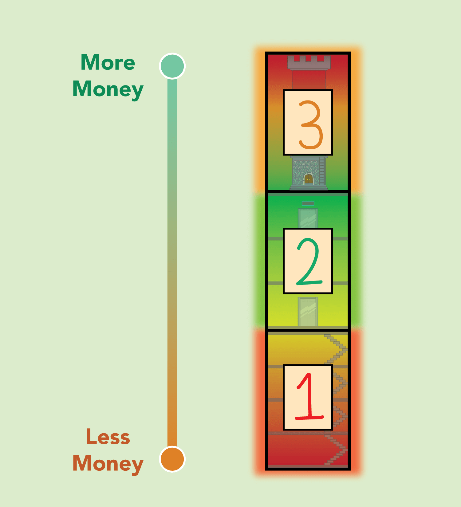](https://moretothat.com/wp-content/uploads/2020/01/K02-Axis-of-More-and-Less-Money-Smaller-2.png)

But this is simply not true.  

但这根本不是真的。

You can have a modest sum of money, but live high up on the Freedom phase. A good example would be someone that makes $30K a year, but earns it doing work she loves. On top of that, she lives a lifestyle where she reliably spends just $20K a year. She has freedom-in-work, and power-over-the-self. She is a rich person.  

你可以有一笔不多的钱，但生活在自由阶段的高处。一个很好的例子是，有人每年赚3万美元，但靠自己喜欢的工作赚钱。最重要的是，她过着一种每年只花2万美元的生活方式。她有工作自由，有凌驾于自己之上的权力。她是个有钱人。

Conversely, you can have a large sum of money, but be low on the Survival phase. This would be someone that makes $300K a year, but earns it doing work he hates. On top of that, he lives a lifestyle where he is racked up in credit card debt, with a mortgage on a house he can’t even afford. He has limited freedom, and is barely scraping by. He is a poor person.  

相反，你可以拥有一大笔钱，但在生存阶段要低。这将是一个年赚30万美元，但靠他讨厌的工作赚钱的人。最重要的是，他过着一种生活方式，他背负着信用卡债务，抵押贷款的房子他甚至买不起。他的自由有限，勉强糊口。他是个穷人。

There are many variations of this that highlight the inadequacy of the “money-in-the-bank” metric. There are many millionaires that have no desire to influence or help their families and close communities. On the other hand, there are people earning a minimum wage that send what little they have back home to assist their parents and friends.  

这有许多变体，突出了“银行里的钱”指标的不足。有许多百万富翁不想影响或帮助他们的家庭和亲密的社区。另一方面，有些人赚取最低工资，将他们仅有的一点钱寄回家帮助他们的父母和朋友。

The amount of money you have is not the proper lens to view your place on the Money Spectrum.  

您拥有的钱量不是查看您在金钱光谱中的位置的正确镜头。

[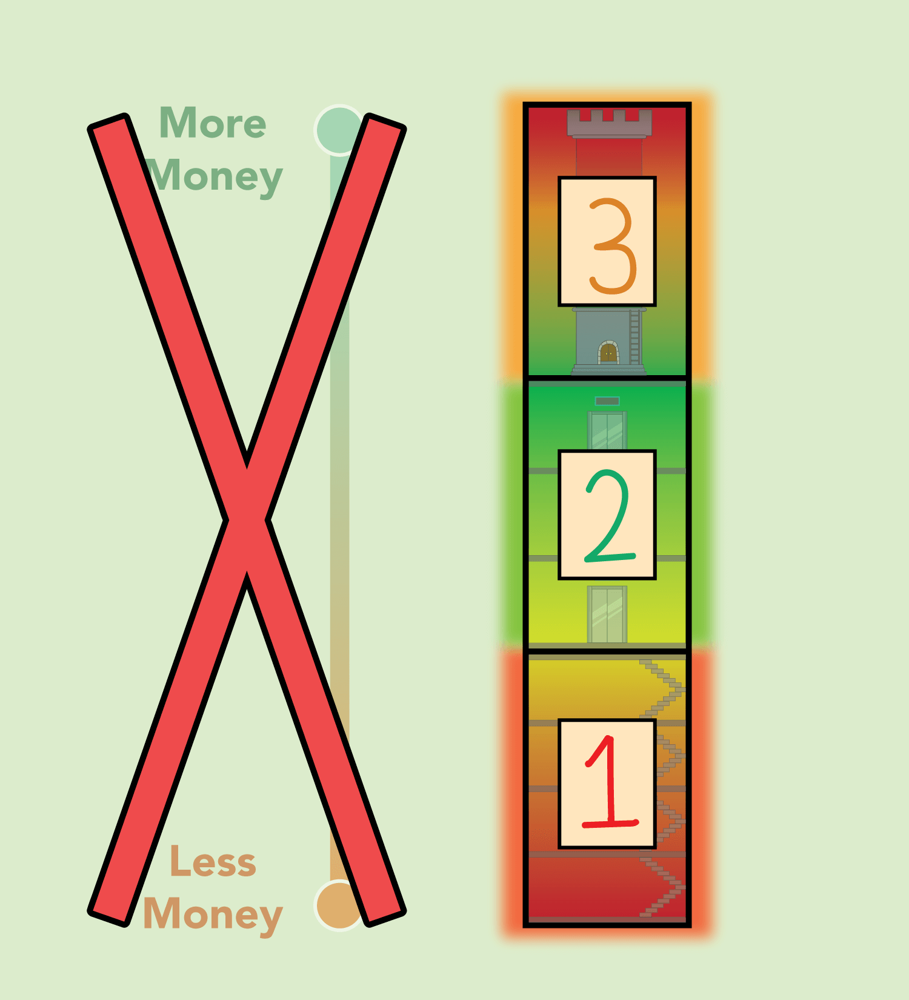](https://moretothat.com/wp-content/uploads/2020/01/K03-Crossing-out-money-axis.png)

So if money itself doesn’t determine your place on the Money Spectrum, then what the hell does?  

因此，如果金钱本身并不能决定你在金钱光谱中的位置，那么这到底是做什么的呢？

Well, the answer may sound trite, but it’s the truth.  

好吧，答案可能听起来很陈词滥调，但这是事实。

You choose your position yourself.  

你自己选择你的位置。

[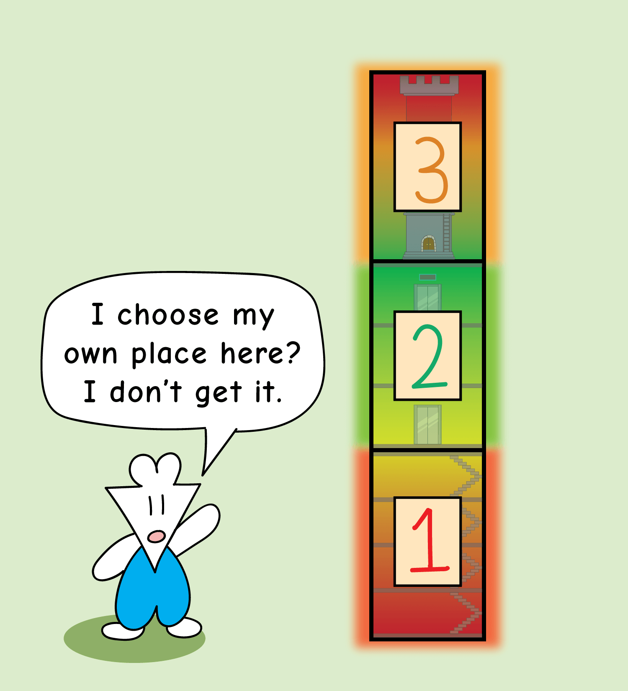](https://moretothat.com/wp-content/uploads/2020/01/K04-Asking-about-place-on-the-spectrum.png)

To understand what I mean, we need to first view things through the right frame. Instead of viewing the spectrum through the lens of how much money you have, you must view it through the emotional ranges of two things: clarity and fear.  

要理解我的意思，我们需要首先通过正确的框架来看待事物。与其通过你有多少钱来看待光谱，你必须通过两件事的情感范围来看待它：清晰和恐惧。

The lower you are in Survival mode, the more fearful you are of money and its impact on your life. However, as you move up the Survival phase and get closer to Freedom, the fear surrounding money gradually fades and things enter the domain of clarity.  

你在生存模式中的地位越低，你就越害怕金钱及其对你生活的影响。然而，随着你进入生存阶段并接近自由，围绕金钱的恐惧逐渐消退，事情进入了清晰的领域。

[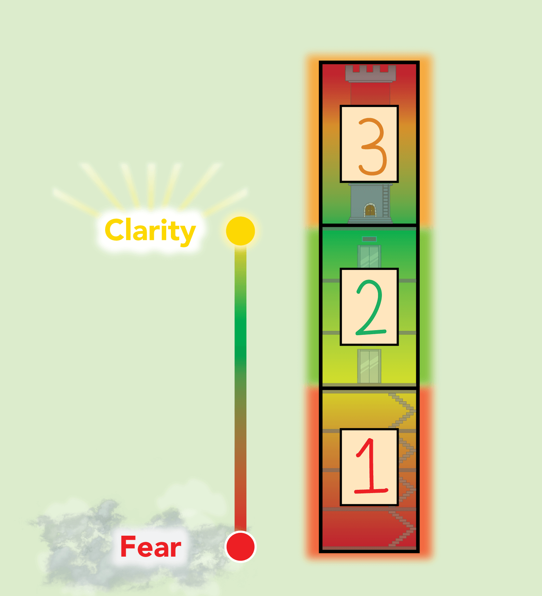](https://moretothat.com/wp-content/uploads/2020/01/K05-Clarity-and-Fear-revised.png)

When you’re in the Freedom phase, things are more clear, but freedom-in-leisure is still a somewhat hazy place. You start having more control over your life the higher you go, and the greatest benefits come when you’re in the freedom-in-work and the freedom-in-attention areas of this phase.  

当你处于自由阶段时，事情会更加清晰，但休闲自由仍然是一个有点朦胧的地方。你走得越高，你开始对自己的生活有更多的控制，当你处于这个阶段的工作自由和注意力自由领域时，最大的好处就会到来。

This is what I call the sweet spot, and it is where your wealth goes the longest way, regardless of how much you have.  

这就是我所说的甜蜜点，无论你有多少财富，它都是你的财富走得最长的地方。

[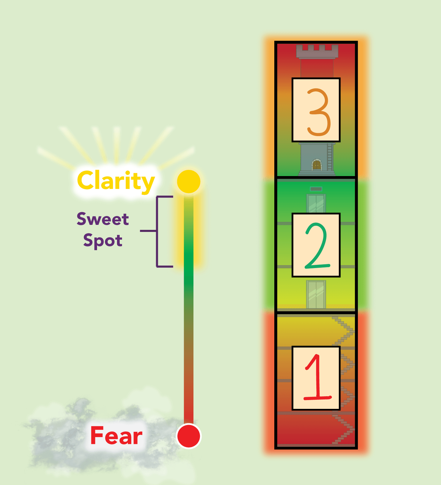](https://moretothat.com/wp-content/uploads/2020/01/K06-Sweet-Spot.png)

If you make the decision to proceed further into the Power phase, then you must enter the tower of influence, where Power Tradeoffs become increasingly tenuous the higher you go. Exercising your influence through money may be more manageable with your family, but once it goes into the layers of communities and people you don’t know, there’s more at stake. Attachment can become fervent, and fear can dominate the spectrum once again.  

如果你决定进一步进入权力阶段，那么你必须进入影响力之塔，在那里，权力权衡变得越来越脆弱，你走得越高。通过金钱来发挥你的影响力可能更容易与你的家人一起管理，但一旦它进入社区和你不认识的人的阶层，就会有更多的风险。依恋可以变得狂热，恐惧可以再次主导光谱。

[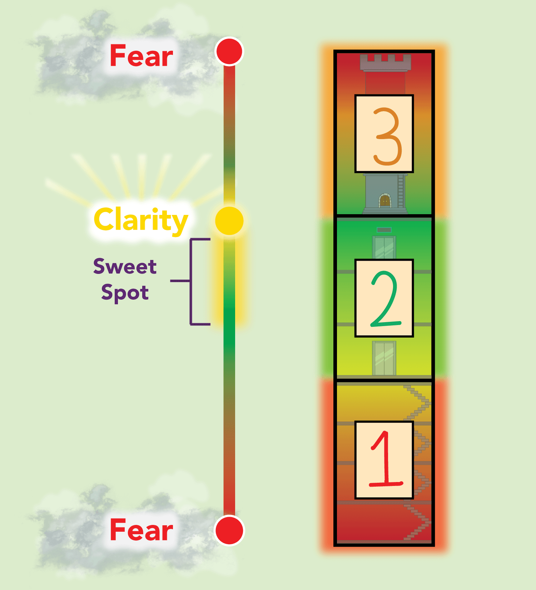](https://moretothat.com/wp-content/uploads/2020/01/K07-Full-clarity-and-fear-spectrum.png)

The Money Spectrum makes the most sense when you view it alongside this gradation of emotions. It helps you understand that money is not something you own, it’s something you have a relationship with. And just like the people you choose to have around you, it’s a bond that is shaped with intention and care.  

当你把它和这种情绪层次一起看待时，金钱光谱是最有意义的。它可以帮助你理解金钱不是你拥有的东西，而是你与之有关系的东西。就像你选择身边的人一样，这是一种用意图和关怀塑造的纽带。

Of all the things that define your place on this spectrum, the most important one is your identity. Which phase do you see yourself in the most?  

在定义你在这个光谱上的位置的所有因素中，最重要的是你的身份。你最看好自己处于哪个阶段？

If you view the world through the lens of scarcity and survival, money will only amplify that feeling of inadequacy. But if freedom is what defines you, then money will feel abundant, no matter how much you have. If power and influence is what you want, then money will drive the nature of your relationships in that direction.  

如果你用稀缺和生存的视角来看待世界，金钱只会放大这种不足的感觉。但是，如果自由是定义你的，那么无论你拥有多少，金钱都会感到丰富。如果权力和影响力是你想要的，那么金钱将推动你们关系的性质朝着这个方向发展。

Where on this spectrum do you think you are now? And where do you want to be? What’s holding you back? Is it money, or is it your mentality?  

你认为你现在在这个频谱上的什么位置？你想去哪里？是什么阻碍了你？是钱，还是你的心态？

Be honest with yourself when asking these questions. Your identity will inevitably answer them for you, but you don’t want any surprises when it does.  

在问这些问题时，要对自己诚实。你的身份不可避免地会为你回答这些问题，但当它发生时，你不希望有任何惊喜。

After all, if you don’t give money its purpose, it will end up defining yours.  

毕竟，如果你不给钱的目的，它最终会定义你的。

\_\_\_\_\_\_\_\_\_\_\_\_\_\_\_

[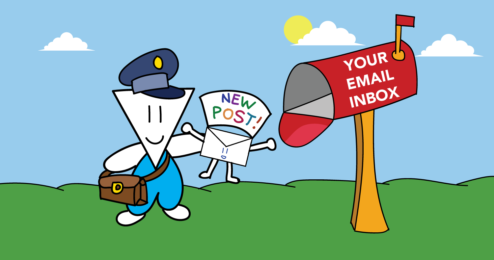](https://moretothat.com/wp-content/uploads/2019/09/Mailing-List-Blue-Sky-revised.png)

If you enjoyed this post, consider joining the More To That newsletter. You’ll be notified when a new post is up, and will get access to personal reflections that you won’t find anywhere else.

  

如果您喜欢这篇文章，请考虑加入 更多 到那篇时事通讯。当新帖子发布时，您将收到通知，并可以访问您在其他任何地方都找不到的个人反思。

As a welcome gift, I will send you a 10-page ebook called _How to Discover Great Ideas_, and a pack of colorful wallpapers for your phone.  

作为欢迎礼物，我将向您发送一本名为“如何发现好主意”的10页电子书，以及一包用于手机的彩色壁纸。

  

If you’d like to support the many hours that go into making these posts, you can do so at my [Patreon page here](https://www.patreon.com/moretothat).  

如果你想支持制作这些帖子的大量时间，你可以在我的 Patreon 页面上这样做 这里.

Thanks to Nick Maggiulli (writer of the great blog [Of Dollars and Data](https://ofdollarsanddata.com/)) for reading a draft of this post.  

感謝Nick Maggiulli（Dollar and Data博客的作者）閱讀這篇文章的草稿。

\_\_\_\_\_\_\_\_\_\_\_\_\_\_\_

### Related Posts 相关文章

**How did money take over humanity? The full story is here:  

金钱是如何接管人类的？完整的故事在这里：**

[How Money Forever Changed Us  

金钱如何永远改变我们](https://moretothat.com/how-money-forever-changed-us/)

**Money can take you all over the world, but travel won’t bring you happiness:  

金钱可以带你走遍世界，但旅行不会给你带来快乐：**

[Travel Is No Cure for the Mind  

旅行无法治愈心灵](https://moretothat.com/travel-is-no-cure-for-the-mind/)

**A reminder that money (or any other thing) won’t give you meaning either:  

提醒你，金钱（或任何其他东西）也不会给你意义：**

[The Meaning of Life Is Absurd  

生命的意义是荒谬的](https://moretothat.com/the-meaning-of-life-is-absurd/)

**But here’s a reflection that will help put everything back into perspective:**

[The Finality of Everything](https://moretothat.com/the-finality-of-everything/)
