If you are reading this article, you are most likely using a web browser, and you have some expectations or beliefs about online privacy and security. For example, I do not know what you are reading on other tabs on your web browser, and you would like to keep it that way. But the websites themselves know that you are reading a particular page on their website. They most likely know your IP address and if you are signed in to their website, they also know your identity. This is not unreasonable because you chose to identify yourself in exchange for certain services. That’s how web works.  

如果您正在阅读本文，那么您很可能使用的是网络浏览器，并且您对在线隐私和安全有一些期望或信念。例如，我不知道您在网络浏览器的其他选项卡上阅读了什么，您希望保持这种状态。但是网站本身知道您正在阅读其网站上的特定页面。他们很可能知道您的 IP 地址，如果您登录了他们的网站，他们也知道您的身份。这并非不合理，因为您选择表明自己的身份以换取某些服务。这就是网络的工作方式。

You might also be heard about cross site tracking using cookies. Cookies are persistent files set on your web browser by a website to identify you later when you visit the same site. Cross site cookies are set by third-party domains present on a website, and the same third-party might also present in other websites as well. Third party domains track you across your browsing sessions and able to identify you uniquely across different websites. That’s how you are shown ads based on your browsing history. Because the third party is usually an advertising company (cough! Google) and they are present in almost all websites. Even though it seems unethical for a third party to track your browsing history, at-least you had control. Web Browsers allows you to delete cookies, so third parties cannot link you back to your past sessions. This is what Private Browsing does. It basically wipes all cookies (and history) upon closing the window.  

您可能还听说过使用 Cookie 进行跨网站跟踪。Cookie 是由网站在您的网络浏览器上设置的持久文件，用于在您以后访问同一网站时识别您的身份。跨站点 Cookie 由网站上存在的第三方域设置，同一第三方也可能出现在其他网站中。第三方域在您的浏览会话中跟踪您，并能够在不同的网站上唯一地识别您。这就是根据您的浏览历史记录向您显示广告的方式。因为第三方通常是一家广告公司（咳！谷歌），它们几乎存在于所有网站中。尽管第三方跟踪您的浏览历史记录似乎不道德，但至少您可以控制。网络浏览器允许您删除 Cookie，因此第三方无法将您链接回过去的会话。这就是隐私浏览的作用。它基本上在关闭窗口时擦除所有cookie（和历史记录）。

Browsers like Firefox now ships with advanced protection against this kind of tracking. They isolate third party cookies per website. This means advertisers or third-parties cannot track you across different websites. This affects advertisement companies revenue because they cannot know your full browsing activity and hence cannot show you personalized ads.  

像Firefox这样的浏览器现在附带了针对这种跟踪的高级保护。它们为每个网站隔离第三方 Cookie。这意味着广告商或第三方无法跨不同的网站跟踪您。这会影响广告公司的收入，因为他们无法了解您的完整浏览活动，因此无法向您展示个性化广告。

Based on your threat model, even being identified by a first party website across different sessions might be uncomfortable for you. So you might set your web browser to automatically clear cookies or use add-ons to do that.  

根据您的威胁模型，即使被第一方网站跨不同会话识别也可能让您感到不舒服。因此，您可以将网络浏览器设置为自动清除 cookie 或使用附加组件来执行此操作。

But companies found another way to uniquely identify you across different sessions and websites without using cookies or other persistent storage. It’s called web fingerprinting. Fingerprinting is a more sophisticated approach to identify a user among millions of others. It works by studying your web browser and hardware configuration. Many websites use a fingerprinting library to generate a unique ID. This library collects data from multiple JavaScript APIs offered by your web browser. For example, websites can see web browser version, number of CPUs on your device, screen size, number of touchpoints, video/audio codecs, operating system and many other details that you would not want a typical news website to see.  

但是公司找到了另一种方法，可以在不使用cookie或其他持久存储的情况下跨不同的会话和网站唯一地识别您。它被称为网络指纹。指纹识别是一种更复杂的方法，用于在数百万其他用户中识别用户。它通过研究您的 Web 浏览器和硬件配置来工作。许多网站使用指纹库来生成唯一的 ID。此库从您的 Web 浏览器提供的多个 JavaScript API 收集数据。例如，网站可以看到网络浏览器版本、设备上的 CPU 数量、屏幕尺寸、接触点数量、视频/音频编解码器、操作系统以及您不希望典型新闻网站看到的许多其他详细信息。

All of these values are combined to generate a unique ID. Surprisingly, each user’s device and browser specifications differ so much that they get a unique ID among millions.  

所有这些值组合在一起以生成唯一的 ID。 令人惊讶的是，每个用户的设备和浏览器规格差异如此之大，以至于他们在数百万用户中获得了唯一的 ID。

I did not think web fingerprinting is serious until I came across a company which is actually selling fingerprinting as a service to other websites. I tried their demo and shocked how accurate it is. Many ecommerce websites use it because these fingerprinting companies sell it, saying it prevents credit card frauds and increases security of the websites.  

我不认为网络指纹识别是严重的，直到我遇到一家公司实际上将指纹作为服务出售给其他网站。我尝试了他们的演示，并震惊于它的准确性。许多电子商务网站使用它，因为这些指纹公司出售它，称它可以防止信用卡欺诈并提高网站的安全性。

If you are paranoid like me and use private browsers like Firefox Focus or always clearing cookies when you close the browser, it doesn’t really help to protect your privacy. Web Browsers and Web Standards become so complicated that fingerprinting is easier than you think.  

如果您像我一样偏执，并且使用Firefox Focus等私人浏览器，或者在关闭浏览器时始终清除cookie，那么保护您的隐私并没有真正的帮助。Web 浏览器和 Web 标准变得如此复杂，以至于指纹识别比您想象的要容易。

## Fingerprinting as a Service  

指纹即服务

We are going to test a product built by a company called FingerprintJS Inc. who is selling fingerprinting as a service. They make JavaScript fingerprinting libraries which are in fact open source and sell it to many websites. There’s FingerprintJS Pro which is an even scarier version of regular fingerprinting library. It doesn’t matter if you are using a VPN or Private Browsing mode, they can accurately identify you. Here’s how they are describing themselves, **“The device identity platform for high-scale applications”.**  

我们将测试由一家名为FingerprintJS Inc.的公司构建的产品，该公司将指纹作为服务销售。他们制作JavaScript指纹库，实际上是开源的，并将其出售给许多网站。有FingerprintJS Pro，这是常规指纹库的更可怕的版本。无论您使用的是VPN还是隐私浏览模式，它们都可以准确识别您。以下是他们对自己的描述，“用于大规模应用程序的设备标识平台”。

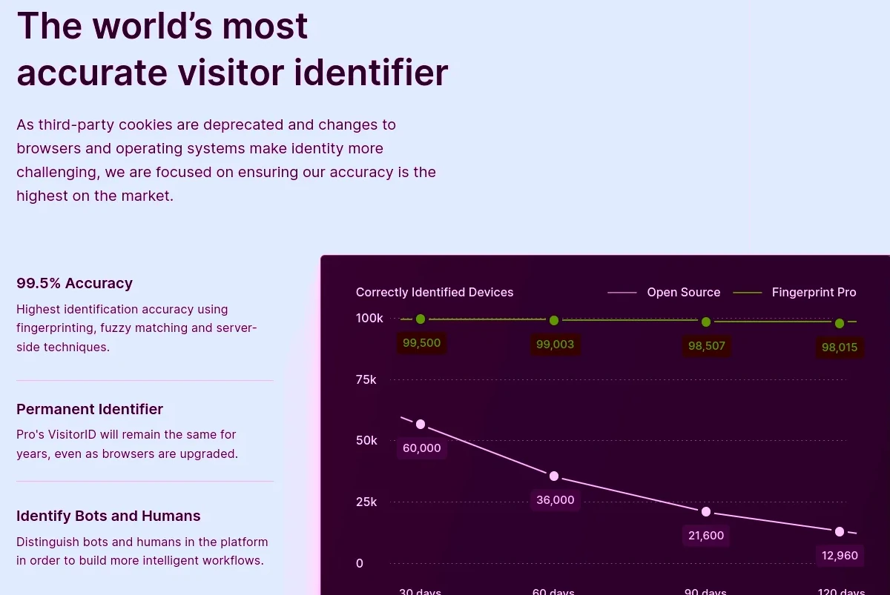

FingerprintJS has a demo built into it’s homepage, [https://fingerprint.com](https://fingerprint.com/). When you visit this website, they generate a visitor ID (fingerprint) which is unique for your browser. So even if you clear the cache (and other site data) or visit the site in Private Browsing mode, they can generate the same ID and correlate with your previous visit.  

FingerprintJS在其主页上内置了一个演示，https://fingerprint.com。当您访问本网站时，他们会生成一个访问者ID（指纹），该ID（指纹）对于您的浏览器是唯一的。因此，即使您清除缓存（和其他网站数据）或在无痕浏览模式下访问网站，它们也可以生成相同的 ID 并与您之前的访问相关联。

## My tests on popular web browsers  

我在流行的网络浏览器上的测试

Now we are going to perform the following steps to prove that fingerprinting works and severely undermines our privacy.  

现在我们将执行以下步骤来证明指纹识别有效并严重破坏了我们的隐私。

**Step 1:** Visit [https://fingerprint.com](https://fingerprint.com/)  

第 1 步：访问 https://fingerprint.com

**Step 2:** View the fingerprint generated.  

第 2 步：查看生成的指纹。

**Step 3:** Clear browser cache and all other site data.  

步骤3：清除浏览器缓存和所有其他站点数据。

**Step 4:** Visit [https://fingerprint.com](https://fingerprint.com/) once again.  

第 4 步：再次访问 https://fingerprint.com。

**Step 5:** View the fingerprint and also the previous visit history. Even if the browser has no cookies or other site data, their product can generate the same visitor ID and link it back to our previous visit.  

步骤5：查看指纹以及以前的访问历史记录。即使浏览器没有 cookie 或其他网站数据，他们的产品也可以生成相同的访问者 ID 并将其链接回我们之前的访问。

**Step 6:** Clear browser cache and all other site data.  

步骤6：清除浏览器缓存和所有其他站点数据。

**Step 7:** Visit [https://fingerprint.com](https://fingerprint.com/) in Private Browsing mode.  

步骤7：在隐私浏览模式下访问 https://fingerprint.com。

**Step 8:** View the fingerprint and see how it is being correlated to the previous two visits we already made. Yes, in Private Browsing mode.  

步骤8：查看指纹，看看它如何与我们已经进行的前两次访问相关联。是，在无痕浏览模式下。

We are going to perform these tests on Firefox, Chromium, and Tor Browser.  

我们将在Firefox，Chromium和Tor浏览器上执行这些测试。

### Firefox 火狐

  
| Visit 1 访问 1 | Visit 2 访问 2 | Private Browsing 隐私浏览 |
| --- | --- | --- |
| [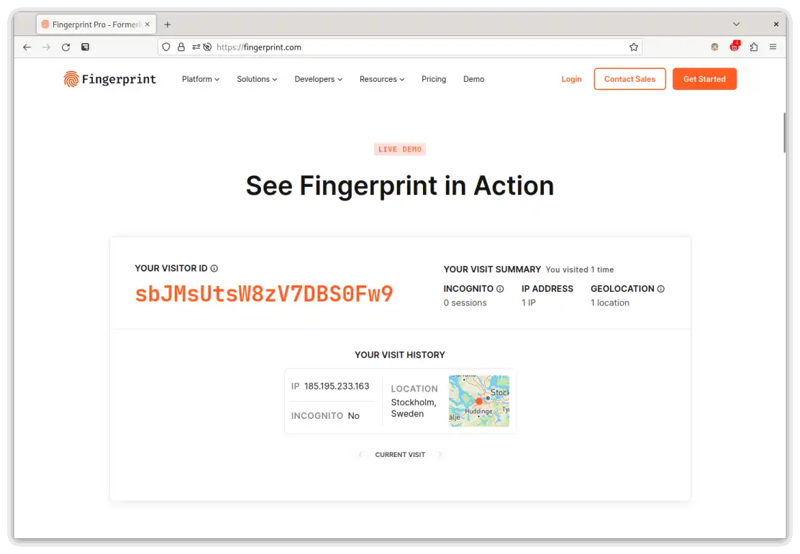](https://www.bitestring.com/images/2023-03-19-fingerprinting/firefox_visit_1.webp) | [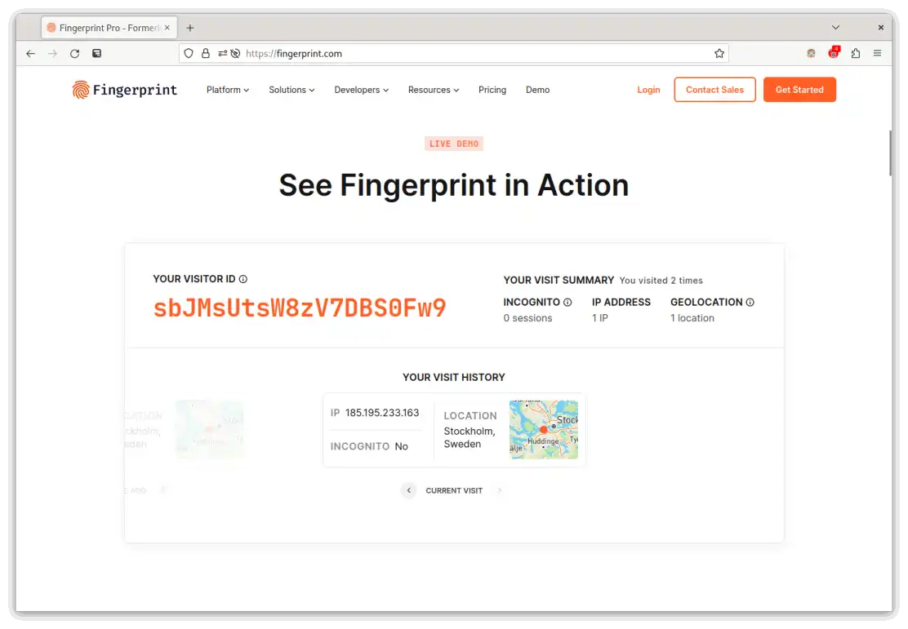](https://www.bitestring.com/images/2023-03-19-fingerprinting/firefox_visit_2.webp) | [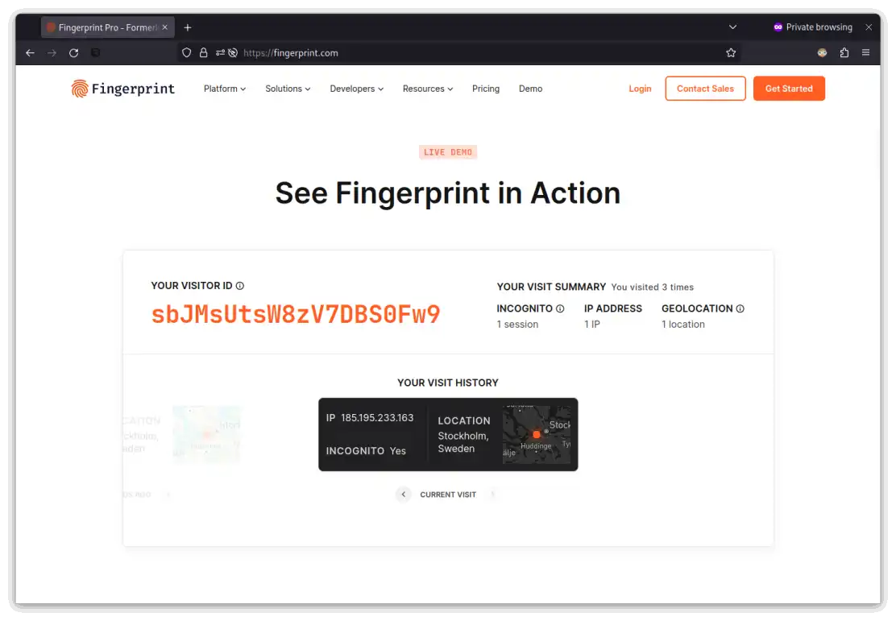](https://www.bitestring.com/images/2023-03-19-fingerprinting/firefox_visit_private_mode.webp) |

Notice how different sessions are connected by the same fingerprint generated by FingerprintJS. Firefox in its default configuration is prone to fingerprinting.  

请注意不同的会话是如何通过 FingerprintJS 生成的同一指纹连接的。默认配置中的 Firefox 容易出现指纹识别。

### Firefox with privacy.resistFingerprinting = true  

Firefox with privacy.resistFingerprinting = true

Firefox has a setting called resistFingerprinting (initially contributed by The Tor Project) that makes it more resistance to fingerprinting. When activated, Firefox tries to mask certain properties like User Agent, CPU Count, Timezone, Screen Resolution etc. uniform for all users. This makes it harder for fingerprinting.  

Firefox 有一个名为 resistFingerprinting 的设置（最初由 Tor 项目提供），这使得它更能抵抗指纹识别。激活后，Firefox 会尝试屏蔽所有用户统一的某些属性，如用户代理、CPU 计数、时区、屏幕分辨率等。这使得指纹识别更加困难。

You can enable it by visiting `about:config` and setting `privacy.resistFingerprinting = true` in your Firefox browser.  

您可以通过访问 `about:config` 并在Firefox浏览器中进行设置 `privacy.resistFingerprinting = true` 来启用它。

  
| Visit 1 访问 1 | Visit 2 访问 2 | Private Browsing 隐私浏览 |
| --- | --- | --- |
| [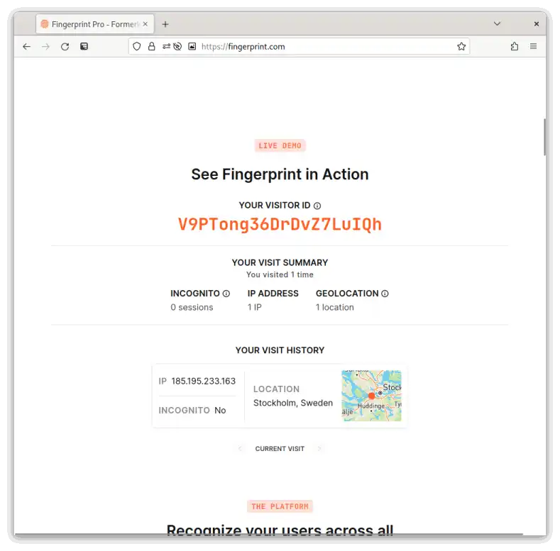](https://www.bitestring.com/images/2023-03-19-fingerprinting/firefox_resistfingerprinting_visit_1.webp) | [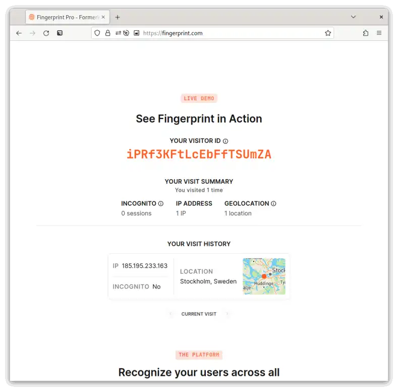](https://www.bitestring.com/images/2023-03-19-fingerprinting/firefox_resistfingerprinting_visit_2.webp) | [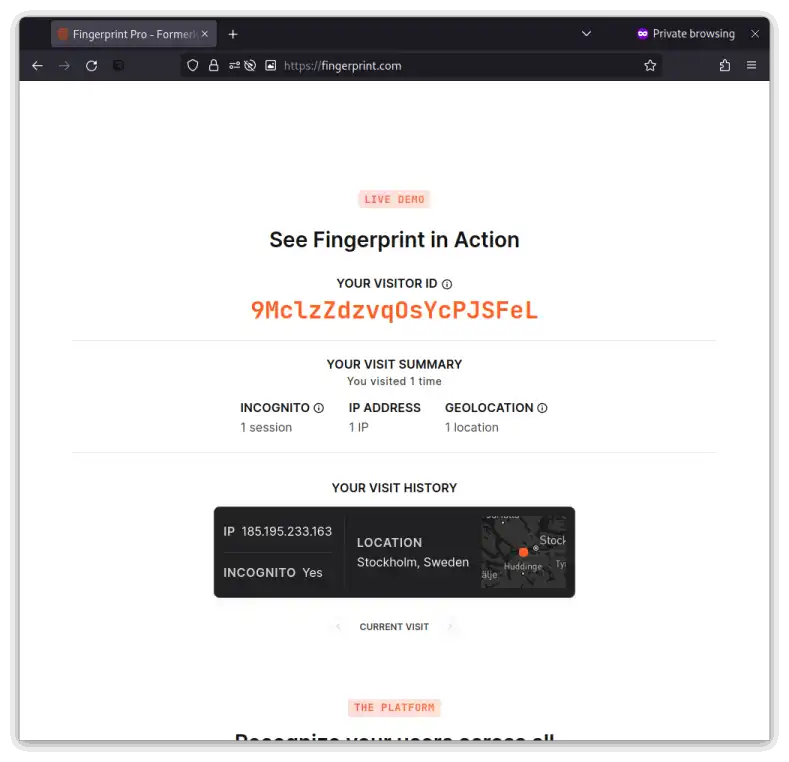](https://www.bitestring.com/images/2023-03-19-fingerprinting/firefox_resistfingerprinting_visit_private_mode.webp) |

This time, FingerprintJS could not link it with previous sessions. Each session gets a unique ID since Firefox hardens certain APIs against fingerprinting.  

这一次，FingerprintJS无法将其与以前的会话链接。每个会话都会获得一个唯一的 ID，因为 Firefox 会针对指纹识别强化某些 API。

### Chromium / Chrome 铬/铬

Chromium (Chrome) is built by Google, an advertisement company which tracks its users for showing relevant ads. So naturally it doesn’t have any inbuilt protection against fingerprinting. Chromium (and Google Chrome) is vulnerable to fingerprinting.  

Chromium（Chrome）由谷歌构建，谷歌是一家广告公司，跟踪其用户以显示相关广告。因此，它自然没有任何针对指纹的内置保护。Chromium（和Google Chrome）容易受到指纹识别的影响。

  
| Visit 1 访问 1 | Visit 2 访问 2 | Private Browsing 隐私浏览 |
| --- | --- | --- |
| [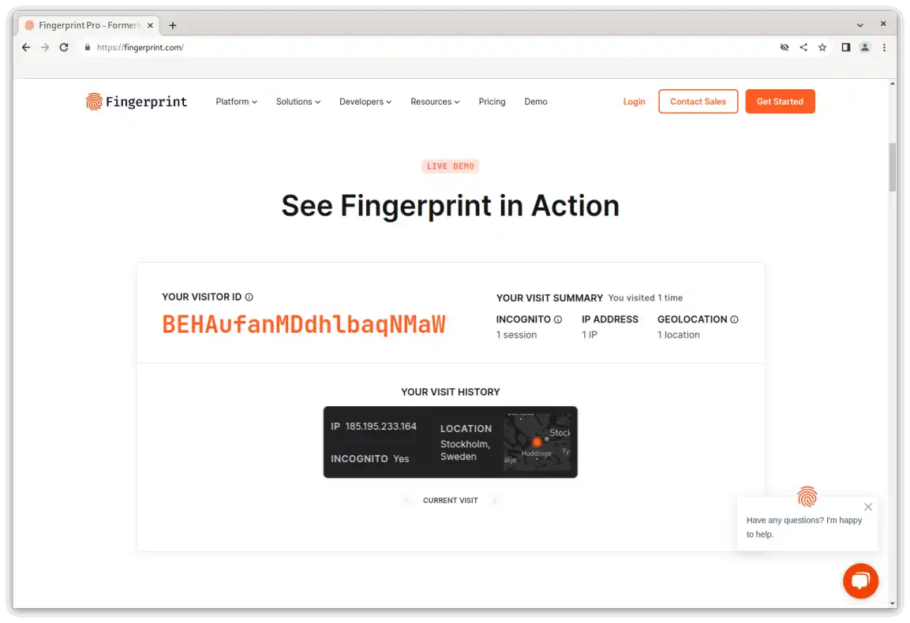](https://www.bitestring.com/images/2023-03-19-fingerprinting/chromium_visit_1.webp) | [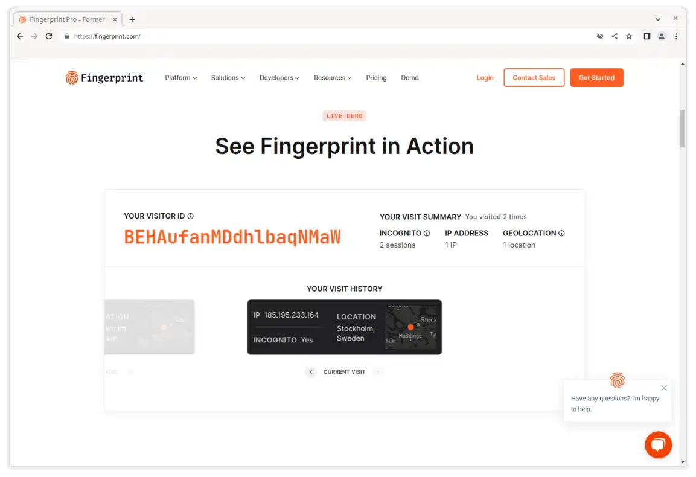](https://www.bitestring.com/images/2023-03-19-fingerprinting/chromium_visit_2.webp) | [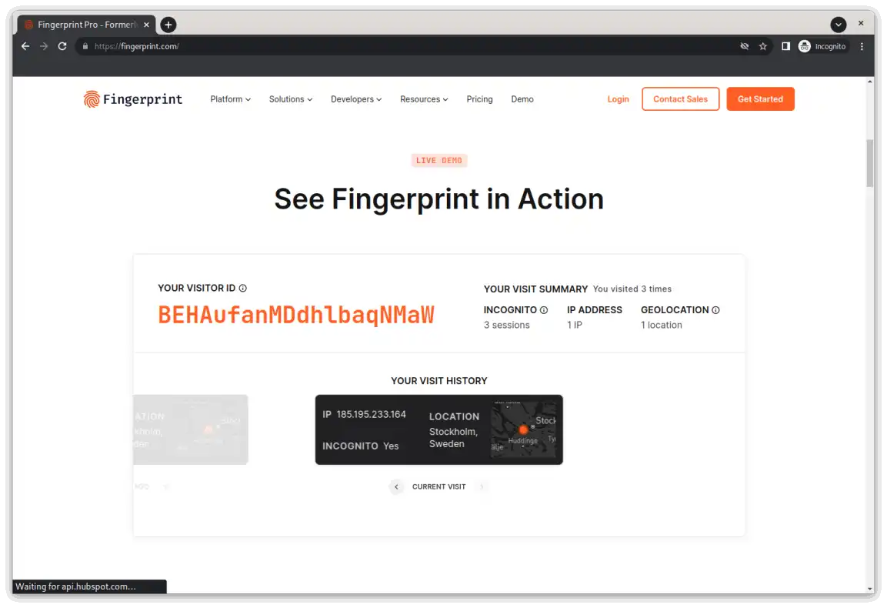](https://www.bitestring.com/images/2023-03-19-fingerprinting/chromium_visit_private_mode.webp) |

FingerprintJS generates the same ID in each Chromium session, thus it can identify its users across different sessions.  

FingerprintJS在每个Chromium会话中生成相同的ID，因此它可以在不同的会话中识别其用户。

### Tor Browser Tor 浏览器

Tor Browser is made by [The Tor Project](https://www.torproject.org/), a non-profit organization. Tor Browser routes internet traffic through multiple relays across the world, thus making user’s browsing sessions more private. It is based on Firefox and many features of Tor Browser has been incorporated back in Firefox.  

Tor 浏览器由非营利组织 Tor Project 制作。Tor 浏览器通过世界各地的多个中继路由互联网流量，从而使用户的浏览会话更加私密。它基于Firefox，Tor浏览器的许多功能已经合并到Firefox中。

  
| Visit 1 访问 1 | Visit 2 访问 2 |  |
| --- | --- | --- |
| [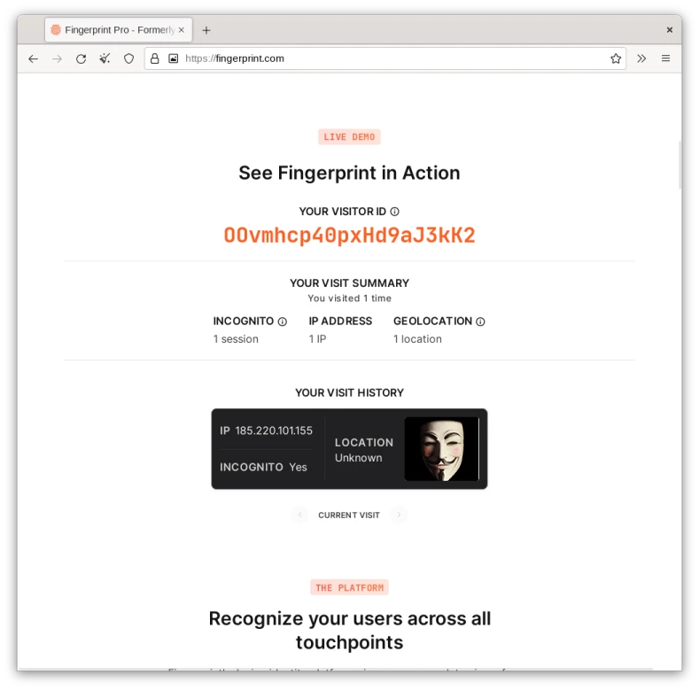](https://www.bitestring.com/images/2023-03-19-fingerprinting/torbrowser_visit_1.webp) | [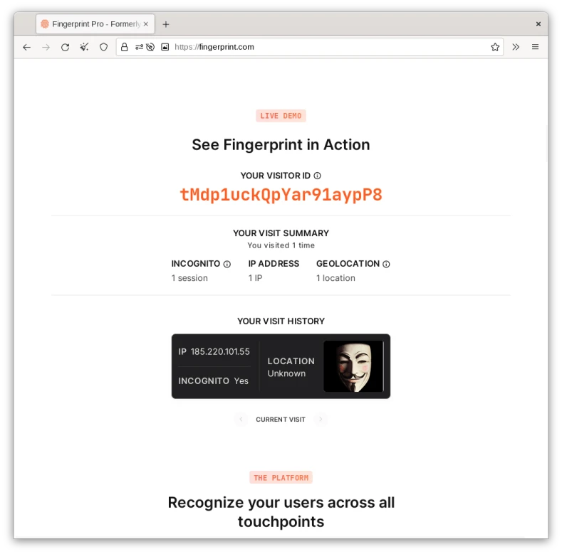](https://www.bitestring.com/images/2023-03-19-fingerprinting/torbrowser_visit_2.webp) |  |

> Please note that Tor Browser always operates in Private Browsing mode. So I did not test it under Private Browsing explicitly.  
> 
> 请注意，Tor 浏览器始终以隐私浏览模式运行。所以我没有在隐私浏览下明确测试它。

FingerprintJS could not link two different Tor Browser sessions by the same user. So Tor Browser is more secure against fingerprinting.  

FingerprintJS无法链接同一用户的两个不同的Tor浏览器会话。所以 Tor 浏览器对指纹识别更安全。

## Conclusion 结论

Fingerprinting has become a popular method of user tracking due to its ability to connect multiple different browsing sessions even if the user clears browsing history and data. Given there are companies selling fingerprinting as a service, if you want to really protect yourself from fingerprinting, you should use Tor Browser or Firefox with `resistFingerprinting=true`. If you need to use Chromium, then Brave browser is a good choice. It also randomizes fingerprint for each session, making it harder to link your browsing sessions. However, I do not recommend Brave because it is based on Google’s Chromium engine, thus only encourages Google’s monopoly.  

指纹识别已成为一种流行的用户跟踪方法，因为它能够连接多个不同的浏览会话，即使用户清除浏览历史记录和数据也是如此。鉴于有些公司将指纹识别作为一项服务出售，如果您想真正保护自己免受指纹识别，您应该使用 Tor 浏览器或 Firefox 与 `resistFingerprinting=true` .如果您需要使用 Chromium，那么 Brave 浏览器是一个不错的选择。它还随机化每个会话的指纹，使链接浏览会话变得更加困难。但是，我不推荐 Brave，因为它是基于 Google 的 Chromium 引擎，因此只会鼓励 Google 的垄断。

On mobile, only Tor Browser and Firefox with `resistFingerprinting=true` were able to protect against fingerprinting. Firefox Focus leaks fingerprints even if you clear its session each time. Also note that VPNs does not help with fingerprinting. They only masks IP address.  

在移动设备上，只有Tor浏览器和Firefox `resistFingerprinting=true` 能够防止指纹识别。Firefox Focus 会泄露指纹，即使您每次都清除其会话。另请注意，VPN 对指纹识别没有帮助。它们只屏蔽 IP 地址。
