昨天写了《尚气》（《[观察三则：蔡省长的“论文门”、EDG夺冠后续以及应该抵制《尚气》吗？》](http://mp.weixin.qq.com/s?__biz=MzIzMjI3MzM1Mg==&mid=2650631771&idx=2&sn=d625a1abf9f7eab3c47b786da4cf8eca&chksm=f09eaafcc7e923eaadf924ee3dfa94549618bcc61db3ba9f756b5c289212b0253f46b75c3e67&scene=21#wechat_redirect)），后面跟一些朋友讨论，谈得很有意思，觉得可以再写一点，于是便有了下面这篇文章。

这篇文章是基于我本人的看电影电视的经验，**谈谈好莱坞政治宣传能力的强大，谈谈我观察到的中美在镜头背后的暗斗和角力**。  

**首先先确定一点，好莱坞不只是高技术高水准的娱乐文化产业基地，也是美帝国重要的政治宣传工具。**

我拿《拯救大兵瑞恩》和《阿甘正传》来举例。这两部电影脍炙人口，因为它们的技术水平高，某种程度上艺术价值也高，而且表达的主题基本上属于描绘人性光辉这种不会错的类型。但是如果多挖一层，会有许多有趣的发现。

比如《拯救大兵瑞恩》，电影开头说是基于真实故事改编。那么这个真实故事到底是怎样的呢？改编又改了多少，改到了什么程度呢？

相关资料其实非常好查，内网外网分析一大堆，英文源中文源都有好多。看了一圈下来，基本上情况是这样的：1）电影里的很多历史事件和场景，比如诺曼底登陆，确实是真实发生的；2）二战时确实有一个叫Frederick ‘Fritz’ Niland的中士，因为他两个哥哥战死、一个哥哥被讹传为死亡，所以他本人得以从战场回家。  

真实的部分差不多这些，剩下的都是演义。电影里是一个英勇的小队以牺牲自己为代价，拯救了大兵瑞恩，瑞恩本人开始还不领情，要坚持战斗。但是实际历史中，负责寻找瑞恩的是一个军队牧师Fr. Francis Sampson。寻找的过程也没有电影描写的那么戏剧化，大概是Fritz路过兄弟的部队驻地，进去找哥哥，结果发现人没了，然后得到自己回家的通知。在回不回家这个问题上，Fritz也没多少犹豫，乖乖收拾行李就退役了。

一个有意思的点是不管国内还是国外的网友，在聊到《拯救大兵瑞恩》的时候，很喜欢带上巴顿将军。是的，就是那个肝火旺盛的“杂种”巴顿。

为什么扯上他呢？因为他在二战中干过这么一件事：1945年的3月，在攻入德国之后，他派了一支300多人组成的特遣队，去哈默尔堡的一个战俘营救战俘。这起救援任务最后失败了，但失败不是重点，重点在别处：第一，特遣队死伤惨重，死了三十多个，剩下全部被俘；第二，特遣队一开始的目的也不是去救所有战俘，而是只救军官，一些士兵战俘，坚持要跟着逃离，他们只能跟在特遣队车后面跑，后来遭到德军伏击时，他们也是死伤最惨重的那部分人；第三，巴顿本人的女婿John K. Waters就是战俘营里的军官战俘之一。  

**一个是虚构的“拯救大兵瑞恩”，一个是真实的“拯救巴顿将军的女婿军官沃特斯”；一个成功，一个失败；一个散发着崇高的美式英雄主义光辉，一个蕴含着猥琐的裙带关系和差别对待算计，对比太强烈了，也难怪有人喜欢拿它们对比。**  

不管是锁定虚构成分还是对比真实历史，《拯救大兵瑞恩》的政治宣传属性，已经非常明显了。

谈完了《拯救大兵瑞恩》，我们再来看看《阿甘正传》。对《阿甘正传》有一句非常恰当的总体评价：**美式****保守主义的拳头产品**。男女主人公，**阿甘是右翼保守主义价值观的具象，珍妮是左翼自由主义价值观的具象，对他们的性格设定、结局设定，迎合了上世纪九十年代初美国社会的氛围。  

**

但我们先不摊开来谈，先抓一个点：有智力缺陷的阿甘从军报国，在越战立功的桥段。就像带着理性的观众看《拯救大兵瑞恩》时会问“在战场上牺牲一群人救一个人合理吗”一样，《阿甘正传》的观众也会质疑，送智力缺陷者上战场合理吗？人道吗？他还立了功被上司称为“天才”，可能吗？  

真实的历史是这样的：美国卷入越战后，每个月都要送大量的青壮年去东南亚丛林，然后传回来巨大的伤亡数字，美国国内的反战声音越来越大。在肯特州立大学惨案中，军警甚至射杀了4位参加反战示威的学生。  

反战运动带来的最直接影响就是兵源不足。于是当时的国防部长麦克纳马拉想出了一个“天才”的点子——**“十万人计划”**，即放松入伍标准，征兆包括智力残障人士在内的身体和心理素质原不达标的青年参军。按照美国国防部的说法，此举解决兵源难题，同时解决社会问题，还“帮扶弱势群体”，一举三得。

有一本书叫《麦克纳马拉的傻子》，专门讲的就是这段美国黑历史。Quara上对于这本书的讨论也不少，有趣的是有不少当事人现身说法，他们分成两派，支持者说：我是当事人，是的，这事是真的，太黑暗了。反对者说：我是当事人，是的，这事是真的，但是智力残障人士的比例没有书里说的那么高。  

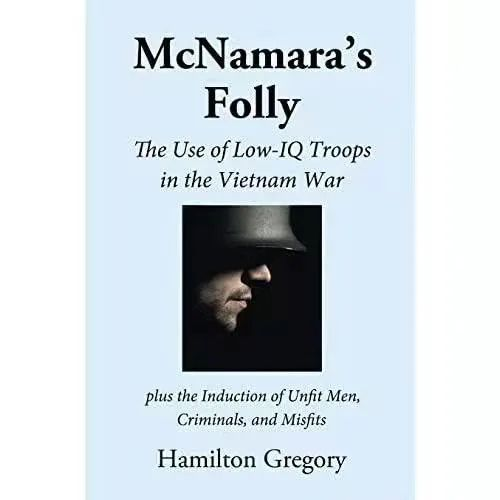

**了解了“麦克纳马拉的傻子”再回头看“天才士兵阿甘”，感觉是不是怪怪的，是不是感觉生活就像盒子里的巧克力，你永远不知道它到底是一块真的巧克力，还是一块装作巧克力的屎？**

看好莱坞的电影是不能太抠历史现实的，太较真的话那些精彩的大场面没有一个看上去不像花言巧语。不过换个角度想，**破解这些花言巧语，也不失为一种乐趣。**

好了，说到这里，好莱坞是美帝国政治宣传工具（是外宣工具也是内宣工具）这一点，相信没什么疑问了，我们接着来说下一个问题：**作为政治宣传的工具，是不是要承担起宣扬自己、抹黑敌人的任务呢？答案当然是肯定的。**

**这方面最好的例子是俄罗斯。**不要看毛熊各个方面都很彪悍，在影视剧方面，真的被美国黑的没脾气，好莱坞黑俄罗斯已经成了一种本能了。

拿前阵子上映的《007：无暇赴死》来举例，不知道有没有朋友注意到，大Boss盘踞的那个毒品岛，在设定里是苏联导弹基地改的，墙上是俄文以及苏联宣传壁画。还有那个造DNA武器、面对黑人007妹子威胁要杀光黑人的脑袋不灵光疯狂科学家奥布诺切夫，这是个俄国姓。

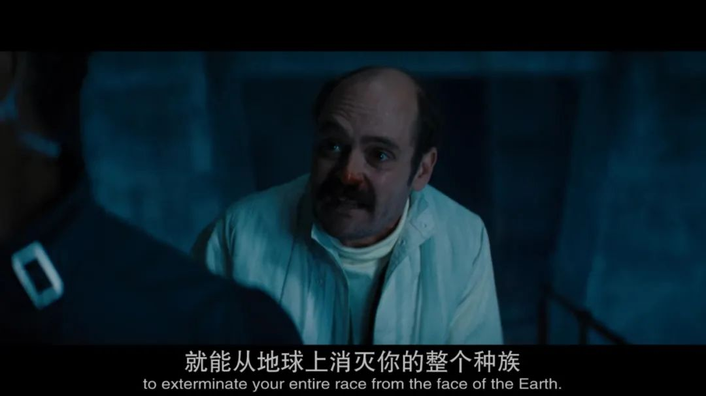

随风潜入夜，润物细无声，从俄国黑帮到俄裔恐怖分子，“俄罗斯元素”已经成了好莱坞的标配。我以前认识几个俄罗斯朋友，聊到美国电影的时候，他们是很有意见的，他们说美国人拍什么都要cue俄罗斯，连科幻片里都要安排个俄罗斯反派。

美国电影黑俄罗斯的例子太多了，老实说我举不过来，如果只举一部的话，我会提一个非常精巧、很多人注意不到的例子——2012年风靡过一阵的动画片《马达加斯加3》，这部动画片讲几个纽约出身的动物在一个欧洲巡回马戏团里的冒险故事。有人可能会问这部合家欢的电影里也藏着美帝国的政治宣传吗？答案是是的，藏着呢。  

《马达加斯加3》的剧情是欧洲巡回马戏团半死不活，最后由主人公狮子力挽狂澜，重获新生。问题出在口音上。扮演救世主的狮子是美国口音这一点不用说了，而马戏团的原班主、能力欠佳却总跟狮子作对的老虎，你猜他是哪国口音？是的，俄罗斯。还有一个马戏团里的当家花旦豹子，最后爱上了狮子，你猜她是哪里的口音？更有趣，跟老虎还略有区别，似乎偏东欧一点。什么叫植入？这就叫植入。什么叫洗脑，这就叫洗脑。**宣传从娃娃抓起，在好莱坞这可不是一句玩笑。**  

在了解了美帝国是真的会用好莱坞这个政治宣传工具攻击敌人、而且干起这事来还很轻车熟路之后，我们可以进入第三个问题了：**美国现在在用这招对付中国吗？**

我问的是“现在在对付”，而不是“对付过”，因为对付过肯定是对付过的，但现在中国是好莱坞的第二大市场，他们还会干这事吗？有些朋友应该记得我们之前提过，不管是《经济学人》还是《好莱坞报道（The Hollywood Reporter）》，都专门撰文写过美国政客对好莱坞的抨击，说好莱坞“屈从于中国票房之下”。看上去好莱坞的响应性并没有能让美国的政坛满意。  

但好莱坞并不是没有响应。在举好莱坞的例子之前，我先举个美国电视剧的例子。2018年有一部以CIA特工为主人公的美剧《秃鹰》，目前出了两季。第一季的反派是CIA内部的坏分子，第二季的反派是俄国间谍，猜猜第三季的反派会是谁？其实不用猜，在第二季结束的时候，剧情明示了：第三季会拍CIA在非洲大战中国特工。非洲，中国，特工，要素是不是集全了？这个例子是想说明，**在不挣中国钱的地方，美国影视工业跟着华盛顿指挥棒转的速度并不慢。**

说完电视剧再来看电影，上个月奈飞有一部不在中国上映的网络大电影《红色通缉令》，主演是“巨石”强森、“神奇女侠”盖尔·加朵和“小贱贱”瑞安·雷诺兹。

这片子剧情稀碎，纯粹的爆米花电影，但在流媒体上点击量非常大，创造了奈飞历史上最好的首日收视成绩。片子里黑俄罗斯属于传统艺能，没什么好说的，我要说的是这片子到快结尾的时候，有一个解放军一闪而过的镜头。这部电影对俄罗斯的设定是“世界上最糟糕的监狱运营者”，说俄罗斯某监狱是“世界上最糟糕的监狱”，到了快结束了，突然又说“只有一个监狱比俄罗斯监狱还糟糕”，然后镜头一转，一名扮演解放军的演员出现。  

《红色通缉令》不在中国上映，美国人操作起来就肆无忌惮，这很能说明问题。最让人恶心的地方在于美国黑中国监狱，主要是基于谣言。在真实世界，要说到世界上最糟糕的监狱，恐怕最应该上榜的应该是美军虐囚的关塔那摩监狱。

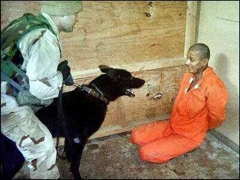

其实美国国内面向普通人的监狱也很有竞争力。美国的囚犯数量和占总人口中的比例、美国私营监狱的遍地开花、监狱生意里的腐败、强迫劳动、虐待和冤案，都算是一绝。这方面有一本书，《美国监狱：美国资本和权力的游戏》，有兴趣的朋友可以看一看，看完会感觉打开了新世界，魔幻世界，而且美国这问题好像还没得改，有点积重难返的意思，会继续糟糕下去。  

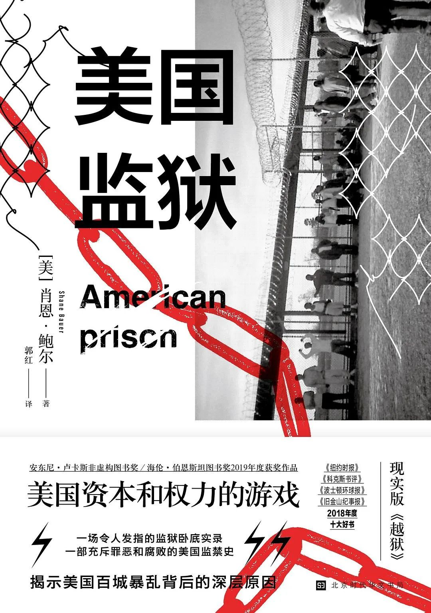

话扯得有点远了，举《红色通缉令》做例子其实主要还是为了说明，**美国影视剧行业操弄舆论的能力是很强的、跟着政治指挥棒转的行动力也是不弱的，作为宣传机器的好莱坞是不容小觑的，它对中国的敌意，在那些不需要赚你的钱的地方，已经展露无余。**  

那么来到最后一个问题，**显然在文化战场中，目前我们是处于弱势地位的，那是不是代表我们就毫无办法呢？也不是，打仗嘛，弱有弱的打法。**

我举一个例子，去年有一部拍武汉抗疫的纪录片《76天》，这片子出来以后，在国内网上被一些人骂，骂的点大致有两个：第一，导演是美籍华人，过去还有过“公知”言论，“屁股估计是歪的”；第二，电影获得了福特基金会的支持，福特基金会的工作中有一块是干嘛的，大家都懂。前一阵子曝出来的中南屋那个专门在境外发反华小作文的合作伙伴，其官网上也注明了是福特基金会赞助。  

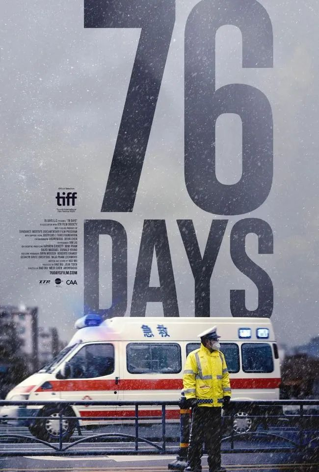  

一朝被蛇咬，十年怕井绳，骂的人有顾忌，我能理解，但看完了纪录片，我却觉得这是一次**很绝的反击**。为什么这么说呢？因为去年我几乎把英美媒体关于中国疫情的所有报道都看了一遍，在我看来，**《76天》充满了细节，而这些细节全是针对的英美的偏见。**

比方说武汉疫情中最有名且有害的意象是什么？是圆圆老师的“殡仪馆内的满地无主手机”，这个自我感动式的、反防疫常识的意象，在很长一段时间内是风暴的中心，是中外媒体追逐的对象。《76天》里怎么回应的？它描写了一个细心将死者手机等遗物消毒、登记、保管最后归还给亲属的护士长。毫无疑问，这个来自第一线的影像资料，比死不认错的“坐家”的笔，要更符合常识和逻辑，更有说服力，更尊重求真的精神，更要脸。

  

字幕还cue了华为荣耀手机。

又比方说，在疫情中像《纽约客》的何伟等撰文嘲讽戴口罩的作用，还自以为是地引经据典，拿加缪的《鼠疫》说口罩无用，中国人戴口罩就像对着“护身符”祈福；嘲讽居委会是管控人权的基层组织；嘲讽说火神山的工人师傅们之所以冒死建医院，是“有钱能使鬼推磨”；暗戳戳妖魔化疫情中值勤的警察。（《[何伟式“外国友人”，多一点好，还是少一点好](http://mp.weixin.qq.com/s?__biz=MzIzMjI3MzM1Mg==&mid=2650629847&idx=1&sn=68fee3cdc235e6177524de709a801ca6&chksm=f09ea270c7e92b66e55d0ef755741fe6fe5346c07776fe549683a02abde950d20d549d99d5f5&scene=21#wechat_redirect)》）对这些，《76天》是怎么回应的？

《76天》给出了这些镜头：  

居委会给隔离中的居民配送食品。  

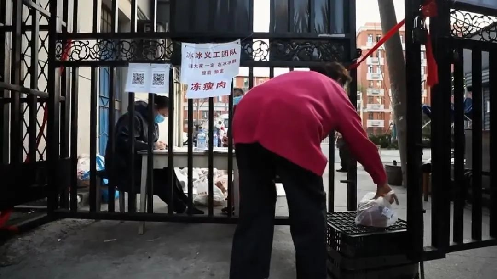  

警察在大街上冒雪值勤。  

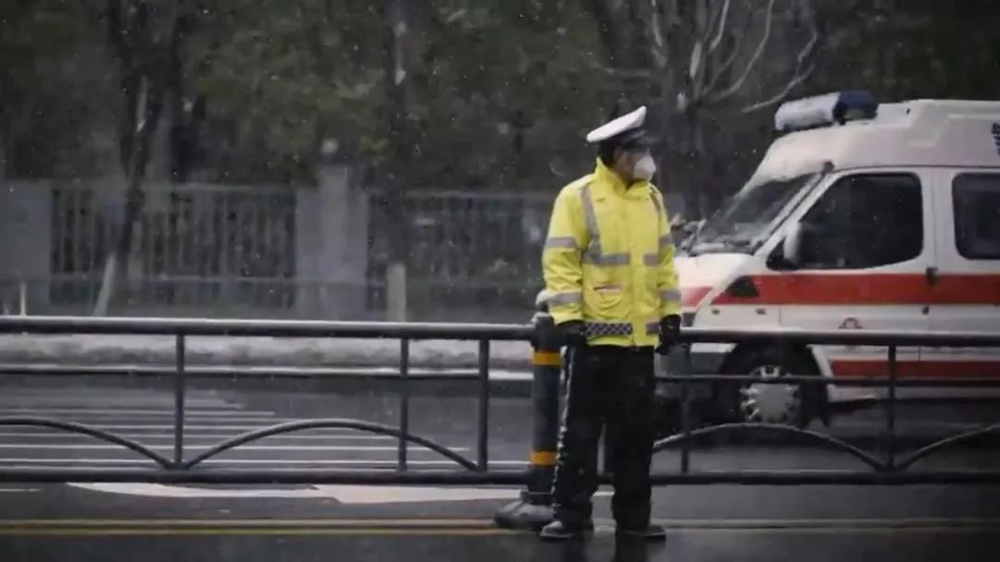  

连雕塑都戴口罩。

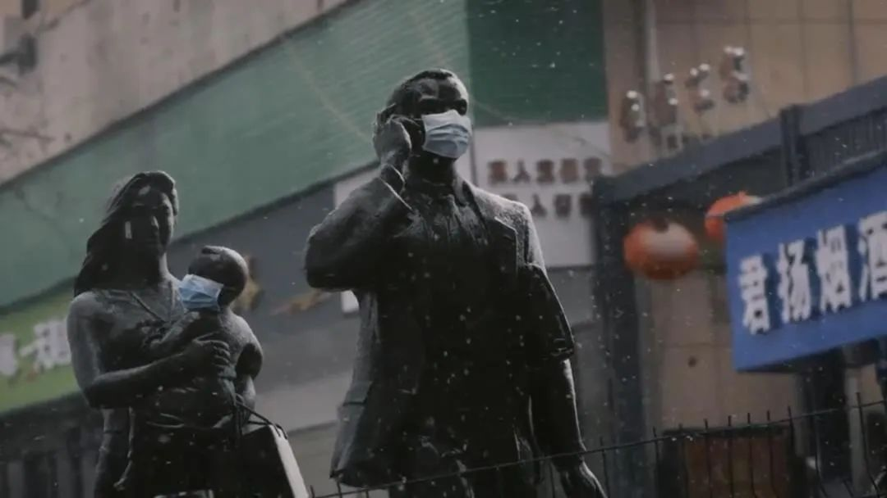

西方不是不讲集体主义吗？那来两个表现“一方有难、八方支援”的镜头。

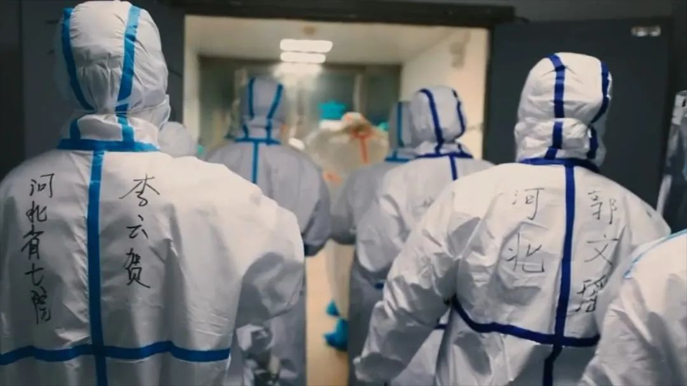  

看防护服背后的字。

听说西方死伤最惨重的地方是养老院？好，那就多拍几个中国老人获救和得到悉心救治的故事。  

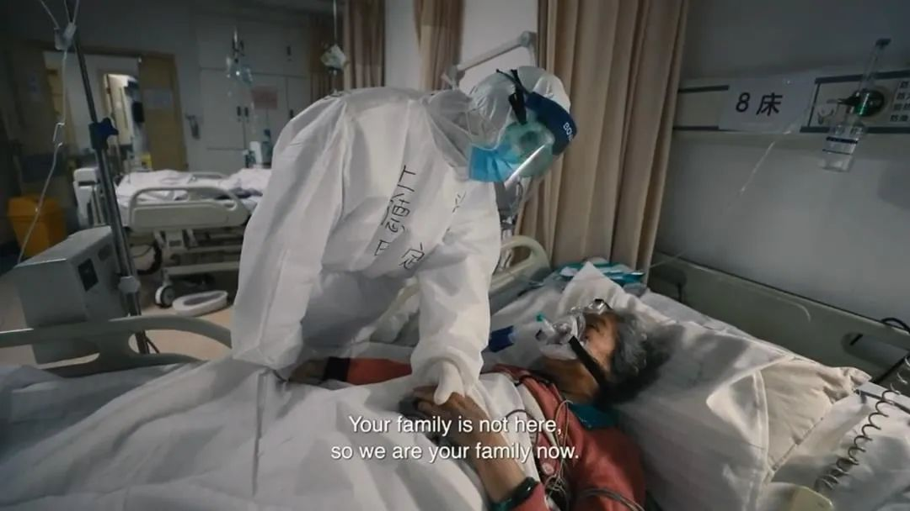  

“你的家人不在这儿，我们就是你的家人。”

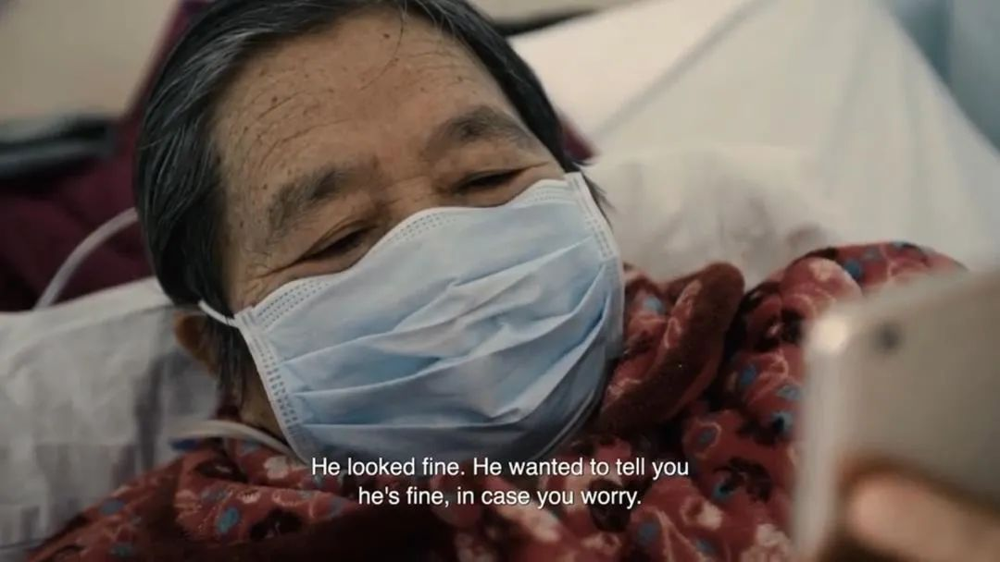

“他看上去很好。怕你担心，他想告诉你，他很好。”

“专注于你自己的健康，要坚强。”

最让人印象深刻的一个老人，有点老年痴呆，他一个人住院，总是吵着要回家，医护人员耐心劝说，最后让他跟儿子通话，儿子好说歹说，最后提醒老人，你是党员，要发挥模范带头作用。老人一下子乖了许多，但也马上伏在枕头上大哭。在我看来，《76天》这一段是很妙的，它妙就妙在以老年人为切入点，将长期被西方妖魔化的党员还原成了一个活生生的老人。

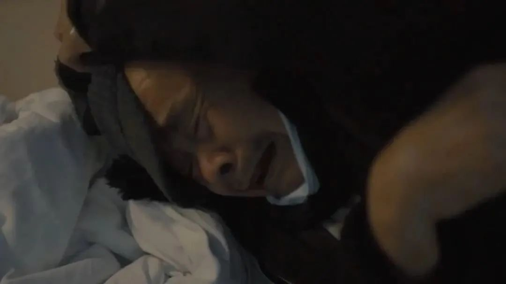  

**弱有弱的打法，什么是弱的打法？依我看，是柔中带刚，软中带硬，时不时再来一出借力打力的奇袭白虎团。  

**

面对福特基金会时要不要多留个心眼，当然要，但具体问题也要具体分析，要就事论事，不能不实事求是。在我看来，《76天》是一个很值得反复琢磨的案例。

我在思考过程中注意到一个有意思的地方，《76天》的导演是吴皓、陈玮曦和一位匿名人士（一位不愿意公开的记者），这位匿名人士应该就是提供了大量武汉刚封城时医院第一线影像资料的人。看起来他不仅向《76天》提供了影像资料，也向别的纪录片提供了影像资料。  

比如《76天》一开头，是医护工作者奔向染疫去世的父亲，在病房外哭泣。这其实和《武汉日夜》里的一个桥段讲的是同一个故事，两部纪录片的镜头是可以直接衔接在一起的。

这位匿名导演，实在很让人好奇。

去年听闻《76天》入围奥斯卡最佳纪录片提名短名单，说实话我是很意外的，**因为这部电影往深了挖，实际上处处都在戳美国的脊梁骨，很多地方跟美国流行的价值观、跟当时美国流行的舆论是相违背的**。大概是粗看像符合当时美国媒体炒作的封城不透明，乍一看还表现了中国疫情之惨，加上美籍导演和福特基金会双buff加持，美国文化人把它当“友军”了，颇费了一番功夫才咂摸出味道来，最后没让它得奖。

这个咂摸出味的过程也很有意思，我记得油管上有一个叫Amanpour的频道采访吴皓导演的视频，主持人直接就问：你怎么不多拍点死人呢？在我看来，那个主持人应该处于隐隐觉察出哪里不对、但又说不上来具体哪里不对的阶段。  

实话实说，文化领域，我是**非常不喜欢美式双标**的，所以我希望即使在实力对比**敌强我弱**的情况下，像《76天》这样**讲事实，同时斗争得又很巧妙**的作品，能多一点。我知道这其实是给我们的影视工作者提了很高的要求，不止是专业内的实力要达标，专业外的积累也不能忽视，能做到这一点的人，有目共睹，其实不多。

但事情有时有趣就有趣在这里，**屠龙之术稀有，龙更稀有，像现在这样恶龙与屠龙之术并世的情况，真正的勇者是会感到发自内心的激动的。**美国确实工业跟技术的积淀都丰厚，可是当**文化的深度超过他**，他也会跌个踉跄。这样的例子，我们已经看到了。  

— END —

© 版权所有，侵权必究。  

图片来源于网络，若侵权，请联系我删除。
