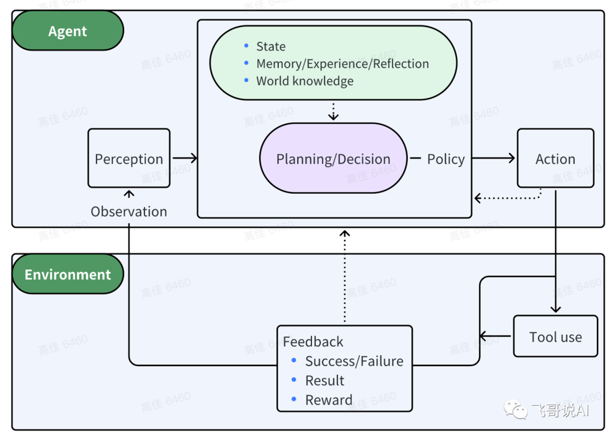
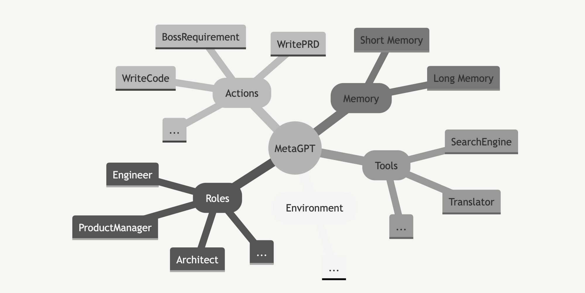
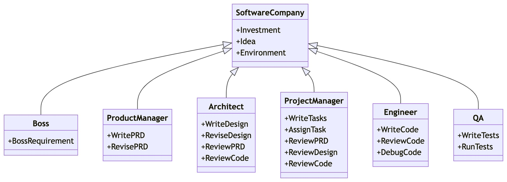
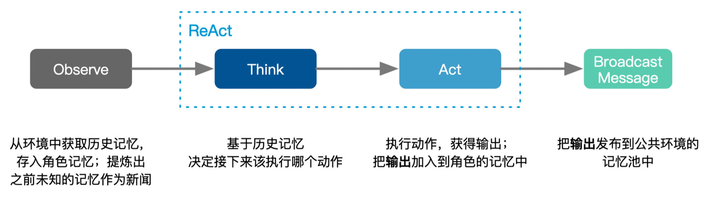
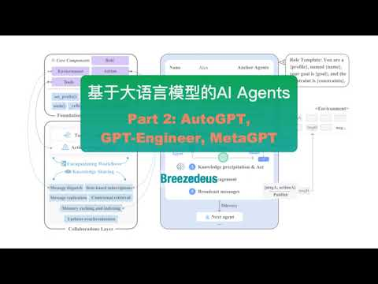

**本系列分享 Part 1:**

## AI Agent 回顾

**代理（Agent）**指能自主感知环境并采取行动实现目标的**智能体**。基于大语言模型（LLM）的 AI Agent 利用 LLM 进行记忆检索、决策推理和行动顺序选择等，把Agent的智能程度提升到了新的高度。LLM驱动的Agent具体是怎么做的呢？接下来的系列分享会介绍 AI Agent 当前最新的技术进展。

一个精简的Agent决策流程：

**Agent：P（感知）→ P（规划）→ A（行动）**

**感知（Perception）**是指Agent从环境中收集信息并从中提取相关知识的能力。

**规划（Planning）**是指Agent为了某一目标而作出的决策过程。

**行动（Action）**是指基于环境和规划做出的动作。

其中，**Policy**是Agent做出Action的核心决策，而行动又通过**观察（Observation）**成为进一步Perception的前提和基础，形成自主地闭环学习过程。

接下来介绍3个热门的Agent框架：**AutoGPT**、**GPT-Engineer** 和 **MetaGPT**。

## AutoGPT

-   

-   Ref: [LLM Powered Autonomous Agents | Lil'Log](https://lilianweng.github.io/posts/2023-06-23-agent/)

**[AutoGPT](https://github.com/Significant-Gravitas/Auto-GPT)** 定位类似个人助理，帮助用户完成指定的任务，如调研某个课题。AutoGPT比较强调对外部工具的使用，如搜索引擎、页面浏览等。

以下是 AutoGPT 使用的 system prompt，其中 `{{...}}` 为用户输入:

## [GPT-Engineer](https://github.com/AntonOsika/gpt-engineer)

-   Ref: [LLM Powered Autonomous Agents | Lil'Log](https://lilianweng.github.io/posts/2023-06-23-agent/)

[GPT-Engineer](https://github.com/AntonOsika/gpt-engineer) 旨在根据自然语言中指定的任务**创建一个完整的代码仓库**。GPT-Engineer 被指导去构建的一系列较小的组件，并在需要时**要求用户输入以澄清问题**。

以下是GPT-Engineer的一个任务澄清的样例对话。用户的输入在 `{{user input text}}`中。

在澄清之后，Agent 进入了**代码编写**模式。看官方视频，所有文件的内容是一次性生成的。System message:

对话样例:

## MetaGPT

-   

-   作者介绍视频：[https://www.bilibili.com/video/BV1Ru411V7XL](https://www.bilibili.com/video/BV1Ru411V7XL)

MetaGPT 现在可以生成2000行左右代码的项目，未来目标是万行甚至更长。

### 结构

-   **Roles**

-   **Actions**

-   Environment

-   **Memory**

-   **Tools**

-   LLM Providers

### Multi-Agents 软件公司

创建公司和雇员：

实现时，循环依次调用各个角色的 `.run()` 函数。

### 记忆（Memory）

**Message**：

记忆中记录的原始单元，主要记录动作执行后产生的结果。相当于斯坦福Generative Agents中的**Observation**：

每个角色执行动作后，就会产生新的记忆Message。

### **Environment**

### 角色（Roles）

**角色** **`Role`** 定义：

每个角色的 **`.run()`** 中的流程：

当某个角色有**多个可选动作**时（`**len(self._actions)>1**`），使用以下的prompt让LLM来选择该执行哪个动作，其中 `**{history}**` 包含前面所有动作的输出结果，`**{states}**` 就是可选的动作列表：

#### ProductManager

**Action** `**WritePRD**` 使用的 prompt 模板：**Action** `**WritePRD**` 的一个真实 prompt**：**对应的真实输出：

#### Architect

**Action** **`WriteDesign`** 使用的 prompt 模板：**Action** **`WriteDesign`** 的一个真实 prompt**：**对应的真实输出：

#### ProjectManager

**Action** `**WriteTasks**` 使用的 prompt 模板：**Action** `**WriteTasks**` 的一个真实 prompt**：**对应的真实输出：

#### Engineer

**Action** `**WriteCode**` 使用的 prompt 模板：和之前的一般实现不同，**`Engineer`** 有很多单独的代码，做了很多独特的事。**`Engineer`** 每次调用 `**WriteCode**` **只生成一个文件的代码**，按文件列表的顺序逐个生成所有文件的代码。之前的 `context` 只使用了角色 watch 的动作的结果，而**`Engineer`**传入 `**WriteCode**` 的 `context` 包含前面所有动作的输出结果，以及当前已生成的代码文件。所以这里的 **`context`** 特别长，如**：**以下是输出的 **ocr.py** 文件：

## 总结

<table><tbody><tr><td>
ㅤ
</td><td>
<b>AutoGPT</b>
</td><td>
GPT-Engineer
</td><td>
<b>Generative Agents</b>
</td><td>
<b>MetaGPT</b>
</td></tr><tr><td>
<b>场景</b>
</td><td>
个人小助理
</td><td>
职业/项目场景
</td><td>
生活场景
</td><td>
职业/项目场景
</td></tr><tr><td>
<b>Agents数量</b>
</td><td>
单
</td><td>
单
</td><td>
多
</td><td>
多
</td></tr><tr><td>
<b>环境（Environment）</b>
</td><td>
-
</td><td>
-
</td><td>
其他Agents + 外部世界
</td><td>
其他Agents
</td></tr><tr><td>
<b>与用户交互量</b>
</td><td>
无
</td><td>
少
</td><td>
少
</td><td>
无
</td></tr><tr><td>
<b>记忆（Memory）</b>
</td><td>
短期
</td><td>
短期
</td><td>
短期 + 长期
</td><td>
短期为主
</td></tr><tr><td>
<b>Agents的动作执行顺序</b>
</td><td>
-
</td><td>
-
</td><td>
并行
</td><td>
串行
</td></tr><tr><td>
<b>动作空间</b>
</td><td>
小
</td><td>
-
</td><td>
大
</td><td>
小
</td></tr><tr><td>
<b>输入和输出格式</b>
</td><td>
偏结构化
</td><td>
偏结构化
</td><td>
偏自然语言
</td><td>
偏结构化
</td></tr><tr><td>
<b>动作轮次</b>
</td><td>
少
</td><td>
-
</td><td>
多
</td><td>
少
</td></tr><tr><td>
<b>对反思与规划的要求</b>
</td><td>
高
</td><td>
低
</td><td>
高
</td><td>
低；goal 和 plan 基本都事先定好
</td></tr><tr><td>
<b>Agents之间如何交互</b>
</td><td>
-
</td><td>
-
</td><td>
对话
</td><td>
获取其他agent执行动作所产生的结果
</td></tr></tbody></table>

## **分享视频**

[**Youtube**](https://youtu.be/JuXi1hSEJfI)

[**Bilibili**](https://www.bilibili.com/video/BV1dh4y127zz/)

## References

1.  [大模型下半场，关于Agent的几个疑问](https://mp.weixin.qq.com/s/tXxCEtAA_W1eS0ti-Yydxg)

2.  [LLM Powered Autonomous Agents | Lil'Log](https://lilianweng.github.io/posts/2023-06-23-agent/)

3.  [Generative Agents: Interactive Simulacra of Human Behavior](https://github.com/joonspk-research/generative_agents)

4.  

5.  

6.  

[GPT-4 新的超能力](https://www.breezedeus.com/article/gpt4)[解决超难问题的 Least-to-Most Prompt 框架](https://www.breezedeus.com/article/llm-prompt-l2m)
