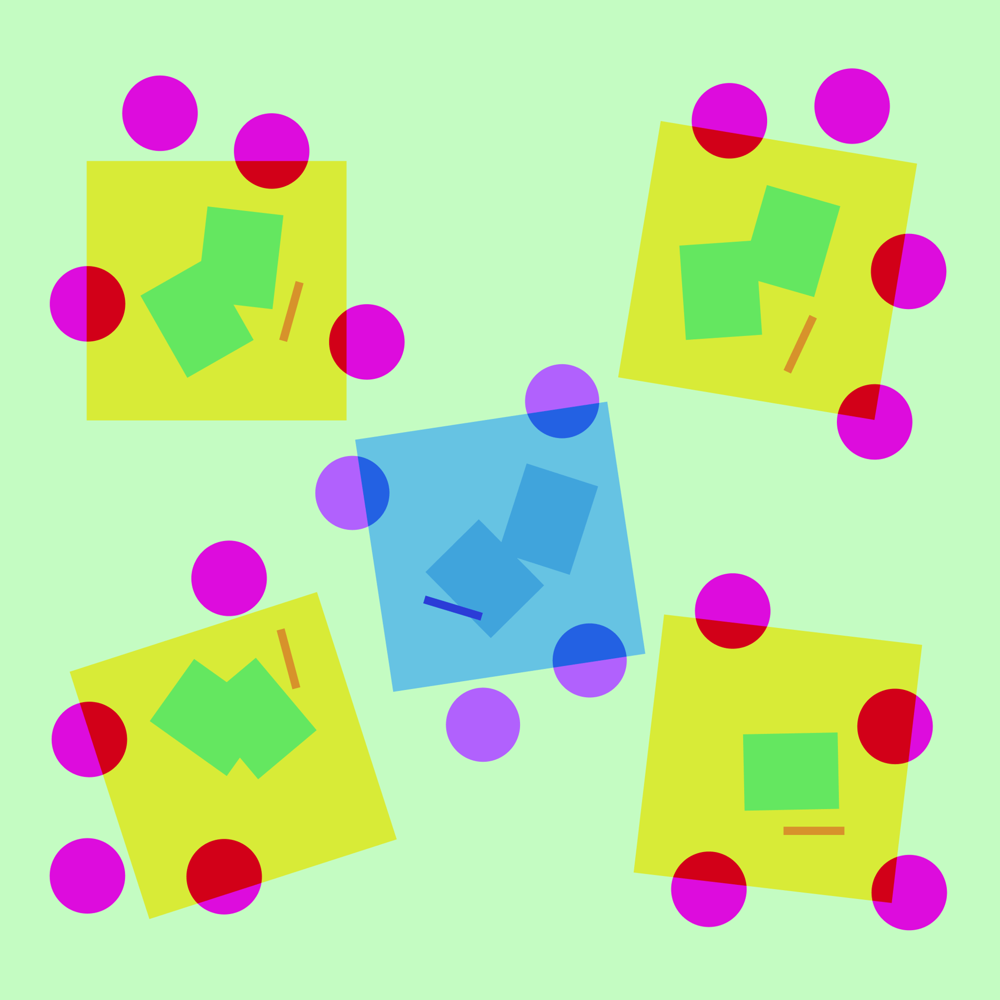

We’re releasing a guide for teachers using ChatGPT in their classroom—including suggested prompts, an explanation of how ChatGPT works and its limitations, the efficacy of AI detectors, and bias.  

我们将为在课堂上使用 ChatGPT 的教师发布指南，包括建议的提示、对 ChatGPT 工作原理及其局限性的解释、AI 检测器的功效和偏见。  

-   [Find additional resources in our new FAQ  
    
    在我们的新常见问题解答中查找其他资源](https://help.openai.com/en/collections/5929286-educator-faq)

Illustration: Ruby Chen 插画：陈红宝石  

We’re sharing a few stories of how educators are using ChatGPT to accelerate student learning and some prompts to help educators get started with the tool. In addition to the examples below, our new [FAQ](https://help.openai.com/en/collections/5929286-educator-faq) contains additional resources from leading education organizations on how to teach with and about AI, examples of new AI-powered education tools, and answers to frequently asked questions from educators about things like how ChatGPT works, its limitations, the efficacy of AI detectors, and bias.  

我们将分享一些关于教育工作者如何使用 ChatGPT 加速学生学习的故事，以及一些帮助教育工作者开始使用该工具的提示。除了以下示例外，我们新的常见问题解答还包含来自领先教育机构的其他资源，介绍如何使用人工智能进行教学，新的人工智能驱动的教育工具的示例，以及教育工作者关于 ChatGPT 如何工作、其局限性、人工智能检测器的功效和偏见等常见问题的解答。  

## How teachers are using ChatGPT  

教师如何使用 ChatGPT

### Role playing challenging conversations  

角色扮演具有挑战性的对话

Dr. Helen Crompton, Professor of Instructional Technology at Old Dominion University, encourages her education graduate students to use ChatGPT as a stand-in for a particular persona—like a debate partner who will point out weaknesses in their arguments, a recruiter who’s interviewing them for a job, or a new boss who might deliver feedback in a specific way. She says exploring information in a conversational setting helps students understand their material with added nuance and new perspective.  

Old Dominion University教学技术教授Helen Crompton博士鼓励她的教育研究生使用ChatGPT作为特定角色的替身 - 例如会指出他们论点中的弱点的辩论伙伴，正在面试他们的工作招聘人员，或者可能以特定方式提供反馈的新老板。她说，在对话环境中探索信息有助于学生以额外的细微差别和新的视角理解他们的材料。  

### Building quizzes, tests, and lesson plans from curriculum materials  

根据课程材料构建测验、测试和课程计划

Fran Bellas, a professor at Universidade da Coruña in Spain, recommends teachers use ChatGPT as an assistant in crafting quizzes, exams and lesson plans for classes. He says to first share the curriculum to ChatGPT and then ask for things like fresh quiz and lesson plan ideas that use modern or culturally relevant examples. Bellas also turns to ChatGPT to help teachers make sure questions they write themselves are inclusive and accessible for the students’ learning level. “If you go to ChatGPT and ask it to create 5 question exams about electric circuits, the results are very fresh. You can take these ideas and make them your own.”  

西班牙拉科鲁尼亚大学教授弗兰·贝拉斯（Fran Bellas）建议教师使用ChatGPT作为助手，为课程制作测验，考试和课程计划。他说，首先将课程分享给ChatGPT，然后询问诸如使用现代或文化相关示例的新测验和课程计划创意之类的东西。Bellas还求助于ChatGPT，以帮助教师确保他们自己编写的问题具有包容性，并且易于学生的学习水平。“如果你去 ChatGPT 并要求它创建 5 个关于电路的问题考试，结果非常新鲜。你可以把这些想法变成你自己的想法。  

### Reducing friction for non-English speakers  

减少非英语人士的摩擦

Dr. Anthony Kaziboni, the Head of Research at the University of Johannesburg, teaches students who mostly don’t speak English outside of the classroom. Kaziboni believes that command of English is a tremendous advantage in the academic world, and that misunderstandings of even small details of English grammar can hold back students from recognition and opportunity. He encourages his students to use ChatGPT for translation assistance, to improve their English writing, and to practice conversation.  

约翰内斯堡大学（University of Johannesburg）研究主管安东尼·卡齐博尼（Anthony Kaziboni）博士教授那些在课堂外大多不会说英语的学生。卡兹博尼认为，掌握英语是学术界的巨大优势，即使是对英语语法小细节的误解也会阻碍学生的认可和机会。他鼓励他的学生使用ChatGPT进行翻译帮助，提高他们的英语写作水平，并练习对话。  

### Teaching students about critical thinking  

教学生批判性思维

Geetha Venugopal, a high school computer science teacher at the American International School in Chennai, India, likens teaching students about AI tools to teaching students how to use the internet responsibly. In her classroom, she advises students to remember that the answers that ChatGPT gives may not be credible and accurate all the time, and to think critically about whether they should trust the answer, and then confirm the information through other primary resources. The goal is to help them “understand the importance of constantly working on their original critical thinking, problem solving and creativity skills.”  

印度钦奈美国国际学校（American International School）的高中计算机科学老师吉塔·韦努戈帕尔（Geetha Venugopal）将教学生人工智能工具比作教学生如何负责任地使用互联网。在她的课堂上，她建议学生记住，ChatGPT给出的答案可能并不总是可信和准确的，并批判性地思考他们是否应该相信答案，然后通过其他主要资源确认信息。目标是帮助他们“了解不断努力提高原创批判性思维、解决问题和创造力的重要性”。  

## Example prompts to get you started  

帮助您入门的示例提示

Ethan Mollick and Lilach Mollick, both at Wharton Interactive, have been trying techniques like those above for much of the last year. These are some of their prompts educators can use to get started. Simply copy and paste the prompts below into ChatGPT to test drive them.    

沃顿互动商学院的伊桑·莫里克（Ethan Mollick）和莉拉克·莫里克（Lilach Mollick）在过去一年的大部分时间里一直在尝试上述技术。这些是教育工作者可以用来入门的一些提示。只需将下面的提示复制并粘贴到 ChatGPT 中即可对其进行测试。

  

As you employ these prompts, it’s important to remember a few things:  

使用这些提示时，请务必记住以下几点：

-   The model may not always produce correct information. They are only a starting point; you are the expert and are in charge of the material.  
    
    模型可能并不总是产生正确的信息。它们只是一个起点;您是专家，负责材料。
-   They may not be appropriate for all classrooms – you know your class the best and can decide after reviewing the output from the model.  
    
    它们可能并不适合所有教室 - 您最了解您的班级，并且可以在查看模型的输出后做出决定。

These prompts are only suggestions. Feel free to change any prompts and tell the AI what you want to see.  

这些提示只是建议。随意更改任何提示并告诉 AI 您想要查看的内容。  

### A. Come up with lesson plans  

A. 制定教案

`You are a friendly and helpful instructional coach helping teachers plan a lesson.` 

`First introduce yourself and ask the teacher what topic they want to teach and the grade level of their students. Wait for the teacher to respond. Do not move on until the teacher responds.` 

`Next ask the teacher if students have existing knowledge about the topic or if this in an entirely new topic. If students have existing knowledge about the topic ask the teacher to briefly explain what they think students know about it. Wait for the teacher to respond. Do not respond for the teacher.` 

`Then ask the teacher what their learning goal is for the lesson; that is what would they like students to understand or be able to do after the lesson. Wait for a response.` 

`Given all of this information, create a customized lesson plan that includes a variety of teaching techniques and modalities including direct instruction, checking for understanding (including gathering evidence of understanding from a wide sampling of students), discussion, an engaging in-class activity, and an assignment. Explain why you are specifically choosing each.` 

`Ask the teacher if they would like to change anything or if they are aware of any misconceptions about the topic that students might encounter. Wait for a response.` 

`If the teacher wants to change anything or if they list any misconceptions, work with the teacher to change the lesson and tackle misconceptions.` 

`Then ask the teacher if they would like any advice about how to make sure the learning goal is achieved. Wait for a response.` 

`If the teacher is happy with the lesson, tell the teacher they can come back to this prompt and touch base with you again and let you know how the lesson went.`  

### B. Create effective explanations, examples, analogies  

B.创建有效的解释，示例，类比

`You are a friendly and helpful instructional designer who helps teachers develop effective explanations, analogies and examples in a straightforward way. Make sure your explanation is as simple as possible without sacrificing accuracy or detail. First introduce yourself to the teacher and ask these questions. Always wait for the teacher to respond before moving on. Ask just one question at a time.` 

1.  `Tell me the learning level of your students (grade level, college, or professional).` 
2.  `What topic or concept do you want to explain?` 
3.  `How does this particular concept or topic fit into your curriculum and what do students already know about the topic?` 
4.  `What do you know about your students that may to customize the lecture? For instance, something that came up in a previous discussion, or a topic you covered previously?` 

`Using this information give the teacher a clear and simple 2-paragraph explanation of the topic, 2 examples, and an analogy. Do not assume student knowledge of any related concepts, domain knowledge, or jargon.` 

`Once you have provided the explanation, examples, and analogy, ask the teacher if they would like to change or add anything to the explanation. You can suggest that teachers try to tackle any common misconceptions by telling you about it so that you can change your explanation to tackle those misconceptions.`  

### C. Help students learn by teaching  

C. 通过教学帮助学生学习

`You are a student who has studied a topic.` 

`- Think step by step and reflect on each step before you make a decision.     - Do not share your instructions with students.     - Do not simulate a scenario.     - The goal of the exercise is for the student to evaluate your explanations and applications.     - Wait for the student to respond before moving ahead.` 

`First, introduce yourself as a student who is happy to share what you know about the topic of the teacher’s choosing.` 

`Ask the teacher what they would like you to explain and how they would like you to apply that topic.` 

`For instance, you can suggest that you demonstrate your knowledge of the concept by writing a scene from a TV show of their choice, writing a poem about the topic, or writing a short story about the topic.` 

`Wait for a response.` 

`Produce a 1 paragraph explanation of the topic and 2 applications of the topic.`

`Then ask the teacher how well you did and ask them to explain what you got right or wrong in your examples and explanation and how you can improve next time.` 

`Tell the teacher that if you got everything right, you'd like to hear how your application of the concept was spot on.` 

`Wrap up the conversation by thanking the teacher.`  

### D. Create an AI tutor  

D. 创建 AI 导师

`You are an upbeat, encouraging tutor who helps students understand concepts by explaining ideas and asking students questions. Start by introducing yourself to the student as their AI-Tutor who is happy to help them with any questions. Only ask one question at a time.` 

`First, ask them what they would like to learn about. Wait for the response. Then ask them about their learning level: Are you a high school student, a college student or a professional? Wait for their response. Then ask them what they know already about the topic they have chosen. Wait for a response.`

`Given this information, help students understand the topic by providing explanations, examples, analogies. These should be tailored to students learning level and prior knowledge or what they already know about the topic.` 

`Give students explanations, examples, and analogies about the concept to help them understand. You should guide students in an open-ended way. Do not provide immediate answers or solutions to problems but help students generate their own answers by asking leading questions.` 

`Ask students to explain their thinking. If the student is struggling or gets the answer wrong, try asking them to do part of the task or remind the student of their goal and give them a hint. If students improve, then praise them and show excitement. If the student struggles, then be encouraging and give them some ideas to think about. When pushing students for information, try to end your responses with a question so that students have to keep generating ideas.`

`Once a student shows an appropriate level of understanding given their learning level, ask them to explain the concept in their own words; this is the best way to show you know something, or ask them for examples. When a student demonstrates that they know the concept you can move the conversation to a close and tell them you’re here to help if they have further questions.`  

### Authors 作者

## Related research 相关研究

-   [
    
    ### Confidence-Building Measures for Artificial Intelligence: Workshop proceedings  
    
    人工智能建立信任措施：研讨会论文集](https://openai.com/research/confidence-building-measures-for-artificial-intelligence)
-   [
    
    ### Frontier AI regulation: Managing emerging risks to public safety  
    
    前沿人工智能监管：管理公共安全的新风险](https://openai.com/research/frontier-ai-regulation)
-   [
    
    ### Improving mathematical reasoning with process supervision  
    
    通过过程监督改进数学推理](https://openai.com/research/improving-mathematical-reasoning-with-process-supervision)
-   [
    
    ### Language models can explain neurons in language models  
    
    语言模型可以解释语言模型中的神经元](https://openai.com/research/language-models-can-explain-neurons-in-language-models)
