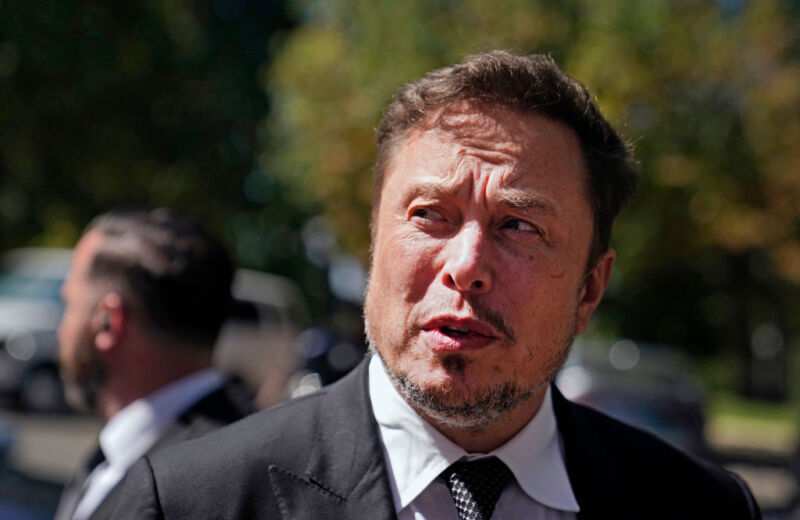

#### Check back later —  

稍后再回来查看 —

## After a report called out Musk's union-busting, UAW's blue check got reinstated.  

在一份报告指出马斯克破坏工会后，UAW的蓝色支票得以恢复。

Last night when the clock struck midnight, [nearly 13,000 workers at Ford, General Motors, and Stellantis went on strike](https://arstechnica.com/cars/2023/09/thousands-of-workers-go-on-strike-at-ford-gm-and-stellantis-plants/) after the so-called "Big Three" car companies failed to reach an agreement with United Auto Workers (UAW). By Friday morning, UAW discovered that X, the platform formerly known as Twitter—in what appeared to be a petty move by platform owner and Tesla CEO Elon Musk—had stripped their account's verified status, [The Intercept reported](https://theintercept.com/2023/09/15/uaw-strike-twitter-verification-elon-musk/).  

昨晚，当时钟敲响午夜时，福特，通用汽车和Stellantis的近13,000名工人在所谓的“三巨头”汽车公司未能与美国汽车工人联合会（UAW）达成协议后罢工。据The Intercept报道，到周五早上，UAW发现X，前身为Twitter的平台 - 似乎是平台所有者和特斯拉首席执行官埃隆马斯克的一个小举动 - 已经剥夺了他们帐户的验证状态。

The move seemingly makes it harder for UAW to maximize reach for its posts on X, just as workers have begun striking, demanding better wages and other benefits.  

此举似乎使UAW更难最大限度地扩大其在X上的职位，就像工人开始罢工，要求更高的工资和其他福利一样。

Ford has claimed that the deal UAW was negotiating would have doubled automaker labor costs, and the Intercept noted that often wage increases won by union workers "trickle down" to non-unionized workers like Tesla's. That perhaps worried Musk, who seemingly has a financial interest in keeping autoworker wages low and a history of union-busting. Earlier this year, Musk lost a court battle and [had to delete a tweet that threatened Tesla workers attempting to unionize](https://arstechnica.com/tech-policy/2023/04/musk-loses-in-court-has-to-delete-tweet-threatening-tesla-workers-who-join-union/).  

福特声称，UAW正在谈判的交易将使汽车制造商的劳动力成本翻倍，Intercept指出，工会工人赢得的工资增长通常会“涓滴”到像特斯拉这样的非工会工人身上。这也许让马斯克感到担忧，他似乎对保持汽车工人的低工资和破坏工会的历史有经济利益。今年早些时候，马斯克输掉了一场法庭斗争，不得不删除一条威胁特斯拉工人试图加入工会的推文。

A UAW official told The Intercept that the union had paid for X verification and confirmed that the account had been marked as verified until earlier today when UAW said it was removed without any notification from X.  

UAW的一名官员告诉The Intercept，工会已经支付了X验证的费用，并确认该帐户已被标记为已验证，直到今天早些时候UAW表示在X没有任何通知的情况下将其删除。

By midday Friday, UAW's verified check was reinstated. The Intercept's reporter, Ryan Grim, [posted on X](https://twitter.com/ryangrim/status/1702721056190980574?ref_src=twsrc%5Etfw%7Ctwcamp%5Etweetembed%7Ctwterm%5E1702721056190980574%7Ctwgr%5Eb17609a20274718334e922e6a2f9960348e94b9f%7Ctwcon%5Es1_&ref_url=https%3A%2F%2Ftheintercept.com%2F2023%2F09%2F15%2Fuaw-strike-twitter-verification-elon-musk%2F), writing, "Elon put the blue check back up. Maybe the Big Three will fold this fast too."  

到周五中午，UAW的经过验证的支票被恢复。The Intercept的记者Ryan Grim在X上发帖写道：“Elon把蓝色支票放回去。也许三巨头也会这么快折戟。

To a request for comment, X only sent Ars an auto-response, saying, "Busy now, please check back later." (To be fair, in this case "check back later" is a good summary of what happened.)  

对于评论请求，X只向Ars发送了自动回复，说：“现在很忙，请稍后再回来查看。（公平地说，在这种情况下，“稍后再回来查看”是对所发生情况的一个很好的总结。

According to [Axios](https://www.axios.com/2023/09/13/tesla-uaw-gm-ford-stellantis-contract-talks), Tesla pays lower wages than the Big Three automakers currently faced with striking workers, with Tesla paying "an estimated labor cost of $45 to $50 per hour" compared to "about $64 to $67 per hour."  

根据Axios的说法，特斯拉支付的工资低于目前面临罢工工人的三大汽车制造商，特斯拉支付的“估计劳动力成本为每小时45至50美元”，而“每小时约64至67美元”。

In a [post on X](https://twitter.com/elonmusk/status/1702431940987543888), Musk claimed that Tesla pays more than UAW's required wages.  

在X上的一篇文章中，马斯克声称特斯拉支付的工资超过了UAW要求的工资。

"We pay more than the UAW btw, but performance expectations are also higher," Musk said. "Quite a few of our factory techs who work on the line have become millionaires over the years from company stock grants."  

“我们支付的费用高于UAW，但性能预期也更高，”马斯克说。“多年来，我们生产线上工作的工厂技术人员中有不少人因公司股票赠款而成为百万富翁。

Musk's stake in the strike could go beyond wage questions, though. UAW's negotiations also seek to expand benefits for union workers involved "in the production of electric vehicles and the batteries needed to power them," The Intercept reported, and those conversations could also impact Tesla operations.  

不过，马斯克在罢工中的利害关系可能不仅仅是工资问题。据The Intercept报道，UAW的谈判还寻求扩大参与“生产电动汽车及其所需电池”的工会工人的福利，这些对话也可能影响特斯拉的运营。

On top of the backlash over Musk's union-busting tweet, Tesla has a history of violating labor laws.  

除了对马斯克破坏工会的推文的强烈反对之外，特斯拉还有违反劳动法的历史。

The company previously was found in violation of labor laws for [banning workers from wearing pro-union shirts](https://arstechnica.com/tech-policy/2022/08/teslas-ban-on-pro-union-shirts-is-illegal-and-must-be-rescinded-nlrb-rules/). Last year, the National Labor Relations Board (NLRB) ordered Tesla to revise its policies "to make clear that it does not prohibit production associates from wearing black union shirts."  

该公司此前被发现违反劳动法，禁止工人穿亲工会衬衫。去年，美国国家劳工关系委员会（NLRB）命令特斯拉修改其政策，“明确表示不禁止生产员工穿黑色工会衬衫”。

There was also tension earlier this year when Tesla Autopilot Buffalo-based workers tried to unionize, alleging that they were being [treated "like robots"](https://arstechnica.com/tech-policy/2023/02/tesla-autopilot-workers-try-to-unionize-are-tired-of-being-treated-like-robots/) and pressured to skip bathroom breaks.  

今年早些时候，特斯拉Autopilot布法罗的工人试图加入工会，声称他们被“像机器人一样对待”，并被迫跳过洗手间休息时间。

And most recently in April, the NLRB again ruled that Tesla violated labor laws when managers at an Orlando repair shop illegally silenced workers attempting to discuss pay and working conditions, [Reuters reported](https://www.reuters.com/business/autos-transportation/tesla-broke-us-labor-law-by-silencing-workers-official-rules-2023-04-26/).  

据路透社报道，最近在四月，NLRB再次裁定特斯拉违反了劳动法，当时奥兰多一家维修店的经理非法压制试图讨论工资和工作条件的工人。

Whether X was really attempting to limit reach of UAW's posts at a critical moment—or there is some other possible justification for removing the verification—is still unknown. But UAW didn't let the setback stop it from returning to the platform to amplify strikers' demands as soon as the blue check was back.  

X是否真的试图在关键时刻限制UAW帖子的覆盖范围 - 或者是否有其他可能的理由来删除验证 - 仍然未知。但UAW并没有让挫折阻止它回到平台，以便在蓝色支票回来后立即放大前锋的要求。

In the moments after X reinstated UAW's verification, the union began posting in support of strikers [in Ohio](https://twitter.com/UAW/status/1702730915841990705) and [Missouri](https://twitter.com/UAW/status/1702737525922562432), some of them chanting, "No justice, no jeeps!"  

在X恢复UAW的验证后，工会开始发帖支持俄亥俄州和密苏里州的罢工者，其中一些人高呼：“没有正义，没有吉普车！”
