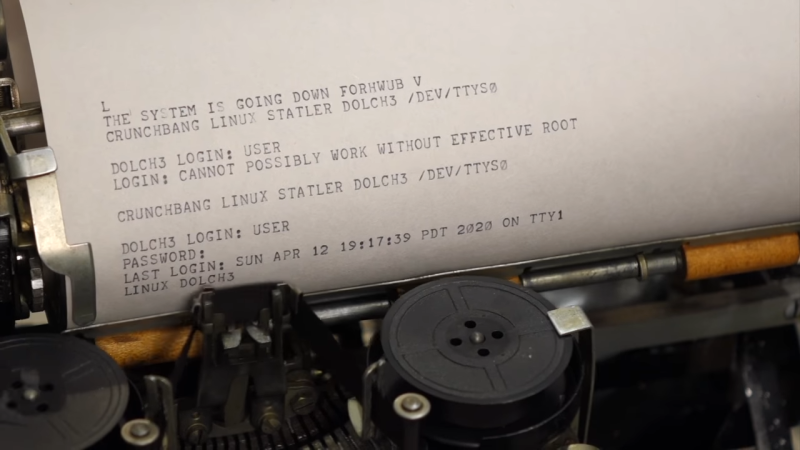
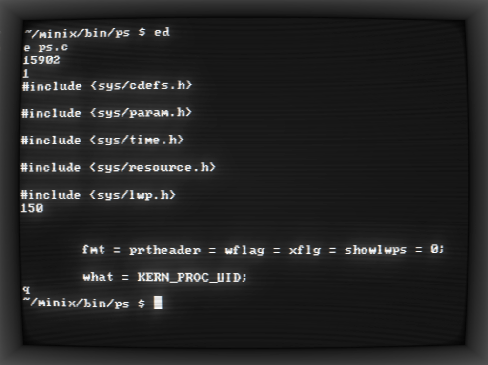
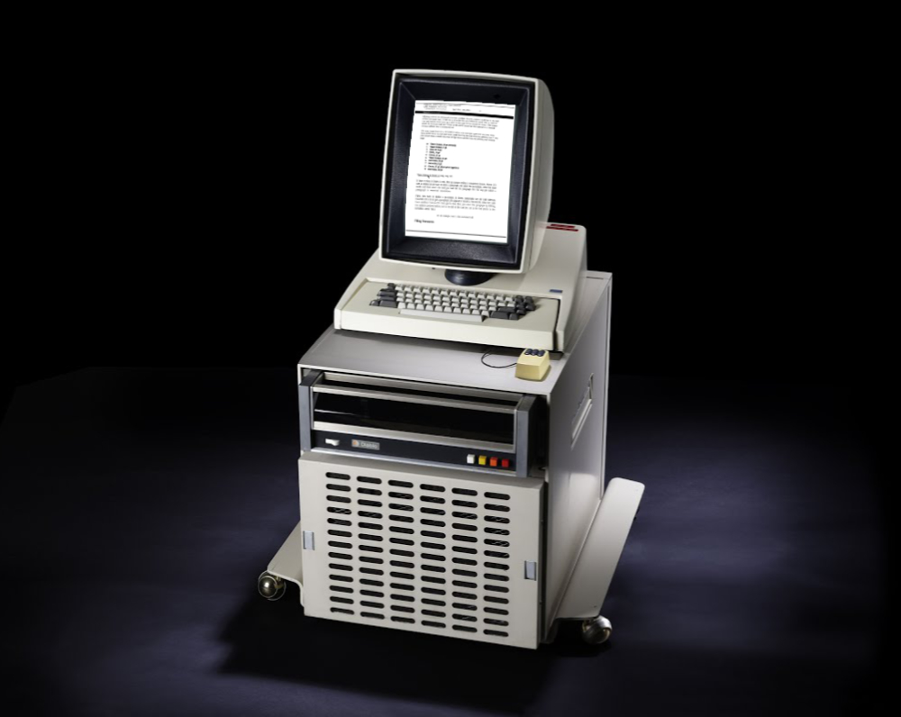
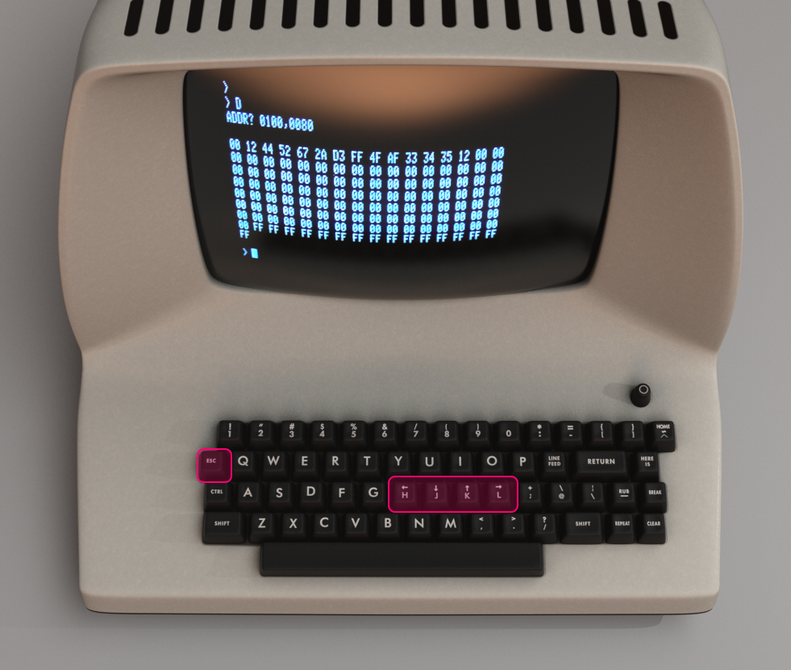
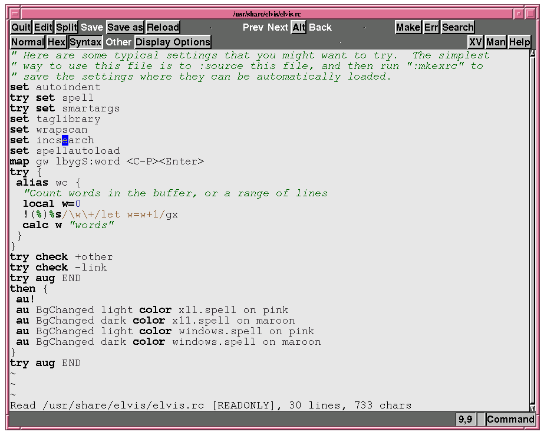
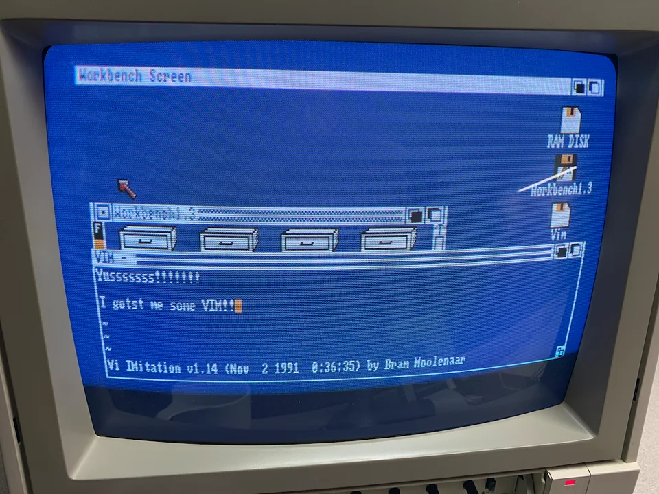
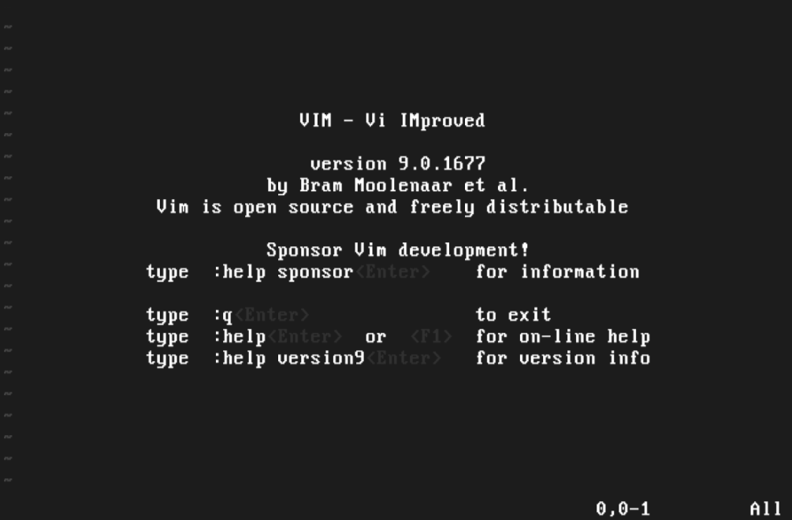
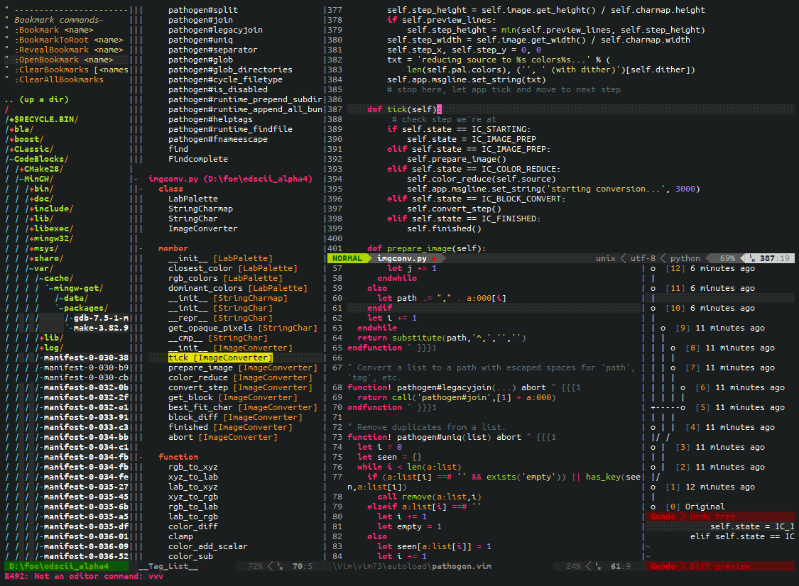
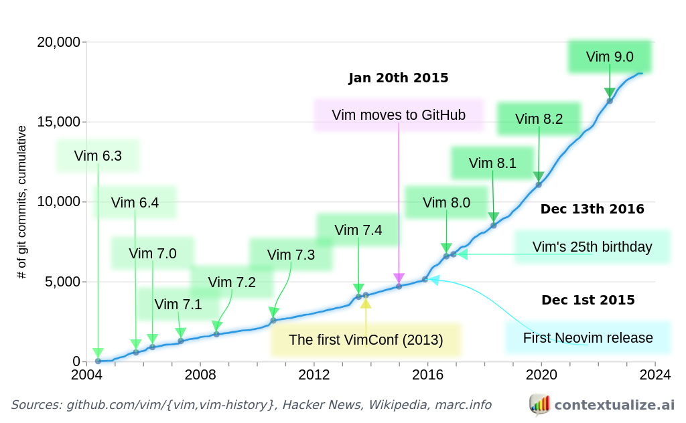

The history of both _Vi & Vim_ goes hand in hand with the history of open-source software itself. This article is a trip back to the origins of UNIX text editors. Let's look at the important players and historical events that shaped their evolution.  

Vi&Vim的历史与开源软件本身的历史齐头并进。本文回顾了 UNIX 文本编辑器的起源。让我们来看看塑造他们演变的重要参与者和历史事件。

I went to East London last week to visit my wife's alma mater, [Queen Mary University](https://www.qmul.ac.uk/). As I stopped to grab a cup of coffee, I received a message saying that [Bram Moolenaar](https://moolenaar.net/), the creator of Vim, had passed.  

上周我去了东伦敦，参观了我妻子的母校玛丽皇后大学。当我停下来喝杯咖啡时，我收到了一条消息，说Vim的创造者Bram Moolenaar已经去世了。

To be honest, with a new family member keeping me busy at home, and a new course on MIPS assembler that I'm recording for [my school](https://pikuma.com/courses), I am finding very difficult to keep up with the latest news. So, I confess that I received the news of Bram's passing almost a week too late.  

老实说，由于一个新的家庭成员让我在家里忙碌，以及我正在为学校录制的关于MIPS汇编器的新课程，我发现很难跟上最新消息。所以，我承认我收到布拉姆去世的消息晚了将近一周。

I did not know Bram personally and I am far from being a Vim _connoisseur,_ but the fact that I was visiting Queen Mary University forced me to stop for a moment and reflect on how that place was connected to the long and vibrant history of Vim.  

我个人并不认识布拉姆，我远非维姆鉴赏家，但我访问玛丽皇后大学的事实迫使我停下来思考那个地方如何与维姆悠久而充满活力的历史联系在一起。

Queen Mary University had an important role in the history of the Vim editor. It was here that, in 1973, the first UNIX system of the UK was installed, and it was also here that professor [George Coulouris](https://en.wikipedia.org/wiki/George_Coulouris_(computer_scientist)%22) developed an editor called [em](http://www.eecs.qmul.ac.uk/~gc/history/). The creation of _em_ ended up snowballing into the development of _vi_ and many other _vi clones_ after that.  

玛丽皇后大学在Vim编辑的历史上扮演着重要的角色。1973年，正是在这里安装了英国的第一个UNIX系统，也是在这里，George Coulouris教授开发了一个名为em的编辑器。em 的创建最终滚雪球般地进入了 vi 和此后许多其他 vi 克隆的开发。

[Queen Mary University of London](https://www.qmul.ac.uk/), where George Coulouris taught in 1976.  

伦敦玛丽皇后大学，乔治·库卢里斯于1976年任教。

### Ed

The UNIX shell is extremely text-heavy. Executables are invoked via text, parameters are passed via text, streams of data flow up and down the system via text, and virtually everything in the OS shell is done with tokens of text. It is no surprise that UNIX users are so passionate about text editors.  

UNIX shell 非常繁重的文本。可执行文件通过文本调用，参数通过文本传递，数据流通过文本在系统上下游动，操作系统 shell 中的几乎所有内容都是使用文本标记完成的。UNIX用户对文本编辑器如此热情也就不足为奇了。

We should probably start with [ed](https://en.wikipedia.org/wiki/Ed_(text_editor)), which was a command-line editor created by Ken Thompson designed to work well with [teleprinters](https://en.wikipedia.org/wiki/Teleprinter) rather than display terminals.  

我们可能应该从ed开始，这是Ken Thompson创建的命令行编辑器，旨在与电传打印机而不是显示终端很好地配合使用。

Teletype Model 15 teleprinter.  

电传打字机 15 型电传打印机。

Ed is what we call a _line editor._ Editing one line at a time made perfect sense for _teleprinters,_ but with the popularity of video displays taking over, most users found frustrating having to work with _ed._ That included Queen Mary's George Coulouris, who considered _ed's_ commands to be cryptic and not suitable for _"mortals"._  

Ed 就是我们所说的行编辑器。一次编辑一行对于电传打印机来说非常有意义，但随着视频显示器的普及，大多数用户发现不得不使用 ed 感到沮丧。其中包括玛丽皇后的乔治·库鲁里斯（George Coulouris），他认为艾德的命令是神秘的，不适合“凡人”。

Ed (line) editor. 编辑 Ed（行）。

Ken Thompson's _ed_ was inspired by another editor called [QED](https://en.wikipedia.org/wiki/QED_(text_editor)) (quick editor). QED was also a line-oriented editor for teleprinters developed for the [SDS 940 console](https://www.computerhistory.org/revolution/mainframe-computers/7/181/730). Ken Thompson rewrote QED using [BCPL](https://en.wikipedia.org/wiki/BCPL) to run on [MULTICS](https://en.wikipedia.org/wiki/Multics) (the precursor to UNIX).  

Ken Thompson的编辑灵感来自另一位名为QED（快速编辑器）的编辑。QED也是为SDS 940控制台开发的面向电传打印机的面向行的编辑器。Ken Thompson使用BCPL重写了QED，使其在MULTICS（UNIX的前身）上运行。

**Fun fact**: Ed became the defacto line-mode editor for UNIX, and it remains a part of the [POSIX](https://en.wikipedia.org/wiki/POSIX) standard to this very day. After all, [_"Ed is the standard text editor"_](https://cs.wellesley.edu/~cs249/Resources/ed_is_the_standard_text_editor.html).  

有趣的事实：Ed成为UNIX事实上的线路模式编辑器，直到今天它仍然是POSIX标准的一部分。毕竟，“Ed 是标准的文本编辑器”。

### Em

Following a series of frustrations with _ed,_ in February of 1976, while acting as a lecturer at Queen Mary College, Coulouris decided to enhance _ed_ using Ken Thompson's original source code as a starting point. That's how the editor [em](https://github.com/rsdoiel/em-1.0.0) (Ed for Mortals) came to be.  

1976年2月，在玛丽皇后学院担任讲师时，Coulouris决定使用Ken Thompson的原始源代码作为起点来增强ed。这就是编辑em（Ed for Mortals）的由来。

Coulouris' _em_ was designed to work well with display terminals. It was a single-line-at-a-time visual editor, and it was also one of the first programs on UNIX to make heavy use of _"raw terminal input mode",_ in which the running program (rather than the terminal device driver) handled all keystrokes.  

Coulouris的em旨在与显示终端很好地配合使用。它是一个一次单行的可视化编辑器，也是UNIX上最早大量使用“原始终端输入模式”的程序之一，其中正在运行的程序（而不是终端设备驱动程序）处理所有击键。

But George Coulouris was not the only one disappointed with _ed._ Across the pond, more people were getting frustrating working with Ken Thompson's line editor  

但乔治·库卢里斯并不是唯一一个对ed感到失望的人。在池塘的另一边，越来越多的人对Ken Thompson的线路编辑器感到沮丧

### Vi

When Thompson visited [UC Berkeley](https://www.berkeley.edu/) in 1976, he brough with him a broken Pascal compiler for UNIX that needed to be fixed. [Bill Joy](https://en.wikipedia.org/wiki/Bill_Joy), a student from UC Berkeley, was in charge of fixing Thompson's Pascal system. As days passed, Joy noticed that _ed_ was holding him back.  

当汤普森在1976年访问加州大学伯克利分校时，他和他一起提出了一个需要修复的UNIX的Pascal编译器。来自加州大学伯克利分校的学生比尔·乔伊（Bill Joy）负责修复汤普森的帕斯卡系统。随着时间的流逝，乔伊注意到艾德在阻止他。

[UC Berkeley](https://www.berkeley.edu/), where Bill Joy was a graduate student when he developed _vi._  

加州大学伯克利分校，比尔·乔伊（Bill Joy）在开发vi时是一名研究生。

In the summer of 1976, when George Coulouris visited UC Berkeley, he brought a [DECtape](https://en.wikipedia.org/wiki/DECtape) containing _em_ and showed it to various people at the university. Some considered this new type of text editor to be a resource hog, while others, including Bill Joy, were impressed with Coulouris' program.  

1976年夏天，当George Coulouris访问加州大学伯克利分校时，他带来了一个含有EM的DECtape，并把它展示给大学里的各种人。一些人认为这种新型的文本编辑器是资源消耗者，而其他人，包括Bill Joy，则对Coulouris的程序印象深刻。

Bill Joy was a graduate student at UC Berkeley and wrote the [vi](https://en.wikipedia.org/wiki/Vi) text editor.  

比尔·乔伊（Bill Joy）是加州大学伯克利分校的一名研究生，并编写了vi文本编辑器。

Inspired by Coulouris' _em,_ and by their own tweaks to Ken Thompson's _ed,_ Bill Joy and Chuck Haley (both graduate students at UC Berkeley) created a new editor called _en._ Soon after, they "extended" the _en_ editor and created [ex](https://en.wikipedia.org/wiki/Ex_(text_editor)). In October of 1977, Bill Joy added a full-screen visual mode to _ex,_ which came to be [vi](https://en.wikipedia.org/wiki/Vi).  

受到Coulouris的启发，以及他们自己对Ken Thompson编辑的调整，Bill Joy和Chuck Haley（都是加州大学伯克利分校的研究生）创建了一个名为en的新编辑器。不久之后，他们“扩展”了 en 编辑器并创建了 ex。1977 年 10 月，比尔·乔伊为 ex 添加了全屏视觉模式，后来成为 vi。

The _vi_ editor is able to render and edit text in full-screen mode.  

vi 编辑器能够以全屏模式渲染和编辑文本。

Both _vi_ and _ex_ share their code. You can think of _vi_ as launching _ex_ with an extra parameter to enable the capability to render and edit the text onto a computer display terminal. In reality, _vi_ is basically _ex's visual mode_.  

vi 和 ex 都共享他们的代码。您可以将 vi 视为使用额外参数启动 ex，以启用在计算机显示终端上呈现和编辑文本的功能。实际上，vi基本上是ex的视觉模式。

The name "vi" comes from the abbreviated ex command (vi) to enter the visual mode from within the editor. Later, as most of us probably know, _vi_ became the actual executable name that we invoke from the UNIX shell.  

名称“vi”来自缩写的ex命令（vi），用于从编辑器中进入可视模式。后来，正如我们大多数人可能知道的那样，vi 成为我们从 UNIX shell 调用的实际可执行文件名称。

Joy also mentioned that many features of _vi_ were inspired by an editor called [Bravo](https://en.wikipedia.org/wiki/Bravo_(editor)). Bravo was a bimodal text editor developed at Xerox PARC for the [Xerox Alto](https://en.wikipedia.org/wiki/Xerox_Alto).  

Joy还提到vi的许多功能都是受到一位名叫Bravo的编辑的启发。Bravo是施乐PARC为施乐Alto开发的双模文本编辑器。

Bravo was a WYSIWYG document editor with multi-font capability using Xerox Alto's bitmap display.  

Bravo是一个所见即所得的文档编辑器，使用施乐Alto的位图显示具有多字体功能。

It's also important to mention that Bill Joy used an [ADM-3A](https://en.wikipedia.org/wiki/ADM-3A) terminal to develop _vi._ In the ADM-3A, the **Escape** key is located on the far-left of the keyboard, similar to where the **Tab** key is located in most modern keyboards.  

值得一提的是，Bill Joy使用ADM-3A终端开发了vi。在 ADM-3A 中，Esc 键位于键盘的最左侧，类似于大多数现代键盘中的 Tab 键所在的位置。

Many _vi_ shortcuts and navigation keys that we still use today were based on the ADM-3A keyboard layout.  

我们今天仍在使用的许多vi快捷键和导航键都是基于ADM-3A键盘布局的。

Besides ADM-3A's influence on vi key shortcuts, we must also note that Bill Joy was developing his editor connected to an extremely slow 300 baud modem.  

除了ADM-3A对vi键快捷键的影响之外，我们还必须注意到Bill Joy正在开发连接到极慢的300波特调制解调器的编辑器。

Bill Joy is quoted in an [interview](https://www.theregister.com/2003/09/11/bill_joys_greatest_gift/) on his process of writing _ex_ and _vi_:  

比尔·乔伊（Bill Joy）在一次采访中引用了他写前任和六人的过程：

> "It took a long time. It was really hard to do because you've got to remember that I was trying to make it usable over a 300 baud modem. That's also the reason you have all these funny commands. It just barely worked to use a screen editor over a modem. It was just barely fast enough. A 1200 baud modem was an upgrade. 1200 baud now is pretty slow. 9600 baud is faster than you can read. 1200 baud is way slower. So the editor was optimized so that you could edit and feel productive when it was painting slower than you could think. Now that computers are so much faster than you can think, nobody understands this anymore."  
> 
> “花了很长时间。这真的很难做到，因为你必须记住，我试图让它在 300 波特调制解调器上可用。这也是你拥有所有这些有趣的命令的原因。在调制解调器上使用屏幕编辑器几乎不起作用。它只是勉强够快。1200波特调制解调器是升级。现在 1200 波特非常慢。9600波特比您阅读的速度更快。1200波特要慢得多。因此，编辑器进行了优化，以便您可以在绘制速度比您想象的慢时进行编辑并感觉高效。现在计算机比你想象的要快得多，没有人再理解这一点了。

Joy also compares the development of _vi_ and _Emacs_:  

Joy 还比较了 vi 和 Emacs 的发展：

> "People doing Emacs were sitting in labs at MIT with what were essentially fibre-channel links to the host, in contemporary terms. They were working on a PDP-10, which was a huge machine by comparison, with infinitely fast screens. So they could have funny commands with the screen shimmering and all that, and meanwhile, I'm sitting at home in sort of World War II surplus housing at Berkeley with a modem and a terminal that can just barely get the cursor off the bottom line... It was a world that is now extinct."  
> 
> “做Emacs的人坐在麻省理工学院的实验室里，用现代术语来说，基本上是与主机的光纤通道链接。他们正在研究PDP-10，相比之下，这是一台巨大的机器，屏幕速度无限快。所以他们可以有有趣的命令，屏幕闪烁等等，与此同时，我坐在家里伯克利的二战剩余住房里，有一个调制解调器和一个终端，几乎不能让光标离开底线......这是一个现在已经灭绝的世界。

Bill Joy was also the one responsible at Berkeley for the creation of the first [BSD](https://en.wikipedia.org/wiki/Berkeley_Software_Distribution) UNIX release in 1978, which included the editor _ex._ That helped amplify the popularity of his editor beyond the walls of UC Berkeley.  

Bill Joy 也是伯克利在 1978 年创建第一个 BSD UNIX 发行版的人，其中包括编辑前任。这有助于扩大他的编辑在加州大学伯克利分校之外的受欢迎程度。

Most users were spending all their time in _ex's visual mode,_ so Bill Joy decided to create an hard link called "**vi**" and add it to the second distribution of BSD in May of 1979.  

大多数用户把所有的时间都花在了 ex 的视觉模式上，所以 Bill Joy 决定创建一个名为“vi”的硬链接，并在 1979 年 5 月将其添加到 BSD 的第二个发行版中。

Joy also claims that most of _vi's_ popularity came from the fact that it was readily available and bundled with BSD, while other editors, like Emacs, could cost hundreds of dollars.  

Joy还声称，vi的大部分受欢迎程度来自于它很容易获得并与BSD捆绑在一起，而其他编辑器，如Emacs，可能要花费数百美元。

### Vi Clones 六克隆

Many clone editors were developed based on _vi._ The idea was to either improve the original editor by adding features to it or port the _vi experience_ to other platforms (Atari ST, Amiga, MS-DOS, OS/2, etc.). Bram Moolenaar's [Vim](https://en.wikipedia.org/wiki/Vim_(text_editor)) started out as one of these ports.  

许多克隆编辑器都是基于 vi 开发的。这个想法是通过添加功能来改进原始编辑器，或者将vi体验移植到其他平台（Atari ST，Amiga，MS-DOS，OS/2等）。Bram Moolenaar的Vim最初是这些港口之一。

##### Stevie 史蒂夫

[Stevie](https://en.wikipedia.org/wiki/Stevie_(text_editor)) (ST Editor for VI Enthusiasts) was a _vi clone_ developed for the [Atari ST](https://en.wikipedia.org/wiki/Atari_ST).  

Stevie（VI爱好者的ST编辑器）是为Atari ST开发的vi克隆。

Tim Thompson wrote the original version of Stevie and posted its source code as a free software to the [comp.sys.atari.st](https://groups.google.com/g/comp.sys.atari.st?pli=1) newsgroup on June of 1987. Stevie was later also ported to UNIX, OS/2, and Amiga.  

蒂姆·汤普森（Tim Thompson）编写了史蒂夫的原始版本，并于1987年6月将其源代码作为自由软件发布到 comp.sys.atari.st 新闻组。Stevie后来也被移植到UNIX，OS/2和Amiga。

The [Stevie](https://en.wikipedia.org/wiki/Stevie_(text_editor)) text editor running on the Atari ST.  

在Atari ST上运行的Stevie文本编辑器。

One super important detail is that Stevie was programmed from scratch and did not use any of _vi's_ source code. The _vi_ code was based on _ed's_, which was developed under AT&T. Theoretically, that meant _vi_ could only be used by those with an AT&T source license. That's also why many _vi clones_ would choose to use Stevie's source code instead of _vi's._  

一个非常重要的细节是，Stevie是从头开始编程的，没有使用vi的任何源代码。vi代码基于ed，这是在AT&T下开发的，从理论上讲，这意味着vi只能由拥有AT&T源代码许可证的人使用。这也是为什么许多 vi 克隆会选择使用 Stevie 的源代码而不是 vi 的源代码。

##### Elvis 猫 王

[Elvis](https://en.wikipedia.org/wiki/Elvis_(text_editor)) is an editor that holds a special place in my heart, since it was the first _vi clone_ I've ever used professionally. I used to live in the south of Brazil, and I just got my first job as a computer programmer.  

猫王是一位在我心中占有特殊地位的编辑，因为它是我专业使用过的第一个 vi 克隆。我曾经住在巴西南部，我的第一份工作是计算机程序员。

Elvis was my first contact with the whole _vi "way of doing things"_. We used Elvis back in the 90s to edit [MUMPS](https://en.wikipedia.org/wiki/MUMPS) and [ZIM](https://zimdatabases.com/) source code to run on [HP-UX](https://en.wikipedia.org/wiki/HP-UX) and [Solaris](https://encyclopedia.pub/entry/29890) servers. My first job was to migrate the old MUMPS database to use this shiny 4th gen. programming language called ZIM (which is now defunct).  

猫王是我第一次接触整个vi“做事方式”。我们在90年代使用Elvis来编辑MUMPS和ZIM源代码，以便在HP-UX和Solaris服务器上运行。我的第一份工作是迁移旧的MUMPS数据库，以使用这种名为ZIM（现已失效）的闪亮的第4代编程语言。

Many of our customers had their servers located in remote rural areas of the country, which meant internet connection was extremely slow or inexistent. If you ever had to connect and edit text on server where everything you type takes many seconds to appear on the screen, you soon understand what Bill Joy said about _vi_ commands being funny-looking and often invoked via single-letter instructions.  

我们的许多客户的服务器位于该国的偏远农村地区，这意味着互联网连接非常慢或不存在。如果您曾经不得不在服务器上连接和编辑文本，而您键入的所有内容都需要几秒钟才能显示在屏幕上，那么您很快就会理解 Bill Joy 所说的 vi 命令看起来很有趣并且通常通过单字母指令调用。

[Elvis](https://en.wikipedia.org/wiki/Elvis_(text_editor)) was one of the first _vi clones_ to offer support for GUI and syntax highlighting.  

Elvis 是最早支持 GUI 和语法突出显示的 vi 克隆之一。

Elvis creator, Steve Kirkendall, started thinking of writing his own editor after _Stevie_ crashed on him, causing him to lose hours of work and damaging his confidence in the editor.  

猫王的创造者史蒂夫·柯肯德尔（Steve Kirkendall）在史蒂夫撞到他之后开始考虑编写自己的编辑器，导致他失去了数小时的工作并损害了他对编辑器的信心。

_Stevie_ stored the edit buffer in RAM, which Kirkendall believed to be impractical on the [MINIX](https://en.wikipedia.org/wiki/Minix) operating system. One of Kirkendall's main motivation for writing his own _vi clone_ was that his new editor stored the edit buffer in a file instead of storing it in RAM. Therefore, even if his editor crashed, the edited text could still be retrieved from that external file.  

Stevie将编辑缓冲区存储在RAM中，Kirkendall认为这在MINIX操作系统上是不切实际的。Kirkendall 编写自己的 vi 克隆的主要动机之一是他的新编辑器将编辑缓冲区存储在文件中，而不是存储在 RAM 中。因此，即使他的编辑器崩溃了，仍然可以从该外部文件中检索编辑后的文本。

**Fun fact**: When asked about why the name "Elvis", Kirkendall mentioned that at least part of the reason he chose the name was to see how many people would ask him why he chose the name! Besides that, it is common for _vi clones_ to contain the letters "vi" somewhere in their names.  

有趣的事实：当被问及为什么“猫王”这个名字时，柯肯德尔提到，他选择这个名字至少有一部分原因是看看有多少人会问他为什么选择这个名字！除此之外，vi 克隆在其名称中的某处包含字母“vi”是很常见的。

Elvis pioneered many ideas that were adopted in later clones. It was admired for its conciseness and for the number of features available, besides being the first clone to provide syntax highlighting and to generalize syntax highlighting to multiple file types.  

猫王开创了许多想法，这些想法在后来的克隆中被采用。它因其简洁性和可用功能的数量而受到赞赏，此外还是第一个提供语法突出显示并将语法突出显示推广到多种文件类型的克隆。

The creator of MINIX, [Andrew Tanenbaum](https://en.wikipedia.org/wiki/Andrew_S._Tanenbaum), asked the community to choose between _Stevie_ and _Elvis_ to be adopted as the main text editor for their OS. _Elvis_ was chosen and it's the default text editor on MINIX until today.  

MINIX的创建者Andrew Tanenbaum要求社区在Stevie和Elvis之间做出选择，作为他们操作系统的主要文本编辑器。 猫王被选中，直到今天，它仍然是MINIX的默认文本编辑器。

### Vim

And we finally arrive at [Vim](https://en.wikipedia.org/wiki/Vim_(text_editor))! Vim is arguably the most popular _vi clone_ ever. It grew and evolved to become a monster program with a vibrant community that keeps growing. It almost feels wrong to call Vim a _vi clone_, but historically that's exactly what Vim was.  

我们终于到达了Vim！Vim可以说是有史以来最受欢迎的vi克隆。它成长并演变成一个怪物计划，拥有一个充满活力的社区，不断发展。将 Vim 称为 vi 克隆几乎感觉不对，但从历史上看，这正是 Vim 的本质。

Inspired by a previous port of _Stevie_ for the [Commodore Amiga](https://en.wikipedia.org/wiki/Amiga), Bram Moolenaar began working on Vim for the Amiga in 1988.  

受史蒂夫为Commodore Amiga设计的灵感，Bram Moolenaar于1988年开始为Amiga开发Vim。

Yes, you read that right... Vim was originally developed for the Commodore Amiga! I'm always surprised to see that not many programmers know that, including those that use Vim daily.  

是的，你没看错...Vim最初是为Commodore Amiga开发的！我总是惊讶地发现，没有多少程序员知道这一点，包括那些每天使用 Vim 的程序员。

Vim's first public release (v1.14) happened in 1991.  

Vim的第一个公开版本（v1.14）发生在1991年。

[Vim](https://en.wikipedia.org/wiki/Vim_(text_editor)) v1.14 running on the Commodore Amiga's [Workbench](https://en.wikipedia.org/wiki/Workbench_(AmigaOS)).  

Vim v1.14 运行在 Commodore Amiga 的工作台上。

As you can see in the image above, the name "Vim" was an acronym for "Vi IMitation". The name changed to "Vi iMproved" in 1993.  

正如您在上图中看到的，名称“Vim”是“Vi IMitation”的首字母缩写。1993年更名为“Vi iMproved”。

**Fun fact**: A public copy of Vim for the Amiga was included in [Fred Fish's disk #591](http://ftp.funet.fi/pub/amiga/fish/501-600/ff591/). Fred Fish was a computer programmer known for his work on GNU's [GDB](https://www.sourceware.org/gdb/) and also for releasing a series of freeware disks for the Amiga. The [Fish Disks](http://ftp.funet.fi/pub/amiga/fish/) series ran from 1986 to 1994. Fish would distribute his disks around the world, which were then distributed at computer stores and Amiga enthusiast clubs.  

有趣的事实：Amiga的Vim的公共副本包含在Fred Fish的磁盘#591中。Fred Fish是一位计算机程序员，以他在GNU的GDB上的工作以及为Amiga发布一系列免费软件磁盘而闻名。鱼盘系列从1986年持续到1994年。菲什将他的磁盘分发到世界各地，然后在电脑商店和Amiga爱好者俱乐部分发。

Basing Vim on _Stevie's_ source code instead of using the original _vi_ code meant the program could be distributed without requiring the AT&T source license. Vim is released under the [Vim licence](https://www.gnu.org/licenses/vim-license.txt), which includes some charityware clauses that encourage users to consider donating to children in Uganda.  

基于Stevie的源代码而不是使用原始vi代码的Vim意味着该程序可以在不需要AT&T源代码许可证的情况下分发。Vim在Vim许可下发布，其中包括一些慈善软件条款，鼓励用户考虑向乌干达的儿童捐款。

[Vim](https://en.wikipedia.org/wiki/Vim_(text_editor)) start screen. Vim开始屏幕。

Moolenaar was an advocate of a NGO based in Kibaale, Uganda, which he founded to support children whose parents have died of AIDS. In 1994, he volunteered as a water and sanitation engineer for the Kibaale Children's Centre and made several return trips over the following twenty-five years.  

Moolenaar是乌干达Kibaale的一个非政府组织的倡导者，他创立了该非政府组织，以支持父母死于艾滋病的儿童。1994年，他自愿担任Kibaale儿童中心的水和卫生工程师，并在接下来的25年中多次往返。

Vim's interface, like _vi_, is not based on menus or icons, but on commands given to a text interface. Vim also has a GUI mode that allows users to use menus and toolbars, but the most popular Vim mode is still its _text user interface_ under the UNIX command-line.  

Vim 的界面与 vi 一样，不是基于菜单或图标，而是基于提供给文本界面的命令。Vim还有一个GUI模式，允许用户使用菜单和工具栏，但最流行的Vim模式仍然是UNIX命令行下的文本用户界面。

Vim has a _vi compatibility mode,_ but when that mode is not used, Vim has many enhancements over vi. Some examples are Unicode support, regular expressions, autocompletion, syntax highlighting, and many other small IDE-like features.  

Vim 有一个 vi 兼容模式，但是当不使用该模式时，Vim 比 vi 有许多增强功能。一些示例包括 Unicode 支持、正则表达式、自动完成、语法突出显示和许多其他类似 IDE 的小功能。

##### Vim Today 今日维姆

Unlike the other _vi clones,_ Vim is still actively developed and has a large community of users and developers. New features are still being developed and added to the text editor every year, making it even more powerful.  

与其他 vi 克隆不同，Vim 仍在积极开发，并拥有庞大的用户和开发人员社区。每年仍在开发新功能并将其添加到文本编辑器中，使其更加强大。

It also goes without saying that, besides its native features, Vim can be expanded to include one of the many (many!) third-party [plugins](https://vimawesome.com/). Combined with a powerful custom scripting language, [VimScript](https://learnvimscriptthehardway.stevelosh.com/), Vim can be transformed into an incredibly productive programming tool.  

不言而喻，除了其原生功能之外，Vim还可以扩展为包括许多（许多！）第三方插件之一。结合强大的自定义脚本语言 VimScript，Vim 可以转换为令人难以置信的高效编程工具。

I've decided to not mention any Vim plugin or entertain the idea of listing different Vim configurations in this article, since that was not the original goal of this blog post. If you ever watched any of [my lectures](https://pikuma.com/courses), you'll see that I **do** use Vim, but my editor configuration is extremely vanilla and, honestly, probably underwhelming. Besides some small cosmetic changes, the only plugin I added is one called [YouCompleteMe](http://ycm-core.github.io/YouCompleteMe/). But, as I mentioned, I'm sure there are better online resources out there if all you want is to pimp your Vim.  

我决定不提及任何 Vim 插件，也不考虑在本文中列出不同的 Vim 配置，因为这不是这篇博文的最初目标。如果你看过我的任何讲座，你会发现我确实使用了 Vim，但我的编辑器配置非常普通，老实说，可能平淡无奇。除了一些小的外观更改外，我添加的唯一插件是一个名为YouCompleteMe的插件。但是，正如我所提到的，我相信有更好的在线资源，如果你想要的只是皮条客你的 Vim。

Vim can be expanded with plugins that will almost transform your editor into an IDE-like program.  

Vim可以使用插件进行扩展，这些插件几乎可以将编辑器转换为类似IDE的程序。

Some important milestones from the early days of Vim's development:  

Vim开发初期的一些重要里程碑：

-   **1988**: (Vim 1.0) Development of Vi IMitation on the Amiga  
    
    1988年：（Vim 1.0）在Amiga上开发Vi IMitation。
-   **1991**: (Vim 1.14) First public release on Fred Fish disk #591  
    
    1991年：（Vim 1.14）在Fred Fish磁盘#591上首次公开发布
-   **1993**: (Vim 1.22) Port to UNIX and renamed to Vi Improved  
    
    1993年：（Vim 1.22）移植到UNIX并重命名为Vi改进版
-   **1994**: (Vim 3.0) Multiple windows  
    
    1994： （Vim 3.0） 多个窗口
-   **1996**: (Vim 4.0) Graphical User Interface  
    
    1996： （Vim 4.0） 图形用户界面
-   **1998**: (Vim 5.0) Syntax highlighting  
    
    1998： （Vim 5.0） 语法高亮显示
-   **2001**: (Vim 6.0) Folding and multi-language  
    
    2001： （Vim 6.0） 折叠和多语言
-   **2006**: (Vim 7.0) On the fly spell checker and support for tabs  
    
    2006：（Vim 7.0）动态拼写检查器和对选项卡的支持

Vim is now more than 30 years old! The [chart below](https://www.contextualize.ai/mpereira/20-years-of-vim-ef9acae9) shows some of the milestones and improvements of Vim in the last 20 years. The visualization was created by [@mpereira](https://twitter.com/mpereira), and includes an overview of Vim's development history as seen from its [git repository](https://github.com/vim/), created in 2004.  

Vim现在已经30多岁了！下图显示了 Vim 在过去 20 年中的一些里程碑和改进。该可视化由@mpereira创建，包括从2004年创建的git存储库中看到的Vim开发历史的概述。

The last [20 years of Vim development](https://www.contextualize.ai/mpereira/20-years-of-vim-ef9acae9) as seen from its git repository.  

从其 git 存储库中看到的过去 20 年的 Vim 开发。

Brem Moolenaar's text editor is legendary among software developers; it has repeatedly been named in surveys as one of the most widely used text editors or IDEs, and it is still the default text editor in many modern Linux distros.  

Brem Moolenaar的文本编辑器在软件开发人员中是传奇;它在调查中多次被命名为使用最广泛的文本编辑器或 IDE 之一，并且它仍然是许多现代 Linux 发行版中的默认文本编辑器。

Moolenaar continued to update Vim until just a few weeks before his passing. Computing as we know it today was built in no small part by individuals like Bram, and few open source tools are as legendary and impactful as Vim.  

Moolenaar继续更新Vim，直到他去世前几周。我们今天所知道的计算在很大程度上是由像Bram这样的人构建的，很少有开源工具像Vim一样具有传奇性和影响力。

It's humbling to look back and contemplate the history of these editors as they played a direct role in the history of computer science itself.  

回顾和思考这些编辑的历史是令人羞愧的，因为他们在计算机科学本身的历史中发挥了直接作用。

Being here at a Queen Mary University building, where those events took place almost 50 years ago, and using Vim to write this article is nothing short of surreal! As I stare at my blinking Vim cursor, I am overwhelmed by a warm feeling, very similar to the sensation I get when I stare at the ocean or a hundred-year old tree. It invites us to reflect on the years that came before us and the events that helped shape modern life as we know it.  

在玛丽皇后大学的一栋大楼里，这些事件发生在大约 50 年前，并使用 Vim 来写这篇文章简直是超现实的！当我盯着闪烁的 Vim 光标时，我被一种温暖的感觉所淹没，这与我盯着大海或百年老树时的感觉非常相似。它邀请我们反思我们之前的岁月以及帮助塑造我们所知道的现代生活的事件。

_Also... Emacs sucks!_ 😅 也。。。Emacs 很糟糕！😅

___
