[](https://medium.com/@michaeldsimmons?source=post_page-----5c7e53242a0--------------------------------)[](https://medium.com/accelerated-intelligence?source=post_page-----5c7e53242a0--------------------------------)


**_Author Note:_** _This article was written over 60 hours with love and care using the_ [_blockbuster mental model_](https://medium.com/accelerated-intelligence/the-1-mental-model-for-writers-who-want-to-write-high-quality-viral-content-43ecf0d4ec05)_. If you want to create high-quality viral content using the blockbuster approach, I have two programs to help you._  

作者注：本文是用重磅心智模型用爱和关怀写了60多个小时。如果您想使用大片方法创建高质量的病毒式内容，我有两个程序可以帮助您。

_Heavy weight: I personally lead a year-long, small-group training. The 6th cohort starts in September 2023. To learn more,_ [_fill out this application_](https://seminal.lpages.co/blockbuster-application-step-1a/)_._  

重量级：我个人领导为期一年的小组训练。第 6 批将于 2023 年 9 月开始。要了解更多信息，请填写此申请表。

_Light weight: With my_ [_Blockbuster Blueprint newsletter_](https://blockbuster.thoughtleader.school/)_, you receive a daily 5-minute video lesson from a famous thought leader along with an easy way to apply it._  

轻量级：通过我的百视达蓝图时事通讯，您每天会收到来自著名思想领袖的 5 分钟视频课程以及一种简单的应用方法。

> _“The most important, and indeed the truly unique, contribution of management in the 20th century was the fifty-fold increase in the productivity of the manual worker in manufacturing.”  
> 
> “20世纪管理最重要，实际上是真正独特的贡献是制造业体力劳动生产率提高了五十倍。  
> 
> — Peter Drucker — 彼得·德鲁克_

```
I spent over 500 hours researching and writing this article. Those 500 hours were spent reading through dozens of books/studies in 10+ fields (history, economics, technology, philosophy of science, manufacturing, management, sociology, investing, innovation). I spent so much time because the topic was both much more interesting and complicated than I originally thought. And, as is the case with all of my writing on Medium, I use the blockbuster philosophy. This means I don't click publish unless I think it is one of the best articles that has been written on the topic.As a result of going through the research process, I will never think about productivity in the same way. What I learned blew my mind over and over, and I hope it does the same for you as the reader.
```

It wasn’t supposed to be like this. The “Great Boom” was supposed to last.  

不应该是这样的。“大繁荣”应该持续下去。

From 1870–1970, [there was an incredible **50x** increase in the productivity](https://medium.com/accelerated-intelligence/in-1911-an-influential-expert-revealed-a-forgotten-science-of-how-to-be-50x-more-productive-8828f86eb1c9) of the **average** manual worker. Let me break that down so it _really_ lands for you like it did for me:  

从 1870 年到 1970 年，普通体力劳动者的生产率提高了 50 倍，令人难以置信。让我分解一下，让它真正像对我一样适合你：

-   **50x Increase:** Imagine getting 50 hours of work done in one hour. Or imagine doing the work of 5o people by yourself.  
    
    增加 50 倍：想象一下在一小时内完成 50 小时的工作。或者想象一下自己做5o人的工作。
-   **On Average:** We’re not just talking about a 50x increase for the most ambitious, smartest manual workers. We’re talking about _all_ manual workers_._  
    
    平均而言：我们不只是在谈论最雄心勃勃、最聪明的体力劳动者的 50 倍增长。我们谈论的是所有体力劳动者。

To put the profundity in context, the “Great Boom” is one of the most amazing and under-appreciated events in economic history. The chart below captures its magnitude and uniqueness:  

为了说明深刻性，“大繁荣”是经济史上最令人惊奇和最被低估的事件之一。下图显示了它的规模和独特性：

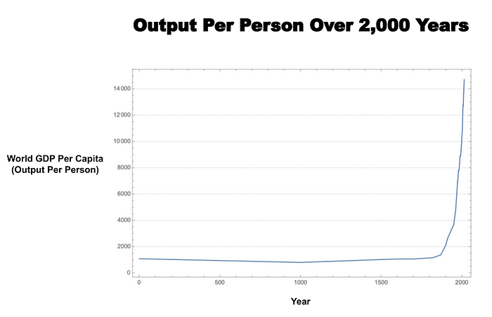

_Source:_ [_A Simple Combinatorial Model of World Economic History_](https://arxiv.org/pdf/1811.04502.pdf)  

来源：世界经济史的简单组合模型

To more deeply appreciate this shift, consider the following:  

要更深入地理解这种转变，请考虑以下几点：

-   **This is a unique event in all of history.** “Modern humans first emerged about 100,000 years ago. For the next 99,800 years or so, nothing happened… Then — just a couple of hundred years ago — people started getting richer. And richer and richer still,” [states](https://www.wsj.com/articles/SB118134633403829656) Economist Steven Landsburg.  
    
    这是历史上独一无二的事件。“现代人类最早出现在大约10万年前。在接下来的99,800年左右的时间里，什么也没发生......然后——就在几百年前——人们开始变得更富有。而且越来越富有，“经济学家史蒂文·兰茨伯格说。
-   **Before it happened, the average American lived on about a dollar a day (in today’s dollars).** “Before 1750, almost nowhere in the world were living standards something that we would call anything but miserable and poor,”according to [economic historian Joel Mokyr](https://open.spotify.com/episode/4FfiVmGR2pOsVdDU2oS5L7?si=XMImo3piSd2oYrOkCFC7Qg&t=191&context=spotify%3Ashow%3A13BcvdCZQl3CiF8NimP7xa&nd=1). Economist Steven Landsburg [adds](https://www.wsj.com/articles/SB118134633403829656), “Almost everyone lived on the modern equivalent of $400 to $600 a year, just above the subsistence level.”  
    
    在此之前，美国人平均每天靠大约一美元（以今天的美元计算）生活。“在1750年之前，世界上几乎没有任何地方的生活水平是我们可以称之为悲惨和贫穷的，”经济历史学家乔尔·莫基尔（Joel Mokyr）说。经济学家史蒂文·兰茨伯格（Steven Landsburg）补充说：“几乎每个人都靠相当于每年400至600美元的现代生活费，略高于维持生计的水平。
-   **Before it happened, day-to-day life was brutal.** “In 1870, farm and urban working-class family members \[in the United States\] bathed in a large tub in the kitchen, often the only heated room in the home, after carrying cold water in pails from the outside and warming it over the open-hearth fireplace,” according to [economic historian Robert Gordon](https://amzn.to/3xJMeIr).  
    
    在它发生之前，日常生活是残酷的。经济历史学家罗伯特·戈登（Robert Gordon）说：“1870年，\[美国\]农场和城市工人阶级家庭成员在厨房的大浴缸里洗澡，通常是家里唯一的暖气房间，他们从外面用桶装着冷水，在平炉壁炉上加热。

**Bottom line:** The people alive between 1870–1970 experienced unprecedented change. Now, imagine being an adult in 1970. Think about how you’d see the world…  

一句话：生活在1870年至1970年间的人们经历了前所未有的变化。现在，想象一下在1970年成为一个成年人。想想你会如何看待这个世界...

## Looking Back From 1970, You See A Wondrous Productivity And Lifestyle Boom  

回顾1970年，你会看到一个奇妙的生产力和生活方式的繁荣

Below are a few examples of the changes and their implications. Of particular note are:  

以下是更改及其含义的一些示例。特别值得注意的是：

-   The shortening of the workweek from 68 hours to 40 hours.  
    
    每周工作时间从68小时缩短到40小时。
-   The removal of child labor  
    
    消除童工
-   Wondrous technologies in the most important parts of life  
    
    生活中最重要的部分的奇妙技术
-   100x increase in worker safety  
    
    工人安全性提高 100 倍

## **#1: Shortening of the workweek from 68 hours to 40 hours  

#1：将每周工作时间从68小时缩短到40小时**


[Cotton Gin](https://www.loc.gov/item/2016796262/) (1890–1906) [Detroit Publishing Company](https://www.loc.gov/collections/detroit-publishing-company/about-this-collection/)  

轧棉机（1890-1906）底特律出版公司

This means parents could be home with their children more, spend more time with friends, and spend more time on their mental and physical health.  

这意味着父母可以更多地在家陪伴孩子，花更多的时间与朋友在一起，花更多的时间在他们的身心健康上。

## **#2: Removal of child labor  

#2：消除童工**


Many children started work at 4 years old and worked 12-hour days doing intricate work that benefitted from having small hands or dangerous work that required working in small places adults couldn’t reach. Around the same time that children were removed from factories, they were put in schools. As a result of this shift and an explosion of free public education, [illiteracy went down 20x](https://nces.ed.gov/pubs93/93442.pdf) while [school enrollment doubled](https://nces.ed.gov/pubs93/93442.pdf). As a result, the seeds were planted for an educated workforce and society.  

许多孩子从4岁开始工作，每天工作12个小时，做复杂的工作，这些工作受益于小手或需要在成年人无法到达的小地方工作的危险工作。大约在儿童被从工厂带走的同时，他们被送进了学校。由于这种转变和免费公共教育的爆炸式增长，文盲率下降了20倍，而入学率翻了一番。结果，为受过教育的劳动力和社会播下了种子。

## **#3: Wondrous technologies in the most important parts of life  

#3：生活中最重要的奇妙技术**

We see inventions like cars, elevators, automobiles, plumbing, heating/cooling, penicillin, and electricity. Collectively, these make life more safe, mobile, comfortable, and urban.  

我们看到汽车、电梯、汽车、管道、加热/冷却、青霉素和电力等发明。总的来说，这些使生活更加安全、移动、舒适和城市化。

## **#4: 100x increase in worker safety  

#4：工人安全性提高 100 倍**

Worker safety means things like protection from accidents, disease, pollution, fires, etc. along with protections in the case of injury. As an example of the extreme shift that happened, **19th century US Steel workers had a one in seven chance of being killed before 50 and a one in three chance of being disabled,** [according to economic historian Brad Delong](https://amzn.to/3VKMHEP).  

工人安全是指防止事故、疾病、污染、火灾等，以及在受伤时提供保护。根据经济历史学家布拉德·德隆（Brad Delong）的说法，作为极端转变的一个例子，19世纪的美国钢铁工人有七分之一的机会在50岁之前被杀，三分之一的机会成为残疾人。

In addition, people started receiving benefits like health care, paid vacations, social security, and disability protection. This gave people a new level of safety knowing that they would be taken care of rather than their life being destroyed forever if something went wrong.  

此外，人们开始获得医疗保健、带薪假期、社会保障和残疾保护等福利。这给了人们一个新的安全水平，知道如果出现问题，他们会得到照顾，而不是他们的生活被永远摧毁。

With these huge gains, it was no wonder that…  

有了这些巨大的收益，也难怪...

## Looking Forward From 1970 You Could Envision Utopia  

展望1970年，你可以想象乌托邦


_Mural commissioned by Walt Disney’s Epcot Center in 1983 and painted by_ [_Robert and Louise McCall_](https://www.mccallstudios.com/the-prologue-and-the-promise/)  

1983年由沃尔特·迪斯尼未来世界中心委托绘制的壁画，由罗伯特和路易丝·麦考尔绘制

Given the massive change between 1870–1970, looking forward from 1970, you could confidently see the potential for another 50x boom because of the computer revolution and digital knowledge work.  

鉴于 1870 年至 1970 年间的巨大变化，展望 1970 年，您可以自信地看到由于计算机革命和数字知识工作而再次实现 50 倍繁荣的潜力。

The promise was that what machines were for our bodies, computers would be for our brains… except on steroids. Furthermore, rather than sending products/services around the world on planes and ships, we could send bits across the world instantly at zero cost.  

承诺是机器是我们的身体，计算机是我们的大脑......除了类固醇。此外，我们无需通过飞机和轮船将产品/服务发送到世界各地，而是可以立即以零成本将比特发送到世界各地。

**The shift to digital knowledge work made it possible to imagine a knowledge work revolution that could eclipse the manual worker productivity revolution:  

向数字知识工作的转变使人们有可能想象一场知识工作革命，这场革命可能会使体力劳动者的生产力革命黯然失色：**

-   **30-Hour work weeks** with work being voluntary for many  
    
    每周工作 30 小时，许多人自愿工作
-   **Freedom** over what, when, where, how, and with whom you work  
    
    自由决定什么、何时、何地、如何以及与谁一起工作
-   **Passion-fueled** work that is creative and curiosity-filled  
    
    充满激情的工作，充满创造力和好奇心
-   **Meaningful work** that connects us to other humans and purpose  
    
    有意义的工作，将我们与他人和目标联系起来
-   **Amazing technologies** like living forever, all-powerful artificial intelligence, flying cars, etc  
    
    惊人的技术，如长生不老、全能人工智能、飞行汽车等

For example, in 1970, MIT AI pioneer Marvin Minsky predicted in Life Magazine that:  

例如，1970年，麻省理工学院人工智能先驱马文·明斯基（Marvin Minsky）在《生活》杂志上预测：

> _“In from three to eight years we will have a machine with the general intelligence of an average human being.”  
> 
> “在三到八年内，我们将拥有一台具有普通人一般智能的机器。_

Not only that, in 1933, President Franklin D. Roosevelt supported and the Senate passed a [30-hour work week bill](https://www.washingtonpost.com/history/2021/09/06/40-hour-work-week-fdr/). Though, it ultimately fell through. In 1956, Richard Nixon predicted a 32-hour workweek in the “not too distant future.”  

不仅如此，1933年，富兰克林·罗斯福总统支持，参议院通过了一项每周工作30小时的法案。虽然，它最终失败了。1956年，理查德·尼克松（Richard Nixon）预测，在不久的将来，每周工作32小时。

In other words, **if you were prone to optimism and living in 1970, you could imagine a work utopia in the 21st century.**  

换句话说，如果你倾向于乐观并生活在1970年，你可以想象21世纪的工作乌托邦。

But something odd happened…  

但是奇怪的事情发生了...

## Bizarrely, In 1970, Lots Of Things Started Going Downhill  

奇怪的是，在1970年，很多事情开始走下坡路。

> _“The simple claim that in modernity ‘everything goes faster and faster’… is transparently false.”  
> 
> “简单的说法是，在现代性中，'一切都越来越快'......显然是错误的。  
> 
> — Sociologist Hartmut Rosa in_ [_Social Acceleration_](https://amzn.to/3e5pkom)  
> 
> ——社会学家哈特穆特·罗莎（Hartmut Rosa）在《社会加速》中

At the exact point you’d expect things to go from good to great, bad things started happening.  

在你期望事情从好到大的确切时刻，坏事开始发生。

For starters, the productivity growth rate decreased significantly (known as the productivity paradox):  

首先，生产率增长率显著下降（称为生产率悖论）：

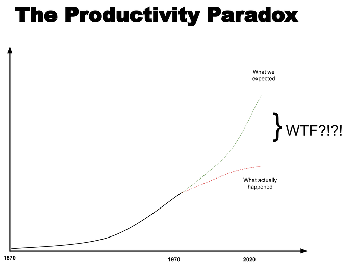

This phenomenon happened worldwide — not just in the United States. The following chart of GDP per hour (output per hour) growth captures the global phenomenon more precisely…  

这种现象发生在全世界——不仅仅是在美国。下面的每小时GDP增长图表（每小时产出）更准确地捕捉了全球现象......

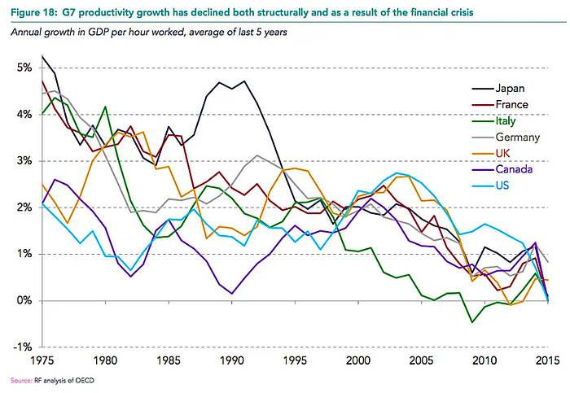

At the same time that productivity overall was increasing (even if the growth rate dropped), most of the productivity gains went to the top earners while the middle class stagnated. This is known as the Great Decoupling…  

与此同时，整体生产率正在提高（即使增长率下降），大部分生产率增长都流向了最高收入者，而中产阶级则停滞不前。这被称为大解耦...

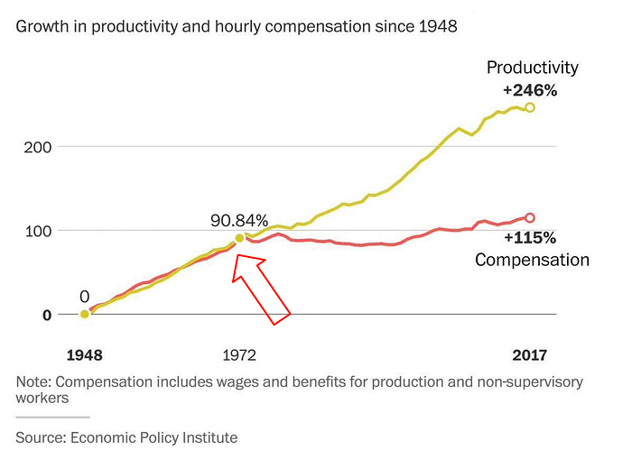

**This stagnation is a big deal.** When you stop believing that your kids will have a better life than you, you stop believing in the “American dream.” And according to a 2022 [survey of 1,300+ people in 19 countries](https://www.pewresearch.org/fact-tank/2022/08/11/large-shares-in-many-countries-are-pessimistic-about-the-next-generations-financial-future/), **70% of survey respondents believe their children would be worse off financially** — a significant increase compared to previous years.  

这种停滞是一件大事。当你不再相信你的孩子会过上比你更好的生活时，你就不再相信“美国梦”。根据 2022 年对 1,300 个国家/地区的 19+ 人进行的一项调查，70% 的受访者认为他们的孩子经济状况会更糟——与往年相比显着增加。

Other examples of stagnation include:  

停滞的其他例子包括：

-   The price of energy is stagnant rather than decreasing.  
    
    能源价格停滞不前，而不是下降。
-   Transportation isn’t moving faster than decades ago (ie, cars & planes).  
    
    交通的发展速度并不比几十年前快（即汽车和飞机）。
-   Biotech innovation is ⅓ the rate compared to 20 years ago.  
    
    与20年前相比，生物技术创新的速度是20年前的1/3。
-   Healthcare and education costs are increasing significantly without a commensurate increase in results.  
    
    医疗保健和教育成本正在大幅增加，而结果却没有相应的增加。
-   The average lifespan in developed countries is stalling.  
    
    发达国家的平均寿命正在停滞不前。
-   Agricultural innovation has decreased significantly for the first time in nearly a century.  
    
    农业创新近一个世纪以来首次大幅下降。
-   Large construction projects are more expensive and take much longer.  
    
    大型建筑项目更昂贵，需要更长的时间。
-   [And much more](https://michaeldsimmons.medium.com/surprising-stagnation-stats-a4ae66ff49de). 等等。

These before-and-after pictures of the physical world further capture what hasn’t changed in ways that words can’t:  

这些物理世界的前后图片进一步捕捉到了文字无法改变的东西：

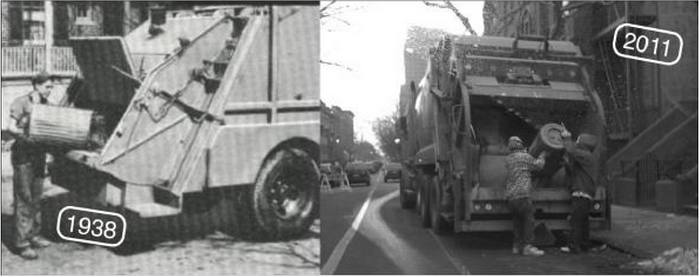

_Source:_ [_The American Technological Challenge_](https://amzn.to/3TSkpq0)  

来源：美国技术挑战


_Source:_ [_The American Technological Challenge_](https://amzn.to/3TSkpq0)  

来源：美国技术挑战

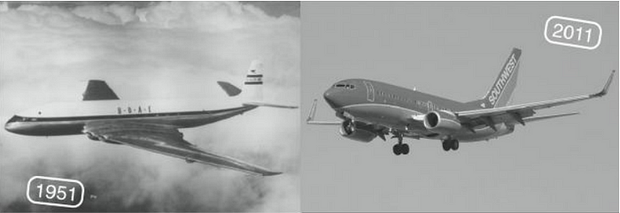

_Source:_ [_The American Technological Challenge_](https://amzn.to/3TSkpq0)  

来源：美国技术挑战

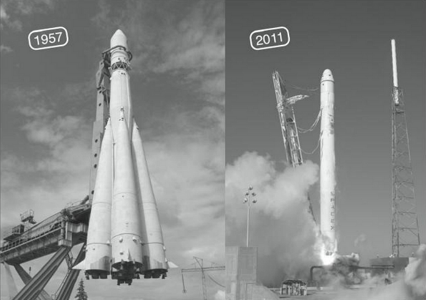

_Source:_ [_The American Technological Challenge_](https://amzn.to/3TSkpq0)  

来源：美国技术挑战

In fact, the list of things going haywire in the early 1970s until now is so large and odd that there is an entire research-based, well-known site devoted to it called [WTF Happened In 1971?](https://wtfhappenedin1971.com/).  

事实上，从 1970 年代初到现在，混乱的事情清单是如此之大和奇怪，以至于有一个完整的基于研究的知名网站专门讨论它，称为 WTF 发生在 1971 年？。

**To summarize:** We have this unprecedented 50x rise in manual work productivity between 1870 and 1970. Then, at the exact time you’d expect things to have another 50x boost because of the computer revolution, things start slowing down.  

总结一下：在 1870 年至 1970 年间，我们的手工工作效率空前提高了 50 倍。然后，在你期望由于计算机革命而再有 50 倍提升的确切时间，事情开始放缓。

**The big implication:** Ultimately, the productivity paradox points to a gaping hole in our general understanding of one of humanity’s greatest achievements — The Great Boom between 1870–1970. And, it’s more important than ever that we fill that hole now if we want it to dramatically improve everyone’s lifestyle and well-being in the future. Because, if we don’t, things could go from not good to plain bad…  

最大的影响是：最终，生产力悖论指向了我们对人类最伟大成就之一——1870-1970年间的大繁荣——的一般理解存在巨大漏洞。而且，如果我们希望它在未来显着改善每个人的生活方式和福祉，我们现在填补这个漏洞比以往任何时候都更加重要。因为，如果我们不这样做，事情可能会从不好变成坏......

## The Productivity Paradox May Be The Most Important Societal Problem We Face  

生产力悖论可能是我们面临的最重要的社会问题

> _“The only way to raise living standards over the long term is to raise productivity.” — Ray Dalio  
> 
> “从长远来看，提高生活水平的唯一方法是提高生产力。”_

The Productivity Paradox is not an idle curiosity.  

生产力悖论不是无所事事的好奇心。

It’s life-changing and relevant for all of us. It impacts our lifestyles, careers, government, society, and economy at fundamental levels. Even if we don’t realize it, the effects of the productivity paradox already touch our lives in many ways…  

它改变了我们所有人的生活，与所有人息息相关。它从根本上影响着我们的生活方式、职业、政府、社会和经济。即使我们没有意识到这一点，生产力悖论的影响已经在很多方面影响了我们的生活......

For example, if societal and individual productivity growth continues to plateau or decline, it could mean war, generational lifestyle stagnation, our currency going to zero over time, the rise of communism, environmental catastrophe, and stalling of innovation.  

例如，如果社会和个人生产率增长继续停滞或下降，这可能意味着战争、代际生活方式停滞、我们的货币随着时间的推移归零、共产主义的兴起、环境灾难和创新的停滞。

Unfortunately, these aren’t wild predictions. They are extrapolations of what’s already happening now and backed up by history. This is not the first productivity paradox ever, so we don’t have to completely guess what the implications might be.  

不幸的是，这些并不是疯狂的预测。它们是对现在已经发生的事情的推断，并得到历史的支持。这不是有史以来第一个生产力悖论，所以我们不必完全猜测其影响可能是什么。

Let me expand on each potential future to let the severity sink in…  

让我扩展每个潜在的未来，让严重性沉入......

-   **War.** Less productivity means a smaller pie for everyone to split. Escalating tension between the haves and have nots could devolve into conflicts (civil war, coup, etc). Famous investor and student of history Ray Dalio summarizes the situation: “When wealth and values gaps are large and there is an economic downturn, it is likely that there will be a lot of conflict about how to divide the pie.”  
    
    生产力降低意味着每个人都可以瓜分的蛋糕更小。富人和穷人之间不断升级的紧张关系可能会演变成冲突（内战、政变等）。著名投资人、历史系学生雷·达里奥（Ray Dalio）总结了当时的情况：“当财富和价值观差距较大，出现经济低迷时，很可能在如何分饼上出现很多冲突。
-   **Currency That Goes To Zero.** Government debt will continue to skyrocket (less productivity creates less tax revenue). And if [history is a teacher](https://www.linkedin.com/pulse/changing-value-money-ray-dalio/), governments will print more and more money to pay off that debt, which will cause more and more inflation, which devalues the currency. In a surprisingly extreme prediction, one of the world’s most successful and oldest (nearly 100 years old) investors Charlie Munger predicts ([40 seconds into this video](https://www.youtube.com/watch?v=uxpL4fhIEAg&ab_channel=FREENVESTING)) that the US currency will go to zero in the next 100 years and shares many historical precedents of where extreme inflation led to the demise of democracies.  
    
    归零的货币。政府债务将继续飙升（生产率下降，税收收入减少）。如果历史是老师，政府将印制越来越多的货币来偿还债务，这将导致越来越多的通货膨胀，从而使货币贬值。在一个令人惊讶的极端预测中，世界上最成功和最古老（近100岁）的投资者之一查理芒格预测（本视频40秒）美元将在未来100年内归零，并分享了许多极端通货膨胀导致民主国家消亡的历史先例。
-   **Rise Of Communism.** In difficult times, there is a backlash against capitalism and democracy and a rise in socialism. In a fascinating [clip](https://www.youtube.com/clip/UgkxtLVh8fD9cnxnJFKHTs332HpLEBUVGKrZ) on the Lex Fridman podcast, Harvard-trained economist Richard Wolff shares the surprising stat that there was a huge rise of the Communist party. In other words, the more growth stalls, the more people there are calling for revolution, not just reform. In fact, one of the great management researchers of all time Peter Drucker [argues](http://archive.wilsonquarterly.com/essays/rise-knowledge-society-0) that the prosperity from the manual work productivity revolution was the reason that the United States did not become Communist during the Great Depression.  
    
    共产主义的兴起。在困难时期，对资本主义和民主的强烈反对以及社会主义的兴起。在莱克斯·弗里德曼（Lex Fridman）播客的一个引人入胜的片段中，哈佛大学训练有素的经济学家理查德·沃尔夫（Richard Wolff）分享了一个令人惊讶的数据，即共产党的巨大崛起。換句話說，越是停滯增長，就越有人呼籲革命，而不僅僅是改革。事实上，有史以来最伟大的管理研究者之一彼得·德鲁克（Peter Drucker）认为，手工劳动生产率革命的繁荣是美国在大萧条期间没有成为共产主义的原因。
-   **Environmental Catastrophe.** The way we use resources to create energy is already unsustainable. Pollution will eventually destroy our world if we don’t learn how to create more energy and goods with dramatically fewer resources.  
    
    环境灾难。我们利用资源创造能源的方式已经是不可持续的。如果我们不学会如何用更少的资源创造更多的能源和商品，污染最终会摧毁我们的世界。

None of these futures are guaranteed to happen. But they are serious scenarios discussed by many of the smartest people in the world, and that alone is concerning.  

这些未来都不能保证发生。但它们是世界上许多最聪明的人讨论的严肃场景，仅此一项就令人担忧。

**Bottom line:** This state of affairs is not sustainable. The consequences are predictable based on history. And those consequences have been already playing out and could get much worse.  

一句话：这种状况是不可持续的。根据历史，后果是可以预见的。这些后果已经在上演，而且可能会变得更糟。

**There comes a point at which one has to declare a state of urgency, if not emergency. And that moment is now.  

到了某个时刻，人们必须宣布紧急状态，如果不是紧急情况的话。而这一刻就是现在。**

The productivity growth rate is a fundamental input that impacts lots of other things we care deeply about.  

生产率增长率是一个基本输入，它影响着我们深切关心的许多其他事情。

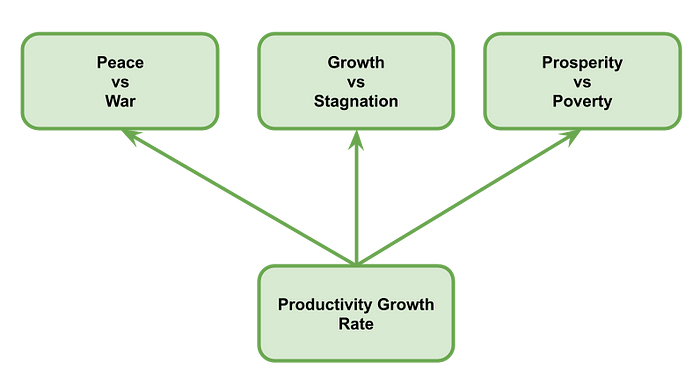

The productivity paradox is arguably the most important puzzle that will determine the future of our society and our careers. We are on a purgatory between hell and heaven. Hell of escalating conflict and stagnation. Heaven of a work utopia.  

生产力悖论可以说是决定我们社会和职业未来的最重要的难题。我们正处于地狱和天堂之间的炼狱中。不断升级的冲突和停滞的地狱。工作乌托邦的天堂。

Given the importance of productivity, you would expect a few things to happen:  

鉴于生产力的重要性，您可能会期望发生一些事情：

-   It would be the headline of every major newspaper.  
    
    它将成为每家主要报纸的头条新闻。
-   World leaders would be constantly talking about it.  
    
    世界领导人会不断谈论它。
-   Knowledge workers and companies would go all out increasing productivity.  
    
    知识工作者和公司将全力以赴提高生产力。

Yet, not only is productivity growth rate not talked about, there is a huge backlash against it…  

然而，不仅生产率增长率没有被谈论，而且对它有巨大的反弹......

## Inside The Productivity Backlash  

生产力反弹的内幕

At first, I thought the idea of a backlash against productivity was ridiculous. I wondered, how can someone be against the idea of getting more of what they want with less cost? But, as I read books and articles that I actually disagreed with at first, I became aware of the compelling points I could not ignore. I realized that I had only been looking at productivity through my own lens rather than empathizing with other people’s lived experience.  

起初，我认为反对生产力的想法是荒谬的。我想知道，有人怎么能反对用更少的成本获得更多他们想要的东西的想法？但是，当我阅读起初我实际上不同意的书籍和文章时，我意识到我不能忽视的引人注目的观点。我意识到我只是通过自己的视角来看待生产力，而不是同情他人的生活经历。

Below is a summary of the core reasons there is a backlash against productivity:  

以下是对生产力的强烈反对的核心原因的摘要：

-   **More productivity doesn’t mean less work for employees.** Workers feel pressured to work harder even as they become more efficient.  
    
    更高的生产力并不意味着更少的员工工作。即使工人变得更有效率，他们也会感到更加努力地工作的压力。
-   **Workers aren’t receiving the gains from their increased productivity.** The gains in productivity are not redistributed to workers in a way they feel is fair.  
    
    工人并没有从提高生产力中获得收益。生产率的提高不会以他们认为公平的方式重新分配给工人。
-   **Hustle culture isn’t appealing.** Many people aren’t excited about making every work moment more productive and filling every free moment with more work.  
    
    喧嚣文化并不吸引人。许多人并不热衷于让每个工作时刻都更有成效，用更多的工作填满每一个空闲时刻。
-   **As tasks are systematized, they can become boring and mechanical.** Extreme specialization may be more efficient, but it can lead to simple repetitive work that is boring. Many associate productivity with being overly structured or mechanical. For example, one person I talked to for this article said that one of his bosses once said to him, “When you walk in the door, I only want everything below your neck.”  
    
    随着任务的系统化，它们可能会变得无聊和机械。极端专业化可能更有效率，但它可能导致无聊的简单重复性工作。许多人将生产力与过度结构化或机械化联系起来。例如，我为这篇文章采访的一个人说，他的一位老板曾经对他说：“当你走进门时，我只想要你脖子以下的所有东西。
-   **Many are jaded by failed productivity experiments.** Many productivity experiments fail and even make things worse or more frustrating (ie — lifeless call center agents reading empty scripts).  
    
    许多人对失败的生产力实验感到厌倦。许多生产力实验失败了，甚至使事情变得更糟或更令人沮丧（即 - 毫无生气的呼叫中心座席阅读空脚本）。
-   **Increased overall productivity has directly hurt certain groups.** Rapid changes in society because of productivity growth inevitably disadvantage people who live in certain regions, who work in specific industries and professions, or who come from certain cultures. For example, outsourcing America’s manufacturing turned many company towns into ghost towns that now suffer from brain drain, falling property prices, poverty, and addiction.  
    
    整体生产力的提高直接伤害了某些群体。由于生产力增长，社会的迅速变化不可避免地使生活在某些地区、从事特定行业和专业或来自某些文化的人处于不利地位。例如，外包美国的制造业将许多公司城镇变成了鬼城，现在遭受人才流失，房地产价格下跌，贫困和成瘾的困扰。

While there are many signs of productivity backlash, below are some of the most apparent examples.  

虽然有许多生产力反弹的迹象，但以下是一些最明显的例子。

For one, there is now a whole genre of anti-productivity bestsellers…  

首先，现在有一整类反生产力的畅销书......

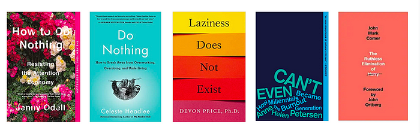

For example, in [Four Thousand Weeks](https://amzn.to/3sksOXL), author Oliver Burkeman argues:  

例如，在《四千周》中，作者奥利弗·伯克曼（Oliver Burkeman）认为：

> _The modern discipline known as time management —_ **_like its hipper cousin, productivity_** _— is a depressingly narrow-minded affair, focused on how to crank through as many work tasks as possible, or on devising the perfect morning routine, or on cooking all your dinners for the week in one big batch on Sundays._  
> 
> 被称为时间管理的现代学科——就像它的时髦表亲生产力一样——是一件令人沮丧的狭隘的事情，专注于如何完成尽可能多的工作任务，或者设计完美的早晨例行公事，或者在周日一大批量地烹饪一周的所有晚餐。

We can also see the tension between pro-productivity and anti-productivity culture in these two opposing memes about the same incredibly destabilizing event of Covid:  

我们还可以在这两个对立的模因中看到亲生产力和反生产力文化之间的紧张关系，这两个模因是关于 Covid 同样令人难以置信的不稳定事件：

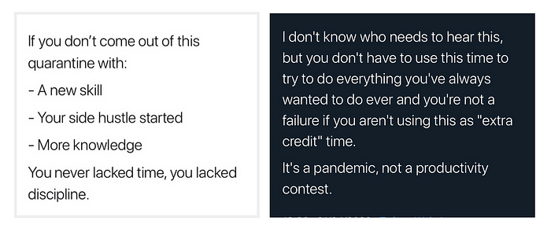

For many, productivity culture is a tool that the ruling class uses in the context of capitalism to get as much work out of workers as possible.  

对许多人来说，生产力文化是统治阶级在资本主义背景下用来从工人那里获得尽可能多的工作的工具。

For example, [How Millennials Became The Burnout Generation](https://www.buzzfeednews.com/article/annehelenpetersen/millennials-burnout-generation-debt-work), which was read over six million times, makes the case that capitalism is the root cause:  

例如，被阅读超过六百万次的《千禧一代如何成为倦怠的一代》表明，资本主义是根本原因：

> Until or in lieu of a revolutionary overthrow of the capitalist system, how can we hope to lessen or prevent — instead of just temporarily stanch — burnout? Change might come from legislation, or collective action, or continued feminist advocacy, but it’s folly to imagine it will come from companies themselves. Our capacity to burn out and keep working is our greatest value.  
> 
> 在革命推翻资本主义制度之前或代替革命推翻资本主义制度，我们怎么能希望减少或防止——而不仅仅是暂时停滞——倦怠呢？改变可能来自立法、集体行动或持续的女权主义倡导，但想象它来自公司本身是愚蠢的。我们精疲力竭和继续工作的能力是我们最大的价值。

The late anthropologist David Graeber, author of [Bullshit Jobs](https://amzn.to/3Dm72r5), which also started out as [an article with millions of views](https://www.strike.coop/bullshit-jobs/) puts the blame on the ruling class:  

已故人类学家大卫·格雷伯（David Graeber）是《胡说八道》（Bullshit Jobs）的作者，该书最初也是一篇拥有数百万次浏览的文章，将责任归咎于统治阶级：

> _The answer clearly isn’t economic: it’s moral and political. The ruling class has figured out that a happy and productive population with free time on their hands is a mortal danger. (Think of what started to happen when this even began to be approximated in the sixties.) And, on the other hand, the feeling that work is a moral value in itself, and that anyone not willing to submit themselves to some kind of intense work discipline for most of their waking hours deserves nothing, is extraordinarily convenient for them.  
> 
> 答案显然不是经济上的：而是道德和政治上的。统治阶级已经发现，一个有空闲时间的幸福和富有成效的人口是一个致命的危险。（想想在六十年代开始近似的时候，开始发生了什么。另一方面，工作本身就是一种道德价值，任何不愿意在醒着的大部分时间里服从某种紧张的工作纪律的人都不应该得到任何东西，这对他们来说非常方便。_

Finally, this viral tweet below from former US Secretary of Labor Robert Reich encapsulates a growing sentiment against wealth. It implies that wealth cannot be achieved by entrepreneurs and innovators who start from nothing and who become more innovative by innovating amazing products and services that customers love:  

最后，美国前劳工部长罗伯特·赖希（Robert Reich）在下面发布的这条病毒式推文概括了日益增长的反对财富的情绪。这意味着企业家和创新者无法从零开始，并通过创新客户喜爱的惊人产品和服务而更具创新性：

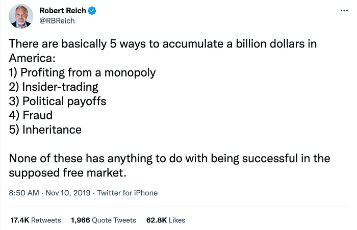

As I spent more time considering all of this backlash, I felt like I was shifting between two realities. Sometimes I felt like people were unfairly judging productivity. Other times, I wondered, “Wow! Maybe there are enough things wrong about productivity that there is a deeper structural issue culturally or economically that I’ve been too biased to see.” (More on how I ultimately synthesized everything later in the article)  

当我花更多的时间考虑所有这些反弹时，我觉得我正在两个现实之间切换。有时我觉得人们不公平地评判生产力。其他时候，我想知道，“哇！也许生产力有足够多的错误，以至于在文化或经济上存在更深层次的结构性问题，我太偏颇了，看不到。（更多关于我最终如何综合所有内容的文章后面）

**Bottom line:** It is now cool to publicly be against getting more of what you value with fewer and fewer resources. For many, productivity has become a bad word from bad people (wealthy people) from a bad system (capitalism).  

一句话：现在公开反对用越来越少的资源获得更多你重视的东西是很酷的。对许多人来说，生产力已经成为坏人（富人）坏人（富人）坏制度（资本主义）的坏词。

Not only are we having a backlash against productivity, but the productivity paradox is also almost completely hidden from day-to-day conversation or news…  

我们不仅对生产力有强烈反对，而且生产力悖论也几乎完全隐藏在日常对话或新闻中......

## We Think Productivity Is Skyrocketing At The Same Time It’s Stalling  

我们认为生产力在飙升的同时却在停滞不前

I was born in 1981. I got my first computer when I was 10 years old — a black & white Mac — in 1991. Growing up, I was always told a narrative of being lucky to be alive during a time of incredible progress. I devoured sci-fi like kids eat candy.  

我出生于1981年。1991年，我10岁时有了第一台电脑——一台黑白Mac。在成长过程中，我总是被告知，在一个令人难以置信的进步时期，我很幸运能活着。我像孩子吃糖果一样吞噬科幻小说。

The fundamental tentpole that the progress narrative rested upon was Moore’s Law, which had been true for decades and held the promise to continue for many decades more:  

进步叙事所依赖的基本支柱是摩尔定律，几十年来一直如此，并有望持续数十年：

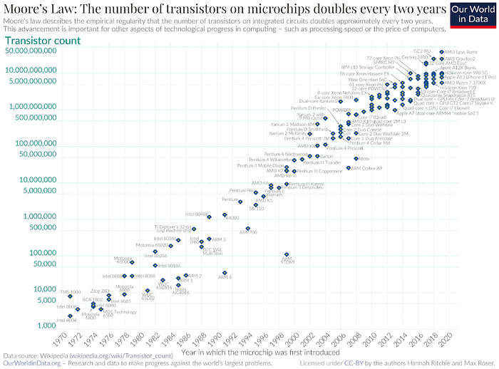

Moore’s Law is the pattern that approximately every 18 months, the price/performance of transistor chips doubles. Given that transistor chips are a core input of the digital world, we can see things getting better every year.  

摩尔定律是大约每18个月，晶体管芯片的价格/性能翻一番的模式。鉴于晶体管芯片是数字世界的核心输入，我们可以看到事情每年都在好转。

**Not once in my first 35 years did I hear that overall productivity might actually be slowing down.  

在我最初的35年里，我从来没有一次听说整体生产力实际上可能会放缓。**

And apparently the same is true for many others. In the process of writing this article, I talked to several tech-savvy, well-informed friends and none of them knew about the slowing productivity growth rate. They thought change was faster than ever.  

显然，许多其他人也是如此。在撰写本文的过程中，我与几位精通技术、消息灵通的朋友进行了交谈，他们都不知道生产率增长率放缓。他们认为变化比以往任何时候都快。

**This gap between the narrative and the actual productivity stats was hard to reconcile at first.  

叙事和实际生产力统计数据之间的这种差距起初很难调和。**

On the one hand, I’d read articles about how AI is changing everything. Then, I’d [read an academic study](https://www.nber.org/system/files/working_papers/w24001/w24001.pdf) about how productivity growth from AI was invisible in statistics.  

一方面，我读过关于人工智能如何改变一切的文章。然后，我读到了一项关于人工智能的生产力增长如何在统计学中不可见的学术研究。

It all begged questions that sounded like zen koans — riddles one needs to be enlightened for in order to understand:  

这一切都提出了听起来像禅宗公案的问题——为了理解，需要开悟的谜语：

-   How can things be slowing down when change is speeding up?  
    
    当变化加速时，事情怎么会放缓？
-   If technology is the root cause of progress, how can technology accelerate at the same time productivity growth is slowing down?  
    
    如果技术是进步的根本原因，那么技术如何在生产率增长放缓的同时加速？

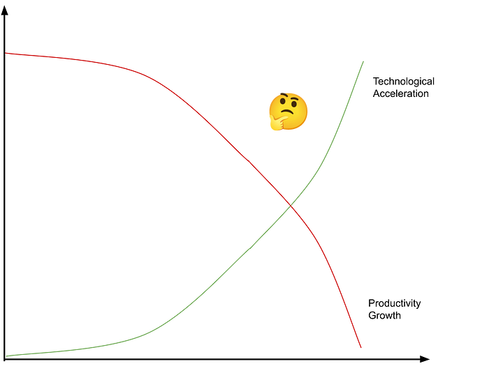

To begin to understand these questions, we must first swallow a difficult truth articulated by PayPal co-founder and investor Peter Thiel:  

要开始理解这些问题，我们必须首先吞下联合创始人兼投资者彼得·泰尔（Peter Thiel）阐述PayPal一个困难的事实：

> _“The first step is to understand where we are. We’ve spent 40 years wandering in the desert, and we think that it’s an enchanted forest. If we’re to find a way out of this desert and into the future, the first step is to see that we’ve been in a desert.”  
> 
> “第一步是了解我们所处的位置。我们在沙漠中徘徊了40年，我们认为这是一片迷人的森林。如果我们要找到离开这片沙漠并走向未来的出路，第一步就是看到我们一直在沙漠中。_
> 
> _— Peter Thiel — 彼得·泰尔_

Technologist J. Storrs Hall, author of [Where Is My Flying Car?](https://amzn.to/3MFgs5y), provides important context for why productivity paradox might be invisible — the people who are closest to the technology industry have the most trouble not seeing change:  

技术专家J. Storrs Hall，《我的飞行汽车在哪里？》一书的作者，为为什么生产力悖论可能是看不见的提供了重要的背景——最接近技术行业的人最难看不到变化：

> _I was somewhat shielded from the overall trend by virtue of being in computer science, which did in fact grow and increase in its capabilities at the rate the science fiction writers and futurists expected. So it took a while for me to come to the realization that there were a lot of technologies out there that were more like space than computers.  
> 
> 由于从事计算机科学，我在某种程度上被屏蔽了整体趋势，事实上，计算机科学确实以科幻小说作家和未来学家所期望的速度增长和提高其能力。因此，我花了一段时间才意识到，有很多技术更像是太空而不是计算机。_

**Next, we need to have a deeper understanding of the difference between productivity, productivity growth rate and technological change:  

接下来，我们需要更深入地了解生产率、生产率增长率和技术变革之间的区别：**

-   **Productivity.** Workers creating goods and services with less labor and resources. It is the ratio of output over input.  
    
    生产力。工人用更少的劳动力和资源创造商品和服务。它是输出与输入的比率。
-   **Technological Innovation.** While innovations can improve technology, not all technological innovations increase the productivity of knowledge workers. For example, the smartphone is one of the major technological innovations in human history. At the same time, it has a negligible effect on the productivity of most knowledge workers.  
    
    技术创新。虽然创新可以改进技术，但并非所有技术创新都能提高知识工作者的生产力。例如，智能手机是人类历史上的重大技术创新之一。同时，它对大多数知识工作者的生产力的影响可以忽略不计。
-   **Productivity Growth Rate.** Productivity growth rate is a function of how much _productivity increases_ for a certain _number of people_ over a _period of time_. Therefore, you can have a big technology that increases productivity, but if it only impacts a small group of people or happens over a really long period of time, it may have less of an impact on the productivity growth rate than one might expect.  
    
    生产率增长率。生产率增长率是一段时间内一定数量的人的生产率提高多少的函数。因此，你可以拥有一项提高生产力的大型技术，但如果它只影响一小群人或发生在很长一段时间内，它对生产率增长率的影响可能比人们预期的要小。

With these distinctions, we are now poised to understand the most well articulated explainer for why we aren’t seeing a productivity growth rate increase from the computer and Internet revolutions. In his 784-page book, [The Rise and Fall of American Growth](https://amzn.to/3LJPOs1), economic historian Robert Gordon makes the case that:  

有了这些区别，我们现在准备理解最清晰的解释，为什么我们没有看到计算机和互联网革命带来的生产率增长率。经济历史学家罗伯特·戈登（Robert Gordon）在他784页的《美国增长的兴衰》（The Rise and Fall of American Growth）一书中指出：

-   The productivity impact of the shift to Internet-connected computers is much smaller than we think. In fact, We’ve already experienced most of the benefits from it (primarily between 1994–2004).  
    
    转向联网计算机对生产力的影响比我们想象的要小得多。事实上，我们已经体验到了它的大部分好处（主要是在1994-2004年之间）。
-   The technologies (electricity, combustion engine) that came in the 20th century are much more impactful on our productivity than the computer revolution.  
    
    20世纪的技术（电力，内燃机）对我们的生产力的影响比计算机革命大得多。
-   There were other unique events that boosted productivity, which can only happen once such as women entering the workforce and a large percent of the population receiving formal education.  
    
    还有其他独特的事件提高了生产力，这些事件只能发生一次，例如女性进入劳动力市场和接受正规教育的人口比例很大。
-   The impact of the computer revolution is primarily on information, communication, and entertainment while the 20th century revolutions were much more broad and had a bigger impact on our living standards.  
    
    计算机革命的影响主要是信息，通信和娱乐，而20世纪的革命更广泛，对我们的生活水平产生了更大的影响。
-   “The equipment used in office work and the productivity of office employees closely resembles that of a decade ago.” In other words, people are primarily using computers to type up documents, browse the web, edit spreadsheets, send emails, create code, make designs, etc. The hardware and software we need for these activities already exists and is improving incrementally.  
    
    “办公室工作中使用的设备和办公室员工的生产力与十年前非常相似。换句话说，人们主要使用计算机来键入文档，浏览网页，编辑电子表格，发送电子邮件，创建代码，进行设计等。我们开展这些活动所需的硬件和软件已经存在，并且正在逐步改进。
-   Some incredible technologies can also negatively hurt productivity (at least for awhile). With regards to smartphones, Gordon points out, “Smartphones are used in the office for personal activities.” In other words, smartphones don’t help most knowledge workers be more productive. In fact, they may actually decrease production via tempting distractions we can hide from our employer.  
    
    一些令人难以置信的技术也会对生产力产生负面影响（至少在一段时间内）。关于智能手机，戈登指出，“智能手机在办公室用于个人活动。换句话说，智能手机并不能帮助大多数知识工作者提高工作效率。事实上，他们实际上可能会通过我们可以向雇主隐瞒的诱人干扰来减少产量。
-   Finally, Gordon argues that many of the most hyped technologies (AI, self-driving cars, 3D printing, robotics, etc.) won’t impact productivity as much as we think or they will happen over a long enough period of time where we won’t see a big leap in productivity growth rate.  
    
    最后，戈登认为，许多最被炒作的技术（人工智能、自动驾驶汽车、3D打印、机器人等）不会像我们想象的那样影响生产力，或者它们会在足够长的时间内发生，我们不会看到生产力增长率的大幅飞跃。

My initial emotional response to Gordon’s work started with incredulity. When I first saw the title, _The Rise And Fall Of American Growth_, it almost felt like clickbait to me. Given the narrative of constant progress backed up by the dizzying array of new things, the idea that productivity growth rate was slowing seemed silly.  

我对戈登工作的最初情绪反应始于怀疑。当我第一次看到标题《美国增长的兴衰》时，对我来说几乎就像是点击诱饵。鉴于令人眼花缭乱的新事物支持不断进步的说法，生产率增长率正在放缓的想法似乎很愚蠢。

But, as I understood what productivity growth rate actually measured, and I read his thoughts more closely as well as others in the stagnation school, I started to see this school as more and more compelling. Some others that influenced me include:  

但是，当我了解生产率增长率的实际衡量标准，并且我更仔细地阅读了他的想法以及停滞学派中的其他人的想法时，我开始认为这所学派越来越引人注目。其他一些影响我的包括：

-   Investor and PayPal co-founder Peter Thiel in his talk, [We wanted flying cars and we got 140 characters](https://medium.com/@danwwang/why-is-peter-thiel-pessimistic-about-the-future-of-technology-d2897f9659bb)  
    
    投资者兼PayPal联合创始人彼得·泰尔（Peter Thiel）在他的演讲中说：“我们想要飞行汽车，我们得到了140个字符
-   Jan Vijg, author of [The American Technological Challenge: Stagnation and Decline in the 21st Century](https://amzn.to/3In4s8g)  
    
    Jan Vijg，《美国技术挑战：21世纪的停滞与衰落》作者
-   Researcher Hartmut Rosa, author of [Social Acceleration: A New Theory Of Modernity](https://amzn.to/3K5rF0m)  
    
    研究员哈特穆特·罗莎（Hartmut Rosa），《社会加速：现代性的新理论》（Social Acceleration： A New Theory of Modernity）一书的作者
-   J Storrs Hall, author of [Where Is My Flying Car?](https://amzn.to/3YK0xrC)  
    
    J Storrs Hall，《我的飞行汽车在哪里？
-   Tyler Cowen, author of [The Great Stagnation](https://amzn.to/3YsFN89)  
    
    泰勒·考恩（Tyler Cowen），《大停滞》（The Great Stagnation）的作者
-   Stripe co-founder Patrick Collison and researcher Michael Nielsen, authors of [Science Is Getting Less Bang for Its Buck](https://www.theatlantic.com/science/archive/2018/11/diminishing-returns-science/575665/).  
    
    Stripe联合创始人帕特里克·科里森（Patrick Collison）和研究员迈克尔·尼尔森（Michael Nielsen）是《科学正在减少》的作者。
-   And hundreds of economists writing about the [productivity paradox](https://scholar.google.com/scholar?hl=en&as_sdt=0%2C30&q=productivity+paradox&btnG=&oq=productivi).  
    
    数百位经济学家撰写了关于生产率悖论的文章。

For example, I started questioning the idea that we’re on the cusp of huge leaps in artificial intelligence any day despite all of the headlines that we are.  

例如，我开始质疑这样一种观点，即尽管我们成为头条新闻，但我们每天都处于人工智能巨大飞跃的风口浪尖。

For example, I learned about the first step fallacy from AI pioneer and researcher Melanie Mitchell on the [Jim Rutt podcast](https://jimruttshow.blubrry.net/the-jim-rutt-show-transcripts/transcript-of-currents-036-melanie-mitchell-on-why-ai-is-hard/). In the podcast, Mitchell summarizes her academic paper, [Why AI Is Harder Than We Think](https://arxiv.org/abs/2104.12871). Being in the AI field for 40+ years and seeing so many optimistic predictions of AI prove wrong, she wrote the paper as an attempt to understand and explain why. To write the paper, she collected several fallacies that hurt people’s ability to make accurate predictions of the future in AI, and the first one is relevant for any technology. It’s called First Step Fallacy:  

例如，我在Jim Rutt播客上从人工智能先驱和研究员Melanie Mitchell那里了解到第一步谬误。在播客中，米切尔总结了她的学术论文《为什么人工智能比我们想象的更难》。在人工智能领域工作了40+年，看到这么多关于人工智能的乐观预测被证明是错误的，她写这篇论文试图理解和解释原因。为了写这篇论文，她收集了几个谬误，这些谬误损害了人们对人工智能未来做出准确预测的能力，第一个谬误与任何技术都相关。它被称为第一步谬误：

> If you’ve made what you call the first step towards solving a complicated problem, you’re not necessarily on the path to solving that problem because the path might not be continuous. So I stated this as narrow AI is on a continuum with general AI. That’s the fallacy.  
> 
> 如果你已经迈出了解决复杂问题的第一步，你不一定走在解决问题的道路上，因为这条道路可能不是连续的。所以我说这是狭义的人工智能与一般人工智能的连续统一体。这就是谬误。
> 
> ….What Stuart Dreyfus, who was an engineer said, “It’s like assuming that the first monkey who climbed a tree was on the path to going to the moon because the monkey had gotten high in the tree.”  
> 
> 工程师斯图尔特·德雷福斯（Stuart Dreyfus）说：“这就像假设第一只爬树的猴子正在去月球的路上，因为猴子在树上爬得很高。

Interestingly, Yann LeCun, one of the most highly-regarded AI researchers in the world applies the same point to Large Language Models (LLMs), the approach that ChatGPT is built on:  

有趣的是，Yann LeCun，世界上最受尊敬的人工智能研究人员之一，将同样的观点应用于大型语言模型（LLM），这是ChatGPT构建的方法：

In other words, we see AI doing amazing things (AI being the world chess champion / winning Jeopardy) and then we extrapolate all the way to AGI taking over the world in a few years.  

换句话说，我们看到人工智能做了惊人的事情（人工智能是世界国际象棋冠军/赢得危险），然后我们一直推断AGI在几年内接管世界。

Mitchell also talks about the difficulty of understanding how hard problems are in advance of solving them:  

米切尔还谈到了在解决问题之前理解问题的难度：

> “Well, I guess like all of these fallacies, the problem is that we have so little insight into our own intelligence that we don’t know what things are … the things that are easy for us are so invisible to us. We don’t know how hard they are for machines. That’s part of the problem is that we don’t understand our own intelligence well enough to make predictions about how complex machine intelligence is going to be.”  
> 
> “嗯，我想就像所有这些谬论一样，问题是我们对自己的智力知之甚少，以至于我们不知道事情是什么......对我们来说容易的事情对我们来说是如此的看不见。我们不知道它们对机器来说有多难。问题的一部分是，我们不够了解自己的智能，无法预测机器智能的复杂程度。

A metaphor for this challenge is thinking about solving technologies as climbing a mountain. When you’re ascending a mountain, all you can see is the peak of the mountain you’re climbing. It feels like if you can just get to the top of it, the problem will be solved. But, the reality is that when you finally get to the peak of the mountain, with your better view, you’ll notice that there is another mountain in the distance for you to scale still. And so you can see how it is impossible to predict how many steps it will take to solve complicated problems where you’re not sure of what’s required to solve the problem.  

这种挑战的一个隐喻是将解决技术视为爬山。当你爬山时，你所能看到的只是你正在攀登的山峰。感觉只要你能达到它的顶峰，问题就会得到解决。但是，现实情况是，当你最终到达山顶时，有了更好的视野，你会注意到远处还有另一座山供你攀登。因此，您可以看到，在您不确定解决问题所需的复杂问题时，无法预测解决复杂问题需要多少步骤。

As a result of persistently under-estimating problems, we think the future will come sooner. We’re smart enough to see and believe that building artificial general intelligence, upgrading the human genome, creating new forms of life, eradicating disease, or living forever are all possible. And we assume that we can do it soon.  

由于持续低估问题，我们认为未来会来得更快。我们足够聪明，可以看到并相信建立通用人工智能，升级人类基因组，创造新的生命形式，根除疾病或永生都是可能的。我们假设我们很快就能做到。

In addition, I’ve noticed Paradigm Blindness. We think the current paradigm and rate will go on forever and apply to everything. We often can’t see the limits of the current paradigm until we sufficiently explore it. And, we can’t be sure what the next one will be.  

此外，我注意到范式盲。我们认为目前的范式和利率将永远持续下去，并适用于所有事物。在我们充分探索它之前，我们通常看不到当前范式的局限性。而且，我们无法确定下一个会是什么。

We can see a lot of evidence for these fallacies. For example, in 1965, Nobel laureate and early AI pioneer Herbert Simon [predicted](https://amzn.to/3eMOnwT) that: _“Machines will be capable, within twenty years, of doing any work a man can do.”_ Since then, there have been many waves of AI euphoria and wild predictions. As recently as the end of 2016, [Elon Musk predicted](https://en.wikipedia.org/wiki/Tesla_Autopilot#:~:text=In%20December%202015%2C%20Musk%20predicted,vehicle%20while%20it%20drives%20itself.) that Tesla would have full self-driving by 2017. It’s now 2023, and there isn’t clarity on when it will actually happen.  

我们可以看到这些谬误的大量证据。例如，1965年，诺贝尔奖获得者、早期人工智能先驱赫伯特·西蒙（Herbert Simon）预测：“机器将在二十年内能够完成人类能做的任何工作。从那以后，出现了许多AI的欣喜和疯狂预测。就在2016年底，埃隆·马斯克（Elon Musk）预测特斯拉将在2017年实现完全自动驾驶。现在是2023年，目前尚不清楚何时真正发生。

AI breakthroughs are followed by narratives about how AI is imminent and about to change everything. The reality is that the advance does have a major impact, but its impact is spread over many years or decades thus impacting the productivity growth rate less than we might expect.  

人工智能突破之后是关于人工智能如何迫在眉睫并即将改变一切的叙述。现实情况是，这一进步确实产生了重大影响，但其影响会持续多年或数十年，因此对生产率增长率的影响小于我们的预期。

**To summarize:** Increasing our productivity growth rate is more complex than it seems at first. Now, you understand that complexity at a deeper level, you’ll be less trusting about article headlines proclaiming that a new technology is about to change everything as we know it overnight.  

总而言之：提高我们的生产率增长率比起初看起来要复杂得多。现在，你更深层次地了解了这种复杂性，你就不会那么相信文章标题宣称一项新技术将在一夜之间改变我们所知道的一切。

**Unfortunately, rather than talking about productivity growth rate, it’s not even on the agenda. Rather than mobilization, there is backlash.  

不幸的是，与其谈论生产率增长率，它甚至不在议程上。与其说是动员，不如说是反弹。**

So where do we go from here?  

那么，我们该何去何从呢？

To answer this question, let’s take stock of what has been covered in this article so far…  

为了回答这个问题，让我们盘点一下到目前为止本文所涵盖的内容......

## The Productivity Paradox Is The New Silent Spring  

生产力悖论是新的寂静之春

-   We have a **Great Boom** between 1870–1970 (depending on where you stop measuring).  
    
    我们在1870年至1970年之间有一个大繁荣（取决于你停止测量的地方）。
-   At the exact point you think the productivity growth rate would skyrocket because of the computer revolution, it slows down. This is known as the **Productivity Paradox**.  
    
    在你认为生产率增长率会因为计算机革命而飙升的确切时刻，它放慢了速度。这被称为生产力悖论。
-   This slowdown has had a **huge** **negative impact on society** and has eroded the “American Dream.”  
    
    这种放缓对社会产生了巨大的负面影响，并侵蚀了“美国梦”。
-   If we don’t do something about the slowdown, things could get much worse: **war, extreme inflation, communism, etc.**  
    
    如果我们不对经济放缓采取行动，事情可能会变得更糟：战争、极端通货膨胀、共产主义等。
-   Despite the importance of the Great Boom and Productivity Paradox, there’s a huge **backlash against productivity**, and the **slowdown isn’t even talked about**.  
    
    尽管大繁荣和生产力悖论很重要，但对生产力的巨大反弹，甚至没有谈论放缓。

In 1962, Rachel Carson wrote the Silent Spring, which, for the first time, brought mass attention to the increasing effects humans were having on the environment. Her book served as a wake-up call that something needed to be done before it was too late. In the 2020s, **we need a silent spring for productivity.**  

1962年，雷切尔·卡森（Rachel Carson）写了《寂静的春天》（Silent Spring），这是第一次引起了人们对人类对环境日益增长的影响的关注。她的书敲响了警钟，在为时已晚之前需要做点什么。在 2020 年代，我们需要一个沉默的春天来提高生产力。

Given the backlash against productivity, many people have come to the conclusion that productivity is bad.  

鉴于对生产力的强烈反对，许多人得出的结论是生产力不好。

But, when you think through the implications, we don’t actually want less productivity as a society. We want more…  

但是，当你仔细考虑这些影响时，我们实际上并不希望社会生产力降低。我们想要更多...

-   We want energy to be more efficient in order to reduce climate change.  
    
    我们希望提高能源效率，以减少气候变化。
-   We want more powerful and smaller supercomputers in our pockets for the same price.  
    
    我们希望以相同的价格在口袋里拥有更强大、更小的超级计算机。
-   We want less waste filling up landfills.  
    
    我们希望减少填埋垃圾填埋场的废物。
-   We want the things we buy to cost less while also getting better and faster.  
    
    我们希望我们购买的东西成本更低，同时变得更好更快。

On a personal level, whatever our goal is (meaning, happiness, aliveness, money, impact, connection), we want to get to it faster and easier with all else being equal. For example, given the choice of taking a 15 minute trip somewhere or taking a 4 hour detour, we will always choose the faster approach. Even if our goal is to maximize relaxation, we will take the most efficient path for that, which might be taking the longer, but more scenic route.  

在个人层面上，无论我们的目标是什么（意义、幸福、活力、金钱、影响、联系），我们都希望在其他条件相同的情况下更快、更轻松地实现目标。例如，如果选择在某个地方旅行 15 分钟或绕道 4 小时，我们将始终选择更快的方法。即使我们的目标是最大限度地放松，我们也会采取最有效的路径，这可能是走更长但风景更优美的路线。

Things like bloat, burnout, dehumanization, and inequality aren’t the ultimate result of productivity. They are they result of other failures:  

诸如膨胀、倦怠、非人性化和不平等之类的事情并不是生产力的最终结果。它们是其他故障的结果：

-   They are the result of failed productivity experiments.  
    
    它们是生产力实验失败的结果。
-   They are the result of not redistributing the gains of productivity properly.  
    
    它们是没有适当地重新分配生产力收益的结果。
-   They are the result of approaching productivity myopically rather than holistically.  
    
    它们是近视而不是整体地接近生产力的结果。
-   They are the result of productivity myths.  
    
    它们是生产力神话的结果。

But, here’s what’s important to understand…  

但是，这是需要了解的重要内容...

Failed experiments don’t mean productivity is bad and we should stop experimenting.  

失败的实验并不意味着生产力不好，我们应该停止实验。

The myths about productivity shouldn’t define it.  

关于生产力的神话不应该定义它。

To improve is fundamentally human.  

改善从根本上说是人之常情。

We have drastically improved manual work productivity in the past [using a proven framework](https://medium.com/accelerated-intelligence/in-1911-an-influential-expert-revealed-a-forgotten-science-of-how-to-be-50x-more-productive-8828f86eb1c9), and we can re-use the same framework for knowledge work now.  

我们过去使用经过验证的框架大大提高了手工工作效率，现在我们可以重复使用相同的框架进行知识工作。

Before we can redistribute productivity gains, we need to have productivity gains.  

在我们重新分配生产率收益之前，我们需要提高生产率。

At the end of the day, productivity is a scapegoat, and it shouldn’t be. Rather than blaming productivity, we should be celebrating it. Rather than doing less experimentation, we should do more.  

归根结底，生产力是替罪羊，不应该是替罪羊。与其责怪生产力，不如庆祝它。与其少做实验，不如多做。

**Anti-productivity backlash is an accurate acknowledgement of symptoms, but an inaccurate understanding of root causes.  

反生产力反弹是对症状的准确承认，但对根本原因的理解不准确。**

**Ultimately, what we really want is a new kind of productivity.** We want a kind of productivity that is actually more productive, more inclusive, leaves us time for an uninterrupted personal life, and ultimately feels better — more purpose, more fulfillment, more aliveness, and less hurry.  

最终，我们真正想要的是一种新型的生产力。我们想要一种生产力，它实际上更有成效，更具包容性，让我们有时间过上不间断的个人生活，最终感觉更好——更多的目标，更多的成就感，更多的活力，更少的匆忙。

**So the question that arises now is, so what? What can we actually do about this productivity crisis on an individual level?  

所以现在出现的问题是，那又怎样？在个人层面上，我们实际上可以做些什么来应对这种生产力危机？**

First, this is societal problem, and there are certainly many solutions that need to be considered at that level. But, I won’t write about it here because:  

首先，这是一个社会问题，在这个层面上肯定需要考虑许多解决方案。但是，我不会在这里写它，因为：

-   This article is already 6,000 words, and I don’t want to make it 10,000. 🙂  
    
    这篇文章已经有6000字了，我不想让它变成10000字。🙂
-   I don’t like writing articles where there isn’t a tangible action that readers can do to make a difference in their world.  
    
    我不喜欢写那些读者没有实际行动来改变他们的世界的文章。
-   Solving complex societal problems is outside my circle of competence.  
    
    解决复杂的社会问题超出了我的能力范围。

Fortunately, there is something we can all do at an individual level to make a big difference in our own productivity, which can then inspire others…  

幸运的是，我们都可以在个人层面上做一些事情来对我们自己的生产力产生重大影响，然后可以激励他人......

## What You Can Do Now: Be Deliberate About Your Own Personal Productivity Growth  

你现在能做什么：深思熟虑自己的个人生产力增长

Productivity growth doesn’t just happen on its own.  

生产率增长不是自己发生的。

In today’s work world, the implicit focus of most work is execution:  

在当今的工作世界中，大多数工作的隐含焦点是执行力：

-   Identify what work needs to be done  
    
    确定需要完成的工作
-   Get it done 完成任务
-   In a given time frame  
    
    在给定的时间范围内
-   At a certain quality 在一定的质量下
-   With no defects 无缺陷

Execution is about doing the same thing over and over in the right way in the right-time frame and getting the right result. It’s about doing a lot of things right.  

执行就是在正确的时间范围内以正确的方式一遍又一遍地做同样的事情，并获得正确的结果。这是关于把很多事情做好。

There is one problem with execution though. We don’t automatically become more productive just by doing the same thing over and over. Rather, once we become good enough, our performance typically plateaus. In academic circles, this is known as the OK Plateau. For example, think about typing and driving. You do these everyday without thinking about it, but don’t improve at them automatically.  

不过，执行存在一个问题。我们不会因为一遍又一遍地做同样的事情而自动变得更有生产力。相反，一旦我们变得足够好，我们的表现通常会停滞不前。在学术界，这被称为OK高原。例如，考虑打字和驾驶。你每天都不假思索地做这些，但不会自动改进它们。

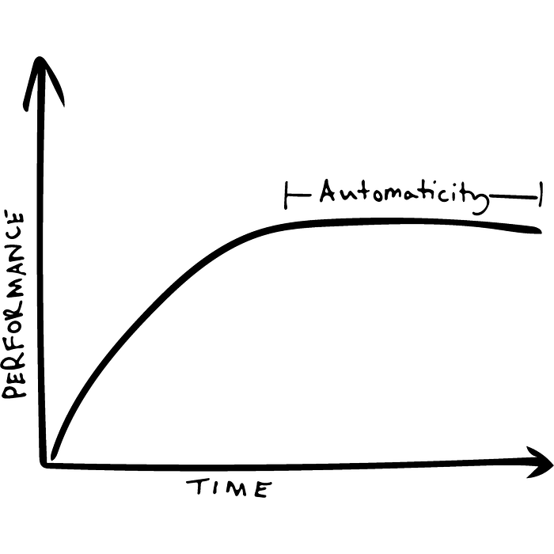

To improve at execution, we need a whole different mindset that is counterintuitive. **More specifically, we need an improvement mindset.** The improvement mindset is counterintuitive because it’s an inherently inefficient process in the short-term that leads to massive productivity gains in the long-term.  

为了在执行时改进，我们需要一种违反直觉的完全不同的心态。更具体地说，我们需要一种改进的心态。改进心态是违反直觉的，因为它在短期内是一个固有的低效过程，从长远来看会导致巨大的生产力提高。

With the improvement mindset, we focus on…  

以改进的心态，我们专注于...

-   Trying [productivity experiments](https://medium.com/accelerated-intelligence/forget-about-the-10-000-hour-rule-7b7a39343523) that may or may not work  
    
    尝试可能有效也可能无效的生产力实验
-   Learning more about best practices that will take a long time to pay off  
    
    详细了解需要很长时间才能获得回报的最佳实践
-   Discovering and trying out new tools  
    
    发现和试用新工具
-   Creating new habits that don’t exist  
    
    养成不存在的新习惯

What’s important to understand is that the execution and improvement mindset are both important, but they’re also completely different. And, progress on them is measured in opposite ways.  

重要的是要了解执行和改进心态都很重要，但它们也完全不同。而且，它们的进展是以相反的方式衡量的。

For example, someone in the execution paradigm does the right thing over and over. They could get fired if they don’t produce enough or make a mistake. In the improvement paradigm, most of what one does doesn’t pay off. And when it does, it might only do so over years. But, the one thing that does payoff, may pay back all the mistakes and give a 1,000% return.  

例如，执行范式中的某个人一遍又一遍地做正确的事情。如果他们产量不足或犯了错误，他们可能会被解雇。在改进范式中，一个人所做的大部分事情都没有回报。当它这样做时，它可能只会持续数年。但是，有一件事确实有回报，可能会偿还所有错误并给出 1,000% 的回报。

For example, it might take 50 hours to improve at one execution task by 10% (or 10 minutes per day). But, if you do that task everyday, you will save thousands of hours over your career because of the increased productivity.  

例如，一个执行任务可能需要 50 小时才能提高 10%（或每天 10 分钟）。但是，如果你每天都做这项任务，你将在你的职业生涯中节省数千小时，因为生产力的提高。

The table below highlights many of the differences between the execution mindset and improvement mindset:  

下表突出显示了执行思维和改进思维之间的许多差异：

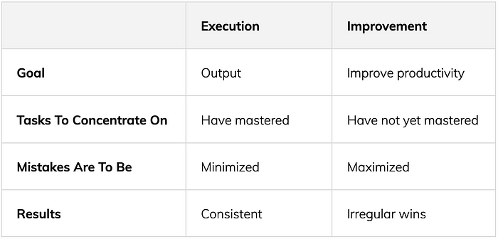

In my experience, the one big thing you can do first to develop an improvement mindset is to set aside five hours a week to deliberate learning, reflection, and [experimentation](https://medium.com/accelerated-intelligence/forget-about-the-10-000-hour-rule-7b7a39343523). I call this the [5-Hour Rule](https://medium.com/accelerated-intelligence/the-5-hour-rule-if-youre-not-spending-5-hours-per-week-learning-you-re-being-irresponsible-791c3f18f5e6), and many of the world’s top entrepreneurs, leaders, and innovators follow it religiously throughout their entire career no matter how busy they are. For example:  

根据我的经验，要培养改进心态，首先可以做的一件大事是每周留出五个小时进行刻意学习、反思和实验。我称之为5小时法则，许多世界顶级企业家，领导者和创新者在整个职业生涯中都虔诚地遵循它，无论他们有多忙。例如：

-   [Warren Buffett has spent 80% of his time](https://medium.com/accelerated-intelligence/the-no-1-lifelong-habit-of-warren-buffett-the-5-hour-rule-57884dce03f3) ever since he was a child just reading and thinking.  
    
    沃伦·巴菲特从小就把80%的时间都花在阅读和思考上。
-   While President Obama was in the White House, [he still set aside an hour for reading daily](https://medium.com/accelerated-intelligence/5-hour-rule-if-youre-not-spending-5-hours-per-week-learning-you-re-being-irresponsible-7815c7ce4a3e).  
    
    当奥巴马总统在白宫时，他仍然每天留出一个小时阅读。
-   Even as he was starting Microsoft, Bill Gates would still read an hour per day even though he got him at midnight on most nights. In addition, throughout his entire career, Gates spent an [entire week just reading](https://www.youtube.com/watch?v=lZzC-aV7Rb0&t=38s&ab_channel=MichaelSimmons) every year.  
    
    即使在他开始Microsoft的时候，比尔盖茨仍然每天阅读一个小时，即使他在大多数晚上在午夜读书。此外，在他的整个职业生涯中，盖茨每年都会花整整一周的时间阅读。

Unfortunately, setting aside time to deliberately improve one’s work is hard on multiple levels:  

不幸的是，留出时间来刻意改进一个人的工作在多个层面上都很困难：

-   Most people aren’t paid for learning  
    
    大多数人没有学习报酬
-   It often takes away from execution time  
    
    它通常会占用执行时间
-   It requires a whole new, opposing mindset  
    
    它需要一种全新的、对立的心态
-   It requires a different way of measuring progress  
    
    它需要一种不同的方式来衡量进展
-   It’s almost never urgent 几乎从不紧急
-   It can be hard to do alone  
    
    一个人很难做到

**As a result, many people procrastinate on deliberately improving their productivity.  

结果，许多人拖延故意提高他们的生产力。**

For example, I first fell in love with learning when I was 16 years old. I re-invested everything back into books. However, as I got older, I realized I was procrastinating on learning certain topics that were critical, but that were hard for me. I also noticed that I wasn’t as deliberate about applying what I learned to my life. About 15 years ago, I created a whole accountability and support network so my friends and I could help each other learn and grow together. Over that time, I’ve literally done thousands of these calls.  

例如，我第一次爱上学习是在我16岁的时候。我把所有东西都重新投入到书中。然而，随着年龄的增长，我意识到我正在拖延学习某些关键但对我来说很难的主题。我还注意到，我并没有那么刻意将我学到的东西应用到我的生活中。大约15年前，我创建了一个完整的问责制和支持网络，这样我和我的朋友们就可以互相帮助学习和共同成长。在那段时间里，我真的打了数千个这样的电话。

More recently, I decided to make the structure public…  

最近，我决定公开该结构...

## **Resource For Deliberate Improvement  

有意改进的资源**

From April 3–April 28, I’m doing a month-long improvement challenge called Month To Master. During the month you:  

从 4 月 3 日到 4 月 28 日，我正在进行为期一个月的改进挑战，称为“每月到大师”。在这一个月内，您：

-   Select one micro-topic to learn (in a sea of information overwhelm).  
    
    选择一个微主题进行学习（在信息洪流中）。
-   Build a curriculum to help you rapidly learn the micro-topic.  
    
    构建课程以帮助您快速学习微主题。
-   Share what you learn each day on a co-learning call, in order to deepen your learning, connect with others learning the same thing, and build your audience.  
    
    在共同学习电话会议上分享您每天学到的知识，以加深您的学习，与学习相同事物的其他人建立联系，并建立您的受众群体。
-   Reflect on how you could improve your learning process.  
    
    反思如何改进学习过程。
-   Publicly share what you learn on social media so you can build a following and demonstrate your expertise.  
    
    在社交媒体上公开分享您学到的知识，以便您可以建立追随者并展示您的专业知识。

[**You can learn more and sign up now >>  

您可以了解更多信息并立即注册>>**](https://monthtomaster.co/)

**_This article was written with love and care using the_** [**_blockbuster mental model_**](https://medium.com/accelerated-intelligence/the-1-mental-model-for-writers-who-want-to-write-high-quality-viral-content-43ecf0d4ec05)**_. If you’re interested in creating your own blockbuster article, I have a year-long, in-depth training program that I personally lead. To learn more,_** [**_fill out this application form_**](https://seminal.lpages.co/blockbuster-application-50x/)**_._**  

这篇文章是用爱和关怀用大片的心智模型写的。如果你有兴趣创建自己的重磅文章，我有一个为期一年的深入培训计划，由我亲自领导。要了解更多信息，请填写此申请表。

_If there’s a link to an Amazon book, it’s an affiliate link, which means I get a small amount of compensation when you buy the book. This compensation does not influence the specific books I recommend, as I only recommend books that I read and love.  

如果有指向亚马逊书籍的链接，那就是会员链接，这意味着当您购买该书时，我会获得少量补偿。这种补偿不会影响我推荐的具体书籍，因为我只推荐我读过和喜欢的书。_
