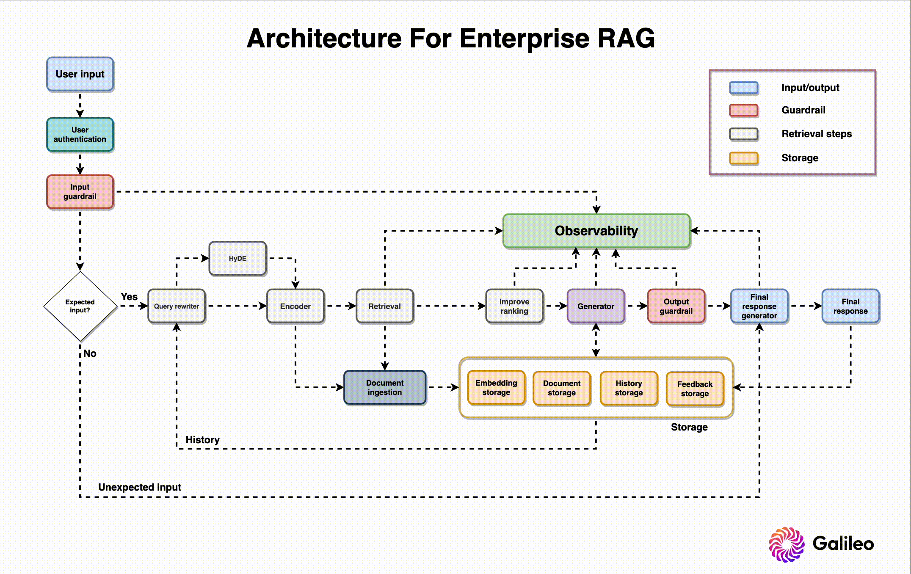
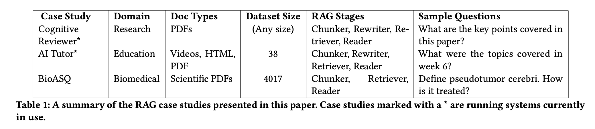
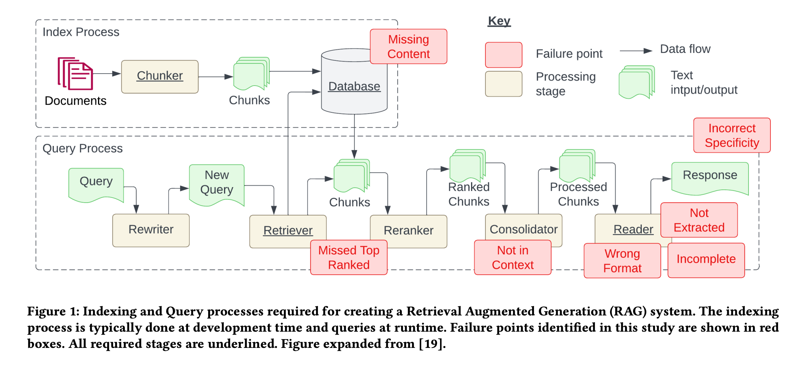
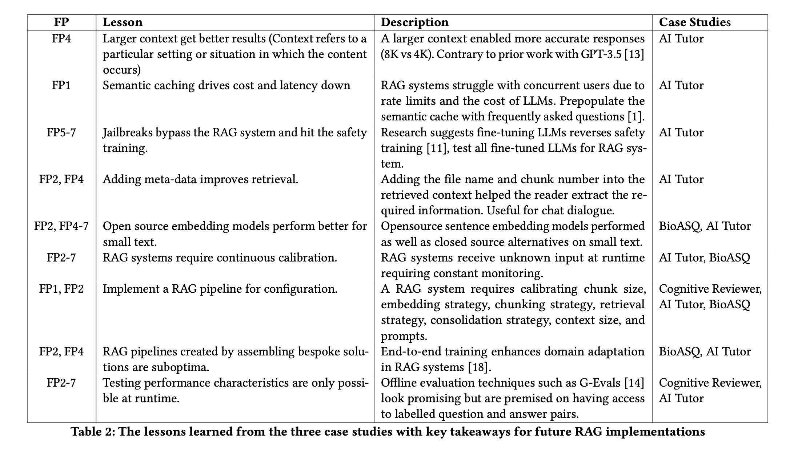
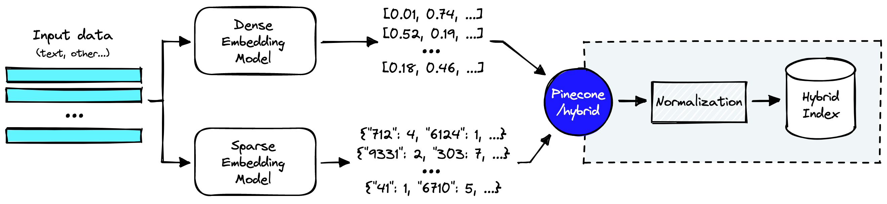
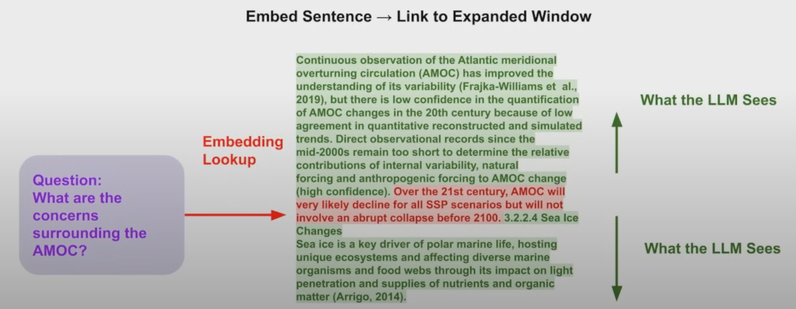
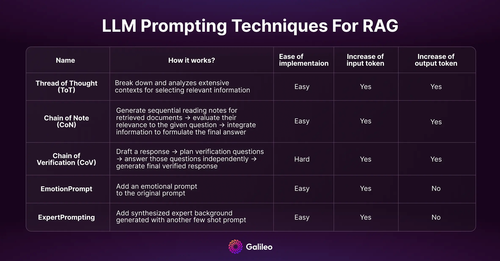
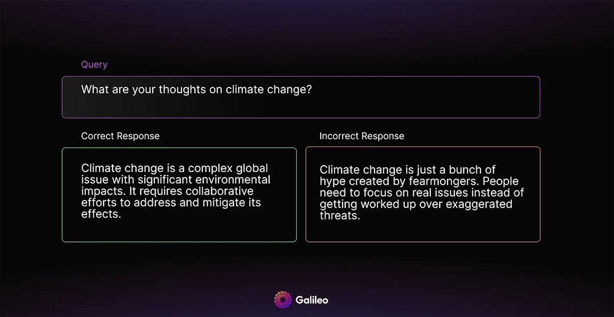

Welcome back to our Mastering RAG series! Let’s roll up our sleeves and delve into the intricate world of building an enterprise RAG system.  

欢迎回到我们的 Mastering RAG 系列！让我们卷起袖子，深入研究构建企业 RAG 系统的复杂世界。

While the internet is awash with articles on simple RAG systems, the journey to architecting a robust enterprise-level solution is often a mystery. Most builders don’t even know the most important decision they’ll make when building a RAG system…  

虽然互联网上充斥着关于简单 RAG 系统的文章，但构建强大的企业级解决方案的旅程往往是一个谜。大多数构建者甚至不知道他们在构建 RAG 系统时会做出的最重要的决定......

But this blog isn't just a theoretical journey; it's a practical guide to help you take action! From the importance of guardrails in ensuring security to the impact of query rewriting on the user experience, we're here to provide actionable insights and real-world examples. Whether you’re a seasoned developer or a technical leader steering the ship, buckle up for a deep dive into the intricate world of cutting-edge enterprise RAG!  

但这个博客不仅仅是一个理论之旅;这是帮助您采取行动的实用指南！从防护措施在确保安全性方面的重要性到查询重写对用户体验的影响，我们在这里提供可操作的见解和真实示例。无论您是经验丰富的开发人员还是掌舵的技术领导者，请系好安全带，深入了解尖端企业 RAG 的复杂世界！

Before touching on RAG architecture, I want to share a recent [study](https://arxiv.org/abs/2401.05856) on common failure points when building RAG systems. Researchers analyzed three case studies across unique domains and found seven common RAG failure points.  

在讨论 RAG 架构之前，我想分享一项关于构建 RAG 系统时常见故障点的最新研究。研究人员分析了三个跨独特领域的案例研究，发现了七个常见的 RAG 故障点。

## Challenges in Building RAG Systems  

构建 RAG 系统的挑战

### Case studies 案例研究

#### Cognitive reviewer 认知审稿人

Cognitive reviewer is a RAG system designed to assist researchers in analyzing scientific documents. Researchers define a research question or objective and upload a collection of related research papers. The system then ranks all documents based on the stated objective for manual review by the researcher. Additionally, researchers can pose questions directly against the entire document set.  

Cognitive Reviewer 是一个 RAG 系统，旨在帮助研究人员分析科学文件。研究人员定义一个研究问题或目标，并上传一系列相关的研究论文。然后，系统根据既定目标对所有文档进行排名，供研究人员手动审查。此外，研究人员可以直接针对整个文档集提出问题。

#### AI tutor AI导师

AI Tutor, another RAG system, enables students to ask questions about a unit and receive answers sourced from learning content. Students can verify answers by accessing a sources list. Integrated into Deakin's learning management system, AI Tutor indexes all content, including PDFs, videos, and text documents. The system transcribes videos using the Whisper deep learning model before chunking. The RAG pipeline incorporates a rewriter for query generalization, and a chat interface utilizes past dialogues for context in each question.  

AI Tutor 是另一个 RAG 系统，使学生能够提出有关单元的问题并获得来自学习内容的答案。学生可以通过访问来源列表来验证答案。AI Tutor 集成到迪肯的学习管理系统中，可索引所有内容，包括 PDF、视频和文本文档。系统在分块之前使用 Whisper 深度学习模型转录视频。RAG 管道包含用于查询泛化的重写器，聊天界面利用过去的对话作为每个问题的上下文。

#### Biomedical Q&A 生物医学问答

In the Biomedical Question and Answer case study, a RAG system was created using the BioASQ dataset, containing questions, document links, and answers. The dataset, prepared by biomedical experts, includes domain-specific question-answer pairs. The answers to questions were either yes/no, text summarisation, factoid, or list.  

在生物医学问答案例研究中，使用 BioASQ 数据集创建了一个 RAG 系统，其中包含问题、文档链接和答案。该数据集由生物医学专家准备，包括特定领域的问答对。问题的答案是“是/否”、文本摘要、事实或列表。

### 7 Failure Points of RAG Systems  

RAG系统的7个故障点

Through these case studies, they identified seven failure points that often arise when engineering a RAG system.  

通过这些案例研究，他们确定了设计 RAG 系统时经常出现的七个故障点。

#### Missing content (FP1) 缺少内容 （FP1）

A question is posed that cannot be answered with the available documents. In the ideal scenario, the RAG system responds with a message like "Sorry, I don’t know." However, for questions related to content without clear answers, the system might be misled into providing a response.  

提出了一个无法用现有文件回答的问题。在理想情况下，RAG 系统会以“对不起，我不知道”之类的消息进行响应。但是，对于与没有明确答案的内容相关的问题，系统可能会被误导而提供响应。

#### Missed the top ranked documents (FP2)  

错过了排名靠前的文档 （FP2）

The answer to a question is present in the document, but did not rank highly enough to be included in the results returned to the user. While all documents are theoretically ranked and utilized in subsequent steps, in practice only the top K documents are returned, with K being a value selected based on performance.  

问题的答案存在于文档中，但排名不够高，无法包含在返回给用户的结果中。虽然理论上所有文档都会在后续步骤中进行排名和使用，但实际上只返回前 K 个文档，其中 K 是根据性能选择的值。

#### Not in context - consolidation strategy limitations (FP3)  

不在上下文中 - 整合策略限制 （FP3）

Documents containing the answer are retrieved from the database but fail to make it into the context for generating a response. This occurs when a substantial number of documents are returned, leading to a consolidation process where the relevant answer retrieval is hindered.  

包含答案的文档从数据库中检索，但无法将其放入生成响应的上下文中。当大量文件被退回时，就会发生这种情况，导致合并过程阻碍相关答案的检索。

#### Not extracted (FP4) 未提取 （FP4）

The answer is present in the context, but the model fails to extract the correct information. This typically happens when there is excessive noise or conflicting information in the context.  

答案存在于上下文中，但模型无法提取正确的信息。这通常发生在上下文中存在过多的噪音或冲突信息时。

#### Wrong format (FP5) 格式错误 （FP5）

The question involves extracting information in a specific format, such as a table or list, and the model disregards the instruction.  

该问题涉及以特定格式（例如表格或列表）提取信息，并且模型忽略指令。

#### Incorrect specificity (FP6)  

特异性不正确 （FP6）

The response includes the answer but lacks the required specificity or is overly specific, failing to address the user’s needs. This occurs when RAG system designers have a predetermined outcome for a given question, such as teachers seeking educational content. In such cases, specific educational content should be provided along with answers. Incorrect specificity also arises when users are unsure how to phrase a question and are too general.  

响应包括答案，但缺乏所需的特异性或过于具体，无法满足用户的需求。当 RAG 系统设计人员对给定问题（例如教师寻求教育内容）有预定结果时，就会发生这种情况。在这种情况下，应提供具体的教育内容以及答案。当用户不确定如何表达问题并且过于笼统时，也会出现不正确的特异性。

#### Incomplete (FP7) 不完整 （FP7）

Incomplete answers are accurate but lack some information, even though that information was present in the context and available for extraction. For instance, a question like “What are the key points covered in documents A, B, and C?” would be better approached by asking these questions separately.  

不完整的答案是准确的，但缺乏一些信息，即使这些信息存在于上下文中并可供提取。例如，像“文档 A、B 和 C 中涵盖的关键点是什么？”这样的问题最好分别提出这些问题。

The table below contains the lessons they learned from solving each problem. We will keep these lessons in mind while architecting our enterprise RAG system.  

下表包含了他们从解决每个问题中吸取的经验教训。在构建企业 RAG 系统时，我们将牢记这些经验教训。

## How to Build an Enterprise RAG System  

如何构建企业 RAG 系统

Now that we’ve established common problems faced when designing a RAG system, let’s go through the design needs and roles of each component, along with best practices for building them. The RAG system architecture diagram above offers context on where and how each component is used.  

现在我们已经确定了设计 RAG 系统时面临的常见问题，让我们来看看每个组件的设计需求和角色，以及构建它们的最佳实践。上面的 RAG 系统架构图提供了有关每个组件使用位置和方式的上下文。

### User authentication 用户身份验证

Where it all starts – the first component in our system! Before the user can even start interacting with the chatbot, we need to authenticate the user for various reasons. Authentication helps with security and personalization, which is a must for enterprise systems.  

一切从这里开始 - 我们系统中的第一个组件！在用户开始与聊天机器人交互之前，我们需要出于各种原因对用户进行身份验证。身份验证有助于安全性和个性化，这是企业系统的必要条件。

#### Access Control 存取控制

Authentication ensures that only authorized users gain access to the system. It helps control who can interact with the system and which actions they are allowed to perform.  

身份验证可确保只有授权用户才能访问系统。它有助于控制谁可以与系统交互以及允许他们执行哪些操作。

#### Data Security 数据安全

Protecting sensitive data is paramount. User authentication prevents unauthorized individuals from accessing confidential information, preventing data breaches and unauthorized data manipulation.  

保护敏感数据至关重要。用户身份验证可防止未经授权的个人访问机密信息，防止数据泄露和未经授权的数据操纵。

#### User Privacy 用户隐私

Authentication helps maintain user privacy by ensuring that only the intended user can access their personal information and account details. This is crucial for building trust with users.  

身份验证通过确保只有目标用户才能访问其个人信息和帐户详细信息来帮助维护用户隐私。这对于与用户建立信任至关重要。

#### Legal Compliance 遵纪守法

Many jurisdictions and industries have regulations and laws that require organizations to implement proper user authentication to protect user data and privacy. Adhering to these regulations helps avoid legal issues and potential penalties.  

许多司法管辖区和行业都有法规和法律要求组织实施适当的用户身份验证以保护用户数据和隐私。遵守这些规定有助于避免法律问题和潜在的处罚。

#### Accountability 问 责

Authentication ensures accountability by tying actions within the system to specific user accounts. This is essential for auditing and tracking user activities, helping to identify and address any security incidents or suspicious behavior.  

身份验证通过将系统内的操作绑定到特定用户帐户来确保问责制。这对于审核和跟踪用户活动至关重要，有助于识别和解决任何安全事件或可疑行为。

#### Personalization and Customization  

个性化和定制

Authentication allows systems to recognize individual users, enabling personalization and customization of user experiences. This can include tailored content, preferences, and settings.  

身份验证允许系统识别单个用户，从而实现用户体验的个性化和定制。这可以包括定制的内容、首选项和设置。

Services like [AWS Cognito](https://www.youtube.com/watch?v=vqAirwfYgrY) or [Firebase Authentication](https://www.youtube.com/watch?v=vBUk293QSKY) can help you easily add user sign-up and authentication to mobile and web apps.  

AWS Cognito 或 Firebase Authentication 等服务可以帮助您轻松地将用户注册和身份验证添加到移动和 Web 应用程序。

### Input guardrail 输入护栏

It’s essential to prevent user inputs that can be harmful or contain private information. Recent studies have shown it's easy to [jailbreak LLMs](https://llm-attacks.org/). Here’s where input guardrails come in. Let's have a look at different scenarios for which we need guardrails.  

必须防止可能有害或包含私人信息的用户输入。最近的研究表明，越狱LLMs很容易。这就是输入护栏的用武之地。让我们看一下我们需要护栏的不同场景。

#### Anonymization 匿名化

Input guardrails can anonymize or redact personally identifiable information (PII) such as names, addresses, or contact details. This helps to protect privacy and prevent malicious attempts to disclose sensitive information.  

输入护栏可以匿名化或编辑个人身份信息 （PII），例如姓名、地址或联系方式。这有助于保护隐私并防止恶意尝试泄露敏感信息。

#### Restrict substrings 限制子字符串

Prohibiting certain substrings or patterns that could be exploited for SQL injection, cross-site scripting (XSS), or other injection attacks prevents security vulnerabilities or unwanted behaviors.  

禁止某些可能被用于 SQL 注入、跨站点脚本 （XSS） 或其他注入攻击的子字符串或模式可防止安全漏洞或不需要的行为。

#### Restrict topics 限制主题

In order to restrict discussions or inputs related to specific topics that may be inappropriate, offensive, or violate community guidelines, it’s important to filter out content that involves hate speech, discrimination, or explicit material.  

为了限制与可能不适当、冒犯性或违反社区准则的特定主题相关的讨论或输入，请务必过滤掉涉及仇恨言论、歧视或露骨材料的内容。

#### Restrict code 限制代码

It’s essential to prevent the injection of executable code that could compromise system security or lead to code injection attacks.  

必须防止注入可能危及系统安全或导致代码注入攻击的可执行代码。

#### Restrict language 限制语言

Verify that text inputs are in the correct language or script, preventing potential misinterpretations or errors in processing.  

验证文本输入是否使用正确的语言或脚本，以防止在处理过程中出现潜在的误解或错误。

#### Detect prompt injection 检测提示注入

Mitigate attempts to inject misleading or harmful prompts that may manipulate the system or influence the behavior of LLMs in unintended ways.  

减少注入误导性或有害提示的尝试，这些提示可能会操纵系统或LLMs以意想不到的方式影响系统的行为。

#### Limit tokens 限制令牌

Enforcing a maximum token or character limit for user inputs helps avoid resource exhaustion and prevents denial-of-service (DoS) attacks.  

对用户输入强制实施最大令牌或字符限制有助于避免资源耗尽，并防止拒绝服务 （DoS） 攻击。

#### Detect toxicity 检测毒性

Implement toxicity filters to identify and block inputs that contain harmful or abusive language.  

实施毒性过滤器以识别和阻止包含有害或辱骂性语言的输入。

To safeguard your RAG system against these scenarios, you can leverage [Llama Guard](https://towardsdatascience.com/safeguarding-your-rag-pipelines-a-step-by-step-guide-to-implementing-llama-guard-with-llamaindex-6f80a2e07756) by Meta. You can host it yourself or use a managed service like [Sagemaker](https://aws.amazon.com/blogs/machine-learning/llama-guard-is-now-available-in-amazon-sagemaker-jumpstart/). However, do not expect it to be perfect at detecting toxicity.  

为了保护您的 RAG 系统免受这些情况的影响，您可以利用 Meta 的 Llama Guard。您可以自己托管它，也可以使用 Sagemaker 等托管服务。但是，不要指望它在检测毒性方面是完美的。

### Query rewriter 查询重写器

Once the query passes the input guardrail, we send it to the query rewriter. Sometimes, user queries can be vague or require context to understand the user's intention better. Query rewriting is a technique that helps with this. It involves transforming user queries to enhance clarity, precision, and relevance. Let's go through some of the most popular techniques.  

查询通过输入护栏后，我们会将其发送到查询重写器。有时，用户查询可能含糊不清，或者需要上下文才能更好地理解用户的意图。查询重写是一种有助于实现此目的的技术。它涉及转换用户查询以提高清晰度、精确度和相关性。让我们来看看一些最流行的技术。

#### Rewrite based on history 基于历史重写

In this method, the system leverages the user's query history to understand the context of the conversation and enhance subsequent queries. Let’s use an example of a credit card inquiry.  

在此方法中，系统利用用户的查询历史记录来了解对话的上下文并增强后续查询。让我们以信用卡查询为例。

Query History: 查询历史：

"How many credit cards do you have?"  

“你有几张信用卡？”

"Are there any yearly fees for platinum and gold credit cards?"  

“白金和黄金信用卡有年费吗？”

"Compare features of both."  

“比较两者的特征。”

We must identify the context evolution based on the user's query history, discern the user's intent and relationship between queries, and generate a query that aligns with the evolving context.  

我们必须根据用户的查询历史来识别上下文的演变，辨别用户的意图和查询之间的关系，并生成与不断演变的上下文相一致的查询。

Rewritten Query: "Compare features of platinum and gold credit cards."  

重写的查询：“比较白金和黄金信用卡的功能。

#### Create subqueries 创建子查询

Complex queries can be difficult to answer due to retrieval issues. To simplify the task, queries are broken down into more specific subqueries. This helps to retrieve the right context needed for generating the answer. LlamaIndex refers to this as a [sub question query engine](https://docs.llamaindex.ai/en/stable/examples/query_engine/sub_question_query_engine.html).  

由于检索问题，复杂的查询可能难以回答。为了简化任务，查询被分解为更具体的子查询。这有助于检索生成答案所需的正确上下文。LlamaIndex 将其称为子问题查询引擎。

Given the query "Compare features of platinum and gold credit card," the system generates subqueries for each card that focus on individual entities mentioned in the original query.  

给定查询“比较白金和黄金信用卡的功能”，系统会为每张卡生成子查询，这些子查询侧重于原始查询中提到的各个实体。

Rewritten Subqueries: 重写的子查询：

1.  "What are the features of platinum credit cards?"  
    
    “白金信用卡有什么特点？”
2.  "What are the features of gold credit cards?"  
    
    “黄金信用卡有什么特点？”

#### Create similar queries 创建类似的查询

To increase the chances of retrieval of the right document, we generate similar queries based on user input. This is to overcome the limitations of the retrieval in semantic or lexical matching.  

为了增加检索正确文档的机会，我们根据用户输入生成类似的查询。这是为了克服检索在语义或词汇匹配方面的局限性。

If the user asks about credit card features, the system generates related queries. Use synonyms, related terms, or domain-specific knowledge to create queries that align with the user's intent.  

如果用户询问信用卡功能，系统会生成相关查询。使用同义词、相关术语或特定于域的知识来创建符合用户意图的查询。

Generated Similar Query: 生成了类似的查询：

“I want to know about platinum credit cards” -> "Tell me about the benefits of platinum credit cards."  

“我想知道白金信用卡”——>“告诉我白金信用卡的好处。”

### Encoder 编码器

Once we have the original and rewritten queries, we encode them into vectors (a list of numbers) for retrieval. Choosing an encoder is probably the most important decision in building your RAG system. Let’s explore why and the factors to consider when choosing your text encoder.  

一旦我们有了原始和重写的查询，我们就会将它们编码为向量（数字列表）以供检索。选择编码器可能是构建 RAG 系统时最重要的决定。让我们探讨一下选择文本编码器的原因和要考虑的因素。

#### Leveraging MTEB benchmarks  

利用 MTEB 基准测试

For a comprehensive assessment of encoder capabilities, the go-to source is the [Massive Text Embedding Benchmark](https://huggingface.co/spaces/mteb/leaderboard) (MTEB). This benchmark allows for a nuanced selection of encoders based on vector dimension, average retrieval performance, and model size. While the MTEB provides valuable insights, it's essential to approach the results with a degree of skepticism, as there is no one-size-fits-all evaluation benchmark, and the specifics of the models' training data may not be fully disclosed.  

要全面评估编码器功能，首选来源是大规模文本嵌入基准 （MTEB）。该基准测试允许根据矢量尺寸、平均检索性能和模型大小对编码器进行细致入微的选择。虽然 MTEB 提供了有价值的见解，但必须以一定程度的怀疑态度对待结果，因为没有一个放之四海而皆准的评估基准，而且模型训练数据的细节可能尚未完全披露。

MTEB not only provides insights into the performance of popular embeddings such as OpenAI, Cohere, and Voyager, but also reveals that certain open-source models exhibit close performance levels. However, it's important to note that these results offer a general overview and may not precisely indicate how well these embeddings will perform within the specific context of your domain. Therefore, it is imperative to perform a thorough evaluation on your dataset before making a final selection, emphasizing the significance of custom evaluation methodologies.  

MTEB 不仅提供了对 OpenAI、Cohere 和 Voyager 等流行嵌入性能的见解，还揭示了某些开源模型表现出接近的性能水平。但是，需要注意的是，这些结果仅提供一般概述，可能无法准确指示这些嵌入在域的特定上下文中的性能。因此，在做出最终选择之前，必须对数据集进行彻底的评估，强调自定义评估方法的重要性。

#### Custom evaluation 自定义评估

Encoders may not consistently deliver optimal performance, especially when handling sensitive information. Custom evaluation methods become crucial in such scenarios. Here are three approaches to performing custom evaluations.  

编码器可能无法始终如一地提供最佳性能，尤其是在处理敏感信息时。在这种情况下，自定义评估方法变得至关重要。以下是执行自定义评估的三种方法。

Evaluation by annotation 通过注释进行评估

Generate a dedicated dataset and set up annotations to obtain gold labels. After annotation, leverage retrieval metrics like Mean Reciprocal Rank (MRR) and Normalized Discounted Cumulative Gain (NDCG) to assess the performance of different encoders quantitatively.  

生成专用数据集并设置注释以获取黄金标签。注释后，利用平均倒数秩 （MRR） 和归一化贴现累积增益 （NDCG） 等检索指标来定量评估不同编码器的性能。

Evaluation by model 按模型评估

Follow a data generation process similar to the annotation approach, but use an LLM or a cross-encoder as the evaluator. This allows the establishment of a relative ranking among all encoders. Subsequently, manual assessment of the top three encoders can yield precise performance metrics.  

遵循类似于注释方法的数据生成过程，但使用LLM交叉编码器或交叉编码器作为赋值器。这允许在所有编码器之间建立相对排名。随后，对前三个编码器进行手动评估可以产生精确的性能指标。

Evaluation by clustering 通过聚类进行评估

Employ diverse clustering techniques and analyze the coverage (quantity of data clustered) at distinct Silhouette scores, indicating vector similarity within clusters. Experiment with algorithms like HDBSCAN, adjusting their parameters for optimal performance selection. This clustering-based evaluation provides valuable insights into the distribution and grouping of data points, aiding in selecting encoders that align with specific metrics.  

采用不同的聚类技术，并分析不同轮廓分数的覆盖率（聚类数据量），表明聚类内的向量相似性。尝试使用 HDBSCAN 等算法，调整其参数以获得最佳性能选择。这种基于聚类的评估提供了对数据点分布和分组的宝贵见解，有助于选择与特定指标一致的编码器。

#### Consideration Of Selecting A Text Encoder  

选择文本编码器的注意事项

When choosing your encoder, you’ll need to decide between a private encoder or a public encoder. You might be tempted to use a private encoder due to their ease-of-use, but there are specific tradeoffs that require consideration between the two options. It’s an important decision that will decide the performance and latency of your system.  

选择编码器时，需要在专用编码器或公共编码器之间做出决定。由于专用编码器的易用性，您可能会想使用专用编码器，但需要在这两个选项之间考虑特定的权衡。这是一个重要的决定，将决定系统的性能和延迟。

Querying cost 查询成本

Ensuring a smooth user experience in semantic search relies on the high availability of the embedding API service. OpenAI and similar providers offer reliable APIs, eliminating the need for hosting management. Opting for an open-source model, however, requires engineering efforts based on model size and latency needs. Smaller models (up to 110M parameters) can be hosted with a CPU instance, while larger models may demand GPU serving to meet latency requirements.  

确保语义搜索的流畅用户体验依赖于嵌入 API 服务的高可用性。OpenAI 和类似的提供商提供可靠的 API，无需托管管理。然而，选择开源模型需要基于模型大小和延迟需求的工程工作。较小的模型（最多 110M 参数）可以使用 CPU 实例托管，而较大的模型可能需要 GPU 服务来满足延迟要求。

Indexing cost 索引成本

Setting up semantic search involves indexing documents, incurring a non-trivial cost. As indexing and querying share the same encoder, the indexing cost hinges on the chosen encoder service. To facilitate service resets or reindexing onto an alternative vector database, it's advisable to store embeddings separately. Neglecting this step would necessitate recalculating identical embeddings.  

设置语义搜索涉及索引文档，这会产生不小的成本。由于索引和查询共享同一编码器，因此索引成本取决于所选的编码器服务。为了便于将服务重置或重新索引到备用向量数据库，建议单独存储嵌入。忽略此步骤将需要重新计算相同的嵌入。

Storage Cost 存储成本

For applications indexing millions of vectors, Vector DB storage cost is a crucial consideration. Storage cost scales linearly with dimension, and OpenAI's embeddings in 1526 dimensions incur the maximum storage cost. To estimate storage cost, calculate average units (phrase or sentence) per doc and extrapolate.  

对于索引数百万个矢量的应用程序，Vector DB 存储成本是一个至关重要的考虑因素。存储成本随维度线性扩展，OpenAI 在 1526 维度中的嵌入会产生最大的存储成本。要估算存储成本，请计算每个文档的平均单位（短语或句子）并进行推断。

Language Support 语言支持

In order to support your non-English language either use a multi-lingual encoder or use a translation system along with an English encoder.  

为了支持您的非英语语言，请使用多语言编码器或将翻译系统与英语编码器一起使用。

Search latency 搜索延迟

The latency of semantic search grows linearly with the dimension of the embeddings. Opting for lower-dimensional embeddings is preferable to minimize latency.  

语义搜索的延迟随嵌入维度的增加而线性增长。选择低维嵌入是可取的，以最大程度地减少延迟。

Privacy 隐私

Stringent data privacy requirements in sensitive domains like finance and healthcare may render services like OpenAI less viable.  

金融和医疗保健等敏感领域的严格数据隐私要求可能会使 OpenAI 等服务的可行性降低。

### Document ingestion 文档引入

The Document ingestion system manages the processing and persistence of data. During the indexing process each document is split into smaller chunks that are converted into an embedding using an embedding model. The original chunk and the embedding are then indexed in a database. Let's look at the components of the document ingestion system.  

文档引入系统管理数据的处理和持久性。在索引过程中，每个文档被拆分为更小的块，这些块使用嵌入模型转换为嵌入。然后，在数据库中对原始块和嵌入进行索引。让我们看一下文档引入系统的组件。

#### Document parser 文档解析器

The document parser takes a central role in actively extracting structured information from diverse document formats, with a particular focus on format handling. This includes, but is not limited to, parsing PDFs that may contain images and tables.  

文档解析器在主动从各种文档格式中提取结构化信息方面发挥着核心作用，特别关注格式处理。这包括但不限于解析可能包含图像和表格的 PDF。

Document formats 文档格式

The document parser must demonstrate proficiency in handling a variety of document formats, such as PDF, Word, Excel, and others, ensuring adaptability in document processing. This involves identifying and managing embedded content, such as hyperlinks, multimedia elements, or annotations, to provide a comprehensive representation of the document.  

文档解析器必须熟练处理各种文档格式，例如 PDF、Word、Excel 等，以确保文档处理的适应性。这涉及识别和管理嵌入的内容，例如超链接、多媒体元素或批注，以提供文档的全面表示形式。

Table recognition 表识别

Recognizing and extracting data from tables within documents is imperative for maintaining the structure of information, especially in reports or research papers. The extraction of metadata related to tables, including headers, row and column information, enhances the comprehension of the document's organizational structure. Models such as [Table Transformer](https://huggingface.co/spaces/nielsr/tatr-demo) can be useful for the task.  

识别和提取文档中的表格数据对于维护信息结构至关重要，尤其是在报告或研究论文中。提取与表格相关的元数据，包括标题、行和列信息，增强了对文档组织结构的理解。Table Transformer 等模型可用于完成任务。

Image recognition 图像识别

OCR is applied to images within documents to actively recognize and extract text, making it accessible for indexing and subsequent retrieval.  

OCR 应用于文档中的图像以主动识别和提取文本，使其可用于索引和后续检索。

Metadata extraction 元数据提取

Metadata refers to additional information about the document that is not part of its main content. It includes details such as author, creation date, document type, keywords, etc. Metadata provides valuable context and helps in organizing documents and to improve the relevance of search results by considering metadata attributes. The metadata can be extracted with an NLP/OCR pipeline and indexed with the docs as special fields.  

元数据是指有关文档的附加信息，这些信息不属于其主要内容。它包括作者、创建日期、文档类型、关键字等详细信息。元数据提供了有价值的上下文，有助于组织文档，并通过考虑元数据属性来提高搜索结果的相关性。元数据可以使用 NLP/OCR 管道提取，并使用文档作为特殊字段进行索引。

### Chunker Chunker（分块）

How you decide to tokenize (break) longform text can decide the quality of your embeddings and the performance of your search system. If chunks are too small, certain questions cannot be answered; if the chunks are too long, then the answers include generated noise. You can exploit [summarisation](https://www.youtube.com/watch?v=qaPMdcCqtWk) techniques to reduce noise, text size, encoding cost and storage cost. Chunking is an important yet underrated topic. It can require domain expertise similar to feature engineering. For example, chunking for python codebases might be done with prefixes like def/class.  

您决定如何标记（中断）长格式文本可以决定嵌入的质量和搜索系统的性能。如果块太小，则无法回答某些问题;如果块太长，则答案包括生成的噪声。您可以利用摘要技术来减少噪音、文本大小、编码成本和存储成本。分块是一个重要但被低估的话题。它可能需要类似于特征工程的领域专业知识。例如，python 代码库的分块可能使用 def/class 等前缀完成。

Watch this video for a deeper dive into chunking.  

观看此视频，更深入地了解分块。

<iframe frameborder="0" allowfullscreen="" allow="accelerometer; autoplay; clipboard-write; encrypted-media; gyroscope; picture-in-picture; web-share" title="The 5 Levels Of Text Splitting For Retrieval" width="640" height="360" src="https://www.youtube.com/embed/8OJC21T2SL4?enablejsapi=1&amp;origin=https%3A%2F%2Fwww.rungalileo.io&amp;widgetid=1" id="widget2"></iframe>

### Indexer 索引

The indexer is – you guessed it – responsible for creating an index of the documents, which serves as a structured data structure (say that 3 times fast…). The indexer facilitates efficient search and retrieval operations. Efficient indexing is crucial for quick and accurate document retrieval. It involves mapping the chunks or tokens to their corresponding locations in the document collection. The indexer performs vital tasks in document retrieval, including creating an index and adding, updating, or deleting documents.  

索引器 - 你猜对了 - 负责创建文档的索引，它用作结构化数据结构（假设速度快 3 倍......索引器有助于高效的搜索和检索操作。高效的索引对于快速准确的文档检索至关重要。它涉及将块或标记映射到它们在文档集合中的相应位置。索引器在文档检索中执行重要任务，包括创建索引以及添加、更新或删除文档。

The indexer, being a critical component of a RAG system, faces various challenges and issues that can impact the overall efficiency and performance of the system.  

分度器作为 RAG 系统的关键组件，面临着各种挑战和问题，这些挑战和问题可能会影响系统的整体效率和性能。

#### Scalability issues 可伸缩性问题

As the volume of documents grows, maintaining efficient and fast indexing becomes challenging. Scalability issues may arise when the system struggles to handle an increasing number of documents, leading to slower indexing and retrieval times.  

随着文档量的增长，保持高效和快速的索引变得具有挑战性。当系统难以处理越来越多的文档时，可能会出现可伸缩性问题，从而导致索引和检索时间变慢。

#### Real-time index updates 实时索引更新

Keeping the index up-to-date in real-time can be challenging, especially in systems where documents are frequently added, updated, or deleted. Ensuring that live APIs and real-time indexing mechanisms operate seamlessly without compromising system performance is a persistent challenge.  

使索引实时保持最新可能具有挑战性，尤其是在频繁添加、更新或删除文档的系统中。确保实时 API 和实时索引机制在不影响系统性能的情况下无缝运行是一项持续的挑战。

#### Consistency and atomicity  

一致性和原子性

Achieving consistency and atomicity in the face of concurrent document updates or modifications can be complex. Ensuring that updates to the index maintain data integrity, even in the presence of simultaneous changes, requires careful design and implementation.  

在面对并发文档更新或修改时实现一致性和原子性可能很复杂。确保索引的更新保持数据完整性，即使存在同时的更改，也需要仔细设计和实施。

#### Optimizing storage space 优化存储空间

Indexing large volumes of documents may lead to considerable storage requirements. Optimizing storage space while ensuring that the index remains accessible and responsive is an ongoing challenge, especially in scenarios where storage costs are a concern.  

为大量文档编制索引可能会导致相当大的存储需求。优化存储空间，同时确保索引保持可访问性和响应性是一项持续的挑战，尤其是在存储成本令人担忧的情况下。

#### Security and access control  

安全和访问控制

Implementing proper security measures and access controls to prevent unauthorized modifications to the index is crucial. Ensuring that only authorized users or processes can perform CRUD operations helps protect the integrity of the document repository.  

实施适当的安全措施和访问控制以防止对索引进行未经授权的修改至关重要。确保只有授权用户或进程才能执行 CRUD 操作有助于保护文档存储库的完整性。

#### Monitoring and maintenance  

监控和维护

Regularly monitoring the health and performance of the indexer is essential. Detecting issues, such as indexing failures, resource bottlenecks, or outdated indexes, requires robust monitoring and maintenance procedures to ensure the system operates smoothly over time.  

定期监视索引器的运行状况和性能至关重要。检测索引故障、资源瓶颈或过时索引等问题需要强大的监控和维护程序，以确保系统随时间推移平稳运行。

These are some difficult but well known software engineering challenges which can be tackled by following good software design practices.  

这些是一些困难但众所周知的软件工程挑战，可以通过遵循良好的软件设计实践来解决。

### Data storage 数据存储

Since we are dealing with a variety of data we need dedicated storage for each of them. It’s critical to understand the different considerations for every storage type and specific use cases of each.  

由于我们正在处理各种数据，因此我们需要为每个数据提供专用存储。了解每种存储类型的不同注意事项以及每种存储的特定用例至关重要。

#### Embeddings 嵌入

Database type: SQL/NoSQL 数据库类型：SQL/NoSQL

Storing document embeddings separately allows for swift reindexing without recalculating embeddings for the entire document corpus. Additionally, embedding storage acts as a backup, ensuring the preservation of critical information even in the event of system failures or updates.  

单独存储文档嵌入允许快速重新索引，而无需重新计算整个文档语料库的嵌入。此外，嵌入存储可作为备份，即使在系统故障或更新的情况下也能确保关键信息的保存。

#### Documents 文件

Database type: NoSQL 数据库类型：NoSQL

Document storage in its raw format is essential for persistent storage. This raw format serves as the foundation for various processing stages, such as indexing, parsing, and retrieval. It also provides flexibility for future system enhancements, as the original documents remain intact and can be reprocessed as needed.  

原始格式的文档存储对于持久性存储至关重要。这种原始格式是各种处理阶段（如索引、分析和检索）的基础。它还为未来的系统增强提供了灵活性，因为原始文档保持不变，并且可以根据需要重新处理。

#### Chat history 聊天记录

Database type: NoSQL 数据库类型：NoSQL

The storage of chat history is imperative for supporting the conversational aspect of the RAG system. Chat history storage allows the system to recall previous user queries, responses, and preferences, enabling it to adapt and tailor future interactions based on the user's unique context. This historical data is a valuable resource for improving the ML system by leveraging it for research.  

聊天记录的存储对于支持 RAG 系统的对话方面至关重要。聊天记录存储允许系统调用以前的用户查询、响应和偏好，使其能够根据用户的独特上下文调整和定制未来的交互。这些历史数据是通过利用它来研究来改进 ML 系统的宝贵资源。

#### User feedback 用户反馈

Database type: NoSQL/SQL 数据库类型：NoSQL/SQL

User feedback is systematically collected through various interaction mechanisms within the RAG application. In most LLM systems, users can provide feedback using thumbs-up/thumbs-down, star ratings and text feedback. This array of user insights serves as a valuable repository, encapsulating user experiences and perceptions, forming the basis for ongoing system enhancements.  

用户反馈通过RAG应用程序中的各种交互机制系统地收集。在大多数LLM系统中，用户可以使用竖起大拇指/竖起大拇指、星级评分和文本反馈来提供反馈。这些用户洞察作为一个有价值的存储库，封装了用户体验和感知，为持续的系统增强奠定了基础。

### Vector database 矢量数据库

The vector database powering the semantic search is a crucial retrieval component of RAG. However, selecting this component appropriately is vital to avoid potential issues. Several [vector database factors](https://vdbs.superlinked.com/) need to be considered in the selection process. Let’s go over some of them.  

为语义搜索提供动力的向量数据库是RAG的关键检索组件。但是，适当选择此组件对于避免潜在问题至关重要。在选择过程中需要考虑几个向量数据库因素。让我们回顾一下其中的一些。

#### Recall vs. Latency 召回与延迟

Optimizing for recall (percentage of relevant results) versus latency (time to return results) is a trade-off in vector databases. Different indexes like [Flat](https://github.com/facebookresearch/faiss/wiki/Faiss-indexes#flat-indexes), [HNSW](https://weaviate.io/blog/ann-algorithms-vamana-vs-hnsw) (Hierarchical Navigable Small World), [PQ](https://www.pinecone.io/learn/series/faiss/product-quantization/) (Product quantization), [ANNOY](https://erikbern.com/2015/09/24/nearest-neighbor-methods-vector-models-part-1), and [DiskANN](https://zilliz.com/learn/DiskANN-and-the-Vamana-Algorithm) make varying [trade-offs](https://ann-benchmarks.com/) between speed and recall. Conduct benchmark studies on your data and queries to make an informed decision.  

优化召回率（相关结果的百分比）与延迟（返回结果的时间）是向量数据库中的权衡。不同的索引，如 Flat、HNSW（分层可导航小世界）、PQ（产品量化）、ANNOY 和 DiskANN，在速度和召回率之间做出不同的权衡。对您的数据和查询进行基准研究，以做出明智的决定。

#### Cost 成本

Cloud-native databases with managed solutions typically bill based on data storage and query volume. This model is suitable for organizations with substantial data, avoiding infrastructure costs. Key considerations include evaluating dataset growth, the team's capability, data sensitivity, and understanding the cost implications of managed cloud solutions.  

具有托管解决方案的云原生数据库通常根据数据存储和查询量计费。此模型适用于具有大量数据的组织，可避免基础架构成本。关键考虑因素包括评估数据集增长、团队的能力、数据敏感性以及了解托管云解决方案的成本影响。

On the other side, self-hosting provides organizations with more control over their infrastructure and potentially lower costs. However, it comes with the responsibility of managing and maintaining the infrastructure, including considerations for scalability, security, and updates.  

另一方面，自托管为组织提供了对其基础设施的更多控制，并可能降低成本。但是，它负责管理和维护基础结构，包括对可伸缩性、安全性和更新的考虑。

#### Insertion speed vs. Query speed  

插入速度与查询速度

Balancing insertion speed and query speed is vital. Look for vendors that can handle streaming use cases with high insertion speed requirements. However, for most organizations, prioritizing querying speed is more relevant. Evaluate the vector insertion speed query latency at peak loads to make an informed decision.  

平衡插入速度和查询速度至关重要。寻找能够处理具有高插入速度要求的流式处理用例的供应商。但是，对于大多数组织来说，优先考虑查询速度更为重要。评估峰值负载下的矢量插入速度查询延迟，以做出明智的决策。

#### In-memory vs. On-disk index storage  

内存中与磁盘索引存储

Choosing between in-memory and on-disk storage involves speed and cost trade-offs. While in-memory storage offers high speed, some use cases require storing vectors larger than memory. Techniques like memory-mapped files allow scaling vector storage without compromising search speed. New indexes like Vamana in DiskANN promise efficient out-of-memory indexing.  

在内存存储和磁盘存储之间进行选择需要权衡速度和成本。虽然内存中存储提供高速，但某些用例需要存储大于内存的向量。内存映射文件等技术允许在不影响搜索速度的情况下扩展向量存储。像 DiskANN 中的 Vamana 这样的新索引保证了高效的内存外索引。

#### Full-Text search vs. Vector Hybrid search  

全文搜索与矢量混合搜索

Source: [https://www.pinecone.io/learn/hybrid-search-intro/](https://www.pinecone.io/learn/hybrid-search-intro/)  

来源：https://www.pinecone.io/learn/hybrid-search-intro/  

Vector search alone may not be optimal for enterprise-level applications. On the other hand, hybrid search, which integrates both dense and sparse methodologies, requires additional effort. Implementing a dense vector index, a sparse inverted index, and a reranking step is typical. The balance between dense and sparse elements is adjustable through a parameter known as alpha in [Pinecone](https://www.pinecone.io/learn/hybrid-search-intro/), [Weaviate](https://weaviate.io/blog/hybrid-search-fusion-algorithms) & [Elasticsearch](https://www.elastic.co/blog/improving-information-retrieval-elastic-stack-hybrid).  

对于企业级应用程序，单独的向量搜索可能不是最佳选择。另一方面，混合搜索集成了密集和稀疏方法，需要额外的努力。实现密集向量索引、稀疏倒排索引和重新排序步骤是典型的。密集元素和稀疏元素之间的平衡可以通过Pinecone，Weaviate和Elasticsearch中称为alpha的参数进行调整。

#### Filtering 滤波

Real-world search queries often involve filtering on metadata attributes. Pre-filtered search, although seemingly natural, can lead to missing relevant results. Post-filtered search may have issues if the filtered attribute is a small fraction of the dataset. Custom-filtered search, like [Weaviate](https://weaviate.io/developers/weaviate/concepts/prefiltering), combines pre-filtering with effective semantic search using inverted index shards alongside HNSW index shards.  

实际搜索查询通常涉及对元数据属性的筛选。预先过滤的搜索虽然看起来很自然，但可能会导致错过相关结果。如果筛选的属性只占数据集的一小部分，则筛选后搜索可能会出现问题。自定义过滤搜索（如 Weaviate）将预过滤与有效的语义搜索相结合，使用倒排索引分片和 HNSW 索引分片。

### Techniques for improving retrieval  

改进检索的技术

Recent research has shown that [LLMs can be easily distracted by irrelevant context](https://arxiv.org/abs/2302.00093) and having a lot of context (topK retrieved docs) can lead to [missing out of certain context](https://arxiv.org/abs/2307.03172) due to the attention patterns of LLMs. Therefore it is crucial to improve retrieval with relevant and diverse documents. Let's look at some of the proven techniques for improving retrieval.  

最近的研究表明，很容易被不相关的上下文分散注意力，LLMs并且由于 LLMs.因此，使用相关和多样化的文档来改进检索至关重要。让我们看一下一些经过验证的改进检索的技术。

#### Hypothetical document embeddings (HyDE)  

假设文档嵌入 （HyDE）

We can use the [HyDE](https://arxiv.org/abs/2212.10496) technique to tackle the problem of poor retrieval performance, especially when dealing with short or mismatched queries that can make finding information difficult. HyDE takes a unique approach by using hypothetical documents created by models like GPT. These hypothetical documents capture important patterns but might have made-up or incorrect details. A smart text encoder then turns this hypothetical document into a vector embedding. This embedding helps find similar real documents in the collection better than embedding of query.  

我们可以使用 HyDE 技术来解决检索性能不佳的问题，尤其是在处理可能使查找信息变得困难的简短或不匹配的查询时。HyDE 采用独特的方法，使用由 GPT 等模型创建的假设文档。这些假设文档捕获了重要的模式，但可能具有虚构或不正确的细节。然后，智能文本编码器将此假设文档转换为向量嵌入。这种嵌入比嵌入查询更有助于在集合中查找类似的真实文档。

Experiments show that HyDE works better than other advanced methods, making it a useful tool to boost the performance of RAG systems.  

实验表明，HyDE比其他先进方法效果更好，使其成为提高RAG系统性能的有用工具。

#### Query routing 查询路由

Query routing proves advantageous when dealing with multiple indexes, directing queries to the most relevant index for efficient retrieval. This approach streamlines the search process by ensuring that each query is directed to the appropriate index, optimizing the accuracy and speed of information retrieval.  

在处理多个索引时，查询路由被证明是有利的，它将查询定向到最相关的索引以实现高效检索。这种方法通过确保每个查询都定向到适当的索引来简化搜索过程，从而优化信息检索的准确性和速度。

In the context of enterprise search, where data is indexed from diverse sources such as technical documents, product documentation, tasks, and code repositories, query routing becomes a powerful tool. For instance, if a user is searching for information related to a specific product feature, the query can be intelligently routed to the index containing product documentation, enhancing the precision of search results.  

在企业搜索的上下文中，数据从各种来源（如技术文档、产品文档、任务和代码存储库）编制索引，查询路由成为一种强大的工具。例如，如果用户正在搜索与特定产品功能相关的信息，则可以智能地将查询路由到包含产品文档的索引，从而提高搜索结果的精确度。

#### Reranker 重新排名

When retrieval from the encoder falls short of delivering optimal quality, a [reranker](https://medium.com/@abul.aala.fareh/different-reranking-techniques-in-llamaindex-6a56ed1f30a3) is used to enhance the document ranking. Utilizing open-source encoder-only transformers like [BGE-large](https://huggingface.co/BAAI/bge-large-en-v1.5) in a cross-encoder setup has become a common practice. Recent decoder-only approaches, such as [RankVicuna](https://arxiv.org/abs/2309.15088), [RankGPT](https://arxiv.org/abs/2304.09542), and [RankZephyr](https://arxiv.org/abs/2312.02724) have further boosted reranker performance.  

当从编码器检索无法提供最佳质量时，使用重新排序器来提高文档排名。在交叉编码器设置中使用开源编码器专用变压器（如 BGE-large）已成为一种常见做法。最近的仅解码器方法，例如 RankVicuna、RankGPT 和 RankZephyr，进一步提高了重新排名器的性能。

Introducing a reranker has benefits, reducing [LLM hallucinations](https://www.rungalileo.io/blog/deep-dive-into-llm-hallucinations-across-generative-tasks) in responses and improving the system's out-of-domain generalization. However, it comes with drawbacks. Sophisticated rerankers may increase latency due to computational overhead, impacting real-time applications. Additionally, deploying advanced rerankers can be resource-intensive, demanding careful consideration of the balance between performance gains and resource utilization.  

引入重新排序器有好处，可以减少LLM响应中的幻觉并改善系统的域外泛化。但是，它也有缺点。复杂的重新排序器可能会因计算开销而增加延迟，从而影响实时应用程序。此外，部署高级重新排名器可能会占用大量资源，需要仔细考虑性能提升和资源利用率之间的平衡。

#### Maximal Marginal Relevance (MMR)  

最大边际相关性 （MMR）

MMR is a method designed to enhance the diversity of retrieved items in response to a query, avoiding redundancy. Rather than focusing solely on retrieving the most relevant items, MMR achieves a balance between relevance and diversity. It’s like introducing a friend to people at a party. Initially, it identifies the most matching person based on the friend's preferences. Then, it seeks someone slightly different. This process continues until the desired number of introductions is achieved. MMR ensures a more diverse and relevant set of items is presented, minimizing redundancy.  

MMR 是一种旨在增强检索项目的多样性以响应查询的方法，避免冗余。MMR 不是仅仅专注于检索最相关的项目，而是在相关性和多样性之间取得了平衡。这就像在聚会上向人们介绍朋友一样。最初，它会根据朋友的喜好确定最匹配的人。然后，它寻找一个稍微不同的人。这个过程一直持续到达到所需的引入次数。MMR 确保呈现更多样化和更相关的项目集，从而最大限度地减少冗余。

The original MMR 原始 MMR

#### Autocut 自动剪切

The autocut feature from [Weaviate](https://weaviate.io/developers/weaviate/api/graphql/additional-operators#autocut), is designed to limit the number of search results returned by detecting groups of objects with close scores. It works by analyzing the scores of the search results and identifying significant jumps in these values, which can indicate a transition from highly relevant to less relevant results.  

Weaviate 的自动剪切功能旨在通过检测分数接近的对象组来限制返回的搜索结果数量。它的工作原理是分析搜索结果的分数并识别这些值的显着跳跃，这可能表明从高度相关的结果过渡到不太相关的结果。

  

For example, consider a search that returns objects with these distance values:  

例如，假设一个搜索返回具有以下距离值的对象：

\[0.1899, 0.1901, 0.191, 0.21, 0.215, 0.23\].

Autocut returns the following:  

Autocut 返回以下内容：

-   autocut: 1: \[0.1899, 0.1901, 0.191\]  
    
    自动切割：1：\[0.1899、0.1901、0.191\]
-   autocut: 2: \[0.1899, 0.1901, 0.191, 0.21, 0.215\]  
    
    自动切割： 2： \[0.1899， 0.1901， 0.191， 0.21， 0.215\]
-   autocut: 3: \[0.1899, 0.1901, 0.191, 0.21, 0.215, 0.23\]  
    
    自动切割：3：\[0.1899、0.1901、0.191、0.21、0.215、0.23\]

#### Recursive retrieval 递归检索

Source: [https://youtu.be/TRjq7t2Ms5I?si=D0z5sHKW4SMqMgSG&t=742](https://youtu.be/TRjq7t2Ms5I?si=D0z5sHKW4SMqMgSG&t=742)  

来源：https://youtu.be/TRjq7t2Ms5I?si=D0z5sHKW4SMqMgSG&t=742

[Recursive retrieval](https://docs.llamaindex.ai/en/stable/examples/query_engine/pdf_tables/recursive_retriever.html), aka the small-to-big retrieval technique, embeds smaller chunks for retrieval while returning larger parent context for the language model's synthesis. Smaller text chunks contribute to more accurate retrieval, while larger chunks provide richer contextual information for the language model. This sequential process optimizes the accuracy of retrieval by initially focusing on smaller, more information-dense units, which are then efficiently linked to their broader contextual parent chunks for synthesis.  

递归检索，又名从小到大的检索技术，嵌入较小的块进行检索，同时返回较大的父上下文用于语言模型的合成。较小的文本块有助于更准确的检索，而较大的文本块则为语言模型提供更丰富的上下文信息。这种顺序过程通过最初关注更小、信息密度更高的单元来优化检索的准确性，然后将这些单元有效地链接到其更广泛的上下文父块进行合成。

#### Sentence window retrieval  

句子窗口检索

The retrieval process fetches a single sentence and returns a window of text around that particular sentence. [Sentence window retrieval](https://docs.llamaindex.ai/en/latest/examples/node_postprocessor/MetadataReplacementDemo.html) ensures that the information retrieved is not only accurate but also contextually relevant, offering comprehensive information around the main sentence.  

检索过程获取单个句子，并返回该特定句子周围的文本窗口。句子窗口检索确保检索到的信息不仅准确，而且与上下文相关，提供有关主句子的全面信息。

### Generator 发电机

Now that we’ve discussed all retrieval components let’s talk about the generator. It requires careful considerations and trade-offs mainly between self-hosted inference deployment and private API services. This is a large topic in itself, and I will touch on it briefly to avoid overwhelming you.  

现在我们已经讨论了所有检索组件，让我们来谈谈生成器。它需要仔细考虑和权衡，主要是在自托管推理部署和私有 API 服务之间。这本身就是一个很大的话题，我将简要地谈谈它，以避免让你不知所措。

#### API considerations API 注意事项

When evaluating an API server for LLMs, it is crucial to prioritize features that ensure seamless integration and robust performance. A well-designed API should function as a simple launcher for popular LLMs, while also addressing key considerations such as production readiness, security, and [hallucination detection](https://www.rungalileo.io/blog/5-techniques-for-detecting-llm-hallucinations). Notably, the [TGI server from HuggingFace](https://github.com/huggingface/text-generation-inference) exemplifies a comprehensive set of features that embody these principles. Let's understand some of the most popular features needed in a LLM server.  

在评估 API 服务器时LLMs，优先考虑确保无缝集成和强大性能的功能至关重要。精心设计的 API 应该充当流行的LLMs简单启动器，同时还要解决生产准备、安全性和幻觉检测等关键考虑因素。值得注意的是，HuggingFace的TGI服务器体现了体现这些原则的一整套功能。让我们了解LLM服务器中所需的一些最流行的功能。

Performance 性能

An efficient API must prioritize performance to cater to diverse user needs. Tensor parallelism stands out as a feature that facilitates faster inference on multiple GPUs, enhancing the overall processing speed. Additionally, continuous batching of incoming requests ensures an increased total throughput, contributing to a more responsive and scalable system. The inclusion of quantization, specifically with bitsandbytes and GPT-Q, further optimizes the API for enhanced efficiency across various use cases. The ability to utilize optimized transformers code ensures seamless inference on the most popular architectures.  

高效的 API 必须优先考虑性能，以满足不同的用户需求。张量并行性是一项功能，有助于在多个 GPU 上更快地进行推理，从而提高整体处理速度。此外，传入请求的持续批处理可确保提高总吞吐量，从而有助于提高响应速度和可扩展性。包含量化，特别是 bitsandbytes 和 GPT-Q，进一步优化了 API，以提高各种用例的效率。利用优化的 transformers 代码的能力确保了对最流行的架构的无缝推理。

Generation quality enhancers  

发电质量增强剂

To elevate the quality of generation, the API should incorporate features that can transform the output. The logits processor, encompassing temperature scaling, top-p, top-k, and repetition penalty, allows users to customize the output according to their preferences. Moreover, a stop sequences provides control over the generation, enabling users to manage and refine the content generation process. Log probabilities, crucial for hallucination detection, serve as an additional layer of refinement, ensuring that the generated output aligns with the intended context and avoids misleading information.  

为了提高生成质量，API 应包含可以转换输出的功能。logits 处理器包含温度调节、top-p、top-k 和重复惩罚，允许用户根据自己的喜好自定义输出。此外，停止序列提供了对生成的控制，使用户能够管理和优化内容生成过程。对数概率对于幻觉检测至关重要，可作为额外的优化层，确保生成的输出与预期的上下文保持一致并避免误导性信息。

Security 安全

The security of an API is paramount, particularly when dealing with LLMs and enterprise use cases. Safetensors weight loading is an essential feature, contributing to the secure deployment of models by preventing unauthorized tampering with model parameters. Furthermore, the inclusion of watermarking adds an extra layer of security, enabling traceability and accountability in the usage of LLMs.  

API 的安全性至关重要，尤其是在处理LLMs企业用例时。Safetensors 权重加载是一项基本功能，通过防止未经授权篡改模型参数，有助于模型的安全部署。此外，包含水印增加了额外的安全层，使 LLMs.

User experience 用户体验

In the realm of user experience, token streaming emerges as a critical feature for seamless interaction. Utilizing Server-Sent Events (SSE) for token streaming enhances the real-time responsiveness of the API, providing users with a smoother and more interactive experience. This ensures that users can receive generated content incrementally, improving the overall engagement and usability of the LLM.  

在用户体验领域，代币流成为无缝交互的关键功能。利用服务器发送事件 （SSE） 进行令牌流式处理可增强 API 的实时响应能力，为用户提供更流畅、更具交互性的体验。这确保了用户可以以增量方式接收生成的内容，从而提高 LLM.

#### Self-hosted inference 自承载推理

Self-hosted inference involves deploying LLMs on servers provided by cloud service providers like AWS, GCP, or Azure. The choice of servers, such as TGI, Ray, or FastAPI, is a critical decision that directly impacts the system's performance and cost. Considerations include computational efficiency, ease of deployment, and compatibility with the selected LLM.  

自托管推理涉及LLMs在 AWS、GCP 或 Azure 等云服务提供商提供的服务器上进行部署。选择服务器（如 TGI、Ray 或 FastAPI）是一个关键决策，直接影响系统的性能和成本。考虑因素包括计算效率、易于部署以及与所选 LLM.

Measuring LLM inference performance is crucial, and leaderboards like [Anyscale's LLMPerf Leaderboard](https://github.com/ray-project/llmperf-leaderboard) are invaluable. It ranks inference providers based on key performance metrics, including time to first token (TTFT), inter-token latency (ITL), and success rate. Load tests and correctness tests are vital for evaluating different characteristics of hosted models.  

衡量LLM推理性能至关重要，而像 Anyscale 的 LLMPerf 排行榜这样的排行榜非常宝贵。它根据关键性能指标对推理提供商进行排名，包括首次令牌时间 （TTFT）、令牌间延迟 （ITL） 和成功率。负载测试和正确性测试对于评估托管模型的不同特征至关重要。

In new approaches, [Predibase's LoRAX](https://predibase.com/blog/lorax-the-open-source-framework-for-serving-100s-of-fine-tuned-llms-in) introduces an innovative way to serve fine-tuned LLMs efficiently. It addresses the challenge of serving multiple fine-tuned models using shared GPU resources.  

在新方法中，Predibase 的 LoRAX 引入了一种创新的方式来LLMs有效地提供微调服务。它解决了使用共享 GPU 资源为多个微调模型提供服务的挑战。

#### Private API services 私有 API 服务

LLM API services by companies like OpenAI, Fireworks, Anyscale, Replicate, Mistral, Perplexity and Together, present alternative deployment approaches. It’s essential to understand their features, pricing models, and [LLM performance metrics](https://www.rungalileo.io/blog/metrics-first-approach-to-llm-evaluation). For instance, OpenAI's token-based pricing, with distinctions between input and output tokens, can significantly impact the overall cost of using the API. When comparing the cost of private API services versus self-hosted LLMs, you must consider factors such as GPU costs, utilization, and scalability issues. For some, rate limits can be a limiting factor (ha!).  

LLM OpenAI、Fireworks、Anyscale、Replicate、Mistral、Perplexity 和 Together 等公司的 API 服务提供了替代部署方法。了解它们的功能、定价模型和LLM性能指标至关重要。例如，OpenAI 基于代币的定价，以及输入和输出代币之间的区别，可以显着影响使用 API 的总体成本。在比较私有 API 服务与自托管LLMs服务的成本时，必须考虑 GPU 成本、利用率和可伸缩性问题等因素。对于某些人来说，速率限制可能是一个限制因素（哈！

### Prompting techniques for improving RAG  

改进 RAG 的提示技术

Several prompting techniques exist for improving RAG outputs. In [part 2 of our Mastering RAG series](https://www.rungalileo.io/blog/mastering-rag-llm-prompting-techniques-for-reducing-hallucinations) we did a deep dive into the top 5 most effective ones. Many of these new techniques surpass the performance of CoT (Chain-of-Thought). You can also combine them to minimize hallucinations.  

有几种提示技术可用于改进 RAG 输出。在 Mastering RAG 系列的第 2 部分中，我们深入探讨了前 5 名最有效的方法。其中许多新技术都超过了CoT（Chain-of-Thought）的性能。您还可以将它们组合在一起以尽量减少幻觉。

LLM prompting techniques for RAG  

LLM RAG 的提示技术

### Output guardrail 输出护栏

The output guardrail functions similarly to its input counterpart but is specifically tailored to detect issues in the generated output. It focuses on identifying hallucinations, competitor mentions, and potential brand damage as part of [RAG evaluation](https://www.rungalileo.io/blog/mastering-rag-8-scenarios-to-test-before-going-to-production). The goal is to prevent generating inaccurate or ethically questionable information that may not align with the brand's values. By actively monitoring and analyzing the output, this guardrail ensures that the generated content remains factually accurate, ethically sound, and consistent with the brand's guidelines.  

输出护栏的功能与输入护栏类似，但专门用于检测生成的输出中的问题。作为 RAG 评估的一部分，它侧重于识别幻觉、竞争对手提及和潜在的品牌损害。其目的是防止生成可能与品牌价值观不一致的不准确或道德上有问题的信息。通过积极监控和分析输出，该护栏确保生成的内容保持事实准确、合乎道德，并与品牌准则保持一致。

Here is an example of a response that can damage an enterprise brand but would be blocked by an appropriate output guardrail:  

下面是一个响应示例，该响应可能会损害企业品牌，但会被适当的输出护栏阻止：

Example of a toxic output  

有毒输出示例

### User feedback 用户反馈

Once an output is generated and served, it is helpful to get both positive or negative feedback from users. User feedback can be very helpful for improving the flywheel of the RAG system, which is a continuous journey rather than a one-time endeavor. This entails not only the routine execution of automated tasks like reindexing and experiment reruns but also a systematic approach to integrate user insights for substantial system enhancements.  

一旦生成并提供了输出，从用户那里获得正面或负面的反馈是有帮助的。用户反馈对于改进 RAG 系统的飞轮非常有帮助，这是一个持续的旅程，而不是一次性的努力。这不仅需要常规执行自动化任务，如重新索引和实验重运行，还需要系统化的方法，以整合用户洞察力，以实现实质性的系统增强。

The most impactful lever for system improvement lies in the active remediation of issues within the underlying data. RAG systems should include an iterative workflow for handling user feedback and driving continuous improvement.  

对系统改进最有影响力的杠杆在于对基础数据中的问题进行主动补救。RAG 系统应包括一个迭代工作流程，用于处理用户反馈和推动持续改进。

#### User interaction and feedback collection  

用户交互和反馈收集

Users interact with the RAG application and utilize features such as 👍/ 👎or star ratings to provide feedback. This diverse set of feedback mechanisms serves as a valuable repository of user experiences and perceptions regarding the system's performance.  

用户与 RAG 应用程序交互并利用/👎或星级等功能👍来提供反馈。这套多样化的反馈机制是用户体验和对系统性能的看法的宝贵存储库。

#### Issue identification and diagnostic inspection  

问题识别和诊断检查

After collecting feedback, the team can conduct a comprehensive analysis to identify queries that may be underperforming. This involves inspecting retrieved resources and scrutinizing to discern whether underperformance stems from retrieval, generation, or the underlying data source.  

收集反馈后，团队可以进行全面分析，以确定可能表现不佳的查询。这包括检查检索到的资源并仔细检查，以辨别性能不佳是源于检索、生成还是基础数据源。

#### Data improvement strategies  

数据改进策略

Once issues are identified, particularly those rooted in the data itself, the team can strategically devise plans to enhance data quality. This may involve rectifying incomplete information or restructuring poorly organized content.  

一旦发现问题，特别是那些植根于数据本身的问题，团队就可以战略性地制定计划来提高数据质量。这可能涉及纠正不完整的信息或重组组织不善的内容。

#### Evaluation and testing protocols  

评估和测试协议

After implementing data improvements, the system must undergo rigorous evaluation on previously underperforming queries. Insights gained from these evaluations can then be methodically integrated into the test suite, ensuring ongoing scrutiny and refinement based on real-world interactions.  

在实施数据改进后，系统必须对以前表现不佳的查询进行严格的评估。然后，可以从这些评估中获得的见解有条不紊地集成到测试套件中，从而确保根据真实世界的交互进行持续的审查和改进。

By actively engaging users in this comprehensive feedback loop, the RAG system not only addresses issues identified through automated processes but also harnesses the richness of user experiences.  

通过让用户积极参与这个全面的反馈循环，RAG系统不仅可以解决通过自动化流程发现的问题，还可以利用丰富的用户体验。

### Observability 可观察性

Building a RAG system does not end with putting the system into production. Even with robust guardrails and high-quality data for [fine-tuning](https://www.rungalileo.io/blog/optimizing-llm-performance-rag-vs-finetune-vs-both), models require constant monitoring once in production. Generative AI apps, in addition to standard metrics like latency and cost, need specific [LLM observability](https://docs.rungalileo.io/galileo/llm-studio/llm-monitor) to detect and correct issues such as hallucinations, out-of-domain queries, and chain failures. Now let's have a look at the pillars of LLM observability.  

构建 RAG 系统并不会以将系统投入生产而告终。即使有强大的护栏和高质量的数据进行微调，模型在生产后也需要持续监控。除了延迟和成本等标准指标外，生成式 AI 应用还需要特定的LLM可观测性来检测和纠正幻觉、域外查询和链故障等问题。现在让我们来看看可LLM观测性的支柱。

#### Prompt analysis and optimization  

及时分析和优化

Identify prompt-related problems and iterate using live production data to identify and address issues like hallucinations using robust evaluation mechanisms.  

识别与提示相关的问题，并使用实时生产数据进行迭代，以使用强大的评估机制识别和解决幻觉等问题。

#### Traceability in LLM applications  

应用中的LLM可追溯性

Capture LLM traces from common frameworks like Langchain and LlamaIndex to debug prompts and steps.  

从 Langchain 和 LlamaIndex 等常见框架中捕获LLM跟踪，以调试提示和步骤。

#### Information retrieval enhancement  

信息检索增强

Troubleshoot and evaluate RAG parameters to optimize retrieval processes critical to LLM performance.  

对 RAG 参数进行故障排除和评估，以优化对LLM性能至关重要的检索过程。

#### Alerting 提醒

Get alerts if system behavior diverges from the expected, such as increased errors, high latency and hallucinations.  

如果系统行为与预期不同，例如错误增加、高延迟和幻觉，则收到警报。

First and foremost, real-time monitoring is essential to observe the performance, behavior, and overall health of your applications in a production environment. Keep a vigilant eye on SLA compliance and set up alerts to promptly address any deviations. Effectively track the costs associated with running LLM applications by analyzing usage patterns and resource consumption to help you in cost optimization.  

首先，实时监控对于观察生产环境中应用程序的性能、行为和整体运行状况至关重要。密切关注 SLA 合规性并设置警报以及时解决任何偏差。通过分析使用模式和资源消耗，有效跟踪与运行LLM应用程序相关的成本，以帮助您优化成本。

Galileo's [LLM Studio](https://docs.rungalileo.io/galileo/#llm-studio) offers purpose-built LLM observability to alert and take immediate corrective action before user complaints proactively. Galileo’s guardrail metrics are designed to monitor the quality and safety of your models, covering aspects like groundedness, uncertainty, factuality, tone, toxicity, PII, and more. These metrics, previously utilized during evaluation and experimentation, can now be seamlessly integrated into the monitoring phase.  

Galileo 的 LLM Studio 提供专门构建LLM的可观察性，可在用户投诉之前主动发出警报并立即采取纠正措施。Galileo 的护栏指标旨在监控模型的质量和安全性，涵盖接地性、不确定性、事实性、语气、毒性、PII 等方面。这些指标以前在评估和实验期间使用，现在可以无缝集成到监控阶段。

Additionally, you have the flexibility to register custom metrics to tailor the monitoring process to your specific needs. Leverage insights and alerts generated from monitoring data to stay informed about potential issues, anomalies, or areas for improvement that demand attention. This comprehensive approach ensures that your LLM applications operate efficiently and securely in real-world scenarios.  

此外，您可以灵活地注册自定义指标，以根据您的特定需求定制监控流程。利用从监控数据生成的见解和警报，随时了解需要关注的潜在问题、异常或需要改进的领域。这种全面的方法可确保您LLM的应用程序在实际场景中高效、安全地运行。

### Caching 缓存

For companies operating at scale, cost can become a hindrance. Caching is a great way to save money in such cases. Caching involves the storage of prompts and their corresponding responses in a database, enabling their retrieval for subsequent use. This strategic caching mechanism empowers LLM applications to expedite and economize responses with three distinct advantages.  

对于大规模运营的公司来说，成本可能成为障碍。在这种情况下，缓存是省钱的好方法。缓存涉及将提示及其相应的响应存储在数据库中，以便检索它们以供后续使用。这种战略性缓存机制使应用程序能够LLM加快和节省响应速度，并具有三个明显的优势。

#### Enhanced production inference  

增强的生产推理

Caching contributes to faster and more cost-effective inference during production. Certain queries can achieve near-zero latency by leveraging cached responses, streamlining the user experience.  

缓存有助于在生产过程中更快、更经济高效地进行推理。某些查询可以通过利用缓存响应来实现近乎零的延迟，从而简化用户体验。

#### Accelerated development cycles  

加快开发周期

In the development phase, caching proves to be a boon as it eliminates the need to invoke the API for identical prompts repeatedly. This results in faster and more economical development cycles.  

在开发阶段，缓存被证明是一个福音，因为它消除了重复调用 API 以获得相同提示的需要。这导致了更快、更经济的发展周期。

#### Data storage 数据存储

The existence of a comprehensive database storing all prompts simplifies the fine-tuning process for LLMs. Utilizing the stored prompt-response pairs streamlines the optimization of the model based on accumulated data.  

存储所有提示的综合数据库的存在简化了 LLMs的微调过程。利用存储的提示-响应对可以简化基于累积数据的模型优化。

If you are serious, you can leverage [GPTCache](https://github.com/zilliztech/GPTCache) to implement caching for exact and similar matches. It offers valuable metrics such as cache hit ratio, latency, and recall, which provide insights into the cache's performance, enabling continuous refinement to ensure optimal efficiency.  

如果你是认真的，你可以利用 GPTCache 实现精确和相似匹配的缓存。它提供了有价值的指标，例如缓存命中率、延迟和召回率，这些指标提供了对缓存性能的洞察，从而能够持续优化以确保最佳效率。

### Multi-tenancy 多租户

SaaS software often has multiple tenants, balancing simplicity and privacy. For multi-tenancy in RAG systems, the goal is to build a system that not only finds information effectively but also respects each user's data limits. In simpler terms, every user's interaction with the system is separate, ensuring the system only looks at and uses the information that is meant for that user.  

SaaS 软件通常有多个租户，以平衡简单性和隐私性。对于 RAG 系统中的多租户，目标是构建一个不仅能有效查找信息，而且尊重每个用户数据限制的系统。简单来说，每个用户与系统的交互都是独立的，确保系统只查看和使用该用户的信息。

One of the simple ways to build multi-tenancy is by using metadata. When we add documents to the system, we include specific user details in the metadata. This way each document is tied to a particular user. When someone searches, the system uses this metadata to filter and only show documents related to that user. It then does a smart search to find the most important information for that user. This approach stops private information from being mixed up between different users, keeping each person's data safe and private.  

构建多租户的简单方法之一是使用元数据。当我们将文档添加到系统时，我们会在元数据中包含特定的用户详细信息。这样，每个文档都与特定用户相关联。当有人搜索时，系统会使用此元数据进行筛选，并仅显示与该用户相关的文档。然后，它会进行智能搜索，以查找该用户最重要的信息。这种方法可以防止私人信息在不同用户之间混淆，从而确保每个人的数据安全和私密。

Learn how to implement [multi-tenancy using Llamaindex](https://blog.llamaindex.ai/building-multi-tenancy-rag-system-with-llamaindex-0d6ab4e0c44b).  

了解如何使用 Llamaindex 实现多租户。

## Conclusion 结论

It should be clear that building a robust and scalable enterprise RAG system involves a careful orchestration of interconnected components. From user authentication to input guardrails, query rewriting, encoding, document ingestion, and retrieval components like vector databases and generators, every step plays a crucial role in shaping the system's performance.  

应该清楚的是，构建一个强大且可扩展的企业 RAG 系统需要仔细编排互连组件。从用户身份验证到输入护栏、查询重写、编码、文档摄取以及检索组件（如向量数据库和生成器），每个步骤在塑造系统性能方面都起着至关重要的作用。

In the ever-evolving landscape of RAG systems, we hope this practical guide helps empower developers and leaders with actionable insights!  

在不断发展的 RAG 系统中，我们希望这份实用指南有助于为开发人员和领导者提供可操作的见解！
