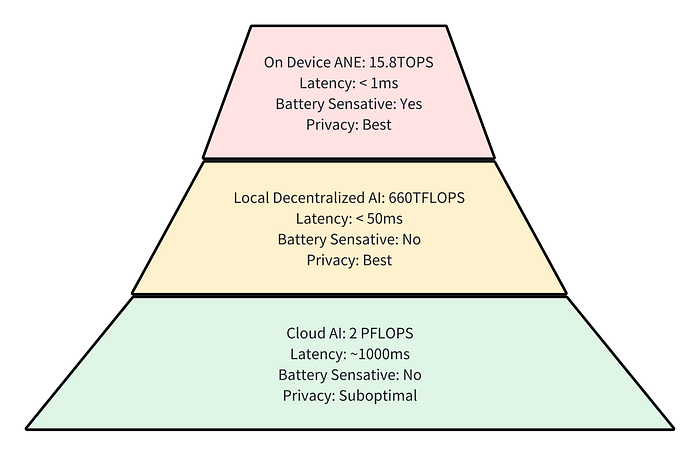

## Vision Pro and Decentralized GenAI  

Vision Pro 和去中心化 GenAI

Vision Pro is an innovative spatial computing device that’s reshaping our interaction with digital spaces. After a brief period of use, it’s evident that it could render traditional devices like TVs, cinemas, and iPads obsolete. Similar to the iPhone’s disruption of consumer electronics by replacing devices like music players and cameras, Vision Pro has the potential to redefine the landscape in the near future.  

Vision Pro 是一款创新的空间计算设备，它正在重塑我们与数字空间的互动。经过短暂的使用，很明显它可能会使电视、电影院和 iPad 等传统设备过时。与iPhone通过取代音乐播放器和相机等设备来颠覆消费电子产品类似，Vision Pro有可能在不久的将来重新定义这一格局。

The substantial on-device processing capability of Vision Pro, powered by the M2 + R1 chips, is a critical factor in its potential to surpass existing products, potentially offering a performance five times greater than current headsets.  

由 M2 + R1 芯片提供支持的 Vision Pro 强大的设备端处理能力是其有可能超越现有产品的关键因素，其性能可能是当前头戴式设备的五倍。

Generative AI, which excels at creating new, innovative content, is particularly suited to the spatial computing environment of Vision Pro. It’s expected to seamlessly blend reality with virtual creativity. The capacity for **Realtime** and **Interactive** is anticipated to become a cornerstone of Generative AI applications on Vision Pro. However, this ambition faces two significant challenges:  

生成式 AI 擅长创建新的创新内容，特别适合 Vision Pro 的空间计算环境。它有望将现实与虚拟创意无缝融合。实时和交互式功能有望成为 Vision Pro 上生成式 AI 应用程序的基石。然而，这一雄心壮志面临着两个重大挑战：

-   The M2 chip, despite its prowess, is not adequately equipped for the intensive demands of Generative AI. It’s capable of delivering 15.8 TOPS, but this pales in comparison to the capabilities of high-end GPUs like the RTX 4090, which can deliver up to 660 TFLOPS (FP8) for AI-centric tasks.  
    
    M2芯片尽管实力强大，但不足以满足生成式AI的密集需求。它能够提供 15.8 TOPS，但与 RTX 4090 等高端 GPU 的能力相比，这相形见绌，后者可以为以 AI 为中心的任务提供高达 660 TFLOPS （FP8）。
-   The battery life of Vision Pro is a valuable resource. As such, optimizing the efficiency of every computational task is paramount.  
    
    Vision Pro 的电池寿命是宝贵的资源。因此，优化每个计算任务的效率至关重要。

The current solutions for implementing real-time and interactive GenAI are not entirely satisfactory. The primary methods involve on-device AI inference (utilizing ANE, M2 GPU) or cloud-based AI (leveraging AI model services). The former approach is detrimental to battery life, while the latter incurs significant costs due to the extensive data transmission required between the user and data centers.  

目前用于实现实时和交互式GenAI的解决方案并不完全令人满意。主要方法涉及设备上的 AI 推理（利用 ANE、M2 GPU）或基于云的 AI（利用 AI 模型服务）。前一种方法不利于电池寿命，而后者则由于用户和数据中心之间需要大量数据传输而产生大量成本。

HippoML has been contemplating this challenge for an extended period. Initially, we believed that the capabilities of our HippoEngine could facilitate the development of a robust, [decentralized AI inference network](https://blog.hippoml.com/super-ai-creativity-app-run-with-local-gpu-on-mac-windows-linux-early-access-388a4bf20a26). Our estimations suggested that with the participation of just 10% of Steam’s GPU user base, the network’s int8 computational capacity could rival that of a major cloud provider’s FP16 computational power. However, the challenge of incentivizing user participation and devising a profitable model was formidable. The proposition of rerouting API calls from cloud servers to local gaming cards lacked sufficient appeal.  

HippoML长期以来一直在考虑这一挑战。最初，我们相信我们的 HippoEngine 的功能可以促进开发一个强大的、去中心化的 AI 推理网络。我们的估计表明，只有 10% 的 Steam GPU 用户群参与其中，该网络的 int8 计算能力可以与主要云提供商的 FP16 计算能力相媲美。然而，激励用户参与和设计有利可图的模式的挑战是艰巨的。将 API 调用从云服务器重新路由到本地游戏卡的提议缺乏足够的吸引力。

The introduction of Vision Pro has brought newfound clarity and enhanced the appeal of this technological proposition. By reallocating AI computational tasks to local devices such as AI PCs (like gaming PCs) or other home devices, we foresee the potential for a cost-effective, private, and energy-efficient alternative for real-time and interactive GenAI, a solution that cloud-based APIs are currently unable to rival.  

Vision Pro的推出带来了新的清晰度，并增强了这一技术主张的吸引力。通过将 AI 计算任务重新分配给本地设备，例如 AI PC（如游戏 PC）或其他家庭设备，我们预见到实时和交互式 GenAI 的具有成本效益、私有性和节能的替代方案的潜力，这是基于云的 API 目前无法与之匹敌的解决方案。

Hierarchy of AI computation for Vision Pro  

Vision Pro 的 AI 计算层次结构

A significant shift in the Decentralized AI network is the transition from a public inference network to private networks for individual users or families. We can offer development kits that allow users to effortlessly integrate their computational devices, such as Mac Mini, Mac Studio, and AI PCs, into their personal AI inference network. Concurrently, for Vision Pro, the development kit is designed to enable apps to leverage the benefits of the decentralized network, ensuring moderate network latency.  

去中心化人工智能网络的一个重大转变是从公共推理网络过渡到个人用户或家庭的专用网络。我们可以提供开发套件，使用户能够毫不费力地将他们的计算设备（如 Mac Mini、Mac Studio 和 AI PC）集成到他们的个人 AI 推理网络中。同时，对于 Vision Pro，该开发套件旨在使应用程序能够利用去中心化网络的优势，确保适度的网络延迟。

## Decentralized GenAI and the Future of AI PCs  

去中心化的 GenAI 和 AI PC 的未来

Decentralized GenAI heavily depends on AI PCs as a primary source of AI computation. Currently, there are several solutions available:  

去中心化的 GenAI 严重依赖 AI PC 作为 AI 计算的主要来源。目前，有几种解决方案可用：

-   NVIDIA Gaming PC: Offers high FLOPS and low GPU memory, making it suitable for Diffusion models.  
    
    NVIDIA 游戏 PC：提供高 FLOPS 和低 GPU 内存，使其适用于 Diffusion 型号。
-   Mac Studio: Features low FLOPS but high Unified Memory, which is advantageous for Decoding models.  
    
    Mac Studio：具有低 FLOPS 但高统一内存的特点，这对解码模型很有优势。
-   AMD Gaming PC: Low FLOPS and low GPU memory with large cache, which is great for medium size Decoding models.  
    
    AMD 游戏 PC：低 FLOPS 和低 GPU 内存，具有大缓存，非常适合中型解码模型。
-   TinyBox and other similar devices: The Return on Investment (ROI) is not well-defined.  
    
    TinyBox 和其他类似设备：投资回报率 （ROI） 没有明确定义。

We are contemplating the optimal design for future AI PCs. Based on what we’ve learned from the [Multiple-Level Model Caching System](https://blog.hippoml.com/unified-datacenter-local-foundation-model-serving-beyond-docker-way-a929003fa07c), we believe that the PCI-E interface is a significant hindrance to delivering a cost-effective and high-quality AI experience.  

基于我们从多级模型缓存系统中学到的知识，我们认为 PCI-E 接口是提供具有成本效益和高质量 AI 体验的重大障碍。

We envision a future where AI PCs move away from the traditional PCI-E interface between CPU and GPU. Apple has done this, and a more powerful ANE on desktop will significantly boost its AI experience. Alternatives like AMD’s APU approach with extendable DDR memory and NVIDIA’s Grace-Hopper NVLink seem promising. A fundamental concept is to design a learning system that capitalizes on the memory hierarchy. With the current state of PCI-E, we are limited to performing introductory model-level caching with moderate latency. Considering the operational nature of neural networks during inference — where only one layer is active while the rest remain idle in memory — we don’t require extensive HBM like today’s MI-300A or GH200 for AI PC applications. Instead, we propose treating HBM as a faster cache and DDR memory as slower storage. With solutions like APU or NVLink, and after thorough simulation, it is possible to develop products that are affordable for personal use and can handle more AI inference tasks without compromising speed, meanwhile fits for all AI models.  

我们设想未来，AI PC 将摆脱 CPU 和 GPU 之间的传统 PCI-E 接口。苹果已经做到了这一点，在桌面上更强大的 ANE 将显着提升其 AI 体验。AMD的APU方法和NVIDIA的Grace-Hopper NVLink等替代方案似乎很有前途。一个基本概念是设计一个利用内存层次结构的学习系统。在PCI-E的当前状态下，我们只能以中等延迟执行入门级模型级缓存。考虑到神经网络在推理过程中的操作性质（其中只有一层处于活动状态，而其余层在内存中保持空闲状态），我们不需要像今天的 MI-300A 或 GH200 那样用于 AI PC 应用的大量 HBM。相反，我们建议将 HBM 视为更快的缓存，将 DDR 内存视为较慢的存储。借助 APU 或 NVLink 等解决方案，经过彻底的仿真，可以开发出价格合理的产品，供个人使用，并且可以在不影响速度的情况下处理更多的 AI 推理任务，同时适合所有 AI 模型。

As data privacy regulations become increasingly stringent and low-latency devices such as Vision Pro are widely adopted, we anticipate that AI PCs will gain widespread adoption in the future, potentially becoming as common as water heaters or solar panels in today’s households. In the future, home builders might pose the question, **“How many PetaFLOPS do you need in your new house?”**  

随着数据隐私法规的日益严格和 Vision Pro 等低延迟设备的广泛采用，我们预计 AI PC 将在未来获得广泛采用，并可能像当今家庭中的热水器或太阳能电池板一样普遍。将来，房屋建筑商可能会提出这样的问题：“您的新房子需要多少 PetaFLOPS？

## We are listening 我们在倾听

We are eager to hear your feedback, both from users and developers. If you are interested in creating a Realtime & Interactive GenAI App with Vision Pro, we are more than ready to listen to your needs. Your input is invaluable, as it will help us refine our development priority to benefit a broader audience.  

我们渴望听到您来自用户和开发人员的反馈。如果您有兴趣使用Vision Pro创建实时和交互式GenAI应用程序，我们随时准备倾听您的需求。您的意见非常宝贵，因为它将帮助我们完善我们的发展重点，使更广泛的受众受益。

Join our Discord: [https://discord.com/invite/ZP8weNy5yQ](https://discord.com/invite/ZP8weNy5yQ)  

加入我们的 Discord：https://discord.com/invite/ZP8weNy5yQ
