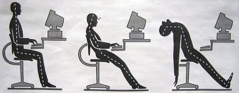

Well I’m in the working world again. I’ve found myself a well-paying gig in the engineering industry, and life finally feels like it’s returning to normal after my nine months of traveling.  

好吧，我又回到了工作世界。我在工程行业找到了一份高薪工作，在九个月的旅行之后，生活终于恢复正常了。

Because I had been living quite a different lifestyle while I was away, this sudden transition to 9-to-5 existence has exposed something about it that I overlooked before.  

因为在我不在的时候，我的生活方式已经完全不同了，这种突然转变为朝九晚五的生活暴露了我以前忽视的一些事情。

Since the moment I was offered the job, I’ve been markedly more careless with my money. Not stupid, just a little quick to pull out my wallet. As a small example, I’m buying expensive coffees again, even though they aren’t nearly as good as New Zealand’s exceptional flat whites, and I don’t get to savor the experience of drinking them on a sunny café patio. When I was away these purchases were less off-handed, and I enjoyed them more.  

自从我得到这份工作的那一刻起，我对我的钱就明显更加粗心了。不傻，只是快点掏出钱包而已。举个小例子，我再次购买昂贵的咖啡，尽管它们远不如新西兰优质的纯白咖啡，而且我无法享受在阳光明媚的咖啡馆露台上喝它们的体验。当我不在的时候，我不会那么随手购买这些东西，而且我更喜欢它们。

I’m not talking about big, extravagant purchases. I’m talking about small-scale, casual, promiscuous spending on stuff that doesn’t really add a whole lot to my life. And I won’t actually get paid for another two weeks.  

我说的不是大笔、奢侈的购买。我说的是小规模、随意、乱七八糟的消费，这些消费并不能真正给我的生活带来很多好处。而且我实际上在接下来的两周内都不会得到报酬。

In hindsight I think I’ve always done this when I’ve been well-employed — spending happily during the “flush times.” Having spent nine months living a no-income backpacking lifestyle, I can’t help but be a little more aware of this phenomenon as it happens.  

事后看来，我认为当我工作良好时，我总是这样做——在“繁荣时期”快乐地消费。在经历了九个月的无收入背包旅行生活方式后，我情不自禁地对这种现象的发生有了更多的认识。

I suppose I do it because I feel I’ve regained a certain stature, now that I am again an amply-paid professional, which seems to entitle me to a certain level of wastefulness. There is a curious feeling of power you get when you drop a couple of twenties without a trace of critical thinking. It feels good to exercise that power of the dollar when you know it will “grow back” pretty quickly anyway.  

我想我这样做是因为我觉得我已经恢复了一定的地位，现在我又成为了一名薪水丰厚的专业人士，这似乎让我有一定程度的浪费。当你二十多岁时没有任何批判性思维的时候，你会产生一种奇怪的权力感。当你知道美元无论如何都会很快“增长”时，行使美元的力量感觉很好。

What I’m doing isn’t unusual at all. Everyone else seems to do this. In fact, I think I’ve only returned to the normal consumer mentality after having spent some time away from it.  

我正在做的事情一点也不奇怪。其他人似乎都这样做。事实上，我认为我是在远离正常消费一段时间后才回到正常消费心态的。

One of the most surprising discoveries I made during my trip was that I spent much less per month traveling foreign counties (including countries more expensive than Canada) than I did as a regular working joe back home. I had much more free time, I was visiting some of the most beautiful places in the world, I was meeting new people left and right, I was calm and peaceful and otherwise having an unforgettable time, and somehow it cost me much less than my humble 9-5 lifestyle here in one of Canada’s least expensive cities.  

我在旅行中最令人惊讶的发现之一是，我每个月在国外旅行的花费（包括比加拿大贵的国家）比我在家里的普通工作人员少得多。我有更多的空闲时间，我参观了世界上一些最美丽的地方，我结识了左右的新朋友，我平静祥和，否则就度过了一段难忘的时光，不知何故，它的花费比我的要少得多。在加拿大生活成本最低的城市之一，过着简陋的朝九晚五的生活方式。

It seems I got much more for my dollar when I was traveling. Why?  

看来我在旅行时得到了更多的钱。为什么？

### A Culture of Unnecessaries  

不必要的文化

Here in the West, a lifestyle of unnecessary spending has been deliberately cultivated and nurtured in the public by big business. Companies in all kinds of industries have a huge stake in the public’s penchant to be careless with their money. They will seek to encourage the public’s habit of casual or non-essential spending whenever they can.  

在西方，大企业刻意向公众培育和培育了一种不必要的消费生活方式。公众乱花钱的倾向对各行各业的公司都有很大的影响。他们将尽可能鼓励公众养成随意或非必要消费的习惯。

In the documentary _The Corporation_, a marketing psychologist discussed one of the methods she used to increase sales. Her staff carried out a study on what effect the nagging of children had on their parents’ likelihood of buying a toy for them. They found out that 20% to 40% of the purchases of their toys _would not have occurred_ if the child didn’t nag its parents. One in four visits to theme parks would not have taken place. They used these studies to market their products directly to children, encouraging them to nag their parents to buy.  

在纪录片《公司》中，一位营销心理学家讨论了她用来增加销量的方法之一。她的工作人员进行了一项研究，研究孩子的唠叨对父母为他们购买玩具的可能性有何影响。他们发现，如果孩子不唠叨父母，20% 到 40% 的玩具就不会被购买。四分之一的人不会去主题公园。他们利用这些研究直接向儿童推销产品，鼓励他们催促父母购买。

This marketing campaign alone represents many millions of dollars that were spent because of demand that was completely manufactured.  

仅此营销活动就代表了因完全制造的需求而花费的数百万美元。

> “You can manipulate consumers into wanting, and therefore buying, your products. It’s a game.” ~ Lucy Hughes, co-creator of “The Nag Factor”  
> 
> “你可以操纵消费者想要并因此购买你的产品。游戏而已。” 〜露西·休斯（Lucy Hughes），“The Nag Factor”的联合创始人

This is only one small example of something that has been going on for a very long time. Big companies didn’t make their millions by earnestly promoting the virtues of their products, they made it by creating a culture of hundreds of millions of people that buy way more than they need and try to chase away dissatisfaction with money.  

这只是已经发生了很长时间的事情的一个小例子。大公司并不是通过认真宣传其产品的优点来赚到数百万美元的，而是通过创造一种让数亿人购买超出他们需要的东西并试图消除对金钱的不满的文化来实现的。

We buy stuff to cheer ourselves up, to keep up with the Joneses, to fulfill our childhood vision of what our adulthood would be like, to broadcast our status to the world, and for a lot of other psychological reasons that have very little to do with how useful the product really is. How much stuff is in your basement or garage that you haven’t used in the past year?  

我们买东西是为了让自己高兴起来，为了跟上别人的脚步，为了实现我们童年对成年生活的憧憬，为了向世界展示我们的地位，以及出于许多其他无关紧要的心理原因产品的真正实用性。您的地下室或车库里有多少东西是您过去一年没有使用过的？

### The real reason for the forty-hour workweek  

每周工作四十小时的真正原因

The ultimate tool for corporations to sustain a culture of this sort is to develop the 40-hour workweek as the normal lifestyle. Under these working conditions people have to build a life in the evenings and on weekends. This arrangement makes us naturally more inclined to spend heavily on entertainment and conveniences because our free time is so scarce.  

企业维持这种文化的终极工具是将每周 40 小时工作时间发展为正常生活方式。在这种工作条件下，人们必须在晚上和周末建立自己的生活。这种安排使我们自然更倾向于在娱乐和便利上花费大量资金，因为我们的空闲时间是如此稀缺。

I’ve only been back at work for a few days, but already I’m noticing that the more wholesome activities are quickly dropping out of my life: walking, exercising, reading, meditating, and extra writing.  

我才回到工作几天，但我已经注意到，更有益健康的活动正在迅速从我的生活中消失：散步、锻炼、阅读、冥想和额外的写作。

The one conspicuous similarity between these activities is that they cost little or no money, but they take time.  

这些活动之间一个显着的相似之处在于，它们花费很少或根本不需要花钱，但需要时间。

Suddenly I have a lot more money and a lot less time, which means I have a lot more in common with the typical working North American than I did a few months ago. While I was abroad I wouldn’t have thought twice about spending the day wandering through a national park or reading my book on the beach for a few hours. Now that kind of stuff feels like it’s out of the question. Doing either one would take most of one of my precious weekend days!  

突然之间，我有了更多的钱和更少的时间，这意味着我与典型的北美工作人员比几个月前有更多的共同点。当我在国外时，我会毫不犹豫地花一天时间在国家公园漫步或在海滩上读几个小时的书。现在这种事情感觉像是不可能的。做任何一件事都会占用我宝贵的周末的大部分时间！

The last thing I want to do when I get home from work is exercise. It’s also the last thing I want to do after dinner or before bed or as soon as I wake, and that’s really all the time I have on a weekday.  

下班回家后我最不想做的一件事就是锻炼。这也是我晚饭后、睡前或醒来后最不想做的事情，而这实际上是我工作日的所有时间。

This seems like a problem with a simple answer: work less so I’d have more free time. I’ve already proven to myself that I can live a [fulfilling lifestyle](http://amzn.to/Z9GdtG) with less than I make right now. Unfortunately, this is close to impossible in my industry, and most others. You work 40-plus hours or you work zero. My clients and contractors are all firmly entrenched in the standard-workday culture, so it isn’t practical to ask them not to ask anything of me after 1pm, even if I could convince my employer not to.  

这似乎是一个简单答案的问题：减少工作，这样我就有更多的空闲时间。我已经向自己证明，我可以用比现在少的钱过上充实的生活。不幸的是，这在我的行业和大多数其他行业中几乎是不可能的。您工作 40 多个小时，或者工作时间为零。我的客户和承包商都牢牢扎根于标准工作日文化中，因此要求他们在下午 1 点之后不要向我询问任何事情是不切实际的，即使我可以说服我的雇主不要这样做。

The eight-hour workday developed during the industrial revolution in Britain in the 19th century, as a respite for factory workers who were being exploited with 14- or 16-hour workdays.  

八小时工作制是在 19 世纪英国工业革命期间发展起来的，是为了让工厂工人在 14 或 16 小时工作日的剥削下得到喘息的机会。

As technologies and methods advanced, workers in all industries became able to produce much more value in a shorter amount of time. You’d think this would lead to shorter workdays.  

随着技术和方法的进步，所有行业的工人都能够在更短的时间内创造更多的价值。你可能会认为这会导致工作日缩短。

But the 8-hour workday is too profitable for big business, not because of the amount of work people get done in eight hours (the average office worker gets less than three hours of actual work done in 8 hours) but because it makes for such a purchase-happy public. Keeping free time scarce means people pay a lot more for convenience, gratification, and any other relief they can buy. It keeps them watching television, and its commercials. It keeps them unambitious outside of work.  

但是，对于大企业来说，每天工作 8 小时的利润太高了，不是因为人们在 8 小时内完成的工作量（普通上班族在 8 小时内完成的实际工作量还不到 3 小时），而是因为它使得乐于购买的公众。空闲时间稀缺意味着人们为了方便、满足和任何其他可以买到的缓解而付出更多的代价。它让他们看电视及其广告。这让他们在工作之外没有野心。

We’ve been led into a culture that has been engineered to leave us tired, hungry for indulgence, willing to pay a lot for convenience and entertainment, and most importantly, vaguely dissatisfied with our lives so that we continue wanting things we don’t have. We buy so much because it always seems like something is still missing.  

我们已经进入了一种文化，这种文化被设计成让我们感到疲倦，渴望放纵，愿意为便利和娱乐付出很多，最重要的是，对我们的生活隐约不满意，所以我们继续想要我们不想要的东西有。我们买了这么多，因为总感觉好像还缺了点什么。

Western economies, particularly that of the United States, have been built in a very calculated manner on gratification, addiction, and unnecessary spending. We spend to cheer ourselves up, to reward ourselves, to celebrate, to fix problems, to elevate our status, and to alleviate boredom.  

西方经济体，尤其是美国经济体，是建立在满足感、成瘾和不必要支出的基础上的。我们花钱是为了给自己打气、奖励自己、庆祝、解决问题、提升地位、缓解无聊。

Can you imagine what would happen if all of America stopped buying so much unnecessary fluff that doesn’t add a lot of lasting value to our lives?  

你能想象如果全美国停止购买这么多不必要的东西，而这些东西不会给我们的生活增加很多持久的价值，会发生什么？

The economy would collapse and never recover.  

经济将会崩溃并且永远不会复苏。

All of America’s well-publicized problems, including obesity, depression, pollution and corruption are what it costs to create and sustain a trillion-dollar economy. For the economy to be “healthy”, America has to remain unhealthy. Healthy, happy people don’t feel like they need much they don’t already have, and that means they don’t buy a lot of junk, don’t need to be entertained as much, and they don’t end up watching a lot of commercials.  

美国所有广为人知的问题，包括肥胖、抑郁、污染和腐败，都是创造和维持万亿美元经济的代价。为了使经济“健康”，美国必须保持不健康。健康、快乐的人不会觉得自己需要太多他们还没有的东西，这意味着他们不会买很多垃圾，不需要那么多娱乐，而且他们最终也不会看电视很多广告。

The culture of the eight-hour workday is big business’ most powerful tool for keeping people in this same dissatisfied state where the answer to every problem is to buy something.  

八小时工作日的文化是大企业最有力的工具，它让人们处于同样的不满状态，即所有问题的答案都是买东西。

You may have heard of Parkinson’s Law. It is often used in reference to time usage: the more time you’ve been given to do something, the more time it will take you to do it. It’s amazing how much you can get done in twenty minutes if twenty minutes is all you have. But if you have all afternoon, it would probably take way longer.  

您可能听说过帕金森定律。它通常用于指时间的使用：给你做某事的时间越多，你做这件事所需的时间就越多。如果你只有二十分钟，你在二十分钟内能完成多少事情，真是令人惊奇。但如果你有整个下午的时间，可能会花更长的时间。

Most of us treat our money this way. The more we make, the more we spend. It’s not that we suddenly _need_ to buy more just because we make more, only that we _can_, so we do. In fact, it’s quite difficult for us to avoid increasing our standard of living (or at least our rate of spending) every time we get a raise.  

我们大多数人都这样对待我们的钱。我们赚的越多，花的就越多。这并不是说我们仅仅因为生产更多而突然需要购买更多，只是我们可以，所以我们就这样做了。事实上，每次加薪时，我们很难避免生活水平（或至少是支出率）的提高。

I don’t think it’s necessary to shun the whole ugly system and go live in the woods, pretending to be a deaf-mute, as Holden Caulfield often fantasized. But we could certainly do well to understand what big commerce really wants us to be. They’ve been working for decades to create millions of ideal consumers, and they have succeeded. Unless you’re a real anomaly, your lifestyle has already been designed.  

我认为没有必要像霍尔顿·考菲尔德经常幻想的那样，避开整个丑陋的制度，去树林里生活，假装聋哑人。但我们当然可以很好地理解大型商业真正希望我们成为什么样的人。几十年来，他们一直致力于创造数以百万计的理想消费者，并且他们已经成功了。除非你是一个真正的异类，否则你的生活方式已经被设计好了。

The perfect customer is dissatisfied but hopeful, uninterested in serious personal development, highly habituated to the television, working full-time, earning a fair amount, indulging during their free time, and somehow just getting by.  

完美的顾客是不满意但充满希望的，对严肃的个人发展不感兴趣，高度习惯于电视，全职工作，收入相当可观，在空闲时间沉迷，不知何故勉强度日。

Is this you? 这是你吗？

Two weeks ago I would have said hell no, that’s not me, but if all my weeks were like this one has been, that might be wishful thinking.  

两周前，我会说天哪，不，那不是我，但如果我所有的几周都像这周一样，那可能是一厢情愿的想法。

\*\*\*

### **Related to this article: 与本文相关：**

[**How to Make Trillions of Dollars  

如何赚取数万亿美元**](https://www.raptitude.com/2011/01/how-to-make-trillions-of-dollars/)

[**An Interview with The Man  

对这个人的采访**](https://www.raptitude.com/2013/09/an-interview-with-the-man/)

_Photo by [joelogon](http://www.flickr.com/photos/joelogon/) 乔洛贡摄_

### If you liked this post, get Raptitude sent to you. (It's free.)
