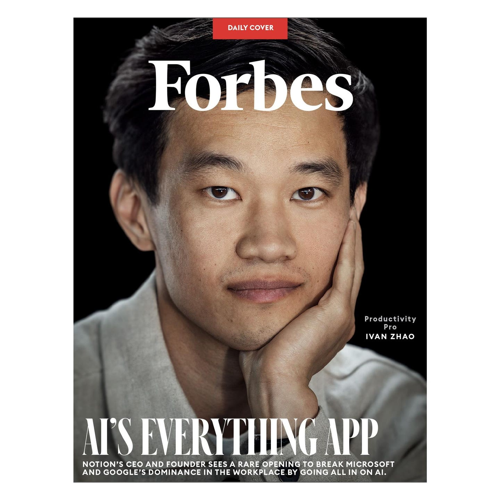
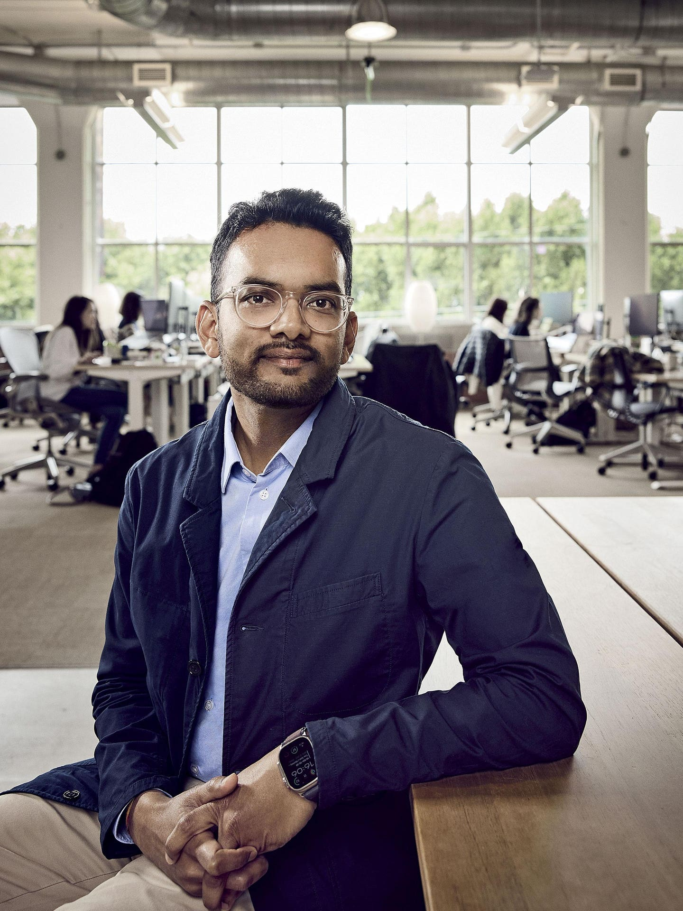
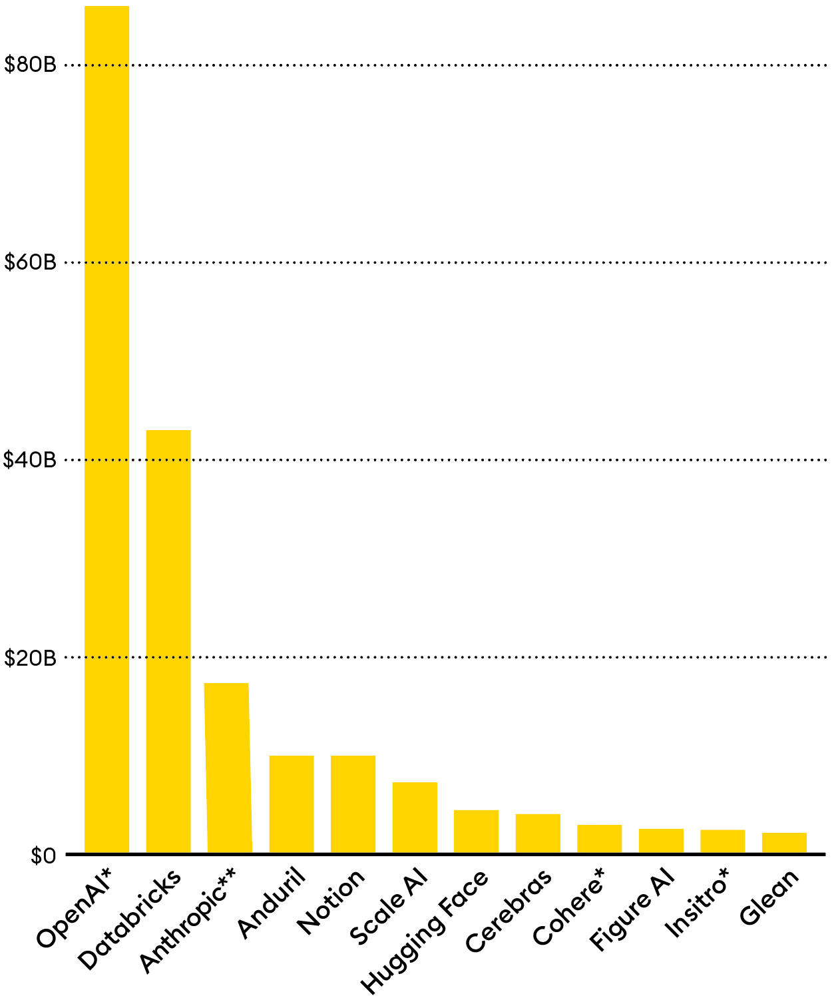

Notion 的联合创始人 Ivan Zhao 凭借其优雅的生产力应用程序在硅谷投资者和广大用户中赢得了极大的关注，该应用一度火爆到服务器都承受不住了。现在，这家盈利的创业公司的 CEO 看到了一个突破机会，他计划抓住 AI 的先机并大胆进攻，挑战微软和谷歌在职场的主导地位。

#### 作者：[Kenrick Cai](https://www.forbes.com/sites/kenrickcai/), 福布斯员工

___

**Ivan Zhao** 的创业理念是：文字处理器的功能应该像白纸一样，无所不能。 [Josh Kopelman](https://www.forbes.com/profile/josh-kopelman/), 常驻 [Midas List](https://www.forbes.com/lists/midas/)，并且是 First Round Capital 的联合创始人，因 Zhao 关于纸张起源的深入而不寻常的演讲而印象深刻，在 2013 年的种子轮融资中为他写下了最大的一笔。

“我记得走出会议室时我在想，'这完全不同于我听过的任何创业者的演讲，'”Kopelman 说。 “没有任何截图或原型。这是一次非常理论的讨论，但我觉得我能够深刻理解他的愿景。”

CODY PICKENS 为福布斯拍摄

但 Kopelman 是少数派。两年后，人们对 Notion 仍有些不理解，这是 Zhao 打造的那款软件编辑器，他未能找到一个有效的方式来进行说明。只有少数人觉得需要这样一个可以自定义程序的工具。Zhao 觉得，当他看到 First Round 的员工在使用 Notion 时，他们似乎是“出于怜悯”在使用它，他回忆说。

“软件还不够完善，”他坦言，“你知道还可以更优秀，你也知道优秀的感觉，但是你还没找到那条路。”

在公司岌岌可危时，赵与合伙人西蒙·拉斯特采取了激进措施：裁员、转租旧金山办公室并迁至日本京都以降低成本。得益于赵母亲的 15 万美元紧急贷款，他们有了重新出发的机会并推出了“Notion 1.0”。这个版本的 Notion 在外表上是一个极简主义的生产力工具，类似于 Google 文档，但加入了制作维基和管理待办事项的功能。2016 年 8 月，他们在 Product Hunt 上发布了该产品，迅速爆红，成为当日、当周乃至当月的明星产品。几周后，Notion 开始实现盈利，成为硅谷的明星初创公司之一。

TICKET MASTER | 2018 年加入并担任首席运营官的 Akshay Kothari 在接下来的六个月中解答了无数用户咨询。“每一天，我都深刻感受到自己对产品认知的不足。Notion 被使用的多样性让人赞叹。”CODY PICKENS FOR FORBES

2018 年 10 月，赵和拉斯特带着成就感返回旧金山。Notion 依靠口碑在全球范围内迅速传播，80% 的用户来自美国以外。2019 年，用户数突破一百万大关。学生们用它整理待办事项、记笔记；设计师和艺术家则用它来展示他们的项目和作品集。YouTube 上充斥着各种“我如何使用 Notion”的视频教程。

人们之所以需要这些视频，是因为 Notion 虽然功能强大，但连最简单的待办事项列表的定制选项也可能让人摸不着头脑。其中一个非常受欢迎的视频是一份简明的软件使用指南，教你如何上手使用 Notion，目的是帮助你[“避免抓狂”](https://www.youtube.com/watch?v=FrhFvIsq86g)。但 Notion 的高度可定制性正是其在工作中大显身手的原因。DoorDash 和 Nike 的员工使用它来管理项目或分享笔记。在 McKinsey，一位合伙人将 Notion 用于整理家中的披萨食谱，之后这一做法在团队中也开始流行。Adobe 的首席产品官 Scott Belsky 则利用 Notion 来整理他的研究资料，并用其写下了他的畅销书《The Messy Middle》的初稿。他评价说：“Notion 精妙地融合了网站与文档的概念。”

2021 年 1 月，一些“我是如何使用 Notion 的”视频在 TikTok 上火爆传播，导致需求激增，以至于公司的服务器承受不住，迫使 Zhao 暂停所有产品开发六个月以强化后端设施。当时，这款应用的用户已达 2000 万，现在用户数已逼近 1 亿，Zhao 表示。据 _Forbes_ 报道，去年 Notion 的收入达到了 2.5 亿美元，并且仍保持盈利。

在 Notion 爆红期间，Zhao 在管理上展现了非凡的控制力，这在同等规模的创业公司中非常罕见。尽管有投资者向 Notion 投资了约 3.3 亿美元，但他们中没有人获得董事会席位。由于投资者争相投资，Zhao 几乎无需让步。他在 2022 年增加了第一个外部董事会成员——一名财务审计师。Notion 长期保持盈利的状态也为他在筹资时减少股权稀释提供了优势。据 _Forbes_ 估算，37 岁的 Zhao 至少还持有公司 30% 的股份，根据 Notion 在二级市场 5 亿美元的估值，这部分股份价值 15 亿美元。2018 年加入的 Akshay Kothari 和 30 岁的 Last 作为名义上的联合创始人，由于是后来加入的，所以持股可能较少。

#### [](https://baoyu.io/translations/story/10-billion-productivity-startup-notion-wants-to-build-your-ai-everything-app#%E5%9C%A8%E7%A1%85%E8%B0%B7%E9%A3%8E%E9%99%A9%E8%B5%84%E6%9C%AC%E5%AE%B6%E5%B7%B2%E5%B0%86%E4%B8%80%E4%BA%9B%E6%9C%80%E7%83%AD%E9%97%A8%E7%9A%84%E4%BA%BA%E5%B7%A5%E6%99%BA%E8%83%BD%E5%88%9D%E5%88%9B%E4%BC%81%E4%B8%9A%E7%9A%84%E4%BC%B0%E5%80%BC%E6%8E%A8%E8%87%B3%E9%AB%98%E4%BD%8D%E5%85%B6%E4%B8%AD%E5%8C%85%E6%8B%AC-openai-%E5%92%8C-anthropic%E5%AE%83%E4%BB%AC%E7%9A%84%E6%A8%A1%E5%9E%8B%E4%B8%BA-notion-%E7%9A%84%E4%BA%BA%E5%B7%A5%E6%99%BA%E8%83%BD%E4%BA%A7%E5%93%81%E6%8F%90%E4%BE%9B%E4%BA%86%E5%9F%BA%E7%A1%80)在硅谷，风险资本家已将一些最热门的人工智能初创企业的估值推至高位。其中包括 OpenAI 和 Anthropic，它们的模型为 Notion 的人工智能产品提供了基础。

___

Notion 的上一次重大发布是在 2018 年，推出了电子表格和数据库。今年晚些时候，该公司希望推出 Notion 3.0。用户在 2023 年 11 月该公司推出一个人工智能机器人时得到了预览，该机器人可以迅速找出存储在 Notion 内的任何内容，这是该公司对生成式 AI (Generative AI) 的大胆投注的一部分，这使它获得了 _Forbes_ 第六届 [AI 50](https://www.forbes.com/lists/ai50/) 榜单上的一个位置。Notion 用户不再需要记住他们把特定信息放在哪里了。例如，你可以问机器人：“上周团队会议的要点是什么？”它将从它识别为最重要的文档中提取出来。赵 (Zhao) 说这个机器人就像他大脑的延伸：“你有忘记的自由。”

增加更多自动化—加上 1 月推出的日历服务和可能由于 2 月的一次收购而来的电子邮件客户端—赵的野心变得更加明显：要将 Notion 建设成一个办公室的全能应用，将来可能挑战 Microsoft 和 Google 的统治，这两家公司共控制了价值 520 亿美元 (2022 年销售额) 的生产力套件市场的 99%，根据 Gartner 的数据。他宣称：“我们的竞争对手是整个行业。如果你在建造乐高，你是在和玩具飞机公司还是玩具汽车公司竞争？两者都有。”

> “Notion 是赵的价值体系和创造欲望的体现。这就是为什么他不想卖掉公司。我甚至无法想象他想要公开上市。”

企业级人工智能软件在未来十年可能是一个 1 万亿美元的市场机会，根据 Wedbush 分析师 Dan Ives 的说法。“前方是一条黄砖路的增长”，即使不直接对抗 Microsoft 和 Google。赵承认这一点，但他有建设一样持久的东西的野心。“企业是一个挑战，但如果我们只是执行，我们会到达那里，”他说。

___

**虽然赵** 在加拿大英属哥伦比亚大学学习认知科学（他 17 岁那年与母亲从中国移民过去），但他也曾考虑过摄影职业，并且深入了解了当地的黑客文化，学习了网页开发。当朋友们请求他为他们的摄影作品设计展示网站时，他认为他们应该可以像使用相机一样在电脑上自由展示自己的创意。这促使他想到了开发一个灵活的编辑器，使任何人都能轻松地创建数字作品集、任务跟踪器、复杂数据库或其他任何他们想要的应用。

赵在硅谷的电子教材公司 Inkling 学习了一年后，开始推介他的 Notion 项目，那时他甚至还没有一个成型的原型。他对未来的明确愿景吸引了包括 Kopelman、Facebook 产品主管 Mike Vernal 和 Kothari 在内的天使投资者，他们投入了 75,000 美元，这是 Kothari 出售他的第一家创业公司给 LinkedIn 后的一笔资金[出售](https://www.forbes.com/sites/tomiogeron/2013/04/11/linkedin-buys-pulse-newsreader-for-90-million/)。Inkling 的共同创始人 Matt MacInnis 评论道：“他有一种与众不同的风格”，并为赵的初创项目提供了首笔 50,000 美元的投资。“他对事物的审美非常独到。”这种品味体现在他对办公室的布置上，如实行无鞋政策，亲选所有家具，尽管经费紧张，他依然不在座椅上节约，他钟爱的 Aalto 凳子虽然看似普通，但售价高达 400 美元。这折射出赵希望 Notion 达到的简洁与多用途。

了解赵的人表示，尽管赵新近的财富和 Notion 的成功，这些都未让他有太多改变。他依旧亲自为 Notion 办公室挑选家具，新添置了曲线型的 Artek 扶手椅 (每个 6,000 美元) 和 De Stijl 艺术运动风格的角形红蓝椅 (转售约 3,000 美元)，但他也作出了一些妥协：例如，办公室现在可以穿鞋进入。“Notion 是他价值观和创造欲的体现，”MacInnis 说道。“这也是他不愿出售公司或上市的原因，我想他根本就没打算这么做。”

他对于筹资也保持着怀疑态度。Index Ventures 的合伙人 Danny Rimer 记得，他在 Figma 董事会的一次会议上首次遇见赵，赵当场就直言不讳地表示，“我在探究董事会或投资者是否真的有用。”他得出的结论是，这些都是无用的。因此，他便不再安排与投资者的会面。当 Rimer 的同事 Sarah Cannon 悄无声息地拿着 Marcel Duchamp 展览的门票出现在 Notion 办公室时，因为她知道赵特别喜欢这位法国艺术家，赵却没有去参加。

“AI 产品的原生形态将大为不同于现今，我们坚信，像 Notion 这样的创新者将会是新时代的开拓者。”

赵虽然被冠以“反 VC”名声，但他自己并不这么认为。他认为这种看法起源于早期投资者 Shana Fisher，她劝他将更多时间用于开发和招聘。“只要你够耐心，终将大获全胜，”她曾这样鼓励他。

其中一位新同事是 Kothari。在 2018 年的一次例行投资者通报中，Zhao 突然向他提出了一个职位邀请：成为首席运营官。那时 Kothari 在班加罗尔管理着 LinkedIn 的千人规模的印度部门，他的妻子也正忙于他们新家的建设。尽管如此，体验了 Notion 最新发布的 2.0 产品几天之后，他决定搬到加州。“说实话，到那周末我就心动了，但还得花几个月时间来说服我的妻子，”他回忆说。为了认可他在建立销售、招聘和财务团队方面的贡献，Zhao 后来授予他联合创始人的称号。

由于疫情带来的不确定性，Zhao 觉得他需要筹备一些应急资金。但他依然是决策的最终裁决者：不引入董事会成员，尽量避免股权稀释。2020 年 2 月，仅在启动筹资 36 小时后，Index 就迅速主导了一轮价值 5000 万美元、估值 20 亿美元的投资。2021 年 10 月，Notion 再次获得了从 Coatue 和 Sequoia 的 2.75 亿美元投资。一次，Zhao 在周五早晨联系了 Sequoia 的合伙人 Vernal，给这家著名的投资公司提了个先机——如果他们能在当天内做出决定，就投资 1 亿美元。尽管 10 亿美元的估值让人感觉“很是艰难”，合伙人 Pat Grady 承认，但在简要审查财务数据后，Sequoia 很快就同意了。

“这家公司的成功，不是我，不是别的投资者，也不是其他任何人的功劳。他们自己做到了，”Fisher 说道。“这正是其中的奥妙。”

___

**2022 年 10 月** 在坎昆举行的公司离岸会议上，Last 收到了 OpenAI 的朋友发送的一封电邮，邀请他们早些体验名为 GPT-4 的 AI 模型。这让他和 Zhao 十分震撼，结果他们放弃了原计划的团队建设活动，闭关在酒店房间里，忙碌了几天，最终初步组建了一个简易的 AI 写作助手。当 ChatGPT 在随后的一个月正式推出，激起了一场企业纷纷把 AI 技术融入他们的产品的热潮时，Notion 已经抢先一步推向市场了。

2023 年，该公司推出了一个[问答机器人](https://www.forbes.com/sites/kenrickcai/2023/11/14/notion-q-and-a-ai-feature/)，能够检索 Notion 中存储的信息。这些 AI 工具主要是基于 GPT-4、Anthropic 的 Claude 和其他几种开源 AI 模型构建的。在生成式 AI（Generative AI）兴起一年半后，Notion 已经成为生产力软件领域的佼佼者。公司对使用 AI 功能的用户额外收费 8 美元/月。已有数百万用户尝试使用这些功能，据 Zhao 所说，业务发展的成果远超预期。

不过，它的竞争对手包括 Google 和 Microsoft 这样的科技巨头，Google 在其办公软件中融合了多种 AI 功能；Microsoft 则推出了与 Notion 风格相似的新协作软件 Loop。Shishir Mehrotra 曾在 Google 和 Microsoft 工作，现在他负责运营 Coda——一家小型生产力公司，也在努力打破这一市场的双寡头垄断。他说：“我经常告诉 Ivan，我们虽是竞争者，但最大的竞争对手其实是传统工具。”

AI 的未来充满不确定性，但领先者可能需要探索超出常规界面，如聊天界面之外的新形态。OpenAI 的产品负责人 Olivier Godement 表示：“AI 产品的最终形态还未出现。它将大不同于今天的模样，我们坚信，像 Notion 这样的创新者将是其真正的开创者。”

赵一直努力让 Notion 保持高效精简，通过口碑推广的方式，他避免了建立大型销售团队的需求。然而，这种情形已经一去不复返了。如今，Notion 在美国、爱尔兰、印度、韩国及日本设有办事处，员工总数达到了 650 人。其客户主要是企业而非个人，许多客户是小型创业公司。赵估计，包括 [Perplexity](https://www.forbes.com/sites/rashishrivastava/2024/04/11/inside-the-buzzy-ai-startup-coming-for-googles-lunch/)、[Pika](https://www.forbes.com/sites/kenrickcai/2023/11/27/pika-ai-video-generator-editor-series-a/) 和 [Runway](https://www.forbes.com/sites/kenrickcai/2022/12/05/runway-ml-series-c-funding-500-million-valuation/) 在内的许多 AI 50 中的新星公司都在使用 Notion，Y Combinator 有一半的团队也是如此。为了更进一步，赵正在组建一个销售团队，专门服务于大企业的特定团队，例如 McKinsey 和 OpenAI。Notion 的优势在于，像 Atlassian 这样的公司也曾是从为大机构内部的小团队提供服务开始，逐渐变成了不可或缺的办公软件。Sequoia 的 Grady 表示：“Notion 的情况也相似，如果能让各团队满意，最终整个组织采用 Notion 几乎是必然的。”

赵的目标是让 Notion 成为每个人都离不开的工具。为此，他致力于使这款软件变得无比灵活——不仅可以替代传统的工作工具，还能帮助用户管理生活。尽管他承认，他十年前对投资者承诺完全取代 Microsoft 和 Google 是一种“浪漫”的想法，这种想法有其局限性。

他补充说：“律师可能永远不会放弃 Microsoft Word，但他们可能会在其他工作环节使用 Notion。”
