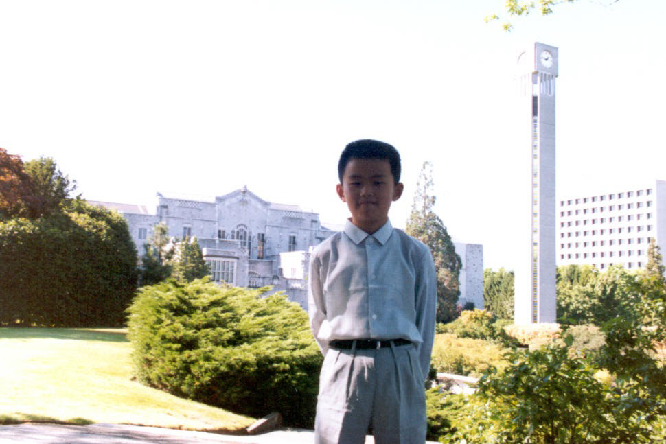
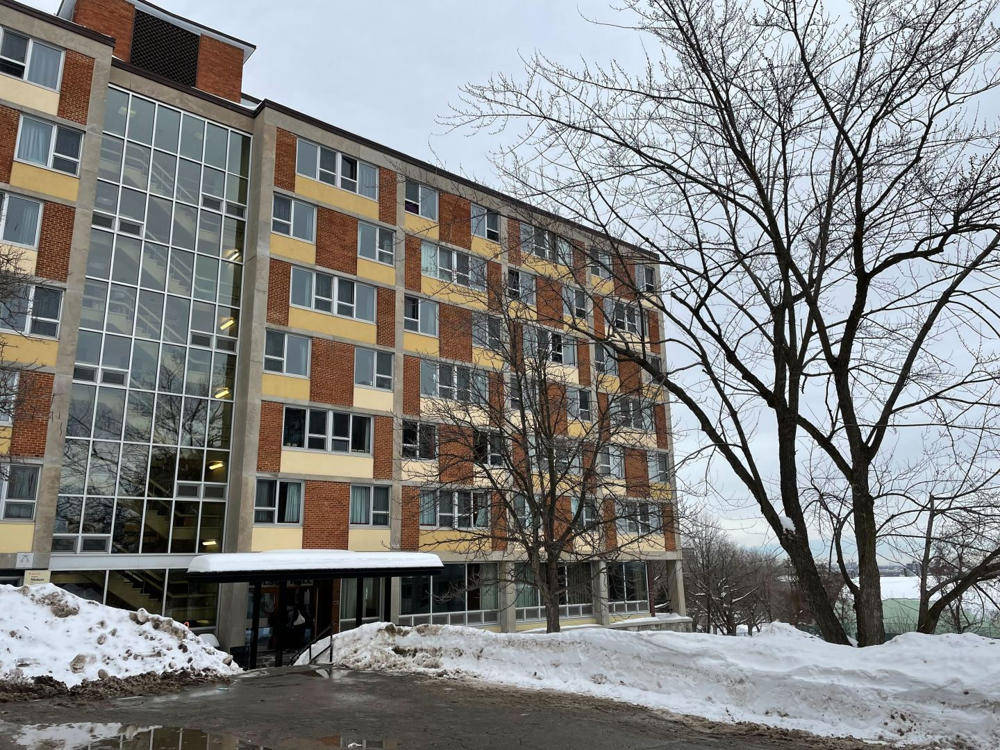

Changpeng Zhao is perched in front of a bookshelf at his apartment in Dubai, a place that—along with Paris—he currently calls home. Speaking over video, he is affable and mild-mannered, even self-deprecating. It’s a persona that clashes with the Zhao that his rivals know best: a sharp-elbowed executive who built Binance into the biggest and most influential cryptocurrency exchange in the world.  
赵长鹏坐在他位于迪拜的公寓的书架前，这里和巴黎一样，是他目前的家。在视频中，他和蔼可亲，举止温和，甚至自嘲。这是一个与他的竞争对手最熟悉的赵相冲突的角色：一位尖锐的高管，他将币安打造成世界上最大、最有影响力的加密货币交易所。

He is used to appearing in different guises. “If Americans deal with me, they’ll feel I’m Asian—slightly more Asian than most Americans, but less Asian than all other Asians they know,” he tells _Fortune_. “If an Asian person deals with me, they will feel I’m very American…but less American than other Americans they deal with. So I’m kind of in-between.”  
他习惯于以不同的伪装出现。“如果美国人和我打交道，他们会觉得我是亚洲人——比大多数美国人更亚洲，但比他们认识的所有其他亚洲人都少，”他告诉《财富》杂志。“如果一个亚洲人和我打交道，他们会觉得我很美国人......但比他们打交道的其他美国人少。所以我介于两者之间。

The harder-edged side of Zhao has put him under harsh scrutiny of late. Zhao and Binance got ahead by outsmarting competitors and playing fast and loose with regulations, as the founder hopscotched to whatever country offered the most favorable rules. Now governments around the world—including the United States—accuse Binance of patterns of deception and of violating international sanctions and money-laundering rules.  
赵长鹏强硬的一面最近让他受到了严厉的审查。赵和币安通过智取竞争对手并快速而宽松地遵守法规而取得领先，因为创始人跳房子到任何提供最有利规则的国家。现在，包括美国在内的世界各国政府指责币安存在欺骗模式，违反了国际制裁和洗钱规则。

Binance insists it has changed its ways and is now keen about compliance; the soft-spoken, modest version of Zhao is the voice of this reformed version of the company. But Binance’s about-face raises questions about who Zhao really is and how he built his business—questions made more acute by big gaps in the public record concerning both Zhao’s background and Binance’s operations.  
币安坚称它已经改变了方式，现在热衷于合规;说话轻声细语、谦虚的赵是这个改革版公司的代言人。但币安的转变引发了人们对赵的真实身份以及他如何建立业务的质疑——由于有关赵的背景和币安运营的公共记录存在巨大差距，这些问题变得更加尖锐。

A careful study of Zhao’s background fills in many of those gaps, revealing how the Binance founder evolved to become a shape-shifter who has for years played hardball to best his business rivals while maintaining the public image of a friendly everyman. In a detailed look at his past, including interviews with those who’ve known him and extensive reviews of Chinese-language media, _Fortune_ uncovered new insights into the two worlds that shaped Zhao’s identity: the Canada of his formative years and China, where he returned as a “sea turtle” and rode the wave of Shanghai’s emergence at the forefront of global business during the first part of this century.  
对赵的背景进行仔细研究填补了其中的许多空白，揭示了这位币安创始人如何演变成一个变形者，多年来一直在打硬仗，以击败他的商业竞争对手，同时保持友好的公众形象。《财富》杂志详细回顾了赵的过去，包括对认识他的人的采访和对中文媒体的广泛评论，揭示了对塑造赵长鹏身份的两个世界的新见解：他成长时期的加拿大和中国，他在那里以“海龟”的身份回到了中国，并驾驭了上海在本世纪上半叶崛起的浪潮。

Absorbing the lessons of both places, Zhao mastered many of the cutthroat business tactics that prevailed during the wild early years of China’s tech scene, while retaining the reassuring, nonthreatening affect of an average Canadian—a demeanor that deflects attention from his tactical guile.  
赵婷婷吸取了两地的教训，掌握了中国科技界早期盛行的许多残酷的商业策略，同时保留了普通加拿大人的安心、无威胁性的影响——这种举止转移了人们对他战术诡计的注意力。

Until recently, Zhao spoke frequently to crypto and business media, but in the past few months he has given up such appearances entirely—a decision based on the fraught regulatory environment and on frustration with what Binance regards as media mischaracterizations of the company and Zhao. He broke his recent silence to speak with _Fortune_, sharing many details of his life that haven’t been previously reported. The interview provides firsthand insight into how Zhao runs his business. It also reveals how his rise dovetailed with broader trends in the Chinese diaspora, and how a brilliant but aloof father may have influenced the emergence of Binance as the big dog of crypto.  
直到最近，赵还经常与加密货币和商业媒体交谈，但在过去的几个月里，他已经完全放弃了这样的露面——这一决定是基于令人担忧的监管环境，以及对币安认为媒体对公司和赵的错误描述的挫败感。他打破了最近的沉默，接受了《财富》杂志的采访，分享了许多以前没有报道过的生活细节。这次采访提供了赵先生如何经营业务的第一手资料。它还揭示了他的崛起如何与中国侨民的更广泛趋势相吻合，以及一位才华横溢但冷漠的父亲如何影响币安成为加密货币的大狗。

A ‘bookworm’ moves his family abroad  
一个“书”把他的家人搬到了国外
------------------------------------------------------

The Keremeos Court buildings are a series of neat family townhouses that are unremarkable but for their setting. Nestled in a massive rain forest of pungent cedars and ferns, the homes are part of the 2,000-acre campus of the University of British Columbia, which juts into the Pacific Ocean on the far western edge of Vancouver.  
Keremeos Court建筑是一系列整洁的家庭联排别墅，这些联排别墅并不起眼，但就其环境而言。这些房屋坐落在一片由刺鼻的雪松和蕨类植物组成的巨大热带雨林中，是不列颠哥伦比亚大学占地2000英亩的校园的一部分，该校园在温哥华最西端伸入太平洋。

It was here that 12-year-old Zhao arrived with his mother and sister in 1989, months after the Tiananmen Square massacre took place in Beijing. They came to join his father, Shengkai, whom Zhao describes as a lifelong “bookworm.” Shengkai kept studying even after the Cultural Revolution sent him, and other intellectuals like him, to learn the value of hard labor in rural villages. But thanks to Shengkai’s academic persistence, he had landed in a doctoral program in Canada to study geophysics, bringing his family to join him at UBC several years later.  
1989年，12岁的赵与母亲和妹妹一起来到这里，当时北京天安门广场大屠杀刚刚发生几个月。他们来投奔他的父亲圣凯，赵晟形容他是一个终生的“书”。即使在文化大革命之后，盛凯仍然继续学习，他和其他像他一样的知识分子，学习农村艰苦劳动的价值。但多亏了盛凯对学术的坚持，他才在加拿大攻读博士学位，学习地球物理学，几年后带着家人来到UBC与他团聚。

Changpeng Zhao at the Ladner Clock Tower in Vancouver, circa 1989, in a photograph taken by his father.  
约1989年，赵长鹏在温哥华拉德纳钟楼，这是他父亲拍摄的照片。

Courtesy of Changpeng Zhao  
图片由赵长鹏提供

The setting was a far cry from the village of Zhao’s early childhood. In Jiangsu province, schools were scarce, and classrooms were sparse and furnished with austere stone desks—common in rural counties that lacked resources—that made the winter months of learning even colder. Like his father, Zhao learned about poverty and privation in China—but also about the escape that an academic environment could provide. This came when CZ, at the age of 10, and his family left the village and moved to Hefei, a minor city in China but also home to a prominent science and technology university that enjoyed a rare degree of autonomy from the Communist Party.  
这里的环境与赵氏童年时期的村庄相去甚远。在江苏省，学校稀缺，教室稀疏，摆放着简陋的石桌——这在资源匮乏的农村县城很常见——这使得冬季的学习更加寒冷。像他的父亲一样，赵先生了解了中国的贫困和匮乏，但也了解了学术环境可以提供的逃避。10岁的CZ和他的家人离开了村庄，搬到了合肥，这是中国的一个小城市，但也是一所著名的科技大学的所在地，该大学享有罕见的自治权。

In this intellectual oasis, Zhao would sit and listen to debates between older students who would sometimes indulge him in strategy games. “Those guys they taught me how to play chess, how to play Go. They talked about different things on campus, even to the point where they were talking about politics,” Zhao recalls. “I think hanging out with people who are like seven to 10 years older than you does \[make\] you think about things slightly differently, compared to kids your age.”  
在这片知识的绿洲里，赵会坐下来听高年级学生之间的辩论，这些学生有时会沉迷于策略游戏。“那些家伙他们教我如何下棋，如何下围棋。他们在校园里谈论不同的事情，甚至到了谈论政治的地步，“赵回忆道。“我认为，与比你大7到10岁的人一起出去玩，与同龄的孩子相比，你对事情的看法略有不同。

When Zhao’s family arrived in British Columbia, it meant moving from one of the world’s most ancient civilizations to one of its youngest. When Vancouver was founded in the 1870s, few people besides First Nations communities had stepped foot there. The city quickly became a gateway connecting the flow of goods and people from China to Canada—and, for decades, was a stronghold of anti-Chinese racism. Manifestations of that bias included the notorious “head tax,” which discouraged Chinese men from bringing their wives to Canada even as they built the country’s railroads and much of the city of Vancouver. “Even though there were always Chinese \[in Vancouver\], they lived under the stairs like Harry Potter,” says Henry Yu, a historian and scholar of Chinese migration at UBC. “They were servants—not homeowners.”  
当赵的家人来到不列颠哥伦比亚省时，这意味着从世界上最古老的文明之一搬到最年轻的文明之一。当温哥华在1870年代成立时，除了原住民社区之外，很少有人踏足那里。这座城市迅速成为连接从中国到加拿大的货物和人员流动的门户，几十年来，它一直是反华种族主义的大本营。这种偏见的表现包括臭名昭著的“人头税”，它阻止中国男人将他们的妻子带到加拿大，即使他们修建了该国的铁路和温哥华市的大部分地区。“尽管（温哥华）总是有华人，但他们像哈利·波特一样住在楼梯下，”不列颠哥伦比亚大学（UBC）的历史学家和华人移民学者亨利·余（Henry Yu）说。“他们是仆人，不是房主。”

By the 1980s, though, the government had changed its tune completely. Canada, seeking to rev up and diversify its natural-resources-based economy, sought to attract the same migrants from across the Pacific it had once disdained. The plan included offering visas to those who invested C$400,000, and luring academics like Zhao’s father. Ottawa intended to signal to ambitious Chinese that “if you want to rise in the global economy, Canada was now open for business,” says Yu.  
然而，到了1980年代，政府已经完全改变了态度。加拿大寻求加速其以自然资源为基础的经济并使其多样化，并试图吸引来自太平洋彼岸的移民，这些移民曾经不屑一顾。该计划包括向投资40万加元的人提供签证，并吸引像赵父亲这样的学者。渥太华打算向雄心勃勃的中国人发出信号，“如果你想在全球经济中崛起，加拿大现在已经开放了，”Yu说。

Anti-Asian sentiment still lingered in Vancouver—jokes about Chinese drivers and the pronunciation of “fried rice” were common, and Asians could feel very unwelcome in some parts of the community—but Zhao did not encounter racism often. The high school he attended was composed of students of all ethnicities, most of whom had ties to the university. Still, Zhao was different from his classmates in key respects. He recalls that even though there were dozens of other Asian students, he was one of only two from mainland China. Most were from more-affluent Hong Kong and Taiwan and, unlike Zhao, did not live in the modest homes reserved for graduate students and campus workers.  
反亚裔情绪仍然在温哥华挥之不去——关于中国司机的笑话和“炒饭”的发音很常见，亚裔在社区的某些地方可能会感到非常不受欢迎——但赵并不经常遇到种族主义。他就读的高中由各个种族的学生组成，其中大多数与大学有联系。尽管如此，赵在关键方面与他的同学不同。他回忆说，尽管还有几十名其他亚洲学生，但他是仅有的两名来自中国大陆的学生之一。他们大多来自较富裕的香港和台湾，与赵不同，他们不住在为研究生和校园工作人员保留的简陋住宅中。

Zhao remembers a giant wealth disparity between his own family and other students, but he also recalls distinctions within the groups of affluent Chinese-speaking arrivals. “The Hong Kong kids were more into brands, fashion brands, sports cars, etc.,” he says. “The Taiwanese guys, although all very, very clearly rich…had a more of a humble attitude, and I got along with them better. I got a lot of the humble values from the Taiwanese families.”  
赵记得他自己的家庭和其他学生之间存在着巨大的贫富差距，但他也回忆起富裕的中文移民群体中的差异。“香港的孩子更喜欢品牌、时尚品牌、跑车等，”他说。“台湾人，虽然都非常非常有钱......态度比较谦虚，我和他们相处得更好。我从台湾家庭那里得到了很多谦卑的价值观。

Today, the high valuations Binance and its BNB token enjoy mean that Zhao is worth billions, but he still projects, in public at least, the “humble values.” Unlike the more obnoxious elements of the crypto crowd—those who buy Lamborghinis they can’t drive and tell crypto skeptics to “have fun staying poor”—Zhao has never adopted a flashy persona.  
如今，币安及其BNB代币所享有的高估值意味着赵拥有数十亿美元，但他仍然至少在公开场合投射出“谦逊的价值观”。与加密货币人群中更令人讨厌的人不同——那些购买兰博基尼的人，他们不会开车，并告诉加密货币怀疑论者“享受保持贫穷的乐趣”——赵从未采用华而不实的角色。

In Vancouver, while his mother worked sewing jobs and his father drove a decrepit Datsun, Zhao often got lifts in the BMWs of his friends’ parents to and from volleyball games, where he was team captain. The only splurge he recalls was his dad spending $7,000 Canadian dollars—a staggering sum at the time—for an IBM-compatible 286 computer, which the senior Zhao used for his research but also to teach his son how to program. If you want to squint at Zhao’s early life for clues he would become a billionaire, this could be one. The time he spent learning coding from a parent, whom others have described as a genius, was likely indispensable in Zhao’s later life, when he built the technology that would power Binance. “My father,” Zhao says, “is a mentor on the technical side.”  
在温哥华，当他的母亲从事缝纫工作，父亲开着一辆破旧的Datsun时，赵经常乘坐朋友父母的宝马车往返于排球比赛之间，他是排球比赛的队长。他回忆说，唯一的挥霍是他的父亲花了7000加元买了一台兼容IBM的286计算机，赵老爷子用这台电脑做研究，还教儿子编程。如果你想眯着眼睛观察赵的早年生活，寻找他会成为亿万富翁的线索，这可能是其中之一。他从一位被其他人描述为天才的父母那里学习编程的时间，在赵的晚年生活中可能是不可或缺的，当时他建立了为币安提供动力的技术。“我的父亲，”赵说，“是技术方面的导师。

Zhao as a child using his first computer, circa 1990 in Vancouver. His father purchased the computer for $7,000 Canadian, a huge sum at the time.  
1990年左右，赵在温哥华使用他的第一台电脑。他的父亲以7000加元的价格购买了这台电脑，这在当时是一笔巨款。

Courtesy of Changpeng Zhao  
图片由赵长鹏提供

In high school, where some of his more affluent friends worked for kicks or because their parents wanted them to learn the rigors of a job, Zhao stood out as one of only a few students who worked to make ends meet. That included a summer of overnight shifts at a [Chevron](https://fortune.com/company/chevron/) gas station and two years at McDonald’s. In his later life as a crypto baron, trolls have mocked Zhao’s stint at the fast-food chain, calling him “fry bitch.” But unlike some wealthy people from poor or modest upbringings, Zhao has never sought to distance himself from his working-class past, even retweeting memes of himself in McDonald’s garb.  
在高中时，他的一些比较富裕的朋友为了踢球而工作，或者因为他们的父母希望他们学习工作的严谨性，赵脱颖而出，成为为数不多的为维持生计而工作的学生之一。这包括一个夏天在雪佛龙加油站的夜班和在麦当劳的两年。在他晚年作为加密货币大亨的生活中，巨魔们嘲笑赵在快餐连锁店的工作，称他为“炸婊子”。但与一些出身贫寒或出身贫寒的富人不同，赵从未试图与工人阶级的过去保持距离，甚至在推特上转发了自己穿着麦当劳服装的表情包。

Overall, Zhao portrays his high school years as pleasant and even idyllic. He relished his four years as captain of the volleyball team and participating in Canadian national math competitions. He picked up the nickname “Champ” from a PE teacher. Zhao’s high school friend Ted Lin says the name likely caught on because many at the school struggled to pronounce “Changpeng.” Zhao adopted his current moniker, CZ—by which he is universally known today—only after entering the crypto world. Zhao says that he earlier tried going by “CP,” but ditched the name after online pals told him it was shorthand for “child porn” on the illegal marketplace Silk Road.  
总的来说，赵将他的高中时光描绘成愉快的，甚至是田园诗般的。他很享受担任排球队队长和参加加拿大全国数学竞赛的四年。他从一位体育老师那里获得了“冠军”的绰号。赵的高中朋友特德·林（Ted Lin）说，这个名字之所以流行起来，可能是因为学校里的许多人都很难发音“长鹏”。赵采用了他现在的绰号CZ——他今天广为人知——只是在进入加密世界之后。赵说，他之前尝试过用“CP”，但在网上朋友告诉他这是非法市场丝绸之路上“儿童色情”的简写后，他放弃了这个名字。

Despite his affinity for Vancouver—where he says he would like to retire—and Canada, Zhao’s professed affection is belied by some of his actions. He admits he has not stepped foot in the city for years, and he has no active ties there in the form of either family or philanthropy. Nonetheless, Zhao maintains he is Canadian not just by his passport, but by disposition. “I think like a Canadian,” he says. “We are nice people. Not aggressive. Not overly competitive and generally want to help others.”  
尽管他对温哥华和加拿大有亲和力——他说他想在那里退休——但赵公开表达的感情被他的一些行为所掩盖。他承认自己已经很多年没有踏足这座城市了，他在那里没有以家庭或慈善事业的形式建立积极的联系。尽管如此，赵坚称他是加拿大人，不仅因为他的护照，而且因为他的性格。“我像加拿大人一样思考，”他说。“我们是好人。不咄咄逼人。不过分竞争，一般都想帮助别人。

The words are a warm testament to the country where he grew up—but are also hard to square with the achievements that made him CZ, the billionaire crypto king.  
这句话是对他长大的国家的温暖证明，但也很难与使他成为亿万富翁加密货币之王 CZ 的成就相提并论。

A life-changing encounter with a bestseller  
与畅销书的邂逅改变人生
---------------------------------------------------------

As of early April, Zhao sat at No. 46 on Bloomberg’s billionaires list, with a net worth of $29 billion (Zhao describes that figure as “not accurate; it’s hard to estimate with all the fluctuations”). And his name was in the news on a daily basis. Last fall, many media accounts focused on his bold crypto trade that sank his rival, Sam Bankman-Fried, at FTX; more recent stories have examined the mounting clashes between Binance and regulators over Zhao’s own [fast-and-loose](https://fortune.com/crypto/2023/01/18/binance-admits-to-further-management-issues-with-stablecoin-assets/) business dealings. But while a lot of future rule-breaking tech entrepreneurs show off their audacious, defiant traits in their college years—think Mark Zuckerberg as portrayed in _The Social Network_—that doesn’t seem to have been the case with Zhao.  
截至 4 月初，赵在彭博社的亿万富翁榜上排名第 46 位，净资产为 290 亿美元（赵称这一数字“不准确;很难用所有的波动来估计“）。他的名字每天都在新闻中。去年秋天，许多媒体都关注了他大胆的加密货币交易，该交易在 FTX 击沉了他的竞争对手 Sam Bankman-Fried;最近的报道研究了币安与监管机构之间在赵自己的快速和宽松业务交易方面日益加剧的冲突。但是，尽管许多未来打破常规的科技企业家在大学期间展示了他们大胆、挑衅的特质——想想《社交网络》中描绘的马克·扎克伯格——但赵似乎并非如此。

After finishing high school in 1995, Zhao moved 3,000 miles to attend McGill University, leaving the temperate climate of Vancouver for French-speaking Montreal, a place gripped by winters so cold that large portions of downtown are connected by underground tunnels. By Zhao’s own account, he did little to distinguish himself academically or socially at McGill, though he switched majors from biology to computer science because “in high school, biology dealt with humans. In university, it was back to animals. I didn’t find interest in that.” In his free time, he went Rollerblading or went out for pho with friends, and hung out late in a campus computer lab, bashing code into rudimentary [Apple](https://fortune.com/company/apple/) desktops.  
1995年高中毕业后，赵搬到了3000英里外的麦吉尔大学（McGill University）就读，离开了温带气候的温哥华，来到了讲法语的蒙特利尔，那里的冬天非常寒冷，市中心的大部分地区都由地下隧道连接起来。根据赵自己的说法，他在麦吉尔大学几乎没有在学术或社交方面表现出色，尽管他将专业从生物学转到了计算机科学，因为“在高中时，生物学与人类打交道。在大学里，它又回到了动物身上。我对此没有兴趣。闲暇时，他会和朋友一起滑旱冰或出去吃河粉，在校园的计算机实验室里闲逛到很晚，把代码扔进简陋的苹果台式机上。

Zhao’s first residence at McGill University in Montreal.  
赵在蒙特利尔麦吉尔大学（McGill University）的第一个住所。

J RobertsJ·罗伯茨

Toward the end of his time of McGill, however, Zhao did publicly flash the brilliance he would later show in his professional career, cowriting a scholarly paper in 1999 about A.I.—a topic that only became sexy 20 years later—with his professor, Jeremy Cooperstock. Sitting in a Montreal coffee shop, Cooperstock says he remembers Zhao well, in part because he was the only undergraduate student in his graduate seminar. “He told me, ‘It’s not good pay, but it’s good experience,’” Cooperstock recollects. The professor added that he recalls Zhao as a personable guy who was highly intelligent—but that he was surprised years later to discover his former student had become a billionaire.  
然而，在麦吉尔大学工作即将结束时，赵确实公开展示了他后来在职业生涯中表现出的才华，他在1999年与他的教授杰里米·库珀斯托克（Jeremy Cooperstock）共同撰写了一篇关于人工智能的学术论文——这个话题在20年后才变得性感。坐在蒙特利尔的一家咖啡店里，库珀斯托克说他对赵的记忆很清楚，部分原因是他是研究生研讨会上唯一的本科生。“他告诉我，'这不是很好的薪水，但这是很好的经历，'”库珀斯托克回忆道。这位教授补充说，他回忆说，赵是一个风度翩翩、非常聪明的人，但多年后他惊讶地发现他以前的学生已经成为亿万富翁。

During this time, Zhao says, he read something that changed his life. It wasn’t an academic treatise, nor a man-versus-the-state screed like _Atlas Shrugged_, a favorite in the crypto-bro canon. Instead, it was a quintessentially middle-class, everyman selection: _Rich Dad Poor Dad_. Published in 1997, the perennial personal finance bestseller uses parables to tell the story of two fathers—one who works hard his whole life and has little to show for it, and another who gets wealthy as an entrepreneur or investor. The book made Zhao question his own father’s advice. By then, Shengkai Zhao had finished his own Ph.D. and had gone to work in the private sector, where over the next two decades he would earn professional respect—but not much material wealth.  
赵说，在这段时间里，他读到了一些改变他生活的东西。它不是一篇学术论文，也不是像阿特拉斯耸耸肩那样的人与国家熨平板，这是加密兄弟经典中的最爱。相反，这是一个典型的中产阶级，普通人的选择：富爸爸穷爸爸。这本常年出版的个人理财畅销书于1997年出版，用寓言讲述了两个父亲的故事——一个一生都在努力工作，却没有什么可展示的，另一个是作为企业家或投资者而致富的。这本书让赵质疑自己父亲的建议。那时，赵胜凯已经完成了自己的博士学位，并去了私营部门工作，在接下来的二十年里，他将在那里赢得职业尊重，但并没有太多的物质财富。

“My dad has always taught me to go work hard, you know, to get a decent job, and both my parents had that kind of mentality,” Zhao recalls. “They’re not into business. After I read _Rich Dad Poor Dad_, I started thinking, maybe I want to own a business. It wasn’t so much I have to be the CEO. But it was just creating a business that was kind of intriguing.”  
“我爸爸一直教我努力工作，要找到一份体面的工作，我的父母都有这种心态，”赵回忆道。“他们不做生意。读完《富爸爸穷爸爸》后，我开始想，也许我想拥有一家企业。与其说我必须成为首席执行官，不如说我必须成为首席执行官。但这只是创造了一个有趣的业务。

As Zhao’s thoughts turned to getting wealthy, he did make a choice that tracks with Zuckerberg and other wunderkind future billionaires: He dropped out of college. In 2000, he parlayed a summer internship with the Tokyo stock exchange into a full-time gig and decided not to return to McGill. (Many press accounts state, inaccurately, that Zhao is a McGill graduate.)  
当赵长鹏的想法转向致富时，他确实做出了一个与扎克伯格和其他未来亿万富翁一样的选择：他从大学辍学。2000年，他将东京证券交易所的暑期实习变成了全职工作，并决定不再回到麦吉尔。（许多新闻报道都不准确地称，赵是麦吉尔大学的毕业生。

His math and coding prowess soon landed him a job in another financial capital, New York City, where he developed futures-trading software for Bloomberg Trading. But four years later, even New York couldn’t compete with the allure of the hottest center of global business, and Zhao moved again—to a country he had last seen over a decade before.  
他的数学和编码能力很快使他在另一个金融之都纽约市找到了一份工作，在那里他为彭博交易开发了期货交易软件。但四年后，即使是纽约也无法与全球最热门的商业中心的吸引力相抗衡，于是赵再次搬家——搬到了十多年前他最后一次见到的国家。

A ‘sea turtle’ learns new rules in Shanghai  
一只“海龟”在上海学习新规则
------------------------------------------------------------

Shanghai, on China’s prosperous southeastern coast, was the “head of the locomotive” driving China’s economic engine at the time, says Miu Chung Yan, a social work professor at UBC who studies Chinese migration. In 2005, the year that Zhao moved to Shanghai, the city became the third-busiest container-shipping port in the world, just behind Hong Kong and Singapore; it also posted an 11% GDP increase for its 14th straight year of growth. China was on the upswing and Shanghai was at the center of it all.  
上海位于中国繁荣的东南沿海，是当时推动中国经济引擎的“火车头”，UBC研究中国移民的社会工作教授Miu Chung Yan说。2005年，也就是赵先生移居上海的那一年，上海成为世界第三繁忙的集装箱运输港口，仅次于香港和新加坡;它还公布了11%的GDP增长，连续第14年增长。中国正处于上升期，而上海则处于这一切的中心。

Critically, Zhao’s early years in Shanghai coincided with China’s golden era of tech, a time  
至关重要的是，赵长鹏在上海的早年恰逢中国科技的黄金时代  
when the nation’s homegrown technology companies and freewheeling entrepreneurs were making their meteoric ascent. Robin Li, Jack Ma, and Pony Ma—the founders, respectively, of Baidu, Alibaba, and Tencent—had launched their companies at the start of the millennium and were experiencing exponential investment and growth.  
当美国本土的科技公司和随心所欲的企业家正在迅速崛起时。李彦宏、杰克·马和小马马分别是百度、阿里巴巴和腾讯的创始人，他们在千禧年初创办了自己的公司，并经历了指数级的投资和增长。

“I was taught to go where the growth is, not…where things are already established,” Zhao says.  
“我被教导要去成长的地方，而不是......事情已经建立起来了，“赵说。

He was hardly the only young Canadian who had returned to Shanghai. A severe economic downturn in Canada during the 1990s helped spur a reverse migration that surged in the mid-2000s. Returnees like Zhao became known as “sea turtles”—a Chinese pun denoting individuals who migrated abroad but returned home to China. One study estimates that, by 2017, nearly half a million sea turtles had arrived from Canada and the rest of the world.  
他并不是唯一一个回到上海的加拿大年轻人。加拿大在1990年代严重的经济衰退助长了2000年代中期激增的反向移民。像赵这样的海归被称为“海龟”——这是一个中文双关语，表示移民到国外但回到中国的人。一项研究估计，到 2017 年，已有近五十万只海龟从加拿大和世界其他地区抵达。

The timing for Zhao and others like him couldn’t have been better. He and other young professionals held “all the advantages” of returning to China for work, Yan says. English-speaking, western-educated, and well-versed in Chinese language and culture, sea turtles were well-received in China and received outsize wages compared to local peers.  
对于赵和其他像他一样的人来说，时机再好不过了。阎说，他和其他年轻的专业人士拥有回国工作的“所有优势”。海龟会说英语，受过西方教育，精通中国语言和文化，在中国很受欢迎，与当地同龄人相比，海龟的工资也很高。

But even as he landed in a city eager to receive him, and where he spoke the language, Zhao claims it was difficult to navigate China’s faster, fiercer, freewheeling business environment, where vague rules and regulations were the norm. “I didn’t know the business culture and had to learn everything from scratch,” he recalls. After stints in New York, Tokyo, and Vancouver, where rule-based corporations and ideals of egalitarianism prevailed, the critical importance of nurturing _guanxi_—a person’s connections, particularly with state officials who could act as patrons—seemed foreign to Zhao. So did alcohol’s special role in cultivating these business relationships. Baijiu, a strong Chinese liquor, is often served during business negotiations to signify goodwill and respect.  
但是，即使他来到一个渴望接待他的城市，并且说着这种语言，赵声称很难驾驭中国更快、更激烈、更随心所欲的商业环境，模糊的规章制度是常态。 “我不了解商业文化，必须从头开始学习一切，”他回忆道。在纽约、东京和温哥华工作过一段时间后，以规则为基础的公司和平等主义的理想盛行，培养关系的至关重要性——一个人的关系，尤其是与可以充当赞助人的国家官员的关系——对赵来说似乎很陌生。酒精在培养这些商业关系方面的特殊作用也是如此。白酒是一种浓烈的中国酒，经常在商务谈判中供应，以表示善意和尊重。

“I’d read about it, I’d heard about it,” he says. “But you know, when you actually do business, you sit down at a dinner with government officials, they drink baijiu…the way they talk about _guanxi_ and sometimes other things you have to take care of, those things are very foreign to me, so I was never very comfortable with that.”  
“我读过它，我听说过它，”他说。“但你知道，当你真正做生意时，你和政府官员坐下来吃饭，他们喝白酒......他们谈论关系的方式，有时是你必须照顾的其他事情，这些事情对我来说非常陌生，所以我从来都不太舒服。

Still, Zhao quickly prospered in Shanghai. In 2005, he and four other expats founded Fusion Systems, a software-as-a-service (SaaS) firm that provided high-frequency trading systems and inked deals with the world’s biggest banks, including [Goldman Sachs](https://fortune.com/company/goldman-sachs-group/) and Credit Suisse. During this time, he learned the rules quickly—that in China, as he puts it, the rules are “deliberately unclear,” which gives the government great power in interpreting and selective enforcement of laws. The newly minted entrepreneur flexed his math and coding skills, but his role at the company also taught him how to “think like a salesperson,” as he leveraged his sea turtle identity to act as a broker between the East and the West. As a junior partner and the only “Chinese-looking guy…in a Chinese environment,” Zhao was always thinking, “How do I sell the company services? How \[are we\] going to get the next contract?”  
尽管如此，赵国强还是在上海迅速繁荣起来。2005年，他和其他四名外籍人士创立了Fusion Systems，这是一家软件即服务（SaaS）公司，提供高频交易系统，并与包括高盛（Goldman Sachs）和瑞士信贷（Credit Suisse）在内的全球最大银行签订了协议。在这段时间里，他很快就学会了规则——用他的话说，在中国，规则是“故意不明确的”，这赋予了政府解释和选择性执法的巨大权力。这位新晋企业家展示了他的数学和编码技能，但他在公司的角色也教会了他如何“像销售人员一样思考”，因为他利用自己的海龟身份充当东西方之间的经纪人。作为初级合伙人和唯一的“中国人......在中国的环境中，“赵先生一直在想，”我该如何销售公司服务？（我们）将如何获得下一份合同？

Then—as CZ lore goes—a late-night poker game in 2013 changed the trajectory of his life. At the game, China’s top Bitcoin evangelist Bobby Lee and U.S.-educated Chinese venture capitalist Ron Cao introduced Zhao to cryptocurrencies. Zhao went all in. He sold his Shanghai apartment and invested $1 million into Bitcoin. The future billionaire left Fusion Systems and joined crypto startup Blockchain.info—which in its early days functioned as a website tracking Bitcoin transactions—as head of technology. One year later, he was hired as the chief technology officer for Chinese exchange and token startup OKCoin.  
然后，正如 CZ 传说的那样，2013 年的一场深夜扑克游戏改变了他的人生轨迹。在比赛中，中国顶级比特币布道者鲍比·李（Bobby Lee）和受过美国教育的中国风险投资家罗恩·曹（Ron Cao）向赵介绍了加密货币。赵全力以赴。他卖掉了自己在上海的公寓，向比特币投资了100万美元。这位未来的亿万富翁离开了Fusion Systems，加入了加密货币初创公司 Blockchain.info，该公司早期是一个跟踪比特币交易的网站，担任技术主管。一年后，他被聘为中国交易所和代币初创公司OKCoin的首席技术官。

OKCoin was the battleground where Zhao sharpened his credentials as a swashbuckling public crypto figure, unafraid to engage in open warfare. At first, Zhao engaged the public on platforms like Reddit—something few CTOs were doing—using those forums to politely, but firmly, rebuff criticisms of OKCoin and crypto. But eight months in, in 2015, Zhao clashed with company CEO Star Xu over the direction of OKCoin. Zhao left the company, and he turned to the same platforms to rescind his earlier claims and blast his former employer.  
OKCoin 是赵长鹏磨自己作为虚张声势的公众加密货币人物的资历的战场，他不惧怕参与公开战争。起初，赵在Reddit等平台上与公众互动——很少有首席技术官在这样做——利用这些论坛礼貌但坚定地拒绝对OKCoin和加密货币的批评。但八个月后，也就是2015年，赵与公司CEO徐星就OKCoin的方向发生了冲突。赵离开了公司，他转向同样的平台，撤销了他早先的主张，并抨击了他的前雇主。

In one 1,600-word Reddit post, Zhao detailed the company’s use of bots to boost trading volumes, fake proof of reserves, and opaque financials, all under the direction of Xu. Xu, in turn, accused Zhao of fabricating his academic credentials and committing other deceitful acts. The spat eventually died down, but it showed Zhao’s willingness to throw sharp elbows in a dispute—while also helping to put the emerging crypto industry on the radar of distrustful regulators in China.  
在一篇1600字的Reddit帖子中，赵详细介绍了该公司在徐的指导下使用机器人来提高交易量、伪造储备证明和不透明的财务状况。徐反过来指控赵伪造学历并实施其他欺骗行为。这场争吵最终平息了，但它表明了赵长鹏愿意在争端中挥舞尖锐的肘部，同时也有助于将新兴的加密行业置于中国不信任的监管机构的视线中。

Zhao would court controversy and push boundaries even further with his next venture, Bijie Technology, another SaaS firm that provided software for exchanges and trading platforms. Over the next two years, Bijie’s technology would become the bedrock for 30 such Chinese exchanges—and later, it would go on to power Binance.  
赵将在他的下一个合资企业Bijie Technology中引起争议，并进一步突破界限，这是另一家为交易所和交易平台提供软件的SaaS公司。在接下来的两年里，毕杰的技术将成为 30 家此类中国交易所的基石——后来，它将继续为币安提供动力。

Trouble soon loomed, however, as most of the exchanges powered by Zhao’s technology dealt in “youbika”—stamps from China’s imperial times and revolutionary era that became the object of a tulip-style mania. As the youbika frenzy grew, stamp-trading online exchanges—and dubious sellers—began sprouting up seemingly overnight. “Stamp teachers” and “wealth consultants” lured unwitting investors into joining investment chats on messaging platforms like QQ and WeChat, where they’d advise them to buy shares of stamps and collectibles via digital exchanges on the promise of outsize returns. But many were pump-and-dump schemes. Ordinary investors—especially elderly Chinese—lost hundreds of millions of yuan, with some losing the entirety of their pension funds, according to a 2016 investigation by Chinese state-owned paper the _Securities Times_.  
然而，麻烦很快就迫在眉睫，因为大多数由赵的技术驱动的交易所都以“youbika”进行交易——中国帝制时代和革命时期的邮票，成为郁金香式狂热的对象。随着 youbika 狂热的兴起，邮票交易在线交易所——以及可疑的卖家——似乎在一夜之间开始萌芽。“邮票老师”和“财富顾问”引诱不知情的投资者加入QQ和微信等消息平台上的投资聊天，建议他们通过数字交易所购买邮票和收藏品的股票，并承诺获得丰厚的回报。但许多都是拉高出货计划。根据中国国有报纸《证券时报》2016年的一项调查，普通投资者——尤其是中国老年人——损失了数亿元人民币，其中一些人损失了全部养老基金。

Zhao had no direct connection to the stamp scams, but his technology arguably helped drive their explosion. What’s more, the rampant craze helped put the authorities on high alert: China’s government quickly established new rules to restrain the unencumbered growth of digital platforms that rewarded rule-breaking and risk-taking—and became more suspicious of digital financial innovation in general. In January 2017, the state ordered stamp-and-collectible exchanges to clean up or shut down; by August that year, it halted their operations. The bulk of Bijie’s clients shuttered.  
赵与邮票骗局没有直接联系，但他的技术可以说帮助推动了邮票骗局的爆炸式增长。更重要的是，猖獗的热潮让当局处于高度戒备状态：中国政府迅速制定了新规则，以限制数字平台的无阻碍增长，这些平台奖励违反规则和冒险行为，并对数字金融创新总体上更加怀疑。2017年1月，国家下令清理或关闭邮票和收藏品交易所;到当年8月，它停止了他们的运营。毕杰的大部分客户都关门了。

Zhao’s ambitions, meanwhile, were seeking other outlets. In 2017, a massive boom in crypto prices drew millions of new investors into the space. Zhao watched the then-industry leader, San Francisco–based [Coinbase](https://fortune.com/company/coinbase/), profit from it. He saw an opportunity, and he launched an exchange of his own—Binance—from Shanghai  in July of that year.  
与此同时，赵的野心是寻找其他出路。2017年，加密货币价格的大幅上涨吸引了数百万新投资者进入该领域。赵看着当时的行业领导者，总部位于旧金山的Coinbase从中获利。他看到了一个机会，并于当年7月在上海推出了自己的交易所——币安。

In barely a year, Binance—which offered a sleek trading platform, a global customer base, and little in the way of regulatory oversight—eclipsed Coinbase to become the biggest trading platform in the world. Soon after, the company would become the first exchange to launch its own blockchain—a formidable technical undertaking—in which customers could receive token perks for trading, and it added the ability to trade hundreds of digital assets, including coins whose origins were sketchy. Such tactics would help Binance poach customers from Coinbase and other rivals, as would the company’s policies of undercutting competitors with rock-bottom trading fees and of asking few or no questions when it came to vetting customers.  
在不到一年的时间里，币安——它提供了一个时尚的交易平台、一个全球客户群，而且几乎没有监管——超越了Coinbase，成为世界上最大的交易平台。不久之后，该公司将成为第一家推出自己的区块链的交易所——这是一项艰巨的技术任务——客户可以在交易中获得代币福利，并增加了交易数百种数字资产的能力，包括起源粗略的硬币。这种策略将有助于币安从Coinbase和其他竞争对手那里挖走客户，该公司以最低的交易费用削弱竞争对手的政策，以及在审查客户时很少或根本不问问题的政策也是如此。

By now, Zhao had clearly internalized the faster and fiercer business norms of Asia—a set of practices that, to some, made competing against North American companies seem like relative child’s play. In the book _[Kings of Crypto](https://www.amazon.com/Kings-Crypto-Startups-Cryptocurrency-Silicon-ebook/dp/B085TRJY8X)_, an Asian-American entrepreneur scoffed at media outlets that marveled at the sudden rise of Binance. “What’s happening here is arrogance and bias in favor of a company that came up in a Western market,” said the entrepreneur, who asked not to be identified. “Asia’s not in Coinbase’s DNA. I see a cultural gap that’s not closable for them.”  
到现在为止，赵显然已经内化了亚洲更快、更激烈的商业规范——对一些人来说，这套做法让与北美公司竞争似乎是相对的儿戏。在《加密货币之王》一书中，一位亚裔美国企业家嘲笑了那些对币安突然崛起感到惊讶的媒体。“这里发生的事情是傲慢和偏见，有利于一家在西方市场出现的公司，”这位不愿透露姓名的企业家说。“亚洲不在Coinbase的DNA中。我看到了一种文化鸿沟，对他们来说是无法弥合的。

For all its success, however, Binance was on borrowed time in China. The country first restricted banks from handling crypto transactions in 2013. In a bid to stem capital outflow, stamp out financial fraud, and maintain a tighter grip over the country’s financial system, the Chinese authorities in September 2017 banned initial coin offerings (ICOs) and began to shut down crypto exchanges. In response, Zhao oversaw a frantic but stealthy weeks-long effort to move data hosted on more than 200 Alibaba servers to those hosted by Amazon Web Services and others, outside the Great Firewall. The effort was successful, and Zhao and other Binance staff decamped to Tokyo—ending Zhao’s 12-year stint as a Chinese entrepreneur.  
然而，尽管取得了巨大的成功，币安在中国还是借用了时间。该国于 2013 年首次限制银行处理加密货币交易。为了阻止资本外流，杜绝金融欺诈，并更严格地控制该国的金融体系，中国当局于2017年9月禁止首次代币发行（ICO），并开始关闭加密货币交易所。作为回应，赵监督了一项疯狂但秘密的长达数周的努力，将200多台阿里巴巴服务器上托管的数据转移到防火墙之外的亚马逊网络服务和其他服务器托管的数据。这一努力取得了成功，赵和其他币安员工前往东京，结束了赵作为中国企业家的12年任期。

Zhao’s power grows in exile  
赵国的权力在流亡中增长
-----------------------------------------

In some ways, exile from China served Binance’s long-term interests. Zhao and his company have long been subject to whisper campaigns by U.S.-based rivals who portray Binance as allied with the government in Beijing. Such an alliance would make Zhao’s relationships with U.S. regulators even more difficult, at a time of rising Sino-U.S. tensions. The company has been accused over the years of actively obscuring its Chinese origins and past business activities there; it disputes those allegations.  
在某种程度上，从中国流亡符合币安的长期利益。长期以来，赵和他的公司一直受到美国竞争对手的耳语活动的影响，这些竞争对手将币安描绘成与北京政府结盟。在中美关系日益密切之际，这样的联盟将使赵长鹏与美国监管机构的关系更加困难。紧张。多年来，该公司一直被指控积极掩盖其中国血统和过去的商业活动;它对这些指控提出异议。

But for a company and a founder that preferred to operate without government oversight, no country was hospitable for long. Binance’s Japan stint was short-lived. In 2018, crooks used fake [Google](https://fortune.com/company/alphabet/) ads to trick customers into entering their Binance log-in details, and then drained their accounts. Binance was not directly responsible for the losses, but the debacle led Japanese regulators to demand the company register as an exchange—a nonstarter for Zhao. Instead, Zhao decided to relocate his crypto empire to Malta, whose prime minister at the time, Joseph Muscat, was willing to welcome anything crypto, no questions asked.  
但对于一家宁愿在没有政府监督的情况下运营的公司和创始人来说，没有一个国家能长期热情好客。币安在日本的任期是短暂的。2018 年，骗子使用虚假的 Google 广告诱骗客户输入他们的币安登录详细信息，然后耗尽他们的帐户。币安对损失没有直接责任，但这场灾难导致日本监管机构要求该公司注册为交易所——这对赵来说是不可能的。相反，赵决定将他的加密帝国迁往马耳他，当时的马耳他总理约瑟夫·马斯喀特（Joseph Muscat）愿意欢迎任何加密货币，不问任何问题。

The Malta period was also brief, and, rather than shop for a new headquarters, Binance declared it would now operate without one. For a while, Binance was so decentralized that Zhao appeared, for all intents and purposes, to go off the grid. In 2021, a Binance adversary sued the company in the U.S. in a dispute over the delisting of the plaintiff’s token. The plaintiff hired a private investigator to find Zhao. In a report about his findings, the PI said his team had made “exhaustive” efforts to track down Zhao but failed, and that he suspected Binance had hired others to obscure his past and whereabouts, making him “virtually undetectable.” Reached recently by _Fortune_, the PI confirmed that the remarks in the report were accurate. (The lawsuit was eventually dismissed.) It wasn’t until 2022 that Zhao emerged in Dubai, where there are virtually no restrictions on the trading of crypto.  
马耳他时期也很短暂，币安没有购买新的总部，而是宣布现在将在没有总部的情况下运营。有一段时间，币安是如此去中心化，以至于赵似乎出于各种意图和目的而离开了电网。2021 年，币安的对手在美国起诉该公司，涉及原告代币退市的纠纷。原告聘请了一名私家侦探来寻找赵某。在一份关于他的调查结果的报告中，PI表示，他的团队已经做出了“详尽”的努力来追踪赵，但失败了，他怀疑币安雇佣了其他人来掩盖他的过去和下落，使他“几乎无法被发现”。《财富》杂志最近联系到PI，证实报告中的言论是准确的。（诉讼最终被驳回。直到 2022 年，赵才出现在迪拜，那里的加密货币交易几乎没有限制。

Binance’s migratory ways made sense and earned Zhao praise among crypto purists fixated with decentralization. Unsurprisingly, they displeased regulators in most other countries, who have come to regard Binance as a lawless, offshore casino. And not without reason. In the past three years, it has emerged that Binance has engaged in a series of acts that are ethically dubious or possibly outright criminal. These include loose know-your-customer controls that have allowed figures in Iran to trade on Binance’s exchange, despite international financial sanctions against that country; as well as an unfulfilled scheme in 2018 to set up a U.S. registered subsidiary whose purpose, according to the Binance executive who proposed it, was to serve as a “regulatory sinkhole” to distract American regulators from shenanigans underway at the rest of the company.  
币安的迁移方式是有道理的，并在专注于去中心化的加密纯粹主义者中赢得了赵的赞誉。不出所料，他们惹恼了大多数其他国家的监管机构，他们开始将币安视为无法无天的离岸赌场。并非没有道理。在过去的三年中，币安已经采取了一系列在道德上可疑或可能是彻头彻尾的犯罪行为。其中包括宽松的“了解你的客户”控制措施，尽管伊朗受到国际金融制裁，但伊朗的数字仍然可以在币安的交易所进行交易;以及 2018 年一项未实现的计划，即设立一家在美国注册的子公司，据提出该计划的币安高管称，其目的是充当“监管天坑”，以分散美国监管机构对公司其他部门正在进行的恶作剧的注意力。

Binance acknowledges it has engaged in questionable tactics but says it has since disavowed them. The company in February claimed it is on the verge of a sweeping settlement with the Justice Department and other regulators that will see it address past misdeeds and plot a path forward, though a recent lawsuit against Binance by another U.S. regulator, the Commodity Futures Trading Commission, has raised questions about the viability of that settlement.  
币安承认它采取了有问题的策略，但表示此后否认了这些策略。该公司在2月份声称，它即将与司法部和其他监管机构达成全面和解，这将解决过去的不当行为并规划前进的道路，尽管最近另一家美国监管机构商品期货交易委员会对币安提起的诉讼引发了对该和解可行性的质疑。

The company’s professed desire to turn the page on its past has been complicated, meanwhile, by regulators’ deep mistrust of crypto in general, following the collapse of the FTX and the disgrace of onetime-golden boy founder Sam Bankman-Fried.  
与此同时，在 FTX 倒闭和曾经的金童创始人 Sam Bankman-Fried 的耻辱之后，监管机构对加密货币的普遍不信任使该公司声称希望翻开过去的一页变得复杂。

Even though it was [his tweets](https://fortune.com/crypto/2022/11/07/a-new-twitter-fight-previews-coming-battle-between-ftx-and-binance/) that kicked in the rotten door of FTX in November, Zhao says he was as surprised as everyone else to discover the extent of fraud performed by Bankman-Fried—whom Zhao knew, having invested in FTX during its early days.  
尽管是他的推文在 11 月踢开了 FTX 的烂门，但赵说，他和其他人一样惊讶地发现班克曼-弗里德的欺诈程度——赵认识他，在 FTX 早期投资过。

Zhao and Bankman-Fried were the two most dominant figures in crypto during the boom that ran from 2020 through early 2022, and there some notable parallels in their biographies. Most obviously, both are the children of academics—though Zhao’s father was only on the periphery of the university world. Bankman-Fried, by contrast, grew up as the child of two Stanford law professors who owned a fine house on campus and enjoyed life at the top of the academic pecking order.  
在 2020 年至 2022 年初的繁荣时期，Zhao 和 Bankman-Fried 是加密货币领域最具统治力的两个人物，他们的传记中有一些显着的相似之处。最明显的是，两人都是学者的孩子——尽管赵的父亲只是在大学世界的边缘。相比之下，班克曼-弗里德（Bankman-Fried）是斯坦福大学两位法学教授的孩子，他们在校园里拥有一栋漂亮的房子，享受着学术顶端的生活。

Today, of course, the two men’s situations are very different. Bankman-Fried is still in his parents’ house as he awaits trial on a spate of fraud charges that could see him go to prison for life. Zhao, meanwhile, is now a father himself after deciding to become a parent with Binance cofounder Yi He, who is now the company’s chief customer officer; they have two toddler-age children together.  
当然，今天这两个人的情况大不相同。班克曼-弗里德（Bankman-Fried）仍在他父母的家中，因为他正在等待一连串欺诈指控的审判，这些指控可能会使他终身监禁。与此同时，赵在决定与币安联合创始人合一（现在是该公司的首席客户官）成为父母后，现在自己也是一位父亲;他们有两个蹒跚学步的孩子。

It’s easy to imagine Zhao resenting his rival’s privilege and sense of entitlement. Bankman-Fried has taunted him on [Twitter](https://fortune.com/company/twitter/) multiple times—including suggesting, in the summer of 2022, that Zhao would be arrested if he stepped on U.S. shores. (Binance says Zhao has visited Canada several times  in recent years, including for his father’s funeral, but maintained a very low profile while doing so.) But Zhao claims he feels no personal animosity toward his onetime rival.  
不难想象，赵心对对手的特权和权利感感到不满。班克曼-弗里德（Bankman-Fried）曾多次在推特上嘲讽他，包括在2022年夏天暗示，如果赵踏上美国海岸，他将被捕。（币安表示，赵近年来曾多次访问加拿大，包括参加他父亲的葬礼，但在此期间保持了非常低调。但赵声称他对他曾经的对手没有个人敌意。

“He just felt to me like one of those young kids who were smart, who were brilliant, but who’s very aggressive,” Zhao says. He tells _Fortune_ that he has met Bankman-Fried three to five times, and viewed him primarily as a client, since the latter’s Alameda Research hedge fund used Binance as a trading platform.  
“在我看来，他就像是那些聪明、聪明但非常有侵略性的小孩子之一，”赵说。他告诉《财富》杂志，他已经见过班克曼-弗里德三到五次，主要将他视为客户，因为后者的Alameda Research对冲基金使用币安作为交易平台。

As of mid-April, Binance appears to have weathered the twin headwinds of a crypto market collapse in the wake of FTX’s implosion and regulators’ increasingly aggressive attempts to go after the company. Though its finances remain a black box, blockchain data shows Binance has gained market share from rivals in recent months, and its trading volume is up—and presumably its revenue as well—because of a rebound in the price of Bitcoin and other cryptocurrencies.  
截至 4 月中旬，币安似乎已经经受住了 FTX 内爆和监管机构越来越积极地试图追捕该公司之后加密市场崩溃的双重阻力。尽管币安的财务状况仍然是一个黑匣子，但区块链数据显示，由于比特币和其他加密货币价格的反弹，币安最近几个月已经从竞争对手那里获得了市场份额，其交易量也在上升，可能还有收入。

Meanwhile, Zhao continues to hew to a position that he and his company are decentralized and belong to no country at all. From this perspective, he has transcended the influence of China, Canada, and everywhere else, to become a truly stateless individual.  
与此同时，赵继续坚持他和他的公司是分散的，根本不属于任何国家的立场。从这个角度来看，他已经超越了中国、加拿大和其他任何地方的影响，成为一个真正的无国籍人。

Nonetheless, Zhao the globe-trotting crypto baron remains very much human; like the rest of us, he can never totally escape where he came from and the forces that shaped him. And in Zhao’s case, those forces may have less to do with geography than with family.  
尽管如此，周游世界的加密货币大亨赵仍然非常人性化;像我们其他人一样，他永远无法完全摆脱他来自哪里以及塑造他的力量。在赵的案例中，这些力量可能与地理关系不大，而与家庭关系更大。

A father’s legacy父亲的遗产
----------------------

Zhao’s English is not perfect, and, as his Twitter feed reflects, he has never mastered North American idioms. For instance, he referred to MLB umpires last year as “baseball referees.” But his humble and thoughtful affect feels very much Canadian. Over the course of a 30-minute interview, his mannerisms suggest that—despite his newer identity as a peripatetic billionaire with a pad in Dubai—a part of him is still the teenager who slung fries in a Vancouver McDonald’s 30 years ago.  
赵的英语并不完美，正如他的推特所反映的那样，他从未掌握过北美习语。例如，他去年将MLB裁判称为“棒球裁判”。但他的谦逊和体贴的情感感觉非常加拿大。在30分钟的采访中，他的举止表明，尽管他的新身份是一个在迪拜拿着卫生巾的亿万富翁，但他的一部分仍然是30年前在温哥华麦当劳扔薯条的少年。

Still, it is hard to pin down what drives him. Crypto in many respects remains a frontier industry, and every major participant, including long-established brands like Coinbase, has resorted to slippery tactics to gain an edge—or simply to survive. Binance, notwithstanding its recent pledges to walk the straight and narrow, has probably pushed the legal envelope further than most of its rivals.  
尽管如此，还是很难确定是什么驱使着他。加密货币在许多方面仍然是一个前沿行业，每个主要参与者，包括像Coinbase这样的老牌品牌，都采取了狡猾的策略来获得优势，或者只是为了生存。尽管币安最近承诺走直路和窄路，但它可能比大多数竞争对手更进一步地突破了法律界限。

Still, asked if he learned to bend the rules while growing up in Vancouver, Zhao rejects the premise of the question. “I was always a fairly close, rule-abiding citizen…My personality is always conservative, as much as people may not think that way,” says Zhao. But he suggests that crypto’s culture changed his outlook. “Then you find out, okay, this new thing has different rules in different places. So it’s not so much that we want to bend the rules or even avoid them, we just want to look for places that are more favorable.”  
不过，当被问及他在温哥华长大时是否学会了改变规则时，赵拒绝了这个问题的前提。“我一直是一个相当亲密、遵守规则的公民......我的性格总是很保守，就像人们可能不这么想一样，“赵说。但他表示，加密货币的文化改变了他的观点。“然后你会发现，好吧，这个新事物在不同的地方有不同的规则。因此，与其说我们想改变规则，甚至避免规则，不如说我们只是想寻找更有利的地方。

The argument is in some ways persuasive, but also feels tailored for Binance’s self-interest. Zhao has clearly been able to find the places where the rules—or the absence of rules—serve him and Binance best. That’s a stark contrast to his father, who played by a different generation’s set of rules, and never attained comparable heights.  
这个论点在某种程度上是有说服力的，但也感觉是为币安的自身利益量身定制的。赵显然已经能够找到规则——或者没有规则——最适合他和币安的地方。这与他的父亲形成了鲜明的对比，他的父亲按照不同世代的规则行事，从未达到过可比的高度。

Jean Legault, a geophysicist at the Ontario firm Geotech, hired Shengkai Zhao on shining recommendations from industry bigwigs; he managed Shengkai for six years in the 2010s. During that time, Legault remembers the senior Zhao as an exceptional geophysicist and extraordinary technical mind. Shengkai crafted original code that allowed Geotech to use software to create 3D inversions of geophysical data, an invaluable tool for miners and engineers; the company still uses his user manual today. Legault adds that he has “since asked other extremely knowledgeable Ph.D. geophysicists to do the same work. They could never replicate it. Shengkai was that exceptional.”  
安大略省Geotech公司的地球物理学家Jean Legault在行业大佬的推荐下聘请了赵胜凯;他在 2010 年代管理了 Shengkai 六年。在那段时间里，Legault 记得前辈赵是一位杰出的地球物理学家和非凡的技术头脑。Shengkai 精心制作了原始代码，使 Geotech 能够使用软件创建地球物理数据的 3D 反演，这是矿工和工程师的宝贵工具;该公司今天仍在使用他的用户手册。Legault补充说，他“已经要求其他知识渊博的地球物理学博士做同样的工作。他们永远无法复制它。圣凯就是这么特别。

Legault believes that Shengkai, who lived for his work, could have reached the pinnacles of the academic or business world, but that he was perhaps restrained by his humble demeanor. Shengkai never boasted about his knowledge or accomplishments, Legault says. Changpeng agrees: The younger Zhao tells _Fortune_ that his father, who began his career in the Cultural Revolution era and struggled with English, “never had exposure to doing business. He couldn’t commercialize…the problems he was able to solve. So he never really made a lot of money.”  
Legault认为，为工作而活的盛凯本可以达到学术界或商界的顶峰，但他可能被他谦逊的举止所束缚。Legault 说，Shengkai 从不吹嘘自己的知识或成就。长鹏对此表示赞同：年轻的赵告诉《财富》杂志，他的父亲在文革时期开始了他的职业生涯，英语水平很差，“从来没有接触过做生意。他无法商业化......他能够解决的问题。所以他从来没有真正赚过很多钱。

Zhao recalls watching his father work from morning to evening investigating complex math equations, in his lab or at his desktop. But despite this brilliance, historical forces and the social dynamics of migration meant that Shengkai Zhao would toil only at the margins of academia, and never enjoy the prestige or fame he could have won if he had been born in a different time or place.  
赵回忆说，他的父亲从早到晚都在实验室或桌面上研究复杂的数学方程式。但是，尽管有这样的辉煌，但历史力量和移民的社会动态意味着赵圣凯只能在学术界的边缘工作，永远不会享受到如果他出生在不同的时间或地点，他本可以赢得的声望或名声。

His son’s life would also be shaped by historical forces—new ones that favored a young Chinese émigré to Canada. Zhao’s Binance empire, then, may be an attempt to fulfill a destiny his father could never have.  
他儿子的生活也将受到历史力量的影响——新的力量有利于一个年轻的中国移民到加拿大。因此，赵的币安帝国可能是为了实现他父亲永远无法拥有的命运。

Or it could be the opposite—a decision to push away from a father who was brilliant but remote. Shengkai died last year of leukemia; in remembering him, Zhao’s voice takes on a regretful tone as he remembers his own teenage years. “My dad spent all his days in his lab or his computer, and he never came to a single volleyball game that I was playing. I was playing as team captain. I was playing multiple games twice a week, my parents never came to watch a single game.”  
或者情况可能恰恰相反——决定推开一位才华横溢但又疏远的父亲。圣凯去年死于白血病;在回忆他时，赵的声音带着遗憾的语气，因为他想起了自己的少年时代。“我父亲整天都呆在实验室或电脑里，他从来没有来过我正在打的一场排球比赛。我当时是队长。我每周打两场比赛，我的父母从来没有来看过一场比赛。

What the richer dad and the poorer dad share, perhaps, is a single-mindedness about work. And even for a billionaire, that quality comes with a cost. Zhao worries that in his own role as a father he may be emulating what he describes as a “neglectful” quality in his own parenting. “I do have that trait,” he says.  
富人爸爸和穷人爸爸的共同点，也许是对工作的一心一意。即使对于亿万富翁来说，这种质量也是有代价的。赵担心，作为父亲，他可能会在自己的育儿方式中模仿他所说的“疏忽”品质。“我确实有这种特质，”他说。

Learn more about all things crypto with short, easy-to-read lesson cards. Click here for [Fortune's Crypto Crash Course](https://fortune.com/crypto/crash-course/).
