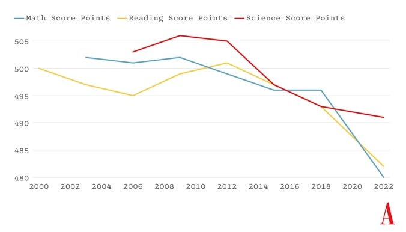

教育科技革命已经失败 - 贾里德·库尼·霍瓦特 --- The EdTech Revolution Has Failed - by Jared Cooney Horvath

**Introduction from Jon Haidt and Zach Rausch:  

乔恩·海特（Jon Haidt）和扎克·劳施（Zach Rausch）的介绍：**

When smartphones and social media platforms swept into teens' lives in the early 2010s, schools experienced their own digital revolution, with 1-to-1 laptops, tablets, and iPads becoming staples in classrooms across the Western world. (1-to-1 means one device for every student.) A decade later, the revolutionary optimism is fading. One [OECD review](https://www.oecd.org/en/publications/students-computers-and-learning_9789264239555-en.html "https://www.oecd.org/en/publications/students-computers-and-learning_9789264239555-en.html") found that most educational technology (EdTech) has not delivered the academic benefits once promised. Meanwhile, global test [scores](https://www.theatlantic.com/ideas/archive/2023/12/cell-phones-student-test-scores-dropping/676889/ "https://www.theatlantic.com/ideas/archive/2023/12/cell-phones-student-test-scores-dropping/676889/") in math, science, and reading have been plummeting, as you can see in Figure 1 below. These trends were exacerbated by the COVID-19 pandemic, but they began in the early 2010s, just as digital devices were being placed on students’ desks.  

21 世纪 10 年代初，智能手机和社交媒体平台席卷青少年的生活时，学校也经历了自身的数字化革命，一对一的笔记本电脑、平板电脑和 iPad 成为西方世界教室中的常见设备。（一对一指每个学生一台设备。）十年后，这种革命式的乐观情绪正在消退。经合组织的一项审查发现，大多数教育技术（EdTech）并未带来曾经承诺的学术效益。与此同时，全球数学、科学和阅读的测试成绩一直在大幅下降，如下图 1 所示。这些趋势因新冠疫情而加剧，但它们始于 21 世纪 10 年代初，就在数字设备被放在学生课桌上的时候。

\[

\](https://substackcdn.com/image/fetch/f\_auto,q\_auto:good,fl\_progressive:steep/https%3A%2F%2Fsubstack-post-media.s3.amazonaws.com%2Fpublic%2Fimages%2F949130b2-3617-4ab3-be73-e66327ffb30e\_676x386.png)

_**Figure 1.** Declines in math, reading, and science scores averaged across the 38 OECD countries. Image source: [The Atlantic,](https://www.theatlantic.com/ideas/archive/2023/12/cell-phones-student-test-scores-dropping/676889/ "https://www.theatlantic.com/ideas/archive/2023/12/cell-phones-student-test-scores-dropping/676889/") from the OECD.  

图 1. 38 个经合组织国家数学、阅读和科学成绩的平均下降情况。图片来源：《大西洋月刊》，来自经合组织。_

In _The Anxious Generation_, we advocated for phone-free schools. We made the case that locking up phones from bell-to-bell would improve student performance and focus, and the quality of students’ in-person relationships. (That seems to be happening, at [lightning](https://www.cbsnews.com/news/schools-no-phone-movement-focus-mental-health/ "https://www.cbsnews.com/news/schools-no-phone-movement-focus-mental-health/") [speed](https://www.fastcompany.com/91039470/pressure-building-legislative-bans-students-cellphone-use-school "https://www.fastcompany.com/91039470/pressure-building-legislative-bans-students-cellphone-use-school"), and with very [positive](https://www.theatlantic.com/ideas/archive/2024/08/phone-ban-georgetown-washington-day-school/679340/ "https://www.theatlantic.com/ideas/archive/2024/08/phone-ban-georgetown-washington-day-school/679340/") [effects](https://www.washingtonpost.com/nation/2024/05/01/school-cellphones-confiscate/ "https://www.washingtonpost.com/nation/2024/05/01/school-cellphones-confiscate/").) However, the impact of EdTech more broadly on student outcomes was unclear to us. Since publication, we've engaged with leading experts on the subject, and we are now publishing a series of posts to address questions that many educators, parents, and students are asking: Is EdTech actually better than traditional learning methods? When is it helpful, and when do the distraction effects overwhelm the pedagogical benefits? At what age (if any) should students start using iPads and Chromebooks in the classroom? And is the sudden proliferation of 1-to-1 devices partially responsible for the global decline in test scores over the last decade?  

在《焦虑的一代》中，我们主张无手机学校。我们提出，从上课铃响到下课铃响期间将手机锁起来会提高学生的表现和专注力，以及学生面对面关系的质量。（这似乎正在以闪电般的速度发生，而且效果非常积极。）然而，更广泛的教育技术对学生成绩的影响我们并不清楚。自出版以来，我们与该领域的顶尖专家进行了交流，现在我们正在发布一系列帖子，以解决许多教育工作者、家长和学生提出的问题：教育技术实际上是否比传统学习方法更好？什么时候有帮助，什么时候分心的影响超过了教学的好处？学生应该在什么年龄（如果有的话）在课堂上开始使用 iPad 和 Chromebook？过去十年中全球考试成绩的突然下降，一对一设备的突然激增是否要负部分责任？

In the first post in our series, [Everyschool](https://www.everyschool.org/ "https://www.everyschool.org/") co-founder Amy Tyson [addressed](https://www.afterbabel.com/p/false-promise-of-device-based-ed "https://www.afterbabel.com/p/false-promise-of-device-based-ed") five major myths about screens in school. In this post, neuroscientist and educator [Jared Cooney Horvath](https://www.linkedin.com/in/jared-cooney-horvath/ "https://www.linkedin.com/in/jared-cooney-horvath/") goes further, arguing that the EdTech revolution has been a failure. He explains why schools across Europe and Southeast Asia are moving away from student-facing digital technology, favoring more traditional methods—and why American schools would benefit from considering a similar shift.  

在我们系列的第一篇文章中，Everyschool 的联合创始人艾米·泰森（Amy Tyson）谈到了关于学校屏幕的五个主要误区。在这篇文章中，神经科学家和教育家贾里德·库尼·霍瓦特（Jared Cooney Horvath）更进一步，认为教育技术革命是失败的。他解释了为什么欧洲和东南亚的学校正在远离面向学生的数字技术，倾向于更传统的方法——以及为什么美国学校会从考虑类似的转变中受益。

Jared is the author of six books and over 60 research articles. He currently serves as an honorary research fellow at St. Vincent’s Hospital in Melbourne and leads LME Global, a team dedicated to making the latest brain and behavioral research accessible to teachers, students, and parents. In December of last year, Jared reached out to Jon about a review article he was writing. Jon read an early draft of the article, found it to be powerful and well sourced, and invited Jared to consider publishing a shortened version of it here at After Babel. We hope you find it as thought provoking as we did.  

贾里德是六本书的作者和 60 多篇研究文章的作者。他目前是墨尔本圣文森特医院的名誉研究员，并领导着 LME Global，这是一个致力于让教师、学生和家长能够获取最新大脑和行为研究成果的团队。去年 12 月，贾里德就他正在撰写的一篇评论文章联系了乔恩。乔恩阅读了这篇文章的早期草稿，认为它很有说服力且资料来源充分，并邀请贾里德考虑在《巴别塔之后》发表其精简版。我们希望您和我们一样觉得它发人深省。

**— Jon and Zach— 乔恩和扎克**

**p.s.** We are looking for a variety of perspectives on this important topic. We would especially value hearing from those who can make a strong case for the _benefits_ of 1-to-1 digital tech in the classroom, ideally backed by research. If you can make such a case, let us know in the comments below and submit an essay to zach@anxiousgeneration.com.  

附言：我们正在就这个重要主题寻求各种观点。我们尤其重视听取那些能够有力证明课堂中 1 对 1 数字技术的益处的人的意见，最好有研究支持。如果您能提出这样的观点，请在下面的评论中告知我们，并向 zach@anxiousgeneration.com 提交一篇文章。

[Leave a comment留下评论](https://www.afterbabel.com/p/the-edtech-revolution-has-failed/comments "https://www.afterbabel.com/p/the-edtech-revolution-has-failed/comments")

\[

\](https://substackcdn.com/image/fetch/f\_auto,q\_auto:good,fl\_progressive:steep/https%3A%2F%2Fsubstack-post-media.s3.amazonaws.com%2Fpublic%2Fimages%2F4d81e98b-bd9d-4c90-9662-4c7462920e5a\_7680x4320.jpeg)

_by Jared Cooney Hovrath贾里德·库尼·霍夫拉斯_

In [May of 2023](https://www.lemonde.fr/en/health/article/2023/05/21/too-fast-too-soon-sweden-backs-away-from-screens-in-schools_6027454_14.html "https://www.lemonde.fr/en/health/article/2023/05/21/too-fast-too-soon-sweden-backs-away-from-screens-in-schools_6027454_14.html"), schools minister Lotta Edholm announced that Swedish classrooms would aim to [significantly reduce](https://apnews.com/article/sweden-digital-education-backlash-reading-writing-1dd964c628f76361c43dbf3964f7dbf4 "https://apnews.com/article/sweden-digital-education-backlash-reading-writing-1dd964c628f76361c43dbf3964f7dbf4") student-facing digital technology and embrace more [traditional practices](https://www.government.se/articles/2024/02/government-investing-in-more-reading-time-and-less-screen-time/ "https://www.government.se/articles/2024/02/government-investing-in-more-reading-time-and-less-screen-time/") like reading hardcopy books and taking handwritten notes. The announcement was met with [disbelief among pundits](https://criticaledtech.com/2023/05/22/de-digitisation-of-swedish-schools-what-is-lotta-edholm-hoping-to-prove/ "https://criticaledtech.com/2023/05/22/de-digitisation-of-swedish-schools-what-is-lotta-edholm-hoping-to-prove/") and the [wider international public](https://omni.se/det-vore-ett-misstag-att-forbjuda-skarm-i-forskolan/a/3Egkpe "https://omni.se/det-vore-ett-misstag-att-forbjuda-skarm-i-forskolan/a/3Egkpe"): why would an entire country willingly forgo those digital technologies which are widely touted to be the future of education?   

2023 年 5 月，学校部长洛塔·埃德霍尔姆（Lotta Edholm）宣布，瑞典的教室将致力于大幅减少面向学生的数字技术，并采用更多传统做法，如阅读纸质书籍和做手写笔记。这一宣布遭到了专家和更广泛的国际公众的质疑：为什么整个国家会心甘情愿地放弃那些被广泛吹捧为教育未来的数字技术？

In a recent survey, [92% of students](https://www.oecd.org/en/publications/students-computers-and-learning_9789264239555-en.html "https://www.oecd.org/en/publications/students-computers-and-learning_9789264239555-en.html") worldwide reported having access to a computer at school. In New Zealand, [99% of schools](https://thespinoff.co.nz/business/22-11-2019/nzs-internet-is-faster-than-ever-but-challenges-still-lay-ahead "https://thespinoff.co.nz/business/22-11-2019/nzs-internet-is-faster-than-ever-but-challenges-still-lay-ahead") are equipped with high-speed internet while in Australia the student-to-computer ratio has dipped [below 1:1](https://www.oecd.org/en/publications/students-computers-and-learning_9789264239555-en.html "https://www.oecd.org/en/publications/students-computers-and-learning_9789264239555-en.html") (meaning there are more computers than students in school). In the U.S., government expenditure on EdTech products for public schools exceeds [$30 billion annually](https://edtechevidence.org/wp-content/uploads/2021/07/FINAL-K12-EdTech-Funding-Analysis_v.1.pdf "https://edtechevidence.org/wp-content/uploads/2021/07/FINAL-K12-EdTech-Funding-Analysis_v.1.pdf").  

在最近的一项调查中，全球 92%的学生报告称在学校可以使用电脑。在新西兰，99%的学校配备了高速互联网，而在澳大利亚，学生与电脑的比例已降至 1:1 以下（这意味着学校里的电脑比学生多）。在美国，政府每年在公立学校的教育技术产品上的支出超过 300 亿美元。

With these numbers, you’d think EdTech had clearly demonstrated a strong beneficial impact on student learning.  

有了这些数字，你可能会认为教育科技显然对学生的学习产生了强大的有益影响。

Think again.再想一想。

(In this article, I’m defining EdTech as any _student-employed_, internet-connected digital device; this includes computers, laptops, tablets, cell phones, and smart watches. I am not discussing or evaluating the use of digital devices by teachers.)  

（在本文中，我将教育科技定义为任何学生使用的、联网的数字设备；这包括电脑、笔记本电脑、平板电脑、手机和智能手表。我不讨论或评估教师对数字设备的使用。）

An [OECD international review](https://www.oecd.org/en/publications/students-computers-and-learning_9789264239555-en.html "https://www.oecd.org/en/publications/students-computers-and-learning_9789264239555-en.html") of the impact of computers in education reports:  

经合组织（OECD）关于计算机在教育中影响的国际审查报告称：

> “_Students who use computers very frequently at school do a lot worse in most learning outcomes…And perhaps the most disappointing finding of the report is that technology is of little help in bridging the skills divide between advantaged and disadvantaged students._”  
> 
> “在学校经常使用电脑的学生在大多数学习成果方面表现得差很多……也许该报告最令人失望的发现是，技术在缩小优势学生和弱势学生之间的技能差距方面几乎没有帮助。”

After [reviewing 126 research studies](https://www.povertyactionlab.org/publication/will-technology-transform-education-better "https://www.povertyactionlab.org/publication/will-technology-transform-education-better") exploring technology-based education interventions, the global research center J-PAL concluded:  

在审查了 126 项探索基于技术的教育干预措施的研究后，全球研究中心 J-PAL 得出结论：

> “_Initiatives that expand access to computers…do not improve K-12 grades and test scores. \[Furthermore\], online courses lower student academic achievement compared to in-person courses._”  
> 
> “扩大计算机使用机会的举措……并不能提高 K-12 年级的成绩和考试分数。\[此外\]，与面对面课程相比，在线课程降低了学生的学业成绩。”

A [recent analysis](https://pubmed.ncbi.nlm.nih.gov/35571994/ "https://pubmed.ncbi.nlm.nih.gov/35571994/") investigating the impact of computers on reading performance among K-12 students across the U.S. concludes, “…even small daily amounts (30min) of use of digital devices in classrooms are negatively related to scores on a reading comprehension test.” [A similar analysis](https://pubmed.ncbi.nlm.nih.gov/28333495/ "https://pubmed.ncbi.nlm.nih.gov/28333495/") of learning moderators within university settings concludes, “…expanding the use of…technology at the expense of other forms of instruction is likely to have detrimental effects on achievement.” Yet another set of analyses reported that investing in [air conditioning](https://direct.mit.edu/edfp/article-abstract/11/1/97/10245/Synthesizing-the-Effect-of-Building-Condition "https://direct.mit.edu/edfp/article-abstract/11/1/97/10245/Synthesizing-the-Effect-of-Building-Condition") has a more beneficial impact on student learning than investing in a [laptop for every student](https://journals.sagepub.com/doi/abs/10.3102/0034654316628645 "https://journals.sagepub.com/doi/abs/10.3102/0034654316628645") (ES = 0.21 vs 0.16)  

最近一项针对美国 K - 12 学生中计算机对阅读表现影响的分析得出结论：“......即使在课堂上每天使用少量（30 分钟）数字设备也与阅读理解测试的分数呈负相关。” 对大学环境中学习调节因素的类似分析得出结论：“......以牺牲其他教学形式为代价扩大......技术的使用可能对成绩产生不利影响。” 另一组分析报告称，投资空调对学生学习的有益影响比为每个学生投资笔记本电脑更大（效应量 = 0.21 对 0.16）

“But wait,” some readers might say: “if giving every student a laptop has an effect size of 0.16, then surely this means digital tools _can_ improve learning!”  

“但是等等，”一些读者可能会说：“如果给每个学生一台笔记本电脑的效果值为 0.16，那么这肯定意味着数字工具可以提高学习效果！”

Let’s take a closer look at the data.  

让我们更仔细地看看这些数据。

Since the 1980s, a number of meta-analyses (and meta-syntheses pooling these analyses) have been conducted exploring the impact of digital technologies within varied fields of learning. What do the weighted mean effect sizes show?  

自 20 世纪 80 年代以来，已经进行了许多元分析（以及汇总这些分析的元综合），以探索数字技术在不同学习领域的影响。加权平均效应量显示了什么？

-   **[Math: ES = 0.33](https://www.visiblelearningmetax.com/influences/view/technology_in_mathematics "https://www.visiblelearningmetax.com/influences/view/technology_in_mathematics")** (_22 meta-analyses / 1060 Studies / 1464 effect sizes_)[1](https://www.afterbabel.com/p/the-edtech-revolution-has-failed#footnote-1-150310076 "https://www.afterbabel.com/p/the-edtech-revolution-has-failed#footnote-1-150310076")  
    
    数学：ES = 0.33（22 项荟萃分析/1060 项研究/1464 个效应量） 1
    
-   **[Literacy: ES = 0.25](https://www.visiblelearningmetax.com/influences/view/technology_in_reading~literacy "https://www.visiblelearningmetax.com/influences/view/technology_in_reading~literacy")** (_17 meta-analyses / 736 Studies / 1547 effect sizes_)  
    
    识字率：ES = 0.25（17 项荟萃分析/736 项研究/1547 个效应量）
    
-   **[Sciences: ES = 0.18](https://www.visiblelearningmetax.com/influences/view/technology_in_science "https://www.visiblelearningmetax.com/influences/view/technology_in_science")** (_6 meta-analyses / 391 Studies / 567 effect sizes_)  
    
    科学：ES = 0.18（6 项荟萃分析/391 项研究/567 个效应量）
    
-   **[Writing Quality: ES = 0.32](https://www.visiblelearningmetax.com/influences/view/technology_in_writing "https://www.visiblelearningmetax.com/influences/view/technology_in_writing")** (_6 meta-analyses / 75 Studies / 85 effect sizes_)[2](https://www.afterbabel.com/p/the-edtech-revolution-has-failed#footnote-2-150310076 "https://www.afterbabel.com/p/the-edtech-revolution-has-failed#footnote-2-150310076")  
    
    写作质量：ES = 0.32（6 项荟萃分析/75 项研究/85 个效应量） 2
    
-   **[Specific Learning Needs: ES = 0.61](https://www.visiblelearningmetax.com/influences/view/technology_with_learning_needs_students "https://www.visiblelearningmetax.com/influences/view/technology_with_learning_needs_students")** (_10 meta-analyses / 216 Studies / 275 effect sizes_)[3](https://www.afterbabel.com/p/the-edtech-revolution-has-failed#footnote-3-150310076 "https://www.afterbabel.com/p/the-edtech-revolution-has-failed#footnote-3-150310076")  
    
    特殊学习需求：ES = 0.61（10 项元分析/216 项研究/275 个效应量） 3
    

At first blush, this looks very promising: seeing as each effect size is larger than zero, surely this means EdTech is working, right?  

乍一看，这看起来非常有希望：鉴于每个效应量都大于零，这肯定意味着教育技术是有效的，对吧？

Not quite.不太对。

In 2023, educational statistician John Hattie released _[Visible Learning: The Sequel](https://www.taylorfrancis.com/books/mono/10.4324/9781003380542/visible-learning-sequel-john-hattie "https://www.taylorfrancis.com/books/mono/10.4324/9781003380542/visible-learning-sequel-john-hattie")_. In this major work, he analyzes over 2,100 educational meta-analyses exploring 357 different moderators affecting learning within the typical classroom. What he found was equal parts surprising and predictable: _nearly_ _everything_ has a positive impact on student learning. In fact, of the 357 included learning moderators, only 33 reported a negative effect size (this includes things like abuse, malnutrition, illness, and mental disorders). In other words, 91% of everything a teacher does can be said to improve learning.  

2023 年，教育统计学家约翰·哈蒂（John Hattie）发布了《可见的学习：续集》。在这部重要作品中，他分析了 2100 多项教育元分析，探讨了典型课堂中影响学习的 357 种不同调节因素。他的发现既令人惊讶又在意料之中：几乎所有因素都对学生的学习产生了积极影响。事实上，在纳入的 357 种学习调节因素中，只有 33 种报告了负面影响（这包括虐待、营养不良、疾病和精神障碍等）。换句话说，教师所做的一切中，91%都可以说是对学习有促进作用。

Although this finding has doubtless been influenced by publication bias and the file-drawer problem, one additional practical explanation concerns _[engaged](https://www.taylorfrancis.com/chapters/edit/10.4324/9780203701447-9/instruction-time-task-review-lorin-anderson "https://www.taylorfrancis.com/chapters/edit/10.4324/9780203701447-9/instruction-time-task-review-lorin-anderson")_ _[time-on-task](https://www.taylorfrancis.com/chapters/edit/10.4324/9780203701447-9/instruction-time-task-review-lorin-anderson "https://www.taylorfrancis.com/chapters/edit/10.4324/9780203701447-9/instruction-time-task-review-lorin-anderson")_. Students spending any amount of time explicitly focused on learning novel material would be expected to demonstrate improvement compared to students spending no time focused on learning novel material, regardless of the specific tool or technique employed.   

尽管这一发现无疑受到了发表偏倚和文件抽屉问题的影响，但还有一个实际的解释涉及投入任务的时间。与不花时间专注于学习新材料的学生相比，无论使用何种特定的工具或技术，花任何时间明确专注于学习新材料的学生预计都会有所进步。

Seeing as nearly every strategy serves to increase engaged time-on-task (this includes employing air conditioning during hot days), then comparing the impact of digital technologies to ‘zero’ makes little sense. So, when considering effect sizes within education, what is a reasonable baseline? Acknowledging that this is a tricky metric within social science, yet remains the strongest representation of quantified impact we possess within education, what effect size would constitute ‘meaningful’ improvement?  

鉴于几乎每一种策略都旨在增加专注于任务的时间（这包括在炎热的日子里使用空调），那么将数字技术的影响与“零”进行比较就没有什么意义。那么，在考虑教育中的效应量时，什么是合理的基线呢？要承认这在社会科学中是一个棘手的指标，但仍然是我们在教育中拥有的量化影响的最强表示，什么样的效应量才构成“有意义”的改进？

Data suggests that in order for students to maintain a 50th percentile rank nationwide, they must improve an average of [0.42 standard deviations](https://pmc.ncbi.nlm.nih.gov/articles/PMC4696502/ "https://pmc.ncbi.nlm.nih.gov/articles/PMC4696502/") per year (calculated using standardized reading and math data across K-12); anything below this will likely lead to declining rank and vice versa. A similar analysis places this [value at 0.46](https://www.tandfonline.com/doi/abs/10.1080/19345740802400072 "https://www.tandfonline.com/doi/abs/10.1080/19345740802400072"), suggesting an effect size of around 0.44 would be a reasonable educational baseline. As a secondary estimate, when the effect size from all 357 moderators noted above are pooled, Hattie reports the average value sits at a less conservative [effect size of 0.4](https://visible-learning.org/hattie-ranking-influences-effect-sizes-learning-achievement/ "https://visible-learning.org/hattie-ranking-influences-effect-sizes-learning-achievement/"). In fact, he calls this a ‘hinge-point’ and recommends that only those tools and/or strategies with values [above this level](https://www.visiblelearning.com/content/visible-learning-research "https://www.visiblelearning.com/content/visible-learning-research") can be seen to ‘work best’ and should be considered for mass inclusion across education, as those have the greatest chance to deliver the greatest impact to the greatest number of students.  

数据表明，为了让学生在全国范围内保持第 50 百分位的排名，他们每年必须平均提高 0.42 个标准差（使用 K - 12 阶段的标准化阅读和数学数据计算）；低于此值可能会导致排名下降，反之亦然。类似的分析将此值定为 0.46，这表明约 0.44 的效应量将是一个合理的教育基准。作为二次估计，当汇总上述所有 357 个调节变量的效应量时，哈蒂报告称平均值处于较不保守的 0.4 效应量。事实上，他称这是一个“转折点”，并建议只有那些效应量高于此水平的工具和/或策略才能被视为“效果最佳”，应考虑在整个教育中大规模采用，因为这些工具和策略最有可能为最多的学生带来最大的影响。

Using the less conservative baseline of 0.4, the aforementioned meta-analyses look much weaker. In fact, the only realm within which digital tools seem to be meaningfully beneficial is in the realm of specific learning needs (a topic we will discuss later in this piece). Use of these tools outside of this context may well be driving learning; unfortunately, that learning will be slower, less robust, and likely lead to a drop in rank compared to other, more powerful, non-digital methods.  

使用 0.4 这个不那么保守的基线，上述的荟萃分析看起来就弱得多。事实上，数字工具似乎有显著益处的唯一领域是在特定学习需求的领域（我们将在本文后面讨论这个话题）。在这种情况之外使用这些工具很可能会推动学习；不幸的是，与其他更强大的非数字方法相比，这种学习会更慢、更不稳健，并且可能导致排名下降。

The fact that dozens of meta-analyses comprising thousands of calculated effect sizes has done little to quell excitement over digital technology in education suggests that we may be dealing less with an issue of evidence and more with an issue of wishful thinking. So let’s step back from the data and explore why it is that digital technology in students’ hands may be doing more harm than good.  

包含数千个计算出的效应量的数十项荟萃分析，在抑制人们对教育中数字技术的热情方面收效甚微，这表明我们面对的可能不是证据问题，而是一厢情愿的想法问题。所以，让我们先不看数据，探讨一下为什么学生手中的数字技术可能弊大于利。

[Share分享；共享；股份；份额](https://www.afterbabel.com/p/the-edtech-revolution-has-failed?utm_source=substack&utm_medium=email&utm_content=share&action=share "https://www.afterbabel.com/p/the-edtech-revolution-has-failed?utm_source=substack&utm_medium=email&utm_content=share&action=share")

To understand the primary reason why digital devices make learning so difficult, we need to take a quick cognitive tangent. Rest assured, we will return to EdTech and tie this together shortly.  

要了解数字设备使学习如此困难的主要原因，我们需要快速进行认知上的拓展。请放心，我们很快就会回到教育技术并将其联系起来。

A commonly used phrase amongst educational researchers is, “Attention is the gateway to learning.”  

教育研究人员中常用的一句话是：“注意力是学习的门户。”

Perhaps the best way to conceive of human ‘attention’ is as a filter. Much like 3-D glasses, which only allow certain wavelengths of light to reach the retinas, attention only allows relevant information to pass into conscious awareness; irrelevant information is blocked out.  

也许构想人类“注意力”的最佳方式是将其视为一个过滤器。就像 3D 眼镜只允许特定波长的光到达视网膜一样，注意力只允许相关信息进入意识；不相关的信息则被屏蔽。

What, then, determines if a particular bit of information is relevant?  

那么，是什么决定了某一特定信息是否相关？

Much like board games, every task we undertake comes with its own unique set of rules that dictate what actions are required for success. For instance, to successfully read these words, your ‘reading ruleset’ dictates you must move your eyes from left to right, hold each word in memory until the end of each sentence, use your fingers to scroll, etc.  

就像棋盘游戏一样，我们承担的每一项任务都有其独特的一套规则，规定了取得成功所需的行动。例如，要成功阅读这些文字，您的“阅读规则集”规定您必须从左到右移动眼睛，在每个句子结束之前记住每个单词，用手指滚动等等。

Whenever we engage with a task, the relevant ruleset must be loaded into a small area of the brain called the [Lateral Prefrontal Cortex](https://pubmed.ncbi.nlm.nih.gov/15849898/ "https://pubmed.ncbi.nlm.nih.gov/15849898/") (LatPFC). Whatever ruleset is being held within this part of the brain will ultimately determine what the attentional filter deems relevant or irrelevant.  

每当我们从事一项任务时，相关的规则集必须加载到大脑中一个称为外侧前额叶皮质（LatPFC）的小区域。无论大脑这部分所承载的规则集是什么，最终都将决定注意力过滤器认为什么是相关的或不相关的。

Here's the problem: the LatPFC can only hold onto [one ruleset](https://pubmed.ncbi.nlm.nih.gov/18558854/ "https://pubmed.ncbi.nlm.nih.gov/18558854/") at a time.  

问题在于：外侧前额叶皮层一次只能记住一组规则。

This means anytime we attempt to consciously undertake two tasks simultaneously, the brain simply cannot handle this; the best it can do is quickly jump back-and-forth between tasks, [swapping out the ruleset](https://pubmed.ncbi.nlm.nih.gov/10666562/ "https://pubmed.ncbi.nlm.nih.gov/10666562/") within the LatPFC each time.  

这意味着，每当我们试图有意识地同时承担两项任务时，大脑根本无法处理；它所能做的最好的事情就是在任务之间快速来回切换，每次在外侧前额叶皮层中切换规则集。

This jumping between tasks incurs three significant costs.  

在任务之间的这种跳跃会产生三个显著的成本。

> _Time_: It takes the brain about 0.15 seconds to swap out a ruleset, during which time all external information stops being consciously processed and learning slows considerably (this process is called [task-switching cost](https://psycnet.apa.org/record/2002-00015-002 "https://psycnet.apa.org/record/2002-00015-002")).  
> 
> 时间：大脑切换一个规则集大约需要 0.15 秒，在此期间，所有外部信息的有意识处理都会停止，学习速度会大幅减慢（这个过程被称为任务切换成本）。
> 
> _Accuracy_: Whenever we jump between tasks, there is a brief period of time when the two rulesets conflict and general performance suffers (this process is called [cross-talk dual-task interference](https://pubmed.ncbi.nlm.nih.gov/28104413/ "https://pubmed.ncbi.nlm.nih.gov/28104413/")).  
> 
> 准确性：每当我们在任务之间切换时，会有一段短暂的时间，此时两种规则集相互冲突，总体表现受到影响（此过程称为交叉对话双任务干扰）。
> 
> _Memory_: Memories are typically processed by a part of the brain called the hippocampus. However, when jumping between tasks, memories are more often processed [by the striatum](https://pubmed.ncbi.nlm.nih.gov/16868087/ "https://pubmed.ncbi.nlm.nih.gov/16868087/") (an area of the brain linked to reflexive processes), ultimately leading to the formation of subconscious memories which are difficult to access and utilize in the future.  
> 
> 记忆：记忆通常由大脑中称为海马体的部分处理。然而，在任务之间切换时，记忆更多地由纹状体（与反射过程相关的大脑区域）处理，最终导致形成潜意识记忆，这些记忆在未来难以获取和利用。

In sum, _multitasking is among the worst things that students can do for learning and memory_. When we multitask, we go slower, our accuracy drops, and our learning decreases significantly.  

总之，多任务处理是学生在学习和记忆方面最糟糕的事情之一。当我们进行多任务处理时，我们的速度会变慢，准确性会下降，学习效果也会显著降低。

Why does any of this matter?  

为什么这一切都很重要？

[Leave a comment留下评论](https://www.afterbabel.com/p/the-edtech-revolution-has-failed/comments "https://www.afterbabel.com/p/the-edtech-revolution-has-failed/comments")

The primary function of any tool can be thought of as the main task or job said tool is believed to perform: or, as I often consider it, it’s the manner in which 80% of people spend 80% of their time employing said tool.   

任何工具的主要功能都可以被认为是该工具被认为要执行的主要任务或工作：或者，正如我经常认为的那样，这是 80%的人 80%的时间使用该工具的方式。

Consider a hammer. There are many uses for a hammer: door stop, bottle opener, back scratcher, screw driver. etc. However, 80% of people spend 80% of their time using this tool to hit things – as such, if I were to hand you a hammer, you would begin looking for something to hit.  

考虑一把锤子。锤子有很多用途：门挡、开瓶器、挠背器、螺丝刀等等。然而，80%的人 80%的时间都用这个工具来敲东西——因此，如果我给你一把锤子，你就会开始找东西敲。

What is the primary function of a computer? When students sit down in front of a screen, what is the fundamental behavior that immediately jumps to mind?  

计算机的主要功能是什么？当学生坐在屏幕前时，首先想到的基本行为是什么？

A [pre-Covid survey](https://www.commonsensemedia.org/research/the-common-sense-census-media-use-by-tweens-and-teens-2019 "https://www.commonsensemedia.org/research/the-common-sense-census-media-use-by-tweens-and-teens-2019") exploring how US students aged 8-18 utilize digital technologies both inside and outside of school provides the answer (values below are per week):  

一项新冠疫情前的调查探索了 8 至 18 岁的美国学生在校内和校外如何使用数字技术，提供了答案（以下数值为每周）：

-   10 hours 44 minutes playing video games  
    
    玩电子游戏 10 小时 44 分钟
    
-   10 hours 2 minutes watching television or film clips  
    
    10 小时 2 分钟观看电视或电影片段
    
-   8 hours 14 minutes scrolling social media  
    
    8 小时 14 分钟浏览社交媒体
    
-   7 hours 32 minutes listening to music  
    
    7 小时 32 分钟听音乐
    
-   3 hours 25 minutes doing homework   
    
    做家庭作业 3 小时 25 分钟
    
-   2 hours 5 minutes doing schoolwork   
    
    做功课 2 小时 5 分钟
    
-   1 hour 14 minutes reading for pleasure  
    
    1 小时 14 分钟的休闲阅读
    
-   52.5 minutes creating digital content  
    
    52.5 分钟创建数字内容
    
-   14 minutes writing for pleasure  
    
    14 分钟为乐趣而写作
    

If we extrapolate and consider a typical U.S. academic school year of [36 weeks](https://www.joshpeete.com/superintendent-answers-how-many-weeks-in-a-school-year/ "https://www.joshpeete.com/superintendent-answers-how-many-weeks-in-a-school-year/"), these numbers suggest that students spend 198 hours annually using digital devices for learning purposes, and 2,028 hours annually using those same exact tools to jump around between scatter-shot media content.   

如果我们进行推断，并考虑美国典型的 36 周学年，这些数字表明学生每年花费 198 小时使用数字设备用于学习目的，每年花费 2028 小时使用相同的工具在分散的媒体内容之间跳转。

Do you see the issue?  

你看到这个问题了吗？

Seeing as the great majority of students spend over 80% of their digital device time using these tools to multitask, the automatic response for a great majority of students using these tools has become multitasking.. Unfortunately, when we attempt to employ digital devices for learning purposes, this primary function quickly bleeds into student behavior.   

鉴于绝大多数学生在使用数字设备的时间里有 80%以上用于使用这些工具进行多任务处理，对于绝大多数使用这些工具的学生来说，自动反应已变成多任务处理。不幸的是，当我们试图将数字设备用于学习目的时，这种主要功能很快就渗透到学生的行为中。

This is why, when using a computer for homework, students typically last [fewer than 6 minutes](https://www.sciencedirect.com/science/article/abs/pii/S0747563212003305 "https://www.sciencedirect.com/science/article/abs/pii/S0747563212003305") before accessing social media, messaging friends, and engaging with other digital distractions. This is why, when using a laptop during class, students typically spend [38 minutes of every hour](https://www.sciencedirect.com/science/article/abs/pii/S0360131514001158 "https://www.sciencedirect.com/science/article/abs/pii/S0360131514001158") off-task. This is why, when getting paid as part of a research study to focus on a 20-minute computerized lesson, nearly [40% of students](https://www.sciencedirect.com/science/article/abs/pii/S0360131511002077 "https://www.sciencedirect.com/science/article/abs/pii/S0360131511002077") were unable to stop themselves from multitasking. It’s not that the students of today have abnormally weak constitutions; it’s that they have spent thousands of hours training themselves to use digital devices in a manner guaranteed to impair learning and performance. It’s also that many of the apps being run on those devices were carefully engineered to pull young people away from whatever they were doing.  

这就是为什么，当使用电脑做作业时，学生通常在不到 6 分钟就会访问社交媒体、给朋友发消息以及被其他数字干扰所吸引。这就是为什么，在课堂上使用笔记本电脑时，学生通常每小时有 38 分钟不专注于任务。这就是为什么，作为研究的一部分，在获得报酬专注于 20 分钟的计算机化课程时，近 40%的学生无法阻止自己多任务处理。并不是现在的学生体质异常虚弱；而是他们花了数千小时训练自己以一种必然损害学习和表现的方式使用数字设备。也是因为在这些设备上运行的许多应用程序都是经过精心设计，以将年轻人从他们正在做的任何事情中拉走。

Perhaps we can draw an analogy: imagine I sat a group of people around a jug of beer and asked them to use that beer to learn about buoyancy. This tool (beer) is perfectly suited to the task, and if the group of people were non-drinkers, I would expect no problem achieving my learning goals. However, if the group of people were alcoholics - individuals who had spent thousands of hours training themselves to use beer in a manner that does not concern buoyancy - then the tool would most likely hinder my learning goals.  

也许我们可以打个比方：想象一下，我让一群人围坐在一壶啤酒旁，让他们用那啤酒来了解浮力。这个工具（啤酒）非常适合这项任务，如果这群人不喝酒，我预计实现我的学习目标不会有问题。然而，如果这群人是酗酒者——那些花了数千小时训练自己以与浮力无关的方式使用啤酒的人——那么这个工具很可能会阻碍我的学习目标。

And perhaps this is the key point: I’m not saying that digital technologies _can’t_ be used for learning; in fact, if these tools were only ever employed for learning purposes, then they may have proven some of the most important academic inventions ever. The argument I’m making is that digital technologies so often _aren’t_ used for learning that giving students a laptop, tablet, or other multi-function device places a large (and unnecessary) obstacle between the student and the desired outcome. In order to effectively learn while using an unlocked, internet-connected multi-function digital device, students must expend a great deal of cognitive effort battling impulses that they’ve spent years honing - a battle they lose more often than not. (of course schools do often try to implement blockers and restrictions, but this opens up an eternal cat-and-mouse struggle, and the mice are very good at finding ways to evade the cat.)    

也许这是关键所在：我并不是说数字技术不能用于学习；事实上，如果这些工具仅仅用于学习目的，那么它们可能已经被证明是有史以来最重要的学术发明之一。我要说的是，数字技术常常不被用于学习，给学生一台笔记本电脑、平板电脑或其他多功能设备，会在学生和期望的结果之间设置一个巨大（且不必要）的障碍。为了在使用未锁定、联网的多功能数字设备时有效地学习，学生必须花费大量的认知努力来对抗他们多年来磨练的冲动——而他们往往会输掉这场战斗。（当然，学校确实经常试图实施封锁和限制，但这引发了一场永无止境的猫捉老鼠的斗争，而老鼠非常善于找到躲避猫的方法。）

To be fair, even before digital devices took over the classroom, students struggled with lack of attention, shallow thinking, overconfidence, and other learning problems. However, with digital devices, the frequency of these problems increases. Many schools were already struggling with issues of engagement, so we need to consider what additional harms may have occurred in the early 2010s when so many schools adopted tools that can be described as distraction machines.   

公平地说，甚至在数字设备占领课堂之前，学生们就已经在与注意力不集中、思维肤浅、过度自信和其他学习问题作斗争。然而，有了数字设备，这些问题出现的频率增加了。许多学校已经在与参与度问题作斗争，所以我们需要考虑在 2010 年代初，当这么多学校采用可以被描述为分散注意力的机器的工具时，可能还产生了哪些额外的危害。

Seeing as enthusiasts can’t lean on empirical data to support the adoption of student facing, internet connected digital devices across education, they frequently turn to three seemingly compelling arguments to excuse the lack of clear evidence of effectiveness. When placed in context, however, these arguments lose a lot of their exculpatory power.  

鉴于爱好者无法依靠经验数据来支持在整个教育领域采用面向学生、联网的数字设备，他们经常提出三个看似令人信服的论点来为缺乏明确的有效性证据开脱。然而，当置于具体背景中时，这些论点的开脱力大打折扣。

It’s easy to get swept up in the promise of computers in education. Returning to the [J-PAL review](https://www.povertyactionlab.org/publication/will-technology-transform-education-better "https://www.povertyactionlab.org/publication/will-technology-transform-education-better") quoted earlier, after concluding that computers do not benefit learning, this group goes on to state:  

人们很容易被计算机在教育中的前景所吸引。回到前面引用的 J-PAL 评论，在得出计算机对学习无益的结论后，该小组接着指出：

> “_Computer assisted learning shows considerable promise…against this backdrop, promising uses of education technology have the potential to support massive inroads in learning_.”  
> 
> “计算机辅助学习显示出相当大的前景……在这种背景下，有前景的教育技术应用有可能在学习方面取得重大进展。”

Potential is what something _could_ be, what it _should_ be, and what we _hope_ it will be – not what it _actually_ is. This means that arguments from potential do not accurately reflect reality; rather, they reflect the faith, belief, and desires of the speaker. In fact, when people say that computers have the potential to drive student learning, they are tacitly acknowledging that these tools are not currently achieving this aim.  

潜力是指某物可能成为的样子、应该成为的样子以及我们希望它成为的样子——而不是它实际的样子。这意味着基于潜力的论点并不能准确反映现实；相反，它们反映了说话者的信念、信仰和愿望。事实上，当人们说计算机有推动学生学习的潜力时，他们是在默认这些工具目前尚未实现这一目标。

I am not arguing against having hope for EdTech; there is a good chance that somebody will someday create a program that outshines even the best teachers in the world. I am simply pointing out that this has not yet happened, and that promissory arguments are not a solid enough foundation upon which to change educational practice at  mass scale.  

我并不是反对对教育技术抱有希望；有很大的可能某一天有人会创造出一个甚至比世界上最优秀的教师还要出色的程序。我只是指出这还没有发生，而且承诺性的论点还不足以成为大规模改变教育实践的坚实基础。

Health insurance. Taxes. Video games. Dating, marriage, and divorce. Mortgages. Laundry. Student loans. Litigation. Self-defense. First aid. Pet care. Superannuation. Yoga.  

健康保险。税收。电子游戏。约会、婚姻和离婚。抵押贷款。洗衣。学生贷款。诉讼。自卫。急救。宠物护理。退休金。瑜伽。

I mention these things to highlight that just because something is ubiquitous does not mean it needs to be explicitly taught in school. Teachers have long recognized that they are not alone in the journey of education, and that many essential concepts are meant to be passed along by parents, peers, society, and life experience.  

我提及这些事情是为了强调，仅仅因为某些东西无处不在并不意味着它需要在学校里明确教授。教师们早就认识到，他们在教育之旅中并非孤立无援，许多基本概念应该由父母、同龄人、社会和生活经验来传递。

With that said, an argument could be made that schools _should_ be teaching these ubiquitous subjects; that it’s the responsibility of education to ensure all students are well versed in those things they are certain to encounter in their adult lives.  

话虽如此，可以提出这样一个论点，即学校应该教授这些无处不在的科目；教育有责任确保所有学生都精通他们成年后肯定会遇到的那些事情。

I think this argument has some merit.  

我认为这个论点有一定的价值。

However, to argue that a topic _should be taught_ is far different than arguing that all things should be taught _through that topic_. The former is an argument about curriculum; the latter is an argument about pedagogy. For instance, you might believe we should teach table manners to students (curriculum), but that’s different than arguing we should teach all classes in a dining room over dinner (pedagogy).  Determining _what_ to teach and _how_ to teach are two very different considerations.  

然而，主张某个主题应该被教授与主张所有事物都应通过该主题来教授是大不相同的。前者是关于课程的争论；后者是关于教学法的争论。例如，您可能认为我们应该向学生教授餐桌礼仪（课程），但这与主张我们应在餐厅用餐时教授所有课程（教学法）是不同的。确定教什么和如何教是两个截然不同的考虑因素。

Here is where the excuse from ubiquity goes awry. Through some linguistic alchemy, the argument “we should teach computer skills” has morphed into “we should teach all skills through a computer.” Teachers around the world are being asked by [developers](https://www.edsurge.com/news/2021-01-21-jeff-bezos-wants-to-go-to-the-moon-then-public-education "https://www.edsurge.com/news/2021-01-21-jeff-bezos-wants-to-go-to-the-moon-then-public-education"), [politicians](https://www.nytimes.com/2024/09/05/nyregion/banks-migrants-nyc-schools.html "https://www.nytimes.com/2024/09/05/nyregion/banks-migrants-nyc-schools.html"), and their own [principals](https://www.edweek.org/technology/why-principals-are-embracing-personalized-learning/2018/04 "https://www.edweek.org/technology/why-principals-are-embracing-personalized-learning/2018/04") to adopt digital technologies within their classroom, even if these tools aren’t well suited to the learning goals these teachers desire.  

这里是普遍存在的借口出错的地方。通过某种语言上的魔力，“我们应该教授计算机技能”这一论点已经变成了“我们应该通过计算机教授所有技能”。世界各地的教师都被开发者、政治家和他们自己的校长要求在课堂上采用数字技术，即使这些工具不太适合这些教师期望的学习目标。

Although teaching computer processes, coding skills, and digital etiquette are [worthwhile goals](https://www.sciencedirect.com/science/article/abs/pii/S0747563217302510#:~:text=It%20finds%20that%20computer%20skills%20not%20only%20mitigate%20worker%20displacement,to%20other%20types%20of%20jobs. "https://www.sciencedirect.com/science/article/abs/pii/S0747563217302510#:~:text=It%20finds%20that%20computer%20skills%20not%20only%20mitigate%20worker%20displacement,to%20other%20types%20of%20jobs.") (curriculum), it does not follow that we must reconfigure all academic subjects to achieve this goal. When it comes to effective teaching and learning (pedagogy), we should select the tool best suited to the job; not the tool that is most prevalent. Just as power tools are confined to the woodshop and Bunsen burners are confined to the science lab, perhaps student-facing digital devices should be confined to a dedicated computer lab within school; they should not be freely available whenever and wherever. Or perhaps devices should be disconnected from the internet and/or locked using an LMS system that only allows for specific programs to be employed.  Employing mediated devices or a singular location may ensure that teachers choosing to employ tech have a clear reason for doing so, and students choosing to employ tech have oversight and less opportunity for detrimental multitasking.  

虽然教授计算机流程、编码技能和数字礼仪是有价值的目标（课程），但这并不意味着我们必须重新配置所有学科来实现这一目标。在谈到有效的教学（教学法）时，我们应该选择最适合这项工作的工具；而不是最流行的工具。正如电动工具局限于木工车间，本生灯局限于科学实验室一样，也许面向学生的数字设备应该局限于学校内的专用计算机实验室；它们不应该随时随地都能自由使用。或者，设备应该与互联网断开连接，和/或使用仅允许使用特定程序的 LMS 系统锁定。使用中介设备或单一位置可能会确保选择使用技术的教师有明确的理由这样做，选择使用技术的学生受到监督，减少有害的多任务处理的机会。

As referenced earlier, following a three-year analysis of hundreds of thousands of data points and concluding that computers significantly reduce learning, the [OECD report went on to state](https://www.oecd.org/en/publications/students-computers-and-learning_9789264239555-en.html "https://www.oecd.org/en/publications/students-computers-and-learning_9789264239555-en.html"):  

如前所述，在对数十万个数据点进行了为期三年的分析并得出计算机显著降低学习效果的结论后，经合组织的报告接着指出：

> “_One interpretation of all this is that building deep, conceptual understanding and higher-order thinking requires intensive teacher-student interaction…Another interpretation is that we have not yet become good enough at the kind of pedagogies that make the most of technology._”  
> 
> “对这一切的一种解释是，建立深刻的概念性理解和高阶思维需要密集的师生互动……另一种解释是，我们在充分利用技术的教学法方面还不够出色。”

In the interest of digging deeper, let’s give this excuse the benefit of the doubt. If computers are in fact being used incorrectly in schools, then what is the correct way to use them? As [the OECD report states](https://www.oecd.org/en/publications/students-computers-and-learning_9789264239555-en.html "https://www.oecd.org/en/publications/students-computers-and-learning_9789264239555-en.html"):  

为了更深入地探讨，让我们暂且相信这个借口。如果学校里计算机的使用方式确实不正确，那么正确的使用方式是什么？正如经合组织的报告所述：

> _“\[Digital technology\] is linked to better student performance…when computer software and internet connections help to increase study time and practice.”  
> 
> “\[数字技术\]与更好的学生表现有关……当计算机软件和互联网连接有助于增加学习时间和练习时。”_

In case you missed it, let me rephrase that: learning improves when students spend more time learning.   

万一你没明白，让我换种说法：当学生花更多时间学习时，学习效果会提高。

This revelation is not unique to computers. Flashcards, workbooks, an empty milk jug, my great aunt Justine… as the work of John Hattie mentioned above reveals, when used to increase study time and practice, literally any tool will improve student performance. The relevant question is whether or not computers and tablets actually do lead to increased learning time. Unfortunately, as we’ve already established, the answer to this seems to be ‘no,’ they are at least as likely to increase time spent on video games, video watching, social media, and listening to music.  

这一启示并非计算机所独有。抽认卡、练习册、一个空牛奶罐、我的姑婆贾斯汀……正如上述约翰·哈蒂的研究成果所揭示的，当用于增加学习时间和练习时，实际上任何工具都会提高学生的表现。相关的问题是计算机和平板电脑是否真的会导致学习时间的增加。不幸的是，正如我们已经确定的，这个问题的答案似乎是“否”，它们至少同样有可能增加玩电子游戏、观看视频、使用社交媒体和听音乐的时间。

[Share分享；共享；股份](https://www.afterbabel.com/p/the-edtech-revolution-has-failed?utm_source=substack&utm_medium=email&utm_content=share&action=share "https://www.afterbabel.com/p/the-edtech-revolution-has-failed?utm_source=substack&utm_medium=email&utm_content=share&action=share")

While I am generally critical of the way that EdTech has been put into the hands of students, I do see two ways in which digital technologies can be extremely helpful for teachers and for students. The first concerns teaching. When digital tools are used and controlled by a well-trained teacher to drive pedagogy, then any problems of multitasking and distraction that occur due to student-facing digital technologies can be averted.  

虽然我总体上对将教育技术交到学生手中的方式持批评态度，但我确实看到了数字技术对教师和学生极为有益的两种方式。首先涉及教学。当数字工具由训练有素的教师使用和控制以推动教学法时，那么由于面向学生的数字技术而出现的多任务处理和分心的任何问题都可以避免。

However, simply asking teachers to employ computers in their teaching will not, in itself, boost learning. It is essential that teachers continue to select the strongest pedagogical techniques, regardless of whichever tool they choose to employ. For instance, employing PowerPoint slides during a didactic lesson has sometimes been found to [impair the amount](https://www.sciencedirect.com/science/article/abs/pii/S0360131512000140 "https://www.sciencedirect.com/science/article/abs/pii/S0360131512000140") of [verbal information](https://www.sciencedirect.com/science/article/abs/pii/S0360131508002017 "https://www.sciencedirect.com/science/article/abs/pii/S0360131508002017") students retain. Again, this is not due to the tool itself; rather, it is determined by the way in which teachers choose to use this tool.  

然而，仅仅要求教师在教学中使用计算机本身并不会促进学习。至关重要的是，教师应继续选择最有效的教学技术，无论他们选择使用何种工具。例如，在讲授式课程中使用幻灯片有时会发现降低学生保留的口头信息的量。同样，这不是由于工具本身造成的；而是由教师选择使用此工具的方式决定的。

In the words of the great media scholar Neil Postman, “I do not say that \[digital technologies\], when used properly by a skilled teacher, will not help \[learning\], but I doubt that it can do better than pencil and paper, or speech itself, when used properly by a skilled teacher.” In other words, digital tools do not obviate the need for sound pedagogy; and sound pedagogy will rarely be dependent upon digital tools.  

用伟大的媒体学者尼尔·波兹曼的话来说：“我并不是说\[数字技术\]在熟练教师的正确使用下不会对\[学习\]有所帮助，但我怀疑在熟练教师的正确使用下，它能比铅笔和纸张，或者言语本身做得更好。” 换句话说，数字工具并不能消除对良好教学法的需求；而良好的教学法也很少依赖于数字工具。

The second instance where EdTech may be helpful concerns issues of learning abatement. For instance, if learning is abated due to school closures necessitated by environmental disasters (e.g. poor air quality from fires), sociological upheavals (e.g. violent political protests), or health risks (e.g. local epidemics or global pandemics), then it’s worthwhile to employ digital technology as a solution.  

教育技术可能有用的第二个情况涉及学习减少的问题。例如，如果由于环境灾害（例如火灾导致的空气质量差）、社会动荡（例如暴力政治抗议）或健康风险（例如当地的流行病或全球大流行）导致学校关闭而使学习减少，那么采用数字技术作为解决方案是值得的。

With that said, issues of digital distraction, diminished impact, and socioeconomic divide persist or increase during these forms of digital-based distance education. In fact, in a [recent survey](https://www.mdpi.com/1660-4601/19/18/11188 "https://www.mdpi.com/1660-4601/19/18/11188"), 95% of students admit to media multitasking during distance learning,  with 15% admitting going off-task over 30 times per session.  

话虽如此，在这些基于数字的远程教育形式中，数字分心、影响减弱和社会经济差距等问题仍然存在或加剧。事实上，在最近的一项调查中，95%的学生承认在远程学习期间进行媒体多任务处理，15%的学生承认每次课程中分心超过 30 次。

As another example, if learning is abated due deafness, blindness, orthopedic, or other forms of specific learning disabilities that preclude students from engaging with non-digital learning materials, then it’s worthwhile to employ digital technology as a solution.  

例如，如果由于失聪、失明、骨科疾病或其他形式的特定学习障碍而削弱了学习能力，导致学生无法使用非数字学习材料，那么采用数字技术作为解决方案是值得的。

In the end, if there is no other avenue or option for engaging with learning material besides digital technology, then we are well justified in employing it. However, if there are two or more options for engaging with learning material, then it is best to select the tool that will yield the best results. As we’ve seen, that tool will rarely be digital in nature.  

最后，如果除了数字技术之外没有其他途径或选择来接触学习材料，那么我们使用它是完全合理的。然而，如果有两种或更多种接触学习材料的选择，那么最好选择能产生最佳效果的工具。正如我们所看到的，那种工具很少是数字化的。

Enough.够了。

As mentioned above, we are seeing a shift away from digital reliance in schools across many [european](https://www.theguardian.com/world/article/2024/sep/09/dutch-school-that-banned-mobile-phones-calvijn-college#:~:text=From%20the%20moment%20they%20began,after%20the%20ban%20was%20enacted. "https://www.theguardian.com/world/article/2024/sep/09/dutch-school-that-banned-mobile-phones-calvijn-college#:~:text=From%20the%20moment%20they%20began,after%20the%20ban%20was%20enacted.") and [southeast asian](https://www.unesco.org/en/articles/fast-growth-digital-technology-challenging-education-priorities-and-practices-south-east-asia#:~:text=A%20campaign%20%23TechOnOurTerms%20alongside%20the,discontinued%20due%20to%20implementation%20challenges. "https://www.unesco.org/en/articles/fast-growth-digital-technology-challenging-education-priorities-and-practices-south-east-asia#:~:text=A%20campaign%20%23TechOnOurTerms%20alongside%20the,discontinued%20due%20to%20implementation%20challenges.") countries, not just Sweden. I urge readers to take these shifts seriously and look closely at emerging data in schools that reduce their use of EdTech. If the educational and cognitive research that I have discussed is accurate, then we should see not only improvements in student learning, but also improvements in student relationships, mental health, and physical wellbeing.  

如上所述，我们看到许多欧洲和东南亚国家的学校正在摆脱对数字化的依赖，不仅仅是瑞典。我敦促读者认真对待这些转变，并密切关注那些减少使用教育技术的学校的新数据。如果我所讨论的教育和认知研究是准确的，那么我们不仅应该看到学生学习的改善，还应该看到学生关系、心理健康和身体健康的改善。
