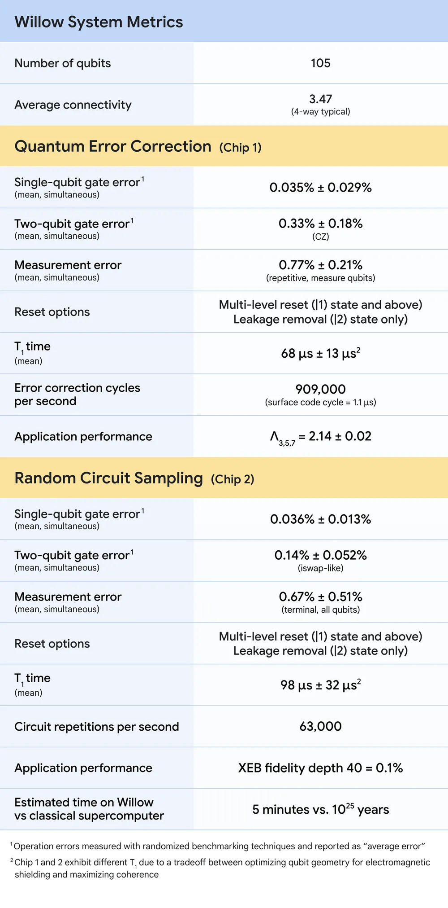

Dec 09, 2024 2024 年 12 月 9 日

7 min read

Our new chip demonstrates error correction and performance that paves the way to a useful, large-scale quantum computer  

我们的新芯片展示了纠错和性能，为实用的大规模量子计算机铺平了道路

Sorry, your browser doesn't support embedded videos, but don't worry, you can [download it](https://storage.googleapis.com/gweb-uniblog-publish-prod/original_videos/05_Hero_Shot.mp4) and watch it with your favorite video player!  

对不起，您的浏览器不支持嵌入式视频，但别担心，您可以下载它并用您喜欢的视频播放器观看！

Today I’m delighted to announce Willow, our latest quantum chip. Willow has state-of-the-art performance across a number of metrics, enabling two major achievements.  

今天，我很高兴地宣布 Willow，我们最新的量子芯片。Willow 在多个指标上都具有最先进的性能，实现了两项重大成就。

-   The first is that Willow can reduce errors exponentially as we scale up using _more_ qubits. This cracks a key challenge in quantum error correction that the field has pursued for almost 30 years.  
    
    首先，随着我们使用更多的量子比特进行扩展，Willow 能够以指数方式减少错误。这解决了量子纠错领域近 30 年来一直追求的一个关键挑战。
-   Second, Willow performed a standard benchmark computation in under five minutes that would take one of today’s [fastest supercomputers](https://www.olcf.ornl.gov/frontier/) 10 septillion (that is, 1025) years — a number that vastly exceeds the age of the Universe.  
    
    其次，Willow 在不到五分钟的时间内完成了一项标准基准计算，而当今最快的超级计算机完成这项计算需要 10 的 24 次方（即 10 25 ）年——这个数字远远超过了宇宙的年龄。

The Willow chip is a major step on a journey that began over 10 years ago. When I founded Google Quantum AI in 2012, the vision was to build a useful, large-scale quantum computer that could harness quantum mechanics — the “operating system” of nature to the extent we know it today — to benefit society by advancing scientific discovery, developing [helpful applications](https://quantumai.google/applications), and tackling some of society's greatest challenges. As part of Google Research, our team has charted a long-term [roadmap](https://quantumai.google/roadmap), and Willow moves us significantly along that path towards commercially relevant applications.  

Willow 芯片是一段始于 10 多年前的旅程中的重要一步。2012 年我创立谷歌量子人工智能时，愿景是打造一台有用的大规模量子计算机，能够利用量子力学——就我们目前所知的自然界的“操作系统”——通过推动科学发现、开发有用的应用程序以及应对社会的一些重大挑战来造福社会。作为谷歌研究的一部分，我们的团队制定了一个长期路线图，Willow 使我们在通往具有商业相关性应用的道路上迈出了重要的一步。

6:39

A video with Director of Quantum Hardware Julian Kelly introducing Willow and its breakthrough achievements  

一段由量子硬件主管朱利安·凯利介绍威洛及其突破性成就的视频

## Exponential quantum error correction — below threshold!  

指数量子纠错——低于阈值！

Errors are one of the greatest challenges in quantum computing, since qubits, the units of computation in quantum computers, have a tendency to rapidly exchange information with their environment, making it difficult to protect the information needed to complete a computation. Typically the more qubits you use, the more errors will occur, and the system becomes classical.  

错误是量子计算中最大的挑战之一，因为量子位（量子计算机中的计算单位）往往会迅速与其环境交换信息，这使得保护完成计算所需的信息变得困难。通常，使用的量子位越多，出现的错误就越多，系统也就变得越经典。

Today in [Nature](https://www.nature.com/articles/s41586-024-08449-y), we published results showing that [**the more qubits we use in Willow, the more we** **_reduce_** **errors**](https://research.google/blog/making-quantum-error-correction-work/)**, and the more quantum the system becomes**. We tested ever-larger arrays of physical qubits, scaling up from a grid of 3x3 encoded qubits, to a grid of 5x5, to a grid of 7x7 — and each time, using our latest advances in quantum error correction, we were able to cut the error rate in half. In other words, we achieved an exponential reduction in the error rate. This historic accomplishment is known in the field as “below threshold” — being able to drive errors down while scaling up the number of qubits. You must demonstrate being below threshold to show real progress on error correction, and this has been an outstanding challenge since [quantum error correction](https://journals.aps.org/pra/abstract/10.1103/PhysRevA.52.R2493) was introduced by Peter Shor in 1995.  

今天在《自然》杂志上，我们发表的结果表明，在 Willow 中使用的量子比特越多，我们减少的错误就越多，系统的量子特性就越明显。我们测试了越来越大的物理量子比特阵列，从 3x3 编码量子比特的网格，扩展到 5x5 的网格，再到 7x7 的网格——每次，利用我们在量子纠错方面的最新进展，我们都能够将错误率降低一半。换句话说，我们实现了错误率的指数级降低。这一历史性成就在该领域被称为“低于阈值”——在增加量子比特数量的同时能够降低错误率。要在纠错方面展示出真正的进展，就必须证明低于阈值，这自 1995 年彼得·肖尔（Peter Shor）提出量子纠错以来一直是一个突出的挑战。

There are other scientific “firsts” involved in this result as well. For example, it’s also one of the first compelling examples of real-time error correction on a superconducting quantum system — crucial for any useful computation, because if you can’t correct errors fast enough, they ruin your computation before it’s done. And it’s a "beyond breakeven" demonstration, where our arrays of qubits have longer lifetimes than the individual physical qubits do, an unfakable sign that error correction is improving the system overall.  

在这一结果中还涉及其他科学“首次”。例如，这也是超导量子系统实时纠错的首批令人信服的实例之一——这对任何有用的计算都至关重要，因为如果不能足够快地纠正错误，它们会在计算完成之前破坏计算。而且这是一个“超越收支平衡”的演示，我们的量子比特阵列的寿命比单个物理量子比特更长，这是纠错正在整体改善系统的一个无可伪造的迹象。

As the first system below threshold, this is the most convincing prototype for a scalable logical qubit built to date. It’s a strong sign that useful, very large quantum computers can indeed be built. Willow brings us closer to running practical, commercially-relevant algorithms that can’t be replicated on conventional computers.  

作为第一个低于阈值的系统，这是迄今为止构建的可扩展逻辑量子比特最令人信服的原型。这是一个强烈的信号，表明有用的、非常大型的量子计算机确实可以被建造出来。Willow 使我们更接近于运行在传统计算机上无法复制的实用的、与商业相关的算法。

## 10 septillion years on one of today’s fastest supercomputers  

在当今最快的超级计算机之一上需要 10 的 24 次方年

As a measure of Willow’s performance, we used the [random circuit sampling (RCS) benchmark](https://research.google/blog/validating-random-circuit-sampling-as-a-benchmark-for-measuring-quantum-progress/). Pioneered by our team and now widely used as a standard in the field, RCS is the classically hardest benchmark that can be done on a quantum computer today. You can think of this as an entry point for quantum computing — it checks whether a quantum computer is doing something that couldn’t be done on a classical computer. Any team building a quantum computer should check first if it can beat classical computers on RCS; otherwise there is strong reason for skepticism that it can tackle more complex quantum tasks. We’ve consistently used this benchmark to assess progress from one generation of chip to the next — we reported Sycamore results in [October 2019](https://blog.google/technology/ai/what-our-quantum-computing-milestone-means/) and again recently in [October 2024](https://www.nature.com/articles/s41586-024-07998-6).  

作为衡量 Willow 性能的指标，我们使用了随机电路采样（RCS）基准。由我们的团队开创，如今在该领域被广泛用作标准，RCS 是当今在量子计算机上可以进行的经典最难基准。您可以将其视为量子计算的切入点——它检查量子计算机是否在做经典计算机无法完成的事情。任何构建量子计算机的团队都应首先检查它是否能在 RCS 上击败经典计算机；否则，就有充分的理由怀疑它能否处理更复杂的量子任务。我们一直使用这个基准来评估从一代芯片到下一代芯片的进展——我们在 2019 年 10 月报告了 Sycamore 的结果，最近又在 2024 年 10 月进行了报告。

Willow’s performance on this benchmark is astonishing: It performed a computation in under five minutes that would take one of today’s [fastest supercomputers](https://www.olcf.ornl.gov/frontier/) 1025 or 10 septillion years. If you want to write it out, it’s 10,000,000,000,000,000,000,000,000 years. This mind-boggling number exceeds known timescales in physics and vastly exceeds the age of the universe. It lends credence to the notion that quantum computation occurs in many parallel universes, in line with the idea that we live in a multiverse, a [prediction](https://en.wikipedia.org/wiki/The_Fabric_of_Reality) first made by David Deutsch.  

Willow 在这个基准测试中的表现令人震惊：它在不到五分钟的时间内完成了一项计算，而当今最快的超级计算机完成这项计算需要 10 25 或 10 亿亿亿亿亿亿亿亿亿年。如果要写出来，那就是 10,000,000,000,000,000,000,000,000 年。这个令人难以置信的数字超过了物理学中已知的时间尺度，并且远远超过了宇宙的年龄。这为量子计算发生在许多平行宇宙中的观点提供了可信度，这与我们生活在多元宇宙中的观点一致，这一预测最初由大卫·多伊奇提出。

These latest results for Willow, as shown in the plot below, are our best so far, but we’ll continue to make progress.  

如下方图表所示，Willow 的这些最新成果是我们目前为止最好的，但我们会继续取得进步。

Computational costs are heavily influenced by available memory. Our estimates therefore consider a range of scenarios, from an ideal situation with unlimited memory (▲) to a more practical, embarrassingly parallelizable implementation on GPUs (⬤).  

计算成本在很大程度上受到可用内存的影响。因此，我们的估计考虑了一系列情况，从具有无限内存的理想情况（▲）到在 GPU 上更实际、可尴尬并行化的实现（⬤）。

Our assessment of how Willow outpaces one of the world’s most powerful classical supercomputers, [Frontier](https://www.olcf.ornl.gov/frontier/), was based on conservative assumptions. For example, we assumed full access to secondary storage, i.e., hard drives, without any bandwidth overhead — a generous and unrealistic allowance for Frontier. Of course, as happened after we announced the first [beyond-classical computation in 2019](https://blog.google/technology/ai/what-our-quantum-computing-milestone-means/), we expect classical computers to keep improving on this benchmark, but the rapidly growing gap shows that quantum processors are peeling away at a double exponential rate and will continue to vastly outperform classical computers as we scale up.  

我们对 Willow 如何超越世界上最强大的经典超级计算机之一 Frontier 的评估是基于保守的假设。例如，我们假设可以完全访问辅助存储，即硬盘，而没有任何带宽开销——这对 Frontier 来说是一个慷慨且不切实际的许可。当然，正如我们在 2019 年宣布首次超越经典计算之后所发生的那样，我们预计经典计算机在这个基准上会不断改进，但迅速扩大的差距表明，量子处理器正以双指数速度发展，并将随着我们的规模扩大而继续大幅超越经典计算机。

5:59

A video with Principal Scientist Sergio Boixo, Founder and Lead Hartmut Neven, and renowned physicist John Preskill discussing random circuit sampling, a benchmark that demonstrates beyond-classical performance in quantum computers.  

一段视频，其中有首席科学家塞尔吉奥·博伊克斯（Sergio Boixo）、创始人兼负责人哈特穆特·内文（Hartmut Neven）以及著名物理学家约翰·普雷斯基尔（John Preskill）在讨论随机电路采样，这是一个在量子计算机中展示超越经典性能的基准。

## State-of-the-art performance  

最先进的性能

Willow was fabricated in our new, state-of-the-art fabrication facility in Santa Barbara — one of only a few facilities in the world built from the ground up for this purpose. System engineering is key when designing and fabricating quantum chips: All components of a chip, such as single and two-qubit gates, qubit reset, and readout, have to be simultaneously well engineered and integrated. If any component lags or if two components don't function well together, it drags down system performance. Therefore, maximizing system performance informs all aspects of our process, from chip architecture and fabrication to gate development and calibration. The achievements we report assess quantum computing systems holistically, not just one factor at a time.  

Willow 是在我们位于圣巴巴拉的全新、最先进的制造工厂制造的——这是世界上为数不多的专门为此目的从头开始建造的工厂之一。在设计和制造量子芯片时，系统工程是关键：芯片的所有组件，如单量子比特门和双量子比特门、量子比特复位和读出，都必须同时进行良好的工程设计和集成。如果任何组件滞后，或者如果两个组件不能很好地协同工作，就会降低系统性能。因此，最大限度地提高系统性能贯穿了我们流程的各个方面，从芯片架构和制造到门的开发和校准。我们报告的成果是对量子计算系统进行全面评估，而不是一次只评估一个因素。

We’re focusing on quality, not just quantity — because just producing larger numbers of qubits doesn’t help if they’re not high enough quality. With 105 qubits, Willow now has best-in-class performance across the two system benchmarks discussed above: quantum error correction and random circuit sampling. Such algorithmic benchmarks are the best way to measure overall chip performance. Other more specific performance metrics are also important; for example, our T1 times, which measure how long qubits can retain an excitation — the key quantum computational resource — are now approaching 100 µs (microseconds). This is an impressive ~5x improvement over our previous generation of chips. If you want to evaluate quantum hardware and compare across platforms, here is a table of key specifications:  

我们关注的是质量，而不仅仅是数量——因为如果量子比特的质量不够高，仅仅生产更多数量的量子比特是没有帮助的。Willow 拥有 105 个量子比特，在上述讨论的两个系统基准（量子纠错和随机电路采样）方面，目前具有同类最佳性能。此类算法基准是衡量整体芯片性能的最佳方式。其他更具体的性能指标也很重要；例如，我们的 T 1 时间，用于衡量量子比特能够保持激发（关键的量子计算资源）的时间，现在接近 100 微秒。这比我们的上一代芯片有了令人印象深刻的约 5 倍的提升。如果您想评估量子硬件并在不同平台之间进行比较，以下是关键规格表：

Willow’s performance across a number of metrics.  

威洛在多个指标方面的表现。

## What’s next with Willow and beyond  

Willow 及以后的发展会怎样

The next challenge for the field is to demonstrate a first "useful, beyond-classical" computation on today's quantum chips that is relevant to a real-world application. We’re optimistic that the Willow generation of chips can help us achieve this goal. So far, there have been two separate types of experiments. On the one hand, we’ve run the RCS benchmark, which measures performance against classical computers but has no known real-world applications. On the other hand, we’ve done scientifically interesting simulations of quantum systems, which have led to new scientific discoveries but are still within the reach of classical computers. Our goal is to do both at the same time — to step into the realm of algorithms that are beyond the reach of classical computers **and** that are useful for real-world, commercially relevant problems.  

该领域面临的下一个挑战是在当今的量子芯片上展示首次“有用的、超越经典的”计算，且与实际应用相关。我们乐观地认为，Willow 这一代芯片能够帮助我们实现这一目标。到目前为止，已经有两种不同类型的实验。一方面，我们已经运行了 RCS 基准测试，该测试用于衡量与经典计算机相比的性能，但没有已知的实际应用。另一方面，我们对量子系统进行了具有科学意义的模拟，这带来了新的科学发现，但仍在经典计算机的能力范围内。我们的目标是同时做到这两点——进入经典计算机无法触及且对现实世界、商业相关问题有用的算法领域。

Random circuit sampling (RCS), while extremely challenging for classical computers, has yet to demonstrate practical commercial applications.  

随机电路采样（RCS）对于经典计算机来说极具挑战性，但尚未展示出实际的商业应用。

We invite researchers, engineers, and developers to join us on this journey by checking out our [open source software](https://quantumai.google/software) and educational resources, including our [new course on Coursera](https://coursera.org/learn/quantum-error-correction), where developers can learn the essentials of quantum error correction and help us create algorithms that can solve the problems of the future.  

我们邀请研究人员、工程师和开发人员加入我们的这一旅程，查看我们的开源软件和教育资源，包括我们在 Coursera 上的新课程，在那里开发人员可以学习量子纠错的基本知识，并帮助我们创建能够解决未来问题的算法。

My colleagues sometimes ask me why I left the burgeoning field of AI to focus on quantum computing. My answer is that both will prove to be the most transformational technologies of our time, but advanced AI will significantly benefit from access to quantum computing. This is why I named our lab Quantum AI. Quantum algorithms have fundamental scaling laws on their side, as we’re seeing with RCS. There are similar scaling advantages for many foundational computational tasks that are essential for AI. So quantum computation will be indispensable for collecting training data that’s inaccessible to classical machines, training and optimizing certain learning architectures, and modeling systems where quantum effects are important. This includes helping us discover new medicines, designing more efficient batteries for electric cars, and accelerating progress in fusion and new energy alternatives. Many of these future game-changing applications won’t be feasible on classical computers; they’re waiting to be unlocked with quantum computing.  

我的同事有时会问我，为什么我离开蓬勃发展的人工智能领域，专注于量子计算。我的回答是，两者都将被证明是我们这个时代最具变革性的技术，但先进的人工智能将极大地受益于量子计算的应用。这就是为什么我把我们的实验室命名为量子人工智能。正如我们在 RCS 中看到的那样，量子算法在其基本的缩放定律方面具有优势。对于许多对人工智能至关重要的基础计算任务，也有类似的缩放优势。因此，量子计算对于收集经典机器无法获取的训练数据、训练和优化某些学习架构以及对量子效应重要的系统建模将是不可或缺的。这包括帮助我们发现新药、为电动汽车设计更高效的电池，以及加速核聚变和新能源替代品方面的进展。许多这些未来改变游戏规则的应用在经典计算机上是不可行的；它们正等待着用量子计算来解锁。
