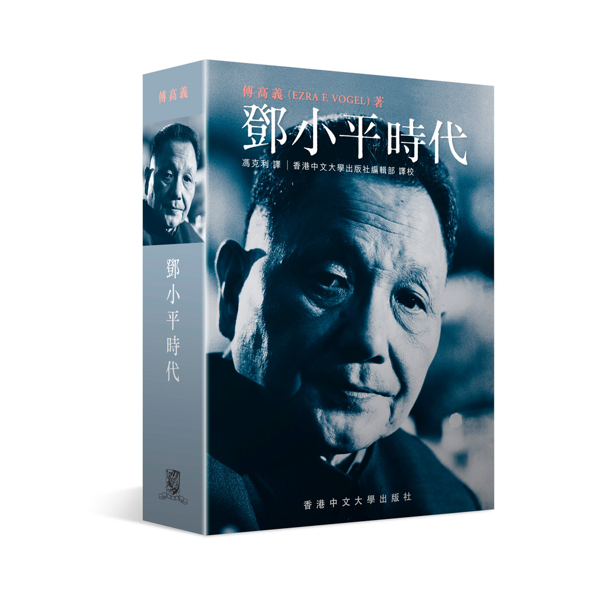
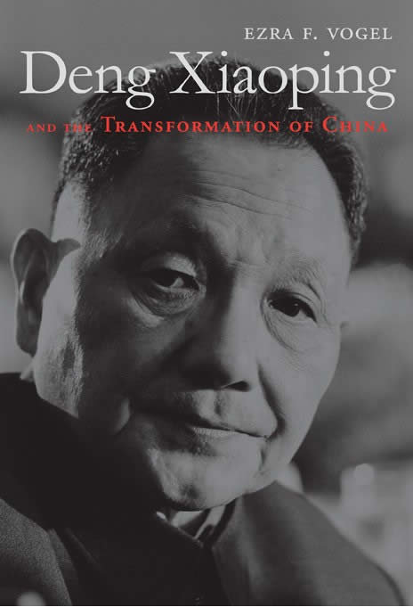
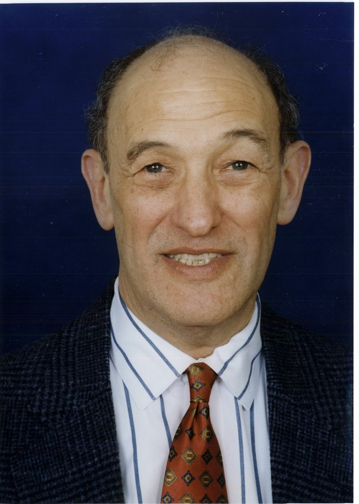

哈佛大学教授傅高义(Ezra F. Vogel)倾十年心力完成的巨著《邓小平时代》(_Deng Xiaoping and the Transformation of China_)于2013年1月由生活·读书·新知三联书店出版，在中国大陆首度公开发行了简体中文版。

香港中文大学出版社出版的《邓小平时代》。 The Chinese University Press

《邓小平时代》一书英文原著于2011年在哈佛大学出版社出版，2012年香港中文大学出版社出版了未经删节的中文版，译者为冯克利。港版全书约58万字，其中注释6.1万字。三联书店的大陆版仍采用了冯克利的译本，但对内容进行了删节。

哈佛大学出版社出版的《邓小平时代》英文版。

大陆版正文较港版删节约5.3万字，其中包括“邓小平时代的关键人物”(Key People in the Deng Era)一文约2.6万字。附录部分，大陆版的注释从港版的105页缩减为78页，索引由港版的39页缩减为11页。

傅高义。 Courtesy of Ezra Vogel

在给《纽约时报》的邮件回复中，傅高义坦承了他对《邓小平时代》大陆版的看法。他表示，三联书店能够获准出版《邓小平时代》中文版并保留了他想表达的核心内容（占原著篇幅90%以上），令他感到欣慰。他称赞三联书店“努力地呈现了所有我想要表达的核心内容”，“当我抱怨我想说的话被省掉的时候，他们（三联）有时会想出办法把（我想说的）话说出来。”

傅高义还确认了他与三联书店达成的协议，即三联方面保证将大陆版所有的删节之处告知傅高义并做出说明，而且不添加傅高义原话之外的任何内容。这一承诺从《三联生活周刊》对三联书店总编辑李昕的访谈中，可以得到佐证。《纽约时报》曾就《邓小平时代》一书在大陆出版的情况联系三联书店置评，但三联方面表示不便就此接受采访。

客观地说，大陆版《邓小平时代》对天安门事件、邓小平南巡前后对改革停滞的不满、邓小平子女的腐败传闻等敏感话题并未避而不谈。那么，正文部分蒸发的约2.7万字都涉及怎样的内容？这无疑是一个了解今日中国历史叙述禁区及出版审查红线的难得机会。笔者在认真比对《邓小平时代》英文原版、香港中文大学版和三联书店版的基础上，将《邓小平时代》大陆版编辑取舍的主要思路归纳举要如下。

**党内的矛盾和斗争**

《邓小平时代》记载了不同历史时期，中共高层领导人之间存在的矛盾，如毛泽东与周恩来的矛盾，华国锋和邓小平的矛盾，邓小平与陈云的矛盾等。在大陆版中，对这些矛盾的描写被不同程度地删减和淡化。例如：

第2章《放逐与回归》(Banishment and Return, 1969-1974)中，两段对毛泽东既不喜欢周恩来，又离不开周恩来的心态的描写，第5章《靠边站》(Sidelined as the Mao Era Ends, 1976)中对周恩来去世后毛泽东的冷漠态度的描写被删去。

第12章《重组领导班子》(Launching the Deng Administration, 1979-1980)中写道，叶剑英反对华国锋去职但最终向多数意见妥协，后来叶帅病重时邓小平没有礼节性地前去看望他；以及为了更顺利地使华国锋下台，邓小平分阶段施加压力——这些暴露中共党内分歧的细节也被删去。

1980年代后期，主张大力改革的邓小平和主张稳健的陈云在1984年之后分歧日益明显。为了弱化这种分歧，第14章《广东和福建的实验》(Experiments in Guangdong and Fujian, 1979-1984)部分删去了对陈云保守态度的刻画，例如“与此同时，广东的干部则认为他（陈云）始终是个让他们头痛的人。几乎所有的高干都去过特区至少一次，对特区的成就予以表扬，只有陈云和李先念不去。陈云每年都去南方过冬，比如杭州和上海等地，但他总说自己的身体状况不允许他去广东。”

类似对邓小平和陈云分歧的淡化处理在第14章节中出现了3次，第16章中出现了7次，在第22章（由于内地版将第20和21章合并为一章，所以英文版和港版是第23章，内地版是第22章）《终曲：南方之行》 (Deng’s Finale: The Southern Journey, 1992)中也删节了部分有关二人矛盾的内容。不过，在傅高义“邓小平时代的关键人物”一文中，也强调了邓陈之前合作的一面。他写道，“邓小平和陈云还是在这种路线分歧中尽量做到了和平相处。”

邓小平1992年南巡前后，党内改革与保守路线的斗争也成是大陆版《邓小平时代》努力回避的一个话题。傅高义认为，邓小平1992年南巡最重要的意义在于使江泽民站到了改革者的行列中。有军方要人出席的“珠海会议”是其中一个重要事件。大陆版删去了大半有关珠海会议的内容，如邓小平会上“谁不改革，谁就下台，我们的领导看上去是在做事，但其实他们没有做任何有用的事”的严厉讲话，及“如果江泽民不推行改革，得到军队拥护的邓小平将用乔石来替换他”，“江泽民向时任福建省委书记的贾庆林索要珠海会议录音”等。不过，大陆版第22章中仍保留了与“珠海会议”相关的一个段落（大陆版第626页）。

**天安门事件的经过和细节**

大陆版《邓小平时代》将原著及港版的第20章《北京之春：1989年4月15日至5月17日》(Beijing Spring, April 15-May 17, 1989)和第21章《天安门的悲剧：1989年5月17日-6月4日》(The Tiananmen Tragedy, May17-June 4,1989)合并为第20章《北京，1989》。

在描述1989年天安门事件时，傅高义英文原著中使用了“镇压”(crackdown)、“悲剧”(tragedy)、“灾难”(catastrophe)和“人类的苦难”(human suffering)等词汇，但没有使用西方世界形容天安门事件的另一种流行说法“屠杀”(massacre)。大陆版《邓小平时代》对傅高义的表述进行了弱化，描写6月4日的“镇压”(The Crackdown)一节，标题被改为“清场”。此外，大陆版用“六四”代替了港版中“天安门事件”一词，来称呼这场政治运动。

有关天安门事件的内容是大陆版删节最明显的一部分（比港版少了约一万字），不过该事件的大致经过基本得到保留，包括以下十六个标题：“胡耀邦去世”，“骚动的根源”，“从悼念到抗议”，“‘四二六社论’”，“李鹏和赵紫阳的分歧”，“为戈尔巴乔夫的访问做准备和绝食抗议”，“戈尔巴乔夫访问北京”，“戒严令和赵紫阳离职，5月17-20日”，“戒严受阻，5月19-22日”，“准备清场解决,5月22日-6月3日”，“筹组新的领导班子，“强硬派学生的坚持，5月20日-6月2日”,“清场，6月3-4日”，“温室中的一代和被推迟的希望”，“天安门意象的力量”，“假如”。

下列内容则被不同程度地删减：悼念胡耀邦的天安门抗议与1976年悼念周恩来的“四五运动”的类比；“四二六社论”加剧冲突，李鹏的生硬态度和赵紫阳对学生的同情（如“李鹏的态度甚至无法赢得官方媒体的支持”，而赵紫阳在5月3日和4日的两次重要讲话则“像是一个长者去劝说本质还不错的孩子”）；邓小平接待戈尔巴乔夫时因为广场局势不断恶化而将饺子从筷子上滑落下来的细节；赵紫阳和一批自由派退休干部——李昌、李锐、于光远和杜润生——为避免暴力镇压做的最后的努力；赵紫阳去职和被软禁的细节，比如他在广场对学生说话时“声音颤抖，眼含泪水”；赵紫阳试图写信给邓小平，解释他与戈尔巴乔夫说过的令邓气愤的话，并于同一天被软禁；邓小平决定使用武力，如何在高层领导中取得一致，如何准备坦克，装甲兵车，把远距离的军队运送到北京；军队在6月4日夜间行动的经过，等等。

对于1989年6月3日夜至4日凌晨镇压的描写，未删减的港版有1283字，而大陆版只有325字。此外，对于伤亡数字，原著提供了6种版本：中国官方估计的200多人，李鹏对布兰特·斯考克罗夫特(Brent Scowcroft)说的310人，遇害人之一丁子霖的母亲截至2008年搜集到的近200个姓名；外国观察家估计的300人至2600人，外国媒体报道的，“被严重夸大的”的上万人；以及外国武官的估计和来自北京11所医院的报告的478人；但大陆版只保留了中国官方报告的200人以及外国媒体的上万人，并指出那是“严重的夸大”。

**对领导人的评说**

大陆版《邓小平时代》中对有关中共高级领导人评价的内容字斟句酌，其中不乏“为尊者讳”的情况。

傅高义用“喜欢报复(vindictive)”、“邪恶狡猾(devious)”等词语来形容毛泽东，而这些词语在大陆版中被弱化。他在第2章《放逐与回归》中写道，“毛泽东无论作为个人还是作为领袖，都是个强势人物。他功高盖世，整起好同志来也毫不留情；他精于权谋，任何人在对他的评价上都很难做到不偏不倚”(英文版第54页、港版47页)。这句话在大陆版中被改为：“毛泽东无论作为个人还是作为领袖，都是个强势人物，任何人在对他的评价上都很难做到不偏不倚”(大陆版第67页)。序言部分也有类似的删节，如“在他统治的27年间，毛泽东不仅消灭了资本家和地主，也毁掉了很多知识分子和老干部”。

针对周恩来的一些负面情节也被大陆版略去。例如，在第2章《放逐与回归》里，傅高义写道：“周恩来对文革受害者的帮助是有限的。周恩来在1956年一次政治局会议后曾惹恼毛泽东，他当时私下对毛说：他从良心上不赞成毛的经济政策。自从那次受批评后，他在长达15年时间里一直小心翼翼，避免让毛泽东找到理由怀疑他没有全心全意贯彻毛的意图。尽管如此，毛泽东在1958年1月还是对周恩来大发脾气，他说周恩来离右派只有五十步远，这一斥责让周恩来进一步退缩。”又如，第2章中，“并非人人都把周恩来视为英雄，例如陈毅的家人就对他没有保护陈毅很气愤，一些没有得到周恩来帮助的受害者家属也有同样的心情，还有一些人说他助纣为虐，对于文革的浩劫难辞其咎。”（英文版第66页、港版57页）

大陆版剔除了第16章《加快经济发展和开放步伐》中对邓小平1988年推行物价闯关失败的批评：“邓小平宣布进行全面物价改革这一决定，后来被证明大概是他一生中代价最高昂的错误”，以及“83岁的他已经远离了群众”（英文版第470-471页、港版420页）。

不过，与“为尊者讳”相反的是，大陆版淡化了原著对胡耀邦和赵紫阳的正面评价，如在第16章《加快经济发展和改革开放步伐》中，傅高义写道：“在智囊团为赵紫阳工作的人，都十分尊重和钦佩赵紫阳，他们喜欢他毫不做作的随和作风，不拘一格，广纳贤言的开放态度，以及把想法转化为推动国家前进的实际政策的能力。” 这段话在大陆版中被删去(英文版第455页、港版407页)。

港版第20章《北京之春：1989》写到李鹏“固执而又谨慎”的性格，与“热情且富有同情心”的胡耀邦，或“超然而具有绅士风度和分析才能”的赵紫阳形成鲜明对比，而在大陆版中，对胡耀邦和赵紫阳的性格描述被删去（但保留了李鹏性格“固执而又谨慎”的说法）。不过，在“胡耀邦去世”一节中，对他的正面评价仍然被保留：“群众能够长久被胡耀邦感动，不仅因为他热情亲切，还因为他做人正派，对党忠心耿耿。他是知识分子的希望，曾为他们做过勇敢的斗争。他是他们心目中好干部的表率——有崇高理想，无任何腐败劣迹。他曾长期担任团中央第一书记，能够与他所培养和提携的年轻人打成一片。”（大陆版第567至568页）

此外，书的末尾“邓小平时代的关键人物”一文包含了傅高义对陈云，邓力群，胡乔木，胡耀邦，华国锋，李先念，毛远新，任仲夷，万里，王洪文，习仲勋，叶剑英，余秋里，赵紫阳的生平和他们个人性格的简介，而这个2.6万字的部分在大陆版中被省去。

**一些极富争议的国际人物和事件**

对于中国与波尔布特(Pol Pot)的关系、1979年中越战争，齐奥塞斯库(Nicolai Ceausescu)之死及东欧剧变这些极富争议的国际人物和事件，大陆版《邓小平时代》也进行了删节。

第18章《为军事现代化作准备》(The Military: Preparing for Modernization)写道，邓小平为了遏制苏联与越南的军事合作，要通过攻打越南来展示不惜一战的决心。当越南出兵柬埔寨之后，红色高棉(Khmer Rouge)领导人波尔布特请邓小平派兵帮助柬埔寨。尽管波尔布特的暴政受到西方的强烈谴责，邓小平依然决定与他合作。第9章波尔布特的名字和第18章对越战争的一些细节（如战争之后，邓小平指示大量中国军队在边境驻扎，对越南人进行骚扰），以及高层领导人对对越战争的不同意见在大陆版中被删去。

第22章《稳住阵脚》(Standing Firm)写到，罗马尼亚领导人、中国的老朋友齐奥塞斯库及其妻子因为向平民开枪被枪决。中国媒体对齐奥塞斯库的向平民开枪未作任何报道；当齐奥塞斯库被枪决两天后，《人民日报》在第四版下方简短地发布了一句话：“罗马尼亚电视台12月25日宣布，罗马尼亚特别军事法庭宣判齐奥塞斯库及其妻子死刑，这一判决已经得到执行。”

又如，原著第22章中对东欧和苏联社会主义阵营崩溃及中国反应的记载，“波兰在1989年6月4日以公投的方式选出议会，东德于1989年10月7日爆发大规模抗议，1990年2月苏共全会讨论放弃党对权力的垄断，这些重大事件都被中国媒体淡化和掩盖。”在大陆版中，中国媒体对东欧剧变的蓄意淡化也被淡化为两句话：“通过《参考资料》上每天从西方媒体翻译过来的材料，中国的官员要比一般的群众更了解真相”，“尽管中国的领导人在向民众报道苏东剧变时动作迟缓，但很快就根据新的现实调整了其外交政策。”

**注释中的禁书**

傅高义撰写的《邓小平时代》旁征博引，其中也引用了一些在大陆尚无法公开出版的著作。在大陆版中，这些涉及禁书的注释被大量删减，但也有一部分被保留了下来。 

曾在中共中央文献研究室工作的、周恩来生平研究专家高文谦所著《晚年周恩来》一书，在第2章英文注释共出现了19次，大陆版中被悉数删去。

张良、黎安友(Andrew J. Nathan)和林培瑞(Perry Link)编著的《天安门文件》(_The Tiananmen Papers_)是很多学者研究天安门事件使用的重要史料，该文件集在英文版注释中出现了26次，但在大陆版中仅了1次：它与《李鹏六四日记》，另外两位学者的论文和著作，《纽约时报》记者纪思道(Nicholas Kristof)和伍洁芳(Sheryl WuDunn)的著作一并出现在第20章的注释12中。《天安门文件》被删减的25条注释中，有12条对应的正文被删去，其余13条则保留了引用内容，但将出处单独删去。《李鹏六四日记》英文版注释出现19次，内地版12次，删减的7处相应引文均被删去。  

根据赵紫阳软禁期间口述整理的《改革历程》(_Prisoner of the State_)，在英文版中出现12次，大陆版出现1次。其中4条注释被单独删去，引文保留，其余7条则与对应引文一齐删去。《杜导正日记》在第19章出现了3次，但注释与引文都被删除。

原新华社记者杨继绳的《中国改革年代的政治斗争》虽然在第20章中的注释被删去，但在第14章注释7和第19章注释59中得以保留。

第17章《台湾，香港和西藏问题》注释102中提到的王力雄著《天葬：西藏的命运》和苏绍智、陈一咨、高文谦编《人民心中的胡耀邦》也被保留下来。

尽管大陆版删节了5.3万字，对于很多大陆读者来说，它还是披露了大量的细节，许多关于1980年代中国历史的叙述在大陆公开出版物中都属首次出现。读者仍然有机会从书中领略到历史及历史人物的真实和复杂。对于在出版审查中生活，并建立了“自我审查”的笔者，大陆版中许多保留的内容已令笔者感到意外惊喜。

**参考资料：**

1\. \[美\] 傅高义(Ezra F. Vogel)著，冯克利 译，香港中文大学出版社编辑部、生活·读书·新知三联书店编辑部 译校《邓小平时代》，生活·读书·新知三联书店，2013年1月北京第1版；

2\. 傅高义(Ezra F. Vogel)著，冯克利 译，香港中文大学出版社编辑部 译校《邓小平时代》，中文大学出版社，2012年香港；

3\. _Deng Xiaoping and the Transformation of China,_ by Ezra F.Vogel The Belknap Press of Harvard University Press, Cambridge, Massachusetts, and London, England 2011
