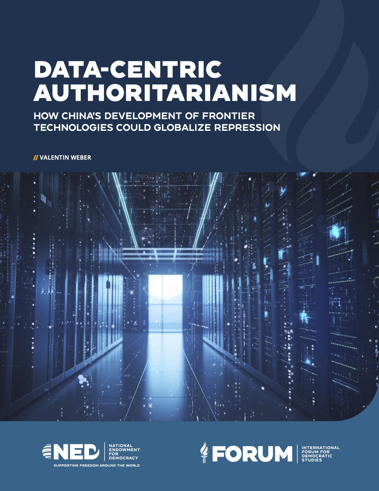

> **Jerome**: 特朗普说：我们都一样。

> [外交学者(The Diplomat)](https://thediplomat.com/)：是一份专注于亚太地区的国际时事杂志，涵盖大量高质量的分析和评论。通过对地区问题的深入探讨，赢得了评论员、政策制定者和学者等众多有影响力的受众。

## 一、卫报：谷歌接受中俄审查请求，删除不利两国政权的在线内容

2月15日，英国卫报发布了一份[调查报道](https://www.theguardian.com/world/2025/feb/15/google-helped-facilitate-russia-china-censorship-requests)，指出国际科技巨头谷歌助纣为虐，帮助中俄两国进行内容审查。“在俄罗斯和中国政府的请求下，谷歌删除了YouTube上的反政府抗议视频，或是批评政府并指控官员腐败的内容”。

文章封面截图

据悉，作为全球最大的科技公司之一，谷歌每天为数十亿人提供搜索、YouTube、云端硬盘Drive和浏览器Chrome等产品。

文章称，自2011年以来，150多个国家的政府曾要求谷歌删除其网络平台中的某些信息。这些国家不仅包括民主国家，谷歌还与多个“独裁政权、受制裁政权以及被指控侵犯人权的政府”有过互动，甚至还包括塔利班控制下的阿富汗政府。

卫报引用谷歌自己的数据称，“在全球范围内，它已在政府要求下‘标记待删除’的内容达560万条”。而根据网络安全公司Surfshark的数据，“自2020年以来，全球政府对谷歌的内容删除请求已增长一倍以上”。

谷歌称，信息删除的原因多种多样，包括侵犯版权、侵犯隐私、诽谤，或违反谷歌自身的政策。该公司称不会公开所有删除请求的详细数据，但会发布部分关于“可能符合公众利益”的特定审查请求摘要。之后，这些摘要会被收录在谷歌的《透明度报告》中，并每六个月更新一次。

然而，卫报的“观察者”(The Observer)调查团队在对这一报告分析后表示，谷歌在删除内容方面的流程不透明且数据不完整。他们称，自2020年以来，除国家安全相关内容外，谷歌收到的大部分删除请求涉及版权、隐私和安全问题，然而成千上万的请求被归类为“其他”，谷歌未提供进一步解释。

中国公安部要求谷歌删除412个视频，包括346个“涉及对中国政治体系腐败的指控或关于高级政府官员的报道”。对此，谷歌答应删除了超过200个视频。此外，谷歌还帮助中国政府打击网络言论自由，删除了冒充国家主席习近平的个人账号等。

对此，卫报采访的专家哈丽特·莫伊尼汉(Harriet Moynihan)批评了谷歌不透明的审核政策，称谷歌和其他公司在“几乎没有监管的情况下扮演‘上帝’的角色”。

最后，卫报称，谷歌并未对这篇报道发表任何回应。

## 二、美国国家民主基金会：中国利用AI技术强化数字极权体制，威胁全球民主

随着DeepSeek人工智能模型的诞生，中国AI技术的发展再次吸引了全世界的目光。2月11日，美国国家民主基金会发布了一份[报告](https://www.ned.org/data-centric-authoritarianism-how-chinas-development-of-frontier-technologies-could-globalize-repression-2/)，警告称AI等前沿技术的发展将改变专制政权镇压异己的模式，并进一步助长中共当局的监控和社会控制。报告还称，如果中国当局向外输出这种高科技数字极权模式，全世界的民主自由将受到严重威胁。

报告封面

报告表示，当今世界正进入一个数据驱动的威权主义时代。报告列举了四种主要的技术：人工智能 (AI)、神经科技、量子技术以及数字货币。作者称这些技术都可以用来加强政府对公民的监控和社会控制。其中，中国在这一领域遥遥领先，中共当局正通过前所未有的方式收集并利用海量数据——不仅来自国内，还扩展至海外，甚至涵盖了私人领域。

国家民主基金会研究员瓦伦丁·韦伯 (Valentin Weber) 指出，中共当局长期以来一直在探索如何利用技术巩固统治。从早期的“金盾工程”到“天网”监控系统，中国的数字极权主义已经发展成一个高度复杂的体系。例如，中国的AI监控系统具有先进的面部识别、步态识别和语音识别等功能。这些技术使得政府能够精准锁定个体，甚至在犯罪或抗议发生前采取预防性措施。

然而，报告指出，随着新兴技术的进步，这种控制体系正在进一步深化，并通过技术出口向全球扩散，影响其他国家的治理模式。据悉，中国的监控系统已被出口到80多个国家，包括非洲、中东、东南亚等地区的威权或半威权政府。作者称，这些国家通过引进中国的监控技术，加强了对本国公民的控制。

对此，国家民主基金会呼吁，民主社会需要加快建立一个与中国技术体系相抗衡的开放、透明、以人权为核心的数字生态。只有通过科技创新、国际合作以及严格的数据治理政策，才能阻止极权技术的扩散，并保护全球公民在数字时代的自由与权利。

最后，报告强调，民主国家必须正视中国数据极权主义的崛起，并采取果断措施来抵御其全球扩张趋势。如果不采取行动，未来十年内，全球隐私权、自由言论权和公民自由可能面临空前的威胁。

## 三、外交学者杂志：2024中国慈善捐款总额跌至十年最低点，经济下滑和腐败丑闻是主因

2月8日，外交学者杂志发表了一篇[调查报道](https://thediplomat.com/2025/02/2024-was-a-dismal-year-for-chinese-philanthropy/)，称刚刚过去的2024年是中国慈善事业的寒冬。由于经济低迷和腐败丑闻，中国的个人和企业捐款均大幅减少，慈善捐款总额跌至2014年以来的最低点。

文章封面截图

作者引用中国基督教慈善组织爱德基金会的年终报告指出，2024年中国慈善捐款总额为1200亿元人民币，比2022年下降了14.3%。报道指出，这一情况对中国政府提出的“共同富裕”政策构成了严峻挑战。据悉，该政策倡导“慈善事业”作为“中国第三次分配”机制，以弥补市场和税收在第一次和第二次分配中的不足。

报道称，中国企业慈善捐赠原本占捐款总额的主导地位，然而在经济低迷和房地产危机的影响下，2024年的企业大额捐赠总额估计仅为170亿元人民币，较2023年减少了近一半。像恒大、碧桂园等大型房企曾是主要慈善捐赠者，如今纷纷陷入破产或经营困境。不仅如此，中国的富豪捐赠额也大幅减少。胡润中国慈善榜2024年的捐赠总额为102亿元人民币，比2022年下降了86%。

另一方面，过去十年，尽管中国捐款人数增加了近4倍，个人捐款额近年来却大幅下降。作者以中国最大的在线慈善筹款活动——腾讯“99公益日”为例，称该活动在2024年筹集到的善款仅为10.8亿元人民币，同比下降了71.7%。捐款人数同比下降了14.2%，平均个人捐款金额创下新低，仅为55元人民币。

报道称，这一现象反映出公众对慈善机构的不信任感持续增强。2024年最大的两起慈善丑闻均来自国有慈善基金会：中华儿童慈善救助基金会（CCAFC）卷入了一起1000万元人民币的捐款诈骗案；中国妇女发展基金会则被指控以16万元人民币组织一支没有演出记录的合唱团。作者表示，“这些事件让公众对慈善机构的资金去向产生怀疑，捐款热情骤减。”

作者还表示，类似的情况曾发生过。2008年汶川大地震时，社会各界共捐赠了800亿元人民币。然而，在中国红十字会和中华慈善总会腐败丑闻爆发后，2010年的捐款数大幅下降。

然而，作者指出，中国的慈善行业，特别是非政府组织，也在采取行动，努力扭转民众的负面印象。例如，上海的非政府组织“慈善盒子”尝试采用国际领先的影响评估方法，向捐赠者详细披露捐款去向和具体使用情况，以增加透明度。该组织发起的“元慈善机构”项目，在不到一年的时间里便吸引了400多名固定捐赠者，筹集资金超过32.5万元人民币。

报道指出，尽管中国当局强调“大慈善”概念，认为政府应该在慈善事业中扮演核心角色，但实际上“官方背景”的慈善机构信任危机仍未解决，严重拖累了整个慈善行业。同样，爱德基金会的报告也批评了政府对慈善机构的过度干预，认为这可能抑制行业活力，而不是促进透明化。

最后，作者表示，只有当慈善机构真正提高透明度、加强资金监管，并赢得公众信任时，中国的慈善事业才能摆脱目前的低谷，迈向可持续发展的未来。
