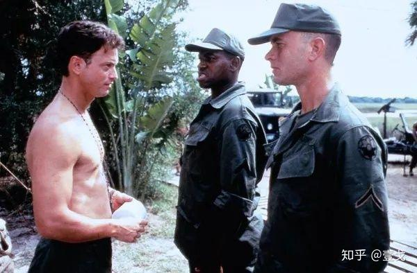

[《阿甘正传》](https://zhida.zhihu.com/search?content_id=111638355&content_type=Article&match_order=1&q=%E3%80%8A%E9%98%BF%E7%94%98%E6%AD%A3%E4%BC%A0%E3%80%8B&zhida_source=entity)历来总有人拿来和[《肖申克的救赎》](https://zhida.zhihu.com/search?content_id=111638355&content_type=Article&match_order=1&q=%E3%80%8A%E8%82%96%E7%94%B3%E5%85%8B%E7%9A%84%E6%95%91%E8%B5%8E%E3%80%8B&zhida_source=entity)对比，捧一踩一也大有人在，实际是两种不同的风格。

很奇怪的是，这两部电影都被认为是励志故事，不知道是中国人太需要励志了还是怎么回事，说起阿甘就是“傻人有傻福”，“人生就像一盒巧克力……”，还有说阿甘是个情感高手，从不追求只是守候，反而赢得了爱情，这些不能说没有，但都不是最重要的东西。

**如今的网络不是信息量太少，而是多得让人没法选择。这篇影评里的所有观点都不是壹戈本人的感悟，而是在看了几十上百篇的影评之后，觉得这么说才是最合理的，希望给初接触电影的朋友们一个探寻的方向。**

《阿甘正传》里最重要的是那些历史事件，我们可以把这些事件串联一下。

阿甘的全名叫[Forrest Gump](https://zhida.zhihu.com/search?content_id=111638355&content_type=Article&match_order=1&q=Forrest+Gump&zhida_source=entity)，他妈妈说Forrest这个名字来自[3K党](https://zhida.zhihu.com/search?content_id=111638355&content_type=Article&match_order=1&q=3K%E5%85%9A&zhida_source=entity)的创始人，3K党是美国最悠久、最庞大的种族主义组织，奉行白人至上，歧视有色人种。

他们家住在[阿拉巴马州](https://zhida.zhihu.com/search?content_id=111638355&content_type=Article&match_order=1&q=%E9%98%BF%E6%8B%89%E5%B7%B4%E9%A9%AC%E5%B7%9E&zhida_source=entity)，母亲家族留下一座庄园，阿甘说那房子有1000多年历史，其实阿拉巴马州最早被西班牙人入侵和殖民是在1519年。这里是美国南方庄园文化的核心区，庄园繁荣的重要因素就是大量的黑人奴隶，所以阿拉巴马州也是种族歧视和种族隔离最严重的州。

阿甘从小身体不好，脊柱弯曲，腿脚不利索，几岁就戴上了矫正器。电影里说[猫王](https://zhida.zhihu.com/search?content_id=111638355&content_type=Article&match_order=1&q=%E7%8C%AB%E7%8E%8B&zhida_source=entity)曾经是阿甘家里的房客，而且猫王那个标志性的扭胯舞，竟然是跟带着矫正器的小阿甘学的。猫王是美国摇滚音乐文化的先驱，他的音乐影响了整整一代美国人，辐射到全世界，台湾杨德昌的电影《牯岭街少年杀人事件》，里面就有一个小猫王。

阿甘先天弱智，智商只有75，本来不够上公立学校的标准，是她妈妈性贿赂校长，才让阿甘上了正常小学。这种操作在中国居然是有人学的，有个年轻的妈妈为了儿子进重点陪睡老师，被老公发现要离婚，那女的就跟老公说，当年我们上大学一起看的《阿甘正传》，你说阿甘的母亲多么多么的伟大，现在我为了儿子的前途牺牲一下，你就嫌弃我……她就没明白导演为什么给阿甘设定一个单亲家庭，如果阿甘的爸还活着，知道这种事也得气死，所以电影没看懂瞎模仿很要命。

阿甘在学校唯一的朋友就是[珍妮](https://zhida.zhihu.com/search?content_id=111638355&content_type=Article&match_order=1&q=%E7%8F%8D%E5%A6%AE&zhida_source=entity)，其他同学总是欺负阿甘，珍妮就总是让他跑，这样练就了一副飞毛腿。阿甘就因为跑得快上了大学，打了5年的橄榄球，进了全明星球队，然后还被肯尼迪总统接见。这部电影里所有的历史事件几乎全都采用了真实的纪录片和新闻资料，阿甘的人物形象都是后期处理进去的，包括后来肯尼迪总统遇刺事件也都是真实的画面。

关于阿拉巴马州的黑人平权运动，有一个著名的“挡校门事件”。美国最高法院判决，阿拉巴马州大学必须废除种族隔离政策，让黑人学生入学，而阿拉巴马州的州长乔治.华莱士竟然亲自挡在校门口，坚持他的种族隔离思想，当然他最后还是没能阻止黑人入学，阿甘又一次见证了这一历史时刻。这个带头搞种族隔离的华莱士竟然当了十几年的州长，四次竞选总统都失败了，后来被人刺杀，但侥幸没死。

阿甘大学毕业之后，越南战争打得热火朝天，他于是响应国家号召，去了越南战场。越南战争是美国在全球战争策略的转折点，实际也是美国搬起石头砸自己的脚，南方吴艳庭集团和越共胡志明集团，最开始都是美国暗地扶持起来的，后来是苏联支持北越，美国控制南越，我们中国在越战中也扮演了重要角色。

**延绵20年的越南战争，美国共有65万人参战，58000多人死亡，30万人伤残，回国的老兵又有几万自杀。**战争期间全国掀起了数次大规模反战潮，从根本上改变了美国的文化和社会格局，一半的年轻人在越南浴血奋战，另一半的年轻人在国内反战游行，电影关于越战的篇幅很大，后面的剧情伏笔全都来自越战，珍妮线就先放一放。

阿甘在越南认识了战友巴布和丹中尉，巴布是一个酷爱捕虾的黑人青年，他说服阿甘回国之后和他一起出海捕虾。后来军队中了埋伏，巴布牺牲，丹中尉重伤，阿甘一个人从战火中救出了全排大部分人，自己也中了一枪，因此获得国会勋章。阿甘颁发勋章的是林登.约翰逊总统，也是采用的真实录像，总统问阿甘伤在哪里，他说伤在屁股上，然后脱下裤子直播了伤口。

在过往的美国电影中，关于越南战争的电影几乎全都是反战的，比如《现代启示录》，《猎鹿人》，《生于7月4日》等等，而《阿甘正转》则巧妙回避了这个问题，只渲染了阿甘的忠诚勇敢。

在养伤期间阿甘学会了打乒乓球，而且打得特别好，在战地医院里，伤病们连美国第一次登月都不看，就看阿甘表演乒乓球。后来阿甘代表美国到中国交流，这就是著名的“乒乓外交”，美国和中国正式建交之前，是先派了乒乓球队来中国访问，然后才有尼克松访华。

阿甘回国之后和约翰.列侬一起接受了电视访问。约翰.列侬就是著名的披头士乐队创始人，另一个摇滚音乐巨星，他是反战青年的精神领袖，后来约翰.列侬被一个精神病刺杀。

之后阿甘接受尼克松总统接见，见证了“水门事件”。当时参加连任竞选的尼克松总统班底，有5个人潜入水门大厦里的民主党办公室安装窃听器现场被捕，导致尼克松因丑闻辞职下台。

阿甘退役之后坚守承诺去了巴布的家乡，买下一条捕虾船，开始了他的捕虾致富之路，他把捕虾船命名为珍妮号。其实在越南的时候，阿甘经常给珍妮写信，但因为珍妮居无定所全部都被退回，阿甘回国授勋的时候见过一次珍妮。

当时阿甘被一帮反战分子推上了讲台，但有人拔掉了麦克风插头，所以大众一个字都没听清，直到播音恢复，阿甘说出了他的名字，珍妮从人群里跳进水池大喊，两人在华盛顿纪念碑广场前面的水池拥抱，是全片最激动人心的时刻。

这里其实还有寓意，阿甘是代表偏右的美国传统价值观，响应国家号召应征入伍，是为国牺牲的战争英雄，而珍妮是偏左的激进反战分子，是嬉皮士文化的代表，她穿着著名的“花童”装，而阿甘全身军服挂着军章，这两个人在反战集会上热烈拥抱，是右派和左派的共同狂欢，极具喜感。

之后珍妮带着阿甘进入了“[黑豹党](https://zhida.zhihu.com/search?content_id=111638355&content_type=Article&match_order=1&q=%E9%BB%91%E8%B1%B9%E5%85%9A&zhida_source=entity)”的营地。黑豹党是一个激进的黑人团体，他们崇拜毛主席，背诵毛主席语录，信奉枪杆子里出政权，反政府搞社区自治，滥用私刑策划暗杀。这个时候黑豹党和反战的学生团体搞在一起，珍妮当时的男友就是学生领袖。那家伙挡着阿甘的面打了珍妮，然后被阿甘暴揍了一顿，但珍妮这时还没有醒悟，继续跟着反战青年离开了，阿甘把珍贵的国会勋章送给了珍妮。

以往看过很多影评鄙视珍妮，就个人来说，珍妮也是个可怜人，电影这一点讲得比较晦涩，珍妮父亲实际是个酒鬼性变态，他侵犯自己的女儿们，警察后来把珍妮送给祖母抚养，珍妮因此有童年阴影，总是不断的逃离。她上大学时想出名，穿上校服拍花花公子色情画面，后来被学校开除，流落到下流酒吧裸体卖唱，阿甘上前线时找过她，珍妮当时唱的一首歌是著名的反战民谣。

阿甘退役之后偶遇双腿截肢的丹中尉，终日酗酒颓废，一直咒骂阿甘不该救他回来。阿甘说他将会去当捕虾船的船长，丹中尉笑说，如果你当了捕虾船长，那么我就去给你当大副。丹中尉的现状就是大多数越战伤兵的状态，很多人终身无法摆脱战争后遗症，精神失常杀人或自杀。

阿甘买下捕虾船的时候真的给丹中尉写了信，丹也遵守承诺去了捕虾船。一个愚蠢的外行加一个疯狂的残废，当然不可能有什么收获，而且他们在海上遭遇了台风。这也是一个真实的事件改编，1974年著名的卡门飓风袭击了美国东南部沿海，听到天气预报返航的渔船几乎全都被摧毁，一艘渔船走得太远没听到预警，反而躲过了劫难。

飓风灾难之后，附近已经没有别的渔船，阿甘的珍妮号因此每次出海都满载而归，开始发家致富，直到阿甘的母亲病重，他才回到了阿拉巴州的老家给母亲送终。阿甘从此将巴布甘虾业公司交给丹中尉打理，自己就在家修剪草坪。

某一天在外漂泊多年的珍妮终于也回来了，阿甘向她求婚，珍妮这时明白了阿甘的可贵，但她自惭形秽，觉得配不上阿甘，还是不辞而别。

阿甘的生活失去目标，开始了他的长跑之旅。他从家里出发跑到海边，然后又掉头跑向大陆另一边，三年的时间，除了吃饭睡觉其它时间都在跑，别人都认为他是有所追求，用行动唤醒世人，于是身后跟着大批追随者，直到某一天阿甘说自己跑累了想回家，这些人全都傻逼了。

珍妮在电视上看到了阿甘的长跑壮举，给阿甘寄了信邀请阿甘，这就是电影开头和结尾的场景。阿甘见到了珍妮，发现珍妮有个儿子，珍妮说孩子是阿甘的，她感染了一种病毒，医生从来没见过，也不知到如何治疗。这里应该是暗示了艾滋病，1980年美国发现艾滋病的时候对这种病一无所知，至今也没有治愈的方案。

后来阿甘和珍妮正式结婚，直到珍妮病逝，阿甘独自抚养孩子，他说丹中尉帮他投资了苹果公司，所以他们的钱更多了。

这部电影实际筹备了16年，里面的细节数不胜数，先前找了好几个大牌明星都没有签约，后来[汤姆.汉克斯](https://zhida.zhihu.com/search?content_id=111638355&content_type=Article&match_order=1&q=%E6%B1%A4%E5%A7%86.%E6%B1%89%E5%85%8B%E6%96%AF&zhida_source=entity)接了这部戏，他要求剧里每一个历史事件都是真实发生过的，而阿甘在电影里的每一张照片包括广告都是闭着眼睛的。所以这部电影可以理解为真历史、假人物，从历史脉络入手才是看懂《阿甘正传》的关键。

如果把《阿甘正传》看做是一个人的传记，逻辑上是说不通的，一个人不可能参与那么多历史事件。而且从文学创作的角度，阿甘这个人物从小到大没有心灵的蜕变，没有价值观的颠覆或者迭代，他始终如一的善良、坚韧，也始终如一的蠢，这片子所有的笑点，几乎全都来自阿甘的木讷和愚蠢，单纯作为一个人的故事，简直是蠢到家了，但他就是运气好，傻人有傻福，怎么都不可能励志。

阿甘和珍妮的爱情戏也没有贯穿始终，篇幅并不多，看起来更像是价值观的对比。阿甘代表的是传统保守的美国右派价值观，有信仰，听妈妈的话，响应国家的号召参军，对女人情感专一，为朋友两肋插刀，发财不忘老战友，近乎完人。珍妮则是左派嬉皮士文化的代表，反抗主流，浪迹天涯，吸毒滥交，最后染上艾滋病，给阿甘留下一个儿子。把这部电影看做是爱情片不是很可怕吗？

如果把阿甘代指美国，故事可以这么理解。美国曾经是一个一盘散沙的淘金农场，历史很短文化多样，可以说是先天不足，经过几次战争的洗礼，美国迅速强大起来。

一战的时候他们保持中立，大力发展军火工业，卖武器发家致富。二战开始他们依旧做壁上观，英法联军在敦刻尔克被围困时，丘吉尔曾低声下气求美国援助，他们无动于衷，直到日本人发动了珍珠港袭击，把美国打痛了他们才参战。二战之后美国迅速成为世界老大，并不是因为他有多厉害，而是其他国家都打垮了，而美国本土从未经历战火，就像阿甘的渔船。

美国强大之后，有了很多追随者，就像阿甘身后的那些人，他们都以为阿甘有思想有抱负，但其实他自己都不知道目标在哪里。冷战结束苏联解体，美国失去了对手，经济并没有一飞冲天，反而陷入了持续的衰退，他们不知道该怎么办。

电影仿佛是在说，美国曾经很蠢，犯过很多错误，我们能富有强大主要是运气好，我们没有什么宝贵经验留给下一代，只希望你们更聪明，不要像我们这么蠢。

这部电影最厉害的地方就在于，编剧将一个人的经历和众多历史事件融合得相当完美，情亲友情爱情样样都不缺，而且细节丰富，喜剧幽默元素不断，深刻感人的情感戏也不少。

表面是一部故事片，实际当年获得了奥斯卡最佳视觉效果奖。1994年之前，电脑特技还不发达，处理大量的纪录片，把阿甘植入进去并不容易。丹中尉的断腿，实际是包着绿布拍摄，还有片头片尾的羽毛特效，当年实现也是很难的，这些在工业光魔的纪录片里都有展示，这种特效就是所谓“看不见的特效”。

电影出现了两个摇滚音乐的大咖，全片使用的背景音乐几乎就是一部流行音乐发展史，还融合了很多美国历史上的流行文化元素。

《阿甘正传》信息量确实太大了，在美国能够爆红当然是因为传统价值观的体现，从影视技术和艺术的角度，有很多东西可以学习，唯独傻人有傻福是学不来的，人生就像一盒巧克力也未见高明，阿甘的母亲是真的伟大，但一般人也不建议模仿。
