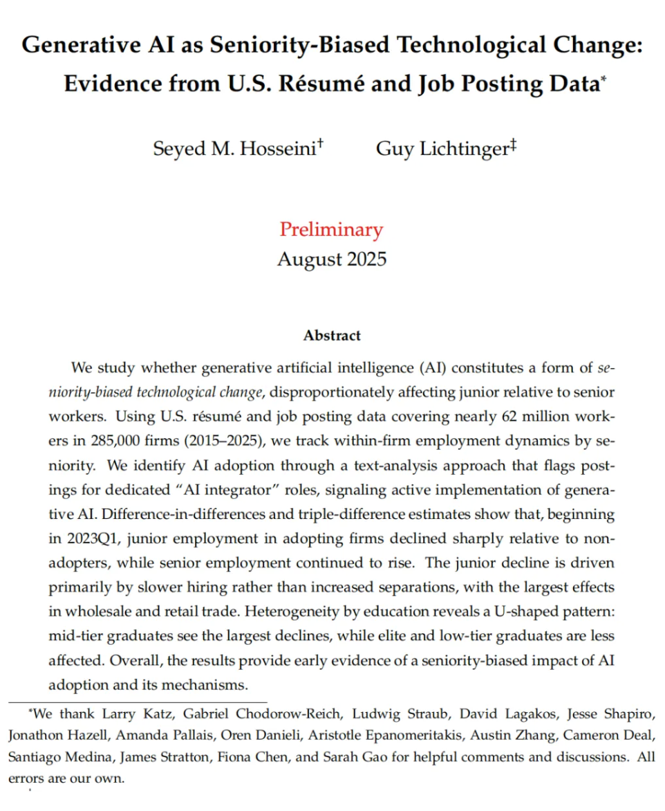
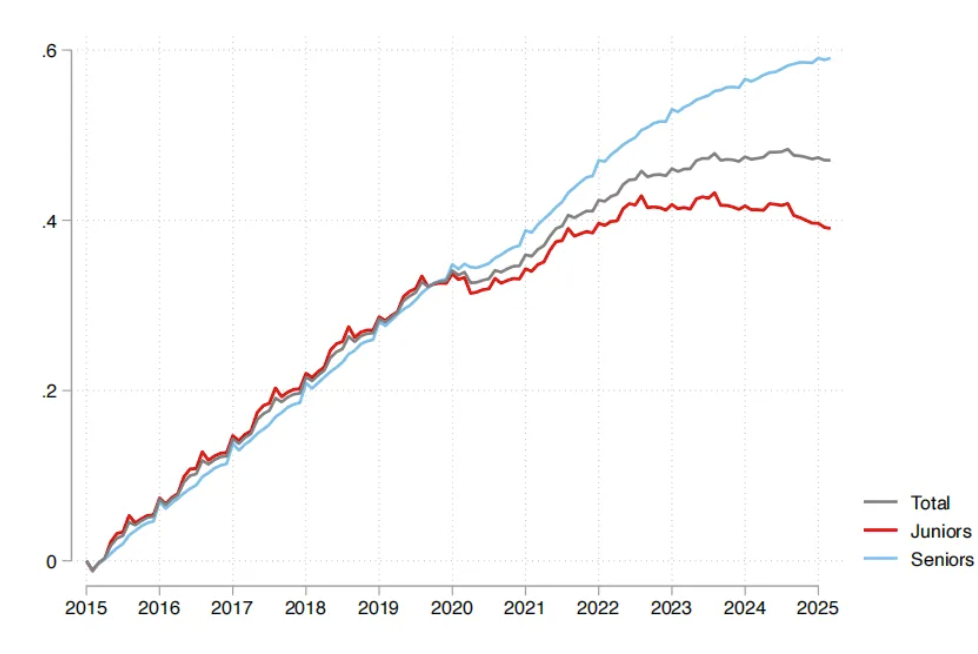
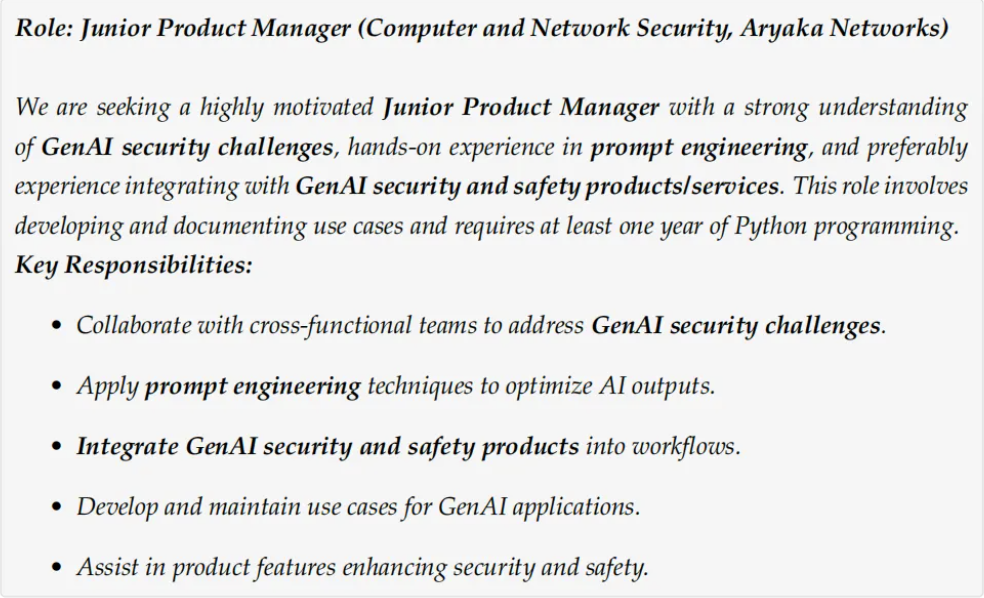
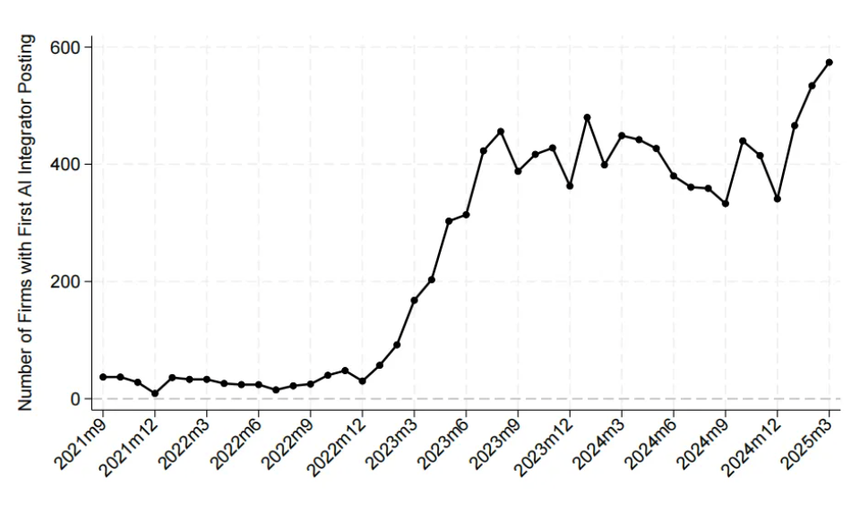
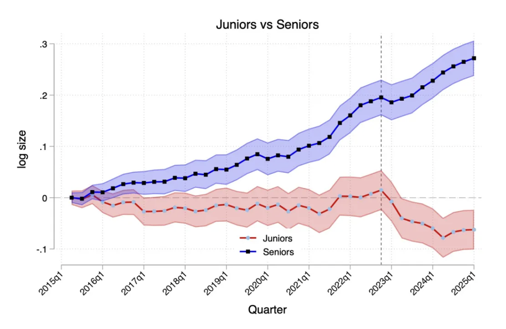
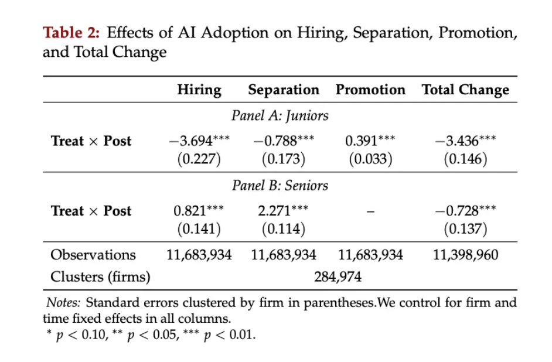
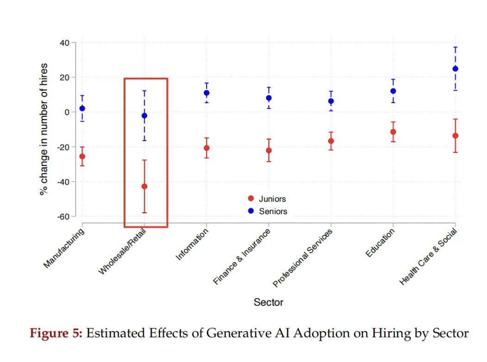
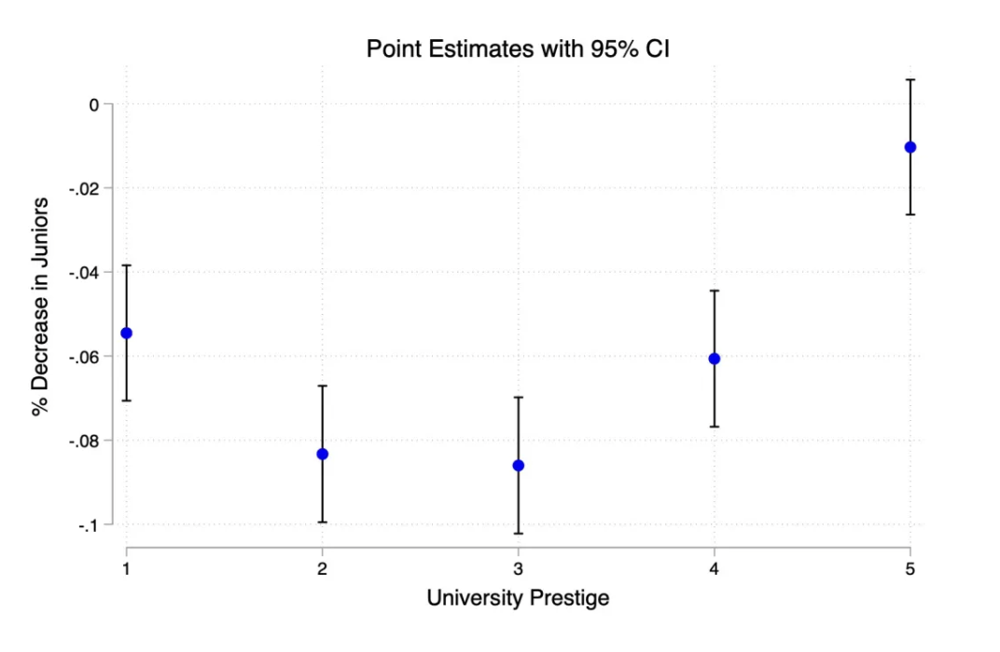

论文指出，在AI爆发后，AI采纳者公司的初级岗位就业人数出现了断崖式的下跌，AI真的在抢初级的工作，而方式并不是裁员而是不再招聘，真正的重灾区行业在批发和零售业，这些行业每季度招聘减少了将近40%。

最近我在Twitter上看到了一篇非常精彩的论文，它全局、真切地研究了AI对工作的冲击。

我看了非常有感触，也分享给卫夕指北的读者。

论文来自哈佛大学，由两位经济学博士生Seyed M. Hosseini和Guy Lichtinger操刀。

而他们的导师是劳动经济学的重量级大咖拉里·卡茨（Larry Katz）。

因此，论文是严谨而有分量滴。

论文没有任何情绪渲染，就是用冰冷、庞大的真实数据，剖析了2023年以来美国就业市场的AI冲击具体是如何发生的——

## 1

作为读研的时候也被写经济学论文折磨过的学术逃兵，在我看来，这篇论文很厉害的地方不是结论。

而是它抽丝剥茧的行文方式：一个问题扣着一个问题，一个结论跟着一个结论——

先来看第一个问题，AI是不是真的在冲击就业市场？

这东西不能靠感觉，经济学研究要的是数据。

两位作者的第一步，就是把美国劳动力市场的数据给搬出来，不是总体数据，而是几乎是全量的原始数据。

他们拿到了一个非常牛X的数据集（不知道怎么搞到的，差不多相当于Boss直聘的后台全部数据），来自一家叫Revelio Labs的公司基于LinkedIn的招聘信息收集。

这个数据集包括285,000家招聘的公司，覆盖6200万打工人的简历，超过1.5亿次的招聘记录。

美国总共也就3.4亿人，所以，除掉老人和小孩，真正工作的人很大比例其实都包括在这个数据集里了。

结果一出来，一个清晰的剪刀差出现了——

从2015年到2022年中，研究的目标公司数据集中，初级岗位（Junior-level）和高级岗位（Senior-level）的就业增长曲线，基本上是手拉手一起走的。

但从2022年中开始，风云突变，高级岗位的就业人数还在昂首向上，而初级岗位的增长开始停滞，到了2023年中，甚至掉头向下了。 

两条线从此分道扬镳，一个往上，一个往下。

这就有意思了。

整个经济大环境没出大问题，为什么偏偏是年轻人的饭碗、入门级的工作，突然就不香了？

会不会是AI的原因呢，毕竟，ChatGPT是在2022年底发布的，正好和这个剪刀差出现的时间点完美契合。

## 2

那怎么证明呢？

转折发生的时间点和AI出现的时间点差不多，这叫相关性，不叫因果性。

万一是别的因素呢？比如经济不确定性，或者疫情后的结构调整？

要锁定原因就是AI，得找到更直接的证据。

这篇文章设计了一个非常巧妙的策略，他们用了一个叫做DiD的方法（Difference-in-Differences, DiD）的方法。

简单地说，就是要应用AB测试的方法，找到找到用AI和没用AI的的两组公司。

但问题是，一家公司用没用AI，如何确定？

总不能挨家挨户去问CEO吧？就算你问了，他说的也未必是实话。

两位作者想出了一个极其聪明的办法——

他们不去问你用没用AI，而是去看你招不招一类特定的人。

这类人，他们称之为“AI Integrator”。

什么意思？

就是其他都是假的，但招聘数据骗不了人：

如果一家公司招聘岗位描述和工作职责描述中有LLM、Prompt Engineer、GenAI等和大模型生成式AI相关的内容，那说明这家公司是真的在用AI搞生产力了。

这样的公司有多少呢？

作者在全量数据集中找出了10.6 万家，约占所有公司比例为3.7%，且从 2023 年第一季度开始急剧增加。

于是，使用AI的实验组有了，而其他所有公司，自然就是对照组。

## 3

两组公司一分好，好戏就开场了

作者们对比了这两组公司在2023年第一季度（也就是AI爆发后）前后的初级岗位招聘数量变化，结果令人震惊——

在AI爆发后，AI采纳者公司的初级岗位就业人数，相对于对照组公司，出现了断崖式的下跌。

在AI扩散的六个季度后，这个差距拉大到了7.7%。

与此同时，高级岗位的就业在这两组公司里并没有出现这种差异，甚至AI采纳者公司的高级岗位增长还更强劲。

到这里，证据链就非常完整了——

在同一个经济环境里，那些深度拥抱AI的公司，恰恰就是那些对年轻人关上大门的公司。

AI真的在抢初级的工作。

## 4

接下来的问题是——AI到底是如何抢工作的？

是把人都裁了，还是有别的方式？

论文的数据再次给出了一个出乎意料、甚至让人后背发凉的答案——

作者们把公司的人员变动拆解成三个部分：新招聘（Hires）、离职（Separations）和内部晋升（Promotions）。

他们的数据发现，AI采纳者公司里初级岗位的急剧萎缩，主要原因并不是离职率的上升。

也就是说，公司并没有因为用了AI，就把现有的大批初级员工给裁掉。

那人是怎么变少的呢？

答案是：不再招聘了。

数据显示，与对照组相比，AI采纳者公司在2023年第一季度后，平均每个季度少招了3.7个初级员工。 

对于那些本来招聘规模就大的AI公司，这个数字意味着初级岗位的招聘量暴跌了大约22%。

这是一个更隐蔽、成本更低的替代过程。

毕竟，裁员的补偿成本、沟通成本和PR成本确实不小，不招了就没这个问题。

这其实和我的体感也是相吻合的，我和很多前同事聊天，他们也感叹这两年初级岗位新增的确招的少了。

老的初级员工可能会晋升，或者自然流失，但新的年轻人，对不起，没有你的位置了。

这就像温水煮青蛙，你不会看到大规模的裁员新闻，但就业市场正在对初级岗位的年轻人关闭。

这是一个非常残酷的现实，他们职业第一级阶梯，正在被慢慢抽掉。

## 5

那是不是所有行业都呈现同样的特征呢，还是不同行业的程度不同。

论文数据显示，这种对初级岗位的压缩效应，在所有行业都普遍存在，但程度不同。

你可能以为受冲击最大的是互联网、软件、设计这些行业。

没错，这些的确受到了很大的影响，但真正的重灾区是批发和零售业。

在这个行业里，拥抱AI的公司，其初级岗位的招聘数量比不拥抱AI的公司，每季度减少了将近40%。

这非常符合直觉，因为批发零售业大量的初级岗位，都和文员、客服、导购等简单任务相关，而这些恰恰是AI最擅长替代的领域。

## 6

论文最后还观察了一个问题：在AI面前，我的名校学历能保护我吗？

这是最后一个，也是最扎心的一个问题。

两位作者做了一个非常精彩的分析，他们把员工毕业的大学分成了五个等级（Tier 1-5），从最顶尖的精英名校（如哈佛、斯坦福）到比较普通的地区性大学。

然后，他们观察了来自不同等级学校的初级员工，在AI采纳者公司里的就业变化情况。

结果呈现出一条清晰的“U型曲线”——

-   曲线的一端：来自最顶尖名校（Tier 1）的毕业生，受到的负面影响相对较小。
    

-   曲线的另一端：来自最普通大学（Tier 5）的毕业生，受到的影响也非常小，甚至在统计上不显著。
    

-   曲线的底部：遭受打击最沉重的，是那些来自中上等大学（Tier 2和Tier 3）的毕业生， 也就是那些很不错，但又不是最顶尖的学校的毕业生。
    

为什么会这样？

论文给出的解释是，这背后是一个关于性价比的问题——

对于公司来说，顶尖名校的毕业生（Tier 1），虽然成本最高，但他们解决复杂问题的能力也最强，AI很难替代，所以公司愿意继续花大价钱雇佣他们。

最普通大学的毕业生（Tier 5），虽然能力上可能没那么突出，但他们的薪资要求也最低，人力成本优势明显。

最尴尬的就是中间层（Tier 2和Tier 3），他们薪资要求不低，脱不下长衫，但从事的很多工作又恰好落在了AI能替代的区间，高不成、低不就，是最容易被优化掉的一群人。

到此，这论文的所有结论都已经给出——真实、残酷、逻辑严密。

## 7

好了，论文讲完了，回到开头的问题：这篇如手术刀一般的论文，对我们每个普通人，到底有什么启示？

我在看来，一个最残酷的现实就是——如果你一直只能干初级的活，那么你真的危险了

没错，曾经熟悉的、一级一级向上攀登的职业阶梯，其底部正在被AI迅速抽走。

同志们，不能再按部就班了！

怎么办？

我想来想去，列了下面三个点——

1.  **尽快完成原始积累，向上跃迁。**
    

你必须狂奔，因为AI在极速地追。

你必须迅速摆脱初级状态，成长能独立抗事的老兵。

你需要有意识地、主动地承担那些复杂任务，不要沉迷于那些能让你舒适地完成的简单工作。

那是温室，也正是AI的领地。

你的目标是，在最短的时间内，让你的工作内容中，AI不可替代的部分超过50%。

2.  **思考什么是你的暗知识和元技能。**
    

我之前说过一句话——“这一轮AI冲击，在任何一个领域，并不是“知道What的人被颠覆，知道How的人被放大”，而是“知道How的人被颠覆，知道Why的人被放大”。

对于公共知识，今天的AI已经满级了，而我们的一个优势是“暗知识”。

什么是暗知识？

我的定义是——只有你才能提供上下文的知识，所以思考一下，在你的具体工作中，你能独特定义的上下文是什么？

这个问题极其关键。

3.  **向你的兴趣要ROI。**
    

品位、审美、幽默感这种以前被认为没太多直接用的东西重要性在极速提高，它似乎是今天AI暂时还触达不到的区域。

同理心、共情能力、感染力、领导力这些在过去被视为加分项的技能，现在正迅速成为必需品。

所以，千万不要忽视你的兴趣，多问一问自己，有哪些事情不给你钱你也乐在其中的事，那个边缘的角落或许是你未来竞争力的重要来源。

李继刚最近关于“体力、脑力、心力”的提法很有意思，而兴趣其实是你心力的重要来源。

试一试将兴趣和AI碰撞一下，或许你会有新的发现。

## 结语

“AI对就业市场的潜在影响是'可怕'的（scary）”

谷歌DeepMind CEO Demis Hassabis这句话并非耸人听闻。

但这位老哥也同时说了另一句话——

“AI会让'激进富裕'（Radical Abundance）的时代到来。”

如何确保在前者向后者推进的过程中不被时代抛弃，是我们每个人都要严肃思考的命题。

本文来源：[卫夕指北](https://mp.weixin.qq.com/s?__biz=MzU1NjEzNjk1Mw==&mid=2247487885&idx=1&sn=15f316b1fe09bbf94767ac5d8ca00663&chksm=faffd50f095449d1f9ab7e1f152888fe1a71d716cbfee7914c903af8aa92b8704c577d5ab0d9&mpshare=1&scene=23&srcid=0917PCwmnoEddB4mm6nS5QdQ&sharer_shareinfo=4ad2d0112139014913b1f98da11b5d80&sharer_shareinfo_first=4ad2d0112139014913b1f98da11b5d80#rd)，原文标题：《真实、残酷的AI就业冲击——从一篇极其精彩的哈佛论文聊起》

风险提示及免责条款

市场有风险，投资需谨慎。本文不构成个人投资建议，也未考虑到个别用户特殊的投资目标、财务状况或需要。用户应考虑本文中的任何意见、观点或结论是否符合其特定状况。据此投资，责任自负。
