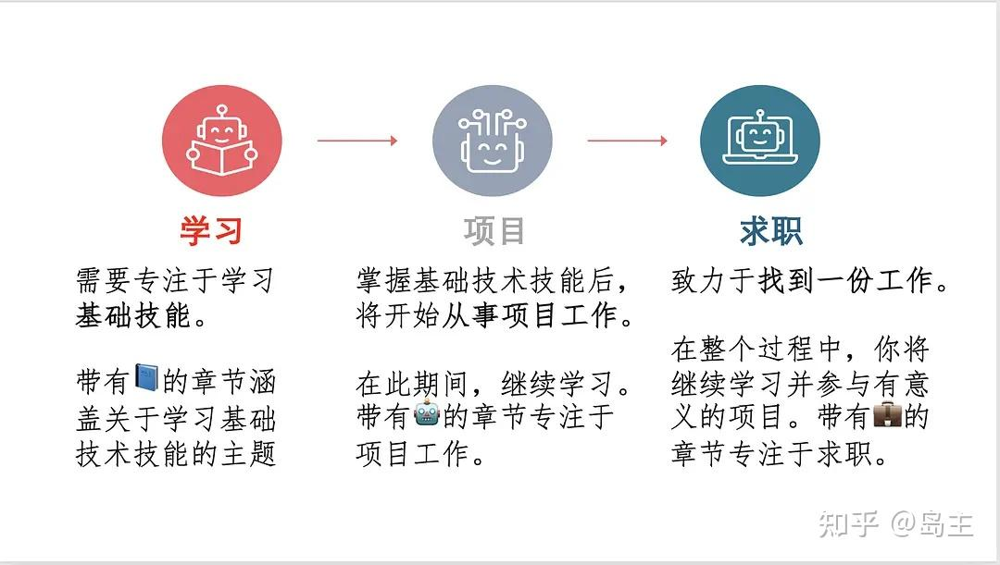
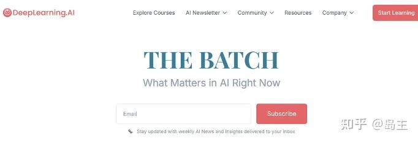

> 说明：本文内容源自deeplearning.ai最新发布的《How to Build Your Career in AI》电子PDF，我使用GPT进行翻译、校对，最后以遵循原文表意、我本人中文流畅阅读习惯表达为原则进行润色修改。与想从事AI行业的朋友分享。

摘要：吴恩达在全文中回答了一些问题，

第一章：职业生涯发展的步骤有三：学习、做项目、找工作

第二章：学习人工智能核心要学习的技能是：机器学习、深度学习、数学、软件开发；第三章：如果要学数学，从目标出发；

第四章：找一个AI项目的方法与步骤：从业务出发而非AI，方案、评估、里程碑与指标、资源；

第五章：没有项目，怎么开始？加入他人的项目、找人聊、关注垂直领域、做副业；想清楚再做，还是小步试错？

第六章：如何处理项目组合；

第七章：换岗、换行的处理方法；第八章：利用非正式访谈找到合适的工作；第九章：找工作的细节和路径；

第十章：成功的关键；第十一章：克服冒名顶替综合症。

### 如何在人工智能领域建立你的职业生涯

人工智能是新的电力，将改变和改善人类生活的各个领域。——吴恩达(Andrew Ng)，DeepLearning.AI 创始人

### 引言：AI编程是新的读写能力

希望有一天，人们可以像阅读与写作一样自然地掌握编程，特别在人工智能（AI）领域。

几百年前，社会并不普遍认为语言读写能力是必需的。少数人学会了阅读和写作，其他人依靠少数人去阅读和写作。经由几个世纪，人类的读写能力才传播扩散开来，直至现今的普及程度。

语言让人与人之间得以深入交流，而代码是人与机器之间最深层次的交流方式。随着机器在日常生活中越来越核心，人机交流（编程）也愈发重要。

传统软件工程（编写程序），主要路径是让计算机明确执行一系列步骤。许多编程课程的教学案例，都是使用做一个视频游戏或者搭建一个网站。但是，人工智能、机器学习与数据科学提供了计算机从数据中提取知识的新范式。而这些技术的发展为编程提供了更好的路径。

许多个周日，我会去家附近的比萨店买一块比萨。除非兴趣使然，披萨柜台后面的工作人员几乎没有理由去学习制作视频游戏或编写自己的网站软件。但人工智能和数据科学对披萨店老板有很大价值。例如，[线性回归](https://zhida.zhihu.com/search?content_id=252631982&content_type=Article&match_order=1&q=%E7%BA%BF%E6%80%A7%E5%9B%9E%E5%BD%92&zhida_source=entity)模型可以更好地估计需求、优化餐厅的人员配备和供应链。老板可以更好地预测夏威夷披萨的销量。从而提前制作更多的夏威夷披萨，减少顾客的等待时间。

几乎任何产生数据的场景，都可以应用人工智能与数据科学。因此，各类职业对定制AI应用与数据洞察的需求将超过传统的软件工程需求。这使得具备AI编程能力比传统编程技能更有价值。AI编程可以帮助无数人利用数据丰富自己的生活。我希望，与传统软件开发相比，构建基本AI应用程序的前景能激励人们学习编程。如果社会能像接受读写能力那样接受这种新形式的“读写能力”，我们都将从中受益。

### 第一章：职业生涯发展的三个步骤

AI的迅速发展带来大量工作机会，许多人正踌躇满志地投身于新领域。职业生涯是一段几十年的旅程，多年来，我有幸见证了成千上万的学生，以及各大公司中工程师们在AI领域的职业发展历程。以下是一个帮助你规划自己职业道路的框架。职业发展的三个关键步骤是学习基础技能、参与项目（以加深你的技能、建立作品集并创造影响力）、以及找到一份工作。这些步骤层层相叠：

学习、项目、求职阶段适用于各种职业，但人工智能有其特殊之处。例如：

学习基础技能是一个贯穿职业生涯的过程人工智能还处于起步阶段，许多技术仍在发展。机器学习和深度学习的基础正在逐渐成熟，学习课程可以高效地掌握基础知识，但在此基础之上，紧跟技术的变化在人工智能领域比在更成熟的领域更加重要。

从事项目工作通常意味着与缺乏人工智能专业知识的利益相关者合作 找到合适的项目、估算项目的完成时间和投资回报、设定合理的期望变得颇具挑战。此外，AI项目的高度迭代性会给项目管理带来特殊挑战：当你不知道需要多长时间才能达到目标时，该如何制定构建系统的计划？即使系统达到了预期目标，也可能需要进一步迭代来解决部署后的偏移问题。

> “部署后的偏移”（post-deployment drift）通常指的是模型在实际应用中的表现逐渐偏离训练时的效果。这种偏移并不是简单的动作变形或不符合预期，而是由于环境、数据或用户行为的变化，导致模型的预测效果随时间推移而逐渐下降。

对人工智能技能和职位角色的看法不一致与其他行业相比，AI领域求职有同有异。许多公司仍在摸索他们需要哪些AI技能，以及如何招聘具备这些技能的人。面试官见过的项目与你所做的项目可能有很大差异，因此你需要向潜在雇主解释你工作中的一些内容。在学习、项目与求职中，你都应建立一个支持性的社区。拥有朋友，彼此支持互助，会让这条路走得更顺畅。无论新手还是资深人士，都需要社区支持。

### 第二章：学习建构人工智能职业生涯的关键技能

在上一章中，我介绍了在人工智能领域建立职业生涯的三个关键步骤：学习基础技术技能，参与项目，以及找到一份工作，并强调了社区支持的重要性。在第二章中，我想更深入地探讨第一步：学习基础技能。人工智能领域的研究论文太多，一生也无法全部读完。我认为，选择学习的主题至关重要。对于机器学习技术相关的职业而言，重要的主题如下：

1.  基础机器学习技能：例如，理解线性回归、[逻辑回归](https://zhida.zhihu.com/search?content_id=252631982&content_type=Article&match_order=1&q=%E9%80%BB%E8%BE%91%E5%9B%9E%E5%BD%92&zhida_source=entity)、[神经网络](https://zhida.zhihu.com/search?content_id=252631982&content_type=Article&match_order=1&q=%E7%A5%9E%E7%BB%8F%E7%BD%91%E7%BB%9C&zhida_source=entity)、[决策树](https://zhida.zhihu.com/search?content_id=252631982&content_type=Article&match_order=1&q=%E5%86%B3%E7%AD%96%E6%A0%91&zhida_source=entity)、[聚类](https://zhida.zhihu.com/search?content_id=252631982&content_type=Article&match_order=1&q=%E8%81%9A%E7%B1%BB&zhida_source=entity)和[异常检测](https://zhida.zhihu.com/search?content_id=252631982&content_type=Article&match_order=1&q=%E5%BC%82%E5%B8%B8%E6%A3%80%E6%B5%8B&zhida_source=entity)等模型非常重要。除了特定模型之外，更重要的是理解机器学习的工作原理及其背后的原因，例如[偏差/方差](https://zhida.zhihu.com/search?content_id=252631982&content_type=Article&match_order=1&q=%E5%81%8F%E5%B7%AE%2F%E6%96%B9%E5%B7%AE&zhida_source=entity)、[成本函数](https://zhida.zhihu.com/search?content_id=252631982&content_type=Article&match_order=1&q=%E6%88%90%E6%9C%AC%E5%87%BD%E6%95%B0&zhida_source=entity)、[正则化](https://zhida.zhihu.com/search?content_id=252631982&content_type=Article&match_order=1&q=%E6%AD%A3%E5%88%99%E5%8C%96&zhida_source=entity)、[优化算法](https://zhida.zhihu.com/search?content_id=252631982&content_type=Article&match_order=1&q=%E4%BC%98%E5%8C%96%E7%AE%97%E6%B3%95&zhida_source=entity)和[误差分析](https://zhida.zhihu.com/search?content_id=252631982&content_type=Article&match_order=1&q=%E8%AF%AF%E5%B7%AE%E5%88%86%E6%9E%90&zhida_source=entity)。  
    
2.  深度学习：深度学习在机器学习领域所占的比重很大，如果不了解，很难在AI领域取得卓越成就！理解神经网络的基本知识、掌握使其有效工作的技能（如超参数调整）、并学习[卷积网络](https://zhida.zhihu.com/search?content_id=252631982&content_type=Article&match_order=1&q=%E5%8D%B7%E7%A7%AF%E7%BD%91%E7%BB%9C&zhida_source=entity)、[序列模型](https://zhida.zhihu.com/search?content_id=252631982&content_type=Article&match_order=1&q=%E5%BA%8F%E5%88%97%E6%A8%A1%E5%9E%8B&zhida_source=entity)和[变压器](https://zhida.zhihu.com/search?content_id=252631982&content_type=Article&match_order=1&q=%E5%8F%98%E5%8E%8B%E5%99%A8&zhida_source=entity)，非常有价值。  
    
3.  与机器学习相关的数学：关键领域包括[线性代数](https://zhida.zhihu.com/search?content_id=252631982&content_type=Article&match_order=1&q=%E7%BA%BF%E6%80%A7%E4%BB%A3%E6%95%B0&zhida_source=entity)（向量、矩阵及其各种操作）以及[概率和统计](https://zhida.zhihu.com/search?content_id=252631982&content_type=Article&match_order=1&q=%E6%A6%82%E7%8E%87%E5%92%8C%E7%BB%9F%E8%AE%A1&zhida_source=entity)（包括离散和连续概率、标准概率分布、独立性、贝叶斯定理等基本规则，以及假设检验）。此外，探索性数据分析（EDA），即使用可视化和其他方法系统地探索数据集，是一种被低估的技能。我发现 EDA 在数据驱动的 AI 开发中尤其有用，因为通过分析错误和获得见解，确实可以推动项目进展！最后，对微积分的直观理解也有所帮助。机器学习所需的数学知识一直在演变。例如，虽然某些任务依然需要微积分，但改进后的[自动微分软件](https://zhida.zhihu.com/search?content_id=252631982&content_type=Article&match_order=1&q=%E8%87%AA%E5%8A%A8%E5%BE%AE%E5%88%86%E8%BD%AF%E4%BB%B6&zhida_source=entity)使得无需手动计算微积分即可设计并实现新的神经网络架构，而这在十年前几乎是不可想象的。  
    
4.  软件开发：仅凭机器学习建模技能即可找到工作并作出贡献，但若能编写优质的软件来实现复杂的AI系统，将显著提升你的就业机会。这些技能包括编程基础、数据结构（特别是与机器学习相关的数据帧）、算法（包括与数据库和数据操作相关的算法）、软件设计、熟悉 Python、熟悉 TensorFlow 或 PyTorch 等关键库以及 scikit-learn。  
    

有很多东西要学习！即使你掌握了这份清单上的所有内容，我也希望你能继续学习，不断深化技术知识。

我认识很多机器学习工程师，他们在自然语言处理或计算机视觉等应用领域或概率图模型或构建可扩展软件系统等技术领域掌握了更深层次的技能，从中受益匪浅。

如何获得这些技能？互联网上有大量优质内容，从理论上讲，阅读大量网页可能有效。但是，如果目标是深入理解，那么阅读互不关联的网页效率低下，因为它们往往重复彼此的内容，使用不一致的术语（这会减慢你的阅读速度），质量参差不齐，而且留有空白。

这就是为什么一个好的课程（将大量材料组织成连贯和合乎逻辑的形式）通常是掌握有意义的知识体的最佳方式。当你吸收了课程中提供的知识后，你可以转向研究论文和其他资源。

最后，没有人能在一个周末甚至一个月的时间里掌握他们需要知道的一切。

我认识的所有擅长机器学习的人都是终身学习者。AI发展日新月异，唯有持续学习，才能跟得上。如何才能多年保持稳定的学习进度？如果你能养成每周学习一点点的习惯，你就轻而易举地取得重大进展。

培养新习惯的最佳方法

我最喜欢的书之一是B.J.福格写的《福格行为模型》。

福格解释说，建立新习惯的最好方法是从小处入手，逐步取得成效，避免因设下过高的目标导致失败。

例如，他建议不要试图每天锻炼 30 分钟，而要立志做一个俯卧撑，并坚持下去。对于那些想要花更多时间学习的人来说，这种方法可能有所帮助。

如果你从每天观看 10 秒的教育视频开始，并坚持下去，那么每天学习的习惯就会自然而然地养成。即使在 10 秒内学不到任何东西，你也在建立每天学习的习惯。有时候，你可能会学习一个小时或更长时间。

### 第三章：你应该学习数学来获得人工智能的工作吗？

要成为一名机器学习工程师，需要掌握多少数学知识？数学是人工智能的基础技能吗？ 了解更多的数学总是件好事！但是要学的东西太多了，所以现实地讲，有必要分清轻重缓急。以下是你可能用来加强数学背景的方法。

为了确定什么是重要的知识，我认为有用的方式是问问自己，为了完成你想要从事的工作所需的决策，你需要知道些什么。在 DeepLearning.AI，我们经常问：“为了实现目标，人们需要了解什么？”这个目标可能是构建机器学习模型、设计系统架构，或者通过一场求职面试。理解所用算法背后的数学原理通常很有帮助，因为它能够帮助你调试算法。不过，有用的知识深度会随着时间变化。随着机器学习技术的成熟，变得更可靠和即用，更少的试调，因此简单理解涉及的数学原理即可。

例如，在机器学习的早期阶段，用于解线性方程组（如线性回归）的线性代数库还不够成熟。当时我需要理解这些库的工作原理，以便在不同的库之间做出选择并避免数值舍入误差的问题。然而，随着数值线性代数库的逐渐成熟，这一方面的重要性也逐渐降低。深度学习仍然是一项新兴技术，因此，当你训练一个神经网络并发现优化算法难以收敛时，了解梯度下降、动量和 Adam 优化算法背后的数学原理将帮助你做出更好的决策。同样地，如果你的神经网络出现异常表现——比如它对某种分辨率的图像预测效果不佳，但对其他分辨率却表现良好——理解神经网络架构背后的数学原理能让你更有把握找到解决方案。

当然，我也鼓励由好奇心驱动的学习。如果你对某件事感兴趣，那就去学习吧，不必考虑它是否最终会有实际用途！或许这会引发创造性的灵感或带来技术上的突破。

### 第四章：成功 AI 项目的范围

人工智能架构师最重要的技能之一就是能够识别出值得开展的想法。接下来的几章将讨论如何寻找和处理项目，积累经验、建立自己的作品集。 多年来，我在制造业、医疗保健、气候变化、农业、电子商务、广告等行业应用机器学习，并从中获益。那么，跨行业如何开展呢？以下是帮助你确定项目范围的五个步骤。

步骤 1、确定业务问题（而不是人工智能问题）。我喜欢找到一个领域专家并问：“你最希望哪三件事情能做得更好？为什么它们还没有起作用？”例如，如果你想将人工智能应用于气候变化，你可能会发现电网运营商无法准确预测间歇性能源（如风能和太阳能）未来可能产生的电力。

步骤 2、头脑风暴 AI 解决方案。当我年轻的时候，我常常直接执行第一个让我兴奋的想法。有时这样做还行，但有时会错过了一个可能不需要更多努力就能构建的更好想法。一旦你理解了一个问题，就可以更高效地进行潜在解决方案的头脑风暴。例如，为了预测间歇性能源的发电量，我们可能会考虑使用卫星图像更准确地绘制风力涡轮机的位置、使用卫星图像估计风力涡轮机的高度和发电能力，或者使用天气数据更好地预测云层覆盖及其对太阳辐射的影响。有时，可能没有好的 AI 解决方案，这也没关系。

步骤 3、评估潜在解决方案的可行性和价值。你可以通过查看已发表的研究、竞争对手的做法，或者构建一个快速的概念验证实现来确定一种方法是否在技术上可行。你可以通过咨询领域专家（例如电网运营商，他们可以就上述潜在解决方案的实用性提供建议）来确定其价值。

步骤 4、确定里程碑。一旦你认为一个项目具有足够的价值，下一步就是确定要追求的指标。这既包括机器学习指标（如准确性），也包括业务指标（如收入）。机器学习团队通常最熟悉的是学习算法可以优化的指标。但我们可能需要跳出自己的舒适区，提出一些与用户参与度、收入等相关的业务指标。不幸的是，并非所有业务问题都可以简化为优化测试集的准确性！如果你无法确定合理的里程碑，这可能表明你需要更多地了解这个问题。一个快速的概念验证可以帮助提供缺失的视角。

步骤 5、预算资源。仔细考虑完成项目所需的一切，包括数据、人员、时间，以及你可能需要的其他团队的支持。例如，如果你需要资金购买卫星图像，确保在预算中包含这笔钱。在项目上工作是一个迭代的过程。如果在任何一步中你发现当前的方向不可行，请回到上一步，并按照你的新理解继续进行。是否有哪个领域让你感到兴奋，人工智能可能在其中发挥作用？我希望这些步骤能指导你通过项目工作来探索它——即使你在该领域尚未拥有深厚的专业知识。人工智能不会解决所有问题，但作为一个社区，让我们寻找方法，尽可能地产生积极影响。

### 第五章：寻找与您的职业目标互补的项目

不言而喻，我们只应该从事对人类负责任、合乎道德和有益的项目。但这些限制留下了大量可供选择的项目。在前一章中，我写了如何识别和确定人工智能项目的范围。本章和下一章的重点略有不同：挑选和执行着眼于职业发展的项目。

成功的职业生涯将包括许多项目，希望随着时间的推移，项目的范围、复杂性和影响力都会增加。因此，可以从小处着手。利用早期的项目来学习，随着技能的增长逐渐承担更大的项目。

当你初出茅庐时，不要指望别人会把伟大的想法或资源拱手送给你。很多人都是从利用业余时间做小项目开始的。当你取得初步的成功——即使只是小成功——时，你不断增长的技能会提高你提出更好想法的能力，而且更容易说服别人帮助你承担更大的项目。

如果你没有任何项目想法怎么办？以下是几个产生想法的方法：

✓ 加入现有项目。如果你发现其他人有一个想法，请加入他们的项目。

✓ 继续阅读和与人交谈。每当我花很多时间阅读、上课或与领域专家交谈时，我都会有新的想法。我相信你也会。

✓ 关注一个应用领域。许多研究人员正试图推进基础人工智能技术，比如发明下一代变压器或进一步扩展语言模型，因此，虽然这是一个令人兴奋的方向，但也非常困难。但是，机器学习尚未应用到的应用领域是多种多样的！我很幸运能够将神经网络应用于从自主直升机飞行到在线广告的各个领域，部分原因是我跳进这些应用领域时，研究这些应用的人还相对较少。如果你的公司或学校关心某个特定应用，那就探索一下机器学习的可能性。这可以让你先睹为快，了解一个具有潜在创造性的应用，一个你可以做别人没做过的独特工作的应用。

✓ 发展一个副业。即使你有全职工作，一个有趣的项目，可能会或可能不会发展成更大的东西，可以激发创造力，并加强与合作者的联系。当我还是一名全职教授时，从事在线教育不是我的“工作”（我的工作是研究和教授课程）的一部分。这是一个有趣的爱好，我经常出于对教育的热情而从事这项工作。我在家录制视频的早期经历，帮助我后来以更实质性的方式从事在线教育工作。硅谷充满了初创企业的故事，这些企业最初是作为副业开始的。只要它不会与你的雇主产生冲突，这些项目可以成为有意义的事情的垫脚石。

给定几个项目想法，你应该选择哪一个？以下是一个快速检查清单，考虑的因素：

✓ 这个项目会帮助你提高技术水平吗？理想情况下，它应该具有足够的挑战性，可以拓展你的技能，但又不会很难，让你几乎没有成功的机会。这将让你走上一条掌握越来越复杂的技术的道路。

✓ 你有好的队友一起工作吗？如果没有，有没有可以讨论事情的人？我们从周围的人身上学到了很多，好的合作伙伴会对你的成长产生巨大的影响。

✓ 它能成为一块跳板/起点吗？如果项目成功，其技术复杂性和/或业务影响能否使其成为更大项目的有意义起点？如果项目比您以前从事的项目更大，它很有可能成为这样的起点。

最后，避免分析瘫痪。花一个月时间决定是否从事一个一周可以完成的项目是没有意义的。在你的职业生涯中，你会从事多个项目，所以你有大量机会来完善你对什么是有价值的想法。鉴于人工智能项目的巨大数量，与其采用传统的“准备，瞄准，开火”的方法，你可以采用“准备，开火，瞄准”的方法来加速你的进步。

准备，开火，瞄准

从事项目工作需要就建造什么和如何建造做出艰难的选择。以下是两种截然不同的风格：

✓ 准备，瞄准，开火：仔细计划并认真验证。只有在对一个方向有高度信心时才做出承诺并执行。

✓ 准备、开火、瞄准：投入开发并开始执行。这可以让你快速发现问题，并在必要时进行调整。

假设您为零售商构建了一个客户服务聊天机器人，并认为它也有助于餐厅。您是否应该在开始开发之前花时间研究餐厅市场，慢慢来但降低浪费时间和资源的风险？或者立即开始，快速行动并接受转型或失败的风险？

这两种方法都有各自的支持者，最佳选择取决于具体情况。

“准备，瞄准，开火”在执行成本较高时往往更胜一筹，一项研究可以揭示一个项目可能有多有用或多宝贵。例如，如果你能想出几个其他用例（餐厅、航空公司、电信公司等），并评估这些用例以确定最有前景的一个，那么在确定方向之前花些时间可能是值得的。

“准备、开火、瞄准”，如果你能以低成本执行，并确定方向是否可行，并找出使它奏效的微调，那么它就会更好。例如，如果你能快速构建一个原型来确定用户是否想要该产品，并且如果可以在少量工作后取消或转向是可以接受的，那么就有理由考虑快速进入。当开枪的成本很低时，也有理由开很多枪。在这种情况下，过程实际上是“准备好，开火，瞄准，开火，瞄准，开枪，瞄准，开枪”。

在就项目方向达成一致后，在构建产品中的机器学习模型时，我倾向于“准备，开火，瞄准”。构建模型是一个迭代的过程。对于许多应用来说，训练和进行错误分析的成本并不高。此外，很难进行一项研究，以阐明适当的模型、数据和超参数。因此，快速构建端到端系统并修改它，直到它工作良好是有道理的。

但是，当朝着某个方向前进意味着做出代价高昂的投资或进入一扇单向门（意味着一个难以逆转的决定）时，通常值得花更多时间提前确保这确实是个好主意。

### 第六章：建立能够展示技能进步的项目组合

在职业生涯中，你可能连续从事多个项目，每个项目的范围和复杂性都会增加。例如：

1.  班级项目：前几个项目可能是范围狭窄的家庭作业任务，有预定的正确答案。这些往往是很好的学习经历！  
    
2.  个人项目：你可能会继续从事小规模的项目，无论是单独还是与朋友合作。例如，你可以重新实现一个已知的算法，将机器学习应用于业余爱好（例如预测你最喜欢的运动队是否会获胜），或者在你的业余时间建立一个小型但实用的系统（例如一个基于机器学习的脚本，可以帮助同事自动化一些工作）。参加由Kaggle组织的竞赛也是获得经验的一种方式。  
    
3.  扩大范围与提高复杂性 ：成功一个接一个，为更多的技术增长、更多的资源和越来越重要的项目机会打开了大门。每个项目只是漫长旅程中的一步，希望这一步能产生积极的影响。此外：  
    
4.  不要担心项目太小。我的第一个机器学习研究项目之一是训练一个神经网络，看看它模仿sin(x)函数的效果如何。它不是很有用，但这是一个很好的学习经历，让我能够继续进行更大的项目。  
    
5.  沟通是关键。如果你想让其他人看到你的工作的价值，并相信你可以投资更大的项目，你需要能够解释你的想法。为了启动一个项目，沟通你希望建立的价值将有助于让同事、导师和管理者加入进来，并帮助他们指出你推理中的缺陷。在你完成工作后，清楚地解释你所完成的工作的能力将有助于说服其他人打开通向更大项目的大门。  
    
6.  领导力不只适用于管理者。当你开始参与需要团队合作的大型人工智能项目时，领导项目的能力就会变得更加重要，无论你是否处于正式的领导职位。我的很多朋友都成功地从事技术而非管理方面的职业，他们能够通过运用深刻的技术洞见来帮助指导项目，例如在何时投资于新的技术架构或收集更多某种类型的数据，这让他们成长为领导者，并显著改善了项目。  
    

建立一个项目组合，特别是一个随着时间的推移从简单到复杂的项目组合，在找工作时将大有帮助。

### 第七章、开启人工智能求职的简单框架

找工作有几个可预测的步骤，包括选择你想申请的公司、准备面试，最后选择职位并协商薪资与福利。在这一章中，我想重点介绍一个对许多 AI 求职者有用的框架，特别是那些从其他领域进入 AI 领域的求职者。

如果你正在考虑下一份工作，可以问自己以下几个问题：

✓ 你在转换角色吗？例如，如果你是一名软件工程师、大学生或物理学家，想要成为一名机器学习工程师，这就是角色转换。你在转换行业吗？例如，如果你在一家医疗保健公司、金融服务公司或政府机构工作，想要转到一家软件公司工作，这就是行业转换。在科技初创公司担任产品经理，后来成为同一家或另一家公司的数据科学家，这是角色转换。而在制造公司担任营销人员，后来在科技公司担任营销人员，则是行业转换。而在金融服务公司担任分析师，后成为科技公司中的机器学习工程师，这是角色和行业的双重转换。如果你想找到第一份 AI 相关的工作，通常会发现转换角色或行业中的一个相对容易，而不一定要同时转换两者。假设你是一名金融服务行业的分析师：✓ 如果你找到一份在金融服务领域的数据科学或机器学习的工作，可以在获得 AI 知识和技能的同时继续运用你在该领域的专业知识。在这个岗位工作一段时间后，你会更容易转到科技公司（如果这仍是你的目标）。

✓ 或者，如果你成为科技公司的分析师，虽然你依旧应用分析技能，但会用在不同的行业。在科技公司工作会更容易从同事那里学习 AI 实际应用中的挑战、在 AI 领域取得成功的关键技能等内容。

✓ 如果你想转换角色，创业公司可能比大公司更容易实现。通常创业公司人手不足，无法完成所有工作，因此如果你能够协助完成 AI 任务——即便它不是你的正式职责——你的工作往往会得到认可，为在不离职的情况下进行角色转换铺路。

相较之下，大公司更倾向于通过固定的奖励机制奖励你本职工作，但较少会奖励你的额外贡献。当你在期望的角色和行业（例如在科技公司担任机器学习工程师）工作一段时间后，你对这个行业中的高级职位需求会有更深入的了解，同时也能在行业内建立人脉。未来的求职会更容易，前提是你仍选择继续在此角色和行业发展。换工作时，你是在踏入未知之境，尤其是如果要转换角色或行业时。为了更好地了解新的角色和/或行业，咨询性面谈是一个非常有帮助但未被充分利用的工具。

我将在下一章详细分享这一内容。非常感谢 FourthBrain（DeepLearning.AI 旗下公司）的首席执行官萨尔瓦·努尔·穆罕默德为本章提供的一些想法。

克服不确定性未来存在许多未知数：我们什么时候能治愈阿尔茨海默症？谁将赢得下一次选举？或者，在商业环境中，我们明年会有多少客户？随着世界的不断变化，许多人对未来感到压力，尤其是在求职方面。我有一个习惯，可以帮助我重新获得一种控制感。面对不确定性，我会：

1.  列出一些可能的情景，承认我并不知道哪一种会发生。  
    
2.  为每种情景制定行动计划。  
    
3.  随着未来的发展，定期回顾情景和计划。  
    
4.  开始执行看似合理的行动。  
    

例如，在2020年3月的 COVID-19 大流行期间，我进行了情景规划，设想了快速（三个月）、中等（一年）和缓慢（两年）三种恢复情景，并制定了每种情况下的管理计划。这些计划帮助我优先处理可以实施的事务。同样的方法也适用于个人生活。如果你不确定自己能否通过考试、获得工作机会或签证——这些情况都可能带来压力——你可以写出在每种可能情况下的应对之策。提前考虑各种可能性并坚持执行计划，无论未来如何发展，都可以帮助你更有效地应对。

额外收获如果具备 AI 和统计学知识，还可以为每种情景计算出概率。我非常欣赏“超级预测”的方法，将多位专家的判断整合成概率估计。

### 第八章：使用咨询性面谈找到合适的工作

如果您正准备换岗（例如，首次担任机器学习工程师）或换行（例如，首次在人工智能科技公司工作），您可能对目标工作有许多不熟悉的地方。咨询性面谈是一种很好的学习方法。

咨询性面谈（informational interview）是指找到一个在您想了解的公司或职位中工作的人，非正式地向他们了解他们的工作。这些对话与找工作的目的无关。事实上，在正式开始找工作之前，面试那些职位与您兴趣相符的人会非常有帮助。

咨询性面谈与人工智能领域尤为相关。由于该领域不断发展，许多公司对职位头衔的定义不一致。在一家公司，数据科学家可能主要负责分析业务数据并通过幻灯片展示结论；而在另一家公司，他们可能会编写和维护生产代码。咨询性面谈可以帮助您了解特定公司中人工智能人员的实际工作内容。

随着人工智能领域的迅速扩展，许多人将首次从事人工智能相关的工作。在这种情况下，咨询性面谈对了解工作的实际情况以及做好这项工作所需的技能非常有帮助。例如，您可以了解一家公司使用的算法、部署流程和软件架构。如果您不熟悉数据驱动的人工智能流程，您可能会惊讶地发现，大多数机器学习工程师需要花费大量时间反复清理数据集。

在进行咨询性面谈前，提前研究面试者和公司，以便带着深思熟虑的问题参加面试。您可以问以下问题：

-   您通常一周或一天的工作内容是什么？  
    
-   这个职位最重要的任务是什么？  
    
-   成功最需要哪些技能？  
    
-   您的团队如何合作以实现目标？  
    
-   招聘流程是什么？  
    
-   对于过去表现突出的候选人，他们脱颖而出的原因是什么？  
    

找到愿意接受访谈的人并不总是容易的，但现在许多身居高位的人在进入这个领域时曾获得过前辈的帮助，他们中许多人也愿意以同样的方式帮助后来者。如果您能联系到已经在您社交圈中的人——例如在您之前转行的朋友，或与您同校的校友——那就再好不过了！类似于 Pie & AI 的聚会也能帮助您扩展社交圈。

最后，请保持礼貌和专业，感谢您采访的人。当有机会时，请将这种帮助传递下去，帮助在您之后的新人。如果您收到来自 DeepLearning.AI 社区中某人的访谈请求，我希望您能帮助他们迈出新的一步！如果您想了解更多关于访谈的信息，我推荐阅读加州大学伯克利分校职业中心的文章。

我多次提到人脉和社区的重要性。您遇到的人除了可以提供有价值的信息外，还可能通过推荐您给潜在雇主为您带来不可估量的机会。

### 第九章：找到适合你的AI工作

在本章中，我想讨论一些找工作的细节。典型的求职过程有迹可循：通过在线搜索或与朋友交谈，了解研究角色和公司。如果合适，可以安排非正式的访谈，与对你感兴趣的公司的人交谈。要么直接申请，要么内推。接受邀请公司的面试。收到一个或多个工作邀请，并选择一个。或者，如果你没有收到工作邀请，请向面试官、HR、论坛/社区或任何能帮助你规划下一步的人寻求反馈。虽然这个过程可能很熟悉，但每一次求职都是不同的。以下是一些提示，可以增加你找到一个支持你蓬勃发展的职业生涯并使你不断成长的机会。

**注意基本要素。** 一份引人注目的简历、一系列技术项目以及出色的面试表现将为你打开大门。即使你获得了公司某人的推荐，简历和作品集仍然是你与许多尚不认识你的人建立联系的第一步。更新你的简历，并确保它清晰地呈现了与你目标职位相关的教育和工作经历。针对每一家公司，调整你的沟通方式，解释你为何是合适人选。面试前，询问招聘人员对你的期望。花时间回顾并练习回答常见面试问题，复习关键技能，学习技术材料，确保它们在你脑中鲜活起来。之后，做笔记来帮助你记住说过的话。

**要尊重和负责任。** 带着双赢的心态去面试和谈判。在社交媒体上，愤怒比理性传播得更快，因此一个关于雇主付薪过低的故事会被放大，而一个关于雇主公平对待员工的故事则不会。绝大多数雇主都是道德和公平的，所以不要让一小部分受虐待员工的故事左右你的做法。如果你要离开一份工作，请优雅地退出。给你的雇主充足的通知，在最后的工作时间里全力以赴，尽你所能完成未完成的工作，以一种尊重你所承担责任的方式离开。

**选择与谁共事。** 由于你要参与的项目，你很容易选择一个职位。但是，与你共事的团队成员至少同等重要。我们周围的人会影响我们，因此你的同事将产生重大影响。例如，如果你的朋友吸烟，那么你也吸烟的可能性就会增加。我不知道有哪项研究显示了这一点，但我相信，如果大多数同事努力工作，不断学习，并建立造福所有人的人工智能，那么你很可能也会这样做。（顺便说一句，一些大公司不会告诉你你的团队成员是谁，直到你接受了工作邀请。在这种情况下，坚决要努力去确定并与潜在的团队成员交谈。严格的政策可能会让你无法适应，但在我看来，这增加了接受工作邀请的风险，因为它增加了你最终与不适合的经理或团队成员共事的可能性。）

**从你的社区获得帮助。** 在我们的职业生涯中，大多数人只进行过少数几次求职，因此我们很少有机会好好练习。然而，总体而言，你周围的人可能有丰富的经验。不要羞于向他们求助。朋友和同事可以提供建议，分享内部知识，并把你介绍给可能会有所帮助的人。当我申请第一个教职职位时，我得到了许多支持我的朋友和导师的帮助，他们给我的很多建议都非常有用。

我知道找工作的过程可能会让人感到畏惧。与其将其视为一次巨大的飞跃，不如考虑循序渐进的方式。首先确定可能的角色，并进行少量访谈。如果这些谈话告诉你，在你准备好申请之前还有更多学习要做，那就太好了！至少你有一个清晰的前进路径。任何旅程中最重要的是迈出第一步，而这一步可以很小。

### 第十章：在人工智能领域建立事业的关键

在人工智能领域取得职业成功的道路比我在一本简短的电子书中所能涵盖的内容要复杂得多。希望前面的章节能给你前进的动力。在规划成功之路时，请考虑以下几点：

1.  团队合作：当我们处理大型项目时，通过团队工作比单独工作更成功。与他人合作、影响和被他人影响的能力至关重要。因此，人际交往和沟通技巧真的很重要。（顺便说一句，我以前是个很差的沟通者。）  
    
2.  社交网络：我讨厌社交！作为一个内向的人，不得不去参加聚会，强颜欢笑，尽可能多地与人握手，这是一件可怕的事情。我宁愿呆在家里看书。尽管如此，我很幸运地在人工智能领域找到了许多真正的朋友；我愿意为他们挺身而出，他们也值得我信赖。没有人是一座孤岛，当你需要帮助或建议时，拥有一个强大的职业网络可以帮助你前进。除了社交，我发现考虑建立一个社区更有帮助。因此，与其试图建立我的个人网络，我转而专注于建立我所参与的社区。这附带的好处是帮助我认识更多的人，并结交朋友。  
    
3.  找工作：在建立职业生涯的所有步骤中，这一步往往最受关注。不幸的是，互联网上有很多关于这一步的坏建议。（例如，许多文章敦促对潜在雇主采取对抗态度，我认为这没有帮助。）虽然找工作似乎是最终目标，但这只是职业生涯漫长旅程中的一小步。  
    
4.  个人纪律：很少有人会知道你周末是学习还是看电视，但他们会注意到随着时间的推移而产生的变化。许多成功人士在饮食、锻炼、睡眠、人际关系、工作、学习和自我保健方面都养成了良好的习惯。好习惯帮助他们前进，同时保持健康。  
    
5.  利他主义：我发现，那些在个人旅程的每一步都立志帮助他人的人，往往能为自己取得更好的结果。我们如何在为自己创造激动人心的职业生涯的同时帮助他人？  
    

### 第十一章：克服冒名顶替综合症

在我们深入探讨这本书的最后一章之前，我想谈谈一个严肃的问题，即新进入人工智能领域的人有时会经历冒名顶替综合征，即无论他们在该领域取得多大成功，都会怀疑自己是否是个骗子，是否真的属于人工智能社区。我想确保这不会阻止你或其他任何人在人工智能领域成长。让我说清楚：如果你想成为人工智能社区的一员，那么我张开双臂欢迎你。如果你想加入我们，你完全属于我们！

据估计，70%的人在某个时候会经历某种形式的冒名综合征。许多有才华的人公开谈论过这种经历，包括Facebook前首席运营官谢丽尔·桑德伯格、美国第一夫人米歇尔·奥巴马、演员汤姆·汉克斯和Atlassian联席首席执行官迈克·卡农-布鲁克斯。即使在我们的社区中，甚至在有成就的人中间，这种情况也会发生。如果你自己从未经历过这种情况，那太好了！我希望你能加入我的行列，鼓励并欢迎所有想加入我们社区的人。

人工智能在技术上很复杂，它拥有相当数量聪明且能力超群的人才。但人们很容易忘记，要想精通任何事情，第一步都是要先不擅长它。如果你已经成功做到了不擅长人工智能——恭喜你，你走上了正轨！我曾经很难理解线性回归背后的数学原理。当逻辑回归在我的数据上表现异常时，我感到很困惑，我花了好几天时间才找到我实现的基本神经网络中的一个错误。今天，我仍然发现许多研究论文很难阅读，我最近在调整神经网络超参数时犯了一个明显的错误（幸运的是，一位工程师发现了这个问题并纠正了它）。所以，如果你也觉得人工智能有挑战性，没关系。我们都经历过。

我敢保证，每个发表过有影响力的人工智能论文的人，都在某个时候为类似的技术挑战而苦苦挣扎过。以下是一些有帮助的事情。你有支持你的导师或同行吗？

如果没有，那就参加Pie & AI或其他活动，使用讨论板，努力找到一些。如果你的导师或经理不支持你的成长，那就找一些支持你的人。我也在努力如何建立一个支持性的AI社区，希望让每个人都能更容易地找到并给予支持。没有人是样样精通的专家。认识到自己擅长什么。如果你擅长的是向朋友解释《The Batch》中的十篇文章中的其中一篇，那么你已经成功了！让我们努力让你理解其中的二十篇文章。

我三岁的女儿（连数到 12 都费劲）经常试图教我一岁的儿子东西。无论你的水平有多高——如果你至少像三岁孩子一样见多识广——你都可以鼓励和提升你身后的人。这样做也会对你有所帮助，因为你身后的人会认可你的专业知识，并鼓励你继续发展。当你邀请他人加入人工智能社区时（我希望你能这么做），也会减少对你已经是社区一员的疑虑。人工智能是我们世界的重要组成部分，我希望每个想成为其中一员的人都能感到宾至如归，成为我们社区的一员。让我们共同努力，实现这一目标。

最后的想法 让每一天都有意义每年我的生日，我都会思考过去的日子和可能到来的日子。也许你擅长数学；我相信你能通过快速计算回答以下问题。但让我问你一个问题，请凭直觉回答，不要计算。

典型的人类寿命是几天？

两万天

10万天

1百万天

5百万天

当我问朋友时，很多人选择了一个数十万计的数字。（其他很多人忍不住要算出答案，这让我很恼火！）当我还是个研究生的时候，我记得把我的统计数据输入一个死亡计算器，算出我的预期寿命。计算器说我可以活27,649天。这个数字让我震惊。我用大号字体打印出来，贴在我的办公室墙上，作为每天的提醒。这是我们与所爱之人共度时光、学习、为未来打拼、帮助他人的全部时间。无论你今天在做什么，是否值得你生命的1/30000？
