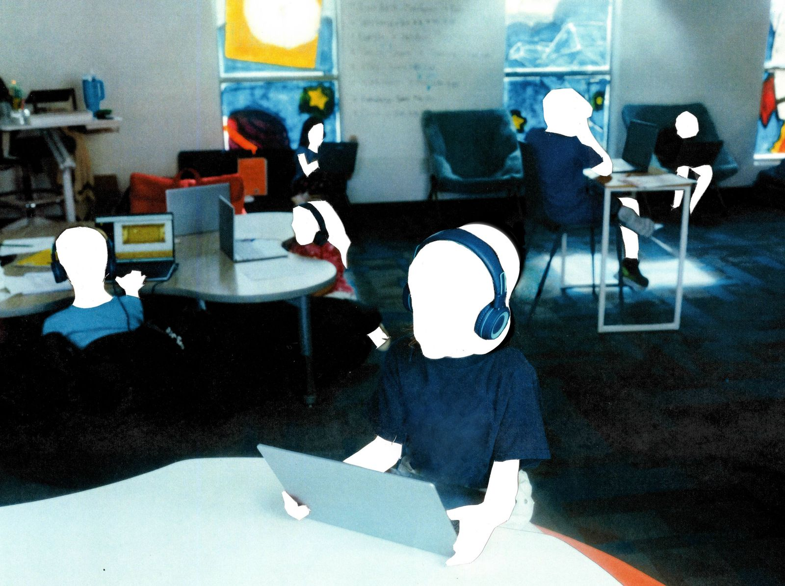
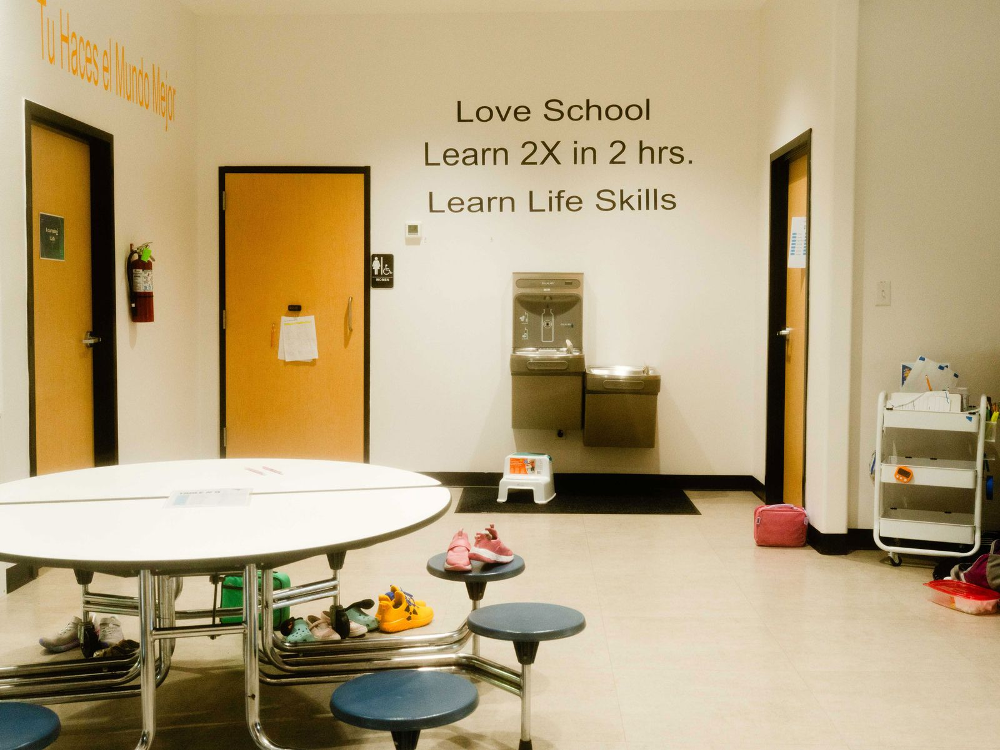
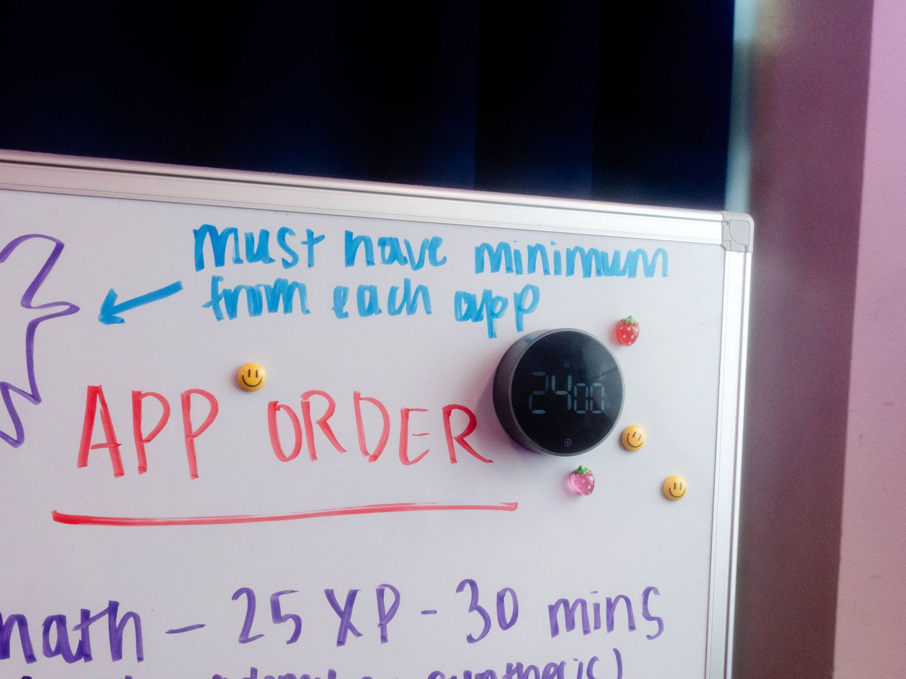
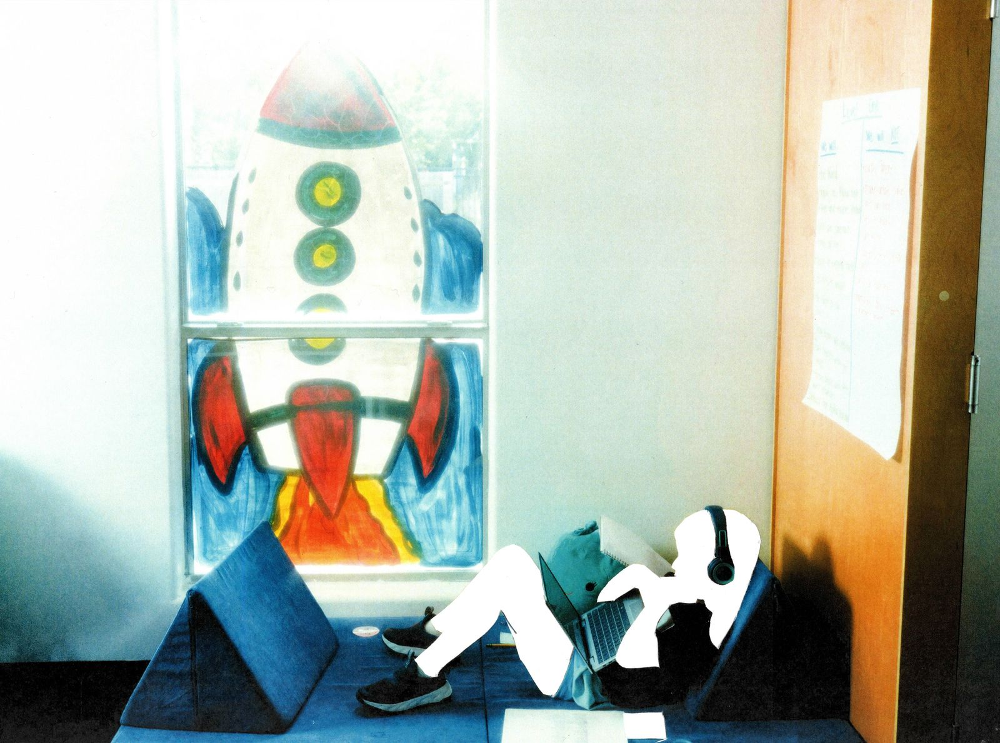
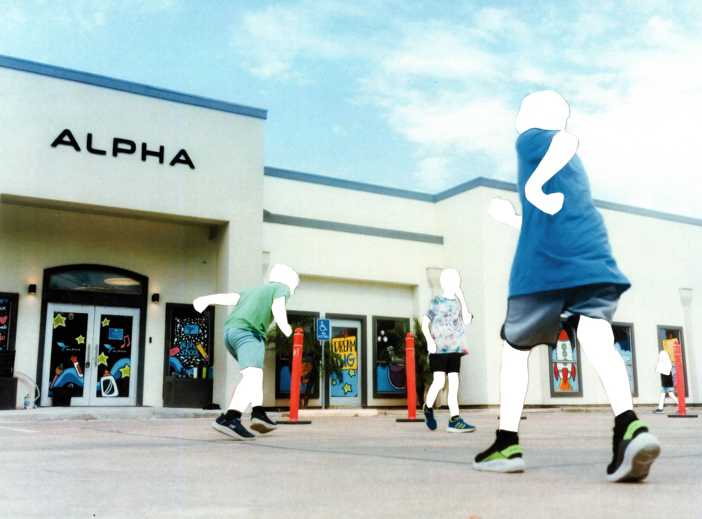
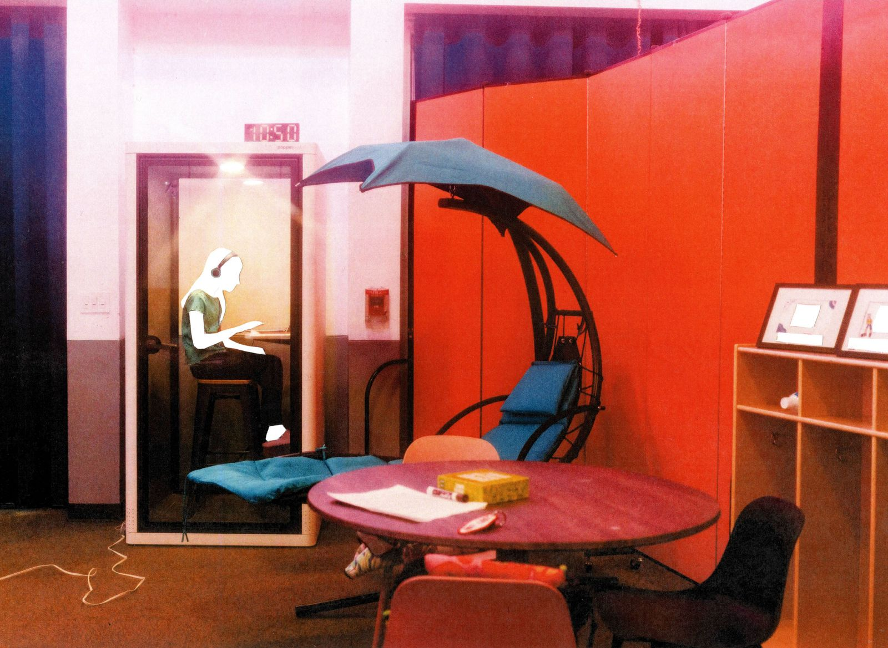
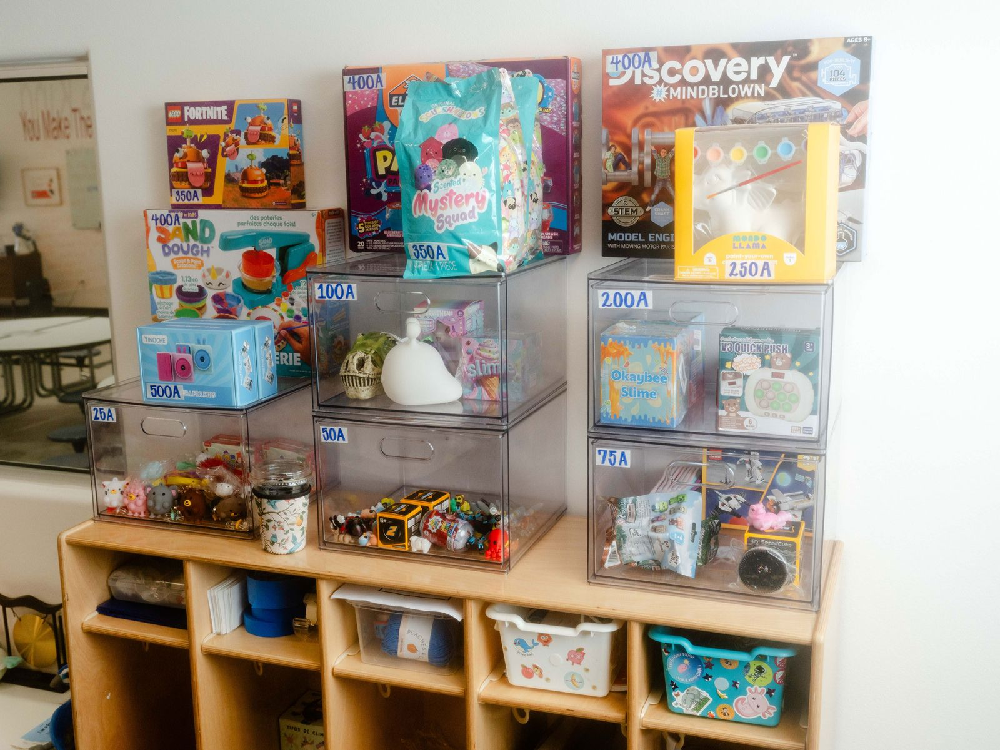

One day last fall, Kristine Barrios’ 9-year-old daughter got stuck on a lesson in IXL, the personalized learning software that served as her math teacher. She had to multiply three three-digit numbers without using a calculator. Then she had to do it again, her mom says, more than 20 times, without making mistakes.

去年秋天的一天，克里斯汀·巴里奥斯 9 岁的女儿在 IXL 的一节课上卡住了，这是一款作为她数学老师的个性化学习软件。她必须不用计算器，把三个三位数相乘。她妈妈说，她还得再做一次，超过 20 次，却没有犯错。

At Alpha School, the private microschool the girl and her younger brother attended in Brownsville, Texas, she had been working a grade level ahead of her age in math, Barrios says. She could do three-digit multiplication correctly most of the time. But whenever she made an error in IXL, the software would determine she needed more practice and assign her more questions. She told her mom that she had asked her “guide,” the adult who supervised her classroom in lieu of a teacher, to make an exception and let her move on. She said the guide’s reply was that she needed to get it done, that it was expected of her.

巴里奥斯说，在她和弟弟所在的德克萨斯州布朗斯维尔的私立微型学校 Alpha 学校，她在数学方面已经比同龄人高一个年级。她大多数时候能正确做三位数乘法。但每当她在 IXL 考试中犯错时，软件就会判定她需要更多练习，并布置更多题目。她告诉妈妈，她请求了她的“引导者”——那个代替老师监督她教室的成年人——破例让她继续前进。她说导游的回答是她必须完成，这是她被期望完成的。

The adult guides in Alpha’s classrooms “don't do any teaching,” says the current head of the Brownsville school.

Photograph: Brenda Bazán; Treatment: WIRED Staff

照片：布伦达·巴赞;治疗：WIRED STAFF（有线的工作人员）

Over the next weekend, Barrios says, she and her husband sat with their daughter for hours each day until she finished the multiplication lesson, even as she broke down and sobbed that she’d rather die than keep going. Ultimately, Barrios says she double-checked all the answers on a calculator before the 9-year-old entered them. But when the girl returned to school with the lesson completed, her mom says, she came back reporting crushing news: In the time she had spent stuck, she had fallen even farther behind her targeted goals.

巴里奥斯说，接下来的周末，她和丈夫每天陪女儿几个小时，直到她完成乘法课，即使她崩溃哭泣，说宁愿死也不愿继续下去。最终，巴里奥斯说她在输入答案前用计算器反复核对了所有答案。但当女孩完成课程回到学校时，她妈妈说，她带来了沉重的消息：在她被困期间，她的目标落后了更远。

Within a couple weeks, Barrios says, the school reported to her and her husband that their daughter wasn’t eating lunches. According to Barrios, Alpha said it was “because she would rather stay in and work.” The girl later explained to her parents that she was spending lunchtimes catching up on IXL. (In a statement to WIRED, IXL representatives wrote that Alpha School’s account was deactivated this past July and claims that it is “no longer an IXL customer due to violating our terms of service,” adding that IXL “is not intended—and we do not recommend its use—as a replacement” for “trained, caring teachers.”)

巴里奥斯说，几周内学校向她和丈夫报告女儿不吃午饭。据巴里奥斯说，阿尔法说这是“因为她更愿意待在家里工作。”女孩后来向父母解释说，她午餐时间是在补看 IXL 的课程。（IXL 代表在给 WIRED 的声明中写道，Alpha School 的账户于今年七月被停用，并声称“因违反我们的服务条款，不再是 IXL 的客户”“，并补充说 IXL”并非意图——也不推荐——作为“受过培训、关怀教师”的替代品“。）

When Barrios’ husband brought their daughter to a previously scheduled checkup soon after, her doctor noted with concern that she had lost a significant amount of weight in a short time. Her dad then brought her to school with a note from the pediatrician, Barrios says, instructing her to eat snacks in between regular meals and saw her walk into school with it in her hand. She told her parents she delivered it to staff. Even though Alpha had asked parents in its handbook to “refrain” from sending in “midday snacks,” Barrios and her husband wanted to follow the pediatrician's recommendation, she says.

当巴里奥斯的丈夫不久后带女儿去做预定的体检时，医生担忧地指出她在短时间内体重下降了不少。巴里奥斯说，她的父亲随后带着儿科医生的证明带她去学校，指示她在普通餐食间隙吃零食，看到她手里拿着便条走进学校。她告诉父母是把信送到员工那里的。尽管 Alpha 在手册中要求家长“避免”发送“午间零食”，她说巴里奥斯和丈夫仍想遵循儿科医生的建议。

For the first few days, Barrios says, her daughter ate her snacks. Then one afternoon she returned with them still in her backpack, uneaten. Barrios, alarmed, asked if Alpha was providing different food instead. No, the 9-year-old answered. She told her mom that staff at the school said she didn’t earn her snacks and wouldn’t get them until she met her learning metrics.

巴里奥斯说，最初几天，她的女儿吃了零食。然后有一天下午，她带着它们回来了，还在背包里，没吃完。巴里奥斯惊慌地问阿尔法是不是给了别的食物。没有，9岁的孩子回答。她告诉妈妈，学校的工作人员说她没有赢得零食，只有达到学习指标才会拿到。

In a central room at Alpha School Brownsville, the school’s promise is written on the wall.

Photograph: Brenda Bazán

照片：布伦达·巴赞

A timer on a classroom white board counts the minutes to be spent on a learning app.

Photograph: Brenda Bazán

照片：布伦达·巴赞

“ As a parent, you're like, this is not OK,” Barrios recalls. She pulled both her kids out of Alpha School that November.

“作为父母，你会觉得，这不对，”巴里奥斯回忆道。那年十一月，她把两个孩子都从 Alpha 学校带走了。

Barrios and her husband joined a growing group of families who had chosen to leave the school’s Brownsville campus. About two dozen kids were in the inaugural class in 2022, according to Paige Fults, the current head of Alpha School Brownsville. At least five families (including some with more than one child) have departed. That hasn’t stopped Alpha’s leaders from pointing to Brownsville as an example, in at least one white paper and in applications to open new charter schools, of how the proprietary model Alpha uses, 2 Hour Learning, can succeed in communities with “low SES" (meaning socioeconomic status).

巴里奥斯和丈夫加入了越来越多的家庭，他们选择离开学校布朗斯维尔校区。据现任 Alpha 学校布朗斯维尔校长 Paige Fults 介绍，2022 年首届新生约有二十多名学生。至少有五个家庭（包括一些有多个孩子的家庭）已经离开。这并未阻止 Alpha 的领导层在至少一份白皮书和新特许学校开设申请中，以布朗斯维尔为例，展示 Alpha 所采用的专有模式“2 小时学习”如何在“低社经地位”（即社会经济地位）社区取得成功。

With 2 Hour Learning, which is in use not only at Alpha but also a host of its private “sister schools,” students are meant to spend just two hours per day on “learning sessions.” Personalized learning software—or what the 2 Hour Learning homepage began referring to last year as an “AI tutor”—does the teaching. MacKenzie Price, one of the founders of Alpha and 2 Hour Learning, told WIRED: “ Our students are learning twice as much, our classes are top 1 percent across grades and subjects, and we're doing it all in a much, much shorter amount of time.” (Price’s claim is based in part on comparisons of standardized test data. While Price initially said that Alpha would share its data with WIRED, it has not done so.)

2 小时学习不仅在 Alpha 学校，也在其众多私立“姐妹学校”中使用，学生每天只需花两小时进行“学习课程”。个性化学习软件——或者说 2 小时学习主页去年开始称之为“AI 导师”的软件——负责教学。Alpha 和 2 小时学习的创始人之一麦肯齐·普赖斯告诉 WIRED：“我们的学生学习量翻倍，班级在各年级和科目中均位列前 1%，而且我们用的时间远远更短。”（普赖斯的主张部分基于标准化考试数据的比较。虽然普赖斯最初表示 Alpha 会与 WIRED 共享数据，但实际上并未这样做。）

As the nation confronts a teacher shortage crisis, Alpha’s audacious promise has propelled it from a small Texas private school into a budding educational empire. It’s a darling of the Trump administration and the very wealthy. Joe Liemandt, a Stanford dropout turned tech founder whose billions come from selling automation software, is the school’s “principal.” This past summer, hedge fund manager Bill Ackman promoted the school on X and hosted a panel about it in the Hamptons. Reid Hoffman, the cofounder of LinkedIn, has [had Price on his podcast](https://www.youtube.com/watch?v=coW9-pgXX6w) and has [said on X](https://x.com/reidhoffman/status/1904157272269627789) that the “best news” is that Alpha’s AI tutor approach “can be a reality for every student, anywhere.” In September, US secretary of education Linda McMahon [visited](https://www.statesman.com/news/education/article/education-secretary-mcmahon-visits-austin-private-21036830.php) the original Austin campus and said the models presented there were “the most exciting thing I’ve seen in education in a long time.”

当全国面临教师短缺危机时，Alpha 大胆的承诺将其从德州一所小型私立学校发展成为一个初兴的教育帝国。这是特朗普政府和富豪们的宠儿。乔·利曼特，一位斯坦福辍学者，后来成为科技创始人，靠销售自动化软件赚取数十亿美元，是学校的“校长”。去年夏天，对冲基金经理比尔·阿克曼在 X 上推广了这所学校，并在汉普顿举办了一场关于它的座谈会。LinkedIn 联合创始人 Reid Hoffman 曾[邀请 Price 参加他的播客](https://www.youtube.com/watch?v=coW9-pgXX6w) ，并在 [X 频道表示](https://x.com/reidhoffman/status/1904157272269627789) ，“最好的消息”是 Alpha 的 AI 导师方案“可以成为每个学生、任何地方的现实”。今年九月，美国教育部长琳达·麦克马洪[访问](https://www.statesman.com/news/education/article/education-secretary-mcmahon-visits-austin-private-21036830.php)了原奥斯汀校区，称那里展示的模型是“我很长时间以来见过的最令人兴奋的教育项目”。

The school is in the midst of a national expansion, including roughly a dozen new campuses in Arizona, California, Florida, New York, North Carolina, and Virginia to add to the five already open in Texas. An “affiliate” charter school called Unbound Academy is enrolling students in Arizona. Although Unbound is independent from Alpha, its leadership team includes Price and her husband, Andrew, and some of the other initial members of its board either work at or have connections to Alpha. Unbound’s application to open in Arizona cited Alpha School Brownsville, saying that it “demonstrated how the 2hr Learning Model can effectively address educational disparities” and make “high-quality education accessible to all students.”

学校正在进行全国扩展，包括在亚利桑那州、加利福尼亚州、佛罗里达州、纽约州、北卡罗来纳州和弗吉尼亚州新建约十几个校区，以补充德克萨斯州已有的五个校区。一所名为 Unbound Academy 的“附属”特许学校正在亚利桑那州招收学生。虽然 Unbound 独立于 Alpha，但其领导团队包括 Price 和她的丈夫 Andrew，以及其他一些最初董事会成员，或在 Alpha 工作或与 Alpha 有联系。Unbound 在亚利桑那州开学的申请中提到了 Alpha School Brownsville，称其“展示了 2 小时学习模式如何有效解决教育差距”，并使“所有学生都能获得高质量教育”。

Certainly, the school has its fans: When [Newsweek recently visited the Brownsville campus](https://www.newsweek.com/alpha-school-brownsville-ai-expanding-2063669), one older student said she appreciated her time there so much that she was looking to found an upper school herself so that she and her cohort could continue with an Alpha-like model rather than attend the local public high school. “The Rio Grande Valley, Brownsville, and all the cities surrounding it are lagging behind in education in the US, so students going from a fast-paced environment like Alpha and then having to cut it off and go to a traditional school doesn't make sense," the 12-year-old said. (After offering in August to connect WIRED with this student, Alpha did not respond to subsequent requests to do so.)

当然，学校也有自己的支持者：当 [《新闻周刊》最近访问布朗斯维尔校园](https://www.newsweek.com/alpha-school-brownsville-ai-expanding-2063669)时，一位年长学生表示她非常珍惜在那里度过的时光，以至于她正考虑自己创办一所高中，这样她和同学们就能继续采用类似 Alpha 的模式，而不是去当地的公立高中上学。“里奥格兰德谷、布朗斯维尔以及周边所有城市在美国的教育水平都落后，所以学生从像 Alpha 这样节奏快速的环境转学到传统学校，是没有意义的，”这位 12 岁的女孩说。（Alpha 在 8 月提出将 WIRED 与该学生连接后，未回应后续请求。）

But in interviews with WIRED, more than a dozen former employees, students, and parents say what they expected from Alpha School wasn’t what it delivered. Former “guides” from different campuses, many of whom requested anonymity because they fear negative consequences, say Alpha’s educational philosophy was driven by software metrics and, sometimes, Liemandt's whims. One guide said they believed Alpha wanted to prepare students for a hypercompetitive “late capitalism, dog-eat-dog” environment. Parents like Kristine Barrios say the school impacted their children, left them with glaring gaps in their education, and is now using them to sell a story of success. “They set her up for failure,” Barrios says, and then it felt like “they punished her for failing.”

但在接受 WIRED 采访时，十多名前员工、学生和家长表示，他们对 Alpha School 的期待与实际表现不同。来自不同校园的前“导师”，许多人因害怕负面后果而要求匿名，他们表示阿尔法的教育理念是由软件指标驱动，有时也受利曼特的任性影响。一位导游表示，他们认为 Alpha 希望让学生为一个极端竞争的“晚期资本主义，弱肉强食”环境做好准备。像克里斯汀·巴里奥斯这样的家长表示，这所学校影响了他们的孩子，留下了明显的教育空白，现在却用这些漏洞来兜售成功的故事。“他们让她注定失败，”巴里奥斯说，然后感觉“他们惩罚她失败了”。

In response to WIRED’s October 10 requests for comment for this story, Alpha School shared a Google Doc of partial responses six days later that it subsequently rescinded access to. On October 20, Alpha informed WIRED: “We possess records that materially contradict key elements of your current reporting.” After several extensions of the original deadline requested for response, WIRED received no further substantive replies from Alpha to the requests sent on October 10. Last Friday morning, October 24, WIRED received a letter from lawyers for Alpha seeking more time to respond and further information from WIRED, including “waivers” from individual students’ parents. That night, Alpha’s lawyers sent WIRED a statement reading, in part: “Allegations that Alpha has mistreated, punished, or caused harm to any student are categorically and demonstrably false. Alpha and its employees prioritize a safe and productive environment to accelerate academic mastery and allow students to thrive.”

针对 WIRED 于 10 月 10 日就本报道的置评请求，Alpha School 在六天后分享了一份包含部分回复的 Google 文档，但随后撤回了访问权限。10 月 20 日，Alpha 告知 WIRED：“我们掌握的记录与你们当前报道的关键要素实质上相矛盾。”在多次延长原请求的回复截止日期后，WIRED 未收到 Alpha 对 10 月 10 日请求的进一步实质性回复。上周五上午，10 月 24 日，WIRED 收到了 Alpha 律师的来信，要求延长回复时间并获得更多信息，包括学生家长的“豁免”。当晚，Alpha 的律师向 WIRED 发来一份声明，部分内容是：“关于 Alpha 虐待、惩罚或伤害任何学生的指控，都是绝对且有证据的虚假。Alpha 及其员工优先营造安全且高效的环境，以加速学业掌握，让学生茁壮成长。”

When scientists want to condition lab animals to perform tasks repetitively, they may use a Skinner box, a device invented by Harvard psychologist B. F. Skinner that rewards test subjects for responding to certain stimuli. In 1953, Skinner adapted the idea into one of the world’s first personalized learning machines. On parents’ day in his daughter’s fourth-grade class, he noticed that some students were bored waiting for the teacher to review their math work while others were struggling to keep up. Skinner got to tinkering and ultimately developed boxes that could accept questions on punch cards and two-digit answers via levers. When a student got the question right, the box would shine a light to let them know they could move on.

当科学家想要让实验动物反复执行任务时，他们可能会使用斯金纳盒，这是一种由哈佛心理学家 B.F.斯金纳发明的装置，奖励受试者对特定刺激的反应。1953 年，斯金纳将这一理念转化为世界上最早的个性化学习机器之一。在女儿四年级班级的家长日，他注意到有些学生无聊地等老师复习数学作业，而另一些则努力跟上。斯金纳开始不断改进，最终开发出可以接受穿孔卡问题和通过杠杆输入两位数答案的盒子。当学生答对问题时，盒子会亮起灯光，告知他们可以继续。

After the digital revolution, learning machines got more adaptive. Personalized software could present students with questions that changed in difficulty and subject matter based on previous answers. By 2014, a small group of wealthy families from Austin’s burgeoning tech scene—including entrepreneur Brian Holtz and MacKenzie Price—felt confident enough in the software and in their own backgrounds to bet their kids’ educations on a new model. They founded Emergent Academy, renamed Alpha School in 2019. Some of the earliest students included Liemandt’s kids. The core philosophy, says Graham Frey, the school’s CEO from 2017 until 2022, was “the only way we’re going to know if the apps work is if we let them do the teaching.”

数字革命之后，学习机器变得更加适应性强。个性化软件可以根据之前的答案，向学生呈现难度和主题的变化题目。到 2014 年，来自奥斯汀新兴科技圈的一小群富裕家庭——包括企业家布莱恩·霍尔茨和麦肯齐·普赖斯——对软件和自身背景充满信心，愿意将孩子的教育押注在新模式上。他们创立了 Emergent Academy，2019 年更名为 Alpha School。最早的学生中包括利曼特的孩子们。学校 2017 年至 2022 年担任首席执行官的格雷厄姆·弗雷说，核心理念是“我们唯一能知道这些应用是否有效的方法，就是让它们来教学。”

As Alpha was getting off the ground in Austin, the tech world’s billionaire philanthropists were coming around to a similar vision of the future of education. In Mark Zuckerberg and Priscilla Chan’s 2015 “Letter to Max,” released with the launch of their nonprofit, they pledged to build a world of new opportunity for their firstborn child and her peers. “Our generation grew up in classrooms where we all learned the same things at the same pace regardless of our interests or needs,” they wrote. “You’ll have technology that understands how you learn best” and get “as much help as you need in your most challenging areas.”

当 Alpha 在奥斯汀起步时，科技界的亿万富翁慈善家们也开始认同对教育未来的类似愿景。在马克·扎克伯格和普莉西拉·陈 2015 年发布的《致马克斯的信》中，他们承诺为他们的长女及其同龄人创造一个充满新机遇的世界。他们写道：“我们这一代人是在教室里长大的，无论兴趣或需求如何，我们都以相同速度学习相同内容。”“你会有技术最了解你如何学习”，并且“在你最具挑战性的领域获得所需的帮助”。

Zuckerberg’s initiative committed to spending more than $100 million to support a learning platform called [Summit](https://www.chalkbeat.org/2023/10/4/23903768/mark-zuckerberg-czi-schools-personalized-learning-technology-summit/). The Bill and Melinda Gates Foundation also gave millions in grants to encourage the adoption of personalized, software-based curricula.

扎克伯格的倡议承诺投入超过 1 亿美元支持名为 [Summit](https://www.chalkbeat.org/2023/10/4/23903768/mark-zuckerberg-czi-schools-personalized-learning-technology-summit/) 的学习平台。比尔及梅琳达·盖茨基金会还提供了数百万的资助，鼓励采用个性化的软件课程。

Up until 2022, Alpha had applied its models to groups of students from wealthy, largely white, mostly college-educated families in Austin. A guide named Brennan Wong says she felt “OK with experimenting on this group of students because all the students I taught were coming from very well-off families and were already a couple grades ahead.” With its Brownsville campus, Alpha would be expanding to a different population of students.

直到 2022 年，Alpha 的模型一直应用于奥斯汀富裕、主要是白人、大学教育家庭的学生群体。一位名叫布伦南·黄的导游说，她觉得“对这群学生做实验没问题，因为我教过的学生都来自非常富裕的家庭，已经领先好几个年级了。”有了布朗斯维尔校区，阿尔法将面向不同的学生群体扩展。

When Alpha began recruiting Brownsville students with generous scholarships, there was nothing else like it in the predominantly Hispanic city of about 190,000, which sits at the southernmost tip of Texas, just across the Rio Grande from Matamoros, Mexico.

当 Alpha 开始用丰厚奖学金招募布朗斯维尔的学生时，在这座以西班牙裔为主、人口约 19 万的城市中，没有其他地方能与之媲美，该城市位于德克萨斯州最南端，隔着里奥格兰德河，就在墨西哥马塔莫罗斯河对岸。

Kristine Barrios, who had been homeschooling her children, says she was drawn to the vibrant mural in the new school building’s lobby and the unconventional seating options that encouraged kids to get comfortable while they learned, rather than sit rigidly in desks.

一直在家教育孩子们的克里斯汀·巴里奥斯表示，她被新校舍大厅中充满活力的壁画和非传统的座位选择所吸引，这些座椅鼓励孩子们在学习时感到舒适，而不是僵硬地坐在课桌上。

A student works on software exercises on a classroom couch.

Photograph: Brenda Bazán; Treatment: WIRED Staff

照片：布伦达·巴赞;治疗：WIRED STAFF（有线的工作人员）

Jessica Lopez says she wanted her two daughters to learn at their own pace and was intrigued by the life-skills workshops that would fill up their afternoons at Alpha once the software-based academics were done.

杰西卡·洛佩兹说，她希望两个女儿能按照自己的节奏学习，并且对完成软件课程后在 Alpha 下午的生活中技能工作坊感到好奇。

Silvia Solis and Juan Jose Garcia, who had moved back to Brownsville a year before, were eager to get their children into a school with other kids from the neighborhood, and Alpha was opening about a mile down the road.

西尔维娅·索利斯和胡安·何塞·加西亚一年前搬回布朗斯维尔，他们渴望让孩子们进入一所与邻里其他孩子一起的学校，而 Alpha 学校将在一英里外开业。

Other parents said they enrolled because they were fleeing bullying at previous schools or looking for a flexible schedule that could accommodate frequent doctor’s appointments.

还有家长表示，他们报名是因为逃避之前学校的欺凌，或者希望能灵活安排以适应频繁的医生预约。

For much of the school’s first year, parents said, the place was held together by a dedicated staff who managed to create a fun, albeit chaotic, learning environment. Lopez's older daughter, a confident, gregarious 13-year-old who was 10 when she first enrolled, says she was a motivated student who would ask her parents if she could stay up late at home to work on her Alpha apps in order to earn rewards. She was selected as one of the top students, and she told her mom that she got to sit in a special room, eat snacks, and listen to music while she worked.

家长们说，在学校开学的第一年大部分时间里，学校一直靠着敬业的教职员工维系，他们成功营造了一个有趣但混乱的学习环境。洛佩兹的大女儿是一个自信、外向的 13 岁女孩，刚入学时 10 岁，她说自己是个有动力的学生，会问父母是否可以熬夜在家做 Alpha 应用以获得奖励。她被选为顶尖学生之一，并告诉妈妈她能坐在一个特别的房间里，吃零食，听音乐一边工作。

A parent who requested anonymity to protect their child said that the school had regular week-long breaks to recharge, during which students weren’t allowed to bring home their laptops to work. They said they loved the school and spread the word to their neighbors.

一位要求匿名以保护孩子身份的家长表示，学校有定期的一周假期来充电，期间学生不允许带笔记本电脑回家上班。他们说他们很喜欢这所学校，并把这件事传给了邻居们。

Liemandt took over as principal around the same time Alpha School Brownsville was opening, and it was then, Price says, that “we got really, really committed to making sure we were providing academic rigor and showing great results.” Even before the change, Liemandt had been hands-on with operations in Austin, former staff said. He would engage with the guides in long meetings about curriculum, or how to best keep the students motivated, and would sometimes send emails outside of working hours asking for updates on individual students.

利曼特接任校长时，正值阿尔法学校布朗斯维尔开学，普赖斯说，正是在那时，“我们真正、真正地致力于确保学术严谨性并取得优异成绩。”前员工表示，即使在变更之前，利曼特就亲自参与奥斯汀的运营。他会与导游们进行长时间的课程讨论，或者如何最好地保持学生的动力，有时还会在下班后发邮件询问个别学生的最新情况。

At the Austin campus, guides said, students benefited from various opportunities. In one workshop, students designed custom slide sandals, then got to order them from the company. In another, a student says they created a model city for Tesla and won a two-day trip to Disney World. For hitting their learning metrics, they could possibly earn hundreds of dollars over the course of a school year.

导游说，在奥斯汀校区，学生们享受了各种机会。在一次工作坊中，学生们设计了定制滑鞋，然后可以向公司订购。另一张照片中，一位学生说他们为特斯拉设计了一个模范城市，并赢得了为期两天的迪士尼世界之旅。达到学习指标后，他们可能在一个学年内赚取数百美元。

Toward the end of that first year, Barrios says, she got a message one day from Alpha saying that her daughter had been selected to be an “ambassador” and would need to stay after school. When Barrios arrived to pick her up, she found Liemandt there too. She says her daughter and other students were giving tours to prospective parents who worked at the newly opened SpaceX Starbase nearby.

Barrios 说，第一年快结束时，有一天她收到 Alpha 的消息，说她的女儿被选为“大使”，需要留在学校后。当巴里奥斯来接她时，她发现利曼特也在那里。她说，她的女儿和其他学生正在为附近新开设的 SpaceX 星际基地工作的准家长们进行参观。

Soon after, Liemandt held a brief question-and-answer session for parents. When asked why Alpha had chosen to open a school in Brownsville, parents say they recall that Liemandt responded: For SpaceX.

不久之后，利曼特为家长举办了简短的问答环节。当被问及为何 Alpha 选择在布朗斯维尔开设学校时，家长们表示他们记得 Liemandt 的回答是：为了 SpaceX。

Price says Alpha chose to open its campus in Brownsville because of the influx of SpaceX employees into an “impoverished area” with what she alleges is a “really tough” public school district. (The Texas Education Agency has given it an overall rating of B for the past two years, the most common rating for public schools and charters in the state.) Price adds, “We thought it would be a great place to go and serve a population that was interested in something that was, you know, kind of innovative and then also see how it worked with the local population.”

普赖斯表示，Alpha 选择在布朗斯维尔开设校园，是因为 SpaceX 员工涌入一个“贫困地区”，她称这里的公立学区“非常艰难”。（德克萨斯州教育局在过去两年中给予该校整体评级为 B，这是该州公立学校和特许学校中最常见的评级。）普赖斯补充道：“我们认为这里是一个很好的地方，可以服务那些对创新感兴趣的人群，同时也能看看它如何与当地居民合作。”

Even after what parents say could be a rocky first year, Barrios and others still saw Alpha as a pathway to the future for their kids, the kind of opportunity that rarely comes along for working-class families in communities like Brownsville. Many of them had been homeschooling previously or came from charter or other nontraditional schooling backgrounds. They were used to less structure. They felt that together, they could build the school into the vision of it that Alpha had sold them.

即使家长们说第一年可能坎坷，巴里奥斯和其他人仍然把阿尔法看作是孩子们通往未来的道路，这种机会在像布朗斯维尔这样的社区中，工人阶级家庭很少有。他们中许多人之前在家教育，或者来自特许学校或其他非传统学校背景。他们习惯了较少的结构。他们觉得，只要能一起把学校建设成 Alpha 向他们推销的愿景。

That summer, the beloved head of the school left. When families returned the following fall, according to a memo obtained by WIRED, parents were told that Alpha would be debuting a new “version” of itself, called “Limitless,” that was the “culmination” of its “learning” from prior years. “This means we can sunset programs and thinking, and build something that takes us further with the same limitless concepts and thinking,” the memo said. As part of that effort, the school established goals “deliberately designed to cause a parent to think or say, ‘That sounds impossibly difficult for my kid,’” the memo said, in order to “demonstrate the limitless possibilities of their children.”

那个夏天，学校深受爱戴的校长离开了。根据 WIRED 获得的一份备忘录，次年秋季家庭回归时，家长们被告知 Alpha 将推出一个新的“版本”，名为“无限”，这是其“经验”的“顶点”。备忘录称：“这意味着我们可以淘汰项目和思维，构建一个带我们走得更远、同样无限概念和思考的项目。”备忘录称，作为该努力的一部分，学校设定了“有意设计的目标，旨在让家长思考或说，'这对我的孩子来说听起来太不可能了”，以“展示他们孩子的无限可能性”。

As Barrios sees things, “it switched from being about the kids to the metrics and the data and the numbers.”

巴里奥斯认为，“这从关注孩子们转向了指标、数据和数字。”

Recess at Alpha School Brownsville.

Photograph: Brenda Bazán; Treatment: WIRED Staff

照片：布伦达·巴赞;治疗：WIRED STAFF（有线的工作人员）

Spend a day at Alpha Brownsville and it’s easy to see the school’s curb appeal. The classrooms are small and cozy, with beanbags to sit on, inspirational reminders of students’ “limitless” potential painted on the walls, and diffusers pumping subtle, calming scents into the air. As the school has grown, Fults said, the older students have started using a dedicated room a few miles away at the Children’s Museum of Brownsville, steps from the activities and exhibits.

在 Alpha Brownsville 待一天，很容易感受到学校的门面吸引力。教室小巧温馨，有豆袋椅可以坐，墙上画着学生“无限潜力”的励志提醒，空气中散发出细腻安抚的香气。富尔茨说，随着学校的发展，年长学生开始使用几英里外布朗斯维尔儿童博物馆的专用房间，距离活动和展览只有几步之遥。

There are hints of a corporate coworking space—like the soundproofed phone booths that serve as test-taking cubicles—and clear signs of the school’s tech-evangelist, entrepreneurial ethos. In the room for 5- to 7-year-olds, a large TV on one wall displays circle charts that update every minute with completion rates and other metrics from each student’s personalized learning software. Against the opposite wall is a display of toys with price tags listed in “Alphas,” one of many motivational awards students can earn by hitting various learning metrics. One Alpha is equivalent to 25 cents, and a small Fortnite Lego set costs 350 Alphas. (That’s about six times the [retail price](https://www.lego.com/en-us/product/durrr-burger-77070).) Students can also earn visits to local amusement parks, lunch at restaurants, or trips to the grocery store.

学校隐约可见企业共享办公空间的迹象——比如作为考试隔音的电话亭——以及学校科技布道者和创业精神的明显体现。在 5 至 7 岁儿童的教室里，一面墙上的大电视显示着圆圈图表，每分钟更新完成率和其他来自每个学生个性化学习软件的指标。对面墙上展示着标有“Alpha”价格标签的玩具，这是学生通过达到各种学习指标可以获得的众多激励奖之一。一个 Alpha 相当于 25 美分，而一套小型 Fortnite 乐高则要 350 个 Alpha。（大约是[零售价](https://www.lego.com/en-us/product/durrr-burger-77070)的六倍。）学生还可以获得参观当地游乐园、餐厅午餐或超市购物的机会。

Lessons take place in an eerie hush—a dozen kids with headphones on, plugged into laptops, occasionally raising their hand to indicate that they’ve finished a lesson or are having technical problems with their app. The adult guides in every classroom “don't do any teaching,” says Fults, the current head of school for Alpha Brownsville. “Usually what it looks like when a guide helps is more like having the student read the question out loud, show where they have done their work, or show what resources they have already accessed and already used.” If a student really gets stuck, she says, they can book a call with an academic coach who is “part of” 2 Hour Learning.

课程在诡异的寂静中进行——十几个孩子戴着耳机，插着笔记本电脑，偶尔举手表示他们已经完成课程或应用程序出现技术问题。Alpha Brownsville 现任校长富尔茨说，每个教室里的成人导游“都不做任何教学”。“通常引导员帮忙的样子是让学生大声朗读题目，展示他们做过的作业地点，或者展示他们已经使用过的资源。”她说，如果学生真的卡住了，可以预约与“2 小时学习”项目的学业教练通话。

A student takes a coaching call from a booth.

Photograph: Brenda Bazán; Treatment: WIRED Staff

照片：布伦达·巴赞;治疗：WIRED STAFF（有线的工作人员）

A list of the 31 academic coaches Alpha provided for the 2023-24 school year, obtained by WIRED, includes LinkedIn profiles for 26 that show they have been employed, usually as “analysts,” by either Trilogy, Liemandt’s software automation company, or Crossover, another Liemandt firm, which has been described as the world’s largest recruiter for remote full-time work. At least 27 of the coaches live outside the US, from the Philippines to Colombia, according to their Linkedin profiles.

WIRED 获得的 Alpha 为 2023-24 学年提供的 31 名学术教练名单中，包含 26 人的 LinkedIn 资料，显示他们通常被 Liemandt 的软件自动化公司 Trilogy 或另一家 Liemandt 公司 Crossover（被誉为全球最大的远程全职招聘公司）担任“分析师”。根据他们的 LinkedIn 资料，至少有 27 位教练居住在美国以外，从菲律宾到哥伦比亚。

While some guides—the adults who are actually in the room with students—have previous experience as educators, others do not. Frey says that when he was Alpha's CEO, he often “targeted individuals without teaching backgrounds.” Guides told WIRED that while some of their colleagues had experience at other schools, they also had coaching, motivational, or entrepreneurial backgrounds.

虽然有些导游——即真正与学生同在房间里的成年人——有过教育经验，但也有人没有。弗雷说，当他担任 Alpha 的首席执行官时，他经常“针对没有教学背景的人”。Guides 告诉 WIRED，虽然他们的一些同事有其他学校的经验，但他们也有教练、激励或创业背景。

At Alpha, the guides’ support and oversight is meant to supplement the technology—and not just the personalized learning system the school has dubbed an AI tutor. Alpha can also use an array of management surveillance tools, which it calls “basic and extended capabilities,” to flag “incorrect usage” of the learning apps. These “anti-patterns” can “help detect engagement and focus issues.” The school may record students’ screen activity and their mouse and keyboard usage. Alpha may employ eye-tracking programs. Using what it calls a “pro sports analogy,” Alpha compares these tools to “game film.”

在 Alpha，导游的支持和监督旨在补充技术——而不仅仅是学校称之为 AI 导师的个性化学习系统。Alpha 还可以使用一系列管理监控工具，称之为“基础和扩展能力”，来标记学习应用的“错误使用”。这些“反模式”可以帮助“发现参与度和专注问题”。学校可能会录制学生的屏幕活动以及他们的鼠标键盘使用情况。Alpha 可能会使用眼动追踪程序。Alpha 用所谓的“职业体育类比”将这些工具比作“比赛影片”。

While parents are asked to consent to these surveillance programs, the school’s handbook says that there is “no expectation of privacy” on campus. If parents want to restrict recordings of their children outside of the school, they have to manually opt out of the “anywhere” option—as Jessica Lopez learned midway through her older daughter’s second year at Alpha. The girl says she remembers sitting on her bed one night working on schoolwork when she received a notification that she’d been flagged for an anti-pattern. She says Alpha’s system sent a video of her in her pajamas, taken from the computer’s webcam, that showed her talking to her younger sister.

虽然家长被要求同意这些监控项目，但学校手册指出校园内“不存在隐私期待”。如果家长想限制孩子在校外的录制，就必须手动选择退出“随处”选项——正如杰西卡·洛佩兹在她大女儿在 Alpha 二年级中途学到的那样。女孩说她记得有一天晚上坐在床上做作业时，收到通知说自己被标记为反模式。她说 Alpha 的系统从电脑摄像头上传了一段她穿着睡衣的视频，视频显示她和妹妹说话。

Neil Selwyn, an education professor at Monash University and author of _Should Robots Replace Teachers?: AI and the Future of Education_, says attempts to automate teaching usually underestimate how much the profession requires improvisation and adapting to a particular student’s needs. Alpha’s trust in software-enabled repetition and students’ self-motivation is often typical of education ventures started by people with backgrounds in tech who were self-taught and “then fix onto self-regulated learning or one-to-one tutoring as the way that one can learn math or science or engineering or coding most effectively,” Selwyn says. “But they didn’t tend to learn history, poetry, or archaeology, or any of the humanities” that way.

莫纳什大学教育学教授、《 _机器人应否取代教师？：人工智能与教育的未来_ 》一书作者尼尔·塞尔温表示，自动化教学的尝试通常低估了该职业对即兴发挥和适应特定学生需求的需求。Alpha 对软件驱动的重复和学生自我激励的信任，往往体现在由有科技背景、自学成才的人发起的教育项目中，塞尔温说：“然后专注于自我调节学习或一对一辅导，作为学习数学、科学、工程或编程的最有效方式”。“但他们通常不会那样学历史、诗歌、考古学或任何人文学科。”

Some Alpha Brownsville students say that the software they used could adapt to what they were learning, but not how they learned it. In her second year at the school, Lopez's older daughter says she began to stress about meeting the goals for her math and English lessons. Some of her learning apps had “a video in the corner that you could click on” for further instruction, she says, but she felt that was it: “You just trial-and-error.” She became so frustrated at falling behind—not behind her grade level, but behind the rate of production she needed to complete her goals and possibly earn rewards—that she says she took it out on herself physically.

一些阿尔法布朗斯维尔的学生表示，他们使用的软件可以适应他们所学的内容，但无法适应他们学习的方式。在学校二年级时，洛佩兹的大女儿说她开始为数学和英语课程的目标感到压力。她说，她的一些学习应用“角落里有个视频可以点击”以便进一步指导，但她觉得仅此而已：“你就是反复试验。”她因为落后——不是落后于年级水平，而是落后于完成目标和可能获得奖励所需的产出速度——感到非常沮丧，她说她把这种情绪发泄在自己身上。

“I was pulling my hair out, ripping my skin off,” says the former student, who her mom says had had trouble with sensory issues and hyperactivity since before her time at Alpha. “I think at one point I didn’t eat for most of the day because I told myself I don’t eat unless I get something right. I have to do this. Rewards, rewards, motivation, everything became a reward.” When one of the guides noticed she was distressed, she says that person gave her a piece of paper to tear at instead. She told WIRED that they also gave her a plushie toy that she used as a punching bag.

“我当时快要扯头发了，把皮肤都撕下来了，”这位前学生说，她妈妈说她从 Alpha 之前就有感官问题和多动症。“我想有一段时间我大部分时间都没吃东西，因为我告诉自己除非做对了什么才吃东西。我必须这么做。奖励、奖励、动力，一切都变成了奖励。”当其中一位引导者注意到她情绪低落时，她说那个人给了她一张纸让她撕。她告诉 WIREED，他们还给了她一个毛绒玩具，她用来当沙袋。

Earlier this year, Lopez published some of her critiques of Alpha School on Substack. Price says that Lopez is a “loud example” of someone who has “a huge difference in philosophy” and that Alpha is not for everyone. “Students thrive when they're in an environment with high standards and high support, which our guides do,” Price said. “But not everyone believes that, right? There are so many parents who do not really believe in high standards. There are parents who don't believe in high support.”

今年早些时候，洛佩兹在 Substack 上发表了她对《Alpha School》的一些批评。普赖斯说洛佩兹是一个“思想差异极大”的“大例子”，Alpha 并不适合所有人。普赖斯说：“学生们在高标准和高支持的环境中茁壮成长，而我们的导游正是如此。”“但不是每个人都相信，对吧？有很多家长并不真正相信高标准。有些家长不相信高支持。”

As Price sees it, what 2 Hour Learning’s team of scientists and software developers have built—an AI system that can track students’ progress and match them with appropriate lessons—is “like being able to do a CAT scan of a child's brain to understand what do they know, what don't they know, and how can we go and fill in that knowledge to mastery?” Currently, Alpha defines “mastery” as correctly completing 90 percent of a lesson.

普赖斯认为，2 小时学习的科学家和软件开发团队打造的——一个能够追踪学生进展并匹配相应课程的人工智能系统——“就像能对孩子的大脑进行 CT 扫描，了解他们知道什么、不知道什么，以及如何将这些知识填补到精通水平？”目前，Alpha 将“精通”定义为正确完成一节课的 90%。

In its marketing, Alpha says its students should spend two hours a day completing their sessions. But parents and former guides told WIRED that in order to keep up with the rate of lessons required to earn rewards, their students felt they needed to regularly work late into the night at home. Brooks Wiley, an Austin parent, says his son received $2,000 over the course of academic years for scoring well on tests and reaching other goals. But at 13 years old he was reading at an 11th-grade level, Wiley says, making it harder to demonstrate mastery at the same 2x rate. “He felt stress and anxiety to meet rewards,” Wiley says. At the same time, he adds, “I don’t think that's a bad thing. That standard or frame of mind has helped him now.”

在营销中，Alpha 表示学生每天应花两小时完成课程。但家长和前导游告诉 WIREED，为了跟上获得奖励所需的课程速度，学生们觉得他们经常在家工作到深夜。奥斯汀的家长布鲁克斯·怀利表示，他的儿子在学年中因考试成绩优异和达成其他目标而获得了 2000 美元。但怀利说，13 岁时他的阅读水平达到了 11 年级水平，这使得他很难以同样的 2 倍速度展现精通。怀利说：“他感受到了压力和焦虑，以获得奖励。”同时，他补充道：“我不认为这是坏事。这种标准或心态现在帮了他。”

Another parent, who withdrew their son from Alpha Brownsville, says guides offered to buy him something from Amazon if he retook a standardized test and improved his score. But the parent says their son felt shame when he wasn’t completing enough lessons in his apps. “He went from a really happy kid, where school completely changed him that first year,” the parent says, “to just a work machine who would do whatever it took.”

另一位家长曾将儿子从阿尔法布朗斯维尔撤出，他说导游曾提出如果他重考标准化考试并提高成绩，就从亚马逊买东西给他。但家长说，当儿子在申请中完成的课程不够时感到羞愧。“他从一个非常快乐的孩子，第一年学校完全改变了他，”家长说，“变成了一个愿意付出一切的”工作机器“。

Students can purchase prizes using Alphas, the school’s in-house currency, which they earn through work.

Photograph: Brenda Bazán

照片：布伦达·巴赞

Last year, the Arizona State Board for Charter Schools approved Unbound Academy’s application to open a public, online-only charter. The charter school governing bodies in at least two other states—Arkansas and Pennsylvania—rejected the school’s proposals, and Utah's board decided not to move forward with its application process. “Even my own home state of Texas rejected our charter application,” Price told WIRED, though the Texas Education Agency told WIRED it “has no record of Unbound Academy as a charter applicant.” The Pennsylvania Department of Education wrote in its denial that “the artificial intelligence instructional model being proposed by this school is untested and fails to demonstrate how the tools, methods, and providers would ensure alignment to Pennsylvania academic standards.” The department noted that the curriculum plan Unbound presented was vague and did not expressly include subjects like physical education, health, languages, or social studies.

去年，亚利桑那州特许学校委员会批准了 Unbound Academy 开设一所公立、仅在线特许学校的申请。至少另外两个州——阿肯色州和宾夕法尼亚州的特许学校管理机构拒绝了学校的提案，犹他州董事会决定不继续其申请程序。普赖斯告诉 WIRERED：“甚至我自己的家乡德克萨斯州也拒绝了我们的特许申请，尽管德克萨斯教育局告诉 WIRED，他们”没有 Unbound Academy 作为特许申请者的记录。”宾夕法尼亚州教育部在否认声明中写道：“本校提出的人工智能教学模型未经测试，未能展示工具、方法和服务如何确保与宾夕法尼亚州学术标准的一致性。”该系指出，Unbound 提供的课程计划内容模糊，未明确包含体育、健康、语言或社会学等科目。

Students and families from Alpha School Brownsville who spoke to WIRED say younger age groups at the school lacked a dedicated social studies or history curriculum, though older kids learned those subjects. Brownsville parents said they also saw other gaps in their kids’ educations. One parent says that when their son left Alpha as an 8-year-old, he could read words quickly but didn’t comprehend what he was reading. When he enrolled as a third grader at his new school, the parent says, he was writing at a kindergarten level. And when writing by hand, he would get to the end of a line and curve down into the margins, not knowing he was supposed to move to the next line. “All Alpha taught him was read fast, learn your vocabulary, and move on,” the parent says.

来自 Alpha School Brownsville 的学生和家庭接受 WIRED 采访时表示，学校中较小的年龄段缺乏专门的社会学或历史课程，尽管年长的孩子学习了这些科目。布朗斯维尔的家长表示，他们还看到了孩子教育中的其他差距。一位家长说，当他们的儿子 8 岁离开 Alpha 时，他能快速阅读单词，但并不理解自己在读的内容。家长说，当他作为三年级学生入学新学校时，他的写作水平达到了幼儿园水平。手写时，他会写到一行末尾，却不小心弯到边缘，却不知道该换到下一行。“阿尔法教他就是快读，学词汇，然后继续前进，”家长说。

When Solis and Garcia had enrolled their kids at Alpha, they say they told the school that their youngest needed help with reading. Alpha staff had told them not to get a tutor and to trust the process, they say. (An information packet from a parent orientation night that year says: “We are creating self-driven, 2x learners and having a tutor spoon feed you help is the opposite of that.”) But with six weeks left in the school year, Solis and Garcia say, Alpha informed them that their son was so far behind in reading that he might not be invited back in the fall of 2023. They say Alpha gave them a large package of make-up work to be completed during the summer. “They were making us do the work that they had failed to do,” Solis says. (The family withdrew their two children from the school after that first year.)

当索利斯和加西亚把孩子送入阿尔法学校时，他们说他们告诉学校最小的孩子需要阅读方面的帮助。他们说，Alpha 的工作人员告诉他们不要找家教，要相信这个过程。（那年家长迎新之夜的一份信息包写道：“我们正在培养自学的双倍学习者，而家教一路喂你一顿，正好相反。”）但随着学年结束还有六周，索利斯和加西亚说，阿尔法告诉他们，他们的儿子阅读严重落后，可能不会在 2023 年秋季被邀请回校。他们说 Alpha 给了他们一大堆补课，要他们在夏天完成。“他们让我们做他们未能完成的工作，”索利斯说。（该家庭在第一年后将两个孩子从学校退学。）

Kristine Barrios, a pediatric occupational therapist by profession, noticed while her youngest was still at Alpha that he still had an inefficient pencil grip. After pulling him out, she found his writing struggles were worse than she’d realized. He didn’t even know to start from the top of a letter and move down, she says. His older sister, 9 at the time she left Alpha, also had an inappropriate pencil grip, Barrios says. She would frequently misspell words longer than three letters and she couldn’t distinguish between nouns, verbs, and other parts of speech.

克里斯汀·巴里奥斯是一名儿科职业治疗师，她注意到最小的孩子还在 Alpha 时，他握铅笔的手感依然很低效。把他拉出来后，她发现他的写作比她想象的还要困难。她说，他甚至不知道要从字母顶部开始往下写。巴里奥斯说，他离开 Alpha 时 9 岁的姐姐也握铅笔不当。她经常拼错超过三个字母的单词，无法区分名词、动词和其他词性。

Some Brownsville parents’ anger has been compounded by a feeling that while they say their children were suffering, Alpha used the school to sell its product to other families. “They’re using our people as bait,” Lopez says. “They’re sharing that they’re in Brownsville, and how they helped us grow academically in a 98 to 99 percent low-income Hispanic community, so yes, it works for everybody. I don’t want to be their statistic, the reason somebody else goes through this.”

一些布朗斯维尔家长的愤怒因他们觉得虽然孩子受苦，但 Alpha 却利用学校向其他家庭销售产品而加剧。“他们用我们的人当诱饵，”洛佩兹说。“他们分享了自己在布朗斯维尔，以及他们如何帮助我们在一个 98%到 99%的低收入西班牙裔社区中实现学术成长，所以是的，这对每个人都有效。我不想成为他们的统计数字，成为别人经历这些的原因。”

Lopez’s daughters both attend public school now. The transition wasn’t without stress, she says, but her oldest has continued to excel academically, and her younger daughter has a newfound confidence in her studies. All she needed was “someone who could walk her through content that’s just not landing,” Lopez says.

洛佩兹的女儿们现在都在公立学校上学。她说，这个转变并非没有压力，但她的大女儿在学业上依然表现出色，小女儿对学业也重新建立了自信。洛佩兹说，她所需要的只是“一个能引导她体验那些根本不受欢迎的内容的人”。

Within weeks of leaving Alpha and returning to homeschooling, Kristine Barrios’ daughter began eating regularly again, she says. Regaining her interest in school was more of a struggle. “It’s taken the better part of this past year to get her back to baseline,” Barrios says, “that natural exuberance and love of learning and life.”

她说，离开 Alpha 并重返家庭教育几周后，Kristine Barrios 的女儿又开始规律进食。重新找回对学校的兴趣则更为艰难。“过去一年大半时间，她才恢复到本来的状态，”巴里奥斯说，“那种自然的热情和对学习和生活的热爱。”

___

_Let us know what you think about this article. Submit a letter to the editor at_ _[mail@wired.com](mailto:mail@wired.com)._

_欢迎告诉我们你对这篇文章的看法。请将信件寄给编辑，邮箱__[为 mail@wired.com](mailto:mail@wired.com)。_
