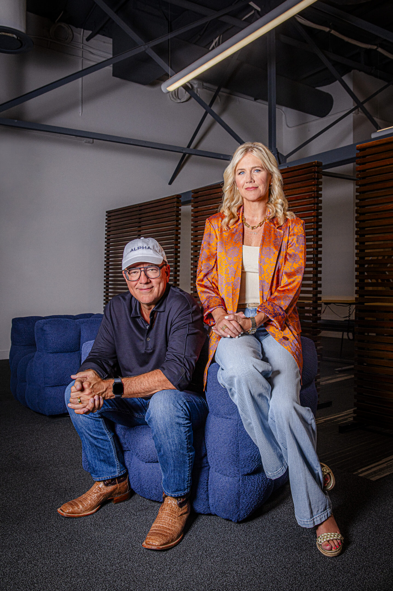
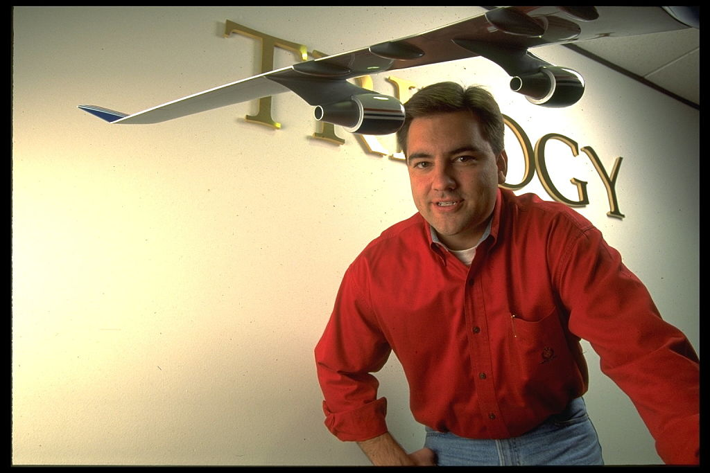
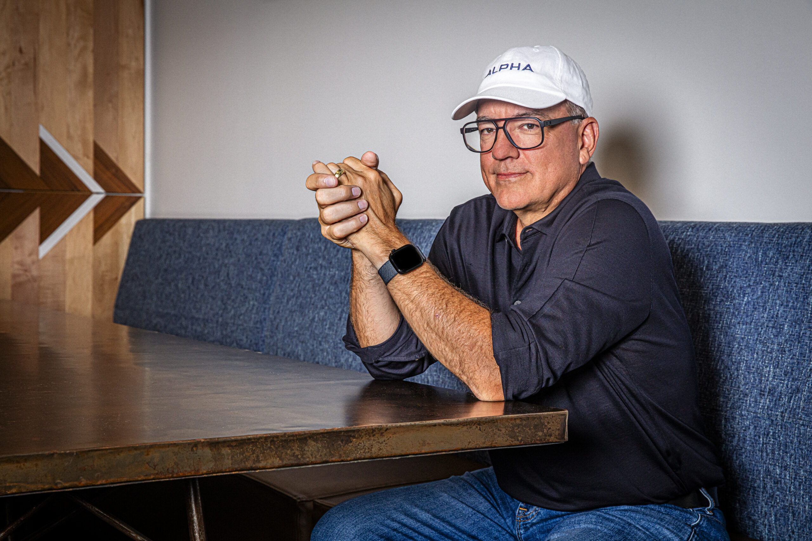
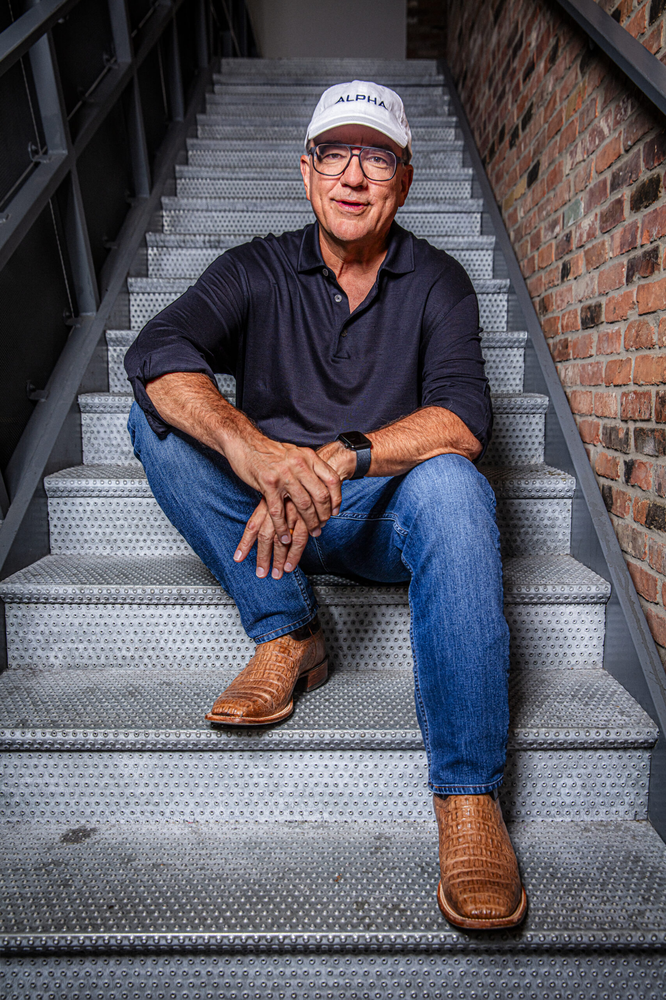
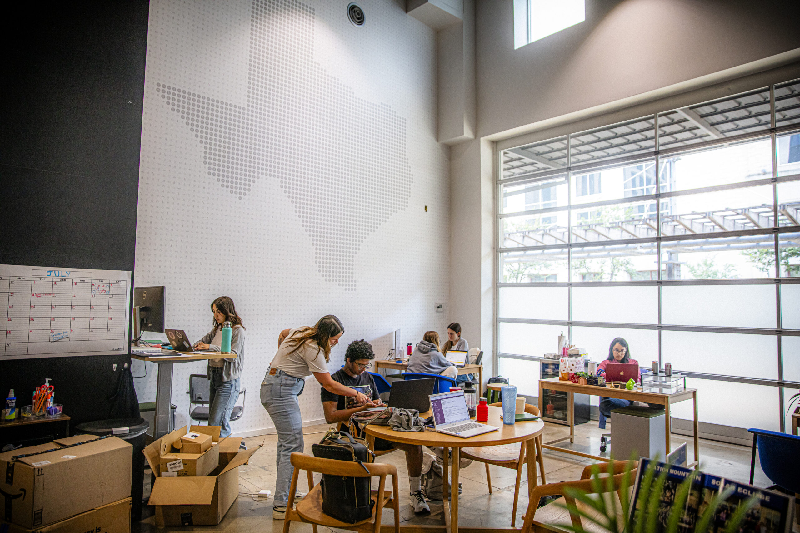

[_Click here_](https://shop.joincolossus.com/subscribe) _to subscribe to print for your office or home._  
点击这里订阅印刷版，供办公室或家庭使用。

**Even after agreeing to break his silence after 25 years**, Joe Liemandt is still reluctant to talk about himself. It’s hard to get him to relive Trilogy, the enterprise software company he founded in 1989, which by age 27 put him on the cover of _Forbes_, twice, as America’s youngest self-made centimillionaire. He isn’t keen to expound on SalesBuilder, Trilogy’s flagship expert system from the 1990s and the world’s first billion-dollar artificial intelligence product in all but name. Ditto ESW, the investment arm of Trilogy that’s acquired hundreds of software companies since 2000 and helped make him a decabillionaire, yet the mention of which makes the otherwise inexhaustible Liemandt, who always seems to be straining at some invisible leash, seem drowsy and bored.  
即使在同意沉默 25 年后打破沉默，乔·莱曼特仍然不愿意谈论自己。很难让他回忆起 1989 年他创立的企业软件公司三部曲，这家公司让他在 27 岁时两次登上《福布斯》杂志封面，成为美国最年轻的白手起家的千万富翁。他也不愿意详细阐述三部曲在 20 世纪 90 年代的旗舰专家系统 SalesBuilder，这是实际上第一个以人工智能产品名义的十亿美元产品。同样，提起自 2000 年以来收购了数百家软件公司的三部曲投资部门 ESW，让这位原本似乎总是被无形缰绳牵制的莱曼特显得昏昏欲睡、无精打采。

Nor is he interested in dwelling on his reputation as a tech pioneer in everything from expert systems to manufacturing configuration, college recruitment, corporate boot camps, “tech bro culture,” remote work, monitoring workers with surveillance software, and replacing American employees with overseas contractors. Whether his reticence can be ascribed to an inhibition about the things that made him rich, or because he’s refreshingly averse to gilding them with hypocritical virtue-signaling, or because he simply doesn’t give a shit anymore, is hard to tell.  
他也不愿意过多谈论自己在专家系统、制造配置、大学招生、企业培训营、“科技男文化”、远程工作、用监控软件监督员工，以及用海外合同工取代美国员工等方面的技术先驱地位。他之所以保持沉默，是出于对让他致富的事物的抑制感，还是因为他 refreshingly 地不愿用虚伪的道德信号粉饰它们，或者只是因为他已经不再在乎了，这都很难说清。

The one thing Liemandt will talk about for hours on end is Alpha School: the teacherless, homeworkless, K-12 private school in Austin, Texas, where students have been testing in the top 0.1% nationally by self-directing coursework with AI tutoring apps for two hours a day. Alpha students are incentivized to complete coursework to “mastery-level” (i.e., scoring over 90%) in only two hours via a mix of various material and immaterial rewards, including the right to spend the other four hours of the school day in “workshops,” learning things like how to run an Airbnb or food truck, manage a brokerage account or Broadway production, or build a business or drone.  
李曼特会不厌其烦地谈论的是阿尔法学校：位于德克萨斯州奥斯汀的一所无教师、无家庭作业的 K-12 私立学校，在这里，学生们每天通过使用 AI 辅导应用自主选择课程内容，并在两天内在全国范围内测试成绩排名进入前 0.1%。阿尔法学校的学生成绩达标（即得分超过 90%）后，可以得到各种物质和非物质的奖励，从而在剩下的四小时学校时间里参加“工作坊”，学习如何经营 Airbnb 或食品卡车、管理经纪账户或百老汇制作，或者创办企业或无人机。

Since the explosive debut of Generative AI in 2022, Liemandt has taken $1 billion out of Trilogy/ESW in order to fund and incubate proprietary AI software products at Alpha School, where he has also served quietly as “product guy,” dean of parents, and principal. After collecting a three-year data stream in these roles, while also working in a nearby stealth lab, Liemandt believes he now has “the single best product I’ve ever built, in four decades, by far.” The product is called Timeback, and its purpose, in essence, is to scale Alpha School’s concepts and results—learn 2x in 2 hours, test in the 99th percentile, and then give students the rest of their childhood back—to a billion kids.  
自 2022 年生成式 AI 的爆炸性 debut 以来，Liemandt 从 Trilogy/ESW 获得了 10 亿美元的资金，用于资助和孵化 Alpha School 的专有 AI 软件产品，他在那里也默默地担任过“产品负责人”、“家长院长”和“校长”等职务。在这些角色中，他收集了三年的数据流，同时还在附近的一个秘密实验室工作，Liemandt 相信他现在拥有了“我四十年来最好的产品，毫无疑问”。这款产品名为 Timeback，其主要目的是将 Alpha School 的理念和成果规模化——在两小时内学习两倍的内容，测试成绩进入前 1%，然后把孩子们剩下的童年时光还给他们，惠及一亿孩子。

“If you talk to anybody on the planet who knows me, they’re thinking, ‘Joe’s doing education? What happened?’” said Liemandt, who seemed surprised himself, not least to be talking to a journalist for the first time in a quarter-century. “It’s just one of those things. If you took 100 people and asked, ‘Who’s the least likely to do this?’ it would be freaking me.”  
“如果你问世界上任何一个认识我的人，他们都会想，‘Joe 在做教育？发生了什么？’”Liemandt 说，他似乎自己也很惊讶，尤其是这是他四分之一个世纪以来第一次接受记者的采访。“这只是一个偶然。如果你让 100 个人猜猜谁最不可能做这件事，那一定是我。”

Implausible as it may seem to Liemandt, still less likely is the story of how it began, which hinges on what Alfred Hitchcock referred to as a MacGuffin: the random object or event that sets a larger plot in motion. In the case of Liemandt’s journey to Alpha School, the MacGuffin was a letter written 40 years earlier to a judge in Minot, North Dakota by a nine-year-old girl named MacKenzie Larson, who’d been taken from her home.  
对李曼特来说，这可能显得难以置信，但故事的起源更加不可思议，这取决于阿尔弗雷德·希区柯克所说的“麦格芬”：一个随机的对象或事件，它启动了更大的剧情。在李曼特前往阿尔法学校的旅程中，这个“麦格芬”是一封 40 年前由名叫麦肯齐·拉森的九岁女孩写给北达科他州米诺特市法官的信，她当时被带离了家。

**On her father’s wheat**, corn, and cattle farm outside Minot, MacKenzie Larson loved riding horses. There were several on the farm, but her favorite was Flare, an American Quarter Horse. There was plenty else to love about the gritty tomboy farmlife, like riding motorbikes, or driving the pickup truck standing up to the neighbor’s farm, which she did while Mr. Larson worked. But riding Flare was MacKenzie’s happy place, which as time went on was a diversion she couldn’t stand to lose.  
在米诺特市外父亲的麦田、玉米地和牛场里，麦肯齐·拉森热爱骑马。农场里有几匹马，但她最喜欢的是一匹美国 Quarter 马，名叫火焰。关于这个粗犷的女农场主生活，还有很多值得喜爱的地方，比如骑摩托车，或者在拉森先生工作时，她会骑着皮卡卡车站在邻居的农场前。但骑火焰是麦肯齐的快乐之地，随着时间的推移，她越来越无法忍受失去这个爱好。

Her parents divorced not long after she was born, and her devoted mother lived in town, where she made ends meet by waitressing, selling beef jerky, and working in a clothing store. The farm belonged to Mr. Larson, who had gone to Stanford in the 1960s, but moved back home after college to take over the farm from his father, a decision he’d come to regret. Mr. Larson was a sweet and jovial man who took a loose view of parenting, and on his days of the week, MacKenzie and her older brother Caesar were left alone with a CB radio, starting when she was three. Every evening when their father returned from work, he gave them frozen pizza and ice cream, childhood staples MacKenzie tired of too young.  
她出生不久父母便离婚了，她那勤劳的母亲住在镇上，靠当服务员、卖牛肉干和在服装店工作维持生计。农场属于拉森先生，他在 20 世纪 60 年代去了斯坦福大学，但大学毕业后回到家乡接管了父亲的农场，这一决定他后来感到后悔。拉森先生是个温和而随和的人，对育儿采取宽松的态度，每周的几天，麦肯齐和她哥哥凯撒就会被留在家里，只有对讲机相伴，从她三岁起就是如此。每当父亲下班回家时，都会给他们带来冷冻比萨和冰淇淋，这些是麦肯齐小时候的最爱，但她太早便厌倦了。

Still there was Flare, which she rode every day to the little school she attended in the country. She didn’t love school, but she was a good student, mainly because the local Taco John’s gave a free taco burger to any kid with straight As on their report card. It was Taco John’s that perhaps gave MacKenzie her first glimpse of what would later become an obsession with the value of incentives in school.  
她每天骑着 Flare 去乡下的那所小学校。她并不喜欢学校，但成绩很好，主要是因为当地 Taco John’s 会给任何获得全 A 的学生免费提供一个墨西哥牛肉汉堡。也许就是 Taco John’s 让 MacKenzie 第一次见识到了学校奖励机制的价值，这后来成了她的一种痴迷。

Things took a turn when Mr. Larson went bankrupt and had to give up his livelihood as a self-employed farmer. He still owned the farm but went to look for work in Minot where he and MacKenzie’s mother avoided each other while they fought a painful and protracted custody battle. He also remarried, to a nurse and mother of three named Angie.  
当拉森先生破产时，他的自耕农生活也随之结束。他仍然拥有那片农场，但不得不前往米诺特寻找工作。在那里，他和麦肯齐的母亲避免相见，他们正经历一场痛苦而漫长的监护权争夺战。他还再婚了，娶了一名护士，名叫安吉，她已经有三个孩子。

Angie was a brutal personality, and her own kids from a previous marriage were always dirty and badly behaved. “Trashy” was the word on everyone’s lips in Minot when it came to those children and their mother, whom the Larson kids spent a lot of time explaining to their friends they weren’t actually related to.  
安吉是个粗暴的人，她前一段婚姻的孩子们总是又脏又调皮。“垃圾”是明托镇上人们提到那些孩子和他们的母亲时常用的词，而拉森家的孩子们则经常向朋友解释他们其实并不相关。

Then one day in August 1985, a few days before she was meant to start fourth grade, MacKenzie and Caesar were staying with their mother in town when they received a call from their father. “We’re gonna go out horseback riding for the day,” he told them. MacKenzie usually preferred to stay with her mother, but if riding was involved, she was in. She put on her riding clothes, her cowboy boots, her jeans, her shirt, and got ready for a day with Flare. When Mr. Larson arrived outside in the car, they hopped in, and the car peeled away from town.  
然后在 1985 年 8 月的一天，距离她即将开始四年级还有几天的时候，麦肯齐和凯撒正在镇上和他们的母亲一起待着，这时他们接到了父亲的电话。“我们要去骑马一天。”他对他们说。麦肯齐通常更愿意和母亲待在一起，但如果涉及骑马，她就来了兴趣。她换上了骑马的衣服，穿上了牛仔靴，穿上了牛仔裤和衬衫，准备和焰火度过一天。当拉森先生开着车在乡间小路上出现时，他们跳上了车，车子离开了小镇。

“You missed the turn!” MacKenzie yelled from the backseat when he didn’t turn right at the country road that led to the farm.  
“我们错过了拐弯！”麦肯齐在后座上喊道，因为他在通往农场的乡村道路上没有右转。

“We have a change of plans,” he responded.  
“我们改变了一下计划。”他回答说。

“But I want to go ride first,” MacKenzie said.  
“但我先想去骑一下,” MacKenzie 说。

“No,” said Mr. Larson. “We’re moving to Nebraska. I’m taking you there now.”  
“不,” 拉森先生说，“我们要搬到内布拉斯加。我现在就带你去那里。”

Caesar, who was 13, and perhaps understood more immediately than his nine-year-old sister what was happening, insisted on stopping at a payphone to call their mother. “You at least have to let us tell her,” he said. But Mr. Larson wouldn’t stop, not until they crossed the state line into South Dakota, where they stayed overnight in a motel during the 600-mile drive to Columbus, Nebraska. It was at the motel in South Dakota that MacKenzie realized she never got to say goodbye to Flare and might not see her again, which she never did.  
13 岁的凯撒可能比他九岁的妹妹更立刻明白发生了什么，坚持要停在付费电话亭给他们的母亲打电话。“至少你得让我们告诉她。”他说。但拉森先生直到他们穿过州界进入南达科他州才停下车，在 600 英里的行程中他们在一家汽车旅馆过夜。在南达科他州的汽车旅馆里，麦肯齐意识到自己从未对弗莱尔说再见，可能再也见不到她了，而她确实再也没有见到过弗莱尔。

Angie and her kids had gone ahead and were already at the house in Nebraska when MacKenzie, Caesar, and their father arrived. The Larson kids had packed nothing and their father had brought nothing for them. The next day would be MacKenzie’s first day at her new school in Columbus, but she’d been wearing the same outfit for two days already. When she demanded a change of clothes, Angie went out to the store and came back with a pair of bib overalls.  
安吉和她的孩子们已经先行一步，到达了内布拉斯加的房子。当麦肯齐、凯撒和他们的父亲到达时，拉森家的孩子们什么都没带，他们的父亲也没有为他们准备任何东西。麦肯齐的新学校在哥伦布，明天将是她第一天上学，但她已经连续两天穿着同一件衣服了。当她要求换衣服时，安吉去了商店回来给她买了一条围兜连体裤。

“Here, put these on,” Angie told her.  
“把这条穿上吧,” 安吉对她说。

“I need a shirt to put on underneath,” MacKenzie said. “I don’t have a shirt.”  
“我需要一件衬衫穿在里面，”麦肯齐说。“我没有衬衫。”

“I don’t care,” said Angie. “Put these on and get out of the house so I can unpack.”  
“我不在乎，”安吉说。“穿上这些，出去屋子，好让我能开始整理。”

When all the neighborhood kids came around to get a peek at the new family that had moved to town, their first sight of MacKenzie was of a girl wearing bib overalls with no shirt on, and it stuck. MacKenzie had always been popular at the country school outside Minot, but now she was the girl who didn’t have a shirt, and there was no coming back from it. The only kids who would speak to her were two other ostracized girls, both of whom were indeed a little off. _She is one of us_, they understood, when they saw the girl with no shirt on her back.  
当镇上的所有孩子们都围过来想看看新搬来的家庭时，他们对麦肯齐的第一印象是一个穿着围裙短裤、上身光着的女孩，这个印象从此就定下了。麦肯齐在米诺特郊外的乡村学校一直很受欢迎，但现在她成了一个没有穿衬衫的女孩，这一点再也无法改变。唯一愿意和她说话的孩子是另外两个被排斥的女孩，她们确实有些不同。她们知道，当她们看到那个背上有光的女孩时，她是属于她们的。

> It was Taco John’s that perhaps gave MacKenzie her first glimpse of what would later become an obsession with the value of incentives in school.  
> 可能是塔科约翰餐厅给了麦肯齐她后来对学校中奖励机制的价值产生痴迷的第一瞥。

Her parents’ custody battle intensified as a result of the forced move to Nebraska, which MacKenzie’s mother fought relentlessly in court. She visited her children whenever she could, but otherwise couldn’t see them, as Mr. Larson wouldn’t let them leave Columbus. The one exception was when MacKenzie and Caesar were required to take the stand in Minot, where they were questioned by a child psychologist and family court judge, who ultimately decided to deny their mother full custody. Such was the mental and emotional atmosphere of the girl with no shirt during her first semester of fourth grade, where the teacher made things worse.  
由于被迫搬到内布拉斯加，麦肯齐的母亲在法庭上与父母展开了激烈的监护权争夺战。她尽可能地去看望孩子们，但除此之外，她无法见到他们，因为拉森先生不允许他们离开哥伦布市。唯一例外的是，麦肯齐和凯撒被要求在米诺特出庭，他们在那儿被儿童心理学家和家庭法院法官质询，最终法官决定不将母亲完全监护权。这就是四年级上学期没有穿衣服的女孩所处的心理和情感氛围，而她的老师让情况变得更糟。

Other than riding horses, MacKenzie’s favorite thing to do was draw, which she was also good at. In Minot, one of her drawings had won first place in a state fair competition, and she’d also won the coloring contest at a local grocery store. In her fourth grade classroom in Columbus, the teacher held a drawing contest for the students and put all the drawings up on the wall where she would pick a winner. MacKenzie’s drawing was of Flare, and was clearly the best. When the teacher announced the winner, she held up some pathetic thing doodled by a snot-nosed classmate.  
除了骑马，麦肯齐最喜欢的事情就是画画，她在这方面也很擅长。在米诺特，她的画曾在州 fair 的比赛中获得了一等奖，还在当地超市举办的涂色比赛中获胜。在哥伦布的四年级教室里，老师举办了一场绘画比赛，把所有的画都挂在墙上，自己挑选出获胜者。麦肯齐的画是关于火焰的，显然是最好的。当老师宣布获胜者时，她举起了一张某个鼻涕虫一样的同学画的糟糕透顶的东西。

“How’d MacKenzie’s not win?” some other kids piped up. It was clear even to her tormenters that hers was best. “How’d mine not win?” MacKenzie asked the teacher. “Mine was the best.”  
“麦肯齐的作品怎么没赢？”其他一些孩子插嘴道。即使是她的折磨者也能看出，她的作品是最好的。“我的作品怎么没赢？”麦肯齐问老师。“我的是最好的。”

“You obviously cheated,” the teacher said. “You traced it, or you had an adult do it for you. It’s too good.”  
“你显然作弊了，”老师说，“你临摹的，或者让大人帮你做的。太好了。”

“I will sit down and draw you a new horse right here,” MacKenzie objected, “you can watch me do it.” But the teacher wouldn’t budge, which the other kids knew was unjust, but which they also found funny, because it was happening to the girl with no shirt. It was, perhaps, the first time MacKenzie imagined what would also become a future obsession: freedom from a life stuck in a classroom, playing rigged games, at the mercy of a bad teacher.  
“我在这里给你画一匹新的马,”麦肯齐反对说，“你可以看着我画。”但老师坚持不答应，其他孩子们知道这是不公平的，但他们也觉得很好笑，因为这件事发生在那个没穿衣服的女孩身上。也许，这是麦肯齐第一次想象未来的一种痴迷：摆脱被困在教室里的生活，不再玩那些被操纵的游戏，不再受糟糕老师的摆布。

It was also, happily, the only semester she would spend in Columbus. At the end of 1985, they moved from Columbus to Lincoln, where MacKenzie had at least one shirt now, and could reestablish herself at a new school.  
她也很幸运，这将是她在哥伦布度过的唯一一个学期。1985 年底，他们搬到了林肯，麦肯齐至少在那里有一件衬衫，可以重新在一所新学校站稳脚跟。

In the spring of 1986, Caesar called a friend in Minot and obtained the address of the courthouse. He and MacKenzie wrote a letter about how the court had made the wrong call, detailed their situation in Columbus, pleaded for a reversal of the judge’s decision, and mailed it to the courthouse.   
1986 年春天，凯撒在米诺特联系了一个朋友，得到了法院的地址。他和麦肯齐写了一封信，说明法院做出了错误的裁决，详细描述了他们在哥伦布的情况，恳请法院撤销法官的决定，并将信寄到了法院。

A few weeks later, MacKenzie and Caesar returned home from school one day to find Mr. Larson and Angie wouldn’t speak to them. The adults didn’t know exactly what the Larson kids had done, but they knew they must have done something, because the court in Minot had just called: The judge reversed his decision and granted their mother full custody.  
几周后，麦肯齐和凯撒放学回家，发现拉森先生和安吉格楞楞地不搭理他们。大人们并不确切知道拉森家的孩子们做了什么，但他们知道孩子们肯定做了什么，因为米诺特的法院刚刚打电话过来：法官推翻了自己的判决，将抚养权全部给了他们的母亲。

On the last day of the semester, their mother and her fiancé, soon to be their stepdad, picked them up from Lincoln in a motorhome and moved them to Denver, Colorado. The new stepdad was a keeper, and had some money from his businesses in real estate and hog barns. On a ranch he had outside Denver, he got MacKenzie a new horse.  
学期最后一日，他们的母亲和她的未婚夫，即将成为他们的继父，开着房车从林肯接他们，并把他们搬到了科罗拉多州的丹佛。新的继父是个不错的人，他在房地产和猪舍生意上有些收入。在丹佛郊外的一个牧场里，他给麦肯齐买了一匹新马。

MacKenzie’s father and Angie eventually divorced, and Angie was later convicted of murder; she’d stolen morphine from a patient and swapped it out with saline, which resulted in the patient’s death. The nature of Mr. Larson and Angie’s demise was nothing to take pleasure in. But it underscored how much the odds had seemed stacked against MacKenzie when she was only nine, and how much thereafter, things turned around. She never came to like school, but in Denver she was a good student, and popular again. She had the best mom a kid could ask for, and a fantastic stepdad. And she had a horse.  
麦肯齐的父亲和安吉最终离婚了，后来安吉因谋杀罪被判有罪；她曾从一名患者那里偷了吗啡，换成了生理盐水，导致患者死亡。拉森先生和安吉的死因虽然令人不快，但它们凸显了当麦肯齐九岁时，命运对她有多么不利，以及之后情况发生了多大的转变。她从不喜欢上学，但在丹佛她成了一个好学生，又变得受欢迎。她有一个最好的妈妈，还有一个极棒的继父。她还有一匹马。

In a word, she’d been given her childhood back.  
用一句话说，她得到了自己的童年。

In high school, during her summers and other school breaks, MacKenzie worked from 6am to 4pm at her stepdad’s hog barns in Nebraska and Minnesota, where she castrated pigs, clipped their nails, and processed them. She also cleaned houses, worked on her grandparents’ farm in North Dakota, and did other manual labor that her mother had her do, not least because MacKenzie should know how to work with her hands and interact with people from all walks of life—another focus of her future attention.  
在高中时期，麦肯齐在暑假和其他学校假期期间，在内布拉斯加州和明尼苏达州她继父的猪舍工作，从早上 6 点工作到下午 4 点，她负责给猪去势、修剪猪的指甲以及处理猪。她还在北达科他州祖父母的农场做家务，以及其他需要动手的活儿——这些都是她母亲让她做的，原因之一是麦肯齐应该知道如何动手做事，并且能够与来自不同背景的人打交道——这也是她未来关注的重点之一。

One day at the hog barn in Nebraska, MacKenzie went to the lunchroom during her break, and up walked a rough-looking girl with a mullet and, naturally enough, a tattoo on her arm of a naked woman riding a motorcycle above a ribbon emblazoned with the words “Bad Bitch.”  
一天，在内布拉斯加的猪舍休息时，麦肯 zie 在休息时间去了食堂，这时走进来一个留着分头、看起来有些糙的女孩，她的手臂上自然地纹着一个裸体女子骑摩托车的图案，上方还有一条绶带写着“Bad Bitch”。

“What happened to you, Barbie?” the Bad Bitch said to MacKenzie. “Ken fuck your best friend?”  
“你这是怎么了，芭比？”坏女人对麦肯齐说。“肯和你最好的朋友上床了？”

“Huh?” said MacKenzie.  “什么？”麦肯齐说。

“Steer clear of that gal,” another coworker told her.  
“离那个女孩远点，”另一个同事告诉她。

It was at the hog barn later that summer that MacKenzie got a call from her mother, telling her an envelope had arrived in the mail from Stanford University, her father’s alma mater. The envelope was big and thick, she said. MacKenzie knew what it meant, hung up the phone, and went back to work. She was working that day with an electrician, who asked why she was crying. She’d just gotten some good news, she told him. She got into the college she wanted.  
那年夏天，在猪舍里，麦肯齐接到了母亲的电话，告诉她一封来自斯坦福大学的信件已经寄到了家里，这是她父亲的母校。母亲说信封很大很厚。麦肯齐知道这意味着什么，挂了电话后又回到了工作岗位。那天她正在和一个电工一起工作，电工问她为什么哭。她告诉他，她刚刚得到了一些好消息，她被她想上的大学录取了。

“What college?” he asked.  
“哪个大学？”他问。

“Stanford.”  “斯坦福。”

“What’s that?”  “那是什么？”

“It’s in California.”  “在美国加利福尼亚州。”

“What in the hell do you want to go there for?”  
“你到底想去那儿干什么？”

“It’s a good school.”  
“这是一所好学校。”

“What are you gonna study there?”   
“你打算在那里学什么？”

“I don’t know,” said MacKenzie. “Maybe economics or psychology.”   
“我不知道，”麦肯齐说，“可能是经济学或者心理学。”

“What in the hell would you do with that?” the electrician asked.  
“你靠那个能干啥？”电工问道。

Word got around that MacKenzie got into a good college in California, and would be leaving the hog barn at the end of the summer. On her last day, as she said goodbye to her coworkers, the Bad Bitch approached her again.  
麦肯齐被加州的一所好大学录取了，夏天结束时就会离开猪舍。在她的最后一天，当她向同事们道别时，那个坏女人再次走近她。

“I don’t want to see you here again,” she told MacKenzie. “Go do big things now, you know, in this world.”  
“我不想再看到你在这里了，”她对麦肯齐说，“现在去做些大事吧，在这个世界上。”

MacKenzie and Flare, 1985  
麦肯齐和 flare，1985

All MacKenzie knew when she got to Stanford was that she wanted to host the _Today_ show. She didn’t know you could study broadcast journalism or communications, so she studied econ and psychology. She also took an introductory engineering course, since that was the sexy major at Stanford. Despite working her tail off and eating up all the professor’s office hours, she sucked at it—it might as well have all been Cantonese. She earned an F but wound up with a C+. Knowing there was no chance she deserved it, she asked the professor why.  
麦肯齐来到斯坦福大学时只知道她想主持《今日秀》。她不知道可以学习广播新闻学或传播学，所以她选择了经济学和心理学。她还选了一门工程学入门课程，因为那是斯坦福大学最热门的专业。尽管她拼命学习，利用了所有教授的办公室时间，但她对这门课一窍不通——这可能就像在听广东话。她得了 F，最后勉强拿到了 C+。知道自己不配得此成绩，她问教授原因。

“I’m not going to penalize you for trying something and working hard at it,” he told her. “But if I ever see you in the engineering building again, I won’t be so kind.” It was, perhaps, the first time MacKenzie imagined school as a place where you could try and fail at anything, and not get whacked for it.  
“我不会因为你尝试并且努力而惩罚你，”教授告诉她。“但如果你再出现在工程楼，我可不会这么客气。”这可能是麦肯齐第一次想象学校是一个你可以尝试失败而不受惩罚的地方。

MacKenzie was a fuzzy (Stanford’s colloquial term for non-STEM students), which meant the paths leading out of her senior year, as she saw it, were investment banking and management consulting. She did a summer stint at an investment bank in San Francisco and hated it. She was the daughter and granddaughter of farmers, self-employed entrepreneurs with control over their own time and no boss to obey, other than the weather and crops. (By Thanksgiving of her freshman year, Mr. Larson had repaired his relationship with MacKenzie and even her mother, and wound up, as he is today, close to both.) She also knew she wanted to have a family one day. MacKenzie had a life to live, in other words, and didn’t want to spend it working 100 hours a week at something she didn’t love.  
麦肯齐是一名“斯坦福土著”（斯坦福对非 STEM 学生的俗称），这意味着她认为自己大四毕业后可以选择的出路只有投资银行和管理咨询。她在旧金山的一家投资银行实习了一个夏天，但并不喜欢那份工作。她的父亲和祖父都是农民，自己也是独立创业者，掌控着自己的时间，除了天气和农作物外，没有其他老板需要服从。（到了大一感恩节的时候，拉森先生已经与麦肯齐修复了关系，甚至与她的母亲也变得亲密，如今他们仍然关系密切。）她还知道自己将来想要组建家庭。换句话说，麦肯齐有自己的生活，不想为了自己不喜欢的工作每周工作 100 个小时。

So in 1998, she returned to Stanford for a recruiting event. The event was put on by a company called Trilogy, which did something or other to do with enterprise software out of Austin, Texas. “I’m a fuzzy, not a techie,” she told the Trilogy recruiter. “We’re looking for people in marketing and business development,” the recruiter responded, and made her an offer, which she accepted, and moved to Austin.  
因此，1998 年，她回到斯坦福参加了一场招聘活动。这场活动是由一家名为 Trilogy 的公司举办的，该公司位于德克萨斯州奥斯汀，似乎与企业软件有关。“我是一名‘斯坦福土著’，不是技术宅。”她对 Trilogy 的招聘人员说。“我们正在寻找市场营销和业务开发的人才，”招聘人员回答，并向她发出了工作邀请，她接受了这份工作，并搬到了奥斯汀。

On her first day in the company’s legendary training program, Trilogy University, MacKenzie was assigned to a supervisor, the CFO Andy Price, a techie who’d been working at the company since he was 16. Trilogy was full of dropouts, an ethos established by the founder and CEO, who dropped out of Stanford in 1989 to start the company. By 1996, _Forbes_ had put him on the cover twice in four months. By 1998, Trilogy was doing $150 million a year in revenue and was valued at about $1 billion, thanks in large part to SalesBuilder, a landmark artificial intelligence system. _Forbes_, _Rolling Stone,_ and _The_ _Wall Street Journal_ couldn’t get enough of the founder, Trilogy’s unique culture, its association with something real called “AI,” and its high-octane strategy for recruiting and training new employees. At the time, Steve Ballmer remarked that Microsoft was losing more recruits to Trilogy than to any other company.  
在公司传奇的培训项目三部曲大学的第一天，麦肯齐被分配给了一位主管，即自 16 岁起就在公司工作的 CFO 安迪·普莱斯，他是一位技术专家。三部曲大学充满了辍学者，这种文化是由创始人兼 CEO 在 1989 年从斯坦福辍学创业后确立的。到 1996 年，《福布斯》在四个月内两次将他登上了封面。到 1998 年，三部曲的年收入达到了 1.5 亿美元，估值约为 10 亿美元，这在很大程度上归功于 SalesBuilder 这一里程碑式的人工智能系统。《福布斯》、《滚石》和《华尔街日报》对这位创始人、三部曲的独特文化、与所谓的“AI”相关联以及其高能的招聘和培训新员工策略趋之若鹜。当时，史蒂夫·鲍尔默曾评论说，微软流失的员工比任何其他公司都要多，流失到三部曲的人更多。

When MacKenzie started there that year, it wasn’t yet clear that Trilogy would survive the dot-com bust by acquiring hundreds of dying software companies, making them ruthlessly efficient, and generating cashflow that would eventually make the founder a billionaire several times over. Nor was it clear that by 2004, MacKenzie would marry Andy Price. It certainly wasn’t clear that Trilogy’s young founder, who’d spent much of the previous decade as a darling of the tech and business press, would soon step out of the limelight, seal himself off from public attention for the next 25 years, and quietly begin taking $1 billion out of Trilogy’s cashflow machine in order to fund a stealth project that would perplex everyone who ever knew him.  
当麦肯齐那一年加入时，尚不清楚三部曲公司会通过收购数百家濒临破产的软件公司、使它们变得极其高效并最终产生现金流，使创始人成为亿万富翁。也不清楚到 2004 年，麦肯齐会与安迪·普莱斯结婚。更没有人能预料到，这家年轻公司的创始人，他曾是科技和商业媒体的宠儿，会在不久后退出公众视线，在接下来的 25 年里与世隔绝，并悄悄地从三部曲公司的现金流机器中提取 10 亿美元，以资助一个让所有认识他的人感到困惑的秘密项目。

“I actually do remember the first time I met Joe,” MacKenzie told me in June, as we sat in her downtown Austin apartment a few blocks away from Alpha School—which she founded in 2014. In the hallway leading out from the Prices’ dining room, a massive painting of galloping horses hangs on the wall.  
“事实上，我还记得第一次见到乔的情景，”麦肯齐在六月告诉我，当时我们坐在她位于奥斯汀市中心的公寓里，公寓距离她于 2014 年创办的阿尔法学校只有几个街区远。从普莱斯家的餐厅走廊通向外面的墙上挂着一幅巨大的奔马画。

“It was while I was in Trilogy University. I was on a computer, and he walked up behind me and asked what I was doing. I told him I had a toothache and was trying to find a dentist in Austin.”  
就是在三部曲大学的时候。我正坐在电脑前，他走到我身后问我正在做什么。我说我牙疼，正在找奥斯汀的牙医。

“Oh,” Liemandt told her. “I’ll send you to mine.”  
“哦，”李曼特告诉她。“我带你去找我的。”

Liemandt and Price at Alpha School in Austin, Texas (July 2025)  
利曼特和普莱斯在德克萨斯州奥斯汀的阿尔法学校（2025 年 7 月）

**Joe Liemandt was also good at school**, and also hated it.  
乔伊·莱曼特在学校也很优秀，但也讨厌学校。

As a kid, he moved every couple years, including from Minnesota to Pittsfield, Massachusetts, where his father Gregory was Jack Welch’s head of planning at General Electric’s components and materials group; to Washington, DC, where Gregory ran GE’s Information Services; and to Dallas, where he ran a maker of software for mainframe computers. Liemandt’s mother was a devout Catholic and sent him to parochial schools, which he was adept at gaming. He would calculate how many days he could skip and get suspended without getting expelled, for example, and figure out how to score exactly 89.5% in each class, reckoning it would be rounded up to 90%, which was as good of an A as 100%. On certain tests, confident he’d scored 100% on 90% of the questions, he’d turn it in without answering the other 10%. In his free time, he preferred to read his own books, and the business plans his father brought home from work.  
作为孩子，他每隔几年就会搬家，从明尼苏达州搬到马萨诸塞州皮茨菲尔德，在那里他的父亲格雷戈里是通用电气组件和材料集团的规划负责人；再到华盛顿特区，在那里格雷戈里管理通用电气的信息服务；最后搬到达拉斯，在那里他管理一家主要计算机软件制造商。李曼特的母亲是一位虔诚的天主教徒，把他送到了私立学校，而他对这些学校的游戏规则非常精通。例如，他会计算自己可以逃课多少天而不被开除，同时又能避免被开除；还会计算如何在每门课上得到 89.5%的成绩，认为这样会被四舍五入到 90%，这和 100%的成绩差不多好。在某些考试中，他自信自己在 90%的问题上得了 100%，于是就只提交了这些答案，而没有回答剩下的 10%。闲暇时间里，他更喜欢自己读书，以及阅读父亲从工作中带回家的商业计划。

The term “artificial intelligence” had been coined at Dartmouth in 1956, leading to the first AI spring that quickly ended in the first AI winter. In the 1970s, when Liemandt was growing up, the second boomlet began. The innovation that proliferated back then was called “expert systems,” a computer system that could emulate the decision-making ability of a human expert by reasoning through bodies of knowledge, represented as “if/then” rules (e.g., _if_ the temperature drops below 62 degrees, _then_ the heater turns on), rather than procedural programming code (more like a step-by-step list of instructions). In high school in the mid-80s, Liemandt wrote a paper on neural nets—which were accurately seen at the time as being decades away, given the limitations in computing power—and read all the articles he could find on expert systems, vision processing, voice recognition, and other burgeoning categories in the field of AI.  
“人工智能”一词诞生于 1956 年的达特茅斯会议，随之而来的是第一个 AI 春天，但很快在第一次 AI 冬天中结束。在利曼特成长的 1970 年代，第二次热潮开始。当时流行的技术创新被称为“专家系统”，这是一种可以通过推理知识库（以“如果/那么”规则表示，例如，如果温度降至 62 度以下，则加热器启动）来模拟人类专家决策能力的计算机系统，而不是通过程序代码（更像是逐步指令列表）。在 20 世纪 80 年代中期的高中时期，利曼特写了一篇关于神经网络的论文——当时人们准确地认为神经网络还需要几十年的时间，鉴于计算能力的限制——并阅读了他能找到的所有关于专家系统、视觉处理、语音识别以及其他人工智能领域新兴领域的文章。

Liemandt defied his parents’ wishes to attend Georgetown, a Jesuit school, and enrolled at Stanford, knowing he wanted to start a software company and build a product that “Jack Welch would buy.” He majored in econ because he found it easy, but also took classes in computer programming, including with Ed Feigenbaum, the father of expert systems and ontologies (also known as “object models,” representations of a system’s components and the relationships between them, which could theoretically expand the reasoning capabilities of expert systems).  
李曼特违背了父母让他就读耶稣会学校的意愿，选择了斯坦福大学，并且他知道他想创办一家软件公司，开发一款“杰克·韦尔奇也会买的”产品。他主修经济学是因为觉得容易，但也修了计算机编程课程，其中包括与专家系统和本体论之父埃德·费根鲍姆教授的课程（也被称为“对象模型”，即系统组件及其之间关系的表示，理论上可以扩展专家系统的推理能力）。

As much as Liemandt took to Feigenbaum, and the appealing idea of flat expert systems incorporated with three-dimensional object models (I’m not just dropping words I learned a few weeks ago here; I have a point), the technology itself was still incredibly brittle and expensive to build, and seemed like a potentially bad area to go into, as evidenced by doomed companies like IntelliCorp and Symbolics. Liemandt also chafed at the whole academic part of being a student, preferring to spend hours in the computer science library reading research papers and articles about famous software companies. Stanford still had its perks, though. Steve Jobs, Bill Gates, Scott McNealy, and Bill Joy were some of the figures who came through Liemandt’s classes and offered students jobs after graduation. During his freshman year, he started a consulting firm to help companies in Palo Alto with their IBM PCs and new Macintosh computers.  
尽管李曼德对费根鲍姆推崇备至，也对结合三维对象模型的平面专家系统这一诱人的理念感兴趣（我可不是在胡乱堆砌几个几周前学到的词；我有我的理由），但这项技术本身仍然非常脆弱，建造成本高昂，似乎是一个潜在的糟糕领域，这一点从 IntelliCorp 和 Symbolics 等注定失败的公司身上可见一斑。李曼德还对作为学生的学术部分感到不满，更喜欢花几个小时在计算机科学图书馆阅读关于著名软件公司的研究论文和文章。斯坦福大学仍然有一些优势。史蒂夫·乔布斯、比尔·盖茨、斯科特·麦克尼利和比尔·乔伊等人物都曾是李曼德的校友，并在毕业后为学生提供工作机会。在大一那年，他创办了一家咨询公司，帮助帕洛阿尔托地区的公司使用 IBM 个人电脑和新推出的 Macintosh 计算机。

In the course of his part-time consulting work, Liemandt noticed that when he ordered equipment, it usually arrived late, or with missing parts, or—most irritating of all—with parts incompatible with his clients’ computers. True to form, he went back to the CS library and started researching the excruciatingly dull problem of “configuration.”  
在兼职咨询工作中，李曼特注意到，当他订购设备时，通常会迟到，或者缺少零件，或者——最令人烦躁的是——与客户电脑不兼容的零件。正如他所料，他又回到了 CS 图书馆，开始研究这个令人厌烦的问题——“配置”。

You’ve likely encountered a configurator (I swear this is going somewhere) when buying a car: I choose the hatchback, in Ingot Silver, with the base trim, and a hybrid engine, with foldable rear seats, and all-wheel drive, at something like the price the company’s website or dealership told me I could have a hatchback for. This isn’t such a problem anymore, but back in the 80s, companies routinely sold product combinations that were either physically impossible to manufacture or that they couldn’t deliver in working condition even when they were. Your average sales rep at Chrysler, say, was just out there selling orders for a puce LeBaron with 11 seats and a V12 engine at the price of a Plymouth Horizon, if that’s what the customer asked for.  
你可能在买汽车时遇到过配置器（我发誓这会有所关联）：我选择了掀背车，车身颜色为铁灰色，基础版配置，搭载混合动力发动机，带有可折叠后排座椅，全轮驱动，价格大概和汽车公司官网或经销商告诉我的掀背车价格差不多。这种情况现在已经不是问题了，但在上世纪 80 年代，公司经常销售既无法制造也无法正常交付的产品组合。比如，克莱斯勒的普通销售代表可能会向客户推销一辆拥有 11 个座位和 V12 发动机的普鲁斯莱巴农，价格却和普利茅斯霍恩丽斯相当。

The stakes were low, albeit infuriating, when it came to buying a car or a new Dell computer. But configuration—on both the sales and manufacturing sides—was just as big of a problem for companies like AT&T and Boeing, whose phone switches (which could theoretically make the number “9-1-1” stop working) and airplanes (which can theoretically fall out of the sky) had billions of potential combinations. “The problem is things get really combinatorial as things get complex, and they go combinatoric,” is an actual sentence I heard Liemandt say with my own ears.  
购买汽车或新戴尔电脑时，赌注虽然不高，但也令人懊恼。但在配置方面——无论是销售还是制造——对于像 AT&T 和波音这样的公司来说，同样是一个大问题。这些公司的电话交换机（理论上可以使“9-1-1”停止工作）和飞机（理论上可以坠毁）有数十亿种可能的组合。“问题在于，当事情变得复杂时，它们会变得组合性很强，”莱曼特亲口对我说过这样的话。

Sometimes the engineer checking the order on the manufacturing floor would tell the sales rep to tell the customer that the company just sold them something that won’t work. But oftentimes, the misconfiguration wouldn’t be caught until midway through the manufacturing process, costing a given company tens or hundreds of millions of dollars. At that point, the company could either sink millions more into fixing it, or else it could bashfully ship the customer the hunk of metal, glue, and mangled circuits they ordered for free to keep as a memento, preferably in a museum where it wouldn’t kill anyone who tried to use it.  
有时在生产楼层检查订单的工程师会告诉销售代表，告诉客户公司刚卖给他们的东西无法使用。但很多时候，配置错误直到制造过程中期才会被发现，这会给某家公司带来数千万甚至上亿美元的损失。到那时，公司要么投入更多的资金来修复它，要么只能羞涩地免费给客户发货，让他们收下那块金属、胶水和被破坏的电路板作为纪念品，最好放在博物馆里，以免有人尝试使用它时出事。

From his nook in the Stanford CS library, Liemandt figured out that the typical US manufacturing company in 1987 was spending 40% of its noncapital budget on sales and marketing, which unlike administrative and R&D costs, still hadn’t been automated. He calculated that the computerization of the sales process, which had no good products in existence, was a potential $10 billion market.  
从斯坦福大学计算机图书馆的一个角落里，李曼特发现，1987 年典型的美国制造公司将其非资本预算的 40%用于销售和市场推广，而与行政和研发成本不同，这些成本尚未实现自动化。他计算出，尽管当时还没有好的产品，销售过程的计算机化仍有可能成为一个价值 100 亿美元的市场。

He also learned that a company called Digital Equipment Corp. was trying to use expert systems to computerize its own sales configurator, and that Hewlett-Packard, IBM, and Bell Labs were trying something similar, and that everyone was stuck. Making a piece of software powerful enough to catalog the massive inventory of a company like IBM; smart enough to continually reconfigure the company’s offerings as products and prices changed; and easy enough for an ordinary sales rep to use, was just a really hard thing to do—too hard even for the big 16-cylinder brains at a place like Bell Labs.  
他还了解到，一家名为数字设备公司的公司正在尝试使用专家系统来计算机化自己的销售配置器，而惠普、IBM 和贝尔实验室也在做类似的事情，但大家都遇到了困难。要开发出足够强大的软件来记录像 IBM 这样的大公司庞大的库存；足够智能地随着产品和价格的变化不断重新配置公司的产品；并且足够简单，以至于普通的销售代表也能使用，这是一件非常困难的事情——即使是贝尔实验室这样的地方，拥有 16 缸的大脑，也觉得这件事太难了。

So Liemandt decided to break his mother’s heart, and arouse his father’s fury, by dropping out of Stanford in the first quarter of his senior year, in order to found a startup called Trilogy, which would figure it out.  
所以莱曼特决定在大四上学期退学，创立一家名为 Trilogy 的创业公司，以此来让母亲心碎，让父亲愤怒。

“You’re a moron,” Gregory told him.  
“你是个白痴，”格雷戈里告诉他。

**Liemandt was joined by John Lynch**, a superior programmer and software developer, who dropped out of Stanford with him, and Christina Jones, Chris Porch, and Seth Stratton, three other co-founders who stayed in school until they graduated. With their access to student housing stripped, Liemandt and Lynch offered some friends off campus $50 a month to rent their garage, where the Trilogy kids began coding day and night with the assistance of Jolt Cola and beer.  
李曼特与他一同辍学的高级程序员和软件开发者约翰·林奇以及克里斯汀·琼斯、克里斯·波奇和塞思·斯特罗顿三位共同创始人加入了他。由于失去了学生宿舍的使用权，李曼特和林奇向一些校外朋友提供每月 50 美元的租金，租用他们的车库。在那里，三重奏的孩子们在焦耳可乐和啤酒的帮助下日夜编程。

Jobs, Gates, and Dell had done it, but back in 1988, dropping out of college to build a startup in a garage was not yet fully consecrated as the herd ritual of tech billionaires. Liemandt and Lynch’s brash decision was therefore not enough to wow any venture capital firms on Sand Hill Road, who were also unimpressed by their pitch for an enterprise software company with no experienced management or technical teams, promising to build, within one year, the kind of configurator Bell Labs had been failing to produce for the previous five, and then sell it to Fortune 500 companies for millions of dollars. For one thing, the golden rule of venture capital was that Fortune 500 companies didn’t buy enterprise software from startups.  
Jobs、盖茨和戴尔做到了，但在 1988 年，辍学在车库中创办一家初创公司还远未成为科技亿万富翁的 herd ritual。李曼特和林奇的豪言壮语因此无法让沙山路的任何风险投资公司感到惊艳，他们对这家没有经验管理团队和技术团队的企业软件公司的提案也毫无兴趣。他们承诺一年内将构建出贝尔实验室在过去五年一直未能开发出的产品配置器，然后以数百万美元的价格卖给财富 500 强公司。首先，风险投资的金科玉律是财富 500 强公司不会从初创公司购买企业软件。

To fund Trilogy, Liemandt sold the Microsoft stock he’d bought at the company’s IPO a couple years earlier using the money he’d earned doing computer consulting. Otherwise, his mother remembered, “Outside of me slipping him $100 bills in the airport so he would eat, there was no \[family\] seed money.” This quickly became a problem.  
为了给三部曲融资，李曼特在几年前公司首次公开募股时买入的微软股票进行了出售，用赚来的钱来做计算机咨询。否则，他母亲记得，“除了我在机场偷偷塞给他一百美元让他吃饭外，家里没有其他启动资金。”这很快成了一个问题。

The Trilogy team was in the process of figuring out how to create a system simple enough for your average sales rep to use, and also easy enough for programmers to update without the whole thing crashing. In a nutshell, their idea was to combine everything they’d learned in Feigenbaum’s classes: constraint-based equations (math that defines restrictions on the possible variables within a system) with “if/then” rule-based programming and three-dimensional object models. And it actually seemed to be working! But only very slowly, as each improvement in one part of the system would create a new problem in another. Liemandt was continually convinced the configurator was only three more months away, but it began to dawn even on him that the timeline he’d been promising was, to put it mildly, insane.  
《Class Dismissed - Colossus》团队正在努力找出一种简单到普通销售代表都能使用的系统，同时又足够程序员更新而不会导致整个系统崩溃的方法。简而言之，他们的想法是将他们在费根鲍姆的课程中学到的一切结合起来：基于约束的方程（定义系统中可能变量的限制的数学）与“如果/那么”规则编程和三维对象模型。实际上，这种方法似乎在起作用！但进展非常缓慢，因为系统中每一部分的改进都会在另一部分创造出新的问题。李曼特一直坚信配置器只剩下三个月就能完成了，但就连他自己也开始意识到他所承诺的时间表，可以说是相当疯狂的。

Thankfully, 1990 was a year of explosive innovation. It was the dawn of the World Wide Web, the Hubble Space Telescope, and the Human Genome Project, for example. But for Trilogy, the year’s crowning technological breakthrough was something far more sublime: the pre-approved credit card mailer.  
幸亏 1990 年是一个充满创新的一年。这一年见证了万维网、哈勃太空望远镜和人类基因组计划的诞生，例如。但对于三部曲公司来说，这一年最令人瞩目的技术突破要更加神奇：预审批信用卡邮寄单。

Once something you had to apply for at your bank, by 1990 credit cards just appeared in your mailbox in an envelope with the words, “You’re Pre-Approved!” Credit scoring wasn’t too sophisticated yet, so Liemandt and his team applied for stacks of them. One would come in with a $5,000 limit, they’d take $4,000 as a cash advance, then get another one to cover the monthly payment on the other. Each new credit card form asked how many other credit cards you already had and provided a little box with enough space for a single digit. Liemandt had about 50, which he pyramided to keep funding Trilogy—still convinced that the configurator was only three more months away.  
曾经你需要去银行申请，到 1990 年，信用卡直接出现在你的邮箱里，附着一张信纸写着“预批通过！”信用评分还不太复杂，所以 Liemandt 和他的团队申请了大量信用卡。一张信用卡的信用额度是 5000 美元，他们会取出 4000 美元作为现金预支，然后再申请一张信用卡来覆盖上一张信用卡的月付款。每张新的信用卡申请表都会问你已经有多少张信用卡，并提供一个小格子，只能填一个数字。Liemandt 大约有 50 张信用卡，他通过这种方式来为 Trilogy 提供资金——仍然坚信配置器只需要再等三个月。

Yet by the fall of 1991, they’d been three months away for two years. While they worked 20-hour days and slept under their desks, their former classmates at Stanford had gone on to work for Steve Jobs and Bill Gates. Some of the other Trilogy founders’ parents started calling Liemandt asking him to let their children off the hook. His own friends began politely suggesting that he might not know what the hell he was doing. At one point, Lynch announced he was moving from Palo Alto to Austin, Texas, figuring he might as well live somewhere cheaper while they approached half-a-million dollars in credit card debt. Liemandt decided the rest of the team would follow Lynch to Austin, in part because his father, who lived in Dallas, was diagnosed with terminal cancer.  
然而到了 1991 年秋天，他们已经离开斯坦福两年了，整整有三年多的时间。他们每天工作 20 个小时，甚至在办公桌下睡觉，而斯坦福的前 classmates 却在为史蒂夫·乔布斯和比尔·盖茨工作。Trilogy 其他创始人的父母开始打电话给 Liemandt，请求他放过他们的孩子。他的朋友也开始礼貌地建议他可能不知道自己在做什么。Lynch 曾经宣布他要从帕洛阿尔托搬到德克萨斯州的奥斯汀，认为既然他们已经接近五十万美元的信用卡债务，不如找个便宜点的地方住。Liemandt 决定团队其他成员也跟着 Lynch 搬到奥斯汀，部分原因是他的父亲住在达拉斯，被诊断出患有晚期癌症。

Then came their first break. The hot up-and-coming company at the time was the 3D graphics computer workstation maker Silicon Graphics Inc. (SGI), started by James Clark, the co-founder of Netscape. Betty Watson, an SGI executive, heard through the grapevine at Stanford that former Feigenbaum students had dropped out to build a configurator. She called Liemandt and told him they needed one. That’s great, Liemandt told her, but we’re about three months away. Ok, Watson said, keep us posted.  
然后他们迎来了第一个假期。当时炙手可热的公司是 3D 图形计算机工作站制造商硅图公司（SGI），由网景公司的联合创始人詹姆斯·克拉克创办。斯坦福大学的硅图高管贝蒂·沃森听说前费根鲍姆的学生们辍学去开发配置器了。她打电话给李曼特，告诉她他们需要一个。李曼特告诉她说：“这很好，但我们大约还需要三个月。”沃森说：“好的，保持联系。”

Two weeks later, on a Friday, she called him again to ask if it was ready yet. No, Liemandt told her, as of that Friday it was about three more months away. “Look,” she told him. “We have an executive committee meeting Monday because we had a big configuration error and it’s cost the company millions of dollars. We need to see it. This is your shot.”  
两周后，周五的时候，她又给他打了电话，问是否已经做好了。李曼特告诉她，截至那个周五，还需要大约三个月的时间。“你看，”她说，“我们周一有个执行委员会会议，因为有一个大的配置错误，已经让公司损失了数百万美元。我们需要看到成品。这是你的机会。”

“OK,” Liemandt said apprehensively. “As long as everyone knows it’s only a demo.”  
“好的，”李曼特犹豫地说，“只要 everyone 都知道这只是个演示。”

Liemandt and his team stayed up the whole weekend coding. They piled into the company Hyundai and drove to ComputerWare (the old Mac Store) to purchase a Radius Rocket accelerator card, which made their Mac five times faster. When they entered ComputerWare, they checked to see if any of the sales reps who knew them were there that day. None were, which was good, because the Radius Rocket cost $3,000—almost a whole credit card—and they’d be returning it for a refund right after the demo.  
李曼特和他的团队整个周末都在加班编程。他们挤进公司 Hyundai 的车，开车去了 ComputerWare（旧 Mac 商店）购买了一个 Radius Rocket 加速卡，这让他们的 Mac 快了五倍。当他们进入 ComputerWare 时，检查了一下那天是否有认识的销售代表在场。幸运的是，没有，因为 Radius Rocket 要 3000 美元——几乎是一个信用卡额度——他们会在演示后立即退货退款。

By Monday morning, Trilogy’s configurator software was comprehensive but incredibly slow—on a good day, it could solve a very complex problem, but it would take 10 minutes. It would also crash about 60% of the time, which they sought to forestall by prestaging a particular configuration of a big SGI computer system for the sake of the demo. Of the six billion or so possible permutations, the Trilogy team knew of four that wouldn’t make it crash.  
到周一早上，三部曲的配置软件虽然功能全面，但极其缓慢——在最好的情况下，它也能解决一个非常复杂的问题，但需要 10 分钟。而且它还会宕机大约 60%的时间，他们希望通过提前为演示准备一个特定的大 SGI 计算机系统的配置来避免这种情况。在数以十亿计的所有可能排列组合中，三部曲团队知道有四种不会导致系统宕机。

When they got to the executive committee meeting of SGI, Tom Carter, another Trilogy co-founder, set up their Mac with the power cord running into an outlet on the wall behind him, and set up his chair near the wall where he could keep his foot on the cord. The idea was that Liemandt would get up there and suggest oh, I don’t know, just spitballing here, _the only SGI computer system configuration we know of that won’t make the program crash_, Tom would hit go, and then Liemandt would spend 10 minutes regaling the executive committee with a detailed and confusing explanation of how their configurator worked and how they built it by dropping out of Stanford and living in a garage. All the while Tom would keep his eyes on the monitor, watching the little Mac icon spin incessantly, to see if it was about to crash. If he saw that it was, he’d step on the power cord and go “Oh no! The power cord!”, and Liemandt would say “TOM!”, and then turn to the committee to suggest that they, busy executives that they were, receive the demo another time.  
当他们到达 sgi 的执行委员会会议时，另一位 trilogy 联合创始人汤姆·卡特将他们的 mac 电脑接上电源线，插在身后墙上的插座上，并将椅子放在靠近墙的位置，这样他就可以用脚踩住电源线。他的想法是，李曼特会上去，随便提一提，比如说，我们所知道的唯一不会导致程序崩溃的 sgi 计算机系统配置，汤姆按下按钮，然后李曼特会花 10 分钟详细而令人困惑地解释他们的配置器是如何工作的，以及他们是如何通过辍学并在车库中生活来构建它的。与此同时，汤姆会一直盯着屏幕，看着那个小 mac 图标不停地旋转，看看它是否即将崩溃。如果他看到要崩溃了，他会踩住电源线，说：“哦不！电源线！” 李曼特会说：“汤姆！” 然后转向委员会，建议这些忙碌的执行委员会成员改日再接受演示。

Except before the demo even began, one of the executives announced that he’d been at HP during their failed configurator days and was not willing to see a demo; he wanted to put in real values. He walks up to Tom’s Mac and inputs real values and clicks go, and the Mac icon starts spinning. Liemandt looks at Watson like, _Are you fucking kidding me?_, and Watson looks back at him as if to say, _Oh well!_  
除了演示还没开始，一位高管就宣布自己曾在 HP 的配置器失败时期工作过，不愿意看到演示；他走到 Tom 的 Mac 前，输入了真实的数值并点击了“开始”，Mac 图标开始旋转。Liemandt 看着 Watson，仿佛在说：你是在逗我吗？而 Watson 回头看着他，仿佛在说：好吧！

So Liemandt starts sweating and gabbling about rule-based programming and constraint-based equations and three-dimensional object models and dropping out of college and living in a garage. It’s the longest 10 minutes of his life, it feels like 10 hours, he’s like Colonel Gaddafi giving a speech at the United Nations, when all of a sudden, Tom shouts:  
所以李曼特开始出汗，絮絮叨叨地谈论着基于规则的编程、约束方程和三维物体模型，以及退学和住在车库里的事情。这十分钟是他一生中最长的十分钟，感觉像是过了十个小时，他就像卡扎菲在联合国发表演讲，突然间，汤姆喊道：

“It worked!”  “它奏效了！”

“Of course it worked!” said the quick-footed Liemandt. “It always works!”  
“当然有效了！”轻捷的李曼特说道，“它总是有效的！”

The stupefied executive from HP walked up to the monitor to look at the answer the system generated. “Holy cow,” he said. “This is the right answer.” Liemandt let the committee know that it would cost $100,000.  
HP 的那位目瞪口呆的高管走上前去查看系统生成的答案。“天哪，”他说，“这就是正确答案。”李曼特告诉委员会这需要花费 100,000 美元。

> “Of course it worked!” said the quick-footed Liemandt. “It always works!”  
> “当然有效了！”利曼特轻快地说，“它总是有效的！”

“I hate to do this, Joe,” another executive interjected, sucking the air out of the soufflé. “But I didn’t know coming into this that you were five guys in a garage. SGI is doing a billion dollars of orders. Every order would have to go through this system. We need to buy this from a real software company.” The golden rule of venture capital appeared to be true.  
“我不得不这么说，乔，“另一位高管插话道，破坏了这种氛围。“但我进来的时候并不知道你们只是五个在车库里的家伙。SGI 已经有一亿美元的订单。每个订单都必须通过这个系统。我们需要从真正的软件公司购买。”风险投资的金科玉律似乎再次得到了验证。

Deflated, Liemandt left SGI with the power cord between his legs and drove back to ComputerWare with the rest of the Trilogy team to return the Rocket Radius. When they regrouped in the garage, they had the tough conversation. SGI was the coolest, most innovative startup, and if they wouldn’t buy Trilogy’s product, no Fortune 500 company would. They walked to a bar across the street, began drinking heavily, and discussed accepting defeat: admitting failure and shutting Trilogy down.  
失望的李曼特拖着电源线从 SGI 离开，然后开着车带着三部曲团队的其他人回到 ComputerWare，把 Rocket Radius 还回去。他们在车库重新聚齐后，进行了艰难的对话。SGI 是 coolest、最创新的初创公司，如果他们不买三部曲的产品，就没有哪家五百强公司会买。他们走到街对面的酒吧，开始大量饮酒，并讨论接受失败：承认失败并关闭三部曲公司。

But they were so close, Liemandt insisted. The product was only three more months away! Plus, there’s a peculiar quirk in US bankruptcy law, he pointed out. When you go bankrupt in America, it’s binary: You’re either bankrupt or you’re not. If you are, your credit rating gets destroyed for seven years, you lurch through a maze of legal documentation, creditor negotiations, asset liquidations, court hearings, and recriminations from your heartbroken mom, incensed dad, smug professors, and gloating friends. But the amount of money you’re in debt is irrelevant. Whether you’re down $500,000 or $1 million in pyramided credit cards doesn’t actually matter.  
但它们已经很接近了，李曼特坚持说道。产品再有三个月就上市了！此外，他还指出了美国破产法的一个奇特之处。在美国破产，情况是二元的：要么破产，要么不破产。一旦破产，你的信用评级会在七年内被彻底毁掉，你需要通过一堆法律文件，与债权人的谈判，资产清算，法庭听证，还要面对伤心欲绝的妈妈、愤怒的父亲、得意的教授和幸灾乐祸的朋友的指责。但你欠债的金额并不重要。无论是欠了 50 万美元还是 100 万美元的金字塔式信用卡债务，其实都无关紧要。

“What if SGI is just stupid?” he offered. “How about we get some more credit cards?”  
“如果 SGI 只是愚蠢呢？”他提议说，“我们再申请几张信用卡怎么样？”

Such was the bartop consensus when a few weeks later, Watson called Liemandt again to say they looked at all their other options and came up empty. Trilogy was their only choice, and SGI needed a configurator. Liemandt, quick on his feet again, calculated that the corollary to the rule that big companies don’t buy enterprise software from startups was probably that when they have no other choice, they’re price insensitive.  
几周后，沃森再次给李曼特打电话，说他们已经考虑了所有其他选择，但都无功而返。三部曲是他们唯一的选择，SGI 需要一个配置器。李曼特再次机敏地计算出，大公司不从初创企业购买企业软件这一规则的反面可能是，当他们别无选择时，反而对价格不敏感。

“Great,” he told Watson. “The price has tripled. It’s $300,000.”  
“好，”他对沃森说，“价格翻了三倍，是 30 万美元。”

“Done,” she told him.  
“成交了，”她告诉他。

Three months later, HP called. “It’s $3.5 million,” Liemandt said, understanding they’d abandoned their own configurator pursuit. They accepted.  
三个月后，惠普打电话过来。“是 350 万美元，”李曼特说，明白对方已经放弃了自己配置器的研发。他们接受了。

Six months after the HP deal, AT&T called. Liemandt told them it cost $7.5 million. Done. Then IBM called, having abandoned its internal project, too. $25 million, Liemandt said, which would have been the biggest enterprise software deal in history to that point. IBM accepted. Then came Boeing, GE, Ford, and hundreds of others writing eight-figure checks.  
六个月后，AT&T 打电话来了。李曼特告诉他们这花了 750 万美元。就这样定了。然后 IBM 也打电话来了，已经放弃了内部项目。李曼特说 2500 万美元，这将是当时历史上最大的企业软件交易。IBM 接受了。随后波音、通用电气、福特以及其他数百家公司也开始支付八位数的费用。

Liemandt saw that big customers would only keep proliferating, and that being a bunch of kids in a garage would quickly go from being a sort-of-but-not-very charming quirk to an actual problem. At a certain point, he turned to his father for help.  
李曼特意识到大客户只会越来越多，而他们这些车库里的孩子很快就会从有点儿但并不很迷人的特点变成一个实际问题。于是他开始向父亲求助。

Gregory Liemandt had spent the previous two years pleading with his son to go back to Stanford to graduate, worried he was an inveterate shirker who’d never stop quitting after scoring 89.5%. But now Gregory was dying, and while he wouldn’t live to see his son’s biggest successes, the early deals made it clear he was going to be alright. He told Joe that once he found the thing he clearly loved, and started working 20 hours a day and sleeping under his desk, it was clear he wasn’t a lazy little shit—he was anything but. With the time he had left, Gregory said, he’d teach his son everything he knew. Liemandt made his father chairman of Trilogy until he died in 1993, when Joe was 25.  
格雷戈里·利曼特曾花了过去两年的时间恳求儿子回到斯坦福完成学业，担心他是个永远无法在 89.5%的成绩后停止退缩的懒汉。但现在格雷戈里病重，虽然他可能无法见证儿子最大的成功，但早期的交易表明，他的儿子一切安好。格雷戈里告诉乔，一旦他找到了自己明显热爱的事物，并开始每天工作 20 小时，甚至在桌子下睡觉，这表明他绝不是个懒惰的小混蛋——他恰恰相反。格雷戈里说，在他剩下的时间里，他会把所知道的一切都教给儿子。1993 年，当乔 25 岁的时候，利曼特让自己的父亲担任了 Trilogy 的董事长，直到他去世。

Photo by Robert Daemmrich Photography Inc/Sygma via Getty Images

By 1994, Trilogy had finally perfected the configurator, which they called SalesBuilder, the world’s first commercially successful, industrial-scale expert-system technology, then synonymous with artificial intelligence. In 1995, Liemandt received 20 calls from investment bankers begging to take Trilogy public at a valuation of $1 billion. In June 1996, the Trilogy team was on the cover of _Forbes_ under the headline, “They Keep Getting Younger!”; in October, Liemandt was on the cover of the Forbes 400.  
到 1994 年，三部曲公司终于完善了配置器，他们称之为 SalesBuilder，这是世界上第一个商业上成功的工业规模专家系统技术，当时与人工智能同义。1995 年，李曼特接到了 20 个投资银行家的电话，请求将三部曲公司以 10 亿美元的估值上市。1996 年 6 月，三部曲团队登上了《福布斯》杂志封面，标题为“他们越来越年轻了”；同年 10 月，李曼特登上了《福布斯》400 强封面。

After Gregory Liemandt died, his old boss Jack Welch told the younger Liemandt he’d be there for him if he ever needed help. Fresh off the Forbes 400, Liemandt flew from Austin to Connecticut to visit Welch at his home. In 1996, Joe Liemandt, age 27, estimated net worth $500 million, did not appear to be someone who needed help. On the flight over, he was feeling himself.  
格雷戈里·李曼特去世后，他的老东家杰克·韦尔奇告诉年轻的李曼特，如果他需要帮助，韦尔奇会在他身边。从德克萨斯州飞往康涅狄格州，李曼特拜访了韦尔奇的家。1996 年，27 岁的乔·李曼特，净资产估计为 50 亿美元，似乎并不像是需要帮助的人。在飞行途中，他觉得自己状态不错。

Then nearing the end of his 20 years at the helm of GE, Welch was a rock star in the business world, famous for his ability to motivate and inspire fierce loyalty in people, and generously reward winners. He was also known for implementing a Darwinian culture marked by interpersonal confrontation, fierce competition, and pitiless culling of underperformers.  
然后在执掌通用电气的最后 20 年里，韦尔奇在商界是一位摇滚明星，以他激励和激发人们强烈忠诚度的能力而闻名，并慷慨地奖励胜利者。他也以实施一种达尔文式的企业文化而著称，这种文化充满了人际冲突、激烈的竞争和无情地淘汰表现不佳者。

“So you’re basically a good product manager,” Welch told Liemandt over lunch. “Is that how I should think about you?”  
“所以你基本上是个不错的产品经理，”韦尔奇在午餐时对李曼特说，“我应该这样想吗？”

“I run a company with a billion-dollar product,” Liemandt said.  
“我经营着一家拥有十亿美元产品的公司，”李曼特说。

“By the way,” said Welch, “GE Medical doesn’t like your product.”  
“顺便说一句，”韦尔奇说，“通用医疗不喜欢你们的产品。”

“It just won e-commerce product of the year,” Liemandt objected.  
“它刚刚获得了年度最佳电商产品奖，”李曼特反对道。

“I don’t care if it comes from heaven above,” Welch fired back. “If General Electric doesn’t get a return on its investment, your product sucks, your company sucks, and you suck.”  
“管它是天上掉下来的呢，”韦尔奇反驳道，“如果通用电气得不到投资回报，你们的产品就是垃圾，你们的公司就是垃圾，你们自己就是垃圾。”

“You could be doing 10 times more, Joe,” Welch said. “Don’t be such a wuss.”  
“乔，你本可以做得多十倍，”韦尔奇说，“别这么胆小。”

**“Krug can’t say exactly what’s bugging him,”** _Rolling Stone_ reported in an October 1998 feature titled “Wooing the Geeks,” in which a reporter followed Byron Krug, a senior at Carnegie Mellon, as he weighed the increasingly elaborate pitches tech companies were making to top software engineering recruits.  
“克鲁格无法确切说明让他感到困扰的原因，”滚石杂志在 1998 年 10 月的一篇题为《赢得极客的心》的特写中报道，在这篇报道中，一名记者跟随卡内基梅隆大学大四学生伯顿·克鲁格，观察他如何权衡科技公司在吸引顶级软件工程人才时越来越复杂的说辞。

“Maybe it’s the stories about Joe Liemandt, Trilogy’s charismatic 29-year-old co-founder and CEO, who drinks with the gang on Friday evenings and has been known to gather up those left at the bar at midnight and fly them out to Vegas for a weekend of Blackjack. Maybe it’s the fact that half the people who work at Trilogy look as though they’ve just wandered in from the H.O.R.D.E. tour. Maybe Krug can’t bend his mind around the fact that everything about Trilogy, from its company ski boat moored at a nearby marina to its 24-7 work ethic, shrieks a single message: Live fast or die.” (The article went on to note the prevalence of lemon drops and tequila shooters at Trilogy parties, and the femaleness of its attractive recruiters. Readers may be surprised to learn that after receiving offers from several companies, the article ends with Krug accepting Trilogy’s.)  
“也许是因为乔·莱曼特的故事，这位 Trilogy 的 charismatic 29 岁联合创始人兼 CEO，周五晚上与朋友们一起喝酒，半夜还会把酒吧里留下的人都带走飞往拉斯维加斯玩一晚上的 Blackjack。也许是因为 Trilogy 的一半员工看起来就像是刚从 H.O.R.D.E. 巡演中走出来的。也许克鲁格无法理解，从 Trilogy 停泊在附近码头的公司快艇到其 24 小时的工作文化，一切都在传达同一个信息：要么活得精彩，要么就死去。”（文章还提到，在 Trilogy 的派对上，柠檬糖和特基拉鸡尾酒随处可见，其招聘人员中女性比例很高。读者可能会惊讶地发现，在收到几家公司的录用通知后，克鲁格最终选择了 Trilogy。）

The magnitude of the dot-com bubble in late 1998 is suggested by _Rolling Stone_’s decision to exhaustively chronicle the courtship of a Pennsylvania computer nerd by a sales configurator company in an issue that also featured the Wu-Tang Clan, Tom Wolfe, and “A Journey to the Heart of Marilyn Manson: Love, Drugs, and Redemption in the Hollywood Hills.” Yet it is also a cultural artifact of the Welch-sized imprint Liemandt was starting to cast on tech culture, which has since been both underestimated and skewed.  
1998 年末互联网泡沫的规模可以从《滚石》杂志的决定中看出，该杂志详细记录了一家销售配置公司与宾夕法尼亚州一名计算机宅男之间的恋爱故事，这一期杂志还刊登了 Wu-Tang 克兰、汤姆·沃尔夫以及“玛丽莲·曼森的心灵之旅：好莱坞山的爱、毒品与救赎”的内容。然而，这也反映了李曼特正在逐渐在科技文化中留下像莱温这样的印记，而这种影响既被低估了，也被扭曲了。

Take Liemandt’s innovations in recruiting and training. As Trilogy’s annual revenues started to exceed $100 million, its employee base was growing about 35% a year. But in the 1990s, there were not many software engineers in Austin, Texas. Rather than poach experienced engineers, managers, or business developers from companies in Silicon Valley, Liemandt started aggressively targeting promising students with no prior work history, developing close ties to every top-20 computer science department, blitzing their campuses with recruiting events, taking recruits out to fancy dinners, flying them out to Austin, and seducing them with gifts of CDs, laptops, and (in a few cases) cars. In 1998, Trilogy spent $10,000 per head on recruiting about 300 new hires.  
借鉴 Liemandt 在招聘和培训方面的创新。随着 Trilogy 的年收入开始超过 1 亿美元，其员工基数每年增长约 35%。但在 1990 年代，德克萨斯州奥斯汀的软件工程师并不多。Liemandt 并没有从硅谷的公司挖角有经验的工程师、经理或业务开发人员，而是开始积极瞄准那些没有工作经验的优秀学生，与全美排名前 20 的计算机科学系建立了密切联系，在这些学校的校园里举办大规模的招聘活动，带候选人去高档餐厅吃饭，将他们空运到奥斯汀，并用 CD、笔记本电脑和（在少数情况下）汽车来诱惑他们。1998 年，Trilogy 在招聘约 300 名新员工时，人均花费了 10,000 美元。

It sounds almost quaint now, but Liemandt’s preference for latent talent, potential, and ambition rather than proven experience (based, one imagines, on his own personal trajectory) was unique in tech. “Microsoft is the most aggressive recruiter we have on campus,” said the dean of undergraduates at Carnegie Mellon at the time. “But Trilogy is the savviest.”  
现在听起来几乎有些古板了，但莱曼特更倾向于潜在 talent、潜力和雄心而非证明的经验（这大概基于他个人的职业轨迹），这一点在科技界是独一无二的。“当时卡内基梅隆的本科生院院长说：‘微软是我们校园里最积极的招聘者’，”他说，“但 Trilogy 更为精明。”

The same was true of Trilogy University (TU), the almost mythological 100-day, 100-hour-a-week gauntlet through which new hires passed, which later inspired similar boot camps at Google and Facebook. At TU, new hires were assigned to a section (about 20 kids), a section leader (a top Trilogy executive), and an instruction track designed to mimic real technical challenges and customer engagements at the company. Next, they were divided into smaller teams to come up with a product idea, build a prototype, create a business model, and develop a marketing plan. Liemandt would then play VC and judge whether to fund and launch each project, which he did about 15% of the time—in turn using TU as one of the company’s primary R&D engines. (Between 1995–2001, TU projects produced $25 million in revenue and formed the basis for $100 million in new business). During all 100 days, each new hire’s work was continuously monitored, measured, assessed, ranked.  
三部曲大学（TU）的情况也是如此，这几乎是一个神话般的 100 天、每周 100 小时的挑战，新员工需要通过这个考验，后来谷歌和 Facebook 也借鉴了类似的培训营。在 TU，新员工被分配到一个小组（大约 20 个孩子），一个小组负责人（一位顶级的三部曲执行官），以及一个旨在模拟公司实际技术挑战和客户互动的指导课程。接下来，他们被分成更小的团队，提出产品想法，构建原型，创建商业模式，并制定营销计划。李曼特会扮演 VC 的角色，判断是否资助并推出每个项目，他大约有 15%的时间会这样做——反过来，使用 TU 作为公司主要的研发引擎。（1995 年至 2001 年间，TU 项目产生了 2500 万美元的收入，并为基础 1 亿美元的新业务奠定了基础）。在这 100 天里，每位新员工的工作一直被持续监控、衡量、评估和排名。

Coverage of TU was unrelenting in the _The Wall Street Journal_, _Fast Company_, _Forbes_, and the _Harvard Business Review_, which crowned it the most effective corporate boot camp in history. The business and tech press likewise couldn’t get enough of Liemandt himself, who seemingly every reporter noted drove a beat-up Saturn, ate at Wendy’s, patronized Supercuts, and rented an apartment with no TV in it, despite a net worth soaring past $600 million.  
TU 在《华尔街日报》、Fast Company、福布斯和哈佛商业评论等媒体上的报道不绝于耳，这些媒体将其誉为历史上最有效的公司训练营。商业和技术媒体同样对李曼特本人津津乐道，几乎每一位记者都提到，他开的是一辆破旧的土星车，常去温迪餐厅就餐，光顾超级剪发店，租住的公寓里没有电视，尽管他的净资产已超过 6 亿美元。

_Harvard Business Review_ largely refrained, but the press also couldn’t get enough of the more idiosyncratic aspects of the culture Liemandt, his recruiting strategy, and TU inculcated. Recruits and employees alike worked from 8am–12am, often seven days a week and almost always on holidays (“competitive advantage days”), and wore whatever they liked (also somewhat new at the time). There were also, indeed, Friday night Parties on the Patio (POP), which were sometimes followed by buses to a beach several hours away, or chartered planes to Hawaii or Las Vegas, where Liemandt would put up cash at the tables to encourage employees to place five-figure bets: If they won, they kept the winnings; if they lost, he’d deduct it from their paycheck.  
哈佛商业评论对此大多避而不谈，但媒体却对李曼特及其更为特立独行的文化、招聘策略和 TU 的培训方式津津乐道。无论是新兵还是员工，每天从早上 8 点工作到晚上 12 点，经常一周七天无休，甚至在节假日（“竞争优势日”）也不例外。他们还穿着自己喜欢的衣服上班（当时这还比较新颖）。此外，确实每周五晚上都会在露台上举办聚会（POP），有时还会包车去几个小时车程外的海滩，或者包机飞往夏威夷或拉斯维加斯，在那里，李曼特会在赌桌上放钱，鼓励员工下注五位数的赌注：如果赢了，奖金归他们；如果输了，他会从他们的工资中扣除。

Taken together, the culture Liemandt cultivated of limitless potential, grueling work ethic, meticulously measured results, hard-partying, and audacious risk-taking resulted in an intensely devoted, almost cultlike bond at Trilogy, as evidenced by the large number of people hired there in the 1990s who still work for Liemandt today. It wasn’t for everyone, but then again, the company made no secret about it, and no one was forced to work there.  
莱曼特培养的文化包括无限的潜力、艰苦的工作 ethic、精确衡量的结果、尽情狂欢以及大胆的风险承担，这些共同导致 Trilogy 公司内部形成了一种近乎教派般的忠诚，这在 1990 年代那里雇佣的许多人至今仍为莱曼特工作上得到了体现。这并不是适合每个人，但公司对此毫不隐瞒，也没有人被迫在那里工作。

In the popular 2018 book _Brotopia: Breaking Up the Boys’ Club of Silicon Valley_, there is a chapter called “How Trilogy Wrote The Bro Code,” which holds Liemandt partially responsible for seeding the tech industry’s later reputation for sexism: “Trilogy pioneered new recruiting strategies in the tech industry, selected a different type of computer programmer, and encouraged an insane amount of risk … all while helping to trademark the work-hard, party-harder brogrammer culture we’ve come to know, complete with Dom Pérignon, strippers, and high-stakes gambling.” The book does not allege any wrongdoing, misconduct, or unethical behavior, but does cite “peer-reviewed social science” on topics like _male narcissism_ and _high-achieving female imposter syndrome_ to argue that “Liemandt’s bro style—his volatile mixture of entitlement, hubris, and risk taking” created “an even chillier climate for women in technology.”  
在 2018 年流行的书籍《Brotopia：打破硅谷的男孩俱乐部》中，有一章名为“Trilogy 如何编写了《Bro Code》”，部分指责李曼德特为科技行业后来的性别歧视声誉埋下了种子：“Trilogy 在科技行业中开创了新的招聘策略，挑选了一种不同类型的计算机程序员，并鼓励了极其冒险的行为……同时帮助塑造了我们所熟知的‘努力工作，尽情玩乐’的程序员文化，其中包括唐培里侬香槟、艳舞女郎和高风险赌博。”这本书并没有指控任何不当行为、不端行为或不道德行为，但引用了关于男性自恋和高成就女性的冒名顶替综合症等“同行评审的社会科学”来论证，“李曼德特的 Bro 风格——他那充满怨念、傲慢和冒险的混合体——为科技行业的女性创造了一个更加冰冷的环境。”

To be fair, as a former jock, I share _Brotopia’s_ more general horror at the colossal power, wealth, and social wattage of nerds over the last 30 years, whose accession to the American aristocracy via mastery over technologies and logistics nodes now key to the operation of advanced societies I blame for basically everything that’s gone wrong since the end of the Cold War. Nevertheless, if Liemandt made a major cultural mark in the 1990s, it was not the predictable domination of a major new industry by men; it was the reclamation of various masculine-coded traits and lifestyles by male types previously coded as sissies.  
公平地说，作为前橄榄球运动员，我与《Brotopia》对过去 30 年中极客在权力、财富和社会影响力方面的巨大增长感到的普遍恐惧感是一致的。我认为，正是由于极客掌握了对现代社会运作至关重要的技术和物流节点，他们才得以跻身美国贵族阶层，而我将自冷战结束以来几乎所有问题的根源都归咎于这一点。然而，如果 Liemandt 在 1990 年代留下了重要的文化印记，那并不是通过男性主导一个新兴行业，而是通过男性类型重新夺回那些之前被认为是娘娘腔的特质和生活方式。

Which isn’t to say that Liemandt was not responsible for more genuinely controversial innovations in tech. After the internet bubble popped, he would spearhead two.  
这并不意味着李曼特没有为技术带来更多的真正有争议的创新。互联网泡沫破裂后，他将领导两项创新。

**In the wake of the dot-com crash in 2000**, Trilogy retained many of its biggest customers like Ford, IBM, and AT&T, but began cutting staff and costs, and its light in the tech firmament appeared to fade. Liemandt had always owned more than half of Trilogy and never took it public, but now he bought out the other shareholders to achieve 100% control. He also got married and planned to have kids, whom he wanted to give a normal life. After a decade in the limelight, he stopped giving interviews or talking to reporters, and vanished from public attention. At one point, he fell off the Forbes 400.   
在 2000 年的互联网泡沫破裂之后，三重奏公司仍然保留了许多大客户，如福特、IBM 和 AT&T，但开始削减员工和成本，其在科技领域的光芒似乎逐渐暗淡。李曼特一直持有三重奏公司超过一半的股份，并从未将其上市，但现在他收购了其他股东的股份，实现了 100%的控制权。他还结婚了，并计划要孩子，希望给孩子一个普通的生活。在十年的高光时刻后，他停止接受采访或与记者交谈，从公众视线中消失。他曾一度从福布斯 400 强中消失。

While the rest would remain true for the better part of three decades, his disappearance from the list of the 400 wealthiest Americans didn’t last long.  
而在其余内容在未来近三十年里大体保持不变的情况下，他从美国 400 富豪榜上的消失并没有持续太久。

In 2001, Liemandt started ESW Capital (named for “enterprise software”), an investment firm and separate legal entity from Trilogy but which in practice is one and the same. Liemandt’s insight that led to ESW was that some software companies are growth companies (meaning they’re focused on new prospects and customers), while others are installed-base companies (focused on retaining existing customers). “There’s a cycle in a company where it’s built to last,” he said, “and there’s a cycle in a company where it’s built to die.” (Unsolicited advice, not from Liemandt: If a company has a name like “Ensequence” or “Compressus,” it is built to die.)  
2001 年，李曼特创立了 ESW 资本（取名于“企业软件”），这是一家投资公司，虽然在法律上与 Trilogy 是独立的实体，但在实践中两者实际上是同一个实体。李曼特的洞察力在于，一些软件公司是增长型公司（意味着它们专注于新客户和新市场），而另一些则是基础客户保留型公司（专注于保留现有客户）。“一家公司会有其生命周期，”他说，“有的公司是为了长久而建，有的则是为了消亡而建。”（未经请求的建议，不是来自李曼特：如果一家公司的名字像“Ensequence”或“Compressus”，那么它就是为了消亡而建的。）

In the early aughts, there were a lot of private credit guys with billions of dollars in underwater debt, and a lot of software companies that were built to die. ESW began acquiring them, collecting tax breaks on net operating losses, putting a stop to any growth plays, slashing personnel and R&D costs, installing commando Trilogy operators to make them ruthlessly efficient, focusing on delivering business value to the companies’ existing customers, and generally keeping the melting cube cold as long as possible while sucking out the cashflow.   
在本世纪初，有很多私人信贷公司背负着数十亿美元的 underwater 债务，还有很多注定要失败的软件公司。ESW 开始收购这些公司，利用净运营亏损的税收优惠，停止任何增长计划，削减人员和研发成本，安装特战 Trilogy 操作员使其变得极其高效，专注于为公司现有客户创造商业价值，并尽可能长时间地保持这些公司的“熔炉”冷却，同时榨取现金流。

ESW has since acquired hundreds of these companies. Unlike private equity, it doesn’t flip them but keeps them running and bundles them together in a subscription-service library, like Netflix. ESW’s offers are known for being friendly to founders and investors looking to get out, but otherwise, the day Liemandt shows interest in your company can be an unsettling one, akin to the moment an activist hedge fund shows up in your stock price.  
ESW 自此收购了数百家这类公司。与私募股权不同，它不会出售这些公司，而是让它们继续运营，并将它们打包成订阅服务库，就像 Netflix 一样。ESW 的报价对希望退出的创始人和投资者来说通常很友好，但当李曼特对你的公司表现出兴趣时，那可能会是一个令人不安的时刻，就像激进对冲基金出现在你的股价中一样。

In addition to the Trilogy team’s prowess as operators, Liemandt was able to collect dying companies and bale them into a massive cash machine by once again being among the first to identify strategies that would eventually become widespread—both having to do with his early intuition about the viability of remote work.  
除了 Trilogy 团队作为操作者的 prowess，Liemandt 还能通过再次率先识别最终会普及的策略，将濒临破产的公司挽救并转化为巨大的现金机器。这与他早期对远程工作的可行性直觉密不可分。

First, for both Trilogy and the companies ESW acquired, Liemandt began buying out, laying off, or seeking voluntary exits from US employees and replacing them with overseas contractors, meaning 1099 contracts with no bonuses or equity. For a time, Trilogy/ESW was the No. 1 US-based recruiter at the Indian Institutes of Technology, and also did a lot of hiring in Ukraine, Venezuela, and Hangzhou, China. Later on, Liemandt started Crossover, a LinkedIn account, which eventually became the world’s largest recruiter of remote full-time jobs, and puts recruits through remote tests for intelligence and competence similar to those pioneered at Trilogy University.  
首先，对于三部曲和 ESW 收购的公司，李曼特开始收购、裁员或寻求美国员工的自愿离职，并用海外合同工替代，这些合同工是 1099 合同，没有奖金或股权。有一段时间，三部曲/ESW 是印度理工学院最大的美国招聘机构，也在乌克兰、委内瑞拉和中国杭州进行了大量招聘。后来，李曼特创立了 Crossover，一个领英账号，最终成为全球最大的远程全职招聘机构，并对候选人进行类似于三部曲大学所开创的远程智力和能力测试。

Second, on every contractor’s device, Liemandt implemented a system called WorkSmart, described as a “Fitbit for how you work.” The germ for WorkSmart started at Trilogy, which recorded overseas workers’ screens in order to prevent fraud. In essence, it’s a webcam tracking feature that takes screenshots every few minutes, and spyware that tracks mouse clicks and keyboard strokes, allowing Crossover to collect workflow data and track the productivity of each worker. While every Crossover contractor agrees in advance to have WorkSmart installed on their device, Liemandt’s innovation in employee monitoring and measurement, combined with his preference for a high turnover workforce of easily hirable and fireable contractors in predominately developing countries, led _Forbes_ to accuse him in 2018 of running a “global software sweatshop.”  
其次，在每个合同工的设备上，李曼德特实施了一个名为 WorkSmart 的系统，被描述为“工作版的 Fitbit”。WorkSmart 的雏形起源于 Trilogy，Trilogy 通过记录海外工人的屏幕来防止欺诈。本质上，它是一个网络摄像头跟踪功能，每隔几分钟截取一次屏幕截图，以及间谍软件，用于跟踪鼠标点击和键盘输入，从而使 Crossover 能够收集工作流程数据并跟踪每个工人的生产力。虽然每个 Crossover 合同工在使用设备前都同意安装 WorkSmart，但李曼德特在员工监控和测量方面的创新，以及他偏好在主要发展中国家拥有高流动性、易于招聘和解雇的合同工劳动力，导致《福布斯》在 2018 年指责他经营着一个“全球软件 sweatshop”。

Such concerns would seem offset, at least to a significant degree, by the fact that Crossover sets pay “based on global value, not the local market,” in tiers of $60,000, $100,000, $200,000, and $400,000, always in US dollars. For an independent contractor in Venezuela, or for that matter in Randolph County, Georgia, concerns about tracking tools or the lack of benefits would seem more or less beside the point.  
这样的担忧似乎可以通过这样一个事实得到缓解——即 Crossover 的支付是“基于全球价值，而不是当地市场”，支付额度分为 6 万美元、10 万美元、20 万美元和 40 万美元的等级，始终以美元计算。对于委内瑞拉的自由职业者，或者换句话说，对于佐治亚州兰登县的自由职业者来说，关于追踪工具的担忧或缺乏福利的问题似乎无关紧要。

The bigger point is the way in which Liemandt’s evolution from Stanford to Trilogy to ESW and Crossover solidified his worldview: record, capture, and minutely measure all the data possible; feed it into a system which operates and compounds on logic and predictability; continually abstract people from the system; precisely define what should and shouldn’t be done by the people that remain; promote and pay the overachievers well; and cut or replace the rest.  
更大的一点在于，李曼特从斯坦福到三部曲再到 ESW 和跨界的发展过程中，巩固了他的世界观：记录、捕捉并详细测量所有可能的数据；将这些数据输入到一个基于逻辑和可预测性的系统中进行运作和累积；不断从系统中抽象出人来；精确定义剩余人员应该和不应该做的事情；奖励并充分支付高绩效者；而对其他人则进行削减或替换。

It’s a worldview that is many things. It’s one that Jack Welch would approve of. It’s one with a conspicuous absence of any spiritual element. It’s one that requires deep disagreeableness, indifference to social mores, and comfort with living for decades in the shadows, quarantined from public attention. It’s one that has made Liemandt, now 56, worth more than 10 times what he was when he appeared on the Forbes 400 nearly 30 years ago. It’s the kind of worldview that is likely required to one day, seemingly on a dime, pivot from the difficult problem of configuration to the even more impossible problem of education.  
这是一种包含多种观念的世界观。杰克·韦尔奇也会赞同。这是一种明显缺乏任何精神元素的世界观。这需要深刻的不快感，对社会规范的漠视，以及在长达数十年的阴影中生活、远离公众关注的舒适感。正是这种世界观让如今 56 岁的李曼德特，比他 30 年前出现在福布斯 400 强时的价值高出十倍以上。这可能是一种世界观，需要在某一天，仿佛一夜间，从配置这一困难问题转向教育这一更加不可能的问题。

“When GenAI hit, I thought, ‘Oh, neural nets, it’s finally here,’” Liemandt said as we rode in his Cybertruck across Lady Bird Lake to MacKenzie Price’s Alpha School, where for the last three years he’s been able to capture an enormous amount of data. “So I went to my Trilogy team, who’ve all been with me for decades. And I’m like, ‘For 25 years you guys have been telling me you could run this place better than me. Let’s see. Good luck. I’m out. I’m going to go be a school principal.’”  
“当 GenAI 出现时，我想，‘哦，神经网络，终于来了。’”李曼特在我们乘坐他的赛博卡车穿过 Lady Bird 湖前往麦肯基·普莱斯的阿尔法学校时说道，过去三年里，他在这里能够收集到大量的数据。“所以我去找了我的 Trilogy 团队，他们和我共事了几十年。我对他们说，‘你们这 25 年来一直告诉我，你们能比我更好地管理这个地方。那我们来试试。祝你好运。我要去当校长了。’”

**Liemandt was the best man** at MacKenzie’s wedding to Andy Price in 2004, and they stayed close as the Liemandts and Prices each had two daughters, who grew up together. When the girls were small, he started to think seriously about the contribution he wanted to make with his fortune. As someone who’d hated school and wanted something different for his own kids, he decided on education.  
李曼德在 2004 年麦克金尼斯和安迪·普莱斯的婚礼上是伴郎，两人关系密切，因为李曼德和普莱斯各自有两个女儿，她们从小一起长大。当女儿们还小的时候，他就开始认真思考如何用他的财富做出贡献。作为一个曾经讨厌上学并希望为自己的孩子提供不同教育经历的人，他决定将重点放在教育上。

One early project he and Price collaborated on was funding a randomized control trial by the Harvard economist Roland Fryer, who experimented with paying fifth-graders at bottom-ranked schools in Houston to complete their homework and get good grades, and parents to attend parent-teacher conferences. Fryer found that the payments affected effort but not results. “It’s like telling a random person you’ll pay them $10 million to win Wimbledon,” Price explained. “It’s hard to incentivize outcomes, but you can incentivize the work itself.” (Told their finding was scientifically replicated by a software tycoon and a Harvard economist, Taco John’s could not be reached for comment.)  
他和 Price 早期合作的一个项目是为哈佛经济学家 Roland Fryer 提供资金，Fryer 在休斯顿最差学校五年级学生中进行了一项随机对照试验，实验内容是支付学生完成家庭作业和取得好成绩，以及支付家长参加家长教师会议。Fryer 发现这些支付影响了努力程度但没有影响结果。“就像告诉一个随机的人你将支付他们 1000 万美元赢得温布尔登网球赛一样，”Price 解释说。“很难激励结果，但你可以激励工作本身。”（据软件富豪和哈佛经济学家的发现，Taco John’s 无法就此发表评论。）

Like many philanthropic billionaires, Liemandt also spent years sinking money into nonprofit education reform efforts that went nowhere. And like many parents, Liemandt and Price both initially decided to give their children the schooling experience they themselves hated: Liemandt put his in a Catholic school, while Price put hers in public. Both schools were highly ranked in Austin. Both drove Liemandt and Price insane.  
像许多慈善亿万富翁一样，李曼特也花了多年时间将资金投入到无果的教育改革非营利项目中。就像许多家长一样，李曼特和普莱斯最初都决定给孩子们提供自己讨厌的学校教育体验：李曼特把孩子送进了天主教学校，而普莱斯则把孩子送进了公立学校。这两所学校在奥斯汀都排名很高，但都让李曼特和普莱斯感到疯狂。

Liemandt, for example, would go with his wife to a parent-teacher conference and ask how his daughter was doing. “We’re so excited to have her in class,” the teacher would say. “She’s so sweet.”  
例如，李曼特会带着妻子去参加家长会，询问女儿的情况。“我们很高兴她能来我们班上课，”老师会说，“她非常可爱。”

“Right but how’s she doing?” Liemandt would ask. “I’m not a domain expert here, you’ve gotta give me something.” His kid, every bit her father’s daughter, liked reading math textbooks from a young age.  
“不错，但她现在怎么样？”李曼特问道。“我不是这方面的专家，你得给我点线索。”他的孩子从小喜欢读数学课本，十足是他的女儿。

“She’s just great,” the teacher would say, “we love having her.” Liemandt would see red until his wife asked him to stop attending parent-teacher conferences, which he did.  
“她真是太棒了，”老师会说，“我们很喜欢她。”李曼特气得脸红，直到妻子让他不要参加家长会，他才停止了参加。

At the same time, Price would volunteer at her daughter’s school, and visited one day at lunchtime. She sat down with her daughter in the cafeteria, where each student was assigned a particular seat. Across the table from them, a boy raised his hand at no one in particular.  
同时，Price 会在女儿的学校做志愿者，并在午餐时间去学校。她在食堂里和女儿坐在一起，每个学生都被分配到特定的座位。桌子对面，一个男孩举起了手，似乎是在向谁提问。

“What do you need, honey?” Price asked the boy.  
“你需要什么，亲爱的？”Price 问那个男孩。

“Ketchup,” he said. The ketchup bottle, Price noticed, was standing on the table inches away, closer to him than she was.  
“番茄酱，”他说。Price 注意到，番茄酱瓶子就在桌上，离他只有几英寸远，比她还近。

“Well, there it is, buddy,” she said. “Go ahead and take it.” But the boy just kept his arm extended in the air and looked around nervously.  
“好吧，伙计，”她说，“你自己拿吧。”但那个男孩只是把手臂伸在空中，紧张地四处张望。

“He has to get permission from the cafeteria monitor,” Price’s daughter informed her.  
“他必须得到食堂管理员的许可，”Price 的女儿告诉她说。

“I’m an adult,” Price said to the boy, “and I’m telling you you can take the ketchup,” which in the Eanes Independent School District, the highest ranked in Austin, was like telling a North Korean border guard to cross the 38th parallel and promising he’d be fine.  
“我是成年人，”Price 对那个男孩说，“我告诉你你可以拿番茄酱，在奥斯汀排名最高的伊内斯独立学区，这就像让一个朝鲜边境哨兵越过三八线并保证他没事一样。”

Like Liemandt’s eldest daughter, Price’s was also a precocious reader. By kindergarten she was reading chapter books, but would come home from school with worksheets that said things like _A is for Apple_, _B is for Ball_, etc. By second grade, when Price attended a parent-teacher conference, her daughter’s teacher delivered the good news that she was reading at a second-grade level.  
像李曼特家的大女儿一样，普尔家的女儿也是一个早慧的读者。她在幼儿园就开始读章节书，但放学回家后会做些像 A 是苹果，B 是球这样的练习题。到了二年级，当普尔参加家长会时，她的女儿的老师传来好消息，说她阅读水平达到了二年级的水平。

“That’s strange,” Price said. “At home she’s reading _Harry Potter_.”  
“这挺奇怪的，”Price 说，“在家里她正在读哈利·波特。”

“Oh she’s way past second-grade level,” the teacher said. “We’re just not allowed to teach beyond grade level.” Price went to the school’s principal and asked what could be done about this. “I understand your frustration,” the principal said. “But we’re steering the Titanic here. It just can’t be changed.” When her daughter woke up one morning and asked if she could stop going to school because it was boring, Price, too, saw red.  
“她已经远远超过二年级的水平了，”老师说。“我们不能教超过年级的内容。”价格去找了学校的校长，询问有没有什么办法。“我理解你的沮丧，”校长说。“但我们是在操作泰坦尼克号，这根本无法改变。”当她的女儿有一天早上醒来，问是否可以不去上学因为太无聊时，价格也气炸了。

“That was when I knew I couldn’t watch another 10 years of this,” she told me. “I knew at that point that it wasn’t about going to another public or private school. It was about the model of a teacher in front of the classroom, teaching in a time-based model where they have a certain curriculum they have to stick to and the kids, regardless of their different interests and capabilities, are stuck in it no matter what. So I’m thinking, okay, we gotta start something else.”  
“就在那时，我知道我不能再看这 10 年了，”她告诉我。“从那时起，我知道这不仅仅是选择公立学校还是私立学校的问题。而是关于教室里那个老师的教学模式，在时间基础上进行教学，他们必须遵循一定的课程大纲，而孩子们，无论他们的兴趣和能力如何，都必须遵守这些规定。所以我意识到，我们必须开始做一些不同的事情。”

  
In 2014, Price started Alpha School (initially called Emergent Academy) with Brian Holtz, then a parent at Acton Academy, another experimental microschool in Austin. They began in Holtz’s house with 16 kids, including the Price girls. The idea was for students to self-direct learning at their own pace using the EdTech tools of the time—Khan Academy, ALEKS, Math Academy, Newsela, DreamBox, EGUMPP, etc.—with Holtz in the role of motivating coach and guide. Each day, once students completed their coursework on the apps, they would do things like girls v. boys neighborhood lemonade stand wars, or Hero’s Journey performances, in which they’d each study a famous figure, dress up like them, and answer questions in character. Price’s belief in every kid’s idiosyncratic interests and the freedom to follow them appeared vindicated by the fact that one of her daughters chose Malala Yousafzai, while the other chose Tory Burch.  
2014 年，Price 与 Brian Holtz 共同创办了 Alpha School（最初名为 Emergent Academy），Brian Holtz 当时是奥斯汀另一所实验性微学校 Acton Academy 的家长。他们最初是在 Holtz 的家中开始的，有 16 个孩子，包括 Price 家的两个女儿。学生们使用当时的 EdTech 工具——Khan Academy、ALEKS、Math Academy、Newsela、DreamBox、EGUMPP 等，自主选择学习进度，Holtz 则扮演激励教练和引导者的角色。每天，一旦学生完成了应用程序中的课程作业，他们就会进行诸如女孩对男孩的邻里柠檬水摊大战，或者英雄之旅表演等活动，在这种活动中，每个孩子都会研究一位著名人物，打扮成他们，并以角色身份回答问题。Price 相信每个孩子独特的兴趣并自由追求这些兴趣的想法得到了证实，其中一个女儿选择了 Malala Yousafzai，另一个选择了 Tory Burch。

Over the first two years, Price kept encouraging Liemandt to send his daughters to Alpha School, not least because she could have used his help. After moving the students from Holtz’s house into a rental property, they were served an eviction notice due to neighbor complaints about the abrupt appearance of a school in their midst. They then moved the students into another parent’s house for two weeks before using a parking garage. At one point Price was closing on a deal to obtain space in a real building when the real estate agent in charge of selling the property pulled up outside of school one day and asked Price to get in her car. “I have the Holy Spirit gift of discernment,” the centrally cast Texas realtor told Price, who sat in her passenger seat with all the windows closed and doors shut. “I am very good at seeing and understanding evil spirits. And I believe that you are of the devil.”  
在前两年里，Price 一直鼓励李曼特送他的女儿们去阿尔法学校上学，部分原因是因为她需要他的帮助。在将学生从霍尔茨的房子搬进租赁物业后，他们因邻居投诉突然出现一所学校而收到了驱逐通知。然后，学生们在另一位家长的房子里住了两周，之后又搬进了停车场。有一次，Price 正要敲定一项租用真实建筑空间的交易，负责出售该物业的房地产经纪人有一天开车来到学校外面，让 Price 上车。“我有圣灵赐予的洞察力，”这位来自德克萨斯中央的房地产经纪人告诉 Price，Price 坐在她的副驾驶座上，所有窗户都关着，车门也关着。“我非常擅长看到和理解邪恶的灵魂。我相信你是魔鬼。”

Nevertheless, Alpha students were starting to approach the 2x in 2 hours target by self-directing coursework on apps. More importantly, despite the lack of an actual schoolhouse to occupy, they had started to plead with Price and Holtz to keep Alpha running during winter, spring, and summer breaks, preferring to stay in school rather than go on vacation. The signs were good that Price was onto something.  
然而，Alpha 学生们已经开始通过自行指导的应用程序完成课程，以达到 2 小时内完成 2 倍任务的目标。更重要的是，尽管没有实体学校可供占用，他们已经开始恳请 Price 和 Holtz 在寒假、春季假期和暑假期间继续运营 Alpha，宁愿留在学校也不愿度假。这表明 Price 确实做了一些正确的事情。

Still, at that point, Liemandt was unimpressed. “I was like, MacKenzie, I’m not sending my kids to your weird, janky school,” he told me. “It was in a dude’s garage. I was like, no way. I went to Catholic school and my kids are going to Catholic school. I didn’t want to do it.”  
当时，李曼特仍然不以为意。“我跟麦肯齐说，我不把孩子送到你们那个奇怪又破旧的学校去。”他告诉我。“那是在一个家伙的车库里。我跟他说，没门。我上了天主教学校，我也不想让孩子去那种学校。”

Two things eventually changed his mind. The first happened one night when Liemandt and Andy Price took their daughters out to dinner. The Liemandt girls had gotten into an argument, and their father mentioned that it was kind of fun to hear both of their perspectives. Confident in his own kids’ literacy, Liemandt turned to the Price girls and asked if they understood what he meant when he used the word “perspective.”  
最终让他改变主意的有两件事。其中一件事发生在一天晚上，李曼德特和安迪·普莱斯带着她们的女儿出去吃饭的时候。李曼德特的女儿们发生了争执，他们的父亲提到，听她们两个的观点其实挺有趣的。自信于自己孩子的阅读能力，李曼德特转向普莱斯的女儿们，问她们是否明白他使用“视角”这个词的意思。

“Yeah,” said the younger Price sister, then in first grade. “It’s kind of like the way the Japanese look at World War II compared to Americans, or the Italians versus the French.”  
“是的，”普莱斯家的妹妹说，她当时一年级。“有点像日本人看待二战的方式与美国人不同，或者意大利人与法国人不同。”

The second one happened at the end of the school year. The Liemandts’ Catholic school got out in May, and the girls had a couple weeks before summer camp began in June. The Price girls convinced them to come shadow at Alpha School for a week before camp. “If you want to go to a school instead of vacation,” Liemandt told them, “that’s crazy, but go ahead. It’s your break.”  
第二个是在学年结束时发生的。李曼特的天主教学校在五月放了假，女孩们在六月夏令营开始前还有几周的时间。Price 家的姐妹们说服他们，在夏令营开始前一周去 Alpha 学校旁听。“如果你想上学而不是度假，”李曼特告诉她们，“这很疯狂，但你们可以去。这是你们的假期。”

After their shadow week, they sat their parents down for a talk. “We’ve decided we’re not going to summer camp this year,” they informed Liemandt and his wife. “We want to go back to Alpha.” That summer, he grudgingly took his kids out of Catholic school and put them in Price’s weird, janky school.  
在经历了他们的影子周之后，他们把父母叫到一起谈话。“我们决定今年不去夏令营了，”他们告诉莱曼特和他的妻子。“我们想回到阿尔法那里去。”那年夏天，他勉强把孩子从天主教学校转到了普莱斯那所奇怪且简陋的学校。

> Liemandt decided that Holtz’s central idea—‘kids must love school so much they don’t want to go on vacation’—was not the platitude of a principal but an achievable outcome that could be broken up into component parts and systematized, and which in turn could change the lives of his kids and possibly others.  
> 李曼特决定，霍尔茨的核心理念——“孩子们必须热爱学校，以至于不想去度假”——不仅是一个校长的陈词滥调，而是一个可以分解为各个部分并系统化实现的目标，进而可以改变他孩子们的生活，甚至可能影响到其他人。

“What are the things I’m not understanding here?” Liemandt asked Holtz during his first parent-teacher conference at Alpha School.  
“这里我有些不明白的是什么？”李曼特在阿尔法学校的第一场家长会中向霍尔茨提问。

“Your kids must love school,” Holtz said. “I mean _really_ love school.”  
“你的孩子们一定很喜欢学校，”霍尔茨说，“我是说真的非常喜欢学校。”

“Right, like spinach,” said Liemandt. “I get it. What else?”  
“对，就像菠菜一样，”李曼特说。“我明白了。还有别的吗？”

“Your kids can do much more than you think,” said Holtz. “Your standards are too low.”  
“你的孩子能做的远比你想象的多，”霍尔茨说，“你的标准太低了。”

“Oh, my standards for them are pretty extreme,” said Liemandt.  
“哦，我对他们的标准其实非常高，”李曼特说。

“No, they’re not,” said Holtz. “They can learn twice as much as they were learning at your old school, and they can do it in two hours a day. Talk to me in 100 days.”  
“不，不是的，”霍尔茨说，“他们可以在一天两小时内学到以前在旧学校两倍的知识。100 天后，你来找我谈谈。”

The EdTech apps were fairly primitive at the time, Alpha School wasn’t quite hitting its two-hour target yet, and Price and Holtz were continually in search of a space that wasn’t someone’s living room or parking lot. But the fragments of the idea were there, and in the case of Liemandt’s daughters, after 100 days, it seemed to be working. They didn’t want to go on vacation or to camp anymore, and they were learning a lot more than they had been in Catholic school. At a certain point, Liemandt decided that Holtz’s central idea—“kids must love school so much they don’t want to go on vacation”—was not the platitude of a principal but an achievable outcome that could be broken up into component parts and systematized, and which in turn could change the lives of his kids and possibly others.  
当时教育科技应用还相当原始，阿尔法学校还没有完全达到两小时的目标，价格和霍尔茨一直在寻找不是客厅或停车场的空间。但这个想法的碎片已经存在，对于李曼特的女儿来说，在 100 天后，似乎效果不错。她们不再想去度假或去露营，而且比在天主教学校学到的知识多得多。某个时刻，李曼特决定，霍尔茨的核心理念——“孩子们必须热爱学校到不想去度假”——不仅仅是校长的空话，而是一个可以分解成具体部分并系统化的目标，进而改变他孩子的甚至其他人的生活。

As a result, Liemandt did what he’d always done: He huddled in a nook and tore through books and research papers. He calculated that education, which had no good products in existence, was a potential trillion-dollar market. And he made himself into an expert—this time, on “learning science.”  
因此，李曼特像往常一样：他蜷缩在一个角落，翻阅书籍和研究论文。他计算出，虽然目前没有好的产品，但教育市场潜力巨大，可能达到数万亿美元的规模。于是，他把自己变成了这方面的专家——这次是“学习科学”。

**Unlike the problem of configuration**, the findings of learning science are pretty intuitive.  
与配置问题不同，学习科学的发现相当直观。

Think of it like this: Way back when, it was understood that human beings between the ages of five and 18 were capable of a lot. Mozart was composing symphonies at age five, Alexander was plundering the Maedi at 16, etc. True, many billions more human beings were farming dirt and strangling each other in smoky windowless huts, or whatever people did. But many of the great geniuses of history had in common a childhood spent in “aristocratic tutoring”: dedicated adult experts who provided one-on-one instruction across a range of subjects to their young pupils. Marcus Aurelius, John Stuart Mill, Bertrand Russell, Albert Einstein, and many other eventual geniuses enjoyed some version of this.  
想象一下：很久以前，人们就认识到，5 到 18 岁之间的人类能够做到很多事情。莫扎特五岁时就开始作曲，亚历山大十六岁时就开始征服马其顿，等等。当然，还有数以亿计的人在耕种土地、在烟雾弥漫的昏暗小屋里互相掐架，或者人们当时所做的事情。但历史上许多伟大的天才都有一个共同点，那就是他们在“贵族家教”的童年时期接受了教育：有专门的成人专家为他们提供一对一的跨学科指导。马可·奥勒留、约翰·斯图亚特·密尔、伯特兰·罗素、阿尔伯特·爱因斯坦以及其他许多未来的天才都曾接受过这种教育。

It was never, of course, an educational model that could scale to every member of a society. In the Industrial era, the “factory‐model” classroom arose as a way not to produce more Alexanders, but to mass-produce basic literacy and civic conformity. Inspired by Prussian schooling and favored by American industrialists, the factory-model classroom consisted of an 800-square-foot room in which one teacher lectured to 20–30 similarly aged students, who were herded into rows of fixed desks for six hours a day, for 13 years. The type of student that excelled in this environment was not a Mozart or a Mill but a child in possession of copious amounts of what the Germans called _Sitzfleisch_ (literally, “sit-meat”), the ability to sit still, perform tasks, receive standardized information, and do other things Germans admire for excruciating periods of time.  
它当然从来不是一种能够普及到社会每一个成员的教育模式。在工业时代，“工厂模式”的教室作为一种方式出现，不是为了培养更多的亚历山大，而是为了大规模地普及基本的读写能力和公民一致性。这种模式受到了普鲁士教育的启发，并得到了美国工业家的青睐。工厂模式的教室是一个 800 平方英尺的空间，一名教师每天向 20 到 30 名同龄学生授课六个小时，持续 13 年。在这种环境中表现出色的学生不是莫扎特或密尔，而是一个拥有大量德语中称为 Sitzfleisch（直译为“坐肉”）的孩子，即能够坐得住、完成任务、接受标准化信息并在令人痛苦的长时间内做其他事情的能力。

You might have noticed that between Bismarck and Friedrich Merz (the current German chancellor; it’s a good thing we don’t have to know their names anymore), not much has changed about school. And not just in the West. Whether you’re at Horace Mann or from a slum in Mumbai, “school” looks something like 20–30 same-age students seated in fixed rows receiving standardized information from a teacher in a classroom. When people talk about “hating school,” this tends to be the image etched underneath their eyelids.  
你可能已经注意到，从俾斯麦到弗里德里希·梅尔茨（现任德国总理；好在我们再也不用记住他们的名字了），学校并没有发生太大变化。而不仅仅是西方国家如此。无论你在霍雷肖·曼学校还是孟买贫民窟的一所学校，学校的样子大概都是 30 来个同龄学生坐在固定的位置上，从教室里的老师那里接受标准化的信息。当人们谈论“讨厌学校”时，他们脑海里往往浮现的就是这样的画面。

To be fair, as Liemandt and Price both told me repeatedly, “Good schools have always been good teachers, and good teachers are awesome; it’s the model of ‘a teacher in front of a classroom’ that’s the problem.” For a long time, moreover, the industrial classroom clearly did not inhibit millions of people from achieving the American dream, and in many cases was primarily responsible for making it possible. It was also fantastically effective at assimilating vast numbers of human beings from owner-occupied farms into manufacturing and clerical work, and more generally from 18th-century agrarianism into the mass urban political societies of the 19th and 20th centuries.  
公平地说，正如李曼特和普莱斯反复告诉我的，“好学校历来都是好老师，好老师很了不起；问题是‘老师在教室前面’的模式本身。”此外，很长一段时间里，工业教室显然并没有阻止数以百万计的人实现美国梦，很多时候，它主要负责使这一切成为可能。它还极其有效地将大量拥有土地的农民转化为制造业和办公工作，并更广泛地将 18 世纪的农业社会转变为 19 世纪和 20 世纪的大型城市政治社会。

But in the 21st century—to put it so mildly as to risk trivializing the scale of the crisis in plummeting outcomes—its returns have diminished. Learning science is the academic field that attempts to explain why.  
但在 21 世纪——用这种轻描淡写的方式描述急剧下降的结果危机可能会显得轻描淡写——其回报已经减弱。学习科学是试图解释其中原因的学术领域。

Its seminal findings and theories include Bloom’s 2-sigma problem (1984), which posits that average students who receive one-on-one tutoring in subjects to “mastery level” (i.e., requiring a minimum of 90% rather than 72% to advance) score roughly two standard deviations higher than students in conventional classrooms; Cognitive Load Theory (1988), positing that instruction works best when it manages a student’s “limited working memory” by eliminating extraneous information and directing mental effort toward concepts useful over the long term; the “zone of proximal development,” meaning the optimal point between material that’s not too easy and not too hard for a given student, where they’re scoring about 80–85% at any given point (a principle best understood by video game designers); and the inferiority of inquiry learning (in which students “discover” concepts through “exploration”) compared with direct instruction (_Just tell us what we need to know!_).  
其开创性的发现和理论包括布卢姆的 2sigma 问题（1984 年），该理论认为接受一对一辅导以达到“精通水平”（即要求最低 90%而非 72%才能进步）的普通学生，其成绩比传统课堂中的学生高出大约两个标准差；认知负荷理论（1988 年），该理论认为教学效果最佳时，能够管理学生的“有限工作记忆”，通过消除多余信息并将注意力集中在长期有用的概念上；“最近发展区”，意味着对于给定学生而言，既不太难也不太容易的材料，他们在此区间内得分约为 80%到 85%（这一原则最好由视频游戏设计师来理解）；以及探究学习的劣势（学生通过“探索”来“发现”概念）相比直接教学而言更为逊色（直接告诉我们我们需要知道的内容！）。

There is also spaced repetition, dual coding, metacognitive reflection, interleaving, and various other techniques with names I learned in the last few weeks but about which I have no point to make (other than that it takes a learning scientist to refer to any pothead’s favorite pastime—thinking about how you’re thinking about the thoughts you’re thinking about—as “metacognitive reflection”). If the consensus of learning science could be summed up in a sentence, it would be that “a teacher in front of a classroom” is one of the least effective ways to teach kids anything.  
还有间隔重复、双重编码、元认知反思、交错学习以及其他一些我在过去几周学到的技巧，但对这些技巧我没有什么见解可言（除了“元认知反思”这个词组是学习科学家用来形容任何烟鬼最喜欢的消遣——思考你正在思考的思考——这一点外）。如果学习科学的共识可以用一句话来总结，那就是“站在教室前面的老师”是教给孩子任何东西最无效的方式之一。

If many of the findings of learning science sound obvious, it’s because most of it was also obvious in the 4th-century BC, and perhaps even in the 1980s at Taco John’s. The problem is that a teacher cannot simultaneously manage the “cognitive load” or “zone of proximal development” of 25 kids at a time, any more than a state can aristocratically tutor an entire continent of them. Which is why, for its first eight years, Alpha School came in for some harsh criticism.  
如果许多学习科学的研究成果听起来显而易见，那是因为在公元前 4 世纪，甚至在 20 世纪 80 年代的 Taco John’s，这些观点就已经显而易见了。问题在于，一个老师无法同时管理 25 个孩子的“认知负荷”或“最近发展区”，就像一个国家无法贵族式地教育整个大陆的孩子一样。这也是为什么在最初的八年里，Alpha School 受到了一些严厉的批评。

As its students really were starting to achieve “mastery-level” test scores at twice the speed of their peers in conventional private schools in something approaching two hours a day, people pointed out that the kinds of parents who send their kids to an expensive, teacherless, app-based private school are probably the kinds of parents who reproduce fast-learning, high-scoring offspring. In a word, Price and Holtz were accused of propping up impressive results with what academics refer to as “selection effects” (“cherrynugging,” in pothead): They had a school full of rich kids and were getting rich-kid results. (There is a catch: Like other private schools, Alpha School is expensive at $40,000 per year at the Austin location; unlike other private schools, however, it does not screen for academics or test scores in admissions.)   
随着该校的学生们在每天大约两小时的学习时间内，真的开始以比传统私立学校学生快两倍的速度达到“精通级”考试成绩，人们指出，把孩子送到一个昂贵的、没有老师、基于应用程序的私立学校去的家长，很可能就是那种能生出快学、高分后代的家长。一句话来说，Price 和 Holtz 被指责利用了学术界所谓的“选择效应”（在毒品使用者中被称为“挑果子”）：他们拥有一所全是富家子弟的学校，因此得到了富家子弟的成绩。需要注意的是：和其他私立学校一样，Alpha 学校在奥斯汀校区的学费高达每年 4 万美元；但与其他私立学校不同的是，它在招生时并不筛选学术成绩或考试成绩。

Even Liemandt, whose daughters were thriving there, remained skeptical. “It’s really great what you’ve got here,” he told Price. “But it’s like everything in education: It’s not scalable. You can’t scale this to the world.”  
就连莱曼特，他的女儿们在那里发展得很好，也持保留态度。“你们这里确实很好，”他对普赖斯说，“但就像教育中的所有事情一样：这无法规模化。你无法将这个模式推广到全世界。”

Making Alpha School planetary hadn’t necessarily been Price’s ambition at first; she’d just started a weird, janky school for her kids and made it available to other families in Austin—maybe with the intention of expanding it elsewhere in Texas, and perhaps one day to other states.  
Price 开始阿尔法学校时，并不一定打算让它成为行星级的；她只是为自己的孩子们创办了一个奇怪且简陋的学校，并将其提供给奥斯汀的其他家庭——也许最初是打算在德克萨斯州的其他地方扩展，甚至有一天扩展到其他州。

But it never would have occurred to Liemandt to think about it that way. How could he? He’d been thinking in massive, intricate systems, and Jack Welch-sized business possibilities, for 40 years, with few experiences that would have furnished him with a feel for limits. “Joe is 98% the most normal guy ever, and 2% the craziest freaking dude,” said a collaborator who asked to remain anonymous. “His sense of scale, how bold his vision is, his ability to overcome friction. When you’re in his presence, you can feel the waves of time and space bending to his vision. Things just seem possible with him that aren’t true in normal life.”  
但莱曼特从未想过用这种方式去思考。他怎么可能呢？他 40 年来一直思考着庞大而复杂的系统，以及杰克·韦尔奇级别的商业可能性，几乎没有经历能让他体会到极限。一位要求匿名的合作者说：“乔是 98%最普通的人，2%最疯狂的家伙。他的尺度感，他的愿景有多大胆，他克服阻力的能力。当你在他身边时，你能感受到时间与空间在他愿景面前的弯曲。在他面前，很多事情似乎在正常生活中是不可能的。”

During his 25 years of solitude, when he became a father and started weighing the ends to which his abilities and resources might be put, Liemandt also felt the shape of his own vocation changing. He was still married to the game of business success, but began to see his prior life—both his misery as a student and his achievements as an entrepreneur—as simply a preparation for the challenge of making “school” something every kid loves, and of making the immediate future, in his words, “the best time in human history to be a five-year-old.”  
在孤独的 25 年里，当李曼特成为父亲并开始衡量自己的能力与资源可能被用于何处时，他也感受到了自己职业方向的变化。他仍然热衷于商业成功的游戏，但开始将自己过去的生活——无论是作为学生的痛苦，还是作为企业家的成就——视为仅仅是为“让学校成为每个孩子都喜欢的地方”这一挑战做准备。在他的话中，这意味着“让现在成为人类历史上五岁孩子最好的时光”。

> Joe is 98% the most normal guy ever, and 2% the craziest freaking dude. His sense of scale, how bold his vision is, his ability to overcome friction. When you’re in his presence, you can feel the waves of time and space bending to his vision. Things just seem possible with him that aren’t true in normal life.  
> 乔是这个世界上最正常的人中有 98%的比例，而另外 2%则是最疯狂的存在。他的尺度感、视野的胆识，以及克服阻力的能力。在他面前，你能感受到时间与空间仿佛都在向他的愿景弯曲。在他身边，许多在正常生活中看似不可能的事情，似乎变得可能了。

“There is always an instrument invention that causes the inflection of a science,” Liemandt said, as we sat in a lunchroom at Alpha School’s elementary campus, an electric-blue modernist schoolhouse that looks equal parts art studio, tech company, and treehouse, tucked away in the dappled shadows of Hill Country live oaks off the MoPac expressway. “Biology, chemistry, physics, they all had their days of wandering in the wilderness. Doctors were bloodletting, chemists were blowing themselves up. But then there was the microscope for biology, and the analytical balance for chemistry, the telescope for physics. The instrument invention allows a more precise measurement, and that precise measurement is what allowed those sciences to take off.”  
“总有一种仪器发明会改变一门科学的发展轨迹，”李曼特说，我们在阿尔法学校小学校区的一个午餐室里坐着，这是一座电蓝色的现代主义校舍，看起来既像一个艺术工作室，又像一家科技公司，还像一个吊在山毛榉树冠下的小木屋，隐匿在莫帕克高速公路旁斑驳的树影中。“生物学、化学、物理学，它们都曾有过迷茫的时期。医生们在放血，化学家们在自爆。但后来有了显微镜对生物学的影响，有了分析天平对化学的影响，有了望远镜对物理学的影响。正是这些仪器的发明，使得更精确的测量成为可能，而这种精确的测量，正是这些科学得以发展的关键。”

“Learning science has sort of been that way. It’s in this wilderness period for 40 years where we have 10,000 papers, but you run an experiment in a classroom, and you have no idea what the teacher’s going to teach. You have no idea about the students. Are they motivated? Are they spinning in their chairs? Are they even paying attention? Do they have the prereqs? Do they know the algebra they need to learn chemistry? And so the data is dirty. The environment is like pre-analytical balance. You don’t have the resolution.”  
“学习科学也一直是这样。在过去的 40 年里，我们有 1 万篇论文，但你在一个教室里做实验，完全不知道老师会教什么。你也不知道学生的情况。他们是否动机满满？是否在椅子上转来转去？他们是否真的在听讲？他们是否具备先修课程？他们是否知道学化学所需的代数知识？因此，数据是脏的。环境就像预分析阶段，你没有足够的分辨率。”

“AI is the instrument inflection for learning science,” he said. “Not chatbots. If you deploy ChatGPT to every student in America, we will become the dumbest country on the planet. Rather it’s the learning engine GenAI’s allowed me to build that can generate personalized lesson plans for every kid that are 100% engaging. It can track their knowledge graph \[what they know and don’t know\] and their interest graph, and dynamically teach curriculum by analogy to the things they care about.”  
他说：“AI 是学习科学的曲率拐点，而不是聊天机器人。如果你把 ChatGPT 部署给美国的每一个学生，我们将成为世界上最愚蠢的国家。相反，GenAI 允许我构建的这个学习引擎可以为每个孩子生成个性化的课程计划，这些计划 100%具有吸引力。它可以跟踪他们的知识图谱（他们知道什么和不知道什么）和兴趣图谱，并通过类比他们关心的事物动态教学。”

“And with our vision model, you can monitor it all—the anti-patterns, the habits slowing them down, the mistakes they make, the time they’re wasting. You have precise instruction, precise data that you can feed back into the generation engine. So now we have this closed loop that no one else has. That’s how we get these crazy results—kids learning 2x, 5x, 10x more in two hours. People think it’s witchcraft, but it’s literally just science. That’s how we have third graders doing seventh-grade math; it’s how we can take a kid who the conventional school system considers ‘two years behind’ and catch them up in 40–60 hours. It’s how we give kids their time back.”  
“借助我们的视觉模型，您可以监控一切——反模式、拖慢他们的习惯、他们犯的错误、他们浪费的时间。您拥有精确的指导，精确的数据，可以反馈到生成引擎中。所以现在我们有了一个闭环，而其他人没有。这就是我们获得这些惊人结果的原因——孩子们在两小时内学习速度提高 2 倍、5 倍甚至 10 倍。人们认为这是巫术，但实际上只是科学。这就是我们能让三年级学生完成七年级数学；这也是我们能在 40 到 60 小时内帮助一个被认为‘落后两年’的孩子赶上来的办法。这也是我们让孩子们重新拥有他们的时间。”

“That’s why when GenAI hit in 2022, I took a billion dollars out of my software company. I said, ‘Okay, we’re going to be able to take MacKenzie’s 2x in 2 hours groundwork and get it out to a billion kids.’ It’s going to cost more than that, but I could start to figure it out. It’s going to happen. There’s going to be a tablet that costs less than $1,000 that is going to teach every kid on this planet everything they need to know in two hours a day and they’re going to love it. I really do think we can transform education for everybody in the world.”  
这就是为什么当 2022 年生成式 AI 出现时，我从我的软件公司拿出了一亿美元。我说：“我们将能够将 MacKenzie 的 2 小时基础工作提高 2 倍，并将其推广给一亿孩子。”这将花费超过这个数字，但我可以开始着手解决。这将会发生。将会出现一款成本低于 1000 美元的平板电脑，每天教给地球上每个孩子他们需要知道的一切，并且他们会喜欢它。我真的认为我们可以为全世界的人们改造教育。

“So that’s my next 20 years,” he said. “I literally wake up now and I’m like, I’m the luckiest guy in the world. I will work 7 by 24 for the next 20 years to fricking do this. The greatest 20 years of my life are right ahead of me. I don’t think I’m going to lose. We’re going to win.”  
“这就是我接下来的 20 年了，”他说。“我现在一醒来就想，我是这个世界上最幸运的人。接下来的 20 年，我将 24 小时不停工作，拼了命地去做这件事。我生命中最伟大的 20 年就在前面等着我。我觉得我不会输，我们会赢。”

“I’ve never had anything like Timeback. Never had a product that’s so much better, 10x better than the competition. Ever. In my entire career.”  
“我从未有过像 Timeback 这样的产品。从未有过比竞争对手好 10 倍的产品。在我的整个职业生涯中，从未有过。”

**While certain details remain secret**, and the product is not yet ready to ship, the demo I was shown in August from Liemandt’s lab in downtown Austin lent credibility to his claim.  
虽然某些细节仍保持神秘，且该产品尚未准备好发货，但我在八月于奥斯汀市中心李曼特实验室看到的演示让我对其说法产生了信任。

The lab is staffed by about 300 people, consisting of longtime Trilogy programmers and what Liemandt calls “probably the biggest, best team of learning scientists in the world.” Like past Liemandt ventures, the project suffers a bit from too-many-brands disease. But it can be summarized, roughly, as follows:  
实验室由大约 300 人组成，其中包括长期从事 Trilogy 编程的人员和李曼特称之为“世界上最大的、最好的学习科学家团队”的人员。像李曼特过去的项目一样，这个项目也受到太多品牌病的影响。但可以大致总结如下：

Liemandt’s core generation engine is called Incept, which is like a custom-tailored large language model. At the heart of Incept are third-party, general purpose LLMs (OpenAI’s GPT-5, Anthropic’s Claude Opus 4, Google’s Gemini 2.5 Pro, etc.), each of which is best at a particular function, like generating math problems or learning videos. The core, off-the-shelf LLM is then wrapped in various proprietary tools to ensure curriculum alignment, generate the correct images and feedback, and inject strong points of view about learning science, including direct instruction, spaced repetition, eliminating extraneous information, mastery-level advancement requirements, and teaching by analogy. With continual tweaking by the Trilogy programmers and learning scientists, it also, over time, has driven hallucinations down close to zero. (It’s important that in the World War II curriculum, for example, the Nazis are not Black.)  
Liemandt 的核心生成引擎被称为 Incept，这是一个量身定制的大语言模型。Incept 的核心是由第三方的通用大语言模型（如 OpenAI 的 GPT-5、Anthropic 的 Claude Opus 4、Google 的 Gemini 2.5 Pro 等）组成的，每种模型在特定功能上表现最佳，比如生成数学问题或学习视频。然后，核心的现成大语言模型被各种专有的工具包裹起来，以确保课程对齐，生成正确的图像和反馈，并注入关于学习科学的观点，包括直接教学、间隔重复、消除多余信息、掌握级进阶要求以及类比教学。通过 Trilogy 程序员和学习科学家的不断调整，它随着时间的推移，也把幻觉降低到了接近零的程度。（例如，在二战课程中，纳粹不是黑人。）

Incept also maintains a unique data structure for every user—what they know and don’t know, what they’re passionate about, their cognitive load profile, their zone of proximate development—which enables it to generate personalized lesson plans for each individual student. The “minimum” plans Incept generates teach state-mandated curriculum and required material for standardized tests, though depending on a student’s progress and success in achieving mastery-level on their “minimums,” it can also generate personalized lessons on anything from James Joyce to quantum gravity.  
Incept 还为每位用户维护着独特的数据结构——他们知道什么、不知道什么，他们对什么充满热情，他们的认知负荷特征，以及他们的最近发展区，这使得它能够为每位学生生成个性化的课程计划。Incept 生成的“最低”课程计划教授由州规定的课程和标准化测试所需的材料，不过根据学生在“最低”要求上的进步和成功程度，它还可以生成从詹姆斯·乔伊斯到量子引力等各种主题的个性化课程。

The name itself has a double meaning: In medieval Oxford and Cambridge, “inception” was the term for formal admission to the degree of Master of Arts, which granted the right to teach. In the related jargon of the Christopher Nolan movie, “inception” is the act of starting an idea inside someone’s mind. “The name comes from both parts,” Liemandt says. “It’s putting a mind virus into a kid’s head, which is what education is. And it’s being done by a teacher you trust.”  
名称本身具有双关意义：在中世纪的牛津和剑桥，"inception" 是获得学士学位后正式成为硕士的术语，这赋予了授课的权利。在克里斯托弗·诺兰电影相关的行话中，“inception” 是在某人脑海中启动一个想法的行为。“这个名字来自两个方面，”李曼特说，“这是将一种思想病毒植入孩子的大脑，而这正是教育的本质。并且是由你信任的老师来完成的。”

The layer above Incept is Timeback, the operating system that replicates in software the experience of having a one-on-one human tutor. Timeback’s primary tool is the vision model that monitors and records a student’s “anti-patterns,” meaning habits that make learning less effective, like rushing through problems, spinning in your chair, socializing, checking Instagram, or “topic-shopping” (abandoning a subject and switching to another when it gets hard, which is a primary shortcoming of all legacy EdTech apps).  
Incept 之上的层次是 Timeback，这是一个在软件中复制一对一真人导师体验的操作系统。Timeback 的主要工具是视觉模型，它可以监控并记录学生的学习“反模式”，即那些使学习效果降低的习惯，比如快速解决题目、转椅、闲聊、查看 Instagram，或者“主题购物”（当某个主题变难时就放弃并转向另一个主题，这是所有传统教育科技应用的主要缺陷）。

The data generated by the vision model (literally, a raw video stream of the user) is then fed into an ever-present “waste meter” that shows the student how much potential free time they’re losing by not completing their lessons in the target two hours. It also generates coaching and feedback based on both the individual student’s data structure and the data collected from all other users, the way Tesla aggregates data from all car trips to make over-the-air software updates that improve each vehicle long after it’s left the factory. Together with Incept, the Timeback vision model is able to tell whether a student is struggling to reach mastery-level because they’re screwing around, or because they haven’t reached or retained mastery of prerequisite material (like not knowing the algebra required to learn chemistry). If it’s neither, Incept will regenerate the lesson plan to teach the material in a different way or via different analogies. (The vision model also works as a proctor during test-taking and, of course, ensures that students—and their parents—aren’t cheating.)  
视觉模型生成的数据（实际上是用户的原始视频流）随后被输入到一个始终存在的“浪费时间计量器”中，该计量器向学生展示他们因未在目标两小时内完成课程而损失了多少潜在的空闲时间。它还会根据每个学生的数据结构以及从所有其他用户收集的数据生成指导和反馈，就像特斯拉通过汇总所有汽车行程的数据来在车辆出厂后进行空中软件更新，从而改善每辆车的性能一样。结合 Incept，Timeback 视觉模型能够判断学生是否因为分心而难以达到精通水平，还是因为他们没有掌握或保留了先修材料（例如，不了解学习化学所需的代数知识）。如果都不是，Incept 将重新生成课程计划，以不同的方式或通过不同的类比来教授这些材料。（视觉模型在考试期间也作为监考人员使用，并且当然会确保学生及其家长没有作弊。）

Timeback additionally serves as an app store that hosts various third-party apps (Khan Academy, Duolingo, Math Academy, etc.) and the proprietary apps Liemandt’s team has built on Incept, including AlphaWrite (using AI to teach you to write rather than cheat), Athena (learning videos and multiple-choice problems for every subject under the sun), TeachTales (dynamically generated stories for reading comprehension), TrashCat (a _Subway Surfers_\-like video game focused on learning speed), and TeachTap (essentially a clone of the TikTok interface and scrolling experience, but with Incept-generated educational content).  
Timeback 还充当了一个应用商店，托管了各种第三方应用（如 Khan Academy、Duolingo、Math Academy 等），以及 Liemandt 团队在 Incept 上开发的自有应用，包括 AlphaWrite（使用 AI 教你写作而不是作弊）、Athena（涵盖所有学科的学习视频和多项选择题）、TeachTales（动态生成的故事用于阅读理解）、TrashCat（类似于 Subway Surfers 的视频游戏，专注于学习速度）和 TeachTap（本质上是 TikTok 界面和滚动体验的克隆，但内容由 Incept 生成的教育内容）。

> It’s putting a mind virus into a kid’s head, which is what education is. And it’s being done by a teacher you trust.  
> 它是在一个孩子的大脑中植入一种思想病毒，而这正是教育所做的。这一切都是由你信任的老师完成的。
> 
> –Joe Liemandt

The demo of all this I received in August was indeed impressive, while at the same time revealing the types of LLM shortcomings you might expect. Athena’s Incept-generated learning videos for a unit lesson on the Mongol Empire, for example, were vivid and gripping, but still contained enough AI artifacts to impart a kind of uncanny valley-effect, including the voice of AI Genghis Khan (he teaches the lesson), which sounded a bit like James Mason doing a Chinese accent. Similarly, TeachTap replicated the experience of using TikTok so precisely that I forgot for a moment I wasn’t using the real thing (like TikTok, it allows you to like, share, and comment, my favorite of which was a student who posted “I love Anne Boleyn!”). Though as an eighth grader (I’m thinking of myself here), it’s unclear how engaged I would have been by the Incept-generated debate between Adam Smith and Karl Marx I watched on TeachTap:  
八月收到的所有演示确实令人印象深刻，同时也揭示了你可能预期到的 LLM 的一些不足之处。例如，Athena 使用 Incept 生成的关于蒙古帝国的单元课程学习视频生动且引人入胜，但仍然包含了一些 AI 的痕迹，产生了一种“ uncanny valley”效应，包括 AI 成吉思汗的声音（他在讲课），听起来有点像詹姆斯·梅森在模仿中文口音。同样，TeachTap 几乎精确地复制了使用 TikTok 的体验，以至于我一度忘记了自己不是在使用真正的 TikTok（比如，它允许点赞、分享和评论，我最喜欢的是一个学生发帖说“我爱安妮·博林！”）。虽然作为一个八年级的学生（我想到了我自己），我并不清楚 TeachTap 上观看的亚当·斯密与卡尔·马克思之间的辩论讨论会有多吸引我。

**MARX**: _Adam, your faith in the market is but an illusion. It only widens the class divide._   
MARX: 亚当，你对市场的信任只是幻觉。它只会加剧阶级差距。  
**SMITH**: _Your words reek of the distaste for prosperity. Businesses thrive when individuals are driven by their own economic self-interest._  
SMITH: 你的言语中充满了对繁荣的厌恶。当个人被自己的经济利益驱使时，企业才能繁荣发展。  
**MARX**: _Or so you believe, Smith. But self-interest often breeds exploitation. Isn’t fair labor division and social equality worth considering?_  
MARX: 据你所信，史密斯。但个人利益往往会导致剥削。公平的劳动分配和社会平等难道不值得考虑吗？  
**SMITH**: _Your ideals are commendable, Marx. But alas, a state-controlled market would only steer us recklessly towards economic stagnation._  
SMITH: 你的理想值得称赞，马克思。但遗憾的是，由国家控制的市场只会让我们盲目地走向经济停滞。

Etc.  等等

Yet even accounting for the current limitations in LLM technology writ large (which, based on the current rate of progress, one assumes will reach some sort of escape velocity in less than five years), the promise of Timeback as a product seemed fairly obvious.  
即便考虑到当前 LLM 技术的局限性（基于当前的发展速度，预计这些局限性将在不到五年的时间内得到突破），Timeback 作为产品所展现出的潜力显得相当明显。

For one, the results would appear to speak for themselves. The raw MAP test data I was given to review and compare with both national averages and results from the highest-ranked districts and independent schools in the country showed that in the academic year 2024–25, K-2 students at Alpha School—where Liemandt has been incubating Incept and Timeback since 2022—together scored in the top 0.1% nationally, with 100% of students meeting projected RIT scores and growth rates exceeding 200% of baseline projections. (The MAP test measures learning progress throughout the school year; the RIT score is the numerical result that shows a student’s academic level.) If you take all K-8 scores, Alpha students together tested in the top 1% nationally with growth rates in the 90th percentile. The average SAT score for Alpha 11th-graders was 1535 (out of 1600); the average SAT score for Alpha ninth-graders (yes, they make them take it) was 1410.  
首先，结果似乎已经说明了一切。我审查和对比的原始 MAP 测试数据，包括全国平均水平和全国排名最高区县及独立学校的测试结果，显示 Alpha 学校在 2024-2025 学年，自 2022 年起 Liemandt 一直在孵化 Incept 和 Timeback，K-2 年级的学生在全国排名前 0.1%，100%的学生达到预期的 RIT 分数，增长率达到基线预测的 200%以上。（MAP 测试衡量一学年中的学习进度；RIT 分数是显示学生学术水平的数字结果。）如果将 K-8 年级的成绩全部考虑在内，Alpha 学生在全国排名前 1%，增长率达到第 90 百分位。Alpha 高一学生的平均 SAT 分数为 1535（满分 1600）；Alpha 高一学生的平均 SAT 分数（是的，他们让他们参加考试）为 1410。

The database of scores also showed a number of students, including a girl in second grade, who statistically would be considered in the country’s top 0.0001%. Liemandt’s explanation is that these students aren’t actually one-in-a-million geniuses, but that “you just don’t realize how much school is holding your kid back.” (This is probably a good time to remind the reader that the academic portion of an Alpha School student’s day lasts approximately two hours, that the school does not academically test students as part of its admissions process, and that when it comes to a child’s experience of Genghis Khan’s accent, my personal expectations are clearly irrelevant.)  
成绩数据库中也显示了一些学生的名字，包括一个二年级的女孩，她们在统计上会被认为是国家前 0.0001%的学生。李曼特的解释是，这些学生并不是真正的百万分之一的天才，而是“你只是没有意识到学校在多大程度上阻碍了你的孩子。”（这可能是一个提醒读者的好时机，即阿尔法学校学生的一天大约只有两个小时的学术时间，学校在招生过程中并不对学生进行学术测试，而且当涉及到成吉思汗的口音时，我个人的期望显然是无关紧要的。）

Second, Timeback’s function as a scaling mechanism and platform for profitable businesses also appeared evident. While Timeback will be free to everyone once it’s released, part of the point of it is to provide value and distribution to entrepreneurs who want to build their own tools, apps, or microschools, like a Shopify for education businesses. Alpha School itself has done this with GT School in Georgetown, TX, for gifted and talented kids, and by setting up a campus in Brownsville—which has one of the highest poverty rates in the country—where half the students come from poor families, while the other half have parents who work at SpaceX’s Starbase. One can also imagine, say, a microschool in rural Oklahoma that uses Timeback for the first two hours of the day so that students can train football, volleyball, and cheer for the other four; or a microschool in the Bronx that does the same for kids who want to play chess and build robots; or an app that mimics Instagram or Discord for kids who want to learn entrepreneurship or theater production.  
其次，Timeback 作为扩展机制和盈利企业的平台功能也显而易见。虽然 Timeback 在发布后将对所有人免费，但其目的之一是为希望构建自己工具、应用程序或微学校的创业者提供价值和分发渠道，就像 Shopify 对教育企业的服务一样。Alpha School 本身已经在德克萨斯州乔治敦的 GT School 为有天赋的孩子们提供了这种服务，该校还设有一个位于美国贫困率最高的布朗斯维尔的校区，那里一半的学生来自贫困家庭，另一半的学生的父母在 SpaceX 的 Starbase 工作。人们还可以想象，在俄克拉荷马州农村的一个微学校，使用 Timeback 的前两个小时让学生们可以训练足球、排球和啦啦队；或者在布朗克斯的一个微学校，让学生们可以使用 Timeback 的前两个小时来下国际象棋和制作机器人；或者一个模仿 Instagram 或 Discord 的应用程序，帮助孩子们学习创业或戏剧制作。

Perhaps the most enticing example is Liemandt’s own stealth project, in which he’s invested an additional $100 million to build a suite of video games on the Timeback engine—including a game currently being designed by the team that built one of the most played and profitable video games in history. “Solve the motivational problem for kids outside Alpha School’s buildings,” was the brief Liemandt gave them.  
最引人注目的例子可能是李曼特自己的秘密项目，他在该项目中投入了额外的 1 亿美元，用于构建基于 Timeback 引擎的一系列视频游戏——其中包括由曾打造史上最受欢迎和盈利最高的视频游戏团队正在设计的游戏。“为 Alpha 学校大楼外的孩子们解决动力问题，”李曼特这样要求他们。

  
“There are 75 million kids in America,” he explained. “There are 10 million moms who will pay $100 a month for their kid to play a video game that puts them in the 90th percentile for AP, SAT, Common Core, MAP scores, et cetera. If it’s $10 or $20 for in-game upsells, but you have to achieve mastery-level on 200 math problems first—it’s a yes … That’s one way your average first grader anywhere will be able to complete first-grade math in 20 to 30 hours, like they do at Alpha School. That’s a whole grade level. In regular school, it’s 180 hours.” During a recent user test of dozens of students, the team found the average student was willing to complete 10 hours of math problems in the game for every tournament it allowed them to play. (Liemandt requested the team’s identity remain off the record until the product launches later this year; suffice it to say that if the video game they’re building on Timeback gets kids playing for _only_ two hours a day, it would be the biggest failure of their careers.)  
“美国有 7500 万孩子，”他解释道。“有 1000 万妈妈愿意每月支付 100 美元，让他们的孩子玩一款视频游戏，这款游戏能让孩子的 AP、SAT、共同核心标准、MAP 成绩达到 90 百分位数。如果内购升级需要 10 美元或 20 美元，但首先必须完成 200 道数学题——这当然是可行的……这将是任何普通一年级学生在 Alpha 学校能在 20 到 30 小时内完成一年级数学课程的一种方式。这相当于一个年级的水平。在常规学校，需要 180 小时。”在最近的一项用户测试中，团队发现平均学生愿意在游戏中完成每场锦标赛所需的 10 小时数学题目。（李曼特要求团队的身份在产品今年晚些时候发布前保密；可以这么说，如果他们正在 Timeback 上开发的游戏让孩子们每天只玩两个小时，这将是他们职业生涯中最大的失败。）

“It’s a platform technology that entrepreneurs will be able to build different schools and education products with actual business models on,” Liemandt said of Timeback. “It makes it so that education doesn’t have to be a money-losing nonprofit supported 100% by donations. Education is a multitrillion dollar industry with no good products that you can’t donate or tax your way out of.”  
“这是一项平台技术，企业家可以用它来构建不同的学校和教育产品，并拥有实际的商业模式，”李曼特谈到 Timeback 时说。“这使得教育不必完全依赖捐赠才能成为非盈利机构。教育是一个价值数万亿美元的行业，却没有好的产品，你无法通过捐赠或税收来解决这个问题。”

“We need great products and great business models and we need great people to put them all together. Timeback gives them a way to do that. It’s going to create dozens of unicorns that create hundreds of products that let kids crush, completely crush academics in two hours a day. And then reclaim their childhood.”  
“我们需要出色的产品、出色的商业模式以及能够将这一切结合起来的出色人才。Timeback 为他们提供了这样的途径。它将创造数十个独角兽企业，推出数百种产品，让孩子们在每天两小时内彻底攻克学术难题，然后重新夺回他们的童年。”

**All of which helps clarify why Liemandt**, even after agreeing to reemerge from a quarter-century in seclusion, was still hesitant at first to talk about himself. I initially chalked it up to a general aversion to press, or to his restless personality type, which might have rendered his own past uninteresting to him now that he was focused on education. It wasn’t until I received the Timeback demo that I realized it might be something else.  
这也有助于解释为什么李曼特，在同意重新从长达二十五年的隐居中复出后，最初还是犹豫不决地谈论自己。我最初认为这可能是他普遍反感媒体，或者是因为他好动的性格类型，使得他现在专注于教育，自己的过去变得不再有趣。直到我收到了 Timeback 的 demo，我才意识到这可能另有原因。

Unlike tech, finance, energy, or even healthcare and manufacturing, capital-e Education enjoys a uniquely guarded status in America. Given the understandable sensitivities around children and parents, the sympathetic profession of teaching, the fundamental importance of what a society determines its citizens should know, and the lobbying power wielded by its various stakeholders, education in America has long been a sort of protected class and sacred sector. It therefore does not exist to be “disrupted,” much less “displaced.” You might have noticed that it isn’t even meant to be fixed. Education is meant to be _reformed_, by Departments of Education, or legislative education committees, or education non-profits, or the National Education Association, or the American Federation of Teachers, or by some kind of mass spontaneous spiritual revival.  
与科技、金融、能源，甚至医疗和制造业不同，在美国，资本教育享有独特的保护地位。鉴于人们对儿童和家长的合理敏感性，对教师这一同情职业的理解，以及一个社会认为其公民应该知道什么的最基本的重要性，再加上教育各利益相关方的游说力量，美国的教育长期以来一直被视为一种受保护的类别和神圣的领域。因此，它并不存在被“颠覆”的必要，更不用说“取代”了。你可能已经注意到，它甚至不是为了“修复”而存在的。教育应该是由教育部、立法教育委员会、教育非营利组织、全国教育协会、美国教师联合会，或者某种大规模自发的精神复兴来“改革”的。

In spite of rising costs, miserable outcomes, agonized parents, tormented kids, and overworked and underappreciated teachers, the one thing education is not meant to be improved by is market capitalism. Let alone tech billionaires. Let alone Joe Liemandt, whose consuming drive to make kids love school and give them their childhoods back is less well-known than the empire he built by making organizations ruthlessly efficient, monitoring and measuring the abilities, motivations, and habits of human beings, and using that data to build enormously valuable but seemingly chilly and impersonal systems.  
尽管成本上升、结果糟糕、家长们痛苦不堪、孩子们备受折磨，而且教师们过度劳累且未获充分认可，教育并不是应该通过市场资本主义来改进的东西。更不用说是科技亿万富翁了。更不用说乔·李曼德特了，他那股让孩子们热爱学校并把童年还给他们的人驱动力，虽然不如他建立的那个使组织高效无情、监控和衡量人类的能力、动机和习惯，并利用这些数据构建出虽极其宝贵但似乎冷冰冰且缺乏人情味的系统的帝国那样为人所熟知。

Liemandt says his hiatus from public attention began when he started a family, whom he wanted to give a normal life. Yet with his children now grown, he’s likely had a different reason to maintain his silence in more recent times. While he is a charismatic and effective evangelist for Alpha School in private, and while the school’s parents evidently adore him, he and Price might have felt that a more explicit public association could be detrimental, given the popular perception of “billionaires in education,” and tech billionaires in general, as objectionable.  
李曼特表示，他从公众视野中消失始于他组建家庭的时候，他希望给孩子们一个普通的生活。然而，随着孩子们长大成人，他近期保持沉默可能另有原因。尽管他在私下里是 Alpha School 魅力十足且有效的传教士，尽管学校里的家长们显然非常喜爱他，他和普莱斯可能觉得，鉴于公众普遍认为“教育中的亿万富翁”以及一般科技亿万富翁是不可接受的，更明确的公开关联可能会带来不利影响。

Which is also presumably why Liemandt, even after several hours of interviews, never said the obvious part out loud: that the upshot of Timeback will be to put an end to education as human beings have known it for 200 years, whereby a teacher delivers information to 20–30 same-age students seated at fixed desks in an 800-square-foot classroom for six hours a day, for 13 years.  
这也是为什么李曼特即使在几小时的采访中，也没有说出显而易见的部分：时间回溯（Timeback）的最终结果将是终结人类过去 200 年所熟知的教育方式，即一名教师每天向 20 到 30 名同龄学生在固定课桌前授课，持续六小时，长达 13 年，这发生在 800 平方英尺的教室里。

However you might feel about this model of schooling, one can easily imagine the resources, narrative discipline, and political leverage that could be marshalled by teacher-workforce unions, administrator and district-management associations, school-board governance networks, civil-rights and litigation partners, higher-education and licensure establishments, legacy vendors and service contractors, and pension- and bond-finance stakeholders to prevent the marriage of K-12 education with market economics and technological capitalism.  
然而你对这种教育模式有何看法，可以很容易地想象出教师工会、管理员和区级管理协会、学区治理网络、民权和诉讼伙伴、高等教育和执照机构、遗留供应商和服务承包商以及养老金和债券融资利益相关者所能动员的资源、叙事纪律和政治影响力，以防止 K-12 教育与市场经济和技术资本主义的结合。

And yet we also know the factory-model classroom isn’t an immutable law of the universe, any more than it was once a fact of life that “the economy” meant settled agriculture, or that “transportation” was synonymous with horses. School as we know it is a historical contingency, born from the need to homogenize the knowledge and skills of citizens in a mass industrial society. Like the evolution from family farming to manufacturing, or from horse-drawn wagons to commercial jets, the only type of school experience most of us have ever known _will_ at some point come to an end. We can only hope, for our descendants’ sake, that it will be replaced by something better.  
然而我们也要知道，工厂式的教室并不是宇宙不可改变的法则，就像曾经“经济”意味着定居农业，“交通”等同于马匹一样，我们所熟知的学校也是一种历史偶然性，源于在大规模工业社会中同质化公民的知识和技能的需求。就像从家庭农业到制造业的演变，从马车到商业喷气飞机的转变一样，我们大多数人所熟知的学校体验终将有一天会结束。我们只能希望，为了后代的缘故，它会被更好的东西所取代。

There is a chance Liemandt’s products will be that something—and soon. One can at least appreciate his reluctance to break his self-imposed gag order to unveil them himself, which he only agreed to do after months of irritating pressure from a pushy Jewish writer, and in the process coming to his own conclusions about transmitting a homing signal to “mission-aligned capital and people who care about changing the world through awesome educational outcomes,” in his words.  
利曼特的产品有可能成为那个“某物”，而且很快就会成为。至少可以理解他不愿打破自己强加的沉默禁令亲自揭开面纱，这在他受到一个咄咄逼人的犹太作家几个月的烦人压力后才同意，过程中他得出了自己的结论，即向“目标一致的资本和关心通过卓越教育成果改变世界的人”传递一个“导航信号”。

Yet with its debut imminent, the looming launch of Timeback also serves as a mirror—a salutary test of our priorities, as individuals and as a society, when we really think about them:  
然而，在它即将面世之际，Timeback 的推出也像一面镜子——对我们个人和社会在真正思考时的价值观和优先级进行了一次有益的检验：

Suppose that from kindergarten through 12th grade, your child’s teachers were, in essence, stacks of machines. Suppose those machines unlocked more of your child’s academic potential than you knew was possible, and made them love school. Suppose the schooling they loved involved vision monitoring and personal data capture. Suppose that surveillance architecture enabled them to outperform your wildest expectations on standardized tests, and in turn gave them self-confidence and self-esteem, and made their own innate potential seem limitless. Suppose what kind of “mind virus” the Timeback of China, Russia, or Iran might incept. Suppose poor kids had a reason to believe and a way to show they’re just as academically capable as rich kids, and that every student on Earth could test in what we now consider the top 10%. Suppose it allowed them to spend two-thirds of their school day on their own interests and passions. Suppose your child’s deep love of school minted a new class of education billionaires.  
假设从幼儿园到高中，你孩子的老师实际上是堆机器。假设这些机器比你想象的更能激发你孩子的学术潜力，让他们爱上学习。假设他们所热爱的教育涉及视力监控和个人数据采集。假设这种监控架构使他们在标准化考试中超越你的预期，从而增强他们的自信心和自尊心，使他们自己的天赋潜力看起来无限。假设中国、俄罗斯或伊朗的时间倒流可能会植入什么样的“思想病毒”。假设贫困孩子有了相信的理由和展示自己与富裕孩子一样具有学术能力的方式，假设地球上每个学生都能达到我们现在认为的前 10%。假设这让他们每天有三分之二的时间可以专注于自己的兴趣和激情。假设你孩子的深深热爱学习造就了一大批新的教育亿万富翁。

If you shrink from such a future, by which principle would you justify stifling it? We might all do well to be clear on that point.  
如果你害怕这样的未来，你凭什么理由去扼杀它？我们或许都应该对此有一个清晰的认识。

**“This is Faith, our second-grade guide,”** Liemandt said as a young woman in a floral dress walked into the lunchroom at Alpha School elementary, where we wrapped up our interviews. “We were just talking about you.”  
“这位是 Faith，我们的二年级向导，”李曼特说，一位穿着碎花连衣裙的年轻女子走进了阿尔法小学的午餐室，我们在那里结束了采访。“我们刚才正说到你呢。”

Alpha School doesn’t have teachers, but it does have “guides”: adults who are not responsible for teaching academics but for motivating, supporting, and holding their students to high standards, as determined by each kid’s zone of proximal development and cognitive load profile. Many of them, for this reason, have a background in collegiate and professional sports rather than education. The guides also conduct daily one-on-one check-ins with students, and together maintain a shared log of every tactic ever tried to motivate each kid. (The minimum pay for an Alpha School guide in Austin is $100,000, approximately double the local market’s average pay for a teacher.)  
Alpha 学校没有老师，但有“导师”：这些成年人不负责教授学术知识，而是激励、支持并要求学生达到各自的发展区和认知负荷水平所决定的高标准。其中许多人因为这个原因，背景多为大学和职业体育，而不是教育。导师们还会每天与学生进行一对一的交流，并共同维护一个记录所有曾尝试过的激励方法的日志。（在奥斯汀，Alpha 学校的导师最低薪酬为 10 万美元，大约是当地教师平均薪酬的两倍。）

“I was just telling him about the 5K,” said Liemandt.  
“我刚刚在跟他说那个 5K 的事情。”莱曼特说。

“Oh yeah,” said Faith, “that was one of our Five Impossible Things for second graders last fall. They were: run a 5K in less than 35 minutes; present the news like a news anchor in front of the whole school; build your own drone and land it on your head; master the 50 most commonly misspelled words by adults and beat your parents in a spelling bee; and plan and organize your own play date.”  
“是的，”费斯说，“那是在去年秋天我们二年级的五个不可能完成的任务之一。它们分别是：在 35 分钟内跑完 5 公里；像新闻主播一样在全校面前播报新闻；自己组装一架无人机并把它降落到自己头上；掌握 50 个最常见的成人错别字并拼字比赛中击败父母；以及计划并组织自己的玩伴聚会。”

Not sure where to start, I asked how it was physically possible for seven- and eight-year-olds to run over three miles, regardless of speed.  
不确定从哪里开始，我问了这样一个问题：七岁和八岁的孩子怎么可能跑三英里，无论速度如何。

“You should have seen them on day one,” said Liemandt. “Faith said, ‘Raise your hand if you think you can do it.’ Not one hand, including the parents. So she was like ‘Alright, I’m going to teach you to do the impossible.’ The parents were like, ‘Are you insane?’”  
“你应该看看第一天的情景，”李曼特说，“费斯说，‘举手告诉我，你们认为自己能做到。’结果没有一个人举手，连家长也不例外。于是她说，‘好吧，我要教你们做不可能的事。’家长们则纷纷表示，‘你是不是疯了？’”

“Yep,” said Faith, who was previously co-captain of the University of Texas cheerleading squad. “We started in August by just walking around the track, and so we established, okay, everyone’s capable of finishing it. Then we ran a quarter lap and walked the rest, then a half lap, three-quarters, etc., until they all ran it. I signed them up for the Austin Jingle Bell 5K in December and they all ran it in under 35 minutes.”  
“是的，”来自德克萨斯大学啦啦队前任联合队长的费斯说，“我们从八月开始，只是围着跑道走，然后我们确定，每个人都能完成它。然后我们跑了一圈的四分之一，剩下的走，接着是半圈、四分之三圈，直到他们都跑完了。我在十二月给他们报名参加了奥斯汀圣诞铃铛 5 公里赛跑，他们都在 35 分钟内完成了。”

Everyone’s favorite story from that day involved a second-grade boy who’d been struggling with emotional regulation and was starting to get teased for being a crybaby all the time. Faith worked with him that fall not just on running the 5K but on finishing it without crying. On the day of the Jingle Bell, he was one of the fastest kids, finishing in under 30 minutes. “I didn’t cry the whole time!” he yelled as he crossed the finish line, where his parents and Faith burst into tears.  
那天最受欢迎的故事是一位二年级男孩的故事，他一直在情绪调节方面遇到困难，经常因为总是哭鼻子而被嘲笑。那个秋天，费斯不仅帮助他跑完 5K，还教会他不要在跑步过程中哭出来。在圣诞铃声跑比赛中那天，他是跑得最快的孩子之一，用时不到 30 分钟就跑完了。“我全程没有哭！”他冲过终点线时喊道，他的父母和费斯这时都流下了眼泪。

“Second graders just get atomic habits,” Faith explained matter-of-factly. “They can understand the idea of 1% better every day.”  
“二年级的学生们 just 掌握原子习惯，”费斯解释道，“他们每天能更好地理解每天进步 1%的概念。”

“Not if they sit in class being bored with 5% retention, teaching them the stupidest way possible,” said Liemandt. “But when you teach them 10x and then give them these cool workshops where they can learn these life skills that they really care about, they love it. Here, let me show you the check chart.”  
“如果他们坐在教室里无聊地学习，只能记住 5%的知识，而且是以最愚蠢的方式教学，”李曼特说。“但当你用 10 倍的教学效果教他们，然后给他们这些酷炫的工作坊，让他们学习真正关心的生活技能时，他们会非常喜欢。让我给你看看这个核对表。”

We walk over to the third- and fourth-grade area, which like the rest of the school looks like a WeWork for kids, who for two hours each morning scatter around on beanbag chairs, in booths, and at communal tables, where they each use Timeback on a tablet. On the wall there’s a massive spreadsheet, filled in by hand with marker. Beside each third- and fourth-grader’s name are columns of tasks, projects, or skills with either a red, yellow, or green circle to mark their progress. The columns include “Build a piece of IKEA furniture,” “Solve a Rubik’s Cube,” “Give a TED talk,” “Program a drone,” and “Give a school tour.” I notice that all the fourth graders have a column that just says “Wharton MBA simulation.”  
我们走到三、四年级区域，这里和学校其他地方一样，就像是孩子们的 WeWork，每天早上孩子们会分散在豆袋椅、小隔间和公共桌旁，每个人都在平板电脑上使用 Timeback。墙上有一张巨大的手绘电子表格，旁边每个三、四年级学生的姓名旁边都列有任务、项目或技能，用红、黄、绿三种圈圈标记进度。列子里包括“组装一件宜家家具”、“解开魔方”、“做 TED 演讲”、“编程无人机”和“带领学校参观”。我注意到所有四年级学生旁边都有一列写着“沃顿商学院模拟”。

“Come on,” I said to Liemandt.  
“来吧，”我对李曼特说。

“Nope, it’s true,” he smiled. “We required them all to pass the Wharton MBA Teamwork and Leadership Simulation. They all did it. Keep in mind our kindergartners have to climb a 40-foot rock wall and pass a ‘Receive critical feedback without crying’ workshop. By fourth grade they’re pretty tough.”  
“不，是真的。”他笑了笑。“我们让他们所有人都通过了沃顿商学院团队合作与领导力模拟。他们都做到了。记住，我们的幼儿园孩子还要爬 40 英尺的岩壁，并通过‘接受关键反馈而不哭泣’的工作坊。到四年级时，他们已经很坚强了。”

“Who decides all these workshops?” I asked.  
“这些工作坊都是谁决定的？”我问道。

“The guides,” Liemandt said. “Every eight weeks they design a new sprint—new workshops, new incentives, fixes to what didn’t work the last time.”  
“是导游们，”李曼特说，“每八周他们就会设计一个新的冲刺——新的工作坊，新的激励措施，以及对上次没有奏效的部分进行修复。”

“What happens to the kids that aren’t mastering the academics or workshops, not because they’re trying and struggling but because they don’t give a shit?” I asked. “That might’ve been me.”  
“那些没有掌握学术知识或工作坊内容的孩子怎么办？不是因为他们努力但挣扎，而是因为他们根本不在乎？”我问道。“那可能就是我。”

“There are three commitments at Alpha,” he said. “First, kids will love school, and we measure that by their real, actionable answer to the question, ‘Would you rather keep coming to school or go on vacation?’ The second is, you’ll learn 2x in 2 hours; you’ll use the apps and be a self-taught learner and spend your afternoons on life skills. The third is, the key to every kid’s happiness is high standards; it’s a combination of high support and high standards. So the guides live the three commitments and are accountable for delivering them. If they don’t deliver on the three commitments, we fire them.”  
他说：“在 Alpha，有三个承诺。首先，孩子们会喜欢上学，我们通过他们对‘你更愿意继续上学还是去度假’这个问题的真实、可操作的回答来衡量这一点。其次，你将在 2 小时内学到两倍的知识；你将使用应用程序，成为自学型学习者，并在下午学习生活技能。第三，每个孩子的幸福关键在于高标准；这需要高支持和高标准的结合。所以导师们要践行这三个承诺，并对它们负责。如果他们没有兑现这三个承诺，我们就会解雇他们。”

  
If Liemandt is the “product guy” there to collect data and scale the school’s results to a billion kids, it’s clear the concepts that underpin those results, and every detail in the whole Alpha world, is the brainchild of MacKenzie Price.  
如果李曼特是那个负责收集数据并将学校成果规模化到一亿孩子的“产品负责人”，那么显然，支撑这些成果的概念，以及 Alpha 世界中的每一个细节，都是麦肯基·普莱斯的想法。

It’s clear from the absence of desks, classrooms, and traditional teachers. It’s clear from the guides walking around who all seem born with some version of Price’s own dichotomous mien, which seems to say, “I’m not fucking around, and I’m here to wrap you in love.” It’s clear from the emphasis on doing hard things from a young age without crying, and from the fact that the parents aren’t allowed to help the students plan their own Halloween or Valentine’s Day parties.  
从没有课桌、教室和传统教师的缺席中可以看出。从那些似乎都带着与 Price 本人二元性格相似版本的引导员走动中可以看出，他们似乎在说：“我不是在开玩笑，我是来用爱将你包裹起来的。”从强调从小就要做困难的事情而不能哭，以及家长不允许帮助学生计划自己的万圣节或情人节派对中可以看出。

It’s especially clear from the ever-evolving system of incentives, including “Dojo Points,” which students earn by demonstrating good and respectful behavior toward each other (every day, one is crowned the “Dojo Master”); “Alpha Bucks,” the in-house currency students earn by completing or exceeding their minimum coursework to mastery-level in two hours a day, and which they use to purchase individual or communal prizes, fund projects or fieldtrips, pool in a student investment account, or earn special privileges; and also the real cash experiments Price has let Liemandt run.  
从不断演变的激励系统中，尤其是“道场点数”（Dojo Points）中可以看出，学生们通过彼此展示良好的行为和尊重来获得这些点数（每天都会有一位“道场大师”）；“阿尔法币”（Alpha Bucks），学生们通过每天完成或超出其课程要求并在两小时内达到精通水平来赚取的内部货币，他们可以用这些币来购买个人或集体奖品、资助项目或实地考察、存入学生投资账户，或者获得特殊特权；还有 Price 让 Liemandt 进行的真实现金实验。

At one point, Liemandt paid Alpha seventh graders $100 each to take and score a perfect 100 on the fourth, fifth, sixth, and seventh-grade state standardized test, the Texas STARR—which they did. The point he wanted to prove was that a perfect score at grade level is not a reflection of IQ but of how much material was missed or forgotten at previous grade levels, and that given the right incentives, every student can score 100. It was also a way to convince students, and especially their parents, to accept academic remediation, like having an eighth-grader struggling with algebra retake fifth-grade fractions. If there is anything parents hate more than the idea of paying their child to learn, it’s being told their child requires “grade repetition.”  
莱曼特曾一度支付给阿尔法七年级学生每人 100 美元，让他们在德克萨斯州 STARR 测试（第四、五、六、七年级的州标准化测试）中拿到满分 100 分——他们做到了。他想证明的是，年级水平的满分并不反映智商，而是反映了之前年级有多少内容被遗漏或忘记。只要给予足够的激励，每个学生都能拿到满分。这也是一种方式，用来说服学生，尤其是他们的家长，接受学术补习，比如让一个在代数方面挣扎的八年级学生重修五年级的分数。如果有什么比让孩子通过付费学习更让家长反感的事情，那就是被告知孩子需要“重读年级”。

“But for $400, I showed we can fill every gap in a kid’s knowledge and change their intrinsic view of their own capabilities,” he said. “As a country we spend $20,000 or more per kid and what do we get? Sixty percent of eighth-graders can’t read, they feel stupid, and they hate school.” (Liemandt has run related experiments at refugee centers in Poland, where Ukrainian children were willing to do 2 Hour Learning for $2.50 a day, and in Kenya, where kids did it in exchange for the right to spend the afternoon playing tennis).  
“但只要 400 美元，我们就能填补孩子知识中的每一个空白，改变他们对自己能力的内在看法，”他说。“作为一个国家，我们每个孩子投入 2 万到 3 万美元，我们得到什么？有 60%的八年级学生无法阅读，他们觉得自己很愚蠢，他们讨厌学校。”（李曼特还在波兰的难民中心进行了相关实验，那里的乌克兰儿童愿意每天以 2.5 美元的价格做 2 小时的学习，而在肯尼亚，孩子们则是用做下午打网球的时间来做学习交换）。

It’s hard to imagine anyone without Price’s mix of girlish warmth and inflexible resolve allowing Liemandt to run his crazy experiments in private, while absorbing all the criticism of Alpha School aired in public. And as Alpha becomes more visible, so too will the criticism. One can safely assume the nature of the denunciations that will multiply about replacing teachers in classrooms with Incept and guides; with the costly incentives motivating Alpha students to learn 2x in 2 hours; and with the interference of a techno-capitalist billionaire in education.  
很难想象，没有 Price 那种兼具少女般温暖和不容置疑决心的混合特质，Liemandt 能让 Alpha School 进行那些疯狂的实验，同时又能承受外界所有的批评。随着 Alpha School 的知名度越来越高，批评的声音也会越来越多。可以肯定的是，关于用 Incept 和导师取代教室里的教师、用昂贵的激励措施让学生在两小时内学习两倍的内容、以及一位科技资本家富豪干预教育的指责将会越来越多。

The fact that Alpha School is private, and no one has to go there, will be no defense once Liemandt launches the single best product he’s ever built, with the explicit aim of making Price’s vision accessible to every child on planet Earth. Which is why he hopes—though he’s certain of it—that Timeback will mainly succeed by providing thousands of other people with a way to build their own schools, their own education products, and their own motivational models to get Alpha’s results.  
阿尔法学校的私立性质以及无人被迫去那里上学，在李曼特推出他有史以来最好的产品后将毫无防御之力，这款产品明确旨在让普林斯的愿景惠及地球上的每一个孩子。这就是为什么他希望——尽管他确信这一点——时间回溯主要会通过为成千上万的人提供一种方式来建立自己的学校、自己的教育产品以及自己的激励模型来获得成功，以实现阿尔法的效果。

Then perhaps Liemandt will retreat back into solitude, and leave the rest of us to decide what to make of the world he made.  
然后 perhaps Liemandt 可能会重新退回到孤独中，让我们其他人来决定该如何看待他创造的世界。

**Jeremy Stern** is the editor-in-chief of Colossus.  
杰里米·斯坦是《科洛斯斯》的主编。
